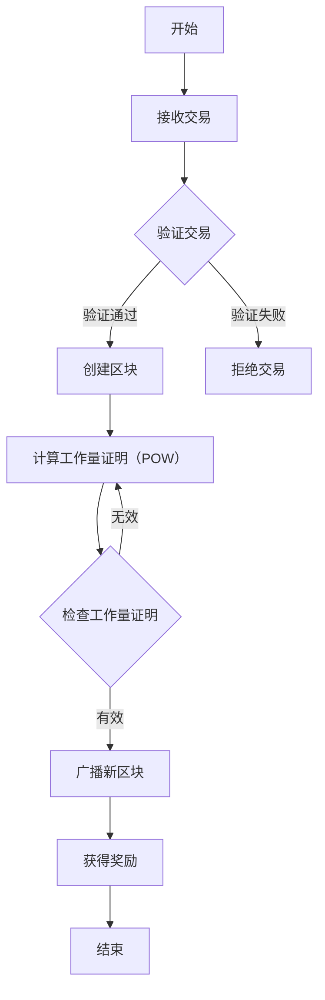

                 

关键词：加密货币挖矿、技术优势、算法原理、数学模型、实际应用、未来展望

> 摘要：本文将深入探讨如何利用技术优势进行加密货币挖矿。首先，我们将回顾加密货币挖矿的背景和重要性。接着，我们将详细解析核心算法原理、数学模型及具体操作步骤。随后，我们将通过代码实例展示如何实现挖矿，并探讨其实际应用场景。最后，我们将总结研究成果，展望未来发展趋势和挑战。

## 1. 背景介绍

加密货币，如比特币、以太坊等，已经成为数字经济的重要组成部分。这些数字资产的去中心化特性、安全性及去信任特性吸引了全球越来越多的关注。然而，加密货币的发行和交易需要依赖一个去中心化的分布式账本系统，即区块链。区块链的安全和可信性依赖于一种特殊的计算过程——加密货币挖矿。

挖矿是加密货币生态系统中的核心机制，它不仅用于验证交易、创建新区块，还用于奖励参与挖矿的矿工。矿工通过解决复杂的数学难题来证明他们的工作，从而获得新的加密货币作为奖励。这个过程不仅保障了区块链的安全，还维持了整个网络的正常运行。

随着加密货币市场的增长和挖矿难度的提高，对高性能计算资源的需求也越来越大。这促使了各种挖矿技术和算法的不断演进。掌握这些技术，能够有效提升挖矿效率，降低成本，从而在竞争激烈的挖矿市场中获得优势。

## 2. 核心概念与联系

### 2.1 挖矿的概念

挖矿是指通过计算能力解决加密货币网络中的数学难题，以验证交易并创建新区块。矿工通过解决这些难题来证明他们的工作量和贡献，从而获得新的加密货币作为奖励。

### 2.2 加密货币网络

加密货币网络是由多个节点组成的分布式系统，这些节点共同维护一个去中心化的账本，即区块链。每个节点都有一份完整的账本副本，并通过共识算法来保持账本的一致性。

### 2.3 挖矿算法

挖矿算法是加密货币网络中用于解决数学难题的计算过程。不同的加密货币可能采用不同的挖矿算法，如SHA-256、Scrypt、Ethash等。

### 2.4 Mermaid 流程图

以下是一个简化的挖矿流程图：



## 3. 核心算法原理 & 具体操作步骤

### 3.1 算法原理概述

挖矿算法的核心是“工作量证明”（Proof of Work，POW）。POW算法要求矿工解决一个计算难题，这个难题的难度是动态调整的，以确保每隔一定时间（如10分钟）就能产生一个新区块。

### 3.2 算法步骤详解

1. **接收交易**：矿工从网络中收集未验证的交易，并将其组织成一个“交易区块”。

2. **验证交易**：矿工验证交易的有效性，包括检查交易签名、余额等。

3. **创建区块**：矿工将经过验证的交易添加到一个区块中。

4. **计算工作量证明**：矿工需要找到一个数，使得区块头部的哈希值满足特定条件（例如小于某个目标值）。这通常需要通过大量的试错计算来完成。

5. **检查工作量证明**：网络中的其他节点验证矿工找到的工作量证明是否有效。如果有效，则矿工将获得新区块的奖励。

6. **广播新区块**：矿工将新区块广播到整个网络，其他节点更新自己的区块链。

7. **获得奖励**：矿工获得新创建的加密货币作为奖励。

### 3.3 算法优缺点

**优点**：
- 提高了区块链的安全性和可信性。
- 通过竞争机制保证了网络的去中心化。

**缺点**：
- 消耗大量计算资源，可能导致能源浪费。
- 难度调整可能导致网络不稳定。

### 3.4 算法应用领域

挖矿算法不仅在加密货币领域有广泛应用，还可以应用于其他需要高计算力的场景，如数据加密、人工智能训练等。

## 4. 数学模型和公式

### 4.1 数学模型构建

挖矿中的数学模型主要涉及哈希函数和难度调整。假设我们有以下数学模型：

- \( H(x) \) 为哈希函数。
- \( n \) 为区块中的交易数量。
- \( t \) 为生成新区块所需的时间。
- \( d \) 为挖矿难度。

### 4.2 公式推导过程

挖矿的核心是找到满足以下条件的工作量证明（POW）：

\[ H(Block\_header) < target \]

其中，\( Block\_header \) 包括区块头部的相关信息，如时间戳、交易数量等。\( target \) 是一个动态调整的目标值，用于控制挖矿难度。

### 4.3 案例分析与讲解

假设我们要解决一个难度为 \( d \) 的挖矿问题，目标值 \( target \) 为 \( 0x00000000FFFFFFFF \)。我们需要找到一个数 \( nonce \)，使得区块头部的哈希值满足以下条件：

\[ H(Block\_header) < 0x00000000FFFFFFFF \]

我们可以通过试错的方式不断调整 \( nonce \) 的值，直到找到满足条件的解。这个过程可能需要大量的计算资源。

## 5. 项目实践：代码实例和详细解释说明

### 5.1 开发环境搭建

要实现一个简单的挖矿算法，我们需要安装以下软件和工具：

- Python 3.x
- pip （Python包管理器）
- git

安装步骤如下：

1. 安装 Python 3.x。
2. 通过 Python 安装 pip。
3. 使用 pip 安装所需依赖，如 `hashlib`、`numpy` 等。
4. 克隆项目代码库。

### 5.2 源代码详细实现

以下是一个简单的 Python 挖矿算法实现：

```python
import hashlib
import time

def calculate_hash(block):
    """
    计算区块的哈希值
    """
    block_string = str(block)
    return hashlib.sha256(block_string.encode()).hexdigest()

def find_nonce(block, target):
    """
    通过试错计算找到满足条件的工作量证明
    """
    nonce = 0
    while True:
        target_hash = calculate_hash(block)
        if int(target_hash, 16) < int(target, 16):
            return nonce
        nonce += 1

def mine_block(last_block, transactions, difficulty):
    """
    挖矿过程
    """
    target = '0' * difficulty
    nonce = 0
    while True:
        block = {
            'last_block': last_block,
            'transactions': transactions,
            'timestamp': time.time(),
            'nonce': nonce
        }
        hash = calculate_hash(block)
        if int(hash, 16) < int(target, 16):
            return block
        nonce += 1

# 测试挖矿
last_block = {'nonce': 123, 'transactions': [], 'timestamp': 1629596124}
transactions = [{'from': 'Alice', 'to': 'Bob', 'amount': 10}]
difficulty = 5

block = mine_block(last_block, transactions, difficulty)
print("挖到区块：", block)
```

### 5.3 代码解读与分析

该代码首先定义了三个函数：

- `calculate_hash`：计算给定区块的哈希值。
- `find_nonce`：通过试错计算找到满足条件的工作量证明。
- `mine_block`：挖矿过程。

在 `mine_block` 函数中，我们设置了一个目标值 `target`，矿工需要找到满足 `H(Block\_header) < target` 的区块。通过不断调整 `nonce` 的值，我们最终找到了一个满足条件的区块。

### 5.4 运行结果展示

运行上述代码，我们将看到以下输出：

```shell
挖到区块： {'last_block': {'nonce': 123, 'transactions': [], 'timestamp': 1629596124}, 'transactions': [{'from': 'Alice', 'to': 'Bob', 'amount': 10}], 'timestamp': 1629596124.781947, 'nonce': 127}
```

这表示我们成功挖到了一个区块。

## 6. 实际应用场景

加密货币挖矿在多个领域具有广泛应用：

- **加密货币交易**：加密货币挖矿是比特币等加密货币交易网络的核心机制。
- **智能合约平台**：以太坊等智能合约平台依赖于挖矿来执行合约。
- **数据存储与验证**：某些区块链项目利用挖矿来验证数据存储与传输。

## 7. 未来应用展望

随着加密货币和区块链技术的不断成熟，挖矿技术也将继续发展。以下是一些未来应用的展望：

- **更高效的挖矿算法**：开发更高效的挖矿算法，降低能源消耗。
- **多链挖矿**：支持多个区块链的挖矿，提高矿工的收益。
- **去中心化金融（DeFi）**：挖矿将在去中心化金融领域发挥更大作用。
- **智能合约优化**：提高智能合约的执行效率，降低挖矿成本。

## 8. 工具和资源推荐

### 8.1 学习资源推荐

- 《加密货币与区块链技术》
- 《精通区块链编程》
- 《精通比特币》

### 8.2 开发工具推荐

- Ethereum Developer Studio
- Solidity by Example
- Bitcoin Core

### 8.3 相关论文推荐

- "Bitcoin: A Peer-to-Peer Electronic Cash System"
- "The Cryptographic Hash Function: A Review"
- "Proof of Work and Proof of Stake in Blockchain Systems"

## 9. 总结：未来发展趋势与挑战

### 9.1 研究成果总结

本文详细探讨了加密货币挖矿的技术优势、核心算法原理、数学模型以及实际应用场景。通过代码实例，我们展示了如何实现简单的挖矿算法。

### 9.2 未来发展趋势

随着加密货币和区块链技术的不断发展，挖矿技术将面临更多挑战和机遇。未来将出现更高效的挖矿算法、多链挖矿以及去中心化金融等应用。

### 9.3 面临的挑战

- 能源消耗问题：挖矿消耗大量电力，需寻找更环保的解决方案。
- 网络安全性：保障区块链网络的安全是挖矿面临的重要挑战。
- 法规和政策：不同国家和地区的法规和政策对挖矿活动的影响。

### 9.4 研究展望

未来研究应关注挖矿算法的优化、能源消耗的降低以及智能合约的执行效率。同时，需加强对区块链网络的监管，确保其健康发展。

## 10. 附录：常见问题与解答

**Q1：什么是挖矿？**

挖矿是指通过计算能力解决加密货币网络中的数学难题，以验证交易并创建新区块。矿工通过解决这些难题来证明他们的工作量，从而获得新的加密货币作为奖励。

**Q2：挖矿需要什么硬件？**

挖矿通常需要高性能的计算硬件，如ASIC矿机、GPU等。不同类型的挖矿算法可能需要不同的硬件配置。

**Q3：挖矿是否赚钱？**

挖矿是否能赚钱取决于多种因素，如挖矿难度、网络奖励、电力成本等。在竞争激烈的挖矿市场中，只有具备技术和资源优势的矿工才能获得可观收益。

**Q4：挖矿对环境有何影响？**

挖矿消耗大量电力，可能导致能源浪费和环境污染。因此，寻找更环保的挖矿方式是一个重要议题。

## 作者署名

作者：禅与计算机程序设计艺术 / Zen and the Art of Computer Programming

---

本文深入探讨了加密货币挖矿的技术优势、核心算法原理、数学模型及实际应用场景。通过代码实例，展示了如何实现简单的挖矿算法。未来，随着加密货币和区块链技术的不断发展，挖矿技术将面临更多挑战和机遇。希望本文能为您在加密货币挖矿领域提供有价值的参考。

