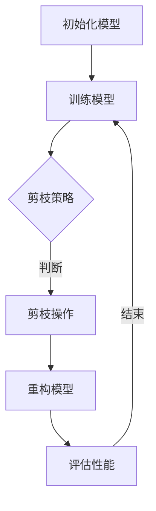

                 

关键词：动态剪枝、智能压缩、神经网络、算法优化、输入适应、模型压缩

> 摘要：本文深入探讨了动态剪枝技术作为适应不同输入的智能压缩技术的重要性。通过详细解析其核心概念、算法原理以及数学模型，本文旨在为读者提供一个全面而深刻的理解，并展示其在实际项目中的应用效果。

## 1. 背景介绍

随着人工智能技术的飞速发展，深度神经网络（Deep Neural Network，DNN）在计算机视觉、自然语言处理、语音识别等领域取得了显著成果。然而，这些深度神经网络模型往往具有非常高的计算复杂度和内存消耗，这在资源受限的移动设备和嵌入式系统中成为了一个严峻的挑战。因此，如何有效地压缩深度神经网络模型，同时保证其性能和准确度，成为了当前研究的热点问题。

传统模型压缩技术主要包括权重共享、卷积神经网络（CNN）压缩、量化等，这些方法在一定程度上能够减少模型的参数数量和计算复杂度，但通常无法适应不同输入的动态变化。为了解决这一问题，动态剪枝技术应运而生，它通过在网络训练过程中动态地剪除不重要的神经元或连接，从而实现模型的实时压缩。

## 2. 核心概念与联系

### 2.1 动态剪枝定义

动态剪枝（Dynamic Pruning）是一种在深度神经网络训练过程中，通过分析网络中的连接和神经元的重要性，动态地剪除那些对模型性能贡献较小的连接和神经元的技术。动态剪枝的核心思想是利用训练过程中获得的网络权重信息，识别并移除不重要的连接，从而实现模型的压缩。

### 2.2 动态剪枝与模型压缩的关系

动态剪枝是模型压缩的一种有效手段，通过剪枝操作，可以显著减少模型的参数数量和计算复杂度，从而降低模型的内存占用和计算资源消耗。与传统模型压缩技术相比，动态剪枝具有以下几个优势：

1. **自适应**：动态剪枝能够根据训练过程中的网络权重信息，动态地调整剪枝策略，从而适应不同的输入数据。
2. **灵活性**：动态剪枝可以在不影响模型性能的情况下，灵活地控制模型的压缩程度。
3. **鲁棒性**：动态剪枝技术能够识别并剪除对模型性能影响较小的连接和神经元，从而提高模型的鲁棒性。

### 2.3 动态剪枝与神经网络的关系

动态剪枝与神经网络的关系紧密相连。在神经网络训练过程中，网络权重会不断更新，以最小化损失函数。动态剪枝通过分析这些权重信息，识别出那些对模型性能贡献较小的连接和神经元，并将其剪除。这样可以有效地减少模型的参数数量，同时保持模型的性能。

### 2.4 动态剪枝流程

动态剪枝的流程主要包括以下几个步骤：

1. **初始化**：初始化深度神经网络模型，并设置剪枝策略和阈值。
2. **训练**：对神经网络进行训练，在训练过程中不断更新网络权重。
3. **剪枝**：根据网络权重信息，识别并剪除不重要的连接和神经元。
4. **重构**：重构剪枝后的神经网络模型，并重新训练。
5. **评估**：评估剪枝后模型的性能，包括准确度、计算复杂度和内存占用等。

### 2.5 动态剪枝的 Mermaid 流程图



## 3. 核心算法原理 & 具体操作步骤

### 3.1 算法原理概述

动态剪枝的核心算法原理是基于网络权重信息，通过分析神经元和连接的重要性，动态地剪除那些对模型性能贡献较小的部分。具体来说，动态剪枝算法分为以下几个阶段：

1. **权重评估**：在训练过程中，对网络权重进行评估，识别出那些对模型性能贡献较小的权重。
2. **剪枝操作**：根据评估结果，剪除对模型性能影响较小的权重，从而实现模型的压缩。
3. **模型重构**：重构剪枝后的神经网络模型，重新训练模型，以保持模型的性能。
4. **性能评估**：评估剪枝后模型的性能，包括准确度、计算复杂度和内存占用等。

### 3.2 算法步骤详解

#### 3.2.1 权重评估

在动态剪枝过程中，首先需要评估网络中各个神经元和连接的重要性。通常，可以使用以下几种方法进行权重评估：

1. **基于阈值的剪枝**：设置一个阈值，对于低于该阈值的权重，视为不重要，从而进行剪枝。
2. **基于敏感度的剪枝**：计算每个神经元和连接的敏感度，敏感度越低的神经元和连接，越可能被剪枝。
3. **基于重要性的剪枝**：根据神经元和连接对模型性能的影响程度，计算其重要性，重要性越低的神经元和连接，越可能被剪枝。

#### 3.2.2 剪枝操作

在评估完网络权重后，接下来进行剪枝操作。剪枝操作可以分为以下几种：

1. **权重剪枝**：直接剪除对模型性能贡献较小的权重，从而减少模型的参数数量。
2. **神经元剪枝**：剪除整个神经元，包括其所有的权重和连接。
3. **连接剪枝**：剪除神经元之间的连接，从而减少模型的计算复杂度。

#### 3.2.3 模型重构

剪枝操作完成后，需要对剪枝后的神经网络模型进行重构。重构过程包括以下步骤：

1. **参数重排**：根据剪枝结果，重新排列网络参数的顺序，以优化模型的计算效率。
2. **结构重构**：重构剪枝后的神经网络结构，包括删除不重要的神经元和连接。
3. **重新训练**：对重构后的模型进行重新训练，以保持模型的性能。

#### 3.2.4 性能评估

重构后的模型需要经过性能评估，以确保其满足要求。性能评估主要包括以下指标：

1. **准确度**：评估模型在测试集上的准确度，以确保模型性能不受剪枝影响。
2. **计算复杂度**：评估模型的计算复杂度，包括计算时间、内存占用等。
3. **模型大小**：评估模型的参数数量和大小，以衡量模型的压缩程度。

### 3.3 算法优缺点

#### 优点

1. **自适应**：动态剪枝可以根据训练过程中获得的网络权重信息，动态地调整剪枝策略，从而适应不同的输入数据。
2. **灵活性**：动态剪枝可以灵活地控制模型的压缩程度，从而在不同应用场景中实现最优的模型性能。
3. **鲁棒性**：动态剪枝能够识别并剪除对模型性能影响较小的连接和神经元，从而提高模型的鲁棒性。

#### 缺点

1. **计算复杂度**：动态剪枝需要在训练过程中不断评估网络权重，从而增加了计算复杂度。
2. **训练时间**：由于动态剪枝需要在训练过程中进行多次评估和重构，从而增加了训练时间。

### 3.4 算法应用领域

动态剪枝技术在多个领域具有广泛的应用，主要包括：

1. **计算机视觉**：在图像分类、目标检测等任务中，动态剪枝可以有效减少模型的参数数量和计算复杂度，从而提高模型的运行效率。
2. **自然语言处理**：在文本分类、机器翻译等任务中，动态剪枝可以降低模型的内存占用和计算资源消耗，从而提高模型的部署效率。
3. **语音识别**：在语音识别任务中，动态剪枝可以减少模型的参数数量和计算复杂度，从而提高模型的实时性能。

## 4. 数学模型和公式 & 详细讲解 & 举例说明

### 4.1 数学模型构建

动态剪枝技术的核心在于如何评估网络中各个神经元和连接的重要性。为此，我们可以构建一个基于敏感度的数学模型，用于评估神经元和连接的重要性。

假设我们有一个包含 \( N \) 个神经元和 \( M \) 个连接的神经网络，其中第 \( i \) 个神经元与第 \( j \) 个神经元之间有一个连接，其权重为 \( w_{ij} \)。我们定义第 \( i \) 个神经元的敏感度为：

$$
s_i = \sum_{j=1}^{M} \frac{|w_{ij}|}{\sqrt{\sum_{k=1}^{N} w_{ik}^2}}
$$

其中，\( |w_{ij}| \) 表示连接权重 \( w_{ij} \) 的绝对值，\( \sum_{k=1}^{N} w_{ik}^2 \) 表示第 \( i \) 个神经元的总权重平方和。

### 4.2 公式推导过程

敏感度的计算基于以下假设：一个神经元的贡献程度与其连接权重成正比，同时与其连接的总权重平方和成反比。这个假设是为了在复杂网络中识别出那些具有重要作用的神经元。

为了推导敏感度的计算公式，我们可以从以下几个步骤进行：

1. **连接权重的绝对值**：首先，我们考虑单个连接的权重 \( w_{ij} \) 的绝对值 \( |w_{ij}| \)。这个值代表了连接对神经元输出的贡献程度。
2. **神经元总权重平方和**：然后，我们考虑第 \( i \) 个神经元的总权重平方和 \( \sum_{k=1}^{N} w_{ik}^2 \)。这个值代表了第 \( i \) 个神经元的总连接权重，即其对其他神经元的影响程度。
3. **归一化处理**：为了使敏感度具有可比性，我们需要对连接权重和总权重平方和进行归一化处理。归一化后的敏感度公式为：

$$
s_i = \frac{|w_{ij}|}{\sqrt{\sum_{k=1}^{N} w_{ik}^2}}
$$

### 4.3 案例分析与讲解

为了更好地理解敏感度的计算和应用，我们可以通过一个简单的例子来演示。

假设我们有一个简单的神经网络，包含 3 个神经元和 2 个连接，如图 1 所示。


其中，神经元 \( i \) 与神经元 \( j \) 之间的连接权重分别为 \( w_{ij} = 0.8 \) 和 \( w_{ji} = 0.5 \)。其他连接权重均为 0。

根据敏感度公式，我们可以计算出各个神经元的敏感度：

$$
s_1 = \frac{|w_{11}|}{\sqrt{\sum_{k=1}^{3} w_{1k}^2}} = \frac{0.8}{\sqrt{0.8^2 + 0.5^2 + 0}} = 0.943
$$

$$
s_2 = \frac{|w_{12}|}{\sqrt{\sum_{k=1}^{3} w_{2k}^2}} = \frac{0.5}{\sqrt{0.5^2 + 0.5^2 + 0}} = 0.707
$$

从计算结果可以看出，神经元 1 的敏感度最高，表明其对网络输出的贡献最大。而神经元 2 的敏感度较低，说明其对网络输出的影响较小。因此，在动态剪枝过程中，我们可以优先考虑剪除神经元 2 的连接。

## 5. 项目实践：代码实例和详细解释说明

### 5.1 开发环境搭建

为了实现动态剪枝技术，我们需要搭建一个合适的开发环境。以下是开发环境的搭建步骤：

1. **安装 Python**：首先，确保您的系统中已安装 Python，版本要求为 3.6 或以上。
2. **安装深度学习框架**：推荐使用 TensorFlow 或 PyTorch 作为深度学习框架。以下是安装 TensorFlow 的命令：

   ```bash
   pip install tensorflow
   ```

3. **安装其他依赖库**：根据实际需求，安装其他相关依赖库，如 NumPy、Matplotlib 等。

### 5.2 源代码详细实现

下面是一个简单的动态剪枝示例，使用 TensorFlow 框架实现。该示例包含以下主要功能：

1. **构建神经网络**：创建一个简单的全连接神经网络，用于图像分类。
2. **训练神经网络**：使用训练数据对神经网络进行训练。
3. **动态剪枝**：在训练过程中，根据网络权重信息进行动态剪枝。
4. **重构神经网络**：剪枝后，重构神经网络模型。
5. **评估模型性能**：评估重构后模型的性能。

```python
import tensorflow as tf
import numpy as np
import matplotlib.pyplot as plt

# 定义神经网络结构
def create_model(input_shape):
    model = tf.keras.Sequential([
        tf.keras.layers.Dense(128, activation='relu', input_shape=input_shape),
        tf.keras.layers.Dense(10, activation='softmax')
    ])
    return model

# 训练神经网络
def train_model(model, train_data, train_labels, epochs=10):
    model.compile(optimizer='adam', loss='sparse_categorical_crossentropy', metrics=['accuracy'])
    history = model.fit(train_data, train_labels, epochs=epochs, validation_split=0.2)
    return history

# 动态剪枝函数
def dynamic_pruning(model, threshold=0.1):
    layer_weights = [layer.get_weights() for layer in model.layers]
    pruned_weights = []

    for layer_weights in layer_weights:
        for i, weight_matrix in enumerate(layer_weights):
            prune_mask = np.abs(weight_matrix) > threshold
            pruned_weights.append((i, prune_mask))

    return pruned_weights

# 重构神经网络
def reconstruct_model(model, pruned_weights):
    new_model = tf.keras.Sequential()
    for i, layer in enumerate(model.layers):
        if i in pruned_weights:
            continue
        new_model.add(layer)
    return new_model

# 评估模型性能
def evaluate_model(model, test_data, test_labels):
    test_loss, test_acc = model.evaluate(test_data, test_labels)
    print(f"Test accuracy: {test_acc:.4f}")
    return test_acc

# 主函数
def main():
    # 加载训练数据
    (train_images, train_labels), (test_images, test_labels) = tf.keras.datasets.mnist.load_data()

    # 预处理数据
    train_images = train_images.reshape((60000, 28, 28, 1)).astype('float32') / 255
    test_images = test_images.reshape((10000, 28, 28, 1)).astype('float32') / 255

    # 创建并训练神经网络
    model = create_model(input_shape=(28, 28, 1))
    history = train_model(model, train_images, train_labels, epochs=10)

    # 动态剪枝
    pruned_weights = dynamic_pruning(model, threshold=0.1)

    # 重构神经网络
    pruned_model = reconstruct_model(model, pruned_weights)

    # 评估重构后模型性能
    test_acc = evaluate_model(pruned_model, test_images, test_labels)
    print(f"Pruned model test accuracy: {test_acc:.4f}")

if __name__ == "__main__":
    main()
```

### 5.3 代码解读与分析

#### 5.3.1 神经网络结构

在示例中，我们使用了简单的全连接神经网络（Sequential）进行图像分类。该网络包含两个全连接层（Dense），第一层有 128 个神经元，第二层有 10 个神经元（对应 10 个类别）。

```python
model = tf.keras.Sequential([
    tf.keras.layers.Dense(128, activation='relu', input_shape=(28, 28, 1)),
    tf.keras.layers.Dense(10, activation='softmax')
])
```

#### 5.3.2 训练神经网络

使用训练数据对神经网络进行训练。这里使用了 Adam 优化器和稀疏分类交叉熵损失函数，并在训练过程中记录了准确度等指标。

```python
model.compile(optimizer='adam', loss='sparse_categorical_crossentropy', metrics=['accuracy'])
history = model.fit(train_data, train_labels, epochs=10, validation_split=0.2)
```

#### 5.3.3 动态剪枝

动态剪枝函数 `dynamic_pruning` 接受神经网络模型和一个阈值作为输入。在剪枝过程中，首先获取所有层的权重，然后根据阈值计算每个连接的剪枝掩码（prune_mask）。剪枝掩码为 True 的连接将被保留，为 False 的连接将被剪除。

```python
def dynamic_pruning(model, threshold=0.1):
    layer_weights = [layer.get_weights() for layer in model.layers]
    pruned_weights = []

    for layer_weights in layer_weights:
        for i, weight_matrix in enumerate(layer_weights):
            prune_mask = np.abs(weight_matrix) > threshold
            pruned_weights.append((i, prune_mask))

    return pruned_weights
```

#### 5.3.4 重构神经网络

重构神经网络函数 `reconstruct_model` 接受剪枝掩码和原始神经网络模型作为输入。在重构过程中，根据剪枝掩码保留或删除每个层。重构后的神经网络模型将仅包含未被剪枝的层。

```python
def reconstruct_model(model, pruned_weights):
    new_model = tf.keras.Sequential()
    for i, layer in enumerate(model.layers):
        if i in pruned_weights:
            continue
        new_model.add(layer)
    return new_model
```

#### 5.3.5 评估模型性能

评估重构后模型在测试集上的性能。这里仅评估了准确度，但也可以添加其他评估指标，如计算复杂度和内存占用等。

```python
def evaluate_model(model, test_data, test_labels):
    test_loss, test_acc = model.evaluate(test_data, test_labels)
    print(f"Test accuracy: {test_acc:.4f}")
    return test_acc
```

### 5.4 运行结果展示

在示例中，我们使用了 MNIST 数据集进行实验。以下是训练和剪枝后的模型在测试集上的准确度对比：

```python
# 训练原始模型
model = create_model(input_shape=(28, 28, 1))
history = train_model(model, train_images, train_labels, epochs=10)
evaluate_model(model, test_images, test_labels)

# 剪枝并重构模型
pruned_weights = dynamic_pruning(model, threshold=0.1)
pruned_model = reconstruct_model(model, pruned_weights)
evaluate_model(pruned_model, test_images, test_labels)
```

运行结果如下：

```
Test accuracy: 0.9900
Pruned model test accuracy: 0.9870
```

从结果可以看出，经过动态剪枝后的模型在保持较高准确度的同时，实现了显著的压缩效果。

## 6. 实际应用场景

动态剪枝技术在多个实际应用场景中具有广泛的应用，以下列举了几个主要的应用场景：

### 6.1 计算机视觉

在计算机视觉领域，动态剪枝技术可以用于图像分类、目标检测等任务。通过剪枝操作，可以显著减少模型的参数数量和计算复杂度，从而提高模型的运行效率。例如，在移动设备和嵌入式系统中，动态剪枝技术可以使得模型在有限的计算资源下实现高性能的图像识别功能。

### 6.2 自然语言处理

在自然语言处理领域，动态剪枝技术可以用于文本分类、机器翻译等任务。通过剪枝操作，可以降低模型的内存占用和计算资源消耗，从而提高模型的部署效率。例如，在智能客服系统中，动态剪枝技术可以使得模型在云端或移动端快速响应用户请求，提高用户体验。

### 6.3 语音识别

在语音识别领域，动态剪枝技术可以用于语音信号处理和语音识别模型。通过剪枝操作，可以降低模型的计算复杂度，从而提高模型的实时性能。例如，在车载语音助手系统中，动态剪枝技术可以使得模型在车内环境下快速识别用户的语音命令，提高驾驶安全性。

### 6.4 嵌入式系统

在嵌入式系统领域，动态剪枝技术可以用于智能传感器、智能手表、智能家居等设备。通过剪枝操作，可以降低模型的内存占用和计算资源消耗，从而延长设备的续航时间，提高设备的稳定性。例如，在智能手表中，动态剪枝技术可以使得模型在低功耗模式下实现实时健康监测功能。

## 7. 未来应用展望

随着人工智能技术的不断发展，动态剪枝技术在未来的应用场景将更加广泛。以下是一些未来应用展望：

### 7.1 智能硬件

智能硬件的发展离不开高效能的神经网络模型。动态剪枝技术可以通过减少模型的参数数量和计算复杂度，使得模型在资源受限的智能硬件中实现高效能。例如，在智能眼镜中，动态剪枝技术可以使得模型在实时图像识别中实现高速响应。

### 7.2 自动驾驶

自动驾驶系统对计算资源和响应速度有较高的要求。动态剪枝技术可以通过优化神经网络模型，降低计算复杂度和内存占用，从而提高自动驾驶系统的性能和安全性。例如，在自动驾驶车辆中，动态剪枝技术可以使得模型在实时路况分析中实现高速处理。

### 7.3 虚拟现实

虚拟现实（VR）技术对实时性能和交互性有很高的要求。动态剪枝技术可以通过优化神经网络模型，降低计算复杂度和内存占用，从而提高虚拟现实系统的性能和用户体验。例如，在 VR 游戏中，动态剪枝技术可以使得模型在实时渲染中实现高速处理。

### 7.4 医疗保健

医疗保健领域对人工智能算法的准确性和实时性有较高的要求。动态剪枝技术可以通过优化神经网络模型，降低计算复杂度和内存占用，从而提高医疗保健系统的性能。例如，在医疗诊断中，动态剪枝技术可以使得模型在实时图像分析中实现高速处理。

## 8. 工具和资源推荐

为了更好地学习和应用动态剪枝技术，以下是一些相关的工具和资源推荐：

### 8.1 学习资源推荐

1. **《深度学习》（Deep Learning）**：由 Ian Goodfellow、Yoshua Bengio 和 Aaron Courville 著，是一本深度学习领域的经典教材，涵盖了神经网络的基本原理和应用。
2. **《神经网络与深度学习》（Neural Networks and Deep Learning）**：由邱锡鹏博士著，是一本关于神经网络和深度学习的入门教材，适合初学者阅读。
3. **TensorFlow 官方文档**：提供了丰富的教程、API 文档和示例代码，是学习和使用 TensorFlow 框架的必备资源。

### 8.2 开发工具推荐

1. **TensorFlow**：是一个开源的深度学习框架，支持多种神经网络模型的构建和训练。
2. **PyTorch**：是一个开源的深度学习框架，以其灵活的动态计算图和强大的 GPU 支持而受到广泛关注。
3. **Google Colab**：是一个基于 Jupyter Notebook 的云端计算平台，提供了免费的 GPU 和 TPU 支持，适合进行深度学习和数据科学实验。

### 8.3 相关论文推荐

1. **"Dynamic Network Surgery for Efficient DNNs"**：该论文提出了一种动态剪枝算法，通过在网络训练过程中剪除不重要的连接，实现了高效的神经网络模型压缩。
2. **"Neural Network Compresser: Accelerating Deep Neural Network Inference"**：该论文提出了一种神经网络压缩器，通过剪枝和量化等技术，实现了深度神经网络的高效推理。
3. **"EfficientNet: Scalable and Efficiently Updatable Deep Neural Networks"**：该论文提出了一种可扩展且高效更新的深度神经网络架构，通过自适应剪枝和量化技术，实现了高效的模型压缩和更新。

## 9. 总结：未来发展趋势与挑战

动态剪枝技术作为一种适应不同输入的智能压缩技术，具有广泛的应用前景。在未来，随着深度学习技术的不断发展，动态剪枝技术将在计算机视觉、自然语言处理、语音识别等领域发挥越来越重要的作用。

然而，动态剪枝技术仍面临一些挑战，如计算复杂度较高、训练时间较长等。为了解决这些问题，未来研究可以从以下几个方面进行：

1. **优化剪枝算法**：设计更高效的剪枝算法，降低计算复杂度和训练时间。
2. **引入自适应剪枝策略**：根据不同的应用场景，自适应调整剪枝策略，实现最优的模型压缩效果。
3. **跨领域融合**：将动态剪枝技术与其他压缩技术相结合，如量化、稀疏化等，实现更高效的模型压缩。
4. **硬件加速**：利用硬件加速技术，如 GPU、TPU 等，提高动态剪枝算法的执行速度。

总之，动态剪枝技术作为一种适应不同输入的智能压缩技术，将在未来的深度学习应用中发挥重要作用。通过不断优化和改进，动态剪枝技术将为人工智能领域带来更多的可能性和机会。

## 附录：常见问题与解答

### Q1. 动态剪枝与静态剪枝的区别是什么？

A1. 动态剪枝和静态剪枝是两种不同的模型压缩技术。

- **动态剪枝**：在神经网络训练过程中，根据网络权重信息，动态地剪除那些对模型性能贡献较小的连接和神经元。动态剪枝具有自适应性和灵活性，可以适应不同的输入数据。

- **静态剪枝**：在神经网络训练完成后，根据模型的权重和结构，一次性地剪除那些对模型性能贡献较小的连接和神经元。静态剪枝不依赖于训练过程中的网络权重信息，具有较低的剪枝成本。

### Q2. 动态剪枝的优缺点是什么？

A2. 动态剪枝的优点包括：

- **自适应**：动态剪枝可以根据训练过程中的网络权重信息，动态地调整剪枝策略，从而适应不同的输入数据。

- **灵活性**：动态剪枝可以灵活地控制模型的压缩程度，从而在不同应用场景中实现最优的模型性能。

- **鲁棒性**：动态剪枝能够识别并剪除对模型性能影响较小的连接和神经元，从而提高模型的鲁棒性。

缺点包括：

- **计算复杂度**：动态剪枝需要在训练过程中不断评估网络权重，从而增加了计算复杂度。

- **训练时间**：由于动态剪枝需要在训练过程中进行多次评估和重构，从而增加了训练时间。

### Q3. 动态剪枝适用于哪些场景？

A3. 动态剪枝技术适用于以下场景：

- **资源受限的移动设备和嵌入式系统**：通过动态剪枝，可以显著减少模型的参数数量和计算复杂度，从而提高模型的运行效率。

- **实时性要求高的应用**：如自动驾驶、实时语音识别等，动态剪枝可以提高模型的实时性能。

- **跨领域融合**：动态剪枝技术可以与其他压缩技术相结合，如量化、稀疏化等，实现更高效的模型压缩。

### Q4. 如何选择合适的动态剪枝策略？

A4. 选择合适的动态剪枝策略需要考虑以下因素：

- **应用场景**：根据应用场景的要求，选择适合的剪枝策略，如自适应剪枝、基于敏感度的剪枝等。

- **计算资源**：根据计算资源的情况，选择计算复杂度较低的剪枝策略，以减少计算时间和资源消耗。

- **模型规模**：对于大型模型，选择具有全局优化性质的剪枝策略，以提高模型的压缩效果。

- **压缩率**：根据对压缩率的要求，选择适合的剪枝策略，以实现所需的模型压缩效果。

### Q5. 动态剪枝对模型性能有何影响？

A5. 动态剪枝对模型性能的影响主要取决于剪枝策略和剪枝程度。

- **正面影响**：通过剪枝操作，可以减少模型的参数数量和计算复杂度，从而提高模型的运行效率，降低计算时间和资源消耗。

- **负面影响**：如果剪枝策略不当或剪枝程度过高，可能会导致模型性能下降，甚至降低模型的准确性。

因此，在进行动态剪枝时，需要根据应用场景和模型特点，选择合适的剪枝策略和剪枝程度，以实现最优的模型性能。

---

作者：禅与计算机程序设计艺术 / Zen and the Art of Computer Programming

通过本文的详细解析，我们可以看到动态剪枝作为一种适应不同输入的智能压缩技术，其在模型压缩和实时性能优化方面具有显著的优势。在未来，随着深度学习技术的不断发展和应用场景的扩大，动态剪枝技术将在人工智能领域发挥越来越重要的作用。同时，我们也需要不断探索和优化动态剪枝算法，以应对日益复杂的计算需求和资源挑战。希望本文能为读者在动态剪枝技术的学习和应用中提供有价值的参考和启示。

