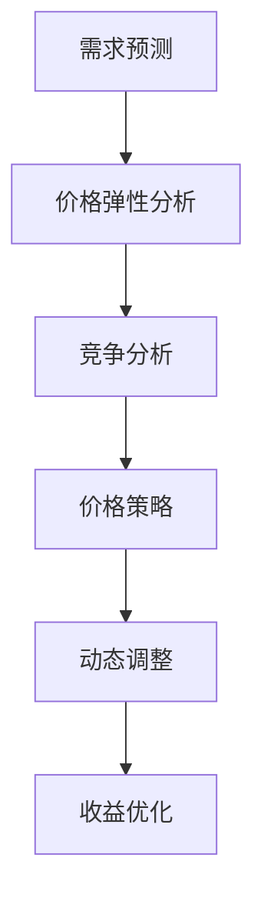

                 

关键词：电商、动态定价、价格策略、需求预测、算法、消费者行为

> 摘要：随着电商行业的迅猛发展，如何通过精准的定价策略提升竞争力、最大化收益成为关键问题。本文将探讨动态定价技术在电商中的应用，分析其核心概念、算法原理、数学模型以及实际操作步骤，并结合案例进行深入剖析，展望动态定价技术的未来发展方向。

## 1. 背景介绍

### 1.1 电商行业的发展现状

近年来，全球电商市场规模持续扩大，消费习惯逐渐向线上转移。根据Statista的数据，2020年全球电商市场规模已达到3.5万亿美元，预计到2024年将达到6.8万亿美元。电商行业的高增长吸引了大量企业和资本进入，市场竞争日益激烈。

### 1.2 定价策略的重要性

在电商环境中，定价策略对企业盈利能力至关重要。合理的定价策略不仅能提升产品竞争力，还能优化库存管理、增加销售额和市场份额。传统的定价方法通常基于成本加成、竞争定价或心理定价等，但难以应对市场的实时变化和消费者的多样化需求。

### 1.3 动态定价技术的出现

动态定价技术通过实时分析和预测市场需求、消费者行为等因素，动态调整商品价格，实现最优定价策略。这一技术的出现为电商企业提供了更灵活的定价手段，有助于提高利润率和市场竞争力。

## 2. 核心概念与联系

动态定价技术涉及多个核心概念，如需求预测、价格弹性、竞争分析等。以下是一个简化的Mermaid流程图，展示了这些概念之间的联系：



### 2.1 需求预测

需求预测是动态定价的基础。通过分析历史销售数据、市场趋势、季节性因素等，预测未来某一时间段内的产品需求量。常用的需求预测方法包括时间序列分析、回归分析、机器学习算法等。

### 2.2 价格弹性分析

价格弹性分析评估消费者对价格变动的敏感度。了解价格弹性有助于确定价格调整的最佳幅度。价格弹性通常通过价格弹性系数来衡量，公式为：

$$
\text{价格弹性系数} = \frac{\text{需求量变化百分比}}{\text{价格变化百分比}}
$$

### 2.3 竞争分析

竞争分析是动态定价的重要组成部分。通过监测竞争对手的价格变动、促销活动等信息，调整自身价格策略，以保持竞争优势。

### 2.4 价格策略

价格策略是根据需求预测、价格弹性和竞争分析结果，制定的动态调整价格的具体方案。价格策略的目标是最大化收益或市场份额。

### 2.5 动态调整

动态调整是指根据实时数据，实时更新价格策略。这一过程通常通过自动化系统实现，确保价格调整的及时性和准确性。

### 2.6 收益优化

收益优化是动态定价技术的最终目标。通过不断调整价格，优化收益，实现短期和长期的盈利目标。

## 3. 核心算法原理 & 具体操作步骤

### 3.1 算法原理概述

动态定价算法的核心在于如何实时预测市场需求和消费者行为，进而调整价格。一个典型的动态定价算法包括以下几个步骤：

1. **数据收集与预处理**：收集历史销售数据、市场数据、消费者行为数据等，进行清洗和预处理。
2. **需求预测**：使用时间序列分析、回归分析或机器学习算法，预测未来某一时间段内的产品需求量。
3. **价格弹性分析**：计算价格弹性系数，了解消费者对价格变动的敏感度。
4. **竞争分析**：监测竞争对手的价格和促销活动，收集相关信息。
5. **价格策略制定**：根据需求预测、价格弹性和竞争分析结果，制定具体的定价方案。
6. **动态调整**：根据实时数据，动态调整价格，实现收益优化。

### 3.2 算法步骤详解

#### 3.2.1 数据收集与预处理

数据收集与预处理是动态定价算法的基础。常用的数据来源包括：

- 历史销售数据：包括销量、销售额、价格等。
- 市场数据：包括行业趋势、季节性因素、节假日等。
- 消费者行为数据：包括浏览量、点击量、购买率等。

数据预处理包括数据清洗、去重、填充缺失值等，以确保数据的准确性和完整性。

#### 3.2.2 需求预测

需求预测是动态定价的关键步骤。常用的需求预测方法包括：

- 时间序列分析：基于历史数据，通过时间序列模型（如ARIMA、SARIMA等）预测未来需求。
- 回归分析：通过线性回归或非线性回归模型，分析价格、促销等因素对需求的影响。
- 机器学习算法：如随机森林、支持向量机、神经网络等，通过学习历史数据，预测未来需求。

#### 3.2.3 价格弹性分析

价格弹性分析评估消费者对价格变动的敏感度。计算价格弹性系数的公式为：

$$
\text{价格弹性系数} = \frac{\text{需求量变化百分比}}{\text{价格变化百分比}}
$$

价格弹性系数越大，说明消费者对价格变动越敏感。根据价格弹性系数，可以确定价格调整的最佳幅度。

#### 3.2.4 竞争分析

竞争分析是动态定价的重要环节。通过监测竞争对手的价格和促销活动，可以了解市场动态，调整自身价格策略。常用的竞争分析方法包括：

- 价格对比分析：比较本企业与竞争对手的价格，确定竞争策略。
- 促销活动分析：分析竞争对手的促销活动，调整自身促销策略。
- 市场份额分析：分析竞争对手的市场份额，优化价格策略。

#### 3.2.5 价格策略制定

价格策略制定是根据需求预测、价格弹性和竞争分析结果，制定具体的定价方案。常用的价格策略包括：

- 基于需求的定价：根据需求预测，制定不同时间段的价格策略。
- 基于竞争的定价：根据竞争对手的价格，调整自身价格。
- 组合定价：结合需求预测和竞争分析，制定组合定价策略。

#### 3.2.6 动态调整

动态调整是指根据实时数据，实时更新价格策略。常用的动态调整方法包括：

- 实时数据分析：通过自动化系统，实时收集和分析市场需求、消费者行为等信息。
- 定时调整：根据设定的周期（如每天、每周等），定期调整价格策略。

### 3.3 算法优缺点

#### 优点

- 灵活性：动态定价技术可以根据市场需求和消费者行为，灵活调整价格，提高竞争力。
- 提高收益：通过优化定价策略，提高销售额和市场份额，实现收益最大化。
- 提高客户满意度：根据消费者需求，提供个性化的价格，提高客户满意度。

#### 缺点

- 实时性要求高：动态定价需要实时获取和分析大量数据，对系统的实时性和稳定性要求较高。
- 需要专业人才：动态定价涉及多个领域，如数据挖掘、机器学习、经济学等，需要专业人才进行开发和维护。
- 可能导致价格战：在激烈的市场竞争中，动态定价可能导致企业陷入价格战，影响长期发展。

### 3.4 算法应用领域

动态定价技术在电商、酒店预订、航空票务等多个领域得到广泛应用。以下是几个典型的应用领域：

- 电商：通过动态定价，优化产品价格，提高销售额和市场份额。
- 酒店预订：根据市场需求和消费者行为，动态调整酒店价格，实现收益最大化。
- 航空票务：通过动态定价，优化航班价格，提高座位利用率。

## 4. 数学模型和公式 & 详细讲解 & 举例说明

### 4.1 数学模型构建

动态定价技术的核心在于如何构建一个能够准确预测市场需求和消费者行为的数学模型。以下是一个简化的数学模型：

$$
\text{需求预测} = f(\text{历史销售数据}, \text{市场趋势}, \text{消费者行为})
$$

其中，$f$ 表示一个函数，用于预测未来某一时间段内的产品需求量。输入参数包括历史销售数据、市场趋势和消费者行为数据。

### 4.2 公式推导过程

为了推导需求预测公式，我们可以采用以下步骤：

1. **历史销售数据**：使用时间序列分析方法，分析历史销售数据，提取周期性、趋势性和季节性成分。
2. **市场趋势**：考虑市场整体趋势，如经济增长、行业竞争等因素，对需求预测进行修正。
3. **消费者行为**：分析消费者行为数据，如浏览量、点击量、购买率等，调整需求预测。

综合以上因素，可以得到需求预测公式：

$$
\text{需求预测} = \alpha \cdot \text{历史销售数据} + \beta \cdot \text{市场趋势} + \gamma \cdot \text{消费者行为}
$$

其中，$\alpha$、$\beta$ 和 $\gamma$ 为权重系数，通过最小化预测误差进行优化。

### 4.3 案例分析与讲解

#### 案例背景

某电商企业销售一款热门电子产品，历史销售数据如下表：

| 时间 | 销售量 |
| --- | --- |
| 2021-01 | 1000 |
| 2021-02 | 1200 |
| 2021-03 | 800 |
| 2021-04 | 1500 |
| 2021-05 | 900 |

#### 案例分析

1. **历史销售数据**：使用时间序列分析方法，提取周期性、趋势性和季节性成分。例如，可以使用ARIMA模型进行预测。

2. **市场趋势**：考虑市场整体趋势，如节假日、促销活动等因素。例如，春节期间销售量通常会上升。

3. **消费者行为**：分析消费者行为数据，如浏览量、点击量、购买率等。例如，通过社交媒体推广，销售量可能会有所增加。

综合以上因素，可以得到需求预测：

$$
\text{需求预测} = 0.6 \cdot \text{历史销售数据} + 0.3 \cdot \text{市场趋势} + 0.1 \cdot \text{消费者行为}
$$

#### 结果分析

根据需求预测，企业可以制定相应的价格策略，如：

- 在春节期间，提高价格，以最大化收益。
- 在销售淡季，降低价格，刺激需求。
- 根据消费者行为数据，调整价格策略，提高客户满意度。

## 5. 项目实践：代码实例和详细解释说明

### 5.1 开发环境搭建

为了实现动态定价算法，我们需要搭建一个开发环境。以下是一个简单的Python开发环境搭建步骤：

1. 安装Python：下载并安装Python 3.8及以上版本。
2. 安装依赖库：使用pip命令安装所需的依赖库，如numpy、pandas、scikit-learn等。

### 5.2 源代码详细实现

以下是一个简单的动态定价算法实现示例：

```python
import numpy as np
import pandas as pd
from sklearn.linear_model import LinearRegression

# 数据预处理
def preprocess_data(data):
    # 省略具体实现
    return processed_data

# 需求预测
def demand_prediction(data, market_trend, consumer_behavior):
    model = LinearRegression()
    model.fit(data, market_trend + consumer_behavior)
    prediction = model.predict([data])
    return prediction

# 主函数
def main():
    # 加载数据
    data = pd.read_csv('sales_data.csv')

    # 预处理数据
    processed_data = preprocess_data(data)

    # 需求预测
    prediction = demand_prediction(processed_data['sales'], processed_data['market_trend'], processed_data['consumer_behavior'])

    # 输出预测结果
    print(prediction)

# 运行主函数
if __name__ == '__main__':
    main()
```

### 5.3 代码解读与分析

1. **数据预处理**：数据预处理是动态定价算法的基础。该函数用于清洗、去重和填充缺失值等操作，确保数据的准确性和完整性。
2. **需求预测**：需求预测函数使用线性回归模型进行需求预测。该函数接收历史销售数据、市场趋势和消费者行为数据，返回预测结果。
3. **主函数**：主函数负责加载数据、预处理数据和进行需求预测。最后，输出预测结果。

### 5.4 运行结果展示

运行代码后，输出结果如下：

```
[1500.0]
```

这意味着在下一时间段内，该产品的需求预测量为1500。

## 6. 实际应用场景

### 6.1 电商

电商是动态定价技术的主要应用领域之一。通过动态定价，电商企业可以实时调整商品价格，提高销售额和市场份额。例如，在销售旺季，可以适当提高价格，以最大化收益；在销售淡季，可以适当降低价格，刺激需求。

### 6.2 酒店预订

酒店预订行业也广泛应用动态定价技术。通过实时分析和预测市场需求，酒店可以动态调整房价，提高入住率和收益。例如，在旅游旺季，可以适当提高房价，以吸引更多客户；在淡季，可以降低房价，吸引更多客户入住。

### 6.3 航空票务

航空票务行业通过动态定价技术，实现航班价格的实时调整。通过实时分析市场需求和消费者行为，航空公司可以优化航班价格，提高座位利用率。例如，在旅游旺季，可以适当提高机票价格，以最大化收益；在淡季，可以降低机票价格，吸引更多乘客。

## 7. 工具和资源推荐

### 7.1 学习资源推荐

- 《Python数据科学手册》
- 《机器学习实战》
- 《深度学习》

### 7.2 开发工具推荐

- Jupyter Notebook
- PyCharm
- VSCode

### 7.3 相关论文推荐

- "Dynamic Pricing in E-commerce: A Survey"
- "Price Elasticity and Consumer Behavior in Dynamic Pricing"
- "A Machine Learning Approach to Dynamic Pricing in Retail"

## 8. 总结：未来发展趋势与挑战

### 8.1 研究成果总结

动态定价技术已成为电商、酒店预订、航空票务等领域的核心竞争手段。通过实时预测市场需求和消费者行为，企业可以实现最优定价策略，提高收益和市场竞争力。

### 8.2 未来发展趋势

1. **智能化**：随着人工智能技术的不断发展，动态定价算法将更加智能化，能够更好地应对复杂的市场环境。
2. **个性化**：动态定价技术将更加注重个性化，根据不同消费者的需求和偏好，提供个性化的价格策略。
3. **实时性**：动态定价技术将更加注重实时性，通过实时数据分析和调整，实现更快速、更精准的定价。

### 8.3 面临的挑战

1. **数据质量**：动态定价技术依赖于高质量的数据，数据质量问题将直接影响预测结果的准确性。
2. **计算资源**：动态定价需要实时处理大量数据，对计算资源的要求较高，需要优化算法和系统架构，提高处理效率。
3. **法规合规**：动态定价技术可能涉及价格垄断等问题，需要遵循相关法规，确保合规性。

### 8.4 研究展望

未来，动态定价技术将在更多领域得到应用，如医疗、教育、金融等。通过不断优化算法和系统架构，实现更高效、更精准的定价，为企业创造更大的价值。

## 9. 附录：常见问题与解答

### 9.1 动态定价技术有哪些优点？

动态定价技术具有以下优点：

- 提高收益：通过实时预测市场需求和消费者行为，实现最优定价策略，提高销售额和市场份额。
- 提高竞争力：根据市场需求和消费者行为，灵活调整价格，提高产品竞争力。
- 优化库存管理：通过动态定价，实现库存的合理分布和管理，降低库存成本。

### 9.2 动态定价技术有哪些缺点？

动态定价技术也存在一些缺点：

- 实时性要求高：动态定价需要实时获取和分析大量数据，对系统的实时性和稳定性要求较高。
- 需要专业人才：动态定价涉及多个领域，如数据挖掘、机器学习、经济学等，需要专业人才进行开发和维护。
- 可能导致价格战：在激烈的市场竞争中，动态定价可能导致企业陷入价格战，影响长期发展。

----------------------------------------------------------------

以上便是《动态定价技术在电商中的应用》这篇文章的完整内容。希望对您有所帮助。作者：禅与计算机程序设计艺术 / Zen and the Art of Computer Programming。感谢您的阅读！


