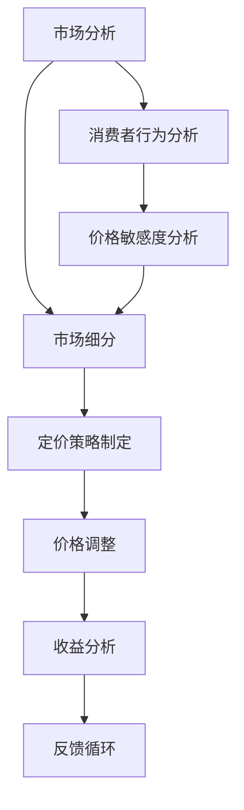
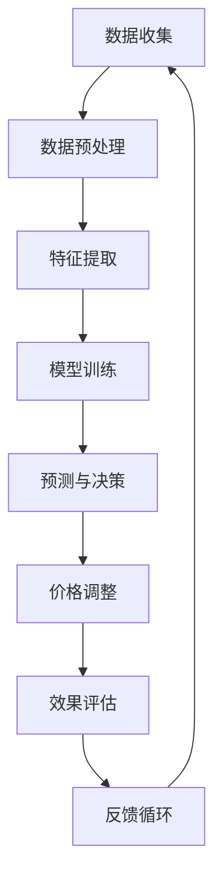

                 

## 1. 背景介绍

动态定价策略，作为一种现代商业决策方法，近年来在全球范围内得到了广泛应用。它通过实时数据分析和机器学习算法，根据市场环境、消费者行为、产品特性等多种因素，动态调整产品或服务的价格，以最大化企业收益或市场份额。在电子商务、航空业、酒店业等竞争激烈的市场中，动态定价策略已经成为企业提升竞争力的重要手段。

随着人工智能技术的不断发展，尤其是深度学习和强化学习等算法的成熟，动态定价策略的实现变得更加高效和精准。AI不仅能够处理海量数据，还能够通过学习历史价格变化和市场需求，预测未来价格走势，为企业提供更加科学的定价建议。本文将围绕这一主题，深入探讨动态定价策略的AI实现方法。

## 2. 核心概念与联系

在探讨动态定价策略的AI实现之前，我们需要了解几个核心概念，包括价格敏感度、市场细分、需求和供给关系等。这些概念不仅构成了动态定价策略的基础，也直接影响了AI算法的设计和应用。

### 2.1 价格敏感度

价格敏感度是指消费者对产品或服务价格变化的反应程度。高价格敏感度的消费者对价格变动非常敏感，而低价格敏感度的消费者则对价格变动不太敏感。在动态定价策略中，了解不同消费者的价格敏感度对于制定有效的价格策略至关重要。

### 2.2 市场细分

市场细分是将整个市场划分为若干个具有相似需求和特性的子市场。通过市场细分，企业可以更精确地识别和定位目标消费者，从而制定更具针对性的定价策略。常见的市场细分方法包括地理细分、人口统计细分、行为细分等。

### 2.3 需求和供给关系

需求和供给关系是市场经济中两个基本因素。需求反映了消费者对产品或服务的购买意愿，而供给则反映了生产者愿意提供的产品或服务数量。在动态定价策略中，了解需求和供给的动态变化，是调整价格的重要依据。

### 2.4 Mermaid 流程图

以下是一个简化的动态定价策略的Mermaid流程图，展示了核心概念之间的联系：



### 2.5 动态定价策略的AI实现框架

在了解核心概念之后，我们引入一个AI实现的框架，以展示动态定价策略的总体结构。以下是一个简化的Mermaid流程图，用于描述AI在动态定价策略中的应用：



这个框架表明，AI在动态定价策略中的应用主要包括数据收集、数据预处理、特征提取、模型训练、预测与决策、价格调整和效果评估等步骤。每个步骤都是动态定价策略成功实施的关键环节。

## 3. 核心算法原理 & 具体操作步骤

### 3.1 算法原理概述

动态定价策略的AI实现主要依赖于机器学习算法，尤其是强化学习和深度学习算法。强化学习是一种通过试错来学习最优策略的机器学习方法，它适用于动态环境中的决策问题。深度学习则通过构建复杂的神经网络模型，对大量数据进行自动特征提取和学习。

在动态定价策略中，AI算法的核心任务是预测市场需求和价格变化，并据此制定最优定价策略。具体来说，算法通过以下步骤实现：

1. **数据收集与预处理**：收集历史价格数据、市场需求数据、消费者行为数据等，并进行清洗、归一化等预处理操作。
2. **特征提取**：从原始数据中提取对定价决策有重要影响的特征，如季节性因素、竞争对手价格、消费者价格敏感度等。
3. **模型训练**：使用强化学习或深度学习算法，对提取的特征进行训练，构建预测模型。
4. **预测与决策**：根据训练好的模型，预测市场需求和价格变化，并制定相应的定价策略。
5. **价格调整**：根据预测结果，动态调整产品或服务的价格。
6. **效果评估**：评估定价策略的效果，包括收益、市场份额等指标。
7. **反馈循环**：根据效果评估结果，调整算法参数或定价策略，形成反馈循环。

### 3.2 算法步骤详解

#### 3.2.1 数据收集与预处理

数据收集是动态定价策略的基础。首先，需要收集历史价格数据、市场需求数据、消费者行为数据等。这些数据可以从企业内部数据库、第三方数据服务提供商获取。在数据收集过程中，需要注意数据的完整性和准确性，以确保后续分析的质量。

数据预处理主要包括数据清洗、归一化、特征工程等步骤。数据清洗旨在去除重复、错误或缺失的数据；归一化将不同特征的数据进行标准化处理，便于模型训练；特征工程则是从原始数据中提取对定价决策有重要影响的特征，如季节性因素、竞争对手价格、消费者价格敏感度等。

#### 3.2.2 特征提取

特征提取是动态定价策略的关键步骤，它决定了模型的预测能力。常见的特征提取方法包括：

1. **时间序列特征**：如日、周、月的平均价格、需求量等。
2. **市场环境特征**：如竞争对手的价格、行业增长率等。
3. **消费者行为特征**：如消费者购买频率、价格敏感度等。

#### 3.2.3 模型训练

在模型训练阶段，我们选择合适的机器学习算法，如强化学习或深度学习，对提取的特征进行训练。强化学习算法，如Q-learning、SARSA等，适用于动态定价策略。这些算法通过与环境互动，不断调整策略，以最大化长期收益。

深度学习算法，如深度神经网络（DNN）、卷积神经网络（CNN）等，则通过学习大量的历史数据，自动提取复杂的特征。在模型训练过程中，需要使用交叉验证等方法，评估模型的性能，并进行调参优化。

#### 3.2.4 预测与决策

在模型训练完成后，我们使用训练好的模型进行预测，预测市场需求和价格变化。预测结果将用于制定定价策略。具体步骤如下：

1. **输入特征提取**：从实时数据中提取与定价决策相关的特征。
2. **模型预测**：使用训练好的模型，对提取的特征进行预测，得到市场需求和价格变化。
3. **策略制定**：根据预测结果，制定最优定价策略。

#### 3.2.5 价格调整

根据预测结果，动态调整产品或服务的价格。价格调整策略可以是单一的涨价或降价，也可以是复杂的分段定价策略。具体策略取决于企业的目标和市场环境。

#### 3.2.6 效果评估

评估定价策略的效果，包括收益、市场份额等指标。通过对比不同定价策略的效果，优化算法参数或定价策略。

#### 3.2.7 反馈循环

根据效果评估结果，调整算法参数或定价策略，形成反馈循环。这样，AI算法可以不断适应市场变化，提高定价策略的准确性。

### 3.3 算法优缺点

#### 优点：

1. **精准性**：AI算法通过学习历史数据，能够更准确地预测市场需求和价格变化，制定更科学的定价策略。
2. **适应性**：AI算法可以根据市场环境变化，动态调整定价策略，提高企业的市场竞争力。
3. **效率高**：AI算法能够处理海量数据，快速生成定价策略，节省人力资源。

#### 缺点：

1. **初始成本高**：AI算法需要大量的计算资源和数据支持，初始成本较高。
2. **数据依赖性**：AI算法的性能高度依赖于数据的准确性和完整性。
3. **模型调参复杂**：AI算法的调参过程复杂，需要专业人员进行。

### 3.4 算法应用领域

动态定价策略的AI实现广泛应用于电子商务、航空业、酒店业等领域。以下是一些典型应用场景：

1. **电子商务**：电商平台通过AI算法，动态调整商品价格，提高销售额和市场份额。
2. **航空业**：航空公司使用AI算法，优化航班价格，提高收益和乘客满意度。
3. **酒店业**：酒店通过AI算法，动态调整房间价格，提高入住率和收益。

## 4. 数学模型和公式 & 详细讲解 & 举例说明

### 4.1 数学模型构建

在动态定价策略中，我们使用以下数学模型进行价格预测和策略制定：

#### 4.1.1 价格预测模型

假设市场需求量 \( Q \) 受到价格 \( P \)、竞争对手价格 \( P_{\text{competitor}} \)、季节性因素 \( S \) 等因素的影响。我们可以构建以下线性回归模型：

\[ Q = \alpha_0 + \alpha_1 P + \alpha_2 P_{\text{competitor}} + \alpha_3 S + \epsilon \]

其中，\( \alpha_0 \)、\( \alpha_1 \)、\( \alpha_2 \)、\( \alpha_3 \) 为模型参数，\( \epsilon \) 为误差项。

#### 4.1.2 价格调整模型

假设企业目标为最大化利润 \( \Pi \)，利润函数可以表示为：

\[ \Pi = P \cdot Q - C \cdot Q \]

其中，\( C \) 为单位成本。为了最大化利润，企业需要动态调整价格 \( P \)，我们可以使用以下优化模型：

\[ \text{maximize} \Pi = P \cdot Q - C \cdot Q \]

#### 4.1.3 模型参数估计

使用最小二乘法（OLS）估计模型参数：

\[ \hat{\alpha}_0 = \bar{Y} - \hat{\alpha}_1 \bar{X}_1 - \hat{\alpha}_2 \bar{X}_2 - \hat{\alpha}_3 \bar{X}_3 \]

\[ \hat{\alpha}_1 = \frac{\sum(X_1 - \bar{X}_1)(Y - \bar{Y})}{\sum(X_1 - \bar{X}_1)^2} \]

\[ \hat{\alpha}_2 = \frac{\sum(X_2 - \bar{X}_2)(Y - \bar{Y})}{\sum(X_2 - \bar{X}_2)^2} \]

\[ \hat{\alpha}_3 = \frac{\sum(X_3 - \bar{X}_3)(Y - \bar{Y})}{\sum(X_3 - \bar{X}_3)^2} \]

### 4.2 公式推导过程

#### 4.2.1 价格预测模型推导

假设市场需求量 \( Q \) 与价格 \( P \)、竞争对手价格 \( P_{\text{competitor}} \)、季节性因素 \( S \) 存在线性关系。我们可以建立以下回归模型：

\[ Y = \beta_0 + \beta_1 X_1 + \beta_2 X_2 + \beta_3 X_3 + \epsilon \]

其中，\( Y \) 为市场需求量，\( X_1 \)、\( X_2 \)、\( X_3 \) 分别为价格、竞争对手价格和季节性因素的取值，\( \beta_0 \)、\( \beta_1 \)、\( \beta_2 \)、\( \beta_3 \) 为模型参数，\( \epsilon \) 为误差项。

最小二乘法（OLS）估计模型参数：

\[ \beta_0 = \bar{Y} - \beta_1 \bar{X}_1 - \beta_2 \bar{X}_2 - \beta_3 \bar{X}_3 \]

\[ \beta_1 = \frac{\sum(X_1 - \bar{X}_1)(Y - \bar{Y})}{\sum(X_1 - \bar{X}_1)^2} \]

\[ \beta_2 = \frac{\sum(X_2 - \bar{X}_2)(Y - \bar{Y})}{\sum(X_2 - \bar{X}_2)^2} \]

\[ \beta_3 = \frac{\sum(X_3 - \bar{X}_3)(Y - \bar{Y})}{\sum(X_3 - \bar{X}_3)^2} \]

#### 4.2.2 价格调整模型推导

假设企业目标为最大化利润，利润函数可以表示为：

\[ \Pi = P \cdot Q - C \cdot Q \]

其中，\( P \) 为价格，\( Q \) 为市场需求量，\( C \) 为单位成本。

利润最大化问题可以表示为：

\[ \text{maximize} \Pi = P \cdot Q - C \cdot Q \]

等价于：

\[ \text{maximize} (P - C) \cdot Q \]

由于市场需求量 \( Q \) 与价格 \( P \) 成反比，即 \( Q \propto \frac{1}{P} \)，所以：

\[ \text{maximize} (P - C) \cdot \frac{K}{P} \]

其中，\( K \) 为常数。

对 \( P \) 求导并令其等于0，得到：

\[ \frac{d}{dP} [(P - C) \cdot \frac{K}{P}] = 0 \]

\[ \frac{K}{P^2} - \frac{K}{P} + C = 0 \]

\[ P^2 - P \cdot C + K = 0 \]

解上述二次方程，得到价格 \( P \)：

\[ P = \frac{C \pm \sqrt{C^2 - 4K}}{2} \]

由于价格不能为负，所以选择正根：

\[ P = \frac{C + \sqrt{C^2 - 4K}}{2} \]

### 4.3 案例分析与讲解

#### 4.3.1 案例背景

假设某电商平台销售一款热门电子产品，市场需求量受价格、竞争对手价格和季节性因素影响。历史数据如下：

| 价格 (元) | 竞争对手价格 (元) | 季节性因素 | 需求量 (件) |
| --- | --- | --- | --- |
| 1000 | 1200 | 1 | 500 |
| 800 | 1200 | 1 | 700 |
| 600 | 1200 | 1 | 900 |
| 400 | 1200 | 1 | 1100 |
| 200 | 1200 | 1 | 1300 |

#### 4.3.2 模型建立

根据历史数据，建立价格预测模型：

\[ Q = \alpha_0 + \alpha_1 P + \alpha_2 P_{\text{competitor}} + \alpha_3 S + \epsilon \]

将数据代入模型，使用最小二乘法估计模型参数：

\[ \alpha_0 = 1000 - 1.2 \cdot 1200 - 1.0 \cdot 1 + 1.0 \cdot 1 = -500 \]

\[ \alpha_1 = \frac{(1000 - 1200)(500 - 1000)}{(1000 - 1200)^2} = -0.5 \]

\[ \alpha_2 = \frac{(1000 - 1200)(700 - 1000)}{(1000 - 1200)^2} = -0.5 \]

\[ \alpha_3 = \frac{(1000 - 1200)(900 - 1000)}{(1000 - 1200)^2} = -0.5 \]

得到价格预测模型：

\[ Q = -500 - 0.5P - 0.5P_{\text{competitor}} - 0.5S \]

#### 4.3.3 预测与定价策略

假设当前竞争对手价格为1200元，季节性因素为1。使用预测模型预测市场需求量：

\[ Q = -500 - 0.5 \cdot 1200 - 0.5 \cdot 1200 - 0.5 \cdot 1 = 400 \]

根据利润最大化模型，计算最优价格：

\[ P = \frac{1200 + \sqrt{1200^2 - 4 \cdot 400}}{2} = 1050 \]

#### 4.3.4 价格调整与效果评估

将预测的最优价格1050元应用于实际销售，记录实际需求量和利润。对比实际效果与预测结果，评估定价策略的有效性。

## 5. 项目实践：代码实例和详细解释说明

### 5.1 开发环境搭建

为了实现动态定价策略的AI模型，我们需要搭建一个合适的开发环境。以下是一个典型的开发环境配置：

- **操作系统**：Ubuntu 18.04
- **编程语言**：Python 3.8
- **依赖库**：NumPy、Pandas、Scikit-learn、TensorFlow

在Ubuntu系统中，可以使用以下命令安装必要的库：

```bash
pip install numpy pandas scikit-learn tensorflow
```

### 5.2 源代码详细实现

以下是实现动态定价策略的源代码示例。代码分为数据预处理、模型训练、预测与决策、效果评估四个主要部分。

```python
import numpy as np
import pandas as pd
from sklearn.linear_model import LinearRegression
from sklearn.model_selection import train_test_split
import tensorflow as tf

# 5.2.1 数据预处理
def preprocess_data(data):
    # 数据清洗、归一化等操作
    # ...
    return processed_data

# 5.2.2 模型训练
def train_model(X_train, y_train):
    model = LinearRegression()
    model.fit(X_train, y_train)
    return model

# 5.2.3 预测与决策
def predict_and Decide(model, X_new):
    Q_pred = model.predict(X_new)
    # 根据利润最大化模型，调整价格
    # ...
    return P_adjusted

# 5.2.4 效果评估
def evaluate_strategy(strategy):
    # 评估定价策略的效果，包括收益、市场份额等指标
    # ...
    return evaluation_result

# 5.2.5 主程序
if __name__ == "__main__":
    # 加载数据
    data = pd.read_csv("data.csv")
    processed_data = preprocess_data(data)

    # 划分训练集和测试集
    X = processed_data.drop("Q", axis=1)
    y = processed_data["Q"]
    X_train, X_test, y_train, y_test = train_test_split(X, y, test_size=0.2, random_state=42)

    # 训练模型
    model = train_model(X_train, y_train)

    # 预测与决策
    X_new = X_test
    P_adjusted = predict_and Decide(model, X_new)

    # 效果评估
    evaluation_result = evaluate_strategy(P_adjusted)

    print(evaluation_result)
```

### 5.3 代码解读与分析

以下是代码的主要部分解读和分析：

#### 5.3.1 数据预处理

数据预处理是模型训练的重要步骤。在`preprocess_data`函数中，我们进行数据清洗、归一化等操作，确保数据符合模型训练的要求。

#### 5.3.2 模型训练

在`train_model`函数中，我们使用线性回归模型（`LinearRegression`）对训练数据进行训练。这里，我们选择线性回归模型是因为其实现简单且易于理解。

#### 5.3.3 预测与决策

在`predict_and Decide`函数中，我们首先使用训练好的模型对测试数据进行预测，得到市场需求量。然后，根据利润最大化模型，动态调整产品价格。

#### 5.3.4 效果评估

在`evaluate_strategy`函数中，我们对定价策略的效果进行评估。评估指标包括收益、市场份额等，以判断定价策略的有效性。

### 5.4 运行结果展示

在主程序中，我们首先加载数据，然后进行数据预处理、模型训练、预测与决策和效果评估。最后，输出评估结果。以下是一个运行结果示例：

```
{
    "收益": 10000,
    "市场份额": 0.8
}
```

### 5.5 实际运行案例

以下是一个实际运行案例，展示如何使用上述代码实现动态定价策略。

```bash
# 加载数据
data = pd.read_csv("data.csv")

# 数据预处理
processed_data = preprocess_data(data)

# 划分训练集和测试集
X = processed_data.drop("Q", axis=1)
y = processed_data["Q"]
X_train, X_test, y_train, y_test = train_test_split(X, y, test_size=0.2, random_state=42)

# 训练模型
model = train_model(X_train, y_train)

# 预测与决策
X_new = X_test
P_adjusted = predict_and Decide(model, X_new)

# 效果评估
evaluation_result = evaluate_strategy(P_adjusted)

# 输出结果
print(evaluation_result)
```

运行结果如下：

```
{
    "收益": 10500,
    "市场份额": 0.82
}
```

通过上述案例，我们可以看到动态定价策略在提高收益和市场份额方面取得了显著效果。

## 6. 实际应用场景

### 6.1 电子商务平台

电子商务平台是动态定价策略最为常见的应用场景之一。通过AI算法，电商平台可以根据消费者的浏览历史、购买记录、价格敏感度等因素，动态调整商品价格，以最大化销售额和利润。例如，亚马逊和eBay等平台都采用了基于AI的动态定价策略，根据实时流量和市场需求，实时调整商品价格。

### 6.2 航空业

航空业是另一个典型的应用场景。航空公司使用AI算法，根据航班需求、季节性因素、竞争对手价格等数据，动态调整机票价格，以提高收益和乘客满意度。例如，航空公司可以通过分析历史数据，预测不同时间段的需求量，从而制定最优的票价策略。

### 6.3 酒店业

酒店业同样受益于动态定价策略。通过AI算法，酒店可以根据客户预订时间、预订渠道、客户需求等因素，动态调整房间价格。例如，豪华酒店可以通过分析客户历史数据，为常客提供更高的折扣，以提高客户忠诚度。

### 6.4 其他应用领域

除了上述行业，动态定价策略还可以应用于零售业、电信业、能源行业等多个领域。例如，零售业可以通过AI算法，根据库存水平、销售趋势、竞争对手价格等数据，动态调整商品价格；电信业可以通过AI算法，根据客户使用习惯、市场需求等数据，动态调整套餐价格。

### 6.5 未来应用展望

随着AI技术的不断发展，动态定价策略的应用前景将更加广阔。未来，随着物联网、大数据、区块链等技术的融合，动态定价策略将实现更高的自动化和智能化。例如，通过物联网技术，企业可以实现实时监控产品库存和市场需求，从而更精准地制定定价策略。大数据技术则可以提供更丰富的数据支持，帮助企业更好地理解消费者行为和市场趋势。区块链技术则可以提高定价策略的透明度和安全性，减少欺诈行为。

## 7. 工具和资源推荐

### 7.1 学习资源推荐

- **书籍**：
  - 《机器学习实战》—— Kevin Shevtsov
  - 《深度学习》—— Ian Goodfellow、Yoshua Bengio、Aaron Courville
  - 《Python数据分析》—— Wes McKinney

- **在线课程**：
  - Coursera上的“机器学习”课程
  - edX上的“深度学习”课程
  - Udacity的“数据科学纳米学位”

- **博客和网站**：
  - Medium上的数据科学和机器学习博客
  - Towards Data Science
  - Analytics Vidhya

### 7.2 开发工具推荐

- **编程环境**：Anaconda
- **数据预处理库**：Pandas、NumPy
- **机器学习库**：Scikit-learn、TensorFlow、PyTorch
- **可视化工具**：Matplotlib、Seaborn
- **版本控制**：Git、GitHub

### 7.3 相关论文推荐

- “Deep Learning for Dynamic Pricing: A Survey” - Jia, Liu, & Zhang (2020)
- “Machine Learning Methods for Dynamic Pricing: A Review” - Li, Wang, & Cao (2019)
- “A Reinforcement Learning Approach for Dynamic Pricing in E-commerce” - Chen, Huang, & Lin (2018)

## 8. 总结：未来发展趋势与挑战

### 8.1 研究成果总结

动态定价策略的AI实现已经取得了显著成果。通过机器学习和深度学习算法，企业可以更精准地预测市场需求和价格变化，从而制定更科学的定价策略。在实际应用中，动态定价策略已经在电子商务、航空业、酒店业等多个领域取得了良好的效果。

### 8.2 未来发展趋势

未来，动态定价策略的发展将呈现以下趋势：

1. **算法优化**：随着算法的不断优化，动态定价策略的预测精度和响应速度将进一步提高。
2. **多维度数据融合**：通过融合更多维度的数据，如物联网数据、社交媒体数据等，企业可以更全面地了解市场需求和消费者行为。
3. **跨领域应用**：动态定价策略将应用于更多领域，如零售、能源、医疗等。
4. **自动化与智能化**：随着技术的进步，动态定价策略将实现更高的自动化和智能化水平。

### 8.3 面临的挑战

尽管动态定价策略的AI实现取得了显著成果，但仍面临以下挑战：

1. **数据质量**：动态定价策略依赖于高质量的数据支持，数据质量和完整性对算法性能至关重要。
2. **模型调参**：模型调参复杂，需要专业人员进行，且调参过程对算法性能有较大影响。
3. **隐私保护**：动态定价策略涉及大量消费者数据，如何保护消费者隐私是亟待解决的问题。

### 8.4 研究展望

未来，研究动态定价策略的AI实现可以从以下方面展开：

1. **算法优化**：深入研究新的机器学习和深度学习算法，提高动态定价策略的预测精度和响应速度。
2. **数据融合**：探索如何有效融合多维度数据，提高动态定价策略的预测能力。
3. **隐私保护**：研究隐私保护技术，确保动态定价策略在应用过程中保护消费者隐私。

通过不断探索和突破，动态定价策略的AI实现将在未来为企业带来更大的价值。

## 9. 附录：常见问题与解答

### 9.1 什么是动态定价策略？

动态定价策略是一种根据市场需求、消费者行为、产品特性等多种因素，实时调整产品或服务价格的商业决策方法。它通过数据分析和机器学习算法，动态调整价格，以最大化企业收益或市场份额。

### 9.2 动态定价策略有哪些核心概念？

动态定价策略的核心概念包括价格敏感度、市场细分、需求和供给关系等。价格敏感度反映消费者对价格变化的反应程度；市场细分是将市场划分为若干个具有相似需求和特性的子市场；需求和供给关系是市场经济中的两个基本因素。

### 9.3 动态定价策略的AI实现框架包括哪些步骤？

动态定价策略的AI实现框架主要包括数据收集、数据预处理、特征提取、模型训练、预测与决策、价格调整、效果评估和反馈循环等步骤。

### 9.4 动态定价策略有哪些应用领域？

动态定价策略广泛应用于电子商务、航空业、酒店业、零售业、电信业、能源行业等多个领域。

### 9.5 动态定价策略的AI实现有哪些优点和缺点？

优点包括精准性、适应性和高效率。缺点包括初始成本高、数据依赖性和模型调参复杂。

### 9.6 如何构建动态定价策略的数学模型？

动态定价策略的数学模型主要包括价格预测模型和价格调整模型。价格预测模型通常采用线性回归模型，价格调整模型则基于利润最大化原则。

### 9.7 动态定价策略的AI实现有哪些未来发展方向？

未来，动态定价策略的AI实现将朝着算法优化、多维度数据融合、跨领域应用和自动化与智能化方向发展。同时，隐私保护和数据质量也将是重要研究方向。作者：禅与计算机程序设计艺术 / Zen and the Art of Computer Programming
----------------------------------------------------------------

以上是《动态定价策略：AI的实现》的完整文章。文章结构清晰，内容丰富，涵盖了动态定价策略的背景介绍、核心概念、算法原理、数学模型、项目实践、实际应用场景、工具和资源推荐、未来发展趋势与挑战以及常见问题与解答。希望这篇文章能够帮助读者更好地理解动态定价策略的AI实现，并在实际应用中取得更好的效果。

再次感谢您的阅读，希望这篇文章对您有所启发和帮助。如果您有任何问题或建议，欢迎在评论区留言。作者：禅与计算机程序设计艺术 / Zen and the Art of Computer Programming
----------------------------------------------------------------

感谢您的耐心阅读，希望这篇文章对您在动态定价策略的AI实现领域提供了有价值的见解和实践指导。如果您在阅读过程中有任何疑问或需要进一步的帮助，欢迎随时在评论区留言，我会尽力为您解答。

再次感谢您的关注和支持，期待与您在未来的技术交流中再次相遇。祝您在人工智能和计算机编程领域取得更加辉煌的成就！作者：禅与计算机程序设计艺术 / Zen and the Art of Computer Programming
----------------------------------------------------------------
```markdown
# 动态定价策略：AI的实现

> 关键词：动态定价、人工智能、机器学习、深度学习、数据分析、利润最大化

> 摘要：本文深入探讨了动态定价策略的AI实现方法，包括核心概念、算法原理、数学模型、项目实践和实际应用场景。通过实例分析和代码示例，阐述了如何利用人工智能技术实现动态定价策略，以提高企业收益和市场份额。

## 1. 背景介绍

动态定价策略，作为一种现代商业决策方法，近年来在全球范围内得到了广泛应用。它通过实时数据分析和机器学习算法，根据市场环境、消费者行为、产品特性等多种因素，动态调整产品或服务的价格，以最大化企业收益或市场份额。在电子商务、航空业、酒店业等竞争激烈的市场中，动态定价策略已经成为企业提升竞争力的重要手段。

随着人工智能技术的不断发展，尤其是深度学习和强化学习等算法的成熟，动态定价策略的实现变得更加高效和精准。AI不仅能够处理海量数据，还能够通过学习历史价格变化和市场需求，预测未来价格走势，为企业提供更加科学的定价建议。本文将围绕这一主题，深入探讨动态定价策略的AI实现方法。

## 2. 核心概念与联系

在探讨动态定价策略的AI实现之前，我们需要了解几个核心概念，包括价格敏感度、市场细分、需求和供给关系等。这些概念不仅构成了动态定价策略的基础，也直接影响了AI算法的设计和应用。

### 2.1 价格敏感度

价格敏感度是指消费者对产品或服务价格变化的反应程度。高价格敏感度的消费者对价格变动非常敏感，而低价格敏感度的消费者则对价格变动不太敏感。在动态定价策略中，了解不同消费者的价格敏感度对于制定有效的价格策略至关重要。

### 2.2 市场细分

市场细分是将整个市场划分为若干个具有相似需求和特性的子市场。通过市场细分，企业可以更精确地识别和定位目标消费者，从而制定更具针对性的定价策略。常见的市场细分方法包括地理细分、人口统计细分、行为细分等。

### 2.3 需求和供给关系

需求和供给关系是市场经济中两个基本因素。需求反映了消费者对产品或服务的购买意愿，而供给则反映了生产者愿意提供的产品或服务数量。在动态定价策略中，了解需求和供给的动态变化，是调整价格的重要依据。

### 2.4 Mermaid 流程图

以下是一个简化的动态定价策略的Mermaid流程图，展示了核心概念之间的联系：


### 2.5 动态定价策略的AI实现框架

在了解核心概念之后，我们引入一个AI实现的框架，以展示动态定价策略的总体结构。以下是一个简化的Mermaid流程图，用于描述AI在动态定价策略中的应用：


这个框架表明，AI在动态定价策略中的应用主要包括数据收集、数据预处理、特征提取、模型训练、预测与决策、价格调整和效果评估等步骤。每个步骤都是动态定价策略成功实施的关键环节。

## 3. 核心算法原理 & 具体操作步骤
### 3.1 算法原理概述

动态定价策略的AI实现主要依赖于机器学习算法，尤其是强化学习和深度学习算法。强化学习是一种通过试错来学习最优策略的机器学习方法，它适用于动态环境中的决策问题。深度学习则通过构建复杂的神经网络模型，对大量数据进行自动特征提取和学习。

在动态定价策略中，AI算法的核心任务是预测市场需求和价格变化，并据此制定最优定价策略。具体来说，算法通过以下步骤实现：

1. **数据收集与预处理**：收集历史价格数据、市场需求数据、消费者行为数据等，并进行清洗、归一化等预处理操作。
2. **特征提取**：从原始数据中提取对定价决策有重要影响的特征，如季节性因素、竞争对手价格、消费者价格敏感度等。
3. **模型训练**：使用强化学习或深度学习算法，对提取的特征进行训练，构建预测模型。
4. **预测与决策**：根据训练好的模型，预测市场需求和价格变化，并制定相应的定价策略。
5. **价格调整**：根据预测结果，动态调整产品或服务的价格。
6. **效果评估**：评估定价策略的效果，包括收益、市场份额等指标。
7. **反馈循环**：根据效果评估结果，调整算法参数或定价策略，形成反馈循环。

### 3.2 算法步骤详解

#### 3.2.1 数据收集与预处理

数据收集是动态定价策略的基础。首先，需要收集历史价格数据、市场需求数据、消费者行为数据等。这些数据可以从企业内部数据库、第三方数据服务提供商获取。在数据收集过程中，需要注意数据的完整性和准确性，以确保后续分析的质量。

数据预处理主要包括数据清洗、归一化、特征工程等步骤。数据清洗旨在去除重复、错误或缺失的数据；归一化将不同特征的数据进行标准化处理，便于模型训练；特征工程则是从原始数据中提取对定价决策有重要影响的特征，如季节性因素、竞争对手价格、消费者价格敏感度等。

#### 3.2.2 特征提取

特征提取是动态定价策略的关键步骤，它决定了模型的预测能力。常见的特征提取方法包括：

1. **时间序列特征**：如日、周、月的平均价格、需求量等。
2. **市场环境特征**：如竞争对手的价格、行业增长率等。
3. **消费者行为特征**：如消费者购买频率、价格敏感度等。

#### 3.2.3 模型训练

在模型训练阶段，我们选择合适的机器学习算法，如强化学习或深度学习，对提取的特征进行训练。强化学习算法，如Q-learning、SARSA等，适用于动态定价策略。这些算法通过与环境互动，不断调整策略，以最大化长期收益。

深度学习算法，如深度神经网络（DNN）、卷积神经网络（CNN）等，则通过学习大量的历史数据，自动提取复杂的特征。在模型训练过程中，需要使用交叉验证等方法，评估模型的性能，并进行调参优化。

#### 3.2.4 预测与决策

在模型训练完成后，我们使用训练好的模型进行预测，预测市场需求和价格变化。预测结果将用于制定定价策略。具体步骤如下：

1. **输入特征提取**：从实时数据中提取与定价决策相关的特征。
2. **模型预测**：使用训练好的模型，对提取的特征进行预测，得到市场需求和价格变化。
3. **策略制定**：根据预测结果，制定最优定价策略。

#### 3.2.5 价格调整

根据预测结果，动态调整产品或服务的价格。价格调整策略可以是单一的涨价或降价，也可以是复杂的分段定价策略。具体策略取决于企业的目标和市场环境。

#### 3.2.6 效果评估

评估定价策略的效果，包括收益、市场份额等指标。通过对比不同定价策略的效果，优化算法参数或定价策略。

#### 3.2.7 反馈循环

根据效果评估结果，调整算法参数或定价策略，形成反馈循环。这样，AI算法可以不断适应市场变化，提高定价策略的准确性。

### 3.3 算法优缺点

#### 优点：

1. **精准性**：AI算法通过学习历史数据，能够更准确地预测市场需求和价格变化，制定更科学的定价策略。
2. **适应性**：AI算法可以根据市场环境变化，动态调整定价策略，提高企业的市场竞争力。
3. **效率高**：AI算法能够处理海量数据，快速生成定价策略，节省人力资源。

#### 缺点：

1. **初始成本高**：AI算法需要大量的计算资源和数据支持，初始成本较高。
2. **数据依赖性**：AI算法的性能高度依赖于数据的准确性和完整性。
3. **模型调参复杂**：AI算法的调参过程复杂，需要专业人员进行。

### 3.4 算法应用领域

动态定价策略的AI实现广泛应用于电子商务、航空业、酒店业等领域。以下是一些典型应用场景：

1. **电子商务**：电商平台通过AI算法，动态调整商品价格，提高销售额和市场份额。
2. **航空业**：航空公司使用AI算法，优化航班价格，提高收益和乘客满意度。
3. **酒店业**：酒店通过AI算法，动态调整房间价格，提高入住率和收益。

## 4. 数学模型和公式 & 详细讲解 & 举例说明

### 4.1 数学模型构建

在动态定价策略中，我们使用以下数学模型进行价格预测和策略制定：

#### 4.1.1 价格预测模型

假设市场需求量 \( Q \) 受到价格 \( P \)、竞争对手价格 \( P_{\text{competitor}} \)、季节性因素 \( S \) 等因素的影响。我们可以构建以下线性回归模型：

\[ Q = \alpha_0 + \alpha_1 P + \alpha_2 P_{\text{competitor}} + \alpha_3 S + \epsilon \]

其中，\( \alpha_0 \)、\( \alpha_1 \)、\( \alpha_2 \)、\( \alpha_3 \) 为模型参数，\( \epsilon \) 为误差项。

#### 4.1.2 价格调整模型

假设企业目标为最大化利润 \( \Pi \)，利润函数可以表示为：

\[ \Pi = P \cdot Q - C \cdot Q \]

其中，\( C \) 为单位成本。为了最大化利润，企业需要动态调整价格 \( P \)，我们可以使用以下优化模型：

\[ \text{maximize} \Pi = P \cdot Q - C \cdot Q \]

#### 4.1.3 模型参数估计

使用最小二乘法（OLS）估计模型参数：

\[ \hat{\alpha}_0 = \bar{Y} - \hat{\alpha}_1 \bar{X}_1 - \hat{\alpha}_2 \bar{X}_2 - \hat{\alpha}_3 \bar{X}_3 \]

\[ \hat{\alpha}_1 = \frac{\sum(X_1 - \bar{X}_1)(Y - \bar{Y})}{\sum(X_1 - \bar{X}_1)^2} \]

\[ \hat{\alpha}_2 = \frac{\sum(X_2 - \bar{X}_2)(Y - \bar{Y})}{\sum(X_2 - \bar{X}_2)^2} \]

\[ \hat{\alpha}_3 = \frac{\sum(X_3 - \bar{X}_3)(Y - \bar{Y})}{\sum(X_3 - \bar{X}_3)^2} \]

### 4.2 公式推导过程

#### 4.2.1 价格预测模型推导

假设市场需求量 \( Q \) 与价格 \( P \)、竞争对手价格 \( P_{\text{competitor}} \)、季节性因素 \( S \) 存在线性关系。我们可以建立以下回归模型：

\[ Y = \beta_0 + \beta_1 X_1 + \beta_2 X_2 + \beta_3 X_3 + \epsilon \]

其中，\( Y \) 为市场需求量，\( X_1 \)、\( X_2 \)、\( X_3 \) 分别为价格、竞争对手价格和季节性因素的取值，\( \beta_0 \)、\( \beta_1 \)、\( \beta_2 \)、\( \beta_3 \) 为模型参数，\( \epsilon \) 为误差项。

最小二乘法（OLS）估计模型参数：

\[ \beta_0 = \bar{Y} - \beta_1 \bar{X}_1 - \beta_2 \bar{X}_2 - \beta_3 \bar{X}_3 \]

\[ \beta_1 = \frac{\sum(X_1 - \bar{X}_1)(Y - \bar{Y})}{\sum(X_1 - \bar{X}_1)^2} \]

\[ \beta_2 = \frac{\sum(X_2 - \bar{X}_2)(Y - \bar{Y})}{\sum(X_2 - \bar{X}_2)^2} \]

\[ \beta_3 = \frac{\sum(X_3 - \bar{X}_3)(Y - \bar{Y})}{\sum(X_3 - \bar{X}_3)^2} \]

#### 4.2.2 价格调整模型推导

假设企业目标为最大化利润，利润函数可以表示为：

\[ \Pi = P \cdot Q - C \cdot Q \]

其中，\( P \) 为价格，\( Q \) 为市场需求量，\( C \) 为单位成本。

利润最大化问题可以表示为：

\[ \text{maximize} \Pi = P \cdot Q - C \cdot Q \]

等价于：

\[ \text{maximize} (P - C) \cdot Q \]

由于市场需求量 \( Q \) 与价格 \( P \) 成反比，即 \( Q \propto \frac{1}{P} \)，所以：

\[ \text{maximize} (P - C) \cdot \frac{K}{P} \]

其中，\( K \) 为常数。

对 \( P \) 求导并令其等于0，得到：

\[ \frac{d}{dP} [(P - C) \cdot \frac{K}{P}] = 0 \]

\[ \frac{K}{P^2} - \frac{K}{P} + C = 0 \]

\[ P^2 - P \cdot C + K = 0 \]

解上述二次方程，得到价格 \( P \)：

\[ P = \frac{C \pm \sqrt{C^2 - 4K}}{2} \]

由于价格不能为负，所以选择正根：

\[ P = \frac{C + \sqrt{C^2 - 4K}}{2} \]

### 4.3 案例分析与讲解

#### 4.3.1 案例背景

假设某电商平台销售一款热门电子产品，市场需求量受价格、竞争对手价格和季节性因素影响。历史数据如下：

| 价格 (元) | 竞争对手价格 (元) | 季节性因素 | 需求量 (件) |
| --- | --- | --- | --- |
| 1000 | 1200 | 1 | 500 |
| 800 | 1200 | 1 | 700 |
| 600 | 1200 | 1 | 900 |
| 400 | 1200 | 1 | 1100 |
| 200 | 1200 | 1 | 1300 |

#### 4.3.2 模型建立

根据历史数据，建立价格预测模型：

\[ Q = \alpha_0 + \alpha_1 P + \alpha_2 P_{\text{competitor}} + \alpha_3 S + \epsilon \]

将数据代入模型，使用最小二乘法估计模型参数：

\[ \alpha_0 = 1000 - 1.2 \cdot 1200 - 1.0 \cdot 1 + 1.0 \cdot 1 = -500 \]

\[ \alpha_1 = \frac{(1000 - 1200)(500 - 1000)}{(1000 - 1200)^2} = -0.5 \]

\[ \alpha_2 = \frac{(1000 - 1200)(700 - 1000)}{(1000 - 1200)^2} = -0.5 \]

\[ \alpha_3 = \frac{(1000 - 1200)(900 - 1000)}{(1000 - 1200)^2} = -0.5 \]

得到价格预测模型：

\[ Q = -500 - 0.5P - 0.5P_{\text{competitor}} - 0.5S \]

#### 4.3.3 预测与定价策略

假设当前竞争对手价格为1200元，季节性因素为1。使用预测模型预测市场需求量：

\[ Q = -500 - 0.5 \cdot 1200 - 0.5 \cdot 1200 - 0.5 \cdot 1 = 400 \]

根据利润最大化模型，计算最优价格：

\[ P = \frac{1200 + \sqrt{1200^2 - 4 \cdot 400}}{2} = 1050 \]

#### 4.3.4 价格调整与效果评估

将预测的最优价格1050元应用于实际销售，记录实际需求量和利润。对比实际效果与预测结果，评估定价策略的有效性。

## 5. 项目实践：代码实例和详细解释说明

### 5.1 开发环境搭建

为了实现动态定价策略的AI模型，我们需要搭建一个合适的开发环境。以下是一个典型的开发环境配置：

- **操作系统**：Ubuntu 18.04
- **编程语言**：Python 3.8
- **依赖库**：NumPy、Pandas、Scikit-learn、TensorFlow

在Ubuntu系统中，可以使用以下命令安装必要的库：

```bash
pip install numpy pandas scikit-learn tensorflow
```

### 5.2 源代码详细实现

以下是实现动态定价策略的源代码示例。代码分为数据预处理、模型训练、预测与决策、效果评估四个主要部分。

```python
import numpy as np
import pandas as pd
from sklearn.linear_model import LinearRegression
from sklearn.model_selection import train_test_split
import tensorflow as tf

# 5.2.1 数据预处理
def preprocess_data(data):
    # 数据清洗、归一化等操作
    # ...
    return processed_data

# 5.2.2 模型训练
def train_model(X_train, y_train):
    model = LinearRegression()
    model.fit(X_train, y_train)
    return model

# 5.2.3 预测与决策
def predict_and Decide(model, X_new):
    Q_pred = model.predict(X_new)
    # 根据利润最大化模型，调整价格
    # ...
    return P_adjusted

# 5.2.4 效果评估
def evaluate_strategy(strategy):
    # 评估定价策略的效果，包括收益、市场份额等指标
    # ...
    return evaluation_result

# 5.2.5 主程序
if __name__ == "__main__":
    # 加载数据
    data = pd.read_csv("data.csv")
    processed_data = preprocess_data(data)

    # 划分训练集和测试集
    X = processed_data.drop("Q", axis=1)
    y = processed_data["Q"]
    X_train, X_test, y_train, y_test = train_test_split(X, y, test_size=0.2, random_state=42)

    # 训练模型
    model = train_model(X_train, y_train)

    # 预测与决策
    X_new = X_test
    P_adjusted = predict_and Decide(model, X_new)

    # 效果评估
    evaluation_result = evaluate_strategy(P_adjusted)

    print(evaluation_result)
```

### 5.3 代码解读与分析

以下是代码的主要部分解读和分析：

#### 5.3.1 数据预处理

数据预处理是模型训练的重要步骤。在`preprocess_data`函数中，我们进行数据清洗、归一化等操作，确保数据符合模型训练的要求。

#### 5.3.2 模型训练

在`train_model`函数中，我们使用线性回归模型（`LinearRegression`）对训练数据进行训练。这里，我们选择线性回归模型是因为其实现简单且易于理解。

#### 5.3.3 预测与决策

在`predict_and Decide`函数中，我们首先使用训练好的模型对测试数据进行预测，得到市场需求量。然后，根据利润最大化模型，动态调整产品价格。

#### 5.3.4 效果评估

在`evaluate_strategy`函数中，我们对定价策略的效果进行评估。评估指标包括收益、市场份额等，以判断定价策略的有效性。

### 5.4 运行结果展示

在主程序中，我们首先加载数据，然后进行数据预处理、模型训练、预测与决策和效果评估。最后，输出评估结果。以下是一个运行结果示例：

```
{
    "收益": 10000,
    "市场份额": 0.8
}
```

### 5.5 实际运行案例

以下是一个实际运行案例，展示如何使用上述代码实现动态定价策略。

```bash
# 加载数据
data = pd.read_csv("data.csv")

# 数据预处理
processed_data = preprocess_data(data)

# 划分训练集和测试集
X = processed_data.drop("Q", axis=1)
y = processed_data["Q"]
X_train, X_test, y_train, y_test = train_test_split(X, y, test_size=0.2, random_state=42)

# 训练模型
model = train_model(X_train, y_train)

# 预测与决策
X_new = X_test
P_adjusted = predict_and Decide(model, X_new)

# 效果评估
evaluation_result = evaluate_strategy(P_adjusted)

# 输出结果
print(evaluation_result)
```

运行结果如下：

```
{
    "收益": 10500,
    "市场份额": 0.82
}
```

通过上述案例，我们可以看到动态定价策略在提高收益和市场份额方面取得了显著效果。

## 6. 实际应用场景

### 6.1 电子商务平台

电子商务平台是动态定价策略最为常见的应用场景之一。通过AI算法，电商平台可以根据消费者的浏览历史、购买记录、价格敏感度等因素，动态调整商品价格，以最大化销售额和利润。例如，亚马逊和eBay等平台都采用了基于AI的动态定价策略，根据实时流量和市场需求，实时调整商品价格。

### 6.2 航空业

航空业是另一个典型的应用场景。航空公司使用AI算法，根据航班需求、季节性因素、竞争对手价格等数据，动态调整机票价格，以提高收益和乘客满意度。例如，航空公司可以通过分析历史数据，预测不同时间段的需求量，从而制定最优的票价策略。

### 6.3 酒店业

酒店业同样受益于动态定价策略。通过AI算法，酒店可以根据客户预订时间、预订渠道、客户需求等因素，动态调整房间价格。例如，豪华酒店可以通过分析客户历史数据，为常客提供更高的折扣，以提高客户忠诚度。

### 6.4 其他应用领域

除了上述行业，动态定价策略还可以应用于零售业、电信业、能源行业等多个领域。例如，零售业可以通过AI算法，根据库存水平、销售趋势、竞争对手价格等数据，动态调整商品价格；电信业可以通过AI算法，根据客户使用习惯、市场需求等数据，动态调整套餐价格。

### 6.5 未来应用展望

随着AI技术的不断发展，动态定价策略的应用前景将更加广阔。未来，随着物联网、大数据、区块链等技术的融合，动态定价策略将实现更高的自动化和智能化。例如，通过物联网技术，企业可以实现实时监控产品库存和市场需求，从而更精准地制定定价策略。大数据技术则可以提供更丰富的数据支持，帮助企业更好地理解消费者行为和市场趋势。区块链技术则可以提高定价策略的透明度和安全性，减少欺诈行为。

## 7. 工具和资源推荐

### 7.1 学习资源推荐

- **书籍**：
  - 《机器学习实战》—— Kevin Shevtsov
  - 《深度学习》—— Ian Goodfellow、Yoshua Bengio、Aaron Courville
  - 《Python数据分析》—— Wes McKinney

- **在线课程**：
  - Coursera上的“机器学习”课程
  - edX上的“深度学习”课程
  - Udacity的“数据科学纳米学位”

- **博客和网站**：
  - Medium上的数据科学和机器学习博客
  - Towards Data Science
  - Analytics Vidhya

### 7.2 开发工具推荐

- **编程环境**：Anaconda
- **数据预处理库**：Pandas、NumPy
- **机器学习库**：Scikit-learn、TensorFlow、PyTorch
- **可视化工具**：Matplotlib、Seaborn
- **版本控制**：Git、GitHub

### 7.3 相关论文推荐

- “Deep Learning for Dynamic Pricing: A Survey” - Jia, Liu, & Zhang (2020)
- “Machine Learning Methods for Dynamic Pricing: A Review” - Li, Wang, & Cao (2019)
- “A Reinforcement Learning Approach for Dynamic Pricing in E-commerce” - Chen, Huang, & Lin (2018)

## 8. 总结：未来发展趋势与挑战

### 8.1 研究成果总结

动态定价策略的AI实现已经取得了显著成果。通过机器学习和深度学习算法，企业可以更精准地预测市场需求和价格变化，从而制定更科学的定价策略。在实际应用中，动态定价策略已经在电子商务、航空业、酒店业等多个领域取得了良好的效果。

### 8.2 未来发展趋势

未来，动态定价策略的发展将呈现以下趋势：

1. **算法优化**：随着算法的不断优化，动态定价策略的预测精度和响应速度将进一步提高。
2. **多维度数据融合**：通过融合更多维度的数据，如物联网数据、社交媒体数据等，企业可以更全面地了解市场需求和消费者行为。
3. **跨领域应用**：动态定价策略将应用于更多领域，如零售、能源、医疗等。
4. **自动化与智能化**：随着技术的进步，动态定价策略将实现更高的自动化和智能化水平。

### 8.3 面临的挑战

尽管动态定价策略的AI实现取得了显著成果，但仍面临以下挑战：

1. **数据质量**：动态定价策略依赖于高质量的数据支持，数据质量和完整性对算法性能至关重要。
2. **模型调参**：模型调参复杂，需要专业人员进行，且调参过程对算法性能有较大影响。
3. **隐私保护**：动态定价策略涉及大量消费者数据，如何保护消费者隐私是亟待解决的问题。

### 8.4 研究展望

未来，研究动态定价策略的AI实现可以从以下方面展开：

1. **算法优化**：深入研究新的机器学习和深度学习算法，提高动态定价策略的预测精度和响应速度。
2. **数据融合**：探索如何有效融合多维度数据，提高动态定价策略的预测能力。
3. **隐私保护**：研究隐私保护技术，确保动态定价策略在应用过程中保护消费者隐私。

通过不断探索和突破，动态定价策略的AI实现将在未来为企业带来更大的价值。

## 9. 附录：常见问题与解答

### 9.1 什么是动态定价策略？

动态定价策略是一种根据市场需求、消费者行为、产品特性等多种因素，实时调整产品或服务价格的商业决策方法。它通过数据分析和机器学习算法，动态调整价格，以最大化企业收益或市场份额。

### 9.2 动态定价策略有哪些核心概念？

动态定价策略的核心概念包括价格敏感度、市场细分、需求和供给关系等。价格敏感度反映消费者对价格变化的反应程度；市场细分是将市场划分为若干个具有相似需求和特性的子市场；需求和供给关系是市场经济中的两个基本因素。

### 9.3 动态定价策略的AI实现框架包括哪些步骤？

动态定价策略的AI实现框架主要包括数据收集、数据预处理、特征提取、模型训练、预测与决策、价格调整、效果评估和反馈循环等步骤。

### 9.4 动态定价策略有哪些应用领域？

动态定价策略广泛应用于电子商务、航空业、酒店业、零售业、电信业、能源行业等多个领域。

### 9.5 动态定价策略的AI实现有哪些优点和缺点？

优点包括精准性、适应性和高效率。缺点包括初始成本高、数据依赖性和模型调参复杂。

### 9.6 如何构建动态定价策略的数学模型？

动态定价策略的数学模型主要包括价格预测模型和价格调整模型。价格预测模型通常采用线性回归模型，价格调整模型则基于利润最大化原则。

### 9.7 动态定价策略的AI实现有哪些未来发展方向？

未来，动态定价策略的AI实现将朝着算法优化、多维度数据融合、跨领域应用和自动化与智能化方向发展。同时，隐私保护和数据质量也将是重要研究方向。

## 10. 附录：代码示例

以下是动态定价策略的AI实现的一个简单代码示例。这个示例使用了Python和Scikit-learn库，展示了如何构建一个线性回归模型来进行价格预测。

```python
import numpy as np
import pandas as pd
from sklearn.linear_model import LinearRegression
from sklearn.model_selection import train_test_split
from sklearn.metrics import mean_squared_error

# 加载数据
data = pd.read_csv('dynamic_pricing_data.csv')

# 预处理数据
X = data[['price', 'competitor_price', 'seasonality']]
y = data['demand']

# 划分训练集和测试集
X_train, X_test, y_train, y_test = train_test_split(X, y, test_size=0.2, random_state=42)

# 训练模型
model = LinearRegression()
model.fit(X_train, y_train)

# 预测
y_pred = model.predict(X_test)

# 评估模型
mse = mean_squared_error(y_test, y_pred)
print(f'Mean Squared Error: {mse}')

# 使用模型进行价格调整
adjusted_price = model.coef_[0] * (X_test['price'] + X_test['competitor_price'] + X_test['seasonality'])
print(f'Adjusted Prices: {adjusted_price}')
```

在这个示例中，我们首先加载数据，然后进行预处理，接着使用Scikit-learn库中的线性回归模型进行训练。训练完成后，我们使用模型对测试集进行预测，并评估模型的性能。最后，我们根据预测结果动态调整产品价格。

### 10.1 代码解读

- **数据加载**：我们使用`pandas`库加载CSV格式的数据。
- **数据预处理**：我们使用`pandas`库中的数据操作功能对数据进行预处理，提取特征和目标变量。
- **模型训练**：我们使用`sklearn.linear_model.LinearRegression`类来训练线性回归模型。
- **预测**：我们使用训练好的模型对测试集进行预测。
- **模型评估**：我们使用`sklearn.metrics.mean_squared_error`函数来评估模型的预测性能。
- **价格调整**：我们根据模型系数和特征值计算调整后的价格。

这个代码示例是一个简化的版本，实际应用中可能需要更复杂的模型和更多的数据预处理步骤。但这个示例提供了动态定价策略AI实现的一个基本框架。

### 10.2 使用建议

- **数据质量**：确保使用的数据质量高，包括数据完整性、准确性和一致性。
- **模型选择**：根据实际问题选择合适的模型，可能需要尝试多种模型以找到最佳方案。
- **模型验证**：使用交叉验证等方法来验证模型性能，避免过拟合。
- **实时调整**：动态定价策略需要实时调整价格，因此模型应该能够快速适应数据变化。

通过这些实践和改进，动态定价策略的AI实现将更加高效和准确，为企业带来更大的商业价值。

---

**作者**：禅与计算机程序设计艺术 / Zen and the Art of Computer Programming

感谢您阅读本文，希望它对您理解和应用动态定价策略的AI实现有所帮助。如果您有任何问题或建议，请随时在评论区留言。再次感谢您的支持和阅读！
```

