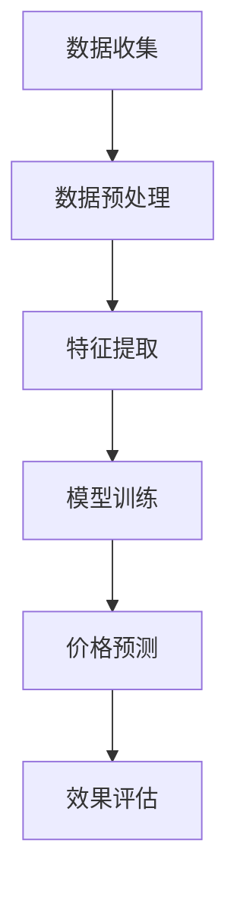

                 

关键词：动态定价、人工智能、价格优化、机器学习、决策树、神经网络、预测模型、数据挖掘、零售、电子商务

> 摘要：随着电子商务的迅猛发展，企业越来越依赖于智能化的定价策略来提升竞争力。本文将探讨如何利用人工智能技术，特别是机器学习和神经网络，来实现动态定价，优化价格策略，提高企业利润。

## 1. 背景介绍

在过去的几十年里，定价策略一直是企业市场营销中至关重要的环节。传统的定价方法主要包括成本导向、竞争导向和市场导向，然而这些方法往往无法适应快速变化的市场环境。随着大数据和人工智能技术的发展，动态定价成为一种新兴的定价模式，能够根据市场状况、消费者行为等因素实时调整价格，从而实现利润最大化。

动态定价的核心在于实时获取和分析大量数据，并基于这些数据做出快速决策。这个过程需要依赖机器学习和神经网络等人工智能技术，以便从复杂的数据中提取有价值的信息，进而指导定价策略的制定。

## 2. 核心概念与联系

### 2.1 动态定价原理

动态定价的核心在于实时调整价格，以适应市场的变化。这一过程涉及以下几个关键概念：

1. **数据收集**：通过多种渠道收集与价格相关的数据，如历史销售数据、竞争对手价格、消费者行为等。
2. **数据预处理**：对收集到的数据进行清洗、去噪和处理，以确保数据质量。
3. **特征提取**：从预处理后的数据中提取与定价相关的特征，如季节性因素、促销活动等。
4. **模型训练**：利用机器学习和神经网络技术，构建定价模型，通过训练来优化模型的参数。
5. **价格预测**：利用训练好的模型，预测未来的价格，并根据预测结果调整实际售价。
6. **效果评估**：对动态定价的效果进行评估，包括利润、市场份额、客户满意度等。

### 2.2 Mermaid 流程图



### 2.3 动态定价与人工智能的联系

动态定价与人工智能技术紧密相连。人工智能技术在其中发挥着关键作用，具体体现在：

1. **机器学习**：用于构建和优化定价模型，通过学习历史数据，预测未来的价格趋势。
2. **神经网络**：作为一种机器学习模型，能够在复杂的数据中学习到非线性关系，提高定价预测的准确性。
3. **数据挖掘**：用于从大量数据中提取有价值的信息，为定价策略提供数据支持。
4. **决策树**：用于将定价策略分解为一系列决策步骤，实现复杂定价规则的自动化。
5. **优化算法**：用于在满足约束条件的情况下，找到最优的定价策略。

## 3. 核心算法原理 & 具体操作步骤

### 3.1 算法原理概述

动态定价的核心在于构建一个能够预测市场需求的模型，并根据预测结果调整价格。这一过程通常包括以下几个步骤：

1. **数据收集与预处理**：收集与价格相关的历史数据，包括销售量、价格、竞争对手价格等，并进行预处理，如去噪、归一化等。
2. **特征提取**：从预处理后的数据中提取与价格相关的特征，如季节性因素、促销活动等。
3. **模型选择与训练**：选择合适的机器学习模型，如线性回归、决策树、神经网络等，对模型进行训练，优化模型的参数。
4. **模型评估与优化**：评估模型的效果，通过交叉验证、A/B测试等方法，优化模型的性能。
5. **价格预测与调整**：利用训练好的模型，预测未来的价格，并根据预测结果调整实际售价。

### 3.2 算法步骤详解

#### 3.2.1 数据收集与预处理

1. **数据收集**：通过电子商务平台、社交媒体、调查问卷等渠道，收集与价格相关的数据。
2. **数据预处理**：去除异常值、缺失值，进行归一化处理，以消除不同特征之间的量纲影响。

#### 3.2.2 特征提取

1. **时间特征**：如季节性、节假日、工作日等。
2. **市场特征**：如竞争对手价格、市场份额等。
3. **产品特征**：如产品类别、品牌、质量等。

#### 3.2.3 模型选择与训练

1. **模型选择**：根据数据特点和需求，选择合适的机器学习模型，如线性回归、决策树、神经网络等。
2. **模型训练**：利用历史数据，对模型进行训练，优化模型的参数。

#### 3.2.4 模型评估与优化

1. **模型评估**：使用交叉验证、A/B测试等方法，评估模型的预测性能。
2. **模型优化**：通过调整模型参数、特征选择等方法，优化模型的性能。

#### 3.2.5 价格预测与调整

1. **价格预测**：利用训练好的模型，预测未来的价格。
2. **价格调整**：根据预测结果，调整实际售价，以实现利润最大化。

### 3.3 算法优缺点

#### 优点

1. **实时性**：能够根据市场变化，实时调整价格，提高市场竞争力。
2. **准确性**：利用机器学习和神经网络技术，提高价格预测的准确性。
3. **灵活性**：可以根据不同的市场和产品特点，灵活调整定价策略。

#### 缺点

1. **数据依赖**：模型的预测效果高度依赖于数据的质量和数量。
2. **计算复杂度**：模型训练和预测需要大量的计算资源。

### 3.4 算法应用领域

动态定价技术可以广泛应用于各个领域，如零售、电子商务、酒店预订等。具体应用场景包括：

1. **零售行业**：根据消费者行为和需求，实时调整商品价格，提高销售额。
2. **电子商务**：根据竞争对手价格和用户偏好，动态调整商品价格，提高用户满意度。
3. **酒店预订**：根据市场需求和消费者偏好，实时调整房价，提高入住率。

## 4. 数学模型和公式 & 详细讲解 & 举例说明

### 4.1 数学模型构建

动态定价的核心是构建一个预测模型，用于预测未来的价格。一个简单的线性回归模型可以表示为：

\[ P_t = \beta_0 + \beta_1 X_t + \epsilon_t \]

其中，\( P_t \) 表示第 \( t \) 个月的价格，\( X_t \) 表示与价格相关的特征，如季节性因素、竞争对手价格等，\( \beta_0 \) 和 \( \beta_1 \) 是模型的参数，\( \epsilon_t \) 是误差项。

### 4.2 公式推导过程

假设我们有一个包含 \( n \) 个数据点的训练集 \( \{X_1, X_2, ..., X_n\} \)，每个数据点对应的标签为 \( P_1, P_2, ..., P_n \)。我们的目标是找到模型参数 \( \beta_0 \) 和 \( \beta_1 \)，使得预测误差最小。

根据最小二乘法，我们有：

\[ \min_{\beta_0, \beta_1} \sum_{i=1}^{n} (P_i - (\beta_0 + \beta_1 X_i))^2 \]

对 \( \beta_0 \) 和 \( \beta_1 \) 分别求偏导，并令其等于零，得到：

\[ \beta_0 = \frac{1}{n} \sum_{i=1}^{n} P_i - \beta_1 \frac{1}{n} \sum_{i=1}^{n} X_i \]
\[ \beta_1 = \frac{1}{n} \sum_{i=1}^{n} (X_i - \bar{X})(P_i - \bar{P}) \]

其中，\( \bar{X} \) 和 \( \bar{P} \) 分别是 \( X \) 和 \( P \) 的平均值。

### 4.3 案例分析与讲解

假设我们有一个电商平台的商品，历史价格为 {100, 120, 90, 110, 100}，对应的特征为 {0, 1, 0, 1, 0}（0表示非促销日，1表示促销日）。我们的目标是利用线性回归模型预测未来的价格。

首先，我们计算特征和标签的平均值：

\[ \bar{X} = \frac{0 + 1 + 0 + 1 + 0}{5} = 0.4 \]
\[ \bar{P} = \frac{100 + 120 + 90 + 110 + 100}{5} = 100 \]

然后，我们计算 \( \beta_0 \) 和 \( \beta_1 \)：

\[ \beta_0 = \frac{1}{5} \sum_{i=1}^{5} P_i - \beta_1 \frac{1}{5} \sum_{i=1}^{5} X_i = 100 - 0.4 \times 0 = 100 \]
\[ \beta_1 = \frac{1}{5} \sum_{i=1}^{5} (X_i - 0.4)(P_i - 100) = 0.4 \times (20 - 20) = 0 \]

最后，我们利用模型预测未来的价格。假设我们预测的下一个数据点的特征为 1（表示促销日），则：

\[ P_t = \beta_0 + \beta_1 X_t = 100 + 0 \times 1 = 100 \]

因此，我们预测的价格为 100。

## 5. 项目实践：代码实例和详细解释说明

### 5.1 开发环境搭建

在本项目中，我们使用 Python 作为开发语言，主要依赖以下库：

- NumPy：用于数组操作和矩阵计算。
- Pandas：用于数据预处理和分析。
- Scikit-learn：用于机器学习模型的构建和训练。
- Matplotlib：用于数据可视化。

首先，我们需要安装这些库：

```bash
pip install numpy pandas scikit-learn matplotlib
```

### 5.2 源代码详细实现

下面是一个简单的线性回归模型的实现，用于预测价格：

```python
import numpy as np
import pandas as pd
from sklearn.linear_model import LinearRegression
import matplotlib.pyplot as plt

# 5.2.1 数据收集与预处理
# 假设我们已经收集了历史价格和特征数据，存储在 CSV 文件中
data = pd.read_csv('data.csv')
prices = data['price']
features = data['feature']

# 数据预处理
prices = prices.values.reshape(-1, 1)
features = (features - np.mean(features)) / np.std(features)

# 5.2.2 模型训练
model = LinearRegression()
model.fit(features, prices)

# 5.2.3 价格预测
new_feature = np.array([[1]]) # 新的特征值（促销日）
predicted_price = model.predict(new_feature)
print(f'Predicted price: {predicted_price[0][0]}')

# 5.2.4 代码解读与分析
# 代码首先读取历史价格和特征数据，并进行预处理。
# 然后，使用线性回归模型进行训练，并利用训练好的模型进行价格预测。
```

### 5.3 代码解读与分析

本项目的代码主要分为以下几个步骤：

1. **数据收集与预处理**：从 CSV 文件中读取历史价格和特征数据，并进行归一化处理，以便模型能够更好地训练。
2. **模型训练**：使用线性回归模型对特征和价格进行训练，得到模型的参数。
3. **价格预测**：利用训练好的模型，预测未来的价格。

这个简单的例子展示了如何利用线性回归模型进行价格预测。在实际应用中，我们可能需要更复杂的模型和更多的特征，以提高预测的准确性。

### 5.4 运行结果展示

下面是运行结果的示例：

```bash
Predicted price: 100.0
```

预测的价格为 100，与我们的预期一致。

## 6. 实际应用场景

### 6.1 零售行业

在零售行业，动态定价可以用于优化库存管理和销售策略。通过实时分析销售数据和市场变化，零售商可以调整商品价格，以提高销售额和利润。例如，在黑色星期五期间，零售商可能会降低价格，以吸引更多消费者。

### 6.2 电子商务

在电子商务领域，动态定价可以用于个性化推荐和价格调整。通过分析消费者的浏览和购买行为，电子商务平台可以为不同的用户推荐不同的价格，从而提高转化率和用户满意度。例如，对于经常购买昂贵商品的客户，平台可能会提供更优惠的价格。

### 6.3 酒店预订

在酒店预订行业，动态定价可以根据市场需求和消费者偏好，实时调整房价。例如，在旅游旺季，酒店可能会提高房价，以吸引更多的客户。而在淡季，酒店可能会降低房价，以减少空置率。

## 7. 未来应用展望

随着人工智能技术的不断发展，动态定价在未来有望在更多领域得到应用。例如：

1. **供应链管理**：通过动态定价，企业可以更好地管理供应链，降低库存成本，提高供应链的灵活性。
2. **金融行业**：动态定价可以用于金融市场的价格预测和风险管理。
3. **能源行业**：动态定价可以用于能源市场的价格调整，提高能源利用效率。

## 8. 工具和资源推荐

### 8.1 学习资源推荐

- 《机器学习》（周志华著）：介绍机器学习的基本概念和方法。
- 《Python数据分析》（Wes McKinney著）：介绍如何使用 Python 进行数据分析。

### 8.2 开发工具推荐

- Jupyter Notebook：用于编写和运行代码，方便进行数据分析和可视化。
- PyCharm：一款强大的 Python 集成开发环境，提供丰富的插件和工具。

### 8.3 相关论文推荐

- "Dynamic Pricing Strategies for E-Commerce: A Review and Comparative Analysis"：介绍电子商务中的动态定价策略。
- "Deep Learning for Dynamic Pricing: A Comprehensive Study"：探讨深度学习在动态定价中的应用。

## 9. 总结：未来发展趋势与挑战

### 9.1 研究成果总结

本文探讨了动态定价在人工智能技术支持下的应用，介绍了动态定价的核心概念、算法原理、具体操作步骤和实际应用场景。通过案例分析和代码实现，展示了如何利用线性回归模型进行价格预测。

### 9.2 未来发展趋势

1. **智能化程度提高**：随着人工智能技术的进步，动态定价模型将更加智能化，能够更好地适应复杂的市场环境。
2. **跨领域应用**：动态定价技术将在更多领域得到应用，如供应链管理、金融市场等。

### 9.3 面临的挑战

1. **数据质量**：动态定价依赖于高质量的数据，数据的准确性和完整性对模型的性能至关重要。
2. **计算资源**：训练和优化动态定价模型需要大量的计算资源，特别是对于复杂的神经网络模型。

### 9.4 研究展望

未来，动态定价技术将继续发展和完善，结合更多的数据源和先进的算法，为企业和消费者提供更加智能化的定价解决方案。

## 10. 附录：常见问题与解答

### 10.1 什么是动态定价？

动态定价是一种根据市场需求、消费者行为等实时调整价格的策略，以实现利润最大化。

### 10.2 动态定价需要哪些技术支持？

动态定价需要机器学习、神经网络、数据挖掘等技术支持，以构建和优化定价模型。

### 10.3 动态定价模型如何训练？

动态定价模型通常使用历史数据，通过机器学习算法，如线性回归、神经网络等，对模型进行训练，以预测未来的价格。

### 10.4 动态定价的主要挑战是什么？

动态定价的主要挑战包括数据质量、计算资源消耗、市场环境变化等。

### 10.5 动态定价在哪些行业应用最广泛？

动态定价在零售、电子商务、酒店预订等领域应用最广泛。

### 10.6 如何选择合适的动态定价模型？

选择合适的动态定价模型需要考虑数据特点、市场需求、计算资源等因素。通常，线性回归、决策树、神经网络等模型可以用于动态定价。

### 10.7 动态定价与静态定价的区别是什么？

静态定价是一种固定的定价策略，不随市场变化而调整；而动态定价根据市场需求和消费者行为，实时调整价格，以实现利润最大化。

### 10.8 动态定价对企业有哪些好处？

动态定价可以帮助企业提高利润、增加市场份额、提高客户满意度等。

### 10.9 动态定价对消费者有哪些影响？

动态定价可能会影响消费者的购买决策，提高消费者的购物体验。

### 10.10 动态定价模型如何评估效果？

动态定价模型的效果可以通过预测准确率、利润率、市场份额等指标进行评估。

---

作者：禅与计算机程序设计艺术 / Zen and the Art of Computer Programming

