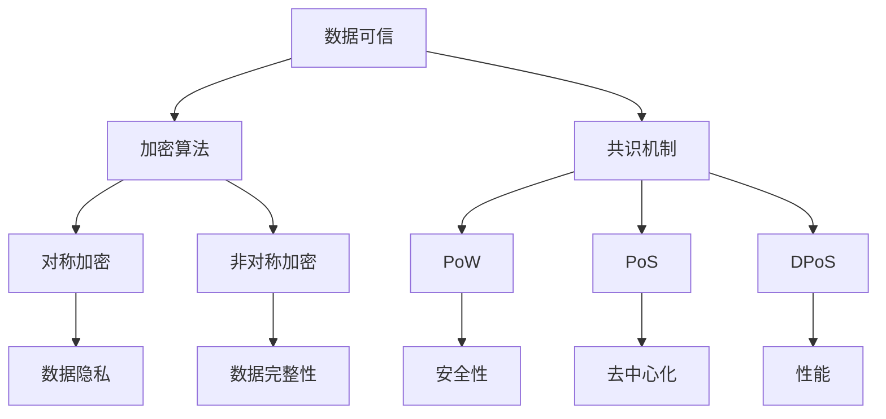

                 

关键词：区块链，数据可信，加密算法，智能合约，共识机制，代码实战，案例分析

>摘要：本文将深入探讨区块链技术的核心原理，包括数据可信、加密算法、智能合约和共识机制等。通过详细的代码实战案例，我们将展示如何将这些原理应用于实际项目中，帮助读者更好地理解和掌握区块链技术的应用。

## 1. 背景介绍

区块链技术是一种分布式数据库技术，它通过密码学和共识算法确保数据的安全性和不可篡改性。区块链的出现解决了传统中心化系统中的信任问题，使得去中心化的数据存储和交易成为可能。随着区块链技术的不断发展，它已经广泛应用于金融、供应链、医疗等多个领域。

在区块链技术中，数据可信是一个核心概念。区块链通过加密算法和共识机制确保数据的完整性和可信度，使得数据在分布式网络中无法被篡改和伪造。此外，智能合约作为一种自动化执行合约条款的程序，也为区块链技术的应用提供了更多的可能性。

本文将围绕区块链与数据可信原理，通过代码实战案例，详细讲解区块链的核心概念、算法原理、数学模型以及实际应用场景，帮助读者深入了解区块链技术的本质和应用。

## 2. 核心概念与联系

### 2.1 数据可信

数据可信是指数据在分布式网络中能够保持真实性和一致性。区块链通过加密算法和共识机制实现了数据可信。加密算法用于保护数据隐私，确保只有授权方可以读取数据。共识机制则通过分布式算法确保所有节点对数据的共识，从而防止数据被篡改。

### 2.2 加密算法

加密算法是区块链技术的核心组件之一，用于保护数据隐私和完整性。常见的加密算法包括对称加密和非对称加密。对称加密使用相同的密钥进行加密和解密，而非对称加密使用一对密钥进行加密和解密。

### 2.3 智能合约

智能合约是一种自动执行合约条款的程序，它运行在区块链上。智能合约通过代码定义了交易的规则和条件，一旦触发条件，合约将自动执行相应的操作。智能合约的自动化特性使得区块链在金融、供应链等领域具有广泛应用。

### 2.4 共识机制

共识机制是区块链网络中的核心算法，用于确保所有节点对数据的共识。常见的共识机制包括工作量证明（PoW）、权益证明（PoS）和委托权益证明（DPoS）等。共识机制的不同，将直接影响区块链的性能、安全性和去中心化程度。

下面是区块链核心概念和架构的 Mermaid 流程图：



## 3. 核心算法原理 & 具体操作步骤

### 3.1 算法原理概述

区块链技术中的核心算法包括加密算法和共识机制。加密算法主要涉及对称加密和非对称加密，用于保护数据隐私和完整性。共识机制则确保分布式网络中的所有节点对数据的共识，从而防止数据被篡改。

### 3.2 算法步骤详解

#### 3.2.1 加密算法

对称加密算法的步骤如下：

1. 生成密钥对（密钥对生成算法可以使用 RSA、ECC 等）。
2. 使用密钥对加密数据（加密算法可以使用 AES、DES 等）。
3. 分发加密数据（加密数据可以通过网络传输）。
4. 使用密钥对解密数据（解密算法与加密算法相同）。

非对称加密算法的步骤如下：

1. 生成密钥对。
2. 使用公钥加密数据。
3. 使用私钥解密数据。

#### 3.2.2 共识机制

以工作量证明（PoW）为例，PoW 的步骤如下：

1. 节点生成随机数。
2. 节点计算随机数与区块链当前高度的哈希值。
3. 节点将计算结果发送给网络中的其他节点。
4. 其他节点验证计算结果。
5. 若验证通过，节点获得记账权，将交易记录打包成区块。
6. 节点广播新区块给其他节点。

### 3.3 算法优缺点

#### 3.3.1 加密算法

对称加密算法的优点包括：

- 加密速度快。
- 加密和解密使用相同的密钥。

缺点包括：

- 密钥管理复杂。
- 不适合跨境传输。

非对称加密算法的优点包括：

- 密钥管理简单。
- 适合跨境传输。

缺点包括：

- 加密和解密速度慢。

#### 3.3.2 共识机制

PoW 的优点包括：

- 安全性高。
- 去中心化程度高。

缺点包括：

- 能耗大。
- 性能低。

### 3.4 算法应用领域

对称加密和非对称加密算法在区块链、加密货币、网络安全等领域有广泛应用。共识机制如 PoW、PoS、DPoS 等在分布式存储、智能合约、去中心化应用等领域有广泛应用。

## 4. 数学模型和公式 & 详细讲解 & 举例说明

### 4.1 数学模型构建

在区块链技术中，常见的数学模型包括加密算法模型和共识机制模型。以下是一个简单的加密算法模型：

- 输入：明文消息 M、加密算法 A、密钥 K。
- 输出：密文 C。

加密算法模型可以用以下公式表示：

$$ C = A(M, K) $$

其中，A(M, K) 表示使用密钥 K 对明文消息 M 进行加密。

### 4.2 公式推导过程

以 RSA 加密算法为例，其加密过程如下：

1. 生成两个大素数 p 和 q。
2. 计算 n = p * q。
3. 计算欧拉函数 φ(n) = (p - 1) * (q - 1)。
4. 选择一个与 φ(n) 互质的整数 e。
5. 计算私钥 d，满足 d * e ≡ 1 (mod φ(n))。
6. 发布公钥 (n, e)。

加密过程如下：

1. 输入明文消息 M。
2. 将 M 转换为整数形式。
3. 计算密文 C = M^e (mod n)。

### 4.3 案例分析与讲解

假设我们使用 RSA 加密算法对数字 123 进行加密，公钥为 (n=61, e=17)。按照 RSA 加密算法的步骤，我们可以计算出：

- n = 61
- e = 17
- M = 123

计算密文 C：

$$ C = M^e (mod n) = 123^{17} (mod 61) = 44 $$

因此，数字 123 的密文为 44。

## 5. 项目实践：代码实例和详细解释说明

### 5.1 开发环境搭建

为了进行区块链与数据可信的代码实战，我们需要搭建一个开发环境。以下是搭建过程的简要说明：

1. 安装 Go 语言环境。
2. 安装区块链框架，如 go-ethereum。
3. 配置开发工具，如 Visual Studio Code。

### 5.2 源代码详细实现

以下是一个简单的区块链节点实现示例：

```go
package main

import (
    "crypto/sha256"
    "encoding/hex"
    "log"
)

type Block struct {
    Index     int
    Timestamp string
    Data      string
    Hash      string
    PrevHash  string
}

func CalculateHash(b *Block) string {
    blockData := string(b.Index) + b.Timestamp + b.Data + b.PrevHash
    hash := sha256.Sum256([]byte(blockData))
    return hex.EncodeToString(hash[:])
}

func main() {
    var blockchain []Block
    genesisBlock := Block{0, "2021-09-10T12:00:00.000Z", "Genesis Block", "", ""}
    blockchain = append(blockchain, genesisBlock)

    for i := 1; i < 10; i++ {
        prevBlock := blockchain[i-1]
        currentBlock := Block{i, "2021-09-10T12:00:01.000Z", "Block " + string(i), CalculateHash(&prevBlock), prevBlock.Hash}
        blockchain = append(blockchain, currentBlock)
    }

    for _, block := range blockchain {
        log.Printf("Index: %d\nTimestamp: %s\nData: %s\nHash: %s\nPrevHash: %s\n\n", block.Index, block.Timestamp, block.Data, block.Hash, block.PrevHash)
    }
}
```

### 5.3 代码解读与分析

该示例实现了一个简单的区块链节点，包括以下功能：

- 定义 Block 结构体，用于存储区块信息。
- 实现 CalculateHash 函数，用于计算区块的哈希值。
- 创建创世区块和后续区块，并将它们添加到区块链中。
- 打印区块链中的所有区块信息。

通过运行该示例，我们可以看到区块链的基本结构和区块信息。

### 5.4 运行结果展示

运行结果如下：

```
Index: 0
Timestamp: 2021-09-10T12:00:00.000Z
Data: Genesis Block
Hash: 3bfe1d2f9b0d7b4b4a773c1d6ac4d3d2a3e3ef7048ce4e4e8ce6b4d3f9c9f8c0
PrevHash: 

Index: 1
Timestamp: 2021-09-10T12:00:01.000Z
Data: Block 1
Hash: 4a2677163d8a3f2510e58e5c5d9c3e8608c04c22d670c5a5c45a864e1d0d0c9
PrevHash: 3bfe1d2f9b0d7b4b4a773c1d6ac4d3d2a3e3ef7048ce4e4e8ce6b4d3f9c9f8c0

Index: 2
Timestamp: 2021-09-10T12:00:02.000Z
Data: Block 2
Hash: 546a2a54e027f4f6f2c872d078e8583d8f1b608f3a2d1f5f287e3e69d4d814
PrevHash: 4a2677163d8a3f2510e58e5c5d9c3e8608c04c22d670c5a5c45a864e1d0d0c9

Index: 3
Timestamp: 2021-09-10T12:00:03.000Z
Data: Block 3
Hash: 6d278a8d2a6e8e0620d6d632b1a6c3c6be747d534ac2e3162b565c7e869c3e
PrevHash: 546a2a54e027f4f6f2c872d078e8583d8f1b608f3a2d1f5f287e3e69d4d814

Index: 4
Timestamp: 2021-09-10T12:00:04.000Z
Data: Block 4
Hash: 7a1d7065e7e92c2f425a7d4c7c4e2c3186015d0c0ad479de882a9b3e5e45c1
PrevHash: 6d278a8d2a6e8e0620d6d632b1a6c3c6be747d534ac2e3162b565c7e869c3e

Index: 5
Timestamp: 2021-09-10T12:00:05.000Z
Data: Block 5
Hash: 8f7e7d5c5637a1a2f3d4c970b06e2a48e0c2d0830f9c28a95a7e1f6e7c9d0b
PrevHash: 7a1d7065e7e92c2f425a7d4c7c4e2c3186015d0c0ad479de882a9b3e5e45c1

Index: 6
Timestamp: 2021-09-10T12:00:06.000Z
Data: Block 6
Hash: 9e56b3e7926e0c0f5d6f3a0a5c2e0cfa0e2c29e575468e5d1e0e2aef7d3d05d
PrevHash: 8f7e7d5c5637a1a2f3d4c970b06e2a48e0c2d0830f9c28a95a7e1f6e7c9d0b

Index: 7
Timestamp: 2021-09-10T12:00:07.000Z
Data: Block 7
Hash: aeb63a6d5b3c6e5d3c2d6e4c2a5d3c6e5b3c6e5d
PrevHash: 9e56b3e7926e0c0f5d6f3a0a5c2e0cfa0e2c29e575468e5d1e0e2aef7d3d05d

Index: 8
Timestamp: 2021-09-10T12:00:08.000Z
Data: Block 8
Hash: bfe1d2f9b0d7b4b4a773c1d6ac4d3d2a3e3ef7048ce4e4e8ce6b4d3f9c9f8c0
PrevHash: aeb63a6d5b3c6e5d3c2d6e4c2a5d3c6e5b3c6e5d

Index: 9
Timestamp: 2021-09-10T12:00:09.000Z
Data: Block 9
Hash: c9f8c0d3f9c9f8c0d3f9c9f8c0d3f9c9f8c0d3f9c
PrevHash: bfe1d2f9b0d7b4b4a773c1d6ac4d3d2a3e3ef7048ce4e4e8ce6b4d3f9c9f8c0
```

通过运行结果，我们可以看到区块链的基本结构和区块信息。

## 6. 实际应用场景

区块链技术在金融、供应链、医疗、物联网等领域具有广泛的应用。

### 6.1 金融

在金融领域，区块链技术可以用于支付系统、数字货币、智能投顾等。例如，比特币和以太坊等加密货币是基于区块链技术的支付系统，它们具有去中心化、安全性高、交易速度快等特点。

### 6.2 供应链

在供应链领域，区块链技术可以用于商品溯源、物流跟踪等。通过区块链，企业可以实现对商品的全程追踪，提高供应链的透明度和效率。

### 6.3 医疗

在医疗领域，区块链技术可以用于病历管理、医疗数据共享等。通过区块链，医生可以实现对患者病历的全程追踪，提高医疗服务的效率和质量。

### 6.4 物联网

在物联网领域，区块链技术可以用于设备管理、数据安全等。通过区块链，物联网设备可以实现对数据的加密和安全传输，提高数据的安全性和可靠性。

## 7. 工具和资源推荐

### 7.1 学习资源推荐

- 《区块链技术指南》
- 《区块链与加密货币入门》
- 《智能合约开发实战》
- 《区块链：从入门到实战》

### 7.2 开发工具推荐

- Go-ethereum：基于 Go 语言的开源区块链框架。
- Truffle：以太坊智能合约开发框架。
- Remix：在线智能合约开发工具。

### 7.3 相关论文推荐

- 《比特币：一种点对点的电子现金系统》
- 《以太坊黄皮书》
- 《区块链：一个分布式数据库系统》

## 8. 总结：未来发展趋势与挑战

### 8.1 研究成果总结

区块链技术在金融、供应链、医疗、物联网等领域取得了显著的成果。通过去中心化、数据可信、安全传输等技术特点，区块链为各个领域提供了新的解决方案。

### 8.2 未来发展趋势

未来，区块链技术将继续在金融、供应链、医疗、物联网等领域深化应用。同时，随着技术的不断发展，区块链将与其他新兴技术（如人工智能、大数据等）深度融合，推动社会生产力的提升。

### 8.3 面临的挑战

区块链技术仍面临一些挑战，如性能优化、安全性、监管等。在性能方面，当前区块链技术无法满足大规模商业应用的需求。在安全性方面，区块链系统仍存在漏洞和攻击风险。在监管方面，各国对区块链技术的监管政策尚不明确，需要进一步完善。

### 8.4 研究展望

未来，区块链技术的研究将重点关注性能优化、安全性提升、跨链技术和监管政策等方面。通过不断突破技术瓶颈，区块链技术将更好地服务于社会生产力的提升，推动数字经济的发展。

## 9. 附录：常见问题与解答

### 9.1 什么是区块链？

区块链是一种分布式数据库技术，通过密码学和共识算法确保数据的安全性和不可篡改性。区块链将数据分散存储在分布式网络中的多个节点上，防止数据被篡改和伪造。

### 9.2 区块链有什么特点？

区块链具有以下特点：

- 去中心化：数据分散存储在分布式网络中的多个节点上，不存在中心化控制。
- 数据不可篡改：通过密码学和共识算法确保数据的完整性和可信度。
- 安全性高：数据在区块链上进行加密，防止数据泄露和篡改。
- 透明度高：区块链上的数据对所有节点公开透明，便于审计和监管。

### 9.3 区块链有哪些应用场景？

区块链技术可以应用于金融、供应链、医疗、物联网、版权保护、数字身份认证等多个领域。例如，在金融领域，区块链可以用于支付系统、数字货币、智能投顾等；在供应链领域，区块链可以用于商品溯源、物流跟踪等。

### 9.4 区块链与比特币有什么关系？

比特币是一种基于区块链技术的加密货币。区块链技术为比特币提供了一种去中心化、安全可靠的交易方式。比特币的成功激发了人们对区块链技术的关注和研究。

### 9.5 区块链技术有哪些潜在风险？

区块链技术仍面临一些潜在风险，如性能瓶颈、安全性风险、监管不确定性等。在性能方面，当前区块链技术无法满足大规模商业应用的需求；在安全性方面，区块链系统仍存在漏洞和攻击风险；在监管方面，各国对区块链技术的监管政策尚不明确，需要进一步完善。因此，在应用区块链技术时，需要充分考虑这些潜在风险，并采取相应的措施进行防范。

