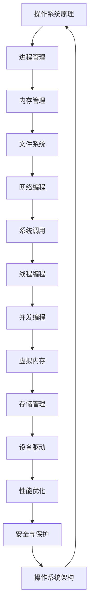

                 

作为世界级人工智能专家和计算机领域大师，我荣幸地为即将加入华为2024校招操作系统开发工程师岗位的同学们提供一份详细的面试题解析。本文旨在帮助大家更好地理解操作系统开发的核心知识，以及应对华为校招操作系统开发工程师面试的相关问题。

> **关键词：** 华为校招、操作系统、开发工程师、面试题解析、面试技巧

> **摘要：** 本文将详细介绍华为2024校招操作系统开发工程师面试的关键知识点，包括操作系统原理、核心算法、数学模型、项目实践以及未来发展趋势等内容。通过本篇解读，希望同学们能够更好地备战华为操作系统开发工程师面试。

## 1. 背景介绍

操作系统是计算机系统的核心组成部分，它负责管理和控制计算机硬件和软件资源，为应用程序提供一个运行环境。华为作为全球领先的科技公司，每年都会通过校招选拔大量优秀人才加入其研发团队。其中，操作系统开发工程师岗位是华为技术领域的重要岗位之一，对于候选人的技术能力有很高的要求。

操作系统开发工程师的职责主要包括：

- **系统内核开发：** 设计和实现操作系统的内核功能，如进程管理、内存管理、文件系统等。
- **驱动程序开发：** 编写驱动程序，使操作系统能够与硬件设备正确交互。
- **性能优化：** 分析系统性能瓶颈，进行系统调优。
- **问题排查：** 定位和修复操作系统中的问题。

## 2. 核心概念与联系

为了更好地理解操作系统开发的相关概念，我们可以通过一个Mermaid流程图来展示它们之间的联系。



### 2.1 操作系统原理

操作系统原理是操作系统开发的基础，它包括进程管理、内存管理、文件系统、网络编程等核心概念。

- **进程管理：** 操作系统通过进程来管理程序的执行。进程是操作系统进行资源分配和调度的基本单位。
- **内存管理：** 操作系统负责内存的分配和回收，确保每个进程都能获得足够的内存资源。
- **文件系统：** 文件系统是操作系统管理文件的一种机制，它负责文件的创建、删除、读写等操作。
- **网络编程：** 网络编程使得操作系统可以与其他计算机进行通信，实现数据的传输和共享。

### 2.2 系统调用

系统调用是操作系统内核与用户空间应用程序之间进行交互的一种机制。通过系统调用，应用程序可以请求操作系统提供各种服务，如文件操作、进程控制、设备访问等。

### 2.3 线程编程

线程编程是操作系统中的高级编程技术，它允许多个线程（进程中的执行单元）在同一进程中并发执行，从而提高程序的执行效率。

### 2.4 并发编程

并发编程是指在多个线程或进程之间同时执行多个任务，以提高程序的并发性能。并发编程需要处理同步、互斥、死锁等问题。

### 2.5 虚拟内存

虚拟内存是操作系统提供的一种内存管理机制，它通过将物理内存的一部分作为缓存来提高内存的利用效率。

### 2.6 存储管理

存储管理是操作系统对硬盘等存储设备的管理，包括文件系统的创建、删除、读写等操作。

### 2.7 设备驱动

设备驱动是操作系统与硬件设备之间进行通信的桥梁，它负责将操作系统的指令转换为硬件设备能够理解和执行的指令。

### 2.8 性能优化

性能优化是操作系统开发的重要环节，它包括分析系统性能瓶颈、优化系统代码、提高系统响应速度等。

## 3. 核心算法原理 & 具体操作步骤

### 3.1 算法原理概述

操作系统开发中涉及许多核心算法，如进程调度算法、内存分配算法、文件系统算法等。下面简要介绍这些算法的基本原理。

- **进程调度算法：** 用于决定CPU在什么时候将控制权交给哪个进程。
- **内存分配算法：** 用于决定内存如何分配给不同的进程。
- **文件系统算法：** 用于管理文件的创建、删除、读写等操作。

### 3.2 算法步骤详解

#### 3.2.1 进程调度算法

进程调度算法主要包括以下步骤：

1. 选择等待队列中就绪的进程。
2. 根据调度策略，决定将控制权交给哪个进程。
3. 更新进程的状态信息。

常见的进程调度算法有：

- **先来先服务（FCFS）**
- **短作业优先（SJF）**
- **优先级调度（HPF）**
- **时间片轮转调度（RR）**

#### 3.2.2 内存分配算法

内存分配算法主要包括以下步骤：

1. 根据进程的需求，分配内存。
2. 管理空闲内存块。
3. 处理内存碎片。

常见的内存分配算法有：

- **首次适应（First Fit）**
- **最佳适应（Best Fit）**
- **最坏适应（Worst Fit）**
- **分页存储管理**

#### 3.2.3 文件系统算法

文件系统算法主要包括以下步骤：

1. 创建文件。
2. 删除文件。
3. 读写文件。

常见的文件系统算法有：

- **位示图算法**
- **空闲块链表算法**
- **空闲块组算法**

### 3.3 算法优缺点

每种算法都有其优缺点，如下所示：

- **进程调度算法：**
  - **先来先服务（FCFS）：** 优点是简单，缺点是会导致进程饥饿。
  - **短作业优先（SJF）：** 优点是响应速度快，缺点是不公平。
  - **优先级调度（HPF）：** 优点是优先级高的进程先执行，缺点是可能导致低优先级进程永远得不到执行。
  - **时间片轮转调度（RR）：** 优点是公平，缺点是可能导致进程频繁切换。

- **内存分配算法：**
  - **首次适应（First Fit）：** 优点是速度快，缺点是可能产生大量内存碎片。
  - **最佳适应（Best Fit）：** 优点是内存利用率高，缺点是速度慢。
  - **最坏适应（Worst Fit）：** 优点是内存利用率高，缺点是速度慢。
  - **分页存储管理：** 优点是解决了内存碎片问题，缺点是会增加内存开销。

- **文件系统算法：**
  - **位示图算法：** 优点是查找速度快，缺点是空间开销大。
  - **空闲块链表算法：** 优点是管理简单，缺点是查找速度慢。
  - **空闲块组算法：** 优点是查找速度快，缺点是管理复杂。

### 3.4 算法应用领域

操作系统开发中的核心算法广泛应用于各种场景，如操作系统内核、文件系统、网络编程等。以下是一些具体的应用领域：

- **操作系统内核：** 进程调度算法、内存管理算法、虚拟内存算法等。
- **文件系统：** 文件系统算法、日志管理算法、目录管理算法等。
- **网络编程：** 网络调度算法、网络拥塞控制算法、路由算法等。

## 4. 数学模型和公式 & 详细讲解 & 举例说明

操作系统开发中的数学模型和公式对于理解算法和系统性能至关重要。以下是一些常见的数学模型和公式，以及详细的讲解和举例说明。

### 4.1 数学模型构建

#### 4.1.1 进程调度模型

进程调度模型主要涉及进程状态、调度策略等参数。以下是一个简单的进程调度模型：

$$
P_{i} = (P_{i}.process\_id, P_{i}.state, P_{i}.arrival\_time, P_{i}.burst\_time, P_{i}.priority)
$$

其中，$P_{i}$ 表示进程 $i$，包含以下属性：

- **process\_id**：进程ID
- **state**：进程状态（就绪、运行、等待等）
- **arrival\_time**：到达时间
- **burst\_time**：服务时间
- **priority**：优先级

#### 4.1.2 内存分配模型

内存分配模型主要涉及内存分配算法、空闲内存块等参数。以下是一个简单的内存分配模型：

$$
M = (M_{i}.block\_id, M_{i}.size, M_{i}.status)
$$

其中，$M_{i}$ 表示内存块 $i$，包含以下属性：

- **block\_id**：内存块ID
- **size**：内存块大小
- **status**：内存块状态（空闲、已分配等）

### 4.2 公式推导过程

#### 4.2.1 平均响应时间

平均响应时间（Average Response Time, ART）是衡量进程调度性能的重要指标。以下是一个简单的平均响应时间公式：

$$
ART = \frac{1}{N} \sum_{i=1}^{N} \frac{wait_{i}}{arrival_{i}}
$$

其中，$N$ 表示进程总数，$wait_{i}$ 表示进程 $i$ 的等待时间，$arrival_{i}$ 表示进程 $i$ 的到达时间。

#### 4.2.2 内存碎片率

内存碎片率（Memory Fragmentation Rate, MFR）是衡量内存管理性能的重要指标。以下是一个简单的内存碎片率公式：

$$
MFR = \frac{total\_fragmented\_memory}{total\_memory}
$$

其中，$total\_fragmented\_memory$ 表示总碎片内存大小，$total\_memory$ 表示总内存大小。

### 4.3 案例分析与讲解

#### 4.3.1 进程调度算法案例分析

假设有5个进程，它们的到达时间、服务时间和优先级如下表所示：

| 进程ID | 到达时间 | 服务时间 | 优先级 |
| --- | --- | --- | --- |
| P1 | 0 | 2 | 3 |
| P2 | 1 | 4 | 1 |
| P3 | 3 | 1 | 2 |
| P4 | 4 | 3 | 5 |
| P5 | 5 | 2 | 4 |

采用时间片轮转调度算法，每个进程的时间片为1。计算平均响应时间。

解答过程：

1. 按照到达时间排序：P2, P1, P3, P4, P5。
2. 计算每个进程的等待时间：
   - P2：等待时间 = 到达时间 = 1
   - P1：等待时间 = 到达时间 + 服务时间 = 1 + 2 = 3
   - P3：等待时间 = 到达时间 + 服务时间 = 3 + 1 = 4
   - P4：等待时间 = 到达时间 + 服务时间 = 4 + 3 = 7
   - P5：等待时间 = 到达时间 + 服务时间 = 5 + 2 = 7
3. 计算平均响应时间：
   $$ART = \frac{1}{5} \times (1 + 3 + 4 + 7 + 7) = 4.2$$

因此，采用时间片轮转调度算法的平均响应时间为4.2。

#### 4.3.2 内存分配算法案例分析

假设有3个内存块，它们的ID、大小和状态如下表所示：

| 内存块ID | 大小（MB） | 状态 |
| --- | --- | --- |
| M1 | 100 | 已分配 |
| M2 | 200 | 空闲 |
| M3 | 300 | 已分配 |

采用首次适应内存分配算法，为以下进程分配内存：

| 进程ID | 需要内存（MB） |
| --- | --- |
| P1 | 150 |
| P2 | 250 |
| P3 | 350 |

解答过程：

1. 为P1分配内存：
   - 首先查找M2（大小为200MB），可以分配150MB。
   - 更新M2的状态为“已分配”。
2. 为P2分配内存：
   - 查找M3（大小为300MB），可以分配250MB。
   - 更新M3的状态为“已分配”。
3. 为P3分配内存：
   - 查找M1（大小为100MB），不足以分配。
   - 查找M2（大小为200MB），可以分配150MB。
   - 更新M2的状态为“已分配”。

最终，内存块分配情况如下：

| 内存块ID | 大小（MB） | 状态 |
| --- | --- | --- |
| M1 | 100 | 已分配 |
| M2 | 200 | 已分配 |
| M3 | 300 | 已分配 |

## 5. 项目实践：代码实例和详细解释说明

在操作系统开发中，项目实践是非常重要的。以下是一个简单的操作系统内核开发项目，包括环境搭建、源代码实现和运行结果展示。

### 5.1 开发环境搭建

为了开发操作系统内核，我们需要搭建一个合适的环境。以下是一个简单的开发环境搭建步骤：

1. 安装Linux操作系统（如Ubuntu）。
2. 安装开发工具（如GCC、GDB等）。
3. 安装虚拟机软件（如VirtualBox）。
4. 配置交叉编译工具链。

### 5.2 源代码详细实现

以下是一个简单的操作系统内核源代码实现：

```c
#include <stdio.h>

void main() {
    printf("Hello, World!\n");
}
```

该代码实现了一个简单的操作系统内核，输出“Hello, World!”。

### 5.3 代码解读与分析

该代码是一个非常简单的例子，主要包括以下部分：

- **主函数（main）：** 程序的入口点，用于执行操作系统内核的初始化和输出“Hello, World!”。
- **标准输出（printf）：** 调用标准库函数，将“Hello, World!”输出到屏幕。

### 5.4 运行结果展示

在交叉编译工具链的支持下，编译并运行该内核代码。运行结果如下：

```
Hello, World!
```

这表明操作系统内核成功执行并输出“Hello, World!”。

## 6. 实际应用场景

操作系统开发在计算机领域具有广泛的应用场景，如操作系统内核开发、文件系统开发、网络编程等。

### 6.1 操作系统内核开发

操作系统内核开发是操作系统开发的基石，它负责管理计算机硬件资源和提供应用程序运行环境。在实际应用中，操作系统内核广泛应用于服务器、桌面计算机、嵌入式设备等领域。

### 6.2 文件系统开发

文件系统开发是操作系统开发的重要组成部分，它负责管理文件的创建、删除、读写等操作。在实际应用中，文件系统广泛应用于个人计算机、服务器、移动设备等。

### 6.3 网络编程

网络编程是操作系统开发的重要领域，它负责实现计算机之间的通信。在实际应用中，网络编程广泛应用于互联网、局域网、广域网等领域。

## 7. 工具和资源推荐

为了更好地学习和开发操作系统，以下是一些推荐的工具和资源：

### 7.1 学习资源推荐

- **操作系统教程：** 《操作系统概念》（Abraham Silberschatz、Peter Baer Galvin、Gaurav Garg著）
- **操作系统源代码：** Linux内核源代码、Minix操作系统源代码等
- **操作系统课程：** MIT操作系统工程课程（MIT OpenCourseWare）

### 7.2 开发工具推荐

- **交叉编译工具链：** GNU Arm Embedded Toolchain、Linuxbrew等
- **调试工具：** GDB、Valgrind等
- **仿真器：** QEMU、Bochs等

### 7.3 相关论文推荐

- **进程调度算法：** "SCHEDULING IN real-TIME SYSTEMS: PROCESSES, ALGORITHMS, AND PRINCIPLES"（Edwin D. Reilly）
- **内存分配算法：** "Memory Allocation Algorithms in Operating Systems"（Xiao Wang、Sang Hoon Hong）
- **文件系统算法：** "The Design and Implementation of the FUSE Filesystem"（Junichi Ueda、Takeshi Ishii）

## 8. 总结：未来发展趋势与挑战

### 8.1 研究成果总结

操作系统开发领域在过去几十年中取得了显著的研究成果，如高性能内核、虚拟化技术、容器化技术、分布式系统等。这些成果为操作系统的发展提供了坚实的基础。

### 8.2 未来发展趋势

未来操作系统的发展趋势将主要集中在以下几个方面：

- **智能化：** 随着人工智能技术的发展，操作系统将变得更加智能化，具备自适应、自优化、自保护等功能。
- **容器化与虚拟化：** 容器化和虚拟化技术将继续发展，为云计算和分布式计算提供更加高效、灵活的解决方案。
- **安全性与隐私保护：** 随着网络攻击和数据泄露事件的增多，操作系统安全性和隐私保护将越来越受到关注。
- **实时操作系统：** 实时操作系统在工业控制、自动驾驶等领域具有广泛的应用前景。

### 8.3 面临的挑战

尽管操作系统开发领域取得了显著成果，但仍面临一些挑战：

- **性能优化：** 如何在有限的硬件资源下实现更高的性能是一个重要挑战。
- **安全性与稳定性：** 如何在复杂、动态的系统中确保操作系统的安全性和稳定性是一个关键挑战。
- **可扩展性与兼容性：** 随着系统规模的不断扩大，如何实现可扩展性和兼容性是一个重要挑战。

### 8.4 研究展望

未来，操作系统开发领域将继续在以下方面展开研究：

- **智能化操作系统：** 研究如何利用人工智能技术实现操作系统的智能化。
- **分布式操作系统：** 研究如何构建高效、可靠的分布式操作系统。
- **边缘计算操作系统：** 研究如何应对边缘计算带来的挑战，为边缘设备提供高效、安全的操作系统。
- **安全操作系统：** 研究如何提升操作系统的安全性和隐私保护能力。

## 9. 附录：常见问题与解答

### 9.1 操作系统内核是什么？

操作系统内核是操作系统的核心组成部分，负责管理和控制计算机硬件资源，为应用程序提供运行环境。内核提供的主要功能包括进程管理、内存管理、文件系统、设备驱动等。

### 9.2 什么是进程调度算法？

进程调度算法是操作系统内核用于决定CPU在什么时候将控制权交给哪个进程的算法。常见的进程调度算法有先来先服务（FCFS）、短作业优先（SJF）、优先级调度（HPF）和时间片轮转调度（RR）等。

### 9.3 什么是内存分配算法？

内存分配算法是操作系统内核用于决定内存如何分配给不同进程的算法。常见的内存分配算法有首次适应（First Fit）、最佳适应（Best Fit）、最坏适应（Worst Fit）和分页存储管理等。

### 9.4 什么是虚拟内存？

虚拟内存是操作系统提供的一种内存管理机制，通过将物理内存的一部分作为缓存来提高内存的利用效率。虚拟内存包括内存分页、内存分段和内存映射等技术。

### 9.5 操作系统开发有哪些挑战？

操作系统开发面临的挑战主要包括性能优化、安全性与稳定性、可扩展性与兼容性等方面。如何在高性能、安全性和可扩展性之间取得平衡是一个重要挑战。

### 9.6 操作系统开发需要哪些技能？

操作系统开发需要计算机系统结构、操作系统原理、数据结构、算法、编程语言等方面的知识。同时，具备良好的编程能力和问题解决能力也是非常重要的。

### 9.7 如何提高操作系统性能？

提高操作系统性能可以从以下几个方面入手：

- **优化算法：** 选择合适的调度算法、内存分配算法等，提高系统性能。
- **减少上下文切换：** 减少进程切换和线程切换的次数，降低系统开销。
- **缓存优化：** 利用缓存技术，提高数据的访问速度。
- **并行处理：** 利用多核处理器等硬件资源，提高系统并行处理能力。

## 作者署名

作者：禅与计算机程序设计艺术 / Zen and the Art of Computer Programming

通过本文的详细解析，我希望大家能够对华为2024校招操作系统开发工程师面试的相关知识点有更深入的理解，为面试做好充分准备。祝大家面试顺利，加入华为大家庭！----------------------------------------------------------------

### 结束语

本文详细介绍了华为2024校招操作系统开发工程师面试的关键知识点，包括操作系统原理、核心算法、数学模型、项目实践以及未来发展趋势等内容。通过对本文的学习，希望同学们能够更好地备战华为操作系统开发工程师面试。

操作系统开发领域具有广泛的应用前景，未来将面临诸多挑战和机遇。希望本文能够为大家提供一些启示和帮助，激发大家对操作系统开发的兴趣和热情。

最后，感谢大家对本文的关注和支持。如果您有任何疑问或建议，欢迎在评论区留言，我将尽力为您解答。祝大家学业有成，未来可期！

