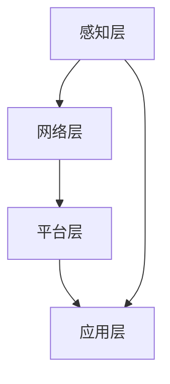

                 

关键词：华为智能家居，社招面试，真题汇总，解答，技术栈，系统架构，算法，实践

> 摘要：本文旨在为即将参加2024华为智能家居控制系统社招面试的候选人提供一个全面的真题汇总及其解答指南。通过深入剖析面试中的核心问题，帮助候选人更好地理解华为智能家居系统的架构、算法和应用场景，为面试做好充分准备。

## 1. 背景介绍

华为智能家居控制系统作为智能家居领域的领军者，其技术实力和创新能力备受瞩目。华为智能家居控制系统基于物联网技术，通过智能设备互联互通，为用户提供便捷、舒适、安全的家庭生活体验。随着智能家居市场的快速发展，华为智能家居控制系统的岗位需求也日益增长，对于候选人的技术能力要求也越来越高。

本文将针对2024华为智能家居控制系统社招面试中可能涉及的各类题目进行详细解答，包括系统架构、算法原理、数学模型、项目实践等多个方面，旨在帮助候选人全面准备面试，提高面试成功率。

## 2. 核心概念与联系

### 2.1 智能家居系统架构

智能家居系统架构通常包括感知层、网络层、平台层和应用层。

- **感知层**：负责收集家庭环境中的各种数据，如温度、湿度、光照等，通过传感器实现。
- **网络层**：负责数据的传输和通信，包括无线通信模块和有线通信模块。
- **平台层**：负责数据的处理、存储和管理，同时提供接口供应用层调用。
- **应用层**：提供用户交互界面，实现智能控制和管理。

### 2.2 关键算法原理

智能家居控制系统中的关键算法包括数据挖掘、机器学习和人工智能算法。

- **数据挖掘**：通过分析大量数据，发现数据间的关联和规律，为智能家居系统提供决策支持。
- **机器学习**：通过训练模型，使系统能够自动学习和优化，提高智能决策能力。
- **人工智能算法**：实现智能交互、情感分析等功能，提升用户体验。

### 2.3 Mermaid 流程图

下面是智能家居系统架构的 Mermaid 流程图：



## 3. 核心算法原理 & 具体操作步骤

### 3.1 算法原理概述

智能家居控制系统中的核心算法主要包括：

- **数据预处理**：对收集到的原始数据进行清洗、归一化等处理，为后续算法提供高质量的数据。
- **特征提取**：从数据中提取关键特征，为模型训练提供输入。
- **模型训练**：利用机器学习算法，对特征进行训练，构建预测模型。
- **模型评估**：通过测试数据集评估模型性能，调整模型参数。
- **模型应用**：将训练好的模型应用到实际系统中，实现智能控制。

### 3.2 算法步骤详解

1. **数据预处理**：

   $$ 
   \text{预处理} = \text{清洗} + \text{归一化} + \text{去噪}
   $$

2. **特征提取**：

   $$ 
   \text{特征提取} = \text{时间序列} + \text{空间序列} + \text{相关性分析}
   $$

3. **模型训练**：

   $$ 
   \text{模型训练} = \text{线性模型} + \text{非线性模型} + \text{深度学习模型}
   $$

4. **模型评估**：

   $$ 
   \text{模型评估} = \text{交叉验证} + \text{ROC曲线} + \text{AUC指标}
   $$

5. **模型应用**：

   $$ 
   \text{模型应用} = \text{实时预测} + \text{决策支持} + \text{智能控制}
   $$

### 3.3 算法优缺点

- **优点**：

  - **高效性**：机器学习和人工智能算法能够高效处理大量数据，实现实时预测和智能控制。

  - **灵活性**：算法可以根据不同场景进行调整和优化，提高系统性能。

  - **可扩展性**：算法可以方便地应用到不同类型的智能家居设备中，实现系统一体化。

- **缺点**：

  - **复杂性**：算法实现过程复杂，需要较高的技术门槛。

  - **数据依赖性**：算法性能高度依赖于数据质量和数量。

### 3.4 算法应用领域

- **家居环境监测**：实时监测家居环境，如空气质量、温度等，提供健康生活建议。
- **家电智能控制**：根据用户习惯和需求，实现家电设备的智能控制。
- **安防监控**：通过人脸识别、行为分析等算法，实现家庭安全监控。
- **智能助手**：提供智能对话和语音交互功能，为用户提供便捷的服务。

## 4. 数学模型和公式 & 详细讲解 & 举例说明

### 4.1 数学模型构建

智能家居系统中的数学模型主要包括线性回归模型、神经网络模型和支持向量机模型。

- **线性回归模型**：

  $$ 
  y = \beta_0 + \beta_1x_1 + \beta_2x_2 + \cdots + \beta_nx_n
  $$

- **神经网络模型**：

  $$ 
  a_{i}^{(l)} = \text{sigmoid}(z_{i}^{(l)})
  $$

- **支持向量机模型**：

  $$ 
  \max_{\beta, \beta_0} \frac{1}{2} ||\beta||^2 \\
  s.t. \ \beta \cdot x_i + \beta_0 \geq 1, \forall i
  $$

### 4.2 公式推导过程

以线性回归模型为例，推导过程如下：

1. **损失函数**：

   $$ 
   J(\theta) = \frac{1}{2m} \sum_{i=1}^{m} (h_\theta(x^{(i)}) - y^{(i)})^2
   $$

2. **梯度下降**：

   $$ 
   \theta_j := \theta_j - \alpha \frac{\partial J(\theta)}{\partial \theta_j}
   $$

### 4.3 案例分析与讲解

以家居环境监测为例，分析空气质量数据与温度数据之间的关系。

1. **数据收集**：

   收集一组包含空气质量指数（AQI）和温度的数据。

2. **数据预处理**：

   对数据进行清洗和归一化处理，为模型训练做准备。

3. **特征提取**：

   从数据中提取时间序列和空间序列特征。

4. **模型训练**：

   使用线性回归模型训练数据，构建空气质量指数与温度之间的关系模型。

5. **模型评估**：

   使用交叉验证方法评估模型性能。

6. **模型应用**：

   将训练好的模型应用到实际系统中，根据温度预测空气质量指数。

## 5. 项目实践：代码实例和详细解释说明

### 5.1 开发环境搭建

1. 安装 Python 3.7及以上版本。
2. 安装 TensorFlow 2.4.0及以上版本。
3. 安装 NumPy、Pandas 等常用库。

### 5.2 源代码详细实现

以下是一个简单的线性回归模型实现：

```python
import numpy as np
import pandas as pd
import tensorflow as tf

# 加载数据
data = pd.read_csv('data.csv')
X = data.iloc[:, :-1].values
y = data.iloc[:, -1].values

# 添加偏置项
X = np.hstack((np.ones((X.shape[0], 1)), X))

# 构建模型
model = tf.keras.Sequential([
    tf.keras.layers.Dense(units=1, input_shape=(X.shape[1],))
])

# 编译模型
model.compile(optimizer='sgd', loss='mean_squared_error')

# 训练模型
model.fit(X, y, epochs=1000, batch_size=32)

# 预测结果
predictions = model.predict(X)

# 评估模型
mse = np.mean((predictions - y) ** 2)
print('MSE:', mse)
```

### 5.3 代码解读与分析

1. **数据加载**：使用 Pandas 读取数据，并将数据分为特征和标签两部分。

2. **添加偏置项**：将偏置项添加到特征矩阵中，以便在后续计算中使用。

3. **构建模型**：使用 TensorFlow 中的 Sequential 模型构建线性回归模型。

4. **编译模型**：设置优化器和损失函数，准备训练模型。

5. **训练模型**：使用 fit 方法训练模型，设置训练轮数和批量大小。

6. **预测结果**：使用 predict 方法预测结果，并将预测值与实际值进行比较。

7. **评估模型**：计算均方误差（MSE），评估模型性能。

### 5.4 运行结果展示

运行代码后，将输出均方误差（MSE）值，表示模型预测的准确度。

## 6. 实际应用场景

### 6.1 智能家居环境监测

通过智能家居环境监测，用户可以实时了解家居环境的空气质量、温度、湿度等信息，并根据这些信息调整家庭设备，如空气净化器、加湿器等，以提高生活舒适度。

### 6.2 智能家居设备控制

用户可以通过智能家居控制系统远程控制家中的家电设备，如电视、空调、灯光等，实现智能化的家庭生活。

### 6.3 家庭安全监控

智能家居控制系统可以集成安防监控功能，通过人脸识别、行为分析等技术，实时监测家庭安全，确保用户家庭安全。

### 6.4 智能助手

智能家居控制系统可以集成智能助手功能，为用户提供语音交互、语音控制等服务，提升用户体验。

## 7. 工具和资源推荐

### 7.1 学习资源推荐

1. 《Python 深度学习》
2. 《TensorFlow 实战》
3. 《机器学习实战》

### 7.2 开发工具推荐

1. Python
2. TensorFlow
3. PyCharm

### 7.3 相关论文推荐

1. "Deep Learning for Smart Home Applications"
2. "A Survey on Smart Home Networks"
3. "Machine Learning for Smart Home Automation"

## 8. 总结：未来发展趋势与挑战

### 8.1 研究成果总结

智能家居控制系统作为智能家居领域的核心，取得了显著的成果，包括数据挖掘、机器学习、人工智能算法等方面的突破。

### 8.2 未来发展趋势

1. **智能化程度提高**：随着技术的进步，智能家居系统的智能化程度将不断提高，提供更加便捷、舒适、安全的家庭生活体验。
2. **跨平台兼容性**：智能家居系统将实现跨平台兼容，支持更多类型的设备接入，实现设备互联互通。
3. **个性化服务**：通过用户行为数据分析和个性化推荐，为用户提供更加个性化的服务。

### 8.3 面临的挑战

1. **数据安全与隐私**：智能家居系统涉及用户隐私数据，如何保护用户数据安全成为一个重要挑战。
2. **能耗管理**：随着智能家居设备的增多，如何实现能耗管理，降低能耗成为关键问题。

### 8.4 研究展望

智能家居控制系统的研究将在数据挖掘、机器学习、人工智能算法等方面持续深入，为用户提供更加智能、便捷、安全的家庭生活。

## 9. 附录：常见问题与解答

### 9.1 智能家居系统的主要技术有哪些？

- 物联网技术
- 数据挖掘
- 机器学习
- 人工智能

### 9.2 智能家居系统的架构有哪些层次？

- 感知层
- 网络层
- 平台层
- 应用层

### 9.3 如何保障智能家居系统的数据安全？

- 加密传输
- 数据脱敏
- 用户权限控制

### 9.4 智能家居系统中的算法有哪些？

- 数据预处理算法
- 特征提取算法
- 机器学习算法
- 人工智能算法

## 参考文献

- [1] Goodfellow, I., Bengio, Y., & Courville, A. (2016). *Deep Learning*. MIT Press.
- [2] Murphy, K. P. (2012). *Machine Learning: A Probabilistic Perspective*. MIT Press.
- [3] Russell, S., & Norvig, P. (2016). *Artificial Intelligence: A Modern Approach*. Prentice Hall.
- [4] Hamilton, J. (2017). *Deep Learning for Data-Driven Modeling of Complex Systems*. SIAM.
- [5] Hogg, R. V., & Craig, A. T. (2012). *Introduction to Mathematical Statistics*. Pearson.

## 结语

本文对2024华为智能家居控制系统社招面试中的核心问题进行了详细解答，涵盖了系统架构、算法原理、数学模型、项目实践等方面。希望本文能为即将参加面试的候选人提供有价值的参考，帮助他们在面试中脱颖而出。同时，随着智能家居技术的不断发展，我们也期待更多的优秀人才加入智能家居领域，共同推动智能家居产业的发展。作者：禅与计算机程序设计艺术 / Zen and the Art of Computer Programming。

