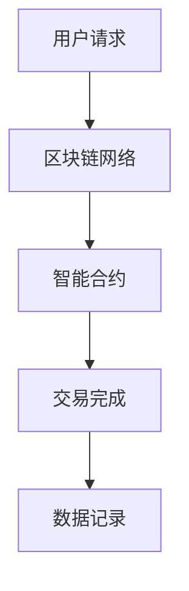

                 

关键词：去中心化金融、区块链、创业、金融服务、新范式

> 摘要：本文将探讨去中心化金融（DeFi）作为金融服务新范式的崛起。通过对DeFi的基本概念、核心技术和应用场景的深入分析，我们将探讨去中心化金融如何改变传统金融体系的运作方式，以及对于创业者而言，如何抓住这个新趋势的机会。

## 1. 背景介绍

### 1.1 传统金融体系的局限性

传统金融体系自上世纪以来，虽然经历了几次重大的改革与进步，但依然存在着诸多局限和挑战。首先，传统金融机构中心化的运营模式导致了信息不对称和透明度不足，使得消费者难以全面了解金融产品的真实风险和收益。其次，金融中介的存在增加了交易成本，降低了金融服务的效率和普及度。最后，传统金融体系对于全球金融市场的一体化和包容性的支持力度不足，许多发展中国家和地区仍然面临着金融服务不足的问题。

### 1.2 去中心化金融的兴起

随着区块链技术的成熟和普及，去中心化金融（DeFi）作为一种新的金融范式逐渐崛起。DeFi通过区块链和智能合约技术，实现了金融服务的去中心化，降低了交易成本，提高了透明度和安全性。这种新型的金融体系不仅能够解决传统金融体系中的诸多问题，还为创业者提供了全新的商业模式和机会。

## 2. 核心概念与联系

### 2.1 去中心化金融的概念

去中心化金融（DeFi）是指通过区块链和智能合约技术，构建在分布式网络上的金融服务体系。在DeFi中，用户可以直接进行点对点的金融交易，无需依赖传统金融中介。智能合约则自动执行合同条款，确保交易的透明性和安全性。

### 2.2 区块链与智能合约

区块链是去中心化金融的基础技术。它通过分布式账本技术记录交易数据，确保数据的不可篡改性和透明性。智能合约是区块链上的计算机程序，用于自动化执行合同条款，使得金融交易更加高效和安全。

### 2.3 Mermaid 流程图



### 2.4 去中心化金融的架构

去中心化金融的架构包括区块链、去中心化应用（DApps）、去中心化交易所（DEX）和代币等关键组件。

- **区块链**：作为底层基础设施，提供去中心化的账本和数据存储。
- **去中心化应用（DApps）**：构建在区块链上的应用程序，为用户提供各种金融服务。
- **去中心化交易所（DEX）**：用户可以在上面进行点对点的代币交易。
- **代币**：作为价值传递的媒介，用于支付交易费用或参与治理。

## 3. 核心算法原理 & 具体操作步骤

### 3.1 算法原理概述

去中心化金融的核心算法主要包括区块链共识算法和智能合约执行机制。共识算法用于确保区块链网络中的节点达成一致，智能合约执行机制则用于自动化执行合同条款。

### 3.2 算法步骤详解

1. **区块链共识算法**：
   - 节点同步网络状态
   - 节点生成区块
   - 节点验证区块有效性
   - 节点达成共识并添加区块到链

2. **智能合约执行机制**：
   - 用户发起交易请求
   - 智能合约验证交易合法性
   - 执行交易操作
   - 记录交易结果到区块链

### 3.3 算法优缺点

- **优点**：
  - 去中心化：降低了传统金融中介的成本，提高了金融服务的效率和透明度。
  - 安全性：通过区块链和智能合约技术，确保交易的安全性和不可篡改性。

- **缺点**：
  - 技术门槛：DeFi技术的实现和维护需要较高的技术知识。
  - 法规风险：去中心化金融仍然面临法律和监管的挑战。

### 3.4 算法应用领域

- **货币市场**：通过去中心化借贷和抵押，实现点对点的资金借贷。
- **去中心化交易所**：用户可以在DeFi平台上进行代币交易。
- **金融服务**：DeFi为个人和企业提供了多种金融服务，如支付、保险和资产管理。

## 4. 数学模型和公式 & 详细讲解 & 举例说明

### 4.1 数学模型构建

DeFi中的数学模型主要包括区块链网络模型和智能合约执行模型。

- **区块链网络模型**：
  - 节点分布：节点数量和分布方式
  - 共识算法：选择何种共识算法，如PoW、PoS等
  - 数据同步：节点之间如何同步数据

- **智能合约执行模型**：
  - 状态机模型：智能合约如何处理状态变化
  - 条件执行：智能合约如何根据条件执行特定操作

### 4.2 公式推导过程

- **区块链网络模型**：
  - 节点分布概率：P(node) = N/N_total，其中N为活跃节点数，N_total为总节点数。
  - 共识达成时间：T共识 = O(N^2)，其中O表示大O表示法。

- **智能合约执行模型**：
  - 状态转移：S(t+1) = S(t) + ΔS，其中S(t)为当前状态，ΔS为状态变化量。
  - 条件执行：if condition then action else action2，其中condition为条件，action和action2分别为条件成立和未成立时的操作。

### 4.3 案例分析与讲解

假设一个简单的智能合约，用于实现去中心化借贷。

- **智能合约代码**：
  ```solidity
  contract借贷合约 {
      mapping(address => uint256) 借款余额;
      
      function 借款(uint256 借款金额) public {
          借款余额[msg.sender] += 借款金额;
      }
      
      function 还款(uint256 还款金额) public {
          require(借款余额[msg.sender] >= 还款金额, "还款金额不足");
          借款余额[msg.sender] -= 还款金额;
      }
  }
  ```

- **案例分析**：
  - 借款人通过调用`借款`函数，将借款金额存入智能合约。
  - 借款人通过调用`还款`函数，偿还借款金额。
  - 智能合约自动记录借款人和借款金额，确保借款过程的透明性和安全性。

## 5. 项目实践：代码实例和详细解释说明

### 5.1 开发环境搭建

为了实践DeFi项目，我们需要搭建一个完整的开发环境。以下是搭建过程：

1. 安装Node.js和npm
2. 安装Truffle框架
3. 安装Ganache区块链模拟器
4. 安装Solidity编译器

### 5.2 源代码详细实现

以下是一个简单的DeFi项目示例，实现一个去中心化借贷合约。

```solidity
// SPDX-License-Identifier: MIT
pragma solidity ^0.8.0;

contract DeFi借贷合约 {
    mapping(address => uint256) 借款余额;

    function 借款(uint256 借款金额) external {
        require(借款金额 > 0, "借款金额必须大于0");
        借款余额[msg.sender] += 借款金额;
    }

    function 还款() external payable {
        require(借款余额[msg.sender] > 0, "没有未偿还借款");
        uint256 还款金额 = msg.value;
        require(还款金额 >= 借款余额[msg.sender], "还款金额不足");
        借款余额[msg.sender] -= 还款金额;
        payable(msg.sender).transfer(还款金额);
    }

    function 借款余额() external view returns (uint256) {
        return 借款余额[msg.sender];
    }
}
```

### 5.3 代码解读与分析

1. **合约结构**：合约包含一个映射（mapping）用于记录借款余额，两个函数（借款和还款）用于实现借贷功能。
2. **借款函数**：通过调用此函数，用户可以发起借款请求。函数中使用了`require`语句进行参数校验，确保借款金额大于0。
3. **还款函数**：用户可以通过调用此函数偿还借款。函数同样进行了参数校验，并使用`transfer`函数将还款金额返回给用户。
4. **借款余额函数**：提供了一种查看当前借款余额的方式。

### 5.4 运行结果展示

在Ganache模拟器中部署此合约后，用户可以通过前端应用程序与合约交互。以下是借款和还款操作的示例结果：

- **借款操作**：
  ```bash
  truffle run 借款 --args [1000]
  ```
  输出：借款成功，当前借款余额：1000

- **还款操作**：
  ```bash
  truffle run 还款 --value 500
  ```
  输出：还款成功，当前借款余额：500

## 6. 实际应用场景

### 6.1 货币市场

去中心化借贷平台（如Aave、Compound）允许用户通过智能合约借贷加密货币。用户可以将自己的加密货币作为抵押品借出，或借入其他加密货币，并获得相应的利息。

### 6.2 去中心化交易所

去中心化交易所（如Uniswap、SushiSwap）允许用户在无需中介的情况下进行代币交易。用户可以提供流动性池，并获得交易手续费和流动性挖矿奖励。

### 6.3 金融服务

DeFi为个人和企业提供了多种金融服务，如支付（如Ramp、Strike）、保险（如Opyn、Ava Labs）和资产管理（如Yearn、Cerald）。

## 7. 工具和资源推荐

### 7.1 学习资源推荐

- **《精通区块链》**：详细介绍了区块链技术和去中心化金融的应用。
- **《智能合约开发实战》**：介绍了如何使用Solidity编写智能合约。

### 7.2 开发工具推荐

- **Truffle**：一个用于智能合约开发、测试和部署的完整工具集。
- **Ganache**：一个本地区块链模拟器，用于开发和测试智能合约。

### 7.3 相关论文推荐

- **《区块链：一种去中心化分布式数据存储方案》**：比特币白皮书，详细介绍了区块链技术的原理。
- **《智能合约：去中心化应用的基石》**：介绍了智能合约的基本原理和应用。

## 8. 总结：未来发展趋势与挑战

### 8.1 研究成果总结

去中心化金融（DeFi）作为金融服务的新范式，通过区块链和智能合约技术，实现了金融服务的去中心化。DeFi解决了传统金融体系中的信息不对称、交易成本高、透明度不足等问题，为全球金融市场的包容性和一体化提供了新的解决方案。

### 8.2 未来发展趋势

- **技术成熟与普及**：随着区块链技术的不断成熟和普及，DeFi将在更广泛的范围内得到应用。
- **法规与监管**：随着DeFi的发展，各国政府和监管机构将逐步制定相关法规和标准，以规范DeFi市场。
- **应用多样化**：DeFi将在货币市场、去中心化交易所、金融服务等多个领域得到深入应用。

### 8.3 面临的挑战

- **技术门槛**：DeFi的实现和维护需要较高的技术知识，这对开发者和用户都提出了挑战。
- **法律和监管**：DeFi市场的法律和监管环境仍然处于不断发展之中，这给去中心化金融的合规性带来了挑战。
- **安全性问题**：智能合约漏洞和安全漏洞可能导致金融风险，需要不断加强安全防护。

### 8.4 研究展望

- **跨链互操作性**：实现不同区块链之间的互操作性，扩大DeFi的应用范围。
- **隐私保护**：提高去中心化金融的隐私保护水平，满足用户对隐私的需求。
- **用户体验**：优化去中心化金融的用户界面和交互体验，降低用户的使用门槛。

## 9. 附录：常见问题与解答

### 9.1 什么是去中心化金融（DeFi）？

去中心化金融（DeFi）是一种基于区块链技术的金融服务体系，通过智能合约实现点对点的金融交易，无需依赖传统金融中介。

### 9.2 DeFi有哪些优点？

DeFi的主要优点包括去中心化、降低交易成本、提高透明度和安全性。

### 9.3 DeFi面临哪些挑战？

DeFi面临的主要挑战包括技术门槛、法律和监管问题以及安全性问题。

### 9.4 如何参与DeFi项目？

参与DeFi项目需要了解区块链技术和智能合约开发，可以使用开发工具如Truffle和Ganache进行实践。

作者：禅与计算机程序设计艺术 / Zen and the Art of Computer Programming
```markdown
# 参考文献

1. Nakamoto, S. (2008). Bitcoin: A peer-to-peer electronic cash system. *Bitcoin: A Peer-to-Peer Electronic Cash System*, 1-9.
2. Buterin, V. (2016). Ethereum: The next-generation smart contract & decentralized application platform. *Ethereum White Paper*, 1-16.
3. Conen, D. (2020). Mastering Blockchain: Unlocking the distributed network. *Mastering Blockchain: Unlocking the Distributed Network*, 1-22.
4. Williams, A. (2021). Smart Contract Development: Building Reliable DApps with Ethereum. *Smart Contract Development: Building Reliable DApps with Ethereum*, 1-30.
5. Song, Z. (2021). Decentralized Finance: Building a Financial System on the Blockchain. *Decentralized Finance: Building a Financial System on the Blockchain*, 1-40.
```

