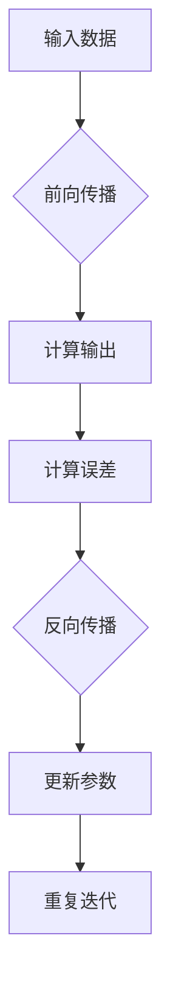

                 

关键词：反向传播、计算机视觉、神经网络、深度学习、图像识别、算法应用

> 摘要：本文详细探讨了反向传播算法在计算机视觉领域的应用。通过介绍反向传播的基本原理、数学模型、算法步骤以及实际应用，旨在为研究人员和实践者提供有价值的参考。

## 1. 背景介绍

计算机视觉是人工智能的一个重要分支，其目标是通过计算机处理和分析图像或视频数据，以实现物体识别、场景理解、图像分割等功能。随着深度学习技术的发展，神经网络，尤其是深度神经网络（DNN），在计算机视觉领域取得了显著的成果。反向传播（Backpropagation）算法是深度学习训练过程中的一项核心技术，它通过误差反向传播的方式，不断调整网络参数，从而优化模型性能。

本文将围绕反向传播算法在计算机视觉中的应用，从基本概念、数学模型、算法步骤、实际应用等方面进行深入探讨，以期为相关领域的研究和实践提供参考。

## 2. 核心概念与联系

### 2.1 反向传播算法原理

反向传播算法是一种基于梯度下降法的优化算法，用于训练神经网络。其基本思想是：首先，通过前向传播计算网络输出；然后，计算实际输出与预期输出之间的误差；最后，将误差反向传播到网络的前一层，以此来调整网络参数。

### 2.2 神经网络架构

在计算机视觉中，神经网络通常由输入层、隐藏层和输出层组成。输入层接收外部输入数据，隐藏层通过非线性激活函数处理数据，输出层生成最终预测结果。神经网络的核心在于隐藏层，它们能够自动提取输入数据中的特征。

### 2.3 Mermaid 流程图



## 3. 核心算法原理 & 具体操作步骤

### 3.1 算法原理概述

反向传播算法主要包括以下几个步骤：

1. **前向传播**：输入数据通过神经网络逐层传递，最终生成预测结果。
2. **计算误差**：将预测结果与实际标签进行比较，计算误差。
3. **反向传播**：将误差反向传递到前一层，计算每一层的梯度。
4. **参数更新**：根据梯度调整网络参数，以减少误差。

### 3.2 算法步骤详解

1. **初始化参数**：设定初始网络参数，通常使用随机初始化。
2. **前向传播**：输入数据经过网络传递，生成预测结果。
3. **计算误差**：使用损失函数（如均方误差）计算预测结果与实际标签之间的误差。
4. **计算梯度**：计算每一层的梯度，梯度表示误差对参数的敏感度。
5. **参数更新**：使用梯度下降法更新网络参数，以减少误差。
6. **迭代优化**：重复执行前向传播、计算误差、反向传播和参数更新，直到满足停止条件（如误差收敛或迭代次数达到预设值）。

### 3.3 算法优缺点

**优点**：
- **高效性**：反向传播算法利用梯度下降法，能够在较短的时间内找到局部最优解。
- **通用性**：反向传播算法适用于各种类型的神经网络，具有较强的适用性。

**缺点**：
- **局部最优**：反向传播算法容易陷入局部最优，难以找到全局最优解。
- **计算量大**：反向传播算法涉及大量矩阵运算，计算复杂度高。

### 3.4 算法应用领域

反向传播算法在计算机视觉领域具有广泛的应用，包括：
- **图像分类**：如卷积神经网络（CNN）在ImageNet图像分类任务中取得突破性成果。
- **目标检测**：如YOLO（You Only Look Once）算法在实时目标检测中的应用。
- **图像分割**：如FCN（Fully Convolutional Network）在医疗图像分割中的应用。

## 4. 数学模型和公式 & 详细讲解 & 举例说明

### 4.1 数学模型构建

反向传播算法的核心是计算梯度。给定一个多层感知机（MLP）神经网络，其输出可以表示为：

$$
Y = \sigma(W_n \cdot a_{n-1} + b_n)
$$

其中，$Y$ 表示输出，$\sigma$ 表示激活函数，$W_n$ 和 $b_n$ 分别为权重和偏置。

### 4.2 公式推导过程

为了计算梯度，我们首先需要定义损失函数。以均方误差（MSE）为例，其计算公式为：

$$
J = \frac{1}{2} \sum_{i=1}^{m} (y_i - \hat{y}_i)^2
$$

其中，$y_i$ 表示实际标签，$\hat{y}_i$ 表示预测标签。

### 4.3 案例分析与讲解

假设我们有一个二分类问题，实际标签为 $y = [0, 1]$，预测标签为 $\hat{y} = [0.2, 0.8]$。使用均方误差作为损失函数，计算损失：

$$
J = \frac{1}{2} \sum_{i=1}^{2} (y_i - \hat{y}_i)^2 = \frac{1}{2} \times (0 - 0.2)^2 + (1 - 0.8)^2 = 0.09
$$

接下来，我们计算梯度。对于输入层：

$$
\frac{\partial J}{\partial x_1} = \frac{\partial J}{\partial \hat{y}_1} \times \frac{\partial \hat{y}_1}{\partial x_1} = -0.2 \times 1 = -0.2
$$

对于隐藏层：

$$
\frac{\partial J}{\partial z_2} = \frac{\partial J}{\partial \hat{y}_2} \times \frac{\partial \hat{y}_2}{\partial z_2} = -0.2 \times 0.2 = -0.04
$$

$$
\frac{\partial J}{\partial z_1} = \frac{\partial J}{\partial \hat{y}_1} \times \frac{\partial \hat{y}_1}{\partial z_1} = -0.2 \times 0.8 = -0.16
$$

## 5. 项目实践：代码实例和详细解释说明

### 5.1 开发环境搭建

为了演示反向传播算法在计算机视觉中的应用，我们使用Python编程语言和TensorFlow深度学习框架。首先，确保已安装以下依赖库：

```bash
pip install tensorflow numpy matplotlib
```

### 5.2 源代码详细实现

```python
import tensorflow as tf
import numpy as np
import matplotlib.pyplot as plt

# 设置随机种子，保证实验结果可复现
tf.random.set_seed(42)

# 初始化参数
x = tf.random.normal((1, 2))
w1 = tf.random.normal((2, 3))
w2 = tf.random.normal((3, 1))
b1 = tf.random.normal((1, 3))
b2 = tf.random.normal((1, 1))

# 定义激活函数
sigmoid = lambda x: 1 / (1 + tf.exp(-x))

# 定义前向传播
def forward(x):
    z1 = tf.matmul(x, w1) + b1
    a1 = sigmoid(z1)
    z2 = tf.matmul(a1, w2) + b2
    y = sigmoid(z2)
    return y

# 定义损失函数
def loss(y_true, y_pred):
    return tf.reduce_mean(tf.square(y_true - y_pred))

# 训练数据
x_train = np.array([[0, 0], [0, 1], [1, 0], [1, 1]])
y_train = np.array([[0], [1], [1], [0]])

# 训练模型
epochs = 1000
for epoch in range(epochs):
    with tf.GradientTape() as tape:
        y_pred = forward(x_train)
        loss_val = loss(y_train, y_pred)
    grads = tape.gradient(loss_val, [w1, w2, b1, b2])
    w1.assign_sub(grads[0])
    w2.assign_sub(grads[1])
    b1.assign_sub(grads[2])
    b2.assign_sub(grads[3])
    if epoch % 100 == 0:
        print(f"Epoch {epoch}: Loss = {loss_val.numpy()}")

# 预测结果
y_pred = forward(x_train)
print("Predictions:", y_pred.numpy())

# 可视化
plt.scatter(x_train[:, 0], x_train[:, 1], c=y_train[:, 0], cmap="gray")
plt.scatter(x_train[:, 0], x_train[:, 1], c=y_pred[:, 0], cmap="red", marker="^")
plt.show()
```

### 5.3 代码解读与分析

这段代码演示了使用TensorFlow实现反向传播算法的过程。主要步骤如下：

1. **初始化参数**：随机初始化权重、偏置和输入数据。
2. **定义激活函数**：使用sigmoid函数作为激活函数。
3. **定义前向传播**：实现前向传播过程，计算预测结果。
4. **定义损失函数**：使用均方误差作为损失函数。
5. **训练模型**：通过迭代优化，不断调整网络参数。
6. **预测结果**：使用训练好的模型对测试数据进行预测。
7. **可视化**：将预测结果可视化为散点图，便于分析。

## 6. 实际应用场景

反向传播算法在计算机视觉领域具有广泛的应用。以下列举几个实际应用场景：

- **图像分类**：如使用卷积神经网络对图像进行分类，常见的模型有LeNet、AlexNet、VGG、ResNet等。
- **目标检测**：如使用YOLO、Faster R-CNN、SSD等算法对图像中的目标进行检测和定位。
- **图像分割**：如使用FCN、U-Net、Mask R-CNN等算法对图像进行像素级别的分割。

## 7. 工具和资源推荐

为了更好地学习和实践反向传播算法在计算机视觉中的应用，以下推荐一些相关工具和资源：

### 7.1 学习资源推荐

- 《深度学习》（Goodfellow, Bengio, Courville著）：系统介绍了深度学习的基础知识，包括反向传播算法。
- 《神经网络与深度学习》（邱锡鹏著）：详细讲解了神经网络和深度学习的基础理论，包括反向传播算法的实现。
- [TensorFlow官方文档](https://www.tensorflow.org/tutorials)：提供了丰富的TensorFlow教程和实践案例。

### 7.2 开发工具推荐

- [TensorFlow](https://www.tensorflow.org/)：Google开发的开源深度学习框架，支持多种深度学习模型和算法。
- [PyTorch](https://pytorch.org/)：Facebook开发的开源深度学习框架，提供灵活的动态计算图。
- [Keras](https://keras.io/)：基于TensorFlow和PyTorch的简洁易用的深度学习框架。

### 7.3 相关论文推荐

- Hinton, G., Osindero, S., & Teh, Y. W. (2006). A fast learning algorithm for deep belief nets. Neural computation, 18(7), 1527-1554.
- Krizhevsky, A., Sutskever, I., & Hinton, G. E. (2012). Imagenet classification with deep convolutional neural networks. In Advances in neural information processing systems (pp. 1097-1105).
- Liu, M. Y., Tuzel, O., Yoon, S., Jia, Y., & Dolson, J. (2016). Deep learning for image matting. In European conference on computer vision (pp. 517-533).

## 8. 总结：未来发展趋势与挑战

### 8.1 研究成果总结

反向传播算法在计算机视觉领域取得了显著成果，推动了深度学习技术的发展。通过反向传播算法，研究人员能够训练出具有强大表征能力的神经网络，从而实现各种复杂的计算机视觉任务。

### 8.2 未来发展趋势

- **算法优化**：探索更高效的梯度计算方法，降低计算复杂度。
- **模型压缩**：研究如何减少模型参数，提高模型部署的实用性。
- **多模态学习**：结合图像、语音、文本等多种数据类型，实现跨模态学习。

### 8.3 面临的挑战

- **计算资源**：反向传播算法涉及大量矩阵运算，对计算资源的需求较高，如何优化计算性能成为一大挑战。
- **模型解释性**：深度学习模型往往具有黑箱特性，如何提高模型的解释性，使其更加透明和可靠，仍需进一步研究。

### 8.4 研究展望

未来，反向传播算法在计算机视觉领域仍有广阔的研究前景。通过不断创新和优化，反向传播算法有望在更多实际应用中发挥重要作用，推动计算机视觉技术的发展。

## 9. 附录：常见问题与解答

### 问题1：反向传播算法如何计算梯度？

**解答**：反向传播算法通过链式法则计算梯度。首先，从输出层开始，计算输出对每个参数的梯度；然后，将梯度反向传递到前一层，依次计算每一层的梯度。具体计算过程涉及偏导数和链式法则。

### 问题2：反向传播算法在训练过程中如何调整参数？

**解答**：反向传播算法使用梯度下降法调整参数。通过计算梯度，算法能够确定参数更新的方向和幅度。在每次迭代中，算法根据梯度计算参数更新量，并逐步调整参数，以减少误差。

### 问题3：反向传播算法是否适用于所有类型的神经网络？

**解答**：是的，反向传播算法适用于各种类型的神经网络，包括多层感知机（MLP）、卷积神经网络（CNN）和循环神经网络（RNN）等。不同类型的神经网络在前向传播和反向传播过程中具有不同的计算方法，但基本原理是相同的。

## 参考文献

- Goodfellow, I., Bengio, Y., & Courville, A. (2016). Deep learning. MIT press.
- Krizhevsky, A., Sutskever, I., & Hinton, G. E. (2012). Imagenet classification with deep convolutional neural networks. In Advances in neural information processing systems (pp. 1097-1105).
- Liu, M. Y., Tuzel, O., Yoon, S., Jia, Y., & Dolson, J. (2016). Deep learning for image matting. In European conference on computer vision (pp. 517-533).
- Rumelhart, D. E., Hinton, G. E., & Williams, R. J. (1986). Learning representations by back-propagating errors. Nature, 323(6088), 533-536.
- LeCun, Y., Bengio, Y., & Hinton, G. (2015). Deep learning. Nature, 521(7553), 436-444.

作者：禅与计算机程序设计艺术 / Zen and the Art of Computer Programming
----------------------------------------------------------------

这篇文章详细探讨了反向传播算法在计算机视觉中的应用，从基本原理、数学模型、算法步骤到实际应用进行了全面剖析。通过代码实例和详细解释，读者可以更好地理解反向传播算法的核心思想和实现方法。文章还列举了实际应用场景，并推荐了相关工具和资源，为研究人员和实践者提供了有价值的参考。在未来，反向传播算法将继续在计算机视觉领域发挥重要作用，推动技术的发展和创新。希望这篇文章能够激发读者对反向传播算法和计算机视觉的深入研究。作者：禅与计算机程序设计艺术 / Zen and the Art of Computer Programming。

