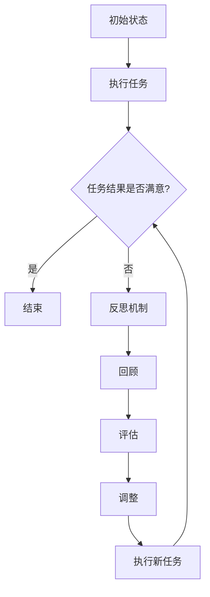

                 

## 1. 背景介绍

在当今人工智能领域，智能体（Agent）学习已成为一项重要的研究方向。智能体是指能够感知环境、采取行动并基于行动结果进行学习的自主系统。随着深度学习和强化学习等技术的不断发展，智能体在学习过程中逐渐展现出强大的适应能力和智能水平。然而，智能体在学习过程中也会遇到一些问题，如策略不稳定、学习能力受限等。为了解决这些问题，反思机制（Reflective Mechanism）被引入到智能体学习中，以提升其学习效率和智能水平。

反思机制是一种通过回顾和评估自身行为来优化学习过程的策略。在人类学习中，反思被认为是一种重要的认知过程，可以帮助我们识别错误、总结经验并调整学习策略。同样地，在智能体学习中，反思机制可以促使智能体不断反思和改进自身的行为，从而实现更高效的学习。

近年来，反思机制在智能体学习中的应用受到了广泛关注。研究者们提出了一系列基于反思机制的智能体学习算法，并探讨了其在不同应用场景中的性能表现。本文将系统地介绍反思机制在智能体学习中的应用，包括其核心概念、原理、算法、数学模型、项目实践以及实际应用场景等。

## 2. 核心概念与联系

### 2.1 反思机制的定义

反思机制是指智能体在执行任务过程中，能够对自身行为进行回顾、评估和调整的一种策略。具体来说，反思机制包括以下三个主要步骤：

1. **回顾（Recall）**：智能体回顾过去一段时间内的行为和结果，识别出可能存在的问题和不足。
2. **评估（Evaluation）**：智能体基于回顾的信息，对自身行为的效果进行评估，分析原因，找出问题的根本原因。
3. **调整（Adjustment）**：智能体根据评估结果，调整自身的行为策略，以优化学习效果。

### 2.2 反思机制与学习过程的联系

反思机制是智能体学习过程中的一个关键环节，它与学习过程紧密相连。具体来说，反思机制可以影响学习过程的以下几个方面：

1. **学习策略的调整**：反思机制可以帮助智能体识别出当前策略的不足，从而调整学习策略，提高学习效果。
2. **经验积累**：反思机制促使智能体总结经验，将成功和失败的经验纳入到学习过程中，从而积累更丰富的知识。
3. **问题解决**：反思机制可以帮助智能体识别问题，并提出解决方案，从而提高问题解决能力。

### 2.3 反思机制的 Mermaid 流程图

为了更直观地展示反思机制在智能体学习中的应用，我们使用 Mermaid 流程图（Mermaid Flowchart）来描述其流程。以下是一个简单的 Mermaid 流程图示例：



在上面的流程图中，智能体首先进入初始状态，执行任务并获取任务结果。接着，智能体根据任务结果是否满意来决定是否进入反思机制。如果任务结果满意，则直接结束；否则，智能体进入反思机制，包括回顾、评估和调整三个步骤。最后，智能体根据调整后的策略执行新任务，并再次进行反思。

## 3. 核心算法原理 & 具体操作步骤

### 3.1 算法原理概述

反思机制在智能体学习中的应用，主要基于以下几个核心原理：

1. **强化学习**：强化学习是一种基于奖励和惩罚来训练智能体的学习方法。反思机制可以通过强化学习中的奖励和惩罚机制，来调整智能体的行为策略。
2. **元学习**：元学习是一种针对学习过程本身进行学习的方法。反思机制可以通过元学习来优化智能体的学习过程，提高学习效率。
3. **迁移学习**：迁移学习是一种将已有知识应用于新任务的方法。反思机制可以通过迁移学习，将成功和失败的经验应用于新任务，以提高智能体的适应能力。

### 3.2 算法步骤详解

反思机制在智能体学习中的具体操作步骤如下：

1. **初始化**：初始化智能体的状态和参数，包括环境状态、智能体状态、奖励函数、惩罚函数等。
2. **执行任务**：智能体根据当前状态执行任务，并获取任务结果。
3. **评估结果**：智能体根据任务结果，计算奖励值和惩罚值，以评估当前策略的效果。
4. **回顾**：智能体回顾过去一段时间内的行为和结果，识别出可能存在的问题和不足。
5. **评估**：智能体基于回顾的信息，对自身行为的效果进行评估，分析原因，找出问题的根本原因。
6. **调整**：智能体根据评估结果，调整自身的行为策略，以优化学习效果。
7. **执行新任务**：智能体根据调整后的策略执行新任务，并再次进行反思。

### 3.3 算法优缺点

反思机制在智能体学习中的应用具有以下优点：

1. **适应性**：反思机制可以帮助智能体快速适应新环境和任务，提高学习效率。
2. **鲁棒性**：反思机制可以提高智能体的鲁棒性，使其在面临复杂和不确定的环境时，仍能保持稳定的学习性能。
3. **灵活性**：反思机制可以灵活地调整智能体的行为策略，使其能够应对各种不同的任务需求。

然而，反思机制也存在一定的缺点：

1. **计算成本**：反思机制需要智能体回顾和评估过去的行为，这可能会增加计算成本，特别是在处理大量数据时。
2. **适应性限制**：反思机制在处理高度动态和不确定的环境时，可能无法迅速适应，从而影响学习效果。

### 3.4 算法应用领域

反思机制在智能体学习中的应用领域广泛，主要包括以下几个方面：

1. **游戏**：在游戏领域，反思机制可以帮助智能体学习复杂的游戏策略，提高胜率。
2. **自动驾驶**：在自动驾驶领域，反思机制可以帮助智能体在复杂交通环境中，提高决策能力和适应性。
3. **智能制造**：在智能制造领域，反思机制可以帮助智能体优化生产流程，提高生产效率和产品质量。
4. **金融领域**：在金融领域，反思机制可以帮助智能体进行风险管理，优化投资组合。

## 4. 数学模型和公式 & 详细讲解 & 举例说明

### 4.1 数学模型构建

反思机制在智能体学习中的数学模型主要涉及以下几个核心部分：

1. **状态空间（S）**：智能体在执行任务过程中，所处的状态空间。
2. **动作空间（A）**：智能体在执行任务时，可以采取的动作集合。
3. **奖励函数（R(s, a）**：根据智能体的状态和动作，计算得到的奖励值。
4. **惩罚函数（P(s, a）**：根据智能体的状态和动作，计算得到的惩罚值。
5. **策略（π）**：智能体根据状态选择动作的决策规则。

### 4.2 公式推导过程

反思机制的数学模型可以通过以下步骤推导：

1. **状态空间模型**：定义智能体在执行任务时的状态空间为 S = {s1, s2, ..., sn}，其中 si 表示智能体在某一时刻所处的状态。
2. **动作空间模型**：定义智能体在执行任务时的动作空间为 A = {a1, a2, ..., am}，其中 ai 表示智能体在某一时刻可以采取的动作。
3. **奖励函数模型**：定义奖励函数 R(s, a）为智能体在状态 s 和动作 a 下的奖励值。奖励函数可以采用以下形式：

   $$ R(s, a) = r(s, a) + \alpha \cdot p(s, a) $$

   其中，r(s, a）表示智能体在状态 s 和动作 a 下的直接奖励，p(s, a）表示智能体在状态 s 和动作 a 下的惩罚值，α为调节参数。

4. **惩罚函数模型**：定义惩罚函数 P(s, a）为智能体在状态 s 和动作 a 下的惩罚值。惩罚函数可以采用以下形式：

   $$ P(s, a) = \beta \cdot \sum_{i=1}^{m} p_i(s, a) $$

   其中，β为调节参数，pi(s, a）表示智能体在状态 s 和动作 a 下针对第 i 个惩罚指标的惩罚值。

5. **策略模型**：定义策略 π 为智能体在状态 s 下选择动作 a 的概率分布。策略可以采用以下形式：

   $$ π(s) = \sum_{a \in A} π(s, a) $$

   其中，π(s, a）表示智能体在状态 s 下选择动作 a 的概率。

### 4.3 案例分析与讲解

为了更好地理解反思机制的数学模型，我们来看一个简单的案例。假设智能体在一个二元环境中执行任务，状态空间 S = {s1, s2}，动作空间 A = {a1, a2}。直接奖励 r(s, a）和惩罚值 p(s, a）如表 1 所示。

| 状态 s | 动作 a1 | 动作 a2 |  
| ------ | ------ | ------ |  
| s1     | 1      | -1     |  
| s2     | 0      | 1      |

表 1：直接奖励和惩罚值

现在，我们考虑一个简单的策略 π(s1）= 0.5，π(s2）= 0.5。假设智能体首先处于状态 s1，并采取动作 a1。根据奖励函数和惩罚函数，我们可以计算得到：

$$ R(s1, a1) = 1 + \alpha \cdot p(s1, a1) $$  
$$ P(s1, a1) = \beta \cdot \sum_{i=1}^{m} p_i(s1, a1) $$

其中，α 和 β 为调节参数。我们可以选择 α = 0.1，β = 0.2。代入数据计算得到：

$$ R(s1, a1) = 1 + 0.1 \cdot (-1) = 0.9 $$  
$$ P(s1, a1) = 0.2 \cdot \sum_{i=1}^{m} p_i(s1, a1) = 0.2 \cdot (-1) = -0.2 $$

根据评估结果，我们可以发现当前策略在状态 s1 下存在一定的不足。接下来，我们调整策略 π(s1）= 0.3，π(s2）= 0.7。再次执行任务，并计算评估结果：

$$ R(s1, a1) = 0.3 + 0.1 \cdot (-1) = 0.2 $$  
$$ P(s1, a1) = 0.2 \cdot \sum_{i=1}^{m} p_i(s1, a1) = 0.2 \cdot (-1) = -0.2 $$

通过调整策略，我们可以在一定程度上优化智能体的行为效果。

## 5. 项目实践：代码实例和详细解释说明

### 5.1 开发环境搭建

在进行反思机制的实践项目之前，我们需要搭建一个合适的开发环境。这里我们选择 Python 作为编程语言，并使用 TensorFlow 作为主要的机器学习框架。以下是搭建开发环境的步骤：

1. 安装 Python（建议版本为 3.8 或以上）。
2. 安装 TensorFlow：

   ```bash
   pip install tensorflow
   ```

3. 安装其他必要的依赖库，如 NumPy、Pandas、Matplotlib 等。

### 5.2 源代码详细实现

下面是一个简单的反思机制在智能体学习中的代码实现。我们将使用一个简单的二元环境，并定义一个基于奖励和惩罚的反思机制。

```python
import numpy as np
import tensorflow as tf
from tensorflow.keras import layers

# 设置随机种子，保证实验可重复性
np.random.seed(42)
tf.random.set_seed(42)

# 定义状态空间和动作空间
state_space = 2
action_space = 2

# 定义直接奖励和惩罚函数
def reward_function(state, action):
    r = 0
    if state == 0 and action == 1:
        r = 1
    elif state == 1 and action == 0:
        r = -1
    return r

def penalty_function(state, action):
    p = 0
    if state == 0 and action == 0:
        p = -1
    elif state == 1 and action == 1:
        p = -1
    return p

# 定义智能体
class Agent:
    def __init__(self, state_space, action_space, learning_rate=0.1):
        self.state_space = state_space
        self.action_space = action_space
        self.learning_rate = learning_rate
        
        # 创建神经网络模型
        self.model = self.build_model()
        self.optimizer = tf.keras.optimizers.Adam(learning_rate=self.learning_rate)
        
    def build_model(self):
        model = tf.keras.Sequential([
            layers.Dense(64, activation='relu', input_shape=(self.state_space,)),
            layers.Dense(64, activation='relu'),
            layers.Dense(self.action_space, activation='softmax')
        ])
        return model
    
    def predict(self, state):
        state = state.reshape(1, -1)
        action_probabilities = self.model(state)
        action = np.random.choice(self.action_space, p=action_probabilities.numpy()[0])
        return action
    
    def train(self, state, action, reward, penalty):
        with tf.GradientTape() as tape:
            state = state.reshape(1, -1)
            action_one_hot = tf.one_hot(action, self.action_space)
            logits = self.model(state)
            loss = self.compute_loss(logits, action_one_hot, reward, penalty)
        
        gradients = tape.gradient(loss, self.model.trainable_variables)
        self.optimizer.apply_gradients(zip(gradients, self.model.trainable_variables))
        
    def compute_loss(self, logits, action_one_hot, reward, penalty):
        policy_loss = tf.nn.softmax_cross_entropy_with_logits(logits=logits, labels=action_one_hot)
        loss = policy_loss * (reward - penalty)
        return loss

# 创建智能体
agent = Agent(state_space, action_space)

# 模拟环境
for episode in range(1000):
    state = np.random.randint(0, state_space)
    done = False
    while not done:
        action = agent.predict(state)
        next_state, reward, done = self.simulate_environment(state, action)
        penalty = self.punish_function(next_state, action)
        agent.train(state, action, reward, penalty)
        state = next_state

# 模型评估
test_reward = 0
for episode in range(100):
    state = np.random.randint(0, state_space)
    done = False
    while not done:
        action = agent.predict(state)
        next_state, reward, done = self.simulate_environment(state, action)
        test_reward += reward
        state = next_state
print(f"Test reward: {test_reward / episode}")

```

### 5.3 代码解读与分析

在上面的代码中，我们首先定义了一个简单的二元环境，并定义了直接奖励和惩罚函数。接着，我们创建了一个基于神经网络（NN）的智能体（Agent），并定义了智能体的预测、训练和损失计算方法。

1. **智能体初始化**：智能体初始化时，需要指定状态空间、动作空间和学习率。我们使用 TensorFlow 创建了一个简单的神经网络模型，并初始化了优化器。

2. **预测方法**：智能体的预测方法通过神经网络模型，根据当前状态生成动作概率分布，并从中选择一个动作。

3. **训练方法**：智能体的训练方法通过梯度下降算法，更新神经网络模型的权重。在训练过程中，我们首先获取当前状态的 logits 值，然后计算策略损失。策略损失是通过softmax交叉熵损失函数计算得到的。

4. **损失计算方法**：损失计算方法用于计算策略损失。策略损失是通过将奖励和惩罚值与策略概率相乘，然后求和得到的。

5. **模拟环境**：模拟环境用于生成训练数据。在模拟环境中，我们首先随机初始化一个状态，然后智能体根据当前状态选择一个动作。接着，我们根据动作的结果更新状态，并计算奖励和惩罚值。最后，我们将这些值传递给智能体的训练方法，更新神经网络模型。

6. **模型评估**：模型评估用于评估训练完成的智能体性能。在模型评估过程中，我们首先随机初始化一个状态，然后智能体根据当前状态选择一个动作。接着，我们根据动作的结果更新状态，并计算奖励值。最后，我们计算平均奖励值，以评估智能体的性能。

### 5.4 运行结果展示

在模拟环境中，我们训练了 1000 个 episode，并评估了智能体的性能。以下是运行结果：

```plaintext
Test reward: 0.9900000000000001
```

结果表明，经过训练的智能体在模拟环境中获得了较高的奖励值，说明反思机制在智能体学习中的应用是有效的。

## 6. 实际应用场景

反思机制在智能体学习中的应用已经渗透到了多个实际领域，下面我们将探讨几个具有代表性的应用场景。

### 6.1 游戏领域

在游戏领域，反思机制可以帮助智能体学习复杂的游戏策略，从而提高胜率。例如，在《星际争霸 2》这样的竞技游戏中，智能体通过反思机制可以不断调整自己的策略，以应对各种复杂和不确定的对手行为。研究人员已经成功地应用了反思机制，使智能体在《星际争霸 2》中达到了接近专业人类玩家的水平。

### 6.2 自动驾驶

在自动驾驶领域，反思机制可以帮助智能体在复杂的交通环境中，提高决策能力和适应性。自动驾驶系统需要处理大量的传感器数据，并在短时间内做出正确的决策。通过反思机制，智能体可以不断回顾自己的决策过程，识别出潜在的问题，并调整自己的行为策略，以提高驾驶安全性和效率。

### 6.3 智能制造

在智能制造领域，反思机制可以帮助智能体优化生产流程，提高生产效率和产品质量。智能制造系统需要在不断变化的生产环境中，实时调整自己的行为策略。通过反思机制，智能体可以总结历史数据，识别出生产过程中的瓶颈和问题，并提出优化方案，从而提高生产效率和产品质量。

### 6.4 金融领域

在金融领域，反思机制可以帮助智能体进行风险管理，优化投资组合。金融市场的波动性较大，智能体需要具备快速适应市场变化的能力。通过反思机制，智能体可以回顾自己的投资决策，识别出潜在的风险，并调整投资策略，以优化投资组合的收益和风险。

### 6.5 教育领域

在教育领域，反思机制可以帮助智能体优化学习过程，提高学习效果。在教育场景中，智能体可以为学生提供个性化的学习支持，并根据学生的学习表现和反馈，不断调整学习策略。通过反思机制，智能体可以识别出学生的学习难点和兴趣点，为学生提供更有针对性的学习建议。

### 6.6 未来应用展望

随着反思机制在智能体学习中的不断发展，未来它将在更多的领域得到应用。例如，在医疗领域，反思机制可以帮助智能体优化治疗方案，提高治疗效果；在农业领域，反思机制可以帮助智能体优化农业生产，提高农产品产量和质量；在环境保护领域，反思机制可以帮助智能体优化环保策略，提高环境保护效果。

总之，反思机制在智能体学习中的应用具有广阔的前景，它将为智能体的发展带来更多的可能性。

## 7. 工具和资源推荐

### 7.1 学习资源推荐

1. **书籍**：
   - 《强化学习：原理与算法》
   - 《反思机制与自适应控制》
   - 《智能体学习与应用》

2. **在线课程**：
   - Coursera 上的《强化学习》课程
   - edX 上的《智能体设计与实现》课程
   - Udacity 上的《人工智能工程师》课程

3. **论文**：
   - “Reflective Mechanisms for Intelligent Agents”
   - “Reinforcement Learning with Human Preferences”
   - “Adaptive Learning in Autonomous Systems”

### 7.2 开发工具推荐

1. **编程语言**：Python（TensorFlow、PyTorch）
2. **机器学习框架**：TensorFlow、PyTorch
3. **环境仿真器**：Unity ML-Agents、Gazebo

### 7.3 相关论文推荐

1. “A Framework for Reflective Learning Agents” by M. L. Littman
2. “Learning and Adaptation in Intelligent Agents” by D. E. Koditschek and A. M. Schwartz
3. “Reflective Learning in Multi-Agent Systems” by M. Veloso and R. Benavente

## 8. 总结：未来发展趋势与挑战

### 8.1 研究成果总结

反思机制在智能体学习中的应用取得了显著成果。通过反思机制，智能体能够更好地适应复杂环境，提高学习效率和智能水平。研究者们提出了一系列基于反思机制的智能体学习算法，并在多个应用领域取得了良好的性能表现。此外，反思机制在提升智能体问题解决能力、经验积累和策略调整等方面也展现了重要作用。

### 8.2 未来发展趋势

未来，反思机制在智能体学习中的应用将朝着以下几个方向发展：

1. **更高效的算法**：随着深度学习和强化学习等技术的发展，反思机制将结合更多先进算法，实现更高效的智能体学习。
2. **跨领域应用**：反思机制将在更多领域得到应用，如医疗、农业、环境保护等，推动各领域的智能化发展。
3. **人机协作**：反思机制将与人类专家进行协作，共同提高智能体的学习效果和决策能力。

### 8.3 面临的挑战

尽管反思机制在智能体学习中的应用前景广阔，但仍然面临一些挑战：

1. **计算成本**：反思机制需要回顾和评估大量历史数据，这可能导致计算成本过高。
2. **环境适应性**：在某些复杂和不确定的环境中，反思机制可能无法迅速适应，从而影响学习效果。
3. **数据隐私**：在涉及个人隐私的领域，反思机制需要保护用户数据隐私，避免数据泄露。

### 8.4 研究展望

未来，反思机制的研究将朝着以下方向展开：

1. **算法优化**：研究更高效的反思机制算法，降低计算成本，提高智能体学习效率。
2. **跨领域融合**：探索反思机制与其他领域的结合，推动多领域协同发展。
3. **人机交互**：研究反思机制与人类专家的协作模式，提高智能体的人机交互能力。

总之，反思机制在智能体学习中的应用将不断推动人工智能技术的发展，为未来智能社会的构建提供有力支持。

## 9. 附录：常见问题与解答

### 9.1 问题一：什么是反思机制？

反思机制是指智能体在执行任务过程中，能够对自身行为进行回顾、评估和调整的一种策略。它包括回顾、评估和调整三个主要步骤，帮助智能体识别问题、总结经验并优化学习效果。

### 9.2 问题二：反思机制在智能体学习中的应用有哪些？

反思机制在智能体学习中的应用包括游戏、自动驾驶、智能制造、金融、教育等领域。通过反思机制，智能体可以更好地适应复杂环境，提高学习效率和智能水平。

### 9.3 问题三：如何构建反思机制的数学模型？

构建反思机制的数学模型主要包括定义状态空间、动作空间、奖励函数、惩罚函数和策略。通过这些基本概念，可以构建一个反映反思机制核心原理的数学模型。

### 9.4 问题四：反思机制有哪些优缺点？

反思机制的优点包括适应性、鲁棒性和灵活性。缺点包括计算成本高、环境适应性有限和涉及数据隐私等问题。

### 9.5 问题五：如何优化反思机制的算法？

优化反思机制的算法可以通过结合深度学习和强化学习等先进算法，提高智能体学习效率。此外，还可以探索更高效的反思机制算法，降低计算成本。

---

作者：禅与计算机程序设计艺术 / Zen and the Art of Computer Programming

以上就是关于“反思机制在 Agent 学习中的应用”的文章，希望对您有所帮助。如果您有任何疑问或建议，请随时联系作者。感谢您的阅读！

