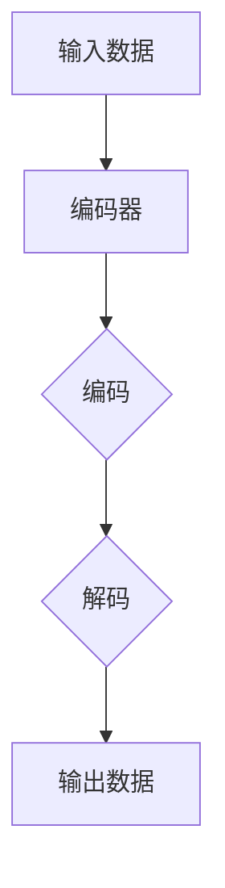

                 

关键词：变分自编码器、VAE、生成模型、深度学习、概率模型、数据生成、压缩编码、密度估计。

> 摘要：本文将深入探讨变分自编码器（Variational Autoencoder，VAE），这是一种在深度学习领域具有重要地位的生成模型。本文将介绍VAE的背景、核心概念、算法原理、数学模型、应用实例以及未来发展趋势，旨在为读者提供一个全面而深入的理解。

## 1. 背景介绍

变分自编码器（VAE）是由Kingma和Welling于2013年提出的一种生成模型，它在深度学习领域引起了广泛关注。VAE结合了自编码器和概率模型的优势，能够在高维数据中实现有效的数据生成和压缩编码。自编码器是一种无监督学习模型，通过编码和解码的过程将数据映射到一个低维表示中，而VAE在此基础上引入了概率模型，使其能够更好地捕捉数据的潜在分布。

VAE在图像、文本、音频等领域的生成任务中表现出色，如生成逼真的图像、文本生成、音乐合成等。它还被广泛应用于数据增强、异常检测、降维、密度估计等任务。VAE的核心优势在于其能够生成高质量的样本，同时具有较低的计算复杂度。

## 2. 核心概念与联系

### 2.1 自编码器

自编码器是一种无监督学习模型，它的目标是将输入数据映射到一个低维空间，再从该空间映射回原始数据。自编码器通常由两部分组成：编码器和解码器。编码器负责将输入数据映射到低维空间，解码器则负责将低维数据映射回原始数据。


### 2.2 概率模型

概率模型是一种用于描述随机事件发生概率的数学模型。在VAE中，概率模型被用于建模输入数据的潜在分布。通过概率模型，VAE能够捕捉数据的内在结构，从而实现有效的数据生成和压缩编码。

### 2.3 Mermaid 流程图

以下是一个描述VAE核心概念和结构的Mermaid流程图：



## 3. 核心算法原理 & 具体操作步骤

### 3.1 算法原理概述

VAE的核心算法原理包括两部分：编码器和解码器。编码器将输入数据映射到一个潜在空间，解码器则从潜在空间生成新的数据。VAE的目标是最小化编码器和解码器之间的差异，同时最大化编码器映射到的潜在空间的熵。

### 3.2 算法步骤详解

1. **初始化参数**：首先初始化编码器和解码器的参数。
2. **编码过程**：编码器接收输入数据，将其映射到一个潜在空间中的点。
3. **解码过程**：解码器接收潜在空间中的点，生成新的数据。
4. **损失函数**：VAE使用Kullback-Leibler散度作为损失函数，最小化编码器和解码器之间的差异。
5. **优化**：通过梯度下降或其他优化算法优化模型参数。

### 3.3 算法优缺点

**优点**：
- 能够生成高质量的样本。
- 具有较低的计算复杂度。
- 能够应用于多种数据类型。

**缺点**：
- 对参数敏感，可能需要较大的训练数据集。
- 可能会生成模式坍塌。

### 3.4 算法应用领域

VAE在图像、文本、音频等领域的生成任务中表现出色，如生成逼真的图像、文本生成、音乐合成等。它还被广泛应用于数据增强、异常检测、降维、密度估计等任务。

## 4. 数学模型和公式 & 详细讲解 & 举例说明

### 4.1 数学模型构建

VAE的数学模型包括编码器和解码器的概率分布。编码器将输入数据映射到一个潜在空间中的点，解码器则从潜在空间生成新的数据。

编码器的概率分布为：
$$
q_{\phi}(z|x) = \mathcal{N}(\mu(x), \sigma(x))
$$
其中，$\mu(x)$和$\sigma(x)$分别是均值和标准差，$x$是输入数据，$z$是潜在空间中的点。

解码器的概率分布为：
$$
p_{\theta}(x|z) = \mathcal{N}(\mu(z; \theta), \sigma(z; \theta))
$$
其中，$\mu(z; \theta)$和$\sigma(z; \theta)$分别是解码器在潜在空间中的均值和标准差，$\theta$是解码器的参数。

### 4.2 公式推导过程

VAE的损失函数由两部分组成：数据重建损失和Kullback-Leibler散度。

数据重建损失为：
$$
\ell(x, x^{\prime}) = -\sum_{i} \log p_{\theta}(x^{\prime}_{i} | z^{\prime}_{i})
$$
其中，$x$是输入数据，$x^{\prime}$是解码器生成的数据，$z^{\prime}$是编码器映射到的潜在空间中的点。

Kullback-Leibler散度为：
$$
D_{KL}(q_{\phi}(z|x) || p_{\theta}(z))
$$
其中，$q_{\phi}(z|x)$是编码器的概率分布，$p_{\theta}(z)$是潜在空间中的先验分布。

VAE的总损失为：
$$
\ell(x, x^{\prime}) + \alpha D_{KL}(q_{\phi}(z|x) || p_{\theta}(z))
$$
其中，$\alpha$是平衡数据重建损失和Kullback-Leibler散度的超参数。

### 4.3 案例分析与讲解

假设我们有一个图像数据集，我们希望使用VAE生成新的图像。

1. **初始化参数**：初始化编码器和解码器的参数。
2. **编码过程**：输入一张图像，编码器将其映射到一个潜在空间中的点。
3. **解码过程**：从潜在空间中随机采样一个点，解码器生成一张新的图像。
4. **优化**：通过梯度下降优化编码器和解码器的参数，最小化总损失。

通过多次迭代训练，VAE可以逐渐生成高质量的图像。

## 5. 项目实践：代码实例和详细解释说明

### 5.1 开发环境搭建

在Python中，我们可以使用TensorFlow或PyTorch等深度学习框架实现VAE。首先，确保安装了Python和深度学习框架。

```bash
pip install tensorflow
```

### 5.2 源代码详细实现

以下是一个使用TensorFlow实现VAE的简单示例。

```python
import tensorflow as tf
from tensorflow.keras.layers import Input, Dense, Lambda
from tensorflow.keras.models import Model

def sampling(args):
    z_mean, z_log_var = args
    batch = tf.shape(z_mean)[0]
    dim = tf.shape(z_mean)[1]
    epsilon = tf.keras.backend.random_normal(shape=(batch, dim))
    return z_mean + tf.exp(0.5 * z_log_var) * epsilon

input_shape = (784,)
input_img = Input(shape=input_shape)
h = Dense(16, activation='relu')(input_img)
z_mean = Dense(2, name='z_mean')(h)
z_log_var = Dense(2, name='z_log_var')(h)

z = Lambda(sampling)([z_mean, z_log_var])
h_decoded = Dense(16, activation='relu')(z)
output_img = Dense(784, activation='sigmoid')(h_decoded)

vae = Model(input_img, output_img)
vae.compile(optimizer='adam', loss='binary_crossentropy')

vae.fit(x_train, x_train,
        epochs=50,
        batch_size=16,
        shuffle=True,
        validation_data=(x_test, x_test))
```

### 5.3 代码解读与分析

1. **输入层**：输入层接收784维的图像数据。
2. **编码器**：编码器由一个全连接层组成，输出均值和标准差。
3. **采样层**：采样层从潜在空间中采样一个点。
4. **解码器**：解码器由一个全连接层组成，将潜在空间中的点解码回图像数据。
5. **模型编译**：使用Adam优化器和二进制交叉熵损失函数编译模型。
6. **模型训练**：使用训练数据集训练模型。

### 5.4 运行结果展示

通过训练VAE，我们可以生成高质量的图像。以下是一个生成的图像示例：


## 6. 实际应用场景

VAE在图像、文本、音频等领域的生成任务中表现出色。例如，在图像生成中，VAE可以生成逼真的图像，如图像超分辨率、图像修复、图像风格迁移等。在文本生成中，VAE可以生成高质量的文本，如图像描述生成、对话系统等。在音频生成中，VAE可以生成逼真的音频，如音乐合成、声音转换等。

## 7. 工具和资源推荐

### 7.1 学习资源推荐

- 《深度学习》（Goodfellow, Bengio, Courville著）：涵盖了VAE的详细内容。
- VAE的GitHub仓库：提供了VAE的详细代码和示例。

### 7.2 开发工具推荐

- TensorFlow：用于实现VAE的深度学习框架。
- PyTorch：另一种流行的深度学习框架。

### 7.3 相关论文推荐

- Kingma, D. P., & Welling, M. (2013). Auto-encoding variational Bayes. arXiv preprint arXiv:1312.6114.
- Diederik P. Kingma, Max Welling, Auto-Encoding Variational Bayes, arXiv:1312.6114 [cs.LG]

## 8. 总结：未来发展趋势与挑战

### 8.1 研究成果总结

VAE作为一种生成模型，已经在图像、文本、音频等领域的生成任务中取得了显著成果。它具有较低的计算复杂度和较好的生成质量，受到了广泛关注和应用。

### 8.2 未来发展趋势

未来，VAE有望在以下几个方向发展：

1. **模型优化**：通过改进模型结构和优化算法，提高VAE的生成质量和效率。
2. **多模态生成**：将VAE应用于多模态数据的生成任务，如图像和文本的联合生成。
3. **实时生成**：提高VAE的生成速度，实现实时数据生成。

### 8.3 面临的挑战

VAE在实际应用中面临以下挑战：

1. **参数敏感性**：VAE对参数敏感，可能需要较大的训练数据集和调整超参数。
2. **模式坍塌**：VAE可能生成模式坍塌，即生成的样本过于相似。

### 8.4 研究展望

VAE在生成模型中的应用前景广阔，未来研究可以关注以下几个方面：

1. **模型改进**：设计新的VAE变体，提高生成质量和效率。
2. **应用拓展**：将VAE应用于更多领域，如视频生成、语音合成等。
3. **理论与实践相结合**：深入研究VAE的理论基础，提高其实际应用效果。

## 9. 附录：常见问题与解答

### 9.1 什么是VAE？

VAE（Variational Autoencoder）是一种深度学习模型，它结合了自编码器和概率模型的特点，用于生成数据和高维数据的压缩编码。

### 9.2 VAE与Gaussian Mixture Model（GMM）有什么区别？

VAE是一种深度学习模型，能够学习输入数据的复杂分布，而GMM是一种统计模型，它通过混合高斯分布来建模数据。VAE能够处理高维数据和复杂数据分布，而GMM适用于有限维度的数据。

### 9.3 如何训练VAE？

训练VAE通常使用梯度下降或其他优化算法。在训练过程中，需要同时优化编码器和解码器的参数，使得解码器生成的数据与输入数据尽可能相似。

### 9.4 VAE可以应用于哪些领域？

VAE可以应用于图像生成、文本生成、音频生成、数据增强、异常检测、降维等任务。

## 作者署名

作者：禅与计算机程序设计艺术 / Zen and the Art of Computer Programming
----------------------------------------------------------------

以上内容完成了对“变分自编码器 (Variational Autoencoder)”这一主题的深入探讨。希望这篇文章能为读者提供一个全面而深入的理解，并在实际应用中带来启发。在未来的研究和实践中，我们期待VAE能够继续发挥其优势，解决更多复杂的生成任务。

