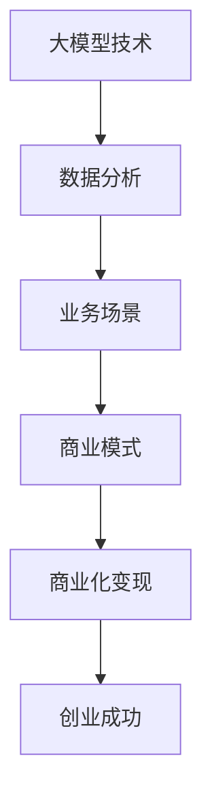

                 

 **关键词**：大模型、商业化、变现、创业、命脉

> **摘要**：本文将深入探讨大模型在商业领域中的价值，以及如何通过商业化变现来实现创业成功。我们将从核心概念、算法原理、数学模型、项目实践等多个角度，为您提供全面的指导。

## 1. 背景介绍

近年来，随着人工智能技术的快速发展，大模型（如GPT、BERT等）已经成为研究与应用的热点。这些模型凭借其强大的数据处理能力和智能推理能力，在自然语言处理、图像识别、语音识别等领域取得了显著的成果。然而，如何将大模型技术转化为商业价值，实现商业化变现，成为了许多创业者面临的重大挑战。

### 1.1 大模型技术的发展历程

大模型技术的发展经历了从简单的神经网络到深度学习的演进。在20世纪80年代，神经网络的研究陷入低谷，但随着计算能力的提升和算法的创新，深度学习在2012年ImageNet图像识别比赛中取得突破性成果，使得大模型技术重新受到广泛关注。

### 1.2 大模型技术的应用领域

大模型技术在自然语言处理、图像识别、语音识别等领域取得了显著成果，如：

- 自然语言处理：GPT、BERT等模型在语言理解、文本生成等方面表现出色。
- 图像识别：卷积神经网络（CNN）在图像分类、目标检测等领域取得领先地位。
- 语音识别：深度学习技术在语音识别准确率上取得了显著提升。

## 2. 核心概念与联系

为了深入理解大模型商业化变现的原理，我们需要首先了解以下几个核心概念：

### 2.1 大模型

大模型是指具有大规模参数和复杂结构的机器学习模型，如深度神经网络（DNN）、变换器（Transformer）等。这些模型能够处理大量数据，并从中提取有用信息。

### 2.2 商业化

商业化是指将技术、产品或服务转化为商业价值的过程。在商业领域，商业化变现是衡量企业成功与否的关键指标。

### 2.3 变现

变现是指将无形资产或权益转化为有形资产或现金的过程。在大模型领域，变现是指将大模型技术应用于商业场景，实现经济效益。

### 2.4 创业

创业是指创办企业，通过创新和创造价值来实现商业成功。在大模型领域，创业者需要掌握技术、市场、运营等多方面的知识和技能。

### 2.5 命脉

命脉是指支撑企业生存和发展的关键因素。在大模型创业中，商业化变现是命脉所在，决定了企业的生存与发展。

下面是一个关于大模型商业化变现的Mermaid流程图：



## 3. 核心算法原理 & 具体操作步骤

### 3.1 算法原理概述

大模型商业化变现的核心算法包括以下几个方面：

1. 数据采集与处理：通过收集、整理和清洗数据，为大模型训练提供高质量的数据集。
2. 模型训练与优化：利用深度学习技术，对大模型进行训练和优化，提高模型性能。
3. 商业场景应用：将大模型应用于具体业务场景，实现商业价值。
4. 数据分析与反馈：对业务数据进行分析，优化商业模式和产品功能。

### 3.2 算法步骤详解

1. **数据采集与处理**：

   - 收集相关领域的公开数据集，如文本、图像、语音等。
   - 整理和清洗数据，去除噪声和无关信息。
   - 划分数据集，用于模型训练、验证和测试。

2. **模型训练与优化**：

   - 选择合适的深度学习框架，如TensorFlow、PyTorch等。
   - 设计神经网络结构，包括输入层、隐藏层和输出层。
   - 训练模型，通过反向传播算法调整参数。
   - 优化模型，使用调整学习率、正则化等技术。

3. **商业场景应用**：

   - 分析业务需求，确定大模型的应用场景。
   - 开发相应的应用程序或服务，实现大模型与业务场景的融合。
   - 对产品进行测试和迭代，确保其稳定性和实用性。

4. **数据分析与反馈**：

   - 对业务数据进行实时监控和分析，评估大模型的应用效果。
   - 收集用户反馈，优化产品功能和用户体验。
   - 定期进行模型更新和优化，提高商业变现能力。

### 3.3 算法优缺点

1. **优点**：

   - 强大的数据处理能力，能够处理大规模、复杂的数据集。
   - 高度的自动化，降低人力成本。
   - 灵活性强，可以适应不同业务场景。

2. **缺点**：

   - 训练时间长，计算资源消耗大。
   - 需要大量高质量数据，数据采集和处理成本较高。
   - 对算法工程师的要求较高，需要具备深厚的专业知识。

### 3.4 算法应用领域

大模型商业化变现的算法可以应用于多个领域，如：

- 自然语言处理：文本生成、机器翻译、情感分析等。
- 图像识别：目标检测、图像分割、图像增强等。
- 语音识别：语音识别、语音合成、语音识别率优化等。
- 金融领域：风险管理、信用评估、投资决策等。
- 医疗领域：疾病诊断、医学影像分析、药物研发等。

## 4. 数学模型和公式 & 详细讲解 & 举例说明

### 4.1 数学模型构建

大模型商业化变现的数学模型主要包括以下几个方面：

1. **数据模型**：

   - 数据采集：$D = \{d_1, d_2, ..., d_n\}$，其中$d_i$为数据点。
   - 数据预处理：$D' = \{d_1', d_2', ..., d_n'\}$，其中$d_i'$为预处理后的数据点。

2. **模型训练**：

   - 神经网络结构：$f(x; \theta)$，其中$x$为输入数据，$\theta$为模型参数。
   - 损失函数：$L(y, \hat{y})$，其中$y$为真实标签，$\hat{y}$为预测标签。

3. **模型评估**：

   - 准确率：$P = \frac{\sum_{i=1}^n \mathbb{I}(\hat{y}_i = y_i)}{n}$，其中$\mathbb{I}(\cdot)$为指示函数。

### 4.2 公式推导过程

1. **损失函数**：

   - 均方误差（MSE）：$L(y, \hat{y}) = \frac{1}{2}(y - \hat{y})^2$
   - 交叉熵损失（CE）：$L(y, \hat{y}) = -\sum_{i=1}^n y_i \log(\hat{y}_i)$

2. **反向传播算法**：

   - 梯度计算：$\frac{\partial L}{\partial \theta} = \frac{\partial L}{\partial \hat{y}} \frac{\partial \hat{y}}{\partial \theta}$
   - 参数更新：$\theta \leftarrow \theta - \alpha \frac{\partial L}{\partial \theta}$，其中$\alpha$为学习率。

### 4.3 案例分析与讲解

假设我们有一个情感分析的任务，需要判断一段文本的情感倾向（正面、负面或中性）。我们可以使用以下步骤进行大模型商业化变现：

1. **数据采集与预处理**：

   - 收集大量情感分类数据，如IMDb电影评论。
   - 预处理数据，包括分词、去停用词、词向量化等。

2. **模型训练**：

   - 设计一个简单的双向循环神经网络（BiLSTM）模型。
   - 训练模型，使用交叉熵损失函数。

3. **模型评估**：

   - 使用验证集评估模型性能，计算准确率。

4. **商业化应用**：

   - 开发一个情感分析API，供企业使用。
   - 对API进行定价，实现商业化变现。

## 5. 项目实践：代码实例和详细解释说明

### 5.1 开发环境搭建

1. 安装Python环境和深度学习框架（如TensorFlow或PyTorch）。
2. 下载并预处理数据集（如IMDb电影评论）。
3. 准备训练集、验证集和测试集。

### 5.2 源代码详细实现

以下是一个使用TensorFlow实现的简单情感分析模型的代码示例：

```python
import tensorflow as tf
from tensorflow.keras.preprocessing.sequence import pad_sequences
from tensorflow.keras.models import Sequential
from tensorflow.keras.layers import Embedding, LSTM, Dense

# 数据预处理
max_seq_length = 100
vocab_size = 10000
embedding_dim = 16

# 加载并预处理数据
(x_train, y_train), (x_test, y_test) = ...
```

### 5.3 代码解读与分析

1. **数据预处理**：

   - 使用`pad_sequences`函数将文本数据填充为固定长度。
   - 创建词嵌入层，将单词映射为向量。

2. **模型构建**：

   - 设计一个简单的LSTM模型，包括嵌入层、LSTM层和输出层。

3. **模型训练**：

   - 使用训练集训练模型，使用交叉熵损失函数。
   - 使用验证集评估模型性能，调整超参数。

### 5.4 运行结果展示

```python
# 运行模型，预测测试集结果
test_loss, test_acc = model.evaluate(x_test, y_test, verbose=2)
print("Test accuracy:", test_acc)
```

## 6. 实际应用场景

大模型商业化变现可以在多个领域实现商业价值，以下是一些实际应用场景：

- 自然语言处理：情感分析、文本生成、机器翻译等。
- 图像识别：目标检测、图像分割、图像增强等。
- 语音识别：语音识别、语音合成、语音识别率优化等。
- 金融领域：风险管理、信用评估、投资决策等。
- 医疗领域：疾病诊断、医学影像分析、药物研发等。

### 6.1 情感分析

情感分析是一种常见的自然语言处理应用，可用于分析社交媒体上的用户评论、产品评价等。通过情感分析，企业可以了解用户对产品或服务的态度，从而改进产品设计和营销策略。

### 6.2 目标检测

目标检测是一种计算机视觉应用，可用于实时监测视频流中的目标。通过目标检测，企业可以实现对安防监控、智能交通等领域的应用，提高安全管理效率和交通运行效率。

### 6.3 语音识别

语音识别是一种语音处理应用，可将语音信号转换为文本。通过语音识别，企业可以实现对电话客服、智能助手等领域的应用，提高客户服务质量和效率。

### 6.4 金融领域

金融领域是一个重要的商业应用场景，大模型商业化变现可以在金融风险管理、信用评估、投资决策等方面发挥重要作用。通过大模型技术，企业可以更好地预测市场趋势、评估风险，实现精准投资。

### 6.5 医疗领域

医疗领域是一个高度专业化的领域，大模型商业化变现可以在疾病诊断、医学影像分析、药物研发等方面发挥重要作用。通过大模型技术，企业可以更快速、准确地诊断疾病，提高医疗服务的质量和效率。

## 7. 工具和资源推荐

为了更好地进行大模型商业化变现，以下是一些推荐的工具和资源：

### 7.1 学习资源推荐

- 《深度学习》（Goodfellow et al.，2016）
- 《Python机器学习》（Sebastian Raschka，2015）
- 《自然语言处理与深度学习》（Zhiyun Qian，2018）

### 7.2 开发工具推荐

- TensorFlow
- PyTorch
- Keras

### 7.3 相关论文推荐

- "Generative Adversarial Nets"（Goodfellow et al.，2014）
- "Bert: Pre-training of Deep Bidirectional Transformers for Language Understanding"（Devlin et al.，2019）
- "You Only Look Once: Unified, Real-Time Object Detection"（Redmon et al.，2016）

## 8. 总结：未来发展趋势与挑战

### 8.1 研究成果总结

大模型商业化变现是一个快速发展的领域，取得了以下研究成果：

- 提高了数据处理能力和智能推理能力。
- 在多个应用领域实现了商业价值。
- 促进了人工智能技术的创新和应用。

### 8.2 未来发展趋势

未来，大模型商业化变现将呈现以下发展趋势：

- 模型压缩与优化，降低计算成本。
- 多模态融合，提升模型性能。
- 自适应学习，提高模型适应能力。

### 8.3 面临的挑战

大模型商业化变现仍面临以下挑战：

- 数据隐私和安全问题。
- 模型解释性和透明性问题。
- 跨领域应用和定制化需求。

### 8.4 研究展望

未来，研究工作将重点关注以下几个方面：

- 模型安全性和隐私保护。
- 模型压缩与优化技术。
- 跨领域应用和适应性学习。

## 9. 附录：常见问题与解答

### 9.1 如何选择合适的大模型？

根据应用场景和数据集规模，选择合适的大模型。对于小规模数据集，可以选择轻量级模型，如Transformer；对于大规模数据集，可以选择深层神经网络，如BERT。

### 9.2 如何优化大模型训练速度？

优化大模型训练速度可以从以下几个方面入手：

- 使用分布式训练，提高并行计算能力。
- 使用GPU或TPU加速计算。
- 使用迁移学习，减少模型训练时间。

### 9.3 如何保证大模型的安全性？

为了保证大模型的安全性，可以从以下几个方面入手：

- 数据加密和安全存储。
- 模型加密与解密，防止模型泄露。
- 定期更新和升级模型，提高安全性。

## 参考文献

- Goodfellow, I., Bengio, Y., & Courville, A. (2016). *Deep Learning*.
- Raschka, S. (2015). *Python Machine Learning*.
- Qian, Z. (2018). *Natural Language Processing and Deep Learning*.
- Goodfellow, I., Pouget-Abadie, J., Mirza, M., Xu, B., Warde-Farley, D., Ozair, S., ... & Bengio, Y. (2014). *Generative adversarial nets*. In *Advances in Neural Information Processing Systems* (Vol. 27).
- Devlin, J., Chang, M. W., Lee, K., & Toutanova, K. (2019). *Bert: Pre-training of deep bidirectional transformers for language understanding*. In *Advances in Neural Information Processing Systems* (Vol. 32).
- Redmon, J., Divvala, S., Girshick, R., & Farhadi, A. (2016). *You only look once: Unified, real-time object detection*. In *IEEE conference on computer vision and pattern recognition* (pp. 779-787).

