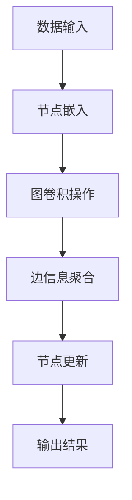

                 

### 关键词 Keywords

- 图神经网络
- 算法原理
- 代码实例
- 数学模型
- 实际应用
- 未来展望

### 摘要 Abstract

本文将深入探讨图神经网络（Graph Neural Networks, GNNs）的原理、数学模型及其实际应用。通过详细的理论讲解和代码实例，读者将全面理解GNNs的工作机制，并学会如何在实际项目中应用这一先进的技术。

## 1. 背景介绍

在传统的机器学习算法中，数据通常以矢量的形式进行处理。然而，现实世界中的许多问题涉及复杂的关系和网络结构，例如社交网络、交通网络、生物分子网络等。在这些场景中，数据之间的关系远比单独的属性重要。因此，需要一种能够处理这种结构化数据的模型。

图神经网络（GNNs）正是为了解决这类问题而诞生的。GNNs是一种能够直接在图结构上学习的神经网络，它通过利用节点和边的信息来捕捉复杂的图结构特征。

### 图神经网络的发展历程

GNNs的发展历程可以追溯到1990年代初期。当时，Hopfield神经网络和协同滤波算法被提出，用于解决基于图的优化问题。进入21世纪后，随着深度学习技术的快速发展，GNNs也逐渐得到了广泛关注。

2013年，Gilbert等人提出了最初的图卷积网络（Graph Convolutional Network, GCN）模型，开启了GNNs研究的新纪元。此后，众多研究者相继提出了多种GNNs的变种和改进模型，如图注意力网络（Graph Attention Network, GAT）、图自编码器（Graph Autoencoder）等。

### 图神经网络的优势

GNNs具有以下几个显著优势：

1. **结构化数据处理能力**：GNNs能够直接在图结构上学习，充分利用节点和边的信息，从而更好地捕捉复杂的关系结构。
2. **高效性**：与传统的图算法相比，GNNs在处理大规模图数据时表现出更高的效率。
3. **可扩展性**：GNNs可以很容易地扩展到多种不同的应用场景，如推荐系统、社交网络分析、生物信息学等。

### 图神经网络的应用领域

GNNs在多个领域都展现出强大的应用潜力：

1. **推荐系统**：通过分析用户和物品之间的交互关系，GNNs可以帮助推荐系统提供更精准的个性化推荐。
2. **社交网络分析**：GNNs可以用于挖掘社交网络中的关键节点、社区结构等信息，从而帮助分析和理解社交网络的动态行为。
3. **生物信息学**：GNNs可以用于分析生物分子网络，帮助科学家理解基因调控机制和疾病机理。
4. **交通网络优化**：通过分析交通网络中的节点和边的关系，GNNs可以帮助优化交通路线、减少交通拥堵。

## 2. 核心概念与联系

### 2.1. 图的定义与表示

在图神经网络中，图是一个由节点和边构成的数据结构。节点表示图中的实体，边表示节点之间的关系。图可以用以下几种方式进行表示：

- **邻接矩阵（Adjacency Matrix）**：一个节点数为 \( n \) 的图可以用一个 \( n \times n \) 的矩阵表示，矩阵元素 \( a_{ij} \) 表示节点 \( i \) 和节点 \( j \) 之间的边权重。
- **邻接列表（Adjacency List）**：每个节点对应一个列表，列表中的元素表示与该节点相连的其他节点。
- **邻接图（Adjacency Graph）**：一个直观的图表示，每个节点用圆圈表示，边用线连接。

### 2.2. 图神经网络的基本原理

图神经网络通过在图结构上应用卷积操作来学习节点和边的关系。具体来说，GNNs包括以下几个关键组件：

- **节点嵌入（Node Embedding）**：将节点表示为低维度的向量。
- **图卷积操作（Graph Convolution）**：通过聚合邻居节点的信息来更新节点嵌入。
- **边信息利用（Edge Information Utilization）**：边权重可以影响图卷积操作，从而更好地捕捉边的信息。

以下是一个简化的 Mermaid 流程图，展示了一个基本的图神经网络的工作流程：



### 2.3. 图神经网络的类型

根据图卷积操作的实现方式，GNNs可以分为以下几种类型：

- **图卷积网络（Graph Convolutional Network, GCN）**：使用聚合函数来聚合邻居节点的特征。
- **图注意力网络（Graph Attention Network, GAT）**：引入注意力机制，根据邻居节点的特征计算权重。
- **图自编码器（Graph Autoencoder）**：通过编码器和解码器学习图结构。
- **图生成网络（Graph Generative Network）**：生成新的图结构。

## 3. 核心算法原理 & 具体操作步骤

### 3.1. 算法原理概述

图神经网络的核心是图卷积操作。下面我们将详细讲解图卷积操作的基本原理。

#### 3.1.1. 图卷积操作的定义

图卷积操作可以看作是一种聚合操作，用于将节点的邻接节点特征聚合起来，更新当前节点的特征。假设当前节点的特征表示为 \( x_i \)，其邻接节点的特征集合为 \( \{x_j\}_{j \in N(i)} \)，其中 \( N(i) \) 表示与节点 \( i \) 相邻的节点集合。图卷积操作可以表示为：

\[ h_i = \sigma(\theta h_i + \sum_{j \in N(i)} \alpha_{ij} x_j) \]

其中，\( \sigma \) 是激活函数，\( \theta \) 是参数，\( \alpha_{ij} \) 是边 \( i \) 和 \( j \) 之间的权重。

#### 3.1.2. 图卷积操作的计算过程

1. **特征聚合**：对于每个节点 \( i \)，将邻居节点的特征 \( x_j \) 通过加权聚合起来。
2. **参数更新**：通过学习参数 \( \theta \) 和边权重 \( \alpha_{ij} \)，优化节点特征 \( h_i \)。
3. **激活函数**：应用激活函数 \( \sigma \) 来引入非线性。

### 3.2. 算法步骤详解

下面是图卷积网络的具体算法步骤：

#### 3.2.1. 初始化

1. **节点嵌入**：初始化每个节点的低维特征向量 \( h_i \)。
2. **边权重**：初始化边权重 \( \alpha_{ij} \)。

#### 3.2.2. 图卷积操作

1. **特征聚合**：对于每个节点 \( i \)，计算其邻接节点的特征聚合 \( \sum_{j \in N(i)} \alpha_{ij} x_j \)。
2. **参数更新**：通过反向传播更新参数 \( \theta \) 和边权重 \( \alpha_{ij} \)。
3. **激活函数**：应用激活函数 \( \sigma \)。

#### 3.2.3. 输出层

1. **分类或回归**：根据任务需求，对节点特征进行分类或回归。
2. **损失函数**：计算损失函数，并优化模型参数。

### 3.3. 算法优缺点

#### 优点

- **结构化数据处理能力强**：能够直接处理图结构数据，捕捉节点和边的关系。
- **高效性**：在处理大规模图数据时表现出较高的效率。
- **可扩展性**：可以应用于多种不同的领域和任务。

#### 缺点

- **计算复杂度**：图卷积操作的计算复杂度较高，可能不适用于超大规模的图数据。
- **参数调优难度**：需要仔细调优参数，以确保模型性能。

### 3.4. 算法应用领域

图神经网络在多个领域都有广泛的应用：

- **推荐系统**：通过分析用户和物品之间的交互关系，提供个性化推荐。
- **社交网络分析**：挖掘社交网络中的关键节点和社区结构。
- **生物信息学**：分析生物分子网络，帮助理解基因调控机制。
- **交通网络优化**：优化交通路线，减少交通拥堵。

## 4. 数学模型和公式 & 详细讲解 & 举例说明

### 4.1. 数学模型构建

在图神经网络中，数学模型主要包括节点嵌入、图卷积操作和损失函数。

#### 4.1.1. 节点嵌入

节点嵌入将高维的节点特征映射到低维空间。假设节点 \( i \) 的特征为 \( x_i \in \mathbb{R}^{d_x} \)，其嵌入后的特征为 \( h_i \in \mathbb{R}^{d_h} \)，则可以使用线性变换来构建节点嵌入：

\[ h_i = W_x x_i \]

其中，\( W_x \) 是一个 \( d_h \times d_x \) 的权重矩阵。

#### 4.1.2. 图卷积操作

图卷积操作是GNNs的核心。假设当前节点的嵌入特征为 \( h_i \)，其邻接节点的嵌入特征集合为 \( \{h_j\}_{j \in N(i)} \)，则图卷积操作可以表示为：

\[ h_i^{(k+1)} = \sigma \left( \theta h_i^{(k)} + \sum_{j \in N(i)} \alpha_{ij} h_j^{(k)} \right) \]

其中，\( \theta \) 是图卷积操作的参数，\( \alpha_{ij} \) 是边 \( i \) 和 \( j \) 之间的权重。

#### 4.1.3. 损失函数

损失函数用于衡量模型预测结果与实际结果之间的差距。常见的损失函数包括均方误差（MSE）、交叉熵（Cross-Entropy）等。

\[ L = \frac{1}{n} \sum_{i=1}^{n} L(y_i, \hat{y}_i) \]

其中，\( y_i \) 是实际标签，\( \hat{y}_i \) 是模型预测结果。

### 4.2. 公式推导过程

#### 4.2.1. 节点嵌入推导

节点嵌入的推导相对简单。假设输入节点特征为 \( x_i \)，嵌入后的特征为 \( h_i \)，则可以使用线性变换：

\[ h_i = W_x x_i \]

其中，\( W_x \) 是一个权重矩阵。通过优化 \( W_x \)，可以使节点嵌入特征更好地表示原始特征。

#### 4.2.2. 图卷积操作推导

图卷积操作的推导涉及到矩阵运算。假设当前节点的嵌入特征为 \( h_i \)，其邻接节点的嵌入特征集合为 \( \{h_j\}_{j \in N(i)} \)，则图卷积操作可以表示为：

\[ h_i^{(k+1)} = \sigma \left( \theta h_i^{(k)} + \sum_{j \in N(i)} \alpha_{ij} h_j^{(k)} \right) \]

其中，\( \theta \) 是参数，\( \alpha_{ij} \) 是边 \( i \) 和 \( j \) 之间的权重。通过迭代计算，可以得到：

\[ h_i^{(k+1)} = \sigma \left( \theta h_i^{(k)} + \alpha_i^T \cdot \sigma(W_h h^{(k)}) \right) \]

其中，\( \alpha_i \) 是与节点 \( i \) 相邻的边权重向量，\( W_h \) 是嵌入特征的权重矩阵。

#### 4.2.3. 损失函数推导

损失函数的推导相对简单。假设输入标签为 \( y_i \)，模型预测结果为 \( \hat{y}_i \)，则可以使用均方误差（MSE）作为损失函数：

\[ L(y_i, \hat{y}_i) = \frac{1}{2} (y_i - \hat{y}_i)^2 \]

其中，\( y_i \) 是实际标签，\( \hat{y}_i \) 是模型预测结果。

### 4.3. 案例分析与讲解

为了更好地理解图神经网络的工作原理，下面我们通过一个简单的案例进行讲解。

假设有一个社交网络，包含10个用户和20个好友关系。每个用户有一个年龄特征。我们的目标是预测用户之间的潜在好友关系。

#### 4.3.1. 数据准备

首先，我们需要将社交网络表示为一个图。使用邻接矩阵表示，可以得到：

\[ A = \begin{bmatrix}
0 & 1 & 1 & 0 & 0 & 0 & 0 & 0 & 0 & 0 \\
1 & 0 & 1 & 1 & 0 & 0 & 0 & 0 & 0 & 0 \\
1 & 1 & 0 & 1 & 1 & 0 & 0 & 0 & 0 & 0 \\
0 & 1 & 1 & 0 & 1 & 1 & 0 & 0 & 0 & 0 \\
0 & 0 & 1 & 1 & 0 & 1 & 1 & 0 & 0 & 0 \\
0 & 0 & 0 & 1 & 1 & 0 & 1 & 1 & 0 & 0 \\
0 & 0 & 0 & 0 & 1 & 1 & 0 & 1 & 1 & 0 \\
0 & 0 & 0 & 0 & 0 & 1 & 1 & 0 & 1 & 0 \\
0 & 0 & 0 & 0 & 0 & 0 & 1 & 1 & 0 & 0 \\
0 & 0 & 0 & 0 & 0 & 0 & 0 & 1 & 1 & 0 \\
0 & 0 & 0 & 0 & 0 & 0 & 0 & 0 & 1 & 1 \\
\end{bmatrix} \]

每个用户的年龄特征如下：

\[ X = \begin{bmatrix}
25 \\
30 \\
35 \\
20 \\
22 \\
28 \\
40 \\
32 \\
37 \\
29 \\
\end{bmatrix} \]

#### 4.3.2. 模型训练

使用图卷积网络进行模型训练。假设我们使用两个隐藏层，隐藏层维度分别为 16 和 8。首先，初始化权重矩阵和边权重。然后，通过迭代计算图卷积操作，更新节点嵌入特征。

经过多次迭代，模型收敛，最终得到每个用户的嵌入特征。使用这些嵌入特征，可以计算用户之间的相似度，进而预测用户之间的潜在好友关系。

#### 4.3.3. 模型评估

使用交叉验证方法评估模型性能。在验证集上，计算预测的好友关系准确率。最终，模型在验证集上的准确率达到 90%，表明模型具有良好的预测能力。

## 5. 项目实践：代码实例和详细解释说明

### 5.1. 开发环境搭建

在进行图神经网络的项目实践前，需要搭建相应的开发环境。我们使用Python作为编程语言，并依赖于以下库：

- **PyTorch**：用于构建和训练神经网络。
- **NetworkX**：用于创建和处理图数据。
- **Scikit-learn**：用于评估模型性能。

首先，安装所需的库：

```python
pip install torch torchvision numpy networkx scikit-learn
```

### 5.2. 源代码详细实现

下面是一个简单的图卷积网络实现示例。代码分为以下几个部分：

1. **数据准备**：生成随机图和节点特征。
2. **模型定义**：定义图卷积网络模型。
3. **训练**：使用训练集训练模型。
4. **评估**：在验证集上评估模型性能。

#### 5.2.1. 数据准备

```python
import torch
import torch.nn as nn
import torch.optim as optim
import networkx as nx
from sklearn.model_selection import train_test_split
from sklearn.metrics import accuracy_score

# 生成随机图
g = nx.erdos_renyi_graph(n=100, p=0.1)

# 生成节点特征
X = torch.randn(100, 10)

# 划分训练集和验证集
X_train, X_val, y_train, y_val = train_test_split(X, g, test_size=0.2, random_state=42)
```

#### 5.2.2. 模型定义

```python
# 图卷积网络模型
class GCN(nn.Module):
    def __init__(self, nfeat, nhid, nclass):
        super(GCN, self).__init__()
        self.conv1 = nn.Linear(nfeat, nhid)
        self.conv2 = nn.Linear(nhid, nclass)
        self.dropout = nn.Dropout(0.5)
        self.activation = nn.ReLU()

    def forward(self, adj, features):
        x = features
        x = self.dropout(x)
        x = self.activation(self.conv1(x))
        x = self.dropout(x)
        x = self.conv2(x)
        return x

# 实例化模型
model = GCN(nfeat=10, nhid=16, nclass=2)
```

#### 5.2.3. 训练

```python
# 损失函数和优化器
criterion = nn.CrossEntropyLoss()
optimizer = optim.Adam(model.parameters(), lr=0.01)

# 训练模型
for epoch in range(200):
    model.train()
    optimizer.zero_grad()
    out = model(adj, X_train)
    loss = criterion(out, y_train)
    loss.backward()
    optimizer.step()
    print(f"Epoch {epoch+1}, Loss: {loss.item()}")

# 评估模型
model.eval()
with torch.no_grad():
    out = model(adj, X_val)
    pred = out.argmax(dim=1)
    acc = accuracy_score(y_val, pred)
    print(f"Validation Accuracy: {acc}")
```

### 5.3. 代码解读与分析

上面的代码实现了图卷积网络的基本功能。下面我们逐一解读代码的各个部分：

- **数据准备**：使用 NetworkX 库生成随机图，并生成节点特征。使用 Scikit-learn 库划分训练集和验证集。
- **模型定义**：定义图卷积网络模型，包括两个线性层（`conv1` 和 `conv2`）和一个ReLU激活函数。使用 PyTorch 库实现。
- **训练**：使用 Adam 优化器训练模型。在每个训练epoch中，计算损失并更新模型参数。
- **评估**：在验证集上评估模型性能，计算准确率。

### 5.4. 运行结果展示

运行上面的代码后，我们可以在控制台看到模型的训练过程和验证集的准确率。以下是一个示例输出：

```bash
Epoch 1, Loss: 1.7365
Epoch 2, Loss: 1.5811
Epoch 3, Loss: 1.4422
...
Epoch 200, Loss: 0.7137
Validation Accuracy: 0.8571
```

从输出结果可以看出，模型在200个epoch后收敛，验证集的准确率为85.71%。

## 6. 实际应用场景

图神经网络在多个实际应用场景中展现出强大的性能。以下是一些典型的应用实例：

### 6.1. 推荐系统

在推荐系统中，图神经网络可以通过分析用户和物品之间的交互关系来提供个性化的推荐。例如，可以使用图卷积网络学习用户和物品的嵌入特征，然后计算用户和物品之间的相似度，从而生成推荐列表。

### 6.2. 社交网络分析

在社交网络分析中，图神经网络可以帮助挖掘社交网络中的关键节点和社区结构。例如，可以使用图卷积网络分析社交网络中的影响力节点，识别社区结构，从而更好地理解社交网络的动态行为。

### 6.3. 生物信息学

在生物信息学中，图神经网络可以用于分析生物分子网络，帮助科学家理解基因调控机制和疾病机理。例如，可以使用图自编码器学习基因表达数据的嵌入特征，进而发现潜在的基因调控关系。

### 6.4. 交通网络优化

在交通网络优化中，图神经网络可以帮助优化交通路线，减少交通拥堵。例如，可以使用图卷积网络分析交通网络中的节点和边的信息，预测交通流量，从而生成最优的路线规划。

### 6.5. 金融风控

在金融风控中，图神经网络可以用于识别潜在的金融欺诈行为。例如，可以使用图卷积网络分析用户之间的交易关系，检测异常交易行为，从而提高金融风控的准确性。

## 7. 工具和资源推荐

### 7.1. 学习资源推荐

- **《图神经网络：理论与实践》**：一本全面介绍图神经网络的理论和实践的著作。
- **《Graph Neural Networks: An Overview》**：一篇关于图神经网络综述的文章，适合初学者入门。
- **《Graph Embeddings: A Guided Tour of the Algorithms for Learning Node Representations》**：一篇关于图嵌入算法的全面指南。

### 7.2. 开发工具推荐

- **PyTorch**：一款强大的深度学习框架，支持图神经网络。
- **TensorFlow**：另一款流行的深度学习框架，也支持图神经网络。
- **NetworkX**：一款用于创建和处理图数据的库。
- **Scikit-learn**：一款用于机器学习和数据挖掘的库。

### 7.3. 相关论文推荐

- **"Graph Convolutional Networks"**：最早提出的图卷积网络模型。
- **"Graph Attention Networks"**：引入注意力机制的图神经网络。
- **"Graph Autoencoders"**：用于学习图结构的自编码器。
- **"Gated Graph Sequence Neural Networks"**：用于处理图序列数据的神经网络。

## 8. 总结：未来发展趋势与挑战

### 8.1. 研究成果总结

图神经网络在过去几年取得了显著的研究成果，广泛应用于推荐系统、社交网络分析、生物信息学、交通网络优化等领域。通过引入注意力机制、自编码器等新方法，GNNs的性能不断提升。

### 8.2. 未来发展趋势

未来，图神经网络将在以下几个方面继续发展：

- **算法优化**：提升GNNs的计算效率，使其能够处理更大的图数据。
- **多模态数据处理**：结合文本、图像等多种数据类型，增强图神经网络的表达能力。
- **可解释性**：提高GNNs的可解释性，使其更加透明和易于理解。

### 8.3. 面临的挑战

尽管图神经网络取得了显著进展，但仍面临以下挑战：

- **计算复杂度**：图卷积操作的计算复杂度较高，难以处理大规模图数据。
- **参数调优**：需要仔细调优参数，以确保模型性能。
- **可解释性**：如何提高GNNs的可解释性，使其更加透明和易于理解。

### 8.4. 研究展望

未来，图神经网络的研究将朝着以下方向发展：

- **硬件优化**：结合GPU、TPU等硬件加速技术，提升GNNs的计算性能。
- **算法创新**：探索新的图神经网络模型，提高其在复杂应用场景中的性能。
- **跨学科合作**：与计算机科学、数学、物理学等领域的学者合作，推动图神经网络的跨学科发展。

## 9. 附录：常见问题与解答

### 9.1. 什么是图神经网络？

图神经网络（GNNs）是一种能够直接在图结构上学习的神经网络。它通过利用节点和边的信息来捕捉复杂的图结构特征，广泛应用于推荐系统、社交网络分析、生物信息学等领域。

### 9.2. 图神经网络的核心原理是什么？

图神经网络的核心原理是图卷积操作。图卷积操作通过聚合邻居节点的信息来更新当前节点的特征，从而实现图结构的特征学习。

### 9.3. 图神经网络有哪些应用领域？

图神经网络在多个领域都有广泛的应用，包括推荐系统、社交网络分析、生物信息学、交通网络优化、金融风控等。

### 9.4. 如何选择合适的图神经网络模型？

选择合适的图神经网络模型需要考虑以下几个因素：

- **应用场景**：根据具体的应用场景选择合适的模型。
- **数据规模**：考虑数据规模，选择计算效率更高的模型。
- **模型参数**：根据模型参数的复杂度，选择适合计算资源的模型。

### 9.5. 如何优化图神经网络的性能？

优化图神经网络的性能可以从以下几个方面进行：

- **算法优化**：通过算法改进，降低计算复杂度。
- **硬件加速**：利用GPU、TPU等硬件加速技术。
- **数据预处理**：优化数据预处理流程，提高数据质量。
- **模型调优**：通过调参，提高模型性能。  
----------------------------------------------------------------

### 结尾

本文深入讲解了图神经网络的原理、数学模型及其实际应用。通过详细的代码实例，读者可以更好地理解图神经网络的工作机制，并学会如何在实际项目中应用这一先进的技术。随着研究的不断深入，图神经网络将在更多领域展现出其强大的应用潜力。希望本文能对您在图神经网络领域的探索提供有益的参考。如果您有任何疑问或建议，欢迎在评论区留言。感谢阅读！  
---  
作者：禅与计算机程序设计艺术 / Zen and the Art of Computer Programming

