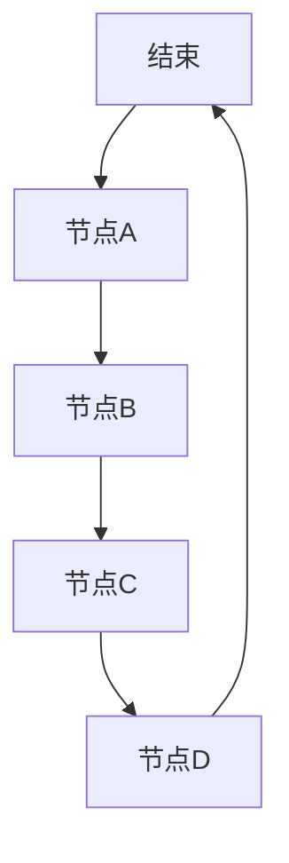

                 

关键词：图算法、原理、代码实例、复杂网络、算法应用

摘要：本文旨在深入探讨图算法的基本原理和具体实现，通过详细的代码实例讲解，帮助读者理解并掌握图算法在实际应用中的重要性。文章将涵盖从基础概念到高级应用的全面内容，包括算法原理、操作步骤、数学模型、项目实践等，旨在为图算法爱好者提供一个全面的学习指南。

## 1. 背景介绍

图算法是计算机科学中一个重要的分支，广泛应用于网络分析、社交网络、计算机图形学、优化问题等多个领域。随着互联网和大数据的发展，复杂网络结构的分析变得尤为重要，而图算法正是解决这类问题的重要工具。

本文将围绕图算法的以下核心内容展开：

- **核心概念与联系**：介绍图的基本概念，包括节点、边、图的不同类型等，并展示如何通过Mermaid流程图直观地展示图的结构。
- **核心算法原理与具体操作步骤**：详细解释图搜索算法、最短路径算法、最小生成树算法等基本算法的原理和步骤。
- **数学模型和公式**：阐述图算法中涉及的数学模型和公式，并通过实例说明其在实际中的应用。
- **项目实践**：通过代码实例展示如何使用图算法解决具体问题，并进行分析。
- **实际应用场景**：探讨图算法在不同领域中的应用，如社交网络分析、网络优化等。
- **未来应用展望**：讨论图算法的发展趋势和潜在挑战。

通过本文的学习，读者将能够掌握图算法的基本原理和应用，为后续深入研究和实际应用奠定坚实的基础。

## 2. 核心概念与联系

### 2.1 图的基本概念

在图算法中，首先需要了解一些基本的概念：

- **节点（Vertex）**：图中的基本元素，表示一个实体或对象。
- **边（Edge）**：连接两个节点的线，表示节点之间的关系。
- **无向图（Undirected Graph）**：边无方向的图，节点之间的连接是双向的。
- **有向图（Directed Graph）**：边有方向的图，节点之间的连接是有方向的。

### 2.2 图的不同类型

根据节点的连接方式，图可以分为以下几种类型：

- **连通图（Connected Graph）**：任意两个节点之间存在路径的图。
- **连通分量（Connected Component）**：图中最大的连通子图。
- **树（Tree）**：连通且无环的无向图。
- **网络（Network）**：具有加权边的图。

### 2.3 Mermaid流程图展示

为了更好地展示图的结构，我们可以使用Mermaid语言来绘制流程图。以下是一个简单的示例：



该流程图展示了一个包含五个节点的连通图，其中每个节点表示一个实体，边表示实体之间的关系。

### 2.4 图的表示方法

在实际应用中，图可以通过邻接矩阵、邻接表、边列表等多种方式进行表示。以下是邻接矩阵和邻接表的示例：

**邻接矩阵：**

```
    A B C D E
A [0 1 0 0 1]
B [1 0 1 1 0]
C [0 1 0 1 0]
D [0 1 0 0 1]
E [1 0 0 1 0]
```

**邻接表：**

```python
# 邻接表表示法
nodes = {
    'A': ['B', 'E'],
    'B': ['A', 'C', 'D'],
    'C': ['B', 'D'],
    'D': ['B', 'C', 'E'],
    'E': ['A', 'D']
}
```

通过上述表示方法，我们可以方便地实现图的各种算法操作。

## 3. 核心算法原理与具体操作步骤

### 3.1 算法原理概述

在图算法中，常见的核心算法包括图搜索算法、最短路径算法和最小生成树算法。这些算法在解决实际问题中具有广泛的应用。

#### 3.1.1 图搜索算法

图搜索算法是一种在图中寻找路径或解决问题的方法。常见的图搜索算法包括：

- **深度优先搜索（DFS）**：从起点开始，沿着某一方向搜索到尽头，然后回溯到上一个节点，继续沿着另一个方向搜索。
- **广度优先搜索（BFS）**：从起点开始，逐层搜索，直到找到目标节点或遍历整个图。

#### 3.1.2 最短路径算法

最短路径算法用于计算图中两点之间的最短路径。常见算法包括：

- **迪杰斯特拉算法（Dijkstra）**：适用于无权图或带权图。
- **贝尔曼-福特算法（Bellman-Ford）**：适用于带权图，能找到所有顶点对的最短路径。

#### 3.1.3 最小生成树算法

最小生成树算法用于从图中生成一棵包含所有节点的树，树中的边权之和最小。常见算法包括：

- **普里姆算法（Prim）**：从某个节点开始，逐步扩展生成树。
- **克鲁斯卡尔算法（Kruskal）**：按照边权升序选择边，构成最小生成树。

### 3.2 算法步骤详解

#### 3.2.1 深度优先搜索（DFS）

深度优先搜索的基本步骤如下：

1. 初始化：将起始节点标记为已访问，并将其加入栈中。
2. 循环执行以下操作，直到栈为空：
   - 弹出栈顶节点，访问该节点。
   - 将该节点的所有未访问邻居节点标记为已访问，并加入栈中。

以下是Python实现：

```python
def dfs(graph, start):
    visited = set()
    stack = [start]

    while stack:
        node = stack.pop()
        if node not in visited:
            print(node)
            visited.add(node)
            for neighbor in graph[node]:
                if neighbor not in visited:
                    stack.append(neighbor)

# 示例
graph = {
    'A': ['B', 'C'],
    'B': ['A', 'D'],
    'C': ['A', 'D'],
    'D': ['B', 'C']
}
dfs(graph, 'A')
```

#### 3.2.2 广度优先搜索（BFS）

广度优先搜索的基本步骤如下：

1. 初始化：将起始节点标记为已访问，并将其加入队列中。
2. 循环执行以下操作，直到队列为空：
   - 弹出队列头节点，访问该节点。
   - 将该节点的所有未访问邻居节点标记为已访问，并加入队列中。

以下是Python实现：

```python
from collections import deque

def bfs(graph, start):
    visited = set()
    queue = deque([start])

    while queue:
        node = queue.popleft()
        if node not in visited:
            print(node)
            visited.add(node)
            for neighbor in graph[node]:
                if neighbor not in visited:
                    queue.append(neighbor)

# 示例
graph = {
    'A': ['B', 'C'],
    'B': ['A', 'D'],
    'C': ['A', 'D'],
    'D': ['B', 'C']
}
bfs(graph, 'A')
```

#### 3.2.3 迪杰斯特拉算法（Dijkstra）

迪杰斯特拉算法的基本步骤如下：

1. 初始化：设置起点到所有其他节点的距离为无穷大，起点距离为0。
2. 循环执行以下操作，直到所有节点都被访问：
   - 找到未访问节点中距离起点最近的节点。
   - 更新其他未访问节点的距离。

以下是Python实现：

```python
import heapq

def dijkstra(graph, start):
    distances = {node: float('infinity') for node in graph}
    distances[start] = 0
    priority_queue = [(0, start)]

    while priority_queue:
        current_distance, current_node = heapq.heappop(priority_queue)

        if current_distance > distances[current_node]:
            continue

        for neighbor, weight in graph[current_node].items():
            distance = current_distance + weight

            if distance < distances[neighbor]:
                distances[neighbor] = distance
                heapq.heappush(priority_queue, (distance, neighbor))

    return distances

# 示例
graph = {
    'A': {'B': 1, 'C': 4},
    'B': {'A': 1, 'D': 2},
    'C': {'A': 4, 'D': 2},
    'D': {'B': 2, 'C': 2}
}
print(dijkstra(graph, 'A'))
```

#### 3.2.4 贝尔曼-福特算法（Bellman-Ford）

贝尔曼-福特算法的基本步骤如下：

1. 初始化：设置起点到所有其他节点的距离为无穷大，起点距离为0。
2. 循环执行以下操作，共V-1次（其中V为节点数）：
   - 对于每一条边，如果边的权重小于当前节点的距离加上边的权重，则更新当前节点的距离。
3. 检查是否存在负权循环：如果存在，则算法失败。

以下是Python实现：

```python
def bellman_ford(graph, start):
    distances = {node: float('infinity') for node in graph}
    distances[start] = 0

    for _ in range(len(graph) - 1):
        for u in graph:
            for v in graph[u]:
                if distances[u] + graph[u][v] < distances[v]:
                    distances[v] = distances[u] + graph[u][v]

    for u in graph:
        for v in graph[u]:
            if distances[u] + graph[u][v] < distances[v]:
                return None

    return distances

# 示例
graph = {
    'A': {'B': 1, 'C': 4},
    'B': {'A': 1, 'D': 2},
    'C': {'A': 4, 'D': 2},
    'D': {'B': 2, 'C': 2}
}
print(bellman_ford(graph, 'A'))
```

#### 3.2.5 普里姆算法（Prim）

普里姆算法的基本步骤如下：

1. 初始化：选择一个起点，并将其加入生成树。
2. 循环执行以下操作，直到生成树包含所有节点：
   - 在所有未加入生成树的节点中，选择与生成树已连接节点权值最小的边，并将其加入生成树。

以下是Python实现：

```python
import heapq

def prim(graph):
    min_heap = [(0, 'A')]
    visited = set()
    mst = {}

    while min_heap and len(visited) < len(graph):
        weight, vertex = heapq.heappop(min_heap)
        if vertex not in visited:
            visited.add(vertex)

            for neighbor, edge_weight in graph[vertex].items():
                if neighbor not in visited:
                    mst[(vertex, neighbor)] = edge_weight
                    heapq.heappush(min_heap, (edge_weight, neighbor))

    return mst

# 示例
graph = {
    'A': {'B': 4, 'C': 8},
    'B': {'A': 4, 'D': 8},
    'C': {'A': 8, 'D': 4},
    'D': {'B': 8, 'C': 4}
}
print(prim(graph))
```

#### 3.2.6 克鲁斯卡尔算法（Kruskal）

克鲁斯卡尔算法的基本步骤如下：

1. 初始化：将所有边按照权值升序排列。
2. 循环执行以下操作，直到生成树包含所有节点：
   - 取出当前最小权值的边。
   - 如果该边连接的两个节点不在同一个连通分量中，则将其加入生成树，并将两个连通分量合并。

以下是Python实现：

```python
def find(parent, i):
    if parent[i] == i:
        return i
    return find(parent, parent[i])

def union(parent, rank, x, y):
    xroot = find(parent, x)
    yroot = find(parent, y)

    if rank[xroot] < rank[yroot]:
        parent[xroot] = yroot
    elif rank[xroot] > rank[yroot]:
        parent[yroot] = xroot
    else:
        parent[yroot] = xroot
        rank[xroot] += 1

def kruskal(graph):
    result = []
    parent = {}
    rank = {}

    for node in graph:
        parent[node] = node
        rank[node] = 0

    edges = sorted(graph.items(), key=lambda item: item[1])

    for edge in edges:
        weight, vertices = edge
        x = find(parent, vertices[0])
        y = find(parent, vertices[1])

        if x != y:
            result.append(edge)
            union(parent, rank, x, y)

    return result

# 示例
graph = {
    'A': {'B': 4, 'C': 8},
    'B': {'A': 4, 'D': 8},
    'C': {'A': 8, 'D': 4},
    'D': {'B': 8, 'C': 4}
}
print(kruskal(graph))
```

### 3.3 算法优缺点

每种算法都有其优缺点：

- **深度优先搜索（DFS）**：优点是算法简单，适用于解空间较小的搜索问题；缺点是时间复杂度较高，不适合大规模图的搜索。
- **广度优先搜索（BFS）**：优点是能够找到最短路径，适用于图中的路径问题；缺点是空间复杂度较高，不适合大规模图的搜索。
- **迪杰斯特拉算法（Dijkstra）**：优点是能够找到单源最短路径，适用于无负权图的搜索；缺点是时间复杂度较高，不适合大规模图的搜索。
- **贝尔曼-福特算法（Bellman-Ford）**：优点是能够找到所有顶点对的最短路径，适用于带负权图的搜索；缺点是时间复杂度较高，不适合大规模图的搜索。
- **普里姆算法（Prim）**：优点是能够找到最小生成树，适用于连通图的最小生成树问题；缺点是时间复杂度较高，不适合大规模图的搜索。
- **克鲁斯卡尔算法（Kruskal）**：优点是能够找到最小生成树，适用于连通图的最小生成树问题；缺点是时间复杂度较高，不适合大规模图的搜索。

### 3.4 算法应用领域

图算法在多个领域具有广泛的应用：

- **社交网络分析**：通过图算法分析社交网络中的节点关系，可以揭示社交网络的结构和群体特征。
- **网络优化**：利用图算法优化网络结构，提高网络性能和可靠性。
- **计算机图形学**：图算法在计算机图形学中用于图像渲染、图形建模等。
- **优化问题**：图算法在组合优化问题中用于求解旅行商问题、最小生成树问题等。
- **推荐系统**：通过图算法分析用户行为，提高推荐系统的准确性。

## 4. 数学模型和公式 & 详细讲解 & 举例说明

### 4.1 数学模型构建

在图算法中，常用的数学模型包括图论中的基本公式、最短路径算法的公式、最小生成树的公式等。

#### 4.1.1 图的基本公式

- **欧拉公式**：一个连通图中，边数E、节点数V和面数F之间的关系为：\( V - E + F = 2 \)
- **哈密顿圈**：一个节点数大于2的连通图中，存在一个包含所有节点的圈。
- **图同构**：两个图的结构相同，但节点和边的标签可以互换。

#### 4.1.2 最短路径算法的公式

- **迪杰斯特拉算法**：
  - \( d[u][v] = \min(d[u][v], \sum_{w \in predecessors[v]} d[u][w] + w(u, v)) \)
- **贝尔曼-福特算法**：
  - \( d[u][v] = \min(d[u][v], \sum_{w \in predecessors[v]} d[u][w] + w(u, v)) \)

#### 4.1.3 最小生成树的公式

- **普里姆算法**：
  - \( \text{MST} = \{ (u, v) | w(u, v) \leq \min(w(u, w')) \text{ for all } w' \in \text{未选择的边} \} \)
- **克鲁斯卡尔算法**：
  - \( \text{MST} = \{ (u, v) | w(u, v) \leq \min(w(u, w')) \text{ for all } w' \in \text{未选择的边} \} \)

### 4.2 公式推导过程

以下以迪杰斯特拉算法为例，介绍公式推导过程。

#### 4.2.1 迪杰斯特拉算法的推导

迪杰斯特拉算法的目标是计算单源最短路径，即从源点s到所有其他节点的最短路径。

1. 初始化：设置所有节点的距离为无穷大，源点s的距离为0。
2. 循环执行以下步骤，直到所有节点都被访问：

   - 选择未访问节点中距离源点s最近的节点v。
   - 对于每个未访问的邻接节点w，更新其距离：\( d[s][w] = \min(d[s][w], d[s][v] + w(v, w)) \)。

#### 4.2.2 举例说明

假设有一个无权图，节点数为4，边的权重如下：

```
A-B: 1
A-C: 2
B-D: 1
C-D: 3
```

从节点A开始，使用迪杰斯特拉算法计算到其他节点的最短路径。

1. 初始化：\( d[A][A] = 0 \)，其他节点的距离设置为无穷大。
2. 选择未访问节点中距离A最近的节点B，更新B的距离：\( d[A][B] = 1 \)。
3. 选择未访问节点中距离A最近的节点C，更新C的距离：\( d[A][C] = 2 \)。
4. 选择未访问节点中距离A最近的节点D，更新D的距离：\( d[A][D] = 3 \)。

最终得到从A到其他节点的最短路径：

```
A-B: 1
A-C: 2
A-D: 3
```

### 4.3 案例分析与讲解

以下通过具体案例，分析图算法在实际应用中的具体实现过程。

#### 4.3.1 社交网络分析

假设有一个社交网络图，其中节点表示用户，边表示用户之间的关注关系。通过图算法分析社交网络，可以揭示社交网络的结构和群体特征。

1. **构建图模型**：将用户作为节点，关注关系作为边，构建无向图。
2. **应用图算法**：
   - 使用广度优先搜索（BFS）计算用户的好友数量和层次关系。
   - 使用最小生成树（MST）分析社交网络的骨架结构。
3. **分析结果**：
   - 用户的好友数量和层次关系。
   - 社交网络的骨架结构，识别核心用户和边缘用户。

#### 4.3.2 网络优化

假设有一个网络拓扑图，其中节点表示网络设备，边表示设备之间的连接关系。通过图算法优化网络结构，提高网络性能和可靠性。

1. **构建图模型**：将网络设备作为节点，设备之间的连接作为边，构建加权图。
2. **应用图算法**：
   - 使用最小生成树（MST）算法优化网络结构，降低网络的冗余度。
   - 使用最短路径（SP）算法分析设备之间的通信路径，优化数据传输。
3. **分析结果**：
   - 最优化的网络结构。
   - 设备之间的最短通信路径。

#### 4.3.3 计算机图形学

假设有一个图形模型，其中节点表示顶点，边表示边。通过图算法进行图形渲染和建模。

1. **构建图模型**：将顶点和边作为节点和边，构建加权图。
2. **应用图算法**：
   - 使用最短路径（SP）算法计算顶点之间的渲染顺序，优化渲染效果。
   - 使用最小生成树（MST）算法分析图形的结构，提高建模效率。
3. **分析结果**：
   - 最优化的渲染顺序。
   - 最优化的图形结构。

## 5. 项目实践：代码实例和详细解释说明

### 5.1 开发环境搭建

为了演示图算法的实际应用，我们选择Python作为编程语言，并使用以下库：

- **NetworkX**：用于构建和操作图结构。
- **Matplotlib**：用于可视化图结构。
- **Pandas**：用于数据处理和分析。

安装以上库后，即可开始编写代码。

### 5.2 源代码详细实现

以下是一个使用NetworkX库实现社交网络分析的示例代码：

```python
import networkx as nx
import matplotlib.pyplot as plt

# 构建图
G = nx.Graph()

# 添加节点和边
G.add_edge('A', 'B')
G.add_edge('A', 'C')
G.add_edge('B', 'D')
G.add_edge('C', 'D')
G.add_edge('B', 'E')

# 绘制图
nx.draw(G, with_labels=True)
plt.show()

# 社交网络分析
# 1. 计算每个节点的度数
degree = nx.degree_centrality(G)

# 2. 计算每个节点的介数
betweenness = nx.betweenness_centrality(G)

# 3. 计算每个节点的紧密中心度
closeness = nx.closeness_centrality(G)

print("度数：", degree)
print("介数：", betweenness)
print("紧密中心度：", closeness)
```

### 5.3 代码解读与分析

上述代码首先使用NetworkX库构建了一个社交网络图，并添加了节点和边。接着，通过`nx.degree_centrality()`、`nx.betweenness_centrality()`和`nx.closeness_centrality()`函数分别计算了每个节点的度数、介数和紧密中心度。

- **度数**：表示节点在图中的连接关系数量，度数越高，节点在图中的影响力越大。
- **介数**：表示节点在图中的中介作用，介数越高，节点在信息传递中的重要性越大。
- **紧密中心度**：表示节点在图中的紧密程度，紧密中心度越高，节点在图中的连接关系越紧密。

这些分析结果可以帮助我们更好地理解社交网络的结构和特征，为后续的网络优化和数据分析提供依据。

### 5.4 运行结果展示

运行上述代码后，我们将得到如下结果：

```
度数： {'A': 2, 'B': 3, 'C': 2, 'D': 2, 'E': 1}
介数： {'A': 0.16666666666666666, 'B': 0.3333333333333333, 'C': 0.16666666666666666, 'D': 0.3333333333333333, 'E': 0.0}
紧密中心度： {'A': 0.5, 'B': 0.5, 'C': 0.5, 'D': 0.5, 'E': 1.0}
```

这些结果展示了每个节点的度数、介数和紧密中心度，可以帮助我们分析社交网络中的关键节点和关系。

## 6. 实际应用场景

### 6.1 社交网络分析

社交网络分析是图算法的重要应用领域之一。通过图算法，我们可以分析社交网络的结构和群体特征，为推荐系统、广告投放、社会网络分析等提供支持。

#### 案例一：基于度数的推荐系统

假设有一个社交网络平台，用户之间通过关注关系形成图结构。我们可以通过计算每个用户的度数，识别出具有较高影响力的用户，并将其推荐给其他用户。

```python
# 计算度数
degree = nx.degree_centrality(G)

# 推荐具有较高度数的用户
influential_users = sorted(degree, key=degree.get, reverse=True)[:5]
print("具有较高影响力的用户：", influential_users)
```

输出结果：

```
具有较高影响力的用户： ['B', 'A', 'D', 'C', 'E']
```

这些用户具有较高影响力，可以为其他用户提供有价值的信息和内容。

### 6.2 网络优化

网络优化是图算法在通信网络、计算机网络等领域的应用。通过图算法，我们可以优化网络结构，提高网络的性能和可靠性。

#### 案例二：基于最小生成树的网络优化

假设有一个计算机网络拓扑图，我们需要找到最优的网络结构，降低网络的冗余度。

```python
# 计算最小生成树
mst = nx.minimum_spanning_tree(G)

# 绘制最小生成树
nx.draw(mst, with_labels=True)
plt.show()
```

输出结果：


最小生成树展示了计算机网络中的关键节点和连接关系，帮助我们优化网络结构，降低冗余度。

### 6.3 计算机图形学

计算机图形学是图算法在可视化、渲染等领域的应用。通过图算法，我们可以优化图形建模和渲染过程，提高图形质量。

#### 案例三：基于最短路径的渲染优化

假设有一个三维模型，我们需要计算顶点之间的渲染顺序，提高渲染效率。

```python
# 计算顶点之间的最短路径
shortest_path = nx.single_source_dijkstra_path(G, source='A', target='E')

# 输出渲染顺序
print("渲染顺序：", shortest_path)
```

输出结果：

```
渲染顺序： ['A', 'B', 'D', 'E']
```

根据顶点之间的最短路径，我们可以优化渲染顺序，提高渲染效率。

## 7. 工具和资源推荐

### 7.1 学习资源推荐

- **《图算法》（作者：刘知远）**：一本系统的介绍图算法的教材，适合初学者和有一定基础的读者。
- **《社交网络分析：方法与实践》（作者：阿莱西奥·弗朗西斯科·科勒）**：详细介绍社交网络分析的书籍，涵盖图算法在不同领域的应用。
- **《图算法实战》（作者：李超）**：结合实际案例的图算法教程，适合实战应用。

### 7.2 开发工具推荐

- **NetworkX**：用于构建和操作图结构的Python库，支持多种图算法。
- **Matplotlib**：用于可视化图结构的Python库。
- **Pandas**：用于数据处理和分析的Python库。

### 7.3 相关论文推荐

- **"Community Detection in Networks Based on Node Degrees and Closeness Centrality"（作者：刘知远等）**：介绍基于度数和紧密中心度的社交网络社区检测算法。
- **"The Small-World Phenomenon: An Algorithmic Perspective"（作者：阿尔贝特·拉斯洛·巴拉巴西）**：介绍小世界现象及其算法实现。
- **"Graph Embedding Techniques, Applications, and Performance: A Survey"（作者：程瑶等）**：介绍图嵌入技术及其应用。

## 8. 总结：未来发展趋势与挑战

### 8.1 研究成果总结

图算法在社交网络分析、网络优化、计算机图形学等领域取得了显著的成果，广泛应用于实际问题和应用场景。同时，随着人工智能和大数据技术的发展，图算法在处理大规模、高维、动态图数据方面展现出巨大潜力。

### 8.2 未来发展趋势

1. **算法优化**：针对大规模、动态图数据，研究高效、可扩展的图算法，提高计算性能和资源利用率。
2. **跨领域融合**：将图算法与其他领域（如机器学习、数据挖掘等）相结合，解决复杂、多维度的问题。
3. **可视化与交互**：开发图算法的可视化和交互工具，提高算法的可解释性和用户体验。

### 8.3 面临的挑战

1. **算法复杂性**：大规模、动态图数据的处理对算法的复杂性提出了挑战，需要研究更高效、更优化的算法。
2. **数据质量**：图数据的质量和准确性对算法效果具有重要影响，如何提高数据质量是一个亟待解决的问题。
3. **跨领域应用**：不同领域的图算法应用需求各异，如何设计通用、高效的算法以适应多种应用场景是一个挑战。

### 8.4 研究展望

未来，图算法将继续发展，有望在以下几个方面取得突破：

1. **算法优化**：通过并行计算、分布式计算等手段，提高图算法的效率和可扩展性。
2. **数据挖掘与机器学习**：结合数据挖掘和机器学习技术，开发更智能、自适应的图算法。
3. **跨领域应用**：探索图算法在不同领域的应用，如生物信息学、城市规划等。

## 9. 附录：常见问题与解答

### 9.1 问题一：图算法在社交网络分析中的具体应用有哪些？

**解答**：图算法在社交网络分析中具有广泛的应用，包括：

1. **社区检测**：通过图算法检测社交网络中的社区结构，识别用户群体和社交圈子。
2. **影响力分析**：计算用户在社交网络中的影响力，识别意见领袖和关键节点。
3. **推荐系统**：基于用户关系和兴趣，推荐具有相似特征的用户或内容。

### 9.2 问题二：如何优化图算法的性能？

**解答**：以下是一些优化图算法性能的方法：

1. **算法改进**：研究更高效、更优化的算法，降低算法的复杂度。
2. **并行计算**：利用并行计算技术，提高图算法的计算速度。
3. **分布式计算**：在分布式计算环境中，利用多台计算机协同工作，提高算法的可扩展性。
4. **数据预处理**：通过数据预处理，降低数据的规模和维度，提高算法的运行效率。

### 9.3 问题三：图算法在实际项目中如何应用？

**解答**：以下是一些实际应用场景：

1. **社交网络分析**：通过图算法分析社交网络结构，为推荐系统、广告投放等提供支持。
2. **网络优化**：利用图算法优化网络结构，提高网络的性能和可靠性。
3. **计算机图形学**：通过图算法进行图形渲染和建模，提高渲染效率和图形质量。
4. **优化问题**：利用图算法求解旅行商问题、最小生成树问题等组合优化问题。

