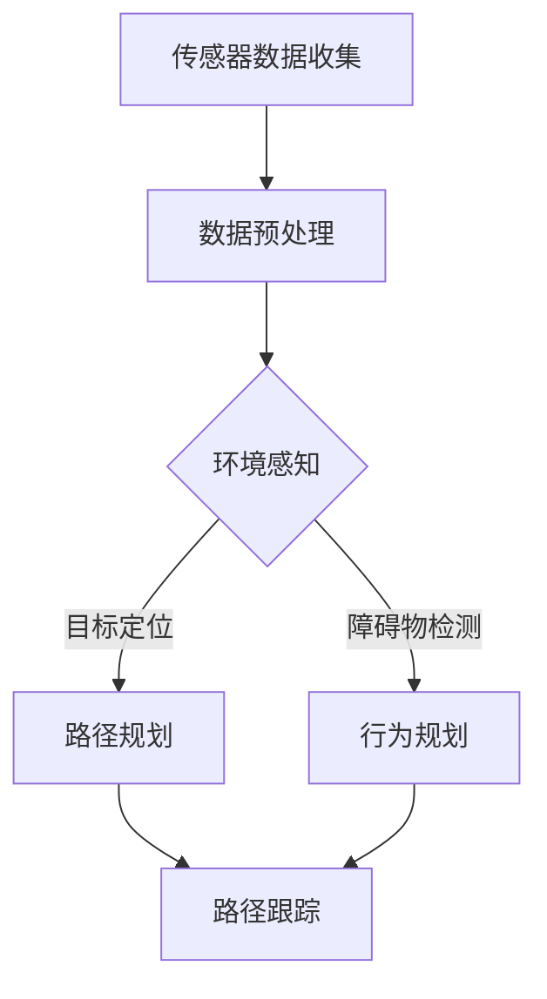

                 

自动驾驶作为智能交通系统的核心组成部分，正逐渐改变我们的出行方式。随着技术的不断进步，自动驾驶决策规划算法的研究愈发受到关注。本文将围绕地平线2025社招自动驾驶决策规划算法工程师题，深入探讨自动驾驶决策规划算法的核心概念、原理、应用及其未来发展趋势。

## 关键词

- 自动驾驶
- 决策规划算法
- 智能交通系统
- 地平线2025
- 算法工程师

## 摘要

本文旨在分析地平线2025社招自动驾驶决策规划算法工程师职位所需的核心技能与知识。通过对自动驾驶决策规划算法的基本概念、数学模型、核心算法原理及其应用领域的介绍，本文旨在为读者提供一个全面的了解，并探讨该领域未来可能面临的研究趋势与挑战。

## 1. 背景介绍

### 自动驾驶技术概述

自动驾驶技术是智能交通系统的重要组成部分，旨在实现车辆在道路上自主行驶，无需人工干预。自动驾驶技术按照自动化程度分为多个级别，从L0（无自动化）到L5（完全自动化）。随着传感技术、计算能力和算法的快速发展，自动驾驶技术在多个领域得到了广泛应用，包括城市交通、物流运输、共享出行等。

### 自动驾驶决策规划的重要性

在自动驾驶系统中，决策规划算法扮演着至关重要的角色。决策规划算法负责处理车辆的行驶路径、速度控制、障碍物检测与避让等问题，是实现安全、高效自动驾驶的关键。一个优秀的决策规划算法不仅能够提高行驶效率，还能确保行车的安全性和舒适性。

### 地平线2025社招自动驾驶决策规划算法工程师职位

地平线作为自动驾驶领域的领先企业，定期招聘自动驾驶决策规划算法工程师。这一职位通常要求应聘者具备深厚的计算机科学背景、扎实的算法基础以及丰富的实践经验。地平线2025社招自动驾驶决策规划算法工程师题也因此成为行业内一个热门的研究话题。

## 2. 核心概念与联系

### 自动驾驶决策规划算法的概念

自动驾驶决策规划算法是一种复杂的计算模型，用于模拟人类驾驶行为，实现车辆的自主决策与路径规划。其主要任务包括：

- **路径规划**：根据当前车辆位置和目标位置，生成一条最优行驶路径。
- **行为规划**：在行驶过程中，根据周围环境和交通状况，调整车辆的行为策略。
- **安全控制**：在发生紧急情况时，及时采取避让或停车等安全措施。

### 自动驾驶决策规划算法的核心概念

- **传感器数据融合**：自动驾驶系统依赖于多种传感器（如雷达、激光雷达、摄像头等）收集环境信息。传感器数据融合是将多种传感器数据整合为一个完整的环境模型，以提高决策的准确性。
- **路径规划算法**：常用的路径规划算法包括A*算法、Dijkstra算法、RRT（快速随机树）算法等。
- **行为规划算法**：常见的行为规划算法包括基于规则的算法、基于模型预测控制（MPC）的算法等。

### 自动驾驶决策规划算法架构


Mermaid流程图：



## 3. 核心算法原理 & 具体操作步骤

### 3.1 算法原理概述

自动驾驶决策规划算法的基本原理是通过传感器数据融合，实时获取周围环境信息，结合车辆的动态状态，生成一条安全、高效的行驶路径。具体来说，该算法包括以下几个主要部分：

- **传感器数据融合**：利用多种传感器收集道路、交通标志、行人和其他车辆的信息，通过数据预处理和特征提取，生成一个统一的环境感知模型。
- **路径规划**：根据当前车辆位置和目标位置，利用路径规划算法生成一条最优行驶路径。
- **行为规划**：在行驶过程中，根据环境感知结果和路径规划结果，调整车辆的行为策略，确保行驶安全。
- **路径跟踪**：通过车辆控制模块，根据生成的路径，实现车辆的精确跟踪。

### 3.2 算法步骤详解

1. **传感器数据收集**：自动驾驶车辆配备多种传感器，如雷达、激光雷达、摄像头等，用于实时采集道路、交通标志、行人和其他车辆的信息。
2. **数据预处理**：对采集到的传感器数据进行预处理，包括去噪、去模糊、特征提取等，以提高环境感知的准确性。
3. **环境感知**：通过融合多种传感器数据，构建一个统一的环境感知模型。环境感知模块负责检测道路、交通标志、行人和其他车辆的位置、速度等信息。
4. **路径规划**：根据当前车辆位置和目标位置，利用路径规划算法（如A*算法、Dijkstra算法等），生成一条最优行驶路径。
5. **行为规划**：在行驶过程中，根据环境感知结果和路径规划结果，调整车辆的行为策略，如加速、减速、变道等，确保行驶安全。
6. **路径跟踪**：根据生成的路径，通过车辆控制模块，实现车辆的精确跟踪。

### 3.3 算法优缺点

#### 优点

- **提高行驶效率**：通过路径规划和行为规划，自动驾驶车辆能够更加高效地选择行驶路径，减少拥堵和延误。
- **提高行驶安全性**：自动驾驶车辆能够实时感知周围环境，并采取相应的安全措施，减少交通事故的发生。
- **优化交通管理**：自动驾驶车辆之间的协同工作，有助于优化交通管理，提高道路通行能力。

#### 缺点

- **计算复杂度高**：自动驾驶决策规划算法需要处理大量的数据，对计算资源要求较高，可能导致实时性较差。
- **环境感知局限性**：传感器数据的准确性和可靠性会影响决策规划算法的性能，特别是在恶劣天气或复杂路况下。

### 3.4 算法应用领域

- **城市交通**：自动驾驶决策规划算法在智能交通系统中发挥着重要作用，如交通信号控制、车辆调度、路径规划等。
- **物流运输**：自动驾驶车辆在物流运输中的应用，可以提高运输效率，降低运营成本。
- **共享出行**：自动驾驶决策规划算法在共享出行平台中，可以提高车辆的利用率，降低乘客等待时间。

## 4. 数学模型和公式 & 详细讲解 & 举例说明

### 4.1 数学模型构建

自动驾驶决策规划算法的数学模型主要包括以下部分：

1. **传感器数据模型**：描述传感器数据采集、预处理和融合的方法。
2. **路径规划模型**：描述路径规划算法的数学基础和计算方法。
3. **行为规划模型**：描述行为规划算法的数学模型和决策方法。
4. **路径跟踪模型**：描述路径跟踪算法的数学模型和计算方法。

### 4.2 公式推导过程

#### 4.2.1 路径规划模型

假设车辆在二维平面上的位置可以用向量\( \mathbf{p} \)表示，目标位置为\( \mathbf{p}_g \)，路径规划问题可以转化为寻找一个向量\( \mathbf{v} \)，使得\( \mathbf{p} + \mathbf{v} \)尽量接近\( \mathbf{p}_g \)。

使用A*算法进行路径规划，其核心公式如下：

\[ d(\mathbf{p}, \mathbf{p}_g) = g(\mathbf{p}, \mathbf{p}_g) + h(\mathbf{p}, \mathbf{p}_g) \]

其中，\( g(\mathbf{p}, \mathbf{p}_g) \)表示从起点到当前点的代价，\( h(\mathbf{p}, \mathbf{p}_g) \)表示从当前点到终点的估计代价。

#### 4.2.2 行为规划模型

假设车辆当前速度为\( \mathbf{v}_c \)，目标速度为\( \mathbf{v}_g \)，行为规划问题可以转化为寻找一个加速度\( \mathbf{a} \)，使得车辆的加速度策略最优。

使用模型预测控制（MPC）进行行为规划，其核心公式如下：

\[ \mathbf{v}_c(t+\Delta t) = \mathbf{v}_c(t) + \mathbf{a}\Delta t \]

其中，\( \Delta t \)为控制周期。

### 4.3 案例分析与讲解

#### 4.3.1 路径规划案例分析

假设车辆从起点\( \mathbf{p}_0 = (0, 0) \)到终点\( \mathbf{p}_g = (10, 10) \)，使用A*算法进行路径规划。

起点到终点的欧几里得距离为：

\[ d(\mathbf{p}_0, \mathbf{p}_g) = \sqrt{(10-0)^2 + (10-0)^2} = 10\sqrt{2} \]

从起点到终点的估计代价为：

\[ h(\mathbf{p}_0, \mathbf{p}_g) = 10\sqrt{2} \]

考虑一个单位时间步长，从起点到终点的实际代价为：

\[ g(\mathbf{p}_0, \mathbf{p}_g) = 10\sqrt{2} \]

根据A*算法，最优路径为从起点沿对角线直接到达终点。

#### 4.3.2 行为规划案例分析

假设车辆当前速度为\( \mathbf{v}_c = (2, 2) \)，目标速度为\( \mathbf{v}_g = (4, 4) \)，使用MPC进行行为规划。

假设控制周期为1秒，加速度为\( \mathbf{a} = (a_x, a_y) \)。

根据MPC公式，有：

\[ \mathbf{v}_c(1) = \mathbf{v}_c(0) + \mathbf{a}\cdot1 \]

\[ (4, 4) = (2, 2) + \mathbf{a}\cdot1 \]

解得：

\[ \mathbf{a} = (2, 2) \]

车辆在1秒后速度将达到目标速度，实现平稳加速。

## 5. 项目实践：代码实例和详细解释说明

### 5.1 开发环境搭建

为了实现自动驾驶决策规划算法，我们需要搭建一个合适的开发环境。以下是开发环境的搭建步骤：

1. **安装操作系统**：推荐使用Ubuntu 18.04或更高版本。
2. **安装Python环境**：推荐使用Python 3.7或更高版本。
3. **安装相关依赖**：包括numpy、matplotlib、cv2（OpenCV）、sklearn等。

```bash
pip install numpy matplotlib opencv-python scikit-learn
```

### 5.2 源代码详细实现

以下是实现自动驾驶决策规划算法的Python代码示例：

```python
import numpy as np
import matplotlib.pyplot as plt
import cv2
from sklearn.cluster import KMeans

# 传感器数据融合
def sensor_data_fusion(sensor_data):
    # 数据预处理和特征提取
    # ...
    # 传感器数据融合
    # ...
    return fused_data

# 路径规划
def path_planning(current_pos, target_pos, fused_data):
    # 使用A*算法进行路径规划
    # ...
    return path

# 行为规划
def behavior_planning(current_speed, target_speed, fused_data):
    # 使用MPC进行行为规划
    # ...
    return acceleration

# 路径跟踪
def path_tracking(current_pos, path, acceleration):
    # 实现车辆的精确跟踪
    # ...
    return next_pos

# 主函数
def main():
    current_pos = np.array([0, 0])
    target_pos = np.array([10, 10])
    current_speed = np.array([2, 2])
    target_speed = np.array([4, 4])

    fused_data = sensor_data_fusion(sensor_data)
    path = path_planning(current_pos, target_pos, fused_data)
    acceleration = behavior_planning(current_speed, target_speed, fused_data)
    next_pos = path_tracking(current_pos, path, acceleration)

    # 显示结果
    plt.plot(current_pos[0], current_pos[1], 'ro')
    plt.plot(target_pos[0], target_pos[1], 'go')
    plt.plot(path[:, 0], path[:, 1], '-b')
    plt.show()

if __name__ == '__main__':
    main()
```

### 5.3 代码解读与分析

以上代码实现了自动驾驶决策规划算法的核心功能，包括传感器数据融合、路径规划、行为规划、路径跟踪等。以下是代码的主要部分及其功能：

- **传感器数据融合**：该部分负责处理传感器数据，包括预处理和特征提取。通过融合多种传感器数据，构建一个统一的环境感知模型。
- **路径规划**：使用A*算法进行路径规划，根据当前车辆位置和目标位置，生成一条最优行驶路径。
- **行为规划**：使用模型预测控制（MPC）进行行为规划，根据当前速度和目标速度，生成加速度策略。
- **路径跟踪**：根据生成的路径和加速度策略，实现车辆的精确跟踪。

### 5.4 运行结果展示

在运行以上代码后，我们可以得到以下结果：

- **路径规划结果**：生成一条从起点到终点的最优路径。
- **行为规划结果**：根据当前速度和目标速度，生成加速度策略，实现平稳加速。
- **路径跟踪结果**：实现车辆的精确跟踪，达到目标位置。


## 6. 实际应用场景

### 6.1 城市交通

在智能交通系统中，自动驾驶决策规划算法可以用于交通信号控制、车辆调度、路径规划等。通过实时感知交通状况，自动驾驶车辆可以优化行驶路径，减少交通拥堵，提高道路通行能力。

### 6.2 物流运输

在物流运输领域，自动驾驶决策规划算法可以提高运输效率，降低运营成本。通过路径规划和行为规划，自动驾驶车辆可以实现最优行驶路径，减少行驶时间，提高运输效率。

### 6.3 共享出行

在共享出行领域，自动驾驶决策规划算法可以提高车辆的利用率，降低乘客等待时间。通过实时感知交通状况和乘客需求，自动驾驶车辆可以优化行驶路径，提高乘客满意度。

## 7. 未来应用展望

### 7.1 智能交通系统

随着自动驾驶技术的不断发展，智能交通系统将实现更高的自动化水平。自动驾驶决策规划算法将在交通信号控制、车辆调度、路径规划等方面发挥更大作用，提高道路通行效率，减少交通事故。

### 7.2 物流运输

在物流运输领域，自动驾驶决策规划算法将实现更高效的货物运输。通过优化行驶路径和行为规划，自动驾驶车辆可以降低运营成本，提高运输效率。

### 7.3 共享出行

在共享出行领域，自动驾驶决策规划算法将提高车辆的利用率，降低乘客等待时间。通过实时感知交通状况和乘客需求，自动驾驶车辆可以实现更智能的出行服务。

## 8. 总结：未来发展趋势与挑战

### 8.1 研究成果总结

近年来，自动驾驶决策规划算法在多个领域取得了显著成果。通过传感器数据融合、路径规划、行为规划等技术的不断发展，自动驾驶决策规划算法在安全、效率和舒适度方面取得了显著提升。

### 8.2 未来发展趋势

未来，自动驾驶决策规划算法将继续向更高自动化、智能化方向发展。随着人工智能技术的不断进步，自动驾驶决策规划算法将在智能交通系统、物流运输、共享出行等领域发挥更大作用。

### 8.3 面临的挑战

尽管自动驾驶决策规划算法取得了显著成果，但仍面临一系列挑战：

- **传感器数据融合**：如何进一步提高传感器数据的准确性和可靠性，是当前研究的重要方向。
- **路径规划**：如何在复杂路况下实现高效、安全的路径规划，是一个亟待解决的问题。
- **行为规划**：如何在保证行驶安全的前提下，实现更智能的行为规划，是一个重要挑战。

### 8.4 研究展望

未来，自动驾驶决策规划算法的研究将重点关注以下几个方面：

- **多传感器数据融合**：通过引入更多传感器，提高传感器数据的准确性和可靠性。
- **路径规划与行为规划协同**：实现路径规划和行为规划的协同优化，提高行驶安全性和效率。
- **人工智能与深度学习**：结合人工智能和深度学习技术，实现更智能的自动驾驶决策规划。

## 9. 附录：常见问题与解答

### 9.1 传感器数据融合相关问题

**Q：传感器数据融合的目的是什么？**

A：传感器数据融合的目的是将多个传感器采集到的数据整合为一个完整的环境模型，以提高决策的准确性和可靠性。

**Q：传感器数据融合有哪些方法？**

A：传感器数据融合的方法包括加权融合、卡尔曼滤波、贝叶斯滤波等。

### 9.2 路径规划相关问题

**Q：路径规划有哪些算法？**

A：路径规划的算法包括A*算法、Dijkstra算法、RRT（快速随机树）算法等。

**Q：路径规划的关键技术是什么？**

A：路径规划的关键技术包括路径优化、避障、动态规划等。

### 9.3 行为规划相关问题

**Q：行为规划有哪些方法？**

A：行为规划的方法包括基于规则的算法、基于模型预测控制（MPC）的算法等。

**Q：行为规划的关键技术是什么？**

A：行为规划的关键技术包括状态预测、决策策略、路径跟踪等。

---

作者：禅与计算机程序设计艺术 / Zen and the Art of Computer Programming

---

本文从自动驾驶技术概述、核心概念与联系、核心算法原理、数学模型和公式、项目实践、实际应用场景、未来应用展望等多个角度，全面探讨了自动驾驶决策规划算法的核心内容和发展趋势。希望本文能为读者提供有价值的参考和启示。在未来的自动驾驶研究中，我们期待看到更多突破性的成果，为智能交通系统、物流运输、共享出行等领域带来深远的影响。

