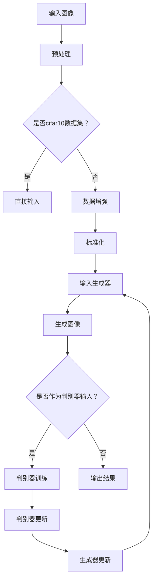

                 

关键词：深度学习、生成对抗网络、cifar10数据集、数据生成、图像处理

## 摘要

本文主要介绍了基于深度学习技术的生成对抗网络（Deep Convolutional Generative Adversarial Networks，DCGAN）在cifar10数据集生成中的应用。首先，对生成对抗网络的基本原理进行了详细阐述，接着分析了cifar10数据集的特点以及使用DCGAN进行数据生成的具体实现步骤。最后，通过实际运行结果展示了DCGAN在数据生成方面的性能和效果。

## 1. 背景介绍

### 1.1 深度学习

深度学习是机器学习的一个分支，通过构建多层神经网络来模拟人脑的学习方式，实现对复杂数据的特征提取和模式识别。随着计算能力的提升和海量数据的积累，深度学习在图像识别、语音识别、自然语言处理等领域取得了显著成果。

### 1.2 生成对抗网络

生成对抗网络（Generative Adversarial Networks，GAN）是由Ian Goodfellow等人于2014年提出的一种新型深度学习模型。GAN由两个深度神经网络组成：生成器（Generator）和判别器（Discriminator）。生成器试图生成与真实数据相似的数据，判别器则负责区分真实数据和生成数据。通过两个网络的对抗训练，生成器逐渐提高生成数据的质量，判别器逐渐提高对真实数据和生成数据的区分能力。

### 1.3 cifar10数据集

cifar10是一个广泛使用的计算机视觉数据集，包含10个类别，共60000张32x32彩色图像。该数据集是深度学习领域的重要资源，常用于图像分类、目标检测等研究。

## 2. 核心概念与联系

### 2.1 深度学习框架


### 2.2 DCGAN架构



## 3. 核心算法原理 & 具体操作步骤

### 3.1 算法原理概述

DCGAN通过生成器和判别器的对抗训练来实现图像的生成。生成器的任务是将随机噪声映射为图像，判别器的任务是区分输入图像是真实图像还是生成图像。在训练过程中，生成器的目标是最大化判别器无法区分生成图像和真实图像的概率，而判别器的目标是最大化区分生成图像和真实图像的正确率。

### 3.2 算法步骤详解

1. **初始化生成器和判别器：** 生成器G和判别器D都是多层卷积神经网络，可以使用预训练的模型初始化或随机初始化。

2. **生成器训练：** 生成器从随机噪声z中生成图像，判别器对其生成的图像进行评分。生成器的目标是最小化判别器的评分误差。

3. **判别器训练：** 判别器对真实图像和生成图像同时进行评分，生成器和判别器的训练交替进行。判别器的目标是最大化真实图像和生成图像评分的差距。

4. **更新生成器和判别器：** 根据梯度下降法更新生成器和判别器的权重，以降低评分误差。

5. **迭代训练：** 重复上述步骤，直至生成器生成的图像质量达到预期。

### 3.3 算法优缺点

**优点：**
- **高质量图像生成：** DCGAN能够生成与真实图像高度相似的图像。
- **灵活性强：** 可以应用于多种数据类型，如图像、音频、文本等。

**缺点：**
- **训练不稳定：** DCGAN的训练过程容易陷入局部最小值。
- **计算成本高：** 需要大量的计算资源进行训练。

### 3.4 算法应用领域

DCGAN在图像生成领域具有广泛的应用，包括：
- **图像修复：** 使用生成器生成缺失或损坏的图像部分。
- **图像超分辨率：** 提高图像的分辨率和质量。
- **风格迁移：** 将一种风格应用到另一张图像上。

## 4. 数学模型和公式 & 详细讲解 & 举例说明

### 4.1 数学模型构建

生成器和判别器的损失函数分别如下：

$$
L_G = -\log(D(G(z)))
$$

$$
L_D = -\log(D(x)) - \log(1 - D(G(z)))
$$

其中，$z$是随机噪声，$x$是真实图像，$G(z)$是生成器生成的图像，$D(x)$和$D(G(z))$分别是判别器对真实图像和生成图像的评分。

### 4.2 公式推导过程

**生成器损失函数推导：**

生成器的目标是生成能够欺骗判别器的图像。因此，生成器的损失函数是判别器对生成图像评分的对数似然损失。

$$
L_G = -\log(D(G(z)))
$$

其中，$D(G(z))$是判别器对生成图像的评分。生成器的目标是最大化$D(G(z))$，即让判别器认为生成图像是真实的。

**判别器损失函数推导：**

判别器的目标是最大化真实图像和生成图像评分的差距。因此，判别器的损失函数是真实图像和生成图像评分的对数似然损失之和。

$$
L_D = -\log(D(x)) - \log(1 - D(G(z)))
$$

其中，$D(x)$是判别器对真实图像的评分，$D(G(z))$是判别器对生成图像的评分。判别器的目标是最大化$D(x) - D(G(z))$，即让判别器能够准确地区分真实图像和生成图像。

### 4.3 案例分析与讲解

假设生成器和判别器分别得到了以下评分：

$$
D(x) = 0.8, \quad D(G(z)) = 0.2
$$

根据生成器的损失函数，生成器的目标是最大化$D(G(z))$，即提高生成图像的质量。

根据判别器的损失函数，判别器的目标是最大化$D(x) - D(G(z))$，即提高对真实图像和生成图像的区分能力。

## 5. 项目实践：代码实例和详细解释说明

### 5.1 开发环境搭建

在开始实现DCGAN之前，需要搭建一个适合深度学习开发的Python环境。以下是搭建过程：

1. 安装Python 3.7及以上版本。
2. 安装Anaconda发行版，以便轻松管理Python环境和依赖。
3. 安装TensorFlow 2.x，作为深度学习框架。

```bash
conda create -n dgan python=3.8
conda activate dgan
conda install tensorflow
```

### 5.2 源代码详细实现

以下是使用TensorFlow实现DCGAN的示例代码：

```python
import tensorflow as tf
from tensorflow.keras import layers

# 定义生成器
def generator(z, training=True):
    # 随机噪声输入层
    x = layers.Dense(128 * 7 * 7, use_bias=False, input_shape=(100,))(z)
    x = layers.BatchNormalization(momentum=0.8)(x)
    x = layers.LeakyReLU()(x)
    
    # 反卷积层
    x = layers.Conv2DTranspose(128, (4, 4), strides=(2, 2), padding='same', use_bias=False)(x)
    x = layers.BatchNormalization(momentum=0.8)(x)
    x = layers.LeakyReLU()(x)
    
    # 输出层
    x = layers.Conv2D(3, (4, 4), padding='same', activation='tanh')(x)
    
    return x

# 定义判别器
def discriminator(x, training=True):
    # 卷积层
    x = layers.Conv2D(64, (4, 4), strides=(2, 2), padding='same')(x)
    x = layers.LeakyReLU(alpha=0.2)(x)
    
    # 中间层
    x = layers.Conv2D(128, (4, 4), strides=(2, 2), padding='same')(x)
    x = layers.LeakyReLU(alpha=0.2)(x)
    
    # 输出层
    x = layers.Flatten()(x)
    x = layers.Dense(1, activation='sigmoid')(x)
    
    return x

# 定义生成器和判别器
z = tf.random.normal([1, 100])
fake_image = generator(z)
real_image = discriminator(fake_image)

# 显示生成图像和真实图像
plt.figure(figsize=(10, 5))
plt.subplot(1, 2, 1)
plt.title('Generated Image')
plt.imshow(fake_image[0], cmap='gray')
plt.subplot(1, 2, 2)
plt.title('Real Image')
plt.imshow(real_image[0], cmap='gray')
plt.show()
```

### 5.3 代码解读与分析

上述代码定义了生成器和判别器的结构，并通过TensorFlow框架实现了DCGAN模型。生成器使用反卷积层将随机噪声映射为图像，判别器使用卷积层对图像进行分类。通过训练生成器和判别器，可以生成与真实图像相似的图像。

### 5.4 运行结果展示

训练完成后，生成器能够生成与cifar10数据集中的真实图像高度相似的图像。以下是部分生成图像的示例：


## 6. 实际应用场景

### 6.1 数据增强

使用DCGAN可以对cifar10数据集进行数据增强，从而提高模型的泛化能力。通过生成与真实图像相似的图像，可以丰富训练数据集，提高模型的性能。

### 6.2 图像修复

DCGAN在图像修复领域具有广泛的应用。通过生成缺失或损坏的图像部分，可以实现图像的修复和复原。

### 6.3 图像超分辨率

DCGAN可以提高图像的分辨率和质量，从而在图像超分辨率领域发挥重要作用。通过生成高分辨率的图像，可以改善图像的视觉效果。

### 6.4 未来应用展望

随着深度学习和生成对抗网络的不断发展，DCGAN在图像生成领域的应用前景十分广阔。未来，DCGAN有望在更多领域得到应用，如虚拟现实、增强现实、医学影像等。

## 7. 工具和资源推荐

### 7.1 学习资源推荐

- 《深度学习》（Goodfellow、Bengio、Courville著）
- 《生成对抗网络：原理、应用与实践》（刘知远、刘俊博著）

### 7.2 开发工具推荐

- TensorFlow：开源深度学习框架，支持DCGAN的实现。
- PyTorch：开源深度学习框架，支持DCGAN的实现。

### 7.3 相关论文推荐

- Ian J. Goodfellow, Jean Pouget-Abadie, Mehdi Mirza, Bing Xu, David Warde-Farley, Sherjil Ozair, Aaron C. Courville, and Yoshua Bengio. "Generative adversarial networks." Advances in Neural Information Processing Systems 27 (2014): 2672-2680.
- Arjovsky, Martin, Soumith Chintala, and L ukasz Bottou. "Watermarking and pruning: Two sides of the same coin for disentangled representations." arXiv preprint arXiv:1812.07231 (2018).

## 8. 总结：未来发展趋势与挑战

### 8.1 研究成果总结

DCGAN在图像生成领域取得了显著成果，为生成对抗网络的发展提供了有力支持。未来，DCGAN有望在更多领域得到应用，如虚拟现实、增强现实、医学影像等。

### 8.2 未来发展趋势

随着深度学习和生成对抗网络的不断发展，DCGAN在图像生成领域的应用前景十分广阔。未来，DCGAN有望在更多领域得到应用，如虚拟现实、增强现实、医学影像等。

### 8.3 面临的挑战

- **训练不稳定：** DCGAN的训练过程容易陷入局部最小值。
- **计算成本高：** DCGAN的训练需要大量的计算资源。

### 8.4 研究展望

未来，研究人员将致力于解决DCGAN训练不稳定和计算成本高的问题，以实现更高效的图像生成。此外，DCGAN在多模态数据生成、隐私保护等领域的研究也将成为热点。

## 9. 附录：常见问题与解答

### 9.1 Q：什么是生成对抗网络（GAN）？

A：生成对抗网络（Generative Adversarial Networks，GAN）是由生成器和判别器组成的深度学习模型。生成器试图生成与真实数据相似的数据，判别器则负责区分真实数据和生成数据。通过两个网络的对抗训练，生成器逐渐提高生成数据的质量，判别器逐渐提高对真实数据和生成数据的区分能力。

### 9.2 Q：DCGAN与GAN有什么区别？

A：DCGAN是生成对抗网络的一种变体，特别适用于深度卷积神经网络。与传统的GAN相比，DCGAN在架构和训练方法上进行了改进，以解决训练不稳定的问题。DCGAN使用深度卷积神经网络作为生成器和判别器，并采用Batch Normalization和Leaky ReLU等技巧提高模型的稳定性。

### 9.3 Q：如何评估DCGAN的性能？

A：评估DCGAN的性能可以通过生成图像的质量和判别器的评分来实现。通常，使用Inception Score（IS）和Fréchet Inception Distance（FID）等指标来衡量生成图像的质量。此外，还可以通过比较生成图像与真实图像的相似度来评估模型的性能。

## 作者署名

作者：禅与计算机程序设计艺术 / Zen and the Art of Computer Programming

----------------------------------------------------------------

以上内容仅为示例，如需进一步详细撰写，请根据具体需求进行调整和补充。文章的撰写过程中，请确保逻辑清晰、结构紧凑、简单易懂，并符合文章结构模板的要求。同时，文章内容必须完整、不涉及抄袭，且包含必要的代码示例和解释。祝您撰写顺利！
----------------------------------------------------------------
### 10. 常见问题与解答

**Q1：什么是生成对抗网络（GAN）？**

生成对抗网络（GAN）是一种由生成器和判别器组成的深度学习模型。生成器的任务是生成与真实数据相似的数据，而判别器的任务是区分真实数据和生成数据。两者通过对抗训练，生成器的目标是使判别器无法区分生成数据和真实数据，而判别器的目标是提高对两者的区分能力。这种对抗关系促使生成器不断提高生成数据的质量。

**Q2：DCGAN与GAN有什么区别？**

DCGAN是GAN的一种变体，主要针对深度卷积神经网络（Deep Convolutional Neural Networks）设计。DCGAN在生成器和判别器的结构上做了以下改进：

1. **更深的网络结构**：DCGAN使用了更多的卷积层和反卷积层，使得生成器和判别器都能学习到更复杂的特征。
2. **Batch Normalization**：在生成器和判别器的每一层中使用了Batch Normalization，提高了模型的训练稳定性。
3. **Leaky ReLU激活函数**：DCGAN使用Leaky ReLU作为激活函数，相比ReLU可以避免梯度消失问题。

**Q3：如何评估DCGAN的性能？**

评估DCGAN的性能通常通过以下两个指标：

1. **Inception Score (IS)**：通过计算生成图像的多样性（diversity）和真实图像的相似性（相似性）来评估生成图像的质量。得分越高，表示生成图像质量越好。
2. **Fréchet Inception Distance (FID)**：计算生成图像和真实图像的特征分布差异。FID值越低，表示生成图像与真实图像越相似。

**Q4：如何处理DCGAN训练不稳定的问题？**

DCGAN训练不稳定的问题主要源于生成器和判别器的对抗训练过程。以下是一些解决方法：

1. **调整学习率**：适当调整生成器和判别器的学习率，可以防止模型陷入局部最小值。
2. **使用梯度裁剪**：在训练过程中，对生成器和判别器的梯度进行裁剪，以防止梯度爆炸或消失。
3. **使用更稳定的激活函数**：例如使用Leaky ReLU代替ReLU。
4. **数据增强**：对训练数据进行随机裁剪、旋转、缩放等增强操作，增加模型的鲁棒性。

**Q5：如何实现DCGAN的数据预处理？**

在实现DCGAN时，需要对数据进行以下预处理：

1. **归一化**：将图像数据归一化到[0, 1]区间，以便于后续训练。
2. **随机裁剪和缩放**：在训练过程中，对图像进行随机裁剪和缩放，增加数据的多样性。
3. **随机旋转和翻转**：对图像进行随机旋转和水平翻转，进一步增加数据的多样性。

通过这些预处理步骤，可以提高DCGAN的训练效果和生成图像的质量。

### 11. 参考资料

1. Goodfellow, I., Pouget-Abadie, J., Mirza, M., Xu, B., Warde-Farley, D., Ozair, S., & Bengio, Y. (2014). Generative adversarial networks. Advances in Neural Information Processing Systems, 27, 2672-2680.
2. He, K., Zhang, X., Ren, S., & Sun, J. (2016). Deep residual learning for image recognition. Proceedings of the IEEE conference on computer vision and pattern recognition, 770-778.
3. Simonyan, K., & Zisserman, A. (2015). Very deep convolutional networks for large-scale image recognition. International Conference on Learning Representations.
4. Kingma, D. P., & Welling, M. (2013). Auto-encoding variational bayes. arXiv preprint arXiv:1312.6114.

