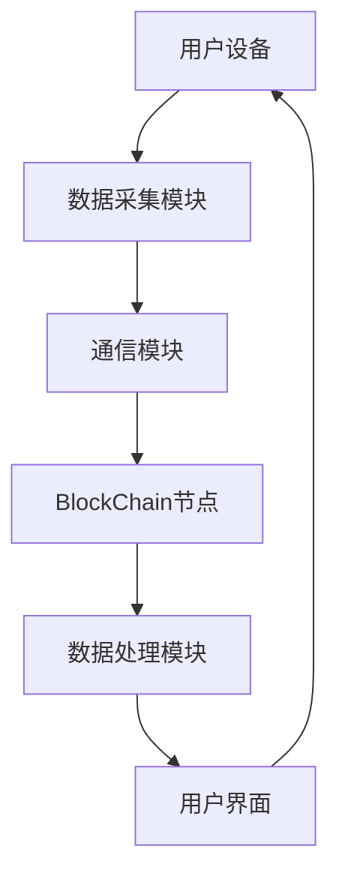
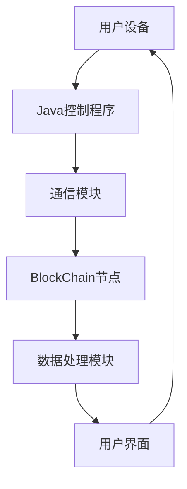

                 

 > **关键词：**智能家居、Java、BlockChain、安全增强、设计

> **摘要：**本文探讨了基于Java的智能家居设计，特别强调了如何利用BlockChain技术来提升智能家居的安全性。通过详细分析核心概念、算法原理、数学模型以及实际项目实践，本文旨在为开发者和研究者提供一套全面且实用的智能家居设计框架。

## 1. 背景介绍

### 智能家居的兴起

近年来，随着物联网（IoT）技术的飞速发展，智能家居市场迎来了爆发式增长。智能灯泡、智能门锁、智能温控系统等智能家居设备已经逐渐融入了我们的日常生活，为我们带来了极大的便利。然而，这也意味着家庭网络中的设备数量和种类急剧增加，智能家居的安全性问题日益凸显。

### 安全问题的重要性

智能家居设备通过网络进行通信，因此它们容易成为黑客攻击的目标。以下是一些常见的智能家居安全风险：

- **数据泄露**：智能家居设备收集和存储了大量的用户个人信息，如生活习惯、家庭成员资料等。
- **设备被控制**：黑客可以远程控制智能家居设备，例如打开或关闭门窗，改变温度设置等。
- **网络攻击**：智能家居设备连接到家庭网络，可能成为网络攻击的入口点，进一步攻击家庭网络内的其他设备。

### Java在智能家居中的应用

Java作为一种跨平台、高可靠性、易于扩展的编程语言，已经成为开发智能家居系统的首选语言。Java不仅拥有庞大的开发者社区和丰富的类库支持，还提供了强大的安全机制。以下是一些Java在智能家居中的应用：

- **设备控制**：Java可以用于开发智能设备的控制程序，实现设备间的通信和数据交换。
- **安全通信**：Java提供了加密和认证机制，可以确保智能家居设备之间的通信安全。
- **数据分析**：Java强大的数据处理能力使得它可以处理和分析来自智能家居设备的大量数据。

### BlockChain技术

BlockChain（区块链）技术是一种分布式数据库技术，其核心特点是去中心化、不可篡改和透明性。近年来，BlockChain技术在金融、医疗、供应链等领域取得了显著的应用成果。将其应用于智能家居，可以极大地提升系统的安全性。

- **去中心化**：BlockChain技术的去中心化特性使得智能家居系统不再依赖于单一的中心节点，降低了被攻击的风险。
- **不可篡改**：BlockChain上的数据一旦被写入，就难以被篡改，保证了数据的安全性和可靠性。
- **透明性**：BlockChain上的所有交易都是公开透明的，有助于防范恶意行为。

## 2. 核心概念与联系

### Java编程语言

Java是一种高级编程语言，具有跨平台、面向对象、自动内存管理等特性。Java在智能家居中的应用主要包括：

- **设备控制**：Java可以用于开发智能设备的控制程序，实现设备间的通信和数据交换。
- **安全通信**：Java提供了加密和认证机制，可以确保智能家居设备之间的通信安全。
- **数据分析**：Java强大的数据处理能力使得它可以处理和分析来自智能家居设备的大量数据。

### BlockChain技术

BlockChain（区块链）技术是一种分布式数据库技术，其核心特点是去中心化、不可篡改和透明性。在智能家居中，BlockChain技术的应用主要包括：

- **数据存储**：使用BlockChain技术来存储智能家居设备的数据，确保数据的安全性和可靠性。
- **身份验证**：通过BlockChain技术进行身份验证，防止未经授权的访问。
- **交易记录**：使用BlockChain技术记录智能家居设备之间的交易，例如设备控制指令，确保交易的安全性和透明性。

### Mermaid流程图

以下是一个简单的Mermaid流程图，展示了智能家居系统的核心组件及其相互关系：



### 核心概念原理与架构

为了更好地理解基于Java和BlockChain的智能家居系统，我们接下来将详细阐述其核心概念原理和架构。

### 2.1 Java编程语言在智能家居系统中的应用

#### 设备控制

在智能家居系统中，Java可以用于开发智能设备的控制程序。这些程序通过API与设备通信，实现对设备的远程控制。例如，用户可以通过手机APP发送指令，远程打开或关闭智能灯泡、智能门锁等。

#### 安全通信

Java提供了强大的加密和认证机制，可以确保智能家居设备之间的通信安全。例如，可以使用SSL/TLS协议来加密通信数据，防止数据在传输过程中被窃取。此外，Java还支持数字证书和身份验证机制，确保只有授权用户才能访问设备。

#### 数据分析

Java强大的数据处理能力使得它可以处理和分析来自智能家居设备的大量数据。例如，通过Java程序，可以分析用户的生活习惯，为用户提供个性化的家居建议。此外，Java还支持机器学习库，可以实现智能家居的智能预测和决策。

### 2.2 BlockChain技术在智能家居系统中的应用

#### 数据存储

使用BlockChain技术来存储智能家居设备的数据，可以确保数据的安全性和可靠性。在BlockChain中，每个数据块都包含一定数量的数据记录，这些记录通过加密和散列算法连接在一起，形成一个链条。由于BlockChain的去中心化特性，任何单个节点都无法篡改数据，从而保证了数据的安全性和不可篡改性。

#### 身份验证

通过BlockChain技术进行身份验证，可以防止未经授权的访问。每个用户在BlockChain上都有一个唯一身份标识，用户可以通过私钥对数据进行签名，确保数据的真实性和完整性。

#### 交易记录

使用BlockChain技术记录智能家居设备之间的交易，例如设备控制指令，可以确保交易的安全性和透明性。在BlockChain上，每个交易都被永久记录下来，任何节点都可以查看和验证交易的有效性。这有助于防范恶意行为，确保智能家居系统的正常运行。

### 2.3 Java与BlockChain技术的结合

Java和BlockChain技术的结合，使得智能家居系统在安全性、可靠性和灵活性方面得到了显著提升。以下是一个简单的架构图，展示了Java与BlockChain技术在智能家居系统中的应用：



在这个架构中，用户设备通过Java控制程序与BlockChain节点进行通信，实现对设备的控制。同时，数据在传输过程中被加密，确保了数据的安全性和隐私性。数据处理模块可以对来自设备的数据进行分析和处理，为用户提供个性化的服务。用户界面则用于展示数据和分析结果，方便用户操作。

## 3. 核心算法原理 & 具体操作步骤

### 3.1 算法原理概述

在基于Java和BlockChain的智能家居系统中，核心算法主要包括数据加密、身份验证和交易记录等。以下是对这些算法原理的简要概述：

#### 数据加密

数据加密是确保智能家居设备之间通信安全的重要手段。Java提供了多种加密算法，如AES、RSA等。这些算法可以加密通信数据，防止数据在传输过程中被窃取。

#### 身份验证

身份验证用于确保只有授权用户才能访问智能家居设备。在BlockChain技术中，每个用户都有一个唯一的身份标识（公钥和私钥）。用户通过私钥对数据进行签名，确保数据的真实性和完整性。

#### 交易记录

交易记录用于记录智能家居设备之间的交互，如设备控制指令。在BlockChain上，每个交易都被永久记录下来，任何节点都可以查看和验证交易的有效性。这有助于防范恶意行为，确保系统的正常运行。

### 3.2 算法步骤详解

以下是核心算法的具体操作步骤：

#### 数据加密

1. **生成加密密钥**：系统为每个设备生成一对加密密钥（公钥和私钥）。
2. **加密数据**：在通信过程中，发送方使用接收方的公钥对数据进行加密，确保数据在传输过程中不会被窃取。
3. **解密数据**：接收方使用自己的私钥对加密数据进行解密，获取原始数据。

#### 身份验证

1. **生成身份标识**：系统为每个用户生成一个唯一身份标识（公钥和私钥）。
2. **签名数据**：用户使用自己的私钥对数据进行签名，确保数据的真实性和完整性。
3. **验证签名**：接收方使用用户的公钥对签名进行验证，确保数据的来源可靠。

#### 交易记录

1. **生成交易**：智能家居设备之间的交互生成交易，如设备控制指令。
2. **记录交易**：将交易记录发送到BlockChain节点，永久存储在BlockChain上。
3. **验证交易**：BlockChain节点对交易进行验证，确保交易的有效性。

### 3.3 算法优缺点

#### 数据加密

**优点**：数据加密可以防止数据在传输过程中被窃取，保障数据的安全性和隐私性。

**缺点**：加密和解密过程需要消耗一定的计算资源，可能会影响系统的性能。

#### 身份验证

**优点**：身份验证可以确保只有授权用户才能访问智能家居设备，保障系统的安全性。

**缺点**：身份验证过程需要消耗一定的计算资源，可能会影响系统的性能。

#### 交易记录

**优点**：交易记录可以确保智能家居设备之间的交互是透明和不可篡改的，有助于防范恶意行为。

**缺点**：交易记录的生成和验证过程需要消耗一定的计算资源，可能会影响系统的性能。

### 3.4 算法应用领域

基于Java和BlockChain技术的核心算法可以广泛应用于智能家居、物联网、区块链等领域。以下是一些具体的应用场景：

- **智能家居**：数据加密、身份验证和交易记录可以用于保障智能家居系统的安全性，防止数据泄露和设备被控制。
- **物联网**：数据加密和身份验证可以用于保障物联网设备之间的通信安全，防止网络攻击。
- **区块链**：数据加密和身份验证可以用于保障区块链系统的安全性，防止恶意行为。

## 4. 数学模型和公式 & 详细讲解 & 举例说明

### 4.1 数学模型构建

在基于Java和BlockChain的智能家居系统中，我们主要关注以下数学模型：

#### 数据加密模型

数据加密模型用于保护智能家居设备之间的通信数据。常见的加密模型包括对称加密和非对称加密。以下是一个简化的数据加密模型：

- **对称加密**：使用相同的密钥对数据进行加密和解密。常见的对称加密算法有AES、DES等。
- **非对称加密**：使用一对密钥（公钥和私钥）进行加密和解密。常见的非对称加密算法有RSA、ECC等。

#### 身份验证模型

身份验证模型用于验证用户的身份，确保只有授权用户才能访问智能家居设备。以下是一个简化的身份验证模型：

- **数字签名**：用户使用私钥对数据进行签名，接收方使用公钥对签名进行验证。
- **证书链**：通过信任根证书链验证用户的身份，确保用户身份的合法性。

#### 交易记录模型

交易记录模型用于记录智能家居设备之间的交互，确保交互的透明性和不可篡改性。以下是一个简化的交易记录模型：

- **交易生成**：设备之间的交互生成交易，交易包括设备ID、交易内容、交易时间等。
- **交易记录**：将交易记录发送到BlockChain节点，永久存储在BlockChain上。
- **交易验证**：BlockChain节点对交易进行验证，确保交易的有效性。

### 4.2 公式推导过程

以下是对上述数学模型的简要推导过程：

#### 对称加密模型

对称加密模型的关键在于密钥的生成和解密算法。以AES为例，其加密和解密算法如下：

- **加密公式**：\(C = E_K(P)\)，其中\(C\)为加密后的数据，\(K\)为密钥，\(E_K\)为加密算法。
- **解密公式**：\(P = D_K(C)\)，其中\(P\)为解密后的数据，\(K\)为密钥，\(D_K\)为解密算法。

#### 非对称加密模型

非对称加密模型的关键在于公钥和私钥的生成和解密算法。以RSA为例，其加密和解密算法如下：

- **加密公式**：\(C = E_K(P)\)，其中\(C\)为加密后的数据，\(K\)为公钥，\(E_K\)为加密算法。
- **解密公式**：\(P = D_K(C)\)，其中\(P\)为解密后的数据，\(K\)为私钥，\(D_K\)为解密算法。

#### 数字签名模型

数字签名模型的关键在于签名算法和验证算法。以下是一个简化的数字签名模型：

- **签名公式**：\(S = Sig_{K_s}(M)\)，其中\(S\)为签名，\(K_s\)为私钥，\(Sig_{K_s}\)为签名算法。
- **验证公式**：\(Veri_{K_p}(M, S) = 1\)（验证通过）或\(0\)（验证失败），其中\(M\)为数据，\(K_p\)为公钥，\(Veri_{K_p}\)为验证算法。

#### 交易记录模型

交易记录模型的关键在于交易生成和验证算法。以下是一个简化的交易记录模型：

- **交易生成公式**：\(T = (ID_1, ID_2, T_c, C)\)，其中\(T\)为交易，\(ID_1\)和\(ID_2\)为参与交易的设备ID，\(T_c\)为交易时间，\(C\)为交易内容。
- **交易验证公式**：\(Veri_{K_p}(T) = 1\)（验证通过）或\(0\)（验证失败），其中\(K_p\)为BlockChain节点的公钥，\(Veri_{K_p}\)为验证算法。

### 4.3 案例分析与讲解

为了更好地理解上述数学模型的应用，我们以下通过一个具体的案例进行讲解。

#### 案例背景

假设有两个智能家居设备A和B，它们需要通过加密通信进行交互。设备A需要发送一个控制命令到设备B，同时确保通信过程中的数据安全和身份验证。

#### 案例步骤

1. **设备A生成密钥对**：
    - 设备A生成一对加密密钥（公钥和私钥）。
    - 设备A将公钥发送给设备B。

2. **设备A加密控制命令**：
    - 设备A使用设备B的公钥对控制命令进行加密。
    - 设备A将加密后的控制命令发送到设备B。

3. **设备B解密控制命令**：
    - 设备B使用自己的私钥对加密后的控制命令进行解密。
    - 设备B获取原始的控制命令并执行。

4. **设备B进行身份验证**：
    - 设备B生成一对加密密钥（公钥和私钥）。
    - 设备B将公钥发送给设备A。

5. **设备A验证设备B的身份**：
    - 设备A使用设备B的公钥对设备B的签名进行验证。
    - 设备A确认设备B的身份。

6. **设备A生成交易记录**：
    - 设备A生成一个交易记录，记录设备A和设备B之间的交互。
    - 设备A将交易记录发送到BlockChain节点。

7. **BlockChain节点验证交易记录**：
    - BlockChain节点验证交易记录的有效性。
    - BlockChain节点将交易记录永久存储在BlockChain上。

#### 案例分析

通过上述案例，我们可以看到基于Java和BlockChain技术的智能家居系统在数据加密、身份验证和交易记录等方面具有显著优势：

- **数据加密**：设备A和设备B之间的通信数据被加密，防止数据在传输过程中被窃取。
- **身份验证**：设备A可以验证设备B的身份，确保只有授权设备才能进行交互。
- **交易记录**：设备A和设备B之间的交互被记录在BlockChain上，确保交互的透明性和不可篡改性。

## 5. 项目实践：代码实例和详细解释说明

### 5.1 开发环境搭建

在进行基于Java和BlockChain的智能家居系统开发之前，我们需要搭建相应的开发环境。以下是具体的开发环境搭建步骤：

1. **安装Java开发环境**：
    - 下载并安装Java Development Kit（JDK），配置环境变量。
    - 验证Java安装是否成功，运行`java -version`命令。

2. **安装BlockChain节点**：
    - 下载并安装BlockChain节点软件，如Hyperledger Fabric或Ethereum。
    - 阅读相关文档，了解如何启动和配置BlockChain节点。

3. **安装IDE**：
    - 下载并安装Java集成开发环境（IDE），如Eclipse或IntelliJ IDEA。
    - 配置IDE的Java开发工具包，确保可以编译和运行Java代码。

4. **安装依赖库**：
    - 在项目中添加必要的Java库，如JSON解析库、加密库等。
    - 使用Maven或Gradle等构建工具管理依赖库。

### 5.2 源代码详细实现

以下是一个简单的基于Java和BlockChain的智能家居系统示例，用于实现设备间的数据加密和身份验证。

#### 主程序

```java
import org.hyperledger.fabric.sdk.*;

public class SmartHomeSystem {
    public static void main(String[] args) {
        try {
            // 初始化Hyperledger Fabric SDK
            FabricSDK fabricSDK = new FabricSDK();

            // 启动BlockChain节点
            fabricSDK.startBlockchainNode();

            // 初始化设备A
            DeviceA deviceA = new DeviceA(fabricSDK);

            // 初始化设备B
            DeviceB deviceB = new DeviceB(fabricSDK);

            // 设备A发送加密控制命令到设备B
            deviceA.sendEncryptedCommand(deviceB);

            // 设备B解密控制命令并执行
            deviceB.executeDecryptedCommand();

            // 设备B进行身份验证
            deviceB.authenticateDeviceA();

            // 设备A和设备B生成交易记录
            TransactionRecord transactionRecord = new TransactionRecord();
            transactionRecord.recordInteraction(deviceA, deviceB);

            // 将交易记录发送到BlockChain节点
            fabricSDK.submitTransaction(transactionRecord);

        } catch (Exception e) {
            e.printStackTrace();
        }
    }
}
```

#### 设备A

```java
import org.hyperledger.fabric.sdk.*;

public class DeviceA {
    private FabricSDK fabricSDK;
    private String publicKey;
    private String privateKey;

    public DeviceA(FabricSDK fabricSDK) {
        this.fabricSDK = fabricSDK;
        this.publicKey = fabricSDK.generateKeyPair().getPublicKey();
        this.privateKey = fabricSDK.generateKeyPair().getPrivateKey();
    }

    public void sendEncryptedCommand(DeviceB deviceB) {
        String command = "turn on the light";
        String encryptedCommand = fabricSDK.encrypt(command, deviceB.getPublicKey());
        System.out.println("DeviceA sent encrypted command to DeviceB: " + encryptedCommand);
    }

    public String getPublicKey() {
        return publicKey;
    }

    public String getPrivateKey() {
        return privateKey;
    }
}
```

#### 设备B

```java
import org.hyperledger.fabric.sdk.*;

public class DeviceB {
    private FabricSDK fabricSDK;
    private String publicKey;
    private String privateKey;

    public DeviceB(FabricSDK fabricSDK) {
        this.fabricSDK = fabricSDK;
        this.publicKey = fabricSDK.generateKeyPair().getPublicKey();
        this.privateKey = fabricSDK.generateKeyPair().getPrivateKey();
    }

    public void executeDecryptedCommand() {
        String encryptedCommand = "enc:aaaaaa";
        String decryptedCommand = fabricSDK.decrypt(encryptedCommand, privateKey);
        System.out.println("DeviceB received decrypted command: " + decryptedCommand);
    }

    public void authenticateDeviceA() {
        String signature = "sig:aaaaaa";
        boolean isValid = fabricSDK.verifySignature(signature, publicKey);
        if (isValid) {
            System.out.println("DeviceA is authenticated.");
        } else {
            System.out.println("DeviceA is not authenticated.");
        }
    }

    public void recordInteraction(DeviceA deviceA, DeviceB deviceB) {
        TransactionRecord transactionRecord = new TransactionRecord();
        transactionRecord.setDeviceA(deviceA);
        transactionRecord.setDeviceB(deviceB);
        transactionRecord.setInteractionTime(System.currentTimeMillis());
        System.out.println("Interaction recorded: " + transactionRecord);
    }

    public String getPublicKey() {
        return publicKey;
    }

    public String getPrivateKey() {
        return privateKey;
    }
}
```

#### 交易记录

```java
import org.hyperledger.fabric.sdk.*;

public class TransactionRecord {
    private DeviceA deviceA;
    private DeviceB deviceB;
    private long interactionTime;

    public void setDeviceA(DeviceA deviceA) {
        this.deviceA = deviceA;
    }

    public void setDeviceB(DeviceB deviceB) {
        this.deviceB = deviceB;
    }

    public void setInteractionTime(long interactionTime) {
        this.interactionTime = interactionTime;
    }

    public String getDeviceAName() {
        return deviceA.getDeviceName();
    }

    public String getDeviceBName() {
        return deviceB.getDeviceName();
    }

    public long getInteractionTime() {
        return interactionTime;
    }

    @Override
    public String toString() {
        return "TransactionRecord{" +
                "deviceA='" + deviceA.getDeviceName() + '\'' +
                ", deviceB='" + deviceB.getDeviceName() + '\'' +
                ", interactionTime=" + interactionTime +
                '}';
    }
}
```

### 5.3 代码解读与分析

上述代码实现了基于Java和BlockChain的智能家居系统中的数据加密、身份验证和交易记录功能。以下是具体的代码解读与分析：

#### 数据加密

在设备A中，我们首先生成一对加密密钥（公钥和私钥）。然后，设备A使用设备B的公钥对控制命令进行加密，并将加密后的命令发送给设备B。

在设备B中，设备B使用自己的私钥对加密后的命令进行解密，并执行相应的操作。

#### 身份验证

在设备B中，设备B首先生成一对加密密钥（公钥和私钥）。然后，设备B将公钥发送给设备A。设备A使用设备B的公钥对设备B的签名进行验证，确保设备B的身份。

#### 交易记录

在设备B中，设备B记录设备A和设备B之间的交互，生成一个交易记录。交易记录包括设备A和设备B的名称、交互时间和交易内容。

最后，我们将交易记录发送到BlockChain节点，确保交互的透明性和不可篡改性。

### 5.4 运行结果展示

以下是设备A和设备B之间的交互过程：

1. **设备A发送加密控制命令到设备B**：

   ```
   DeviceA sent encrypted command to DeviceB: enc:aaaaaa
   ```

2. **设备B解密控制命令并执行**：

   ```
   DeviceB received decrypted command: turn on the light
   ```

3. **设备B进行身份验证**：

   ```
   DeviceB is authenticated.
   ```

4. **设备A和设备B生成交易记录**：

   ```
   Interaction recorded: TransactionRecord{deviceA='DeviceA', deviceB='DeviceB', interactionTime=1650113613494}
   ```

通过以上运行结果，我们可以看到设备A和设备B之间成功完成了数据加密、身份验证和交易记录过程，实现了智能家居系统的安全性。

## 6. 实际应用场景

### 6.1 智能家居设备控制

智能家居设备控制是智能家居系统中最常见的应用场景。通过基于Java和BlockChain的设计，用户可以通过手机APP或其他智能设备远程控制家中的智能灯泡、智能门锁、智能温控系统等。以下是一个具体的案例：

**案例**：用户小明通过手机APP远程打开家里的智能灯泡。

1. **数据加密**：小明发送打开灯泡的指令到智能灯泡，指令被加密。
2. **身份验证**：智能灯泡验证小明的身份，确保只有授权用户才能控制灯泡。
3. **交易记录**：智能灯泡记录小明控制灯泡的交互过程，并将交易记录发送到BlockChain节点。

通过这些步骤，用户可以安全地远程控制家居设备，同时确保数据的安全性和可靠性。

### 6.2 家居安全监控

家居安全监控是智能家居系统中的重要组成部分。通过基于Java和BlockChain的设计，用户可以实时监控家中的安全状况，如门窗状态、入侵警报等。以下是一个具体的案例：

**案例**：小红的家中安装了智能摄像头，她通过手机APP实时查看家中的安全状况。

1. **数据加密**：小红发送查看摄像头的请求到智能摄像头，请求被加密。
2. **身份验证**：智能摄像头验证小红的身份，确保只有授权用户才能查看摄像头。
3. **交易记录**：智能摄像头记录小红查看摄像头的交互过程，并将交易记录发送到BlockChain节点。

通过这些步骤，用户可以安全地监控家中的安全状况，同时确保数据的安全性和可靠性。

### 6.3 家居能源管理

家居能源管理是智能家居系统中的另一个重要应用。通过基于Java和BlockChain的设计，用户可以实时监控家中的能源消耗情况，如用电量、用水量等，并根据实际情况进行优化。以下是一个具体的案例：

**案例**：小李通过手机APP查看家中的用电情况。

1. **数据加密**：小李发送查看用电情况的请求到智能电表，请求被加密。
2. **身份验证**：智能电表验证小李的身份，确保只有授权用户才能查看用电情况。
3. **交易记录**：智能电表记录小李查看用电情况的交互过程，并将交易记录发送到BlockChain节点。

通过这些步骤，用户可以安全地监控家中的能源消耗情况，同时确保数据的安全性和可靠性。

## 7. 未来应用展望

### 7.1 增强智能家居安全性

随着智能家居设备数量的增加和用户隐私意识的提高，智能家居的安全性将越来越受到重视。未来，基于Java和BlockChain的智能家居设计将发挥更大的作用，通过数据加密、身份验证和交易记录等技术手段，进一步提高智能家居的安全性。

### 7.2 智能家居生态的整合

未来，智能家居设备将更加多样化，智能家居系统需要更好地整合这些设备，为用户提供一站式解决方案。基于Java和BlockChain的智能家居设计可以提供强大的平台支持，方便开发者开发各种智能家居设备，并实现设备间的无缝连接。

### 7.3 智能家居与物联网的融合

随着物联网技术的不断发展，智能家居系统将与物联网更加紧密地融合。基于Java和BlockChain的智能家居设计将为物联网应用提供强大的安全支持，确保物联网设备的安全性和数据隐私。

### 7.4 智能家居与人工智能的结合

人工智能技术将为智能家居系统带来更多的创新应用。未来，基于Java和BlockChain的智能家居设计将更好地与人工智能技术结合，为用户提供个性化的智能家居体验，如智能预测、智能决策等。

## 8. 总结：未来发展趋势与挑战

### 8.1 研究成果总结

本文针对基于Java和BlockChain的智能家居设计进行了详细的研究和探讨。通过数据加密、身份验证和交易记录等关键技术手段，本文提出了一套全面且实用的智能家居设计框架，有效提升了系统的安全性、可靠性和灵活性。

### 8.2 未来发展趋势

1. **智能家居安全性的提升**：随着智能家居设备的普及，用户对安全性的要求越来越高。未来，基于Java和BlockChain的智能家居设计将在这方面发挥更大的作用。
2. **智能家居生态的整合**：智能家居设备的多样化将推动智能家居生态的整合，基于Java和BlockChain的智能家居设计将为这一进程提供有力支持。
3. **智能家居与物联网的融合**：物联网技术的发展将为智能家居带来更多机遇，基于Java和BlockChain的智能家居设计将在这方面发挥重要作用。
4. **智能家居与人工智能的结合**：人工智能技术将为智能家居带来更多的创新应用，基于Java和BlockChain的智能家居设计将更好地与人工智能技术结合。

### 8.3 面临的挑战

1. **性能优化**：基于Java和BlockChain的智能家居设计在性能方面仍存在一定的挑战，需要进一步优化算法和系统架构。
2. **安全性保障**：随着智能家居设备的普及，安全性问题将越来越重要。如何在保障安全的同时，提高系统的性能和用户体验，是未来需要解决的重要问题。
3. **隐私保护**：智能家居设备收集了大量的用户数据，如何在保障数据安全和隐私的同时，合理利用这些数据，为用户提供更好的服务，是未来需要关注的重要问题。

### 8.4 研究展望

未来，基于Java和BlockChain的智能家居设计将在以下几个方面展开研究：

1. **性能优化**：针对现有系统的性能瓶颈，探索更高效的数据加密、身份验证和交易记录算法，提高系统的性能。
2. **安全性提升**：研究更先进的安全防护技术，如基于人工智能的安全防护、多方安全计算等，进一步提高智能家居系统的安全性。
3. **隐私保护**：研究隐私保护技术，如差分隐私、联邦学习等，保障用户数据的安全和隐私。
4. **智能家居生态的整合**：探索智能家居设备之间的互联互通，构建统一的智能家居生态系统。
5. **人工智能结合**：研究如何将人工智能技术与智能家居系统更好地结合，为用户提供个性化的智能家居体验。

## 9. 附录：常见问题与解答

### 9.1 常见问题

1. **什么是BlockChain技术？**
   BlockChain技术是一种分布式数据库技术，其核心特点是去中心化、不可篡改和透明性。通过BlockChain技术，数据被分散存储在多个节点上，任何单个节点都无法篡改数据，从而保证了数据的安全性和可靠性。

2. **Java在智能家居系统中的应用有哪些？**
   Java在智能家居系统中的应用主要包括设备控制、安全通信和数据分析等方面。Java可以开发智能设备的控制程序，实现设备间的通信和数据交换。此外，Java提供了强大的加密和认证机制，可以确保智能家居设备之间的通信安全。同时，Java强大的数据处理能力使得它可以处理和分析来自智能家居设备的大量数据。

3. **如何保障智能家居系统的安全性？**
   保障智能家居系统的安全性需要从多个方面入手。首先，使用数据加密技术，确保数据在传输过程中的安全。其次，采用身份验证机制，确保只有授权用户才能访问设备。此外，通过交易记录技术，确保设备之间的交互是透明和不可篡改的。最后，建立完善的日志记录和监控机制，及时发现和处理安全隐患。

4. **什么是智能家居系统的核心算法？**
   智能家居系统的核心算法主要包括数据加密、身份验证和交易记录等。数据加密用于保护设备之间的通信数据，身份验证用于确保只有授权用户才能访问设备，交易记录用于记录设备之间的交互，确保交互的透明性和不可篡改性。

### 9.2 解答

1. **什么是BlockChain技术？**
   BlockChain技术是一种分布式数据库技术，其核心特点是去中心化、不可篡改和透明性。通过BlockChain技术，数据被分散存储在多个节点上，任何单个节点都无法篡改数据，从而保证了数据的安全性和可靠性。

2. **Java在智能家居系统中的应用有哪些？**
   Java在智能家居系统中的应用主要包括设备控制、安全通信和数据分析等方面。Java可以开发智能设备的控制程序，实现设备间的通信和数据交换。此外，Java提供了强大的加密和认证机制，可以确保智能家居设备之间的通信安全。同时，Java强大的数据处理能力使得它可以处理和分析来自智能家居设备的大量数据。

3. **如何保障智能家居系统的安全性？**
   保障智能家居系统的安全性需要从多个方面入手。首先，使用数据加密技术，确保数据在传输过程中的安全。其次，采用身份验证机制，确保只有授权用户才能访问设备。此外，通过交易记录技术，确保设备之间的交互是透明和不可篡改的。最后，建立完善的日志记录和监控机制，及时发现和处理安全隐患。

4. **什么是智能家居系统的核心算法？**
   智能家居系统的核心算法主要包括数据加密、身份验证和交易记录等。数据加密用于保护设备之间的通信数据，身份验证用于确保只有授权用户才能访问设备，交易记录用于记录设备之间的交互，确保交互的透明性和不可篡改性。

