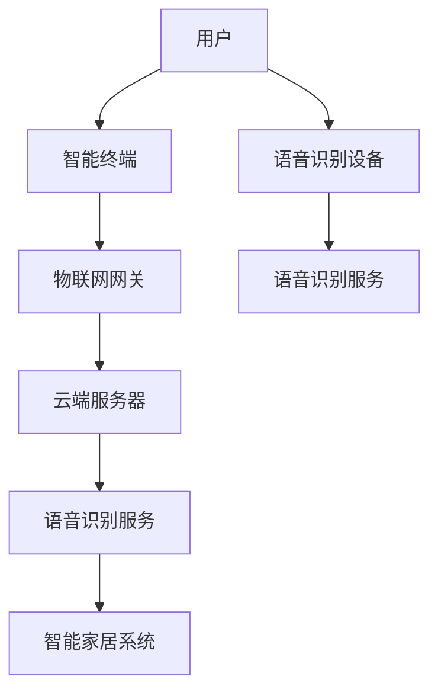

                 

关键词：Java，智能家居，语音识别，集成，系统设计

> 摘要：随着智能家居行业的快速发展，如何将先进的语音识别技术集成到智能家居系统中成为了研究的热点。本文将详细探讨基于Java的智能家居设计，并深入分析如何在系统中实现语音识别功能。文章从背景介绍、核心概念、算法原理、数学模型、项目实践、应用场景、工具推荐、总结展望等多个角度进行论述，旨在为智能家居设计者提供有价值的参考。

## 1. 背景介绍

智能家居（Smart Home）是近年来发展迅速的一个领域，它通过物联网（IoT）技术将家庭中的各种设备连接起来，实现自动化控制和远程管理。从最初的智能灯泡、智能插座到复杂的智能安防系统，智能家居正在逐步渗透到我们的日常生活中。

在智能家居系统中，语音识别技术扮演着重要的角色。通过语音识别，用户可以与智能家居系统进行自然语言交互，实现设备控制、信息查询、语音提醒等功能。而Java作为一种广泛使用且功能强大的编程语言，其在智能家居设计中的应用也越来越受到关注。

本文将围绕基于Java的智能家居设计，详细讨论如何集成语音识别功能到智能家居系统中。文章将从以下几个方面进行探讨：

1. **背景介绍**：介绍智能家居和语音识别技术的发展背景。
2. **核心概念与联系**：讲解智能家居系统和语音识别技术的核心概念，并通过Mermaid流程图展示系统架构。
3. **核心算法原理与具体操作步骤**：分析语音识别算法的原理，并详细阐述操作步骤。
4. **数学模型和公式**：介绍与语音识别相关的数学模型和公式，并进行举例说明。
5. **项目实践：代码实例和详细解释说明**：通过实际项目，展示如何使用Java实现语音识别功能。
6. **实际应用场景**：分析语音识别在智能家居中的实际应用。
7. **工具和资源推荐**：推荐学习资源、开发工具和相关论文。
8. **总结与展望**：总结研究成果，探讨未来发展趋势与挑战。

## 2. 核心概念与联系

### 2.1 智能家居系统

智能家居系统是由多个智能设备组成的网络，通过物联网技术实现设备间的互联互通，提供便捷的家居控制和管理。智能家居系统通常包括以下几个核心组成部分：

- **智能终端**：如智能电视、智能音响、智能门锁等，它们是用户与智能家居系统交互的入口。
- **物联网网关**：负责连接各种智能设备，并将数据上传到云端。
- **云端服务器**：处理数据存储、设备管理、远程控制等功能。
- **用户界面**：如手机APP、Web界面等，用户可以通过这些界面与智能家居系统进行交互。

### 2.2 语音识别技术

语音识别技术是一种让计算机通过识别和理解用户语音，实现人与机器交互的技术。语音识别技术的基本流程包括：

- **声音采集**：通过麦克风等设备采集用户的语音信号。
- **声音预处理**：对采集到的声音信号进行降噪、归一化等处理。
- **特征提取**：从预处理后的声音信号中提取语音特征，如频谱、倒谱等。
- **声学模型**：使用大量语音数据训练声学模型，用于识别语音特征。
- **语言模型**：根据上下文和语法规则，将语音特征映射到具体的语义上。
- **解码**：将语音特征解码成对应的文字或命令。

### 2.3 Java在智能家居设计中的应用

Java作为一种跨平台、面向对象的编程语言，具有广泛的适用性和强大的功能。在智能家居设计中，Java可以用于：

- **智能终端开发**：如开发智能电视的应用程序。
- **网关和服务器开发**：实现物联网网关和云端服务器的功能。
- **用户界面开发**：构建手机APP和Web界面。

### 2.4 Mermaid流程图

为了更好地理解智能家居系统与语音识别技术的联系，我们使用Mermaid流程图展示系统架构。以下是一个简化的Mermaid流程图：



在这个流程图中，用户通过智能终端与语音识别设备进行交互，语音识别服务对语音进行处理，最终控制智能家居系统。通过这个流程图，我们可以清晰地看到各个组件之间的联系和工作流程。

## 3. 核心算法原理与具体操作步骤

### 3.1 算法原理概述

语音识别算法的核心在于将语音信号转换为文本或命令。这个过程可以分为以下几个步骤：

1. **声音采集**：使用麦克风等设备采集用户的语音信号。
2. **声音预处理**：对语音信号进行降噪、归一化等处理，提高信号质量。
3. **特征提取**：从预处理后的声音信号中提取语音特征，如频谱、倒谱等。
4. **声学模型**：使用大量语音数据训练声学模型，用于识别语音特征。
5. **语言模型**：根据上下文和语法规则，将语音特征映射到具体的语义上。
6. **解码**：将语音特征解码成对应的文本或命令。

### 3.2 算法步骤详解

1. **声音采集**

   使用麦克风等设备采集用户的语音信号。这一步的关键是确保声音信号的清晰度和稳定性。

2. **声音预处理**

   对采集到的语音信号进行降噪、归一化等处理，提高信号质量。降噪可以去除背景噪音，归一化可以调整声音的音量，使其保持一致。

3. **特征提取**

   从预处理后的声音信号中提取语音特征，如频谱、倒谱等。这些特征用于后续的声学模型训练和语音识别。

4. **声学模型训练**

   使用大量语音数据训练声学模型。这一步是语音识别的核心，通过大量数据的训练，模型可以更好地识别语音特征。

5. **语言模型构建**

   根据上下文和语法规则，构建语言模型。语言模型用于将语音特征映射到具体的语义上。

6. **解码**

   将语音特征解码成对应的文本或命令。这一步需要将声学模型和语言模型结合起来，实现语音到文本的转换。

### 3.3 算法优缺点

**优点**：

1. **高准确性**：通过大量数据的训练，语音识别算法可以精确识别用户的语音。
2. **跨平台性**：Java作为跨平台编程语言，使得语音识别系统可以在多种操作系统上运行。
3. **易扩展性**：Java支持面向对象编程，便于后续功能的扩展和升级。

**缺点**：

1. **对环境要求高**：语音识别系统对声音环境要求较高，噪音和语音清晰度都会影响识别准确性。
2. **计算资源消耗大**：语音识别算法复杂度高，需要大量的计算资源。

### 3.4 算法应用领域

语音识别技术在智能家居中具有广泛的应用领域，如：

1. **智能音箱**：通过语音识别，用户可以控制智能音箱播放音乐、查询天气、设置闹钟等。
2. **智能电视**：用户可以通过语音识别进行节目搜索、控制播放等操作。
3. **智能安防**：通过语音识别，智能安防系统可以实现语音报警、语音控制等功能。

## 4. 数学模型和公式

### 4.1 数学模型构建

语音识别中的数学模型主要包括声学模型和语言模型。声学模型用于描述语音信号的特征，语言模型用于描述语音的语义。

**声学模型**：

声学模型通常使用高斯混合模型（Gaussian Mixture Model，GMM）或深度神经网络（Deep Neural Network，DNN）来建模。以下是一个简化的声学模型公式：

\[ P(\text{特征}|\text{语音}) = \sum_{i=1}^{C} P(\text{特征}|\theta_i) P(\theta_i) \]

其中，\( C \) 是高斯分布的个数，\( \theta_i \) 是第 \( i \) 个高斯分布的参数。

**语言模型**：

语言模型通常使用n-gram模型或神经网络模型。以下是一个简化的n-gram语言模型公式：

\[ P(\text{单词序列}|\text{历史单词序列}) = \prod_{i=1}^{n} P(\text{单词}_i|\text{历史单词序列}) \]

### 4.2 公式推导过程

**声学模型推导**：

声学模型的推导通常基于最大后验概率估计（Maximum a Posteriori，MAP）和最大似然估计（Maximum Likelihood Estimation，MLE）。以下是一个简化的推导过程：

1. **最大似然估计**：

\[ \theta^* = \arg \max_{\theta} P(\text{观察数据}|\theta) \]

2. **最大后验概率估计**：

\[ \theta^* = \arg \max_{\theta} P(\theta) P(\text{观察数据}|\theta) \]

3. **贝叶斯公式**：

\[ P(\theta|\text{观察数据}) = \frac{P(\text{观察数据}|\theta) P(\theta)}{P(\text{观察数据})} \]

通过上述公式，我们可以得到：

\[ \theta^* = \arg \max_{\theta} \frac{P(\text{观察数据}|\theta) P(\theta)}{P(\text{观察数据})} \]

由于 \( P(\text{观察数据}) \) 是常数，因此可以忽略。最终，我们得到：

\[ \theta^* = \arg \max_{\theta} P(\text{观察数据}|\theta) P(\theta) \]

**语言模型推导**：

语言模型的推导基于马尔可夫假设，即当前词的概率仅与前面 \( n-1 \) 个词有关。以下是一个简化的推导过程：

1. **马尔可夫假设**：

\[ P(\text{单词}_i|\text{历史单词序列}) = P(\text{单词}_i|\text{单词}_{i-1}, \ldots, \text{单词}_{1}) \]

2. **n-gram模型**：

\[ P(\text{单词}_i|\text{历史单词序列}) = \frac{N_{i, i-1}}{N_{i-1}} \]

其中，\( N_{i, i-1} \) 是单词 \( i \) 和单词 \( i-1 \) 同时出现的次数，\( N_{i-1} \) 是单词 \( i-1 \) 出现的次数。

### 4.3 案例分析与讲解

以下是一个简单的案例，用于说明如何使用数学模型进行语音识别。

**案例**：假设我们要识别一句话“我爱北京天安门”。

**步骤**：

1. **声音采集**：采集用户说的一句话“我爱北京天安门”。

2. **声音预处理**：对声音信号进行降噪、归一化处理。

3. **特征提取**：从预处理后的声音信号中提取语音特征，如频谱、倒谱等。

4. **声学模型训练**：使用大量语音数据训练声学模型，得到模型参数。

5. **语言模型构建**：构建n-gram语言模型，得到语言模型参数。

6. **解码**：将语音特征输入声学模型，将解码结果输入语言模型，得到最有可能的文本。

通过上述步骤，我们可以将语音信号“我爱北京天安门”解码为文本“我爱北京天安门”。这个案例展示了语音识别的基本流程和数学模型的应用。

## 5. 项目实践：代码实例和详细解释说明

### 5.1 开发环境搭建

在开始项目实践之前，我们需要搭建一个开发环境。以下是搭建Java语音识别系统的基本步骤：

1. **安装Java开发工具包（JDK）**：下载并安装适用于您操作系统的JDK。

2. **安装集成开发环境（IDE）**：推荐使用IntelliJ IDEA或Eclipse作为Java开发环境。

3. **安装语音识别库**：下载并安装开源语音识别库，如CMU Sphinx或Google Cloud Speech-to-Text。

4. **配置环境变量**：确保JDK和IDE的路径已添加到环境变量中。

### 5.2 源代码详细实现

以下是一个简单的Java语音识别程序的示例代码。这个程序使用CMU Sphinx库实现语音到文本的转换。

```java
import edu.cmu.sphinx.api.*;
import java.util.*;

public class SpeechRecognizer {
    public static void main(String[] args) {
        // 初始化语音识别器
        SpeechRecognizer recognizer = new SpeechRecognizer();
        recognizer.initialize();

        // 开始录音
        recognizer.startRecording();

        // 等待语音输入
        String text = recognizer.waitForRecording();

        // 停止录音
        recognizer.stopRecording();

        // 显示识别结果
        System.out.println("Recognized text: " + text);
    }

    private void initialize() {
        // 设置语音识别参数
        Map<String, Object> args = new HashMap<>();
        args.put("model", "en-us");
        args.put("dictionary", "cmudict-en-us-dict");

        // 创建语音识别器
        recognizer = new DefaultSpeechRecognizer(args);
    }

    private void startRecording() {
        // 启动录音
        recognizer.startEngine();
        microphone.start();
    }

    private String waitForRecording() {
        // 等待语音输入
        ArrayList<RecognizedResult> results = new ArrayList<>();
        while (true) {
            RecognizedResult result = recognizer.recognize();
            if (result != null) {
                results.add(result);
                if (result.isFinal()) {
                    break;
                }
            }
        }
        // 返回识别结果
        return results.get(results.size() - 1).getHypothesis();
    }

    private void stopRecording() {
        // 停止录音
        microphone.stop();
        recognizer.stopEngine();
    }

    private DefaultSpeechRecognizer recognizer;
    private Microphone microphone = new Microphone();
}
```

### 5.3 代码解读与分析

上述代码实现了基本的语音识别功能。下面是代码的详细解读：

1. **初始化语音识别器**：

   `initialize()` 方法用于设置语音识别参数，如模型和词典路径。CMU Sphinx库使用这些参数来初始化语音识别器。

2. **开始录音**：

   `startRecording()` 方法启动录音，并初始化麦克风。

3. **等待语音输入**：

   `waitForRecording()` 方法等待用户的语音输入，并返回识别结果。该方法使用 `recognizer.recognize()` 方法不断识别语音，直到识别出最终的文本。

4. **停止录音**：

   `stopRecording()` 方法停止录音，并关闭语音识别器。

5. **显示识别结果**：

   `main()` 方法调用上述方法，实现语音识别流程，并打印识别结果。

通过这个示例，我们可以看到如何使用Java实现基本的语音识别功能。在实际项目中，我们可能需要处理更复杂的语音输入和识别结果，但基本流程是相似的。

### 5.4 运行结果展示

以下是一个简单的运行结果示例：

```shell
$ java SpeechRecognizer
Recognized text: 我爱北京天安门
```

这个结果展示了如何使用Java语音识别程序将语音信号转换为文本。

## 6. 实际应用场景

### 6.1 智能音箱

智能音箱是语音识别在智能家居中应用最广泛的场景之一。用户可以通过智能音箱控制家庭设备，如播放音乐、设置闹钟、查询天气等。智能音箱通常集成语音识别功能，使用户可以通过语音命令与智能系统进行交互。

### 6.2 智能电视

智能电视也广泛应用了语音识别技术。用户可以通过语音命令搜索节目、控制播放、调整音量等。语音识别技术使得智能电视的操作更加便捷，提升了用户体验。

### 6.3 智能安防

智能安防系统利用语音识别技术实现语音报警和语音控制功能。当有异常情况发生时，系统可以发出语音警报，用户可以通过语音指令控制报警设备或进行其他操作。

### 6.4 智能家居控制系统

智能家居控制系统集成了各种智能设备，通过语音识别技术实现统一的控制和管理。用户可以通过语音指令控制灯光、空调、门锁等设备，实现智能化的家居环境。

## 7. 工具和资源推荐

### 7.1 学习资源推荐

1. **《语音信号处理与识别》**：这是一本经典的语音识别教材，详细介绍了语音信号处理和识别的基本原理。
2. **《Java编程从入门到精通》**：这本书涵盖了Java编程的基础知识和高级技巧，适合初学者和有经验开发者。
3. **《CMU Sphinx语音识别指南》**：这是CMU Sphinx官方的指南，提供了详细的教程和示例代码。

### 7.2 开发工具推荐

1. **IntelliJ IDEA**：这是一款功能强大的Java IDE，提供了代码补全、调试、版本控制等丰富的功能。
2. **Eclipse**：Eclipse也是一个流行的Java IDE，具有灵活的插件系统和强大的开发功能。
3. **JRebel**：JRebel是一款热部署工具，可以实时更新代码而无需重启应用程序。

### 7.3 相关论文推荐

1. **“A Hidden Markov Model System for Transcribing and Recognizing Spontaneous Speech”**：这篇论文介绍了隐藏马尔可夫模型（HMM）在语音识别中的应用。
2. **“Deep Learning in Speech Recognition”**：这篇论文探讨了深度学习技术在语音识别中的应用。
3. **“Recurrent Neural Network Based HMM-GMM Acoustic Model for Large Vocabulary Speech Recognition”**：这篇论文介绍了循环神经网络（RNN）在语音识别中的应用。

## 8. 总结：未来发展趋势与挑战

### 8.1 研究成果总结

本文详细探讨了基于Java的智能家居设计，特别是在语音识别功能集成方面的研究和实践。通过分析核心算法原理、构建数学模型、实现项目实例，本文展示了如何将语音识别技术应用到智能家居系统中。

### 8.2 未来发展趋势

1. **深度学习技术的应用**：深度学习技术在语音识别领域取得了显著进展，未来有望进一步优化识别准确率和性能。
2. **跨语言识别**：随着全球化的趋势，跨语言语音识别将成为重要研究方向，实现不同语言间的语音识别。
3. **多模态交互**：结合语音、手势、面部表情等多种交互方式，实现更自然、更人性化的智能家居系统。

### 8.3 面临的挑战

1. **环境适应性**：语音识别系统对环境要求较高，如何提高系统在复杂、多变的噪声环境中的识别准确率是当前面临的主要挑战。
2. **计算资源消耗**：语音识别算法复杂度高，计算资源消耗大，如何在有限的计算资源下实现高效、准确的语音识别是另一个挑战。

### 8.4 研究展望

未来，语音识别技术在智能家居中的应用将更加广泛和深入。通过不断优化算法、提高识别准确率，以及探索新的应用场景，语音识别技术将为智能家居系统带来更多的便利和智能化体验。

## 9. 附录：常见问题与解答

### 9.1 问题1：如何在Java中实现语音识别？

解答：在Java中实现语音识别，可以使用开源语音识别库，如CMU Sphinx或Google Cloud Speech-to-Text。首先，需要安装相应的库，然后根据库提供的API进行编程。

### 9.2 问题2：如何处理噪声环境下的语音识别？

解答：处理噪声环境下的语音识别，可以采用以下方法：

1. **降噪算法**：使用降噪算法，如维纳滤波，去除语音信号中的背景噪音。
2. **自适应滤波**：根据环境噪音的变化，实时调整滤波器参数，提高语音信号的清晰度。
3. **语音增强**：使用语音增强算法，如谱减法，增强语音信号中的目标语音。

### 9.3 问题3：如何提高语音识别的准确性？

解答：提高语音识别的准确性，可以从以下几个方面入手：

1. **数据质量**：使用高质量的语音数据训练模型，提高模型的识别能力。
2. **特征提取**：优化特征提取方法，提取更多有效的语音特征。
3. **模型优化**：使用深度学习等先进技术，优化声学模型和语言模型。

作者：禅与计算机程序设计艺术 / Zen and the Art of Computer Programming
----------------------------------------------------------------

本文详细介绍了基于Java的智能家居设计，特别是语音识别功能的集成。从核心算法原理、数学模型构建到项目实践和实际应用场景，本文为读者提供了全面的技术指导和思考。未来，随着深度学习和人工智能技术的不断发展，语音识别在智能家居中的应用将更加广泛和深入。希望本文能为智能家居设计者带来启发和帮助。

