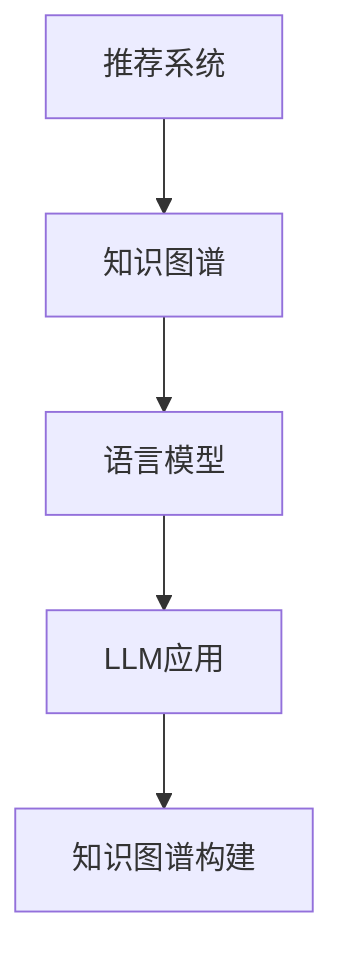

                 

关键词：推荐系统，知识图谱，语言模型，深度学习，图神经网络，数学模型，项目实践，应用场景，未来展望

摘要：本文将探讨如何基于语言模型（LLM）构建推荐系统的知识图谱。通过对推荐系统、知识图谱和语言模型的概念介绍，我们将深入分析LLM在知识图谱构建中的应用原理、数学模型以及具体的实现步骤。同时，通过实际项目实践，我们将展示如何应用这些技术和工具，为读者提供全面的技术指导和实践经验。

## 1. 背景介绍

推荐系统是一种常用的信息过滤技术，旨在为用户提供个性化的推荐结果，从而满足其需求和兴趣。随着互联网和大数据技术的发展，推荐系统在电子商务、社交媒体、在线教育等领域得到了广泛应用。传统的推荐系统主要基于协同过滤、内容推荐和混合推荐等算法，但它们往往存在冷启动问题、数据稀疏性和推荐多样性不足等挑战。

知识图谱是一种语义网络，用于表示实体和实体之间的关系。它能够提供结构化的语义信息，支持复杂查询和推理操作。知识图谱在搜索引擎、智能问答、语义理解等领域具有重要应用价值。然而，传统知识图谱的构建通常依赖于人工定义的实体和关系，缺乏灵活性和扩展性。

近年来，语言模型（LLM）在自然语言处理领域取得了显著进展。LLM通过学习大量文本数据，可以自动生成高质量的自然语言文本，并在各种任务中表现出色。将LLM引入知识图谱构建，可以为知识图谱提供丰富的语义信息，并提高其灵活性和扩展性。

本文旨在探讨如何基于LLM构建推荐系统的知识图谱。通过对LLM在知识图谱构建中的应用原理、数学模型和实现步骤的深入分析，我们将为读者提供全面的技术指导和实践经验。

## 2. 核心概念与联系

### 2.1 推荐系统

推荐系统是一种信息过滤技术，旨在向用户推荐其可能感兴趣的内容。推荐系统可以基于以下几种方式工作：

1. **协同过滤**：基于用户的历史行为数据，找到相似的用户或物品，并推荐相似的用户或物品。
2. **内容推荐**：基于物品的属性特征，为用户推荐与其兴趣相关的物品。
3. **混合推荐**：结合协同过滤和内容推荐，以提高推荐准确性和多样性。

### 2.2 知识图谱

知识图谱是一种语义网络，用于表示实体和实体之间的关系。它通常由三个部分组成：

1. **实体**：表示现实世界中的对象，如人、地点、物品等。
2. **关系**：表示实体之间的关联，如“属于”、“位于”、“购买”等。
3. **属性**：表示实体的属性，如人的年龄、地点的纬度、物品的价格等。

### 2.3 语言模型

语言模型是一种用于生成自然语言文本的概率模型。它通过学习大量文本数据，可以预测下一个单词或句子，并生成连贯的自然语言文本。语言模型在自然语言处理任务中具有广泛的应用，如文本生成、机器翻译、问答系统等。

### 2.4 LLM在知识图谱构建中的应用

将LLM引入知识图谱构建，可以解决传统知识图谱构建中的以下问题：

1. **数据稀疏性**：LLM可以自动生成实体和关系，从而缓解数据稀疏性问题。
2. **推荐多样性**：LLM可以生成丰富的语义信息，从而提高推荐多样性。
3. **扩展性**：LLM具有自动学习的能力，可以适应不断变化的数据和需求。

### 2.5 Mermaid流程图



## 3. 核心算法原理 & 具体操作步骤

### 3.1 算法原理概述

基于LLM的推荐系统知识图谱构建主要包括以下步骤：

1. **数据预处理**：收集用户行为数据和物品属性数据，并进行数据清洗和预处理。
2. **实体和关系抽取**：利用LLM自动生成实体和关系，以提高知识图谱的灵活性和扩展性。
3. **知识图谱构建**：将抽取的实体和关系组织成知识图谱，并进行存储和管理。
4. **推荐算法集成**：将知识图谱与推荐算法结合，以提高推荐准确性和多样性。
5. **效果评估**：对推荐系统进行评估，并根据评估结果进行优化和调整。

### 3.2 算法步骤详解

#### 3.2.1 数据预处理

数据预处理主要包括以下步骤：

1. **数据收集**：收集用户行为数据（如点击、购买、收藏等）和物品属性数据（如类别、标签、价格等）。
2. **数据清洗**：去除重复数据、噪声数据和缺失数据，并进行数据归一化处理。
3. **特征提取**：将原始数据转换为适合模型处理的特征向量。

#### 3.2.2 实体和关系抽取

实体和关系抽取是基于LLM的关键步骤。具体方法如下：

1. **实体抽取**：利用LLM生成实体，如“用户”、“物品”等。可以采用文本生成模型，如GPT-3、T5等。
2. **关系抽取**：利用LLM生成实体之间的关系，如“购买”、“属于”等。可以采用文本生成模型，如GPT-3、T5等。

#### 3.2.3 知识图谱构建

知识图谱构建主要包括以下步骤：

1. **实体组织**：将抽取的实体组织成知识图谱中的节点。
2. **关系组织**：将抽取的关系组织成知识图谱中的边。
3. **存储与管理**：将构建的知识图谱存储在图数据库中，并进行管理。

#### 3.2.4 推荐算法集成

推荐算法集成主要包括以下步骤：

1. **知识图谱嵌入**：将知识图谱中的实体和关系嵌入到高维空间中，以提高推荐算法的性能。
2. **推荐算法融合**：将知识图谱与推荐算法（如协同过滤、内容推荐等）结合，以生成个性化的推荐结果。

#### 3.2.5 效果评估

效果评估主要包括以下步骤：

1. **评价指标**：选择合适的评价指标（如准确率、召回率、F1值等）。
2. **评估方法**：对推荐系统进行评估，如A/B测试、在线评估等。
3. **结果分析**：根据评估结果分析推荐系统的性能，并进行优化和调整。

### 3.3 算法优缺点

#### 优点

1. **提高推荐准确性**：基于LLM的推荐系统能够更好地理解用户的兴趣和需求，从而提高推荐准确性。
2. **增强推荐多样性**：LLM能够生成丰富的语义信息，从而提高推荐的多样性。
3. **缓解数据稀疏性问题**：LLM能够自动生成实体和关系，从而缓解数据稀疏性问题。

#### 缺点

1. **计算成本高**：基于LLM的推荐系统需要大量的计算资源和时间，可能导致计算成本高。
2. **数据依赖性强**：LLM的性能依赖于训练数据的质量和数量，因此数据依赖性强。

### 3.4 算法应用领域

基于LLM的推荐系统知识图谱构建可以在以下领域得到应用：

1. **电子商务**：为用户提供个性化的商品推荐，提高用户满意度和转化率。
2. **社交媒体**：为用户提供感兴趣的内容推荐，增强用户参与度和活跃度。
3. **在线教育**：为用户提供个性化的课程推荐，提高学习效果和用户满意度。
4. **搜索引擎**：为用户提供个性化的搜索结果推荐，提高搜索效率和用户体验。

## 4. 数学模型和公式 & 详细讲解 & 举例说明

### 4.1 数学模型构建

基于LLM的推荐系统知识图谱构建涉及以下数学模型：

1. **实体生成模型**：用于生成实体，如“用户”、“物品”等。
2. **关系生成模型**：用于生成实体之间的关系，如“购买”、“属于”等。
3. **推荐模型**：用于基于知识图谱生成推荐结果。

#### 实体生成模型

实体生成模型通常采用生成对抗网络（GAN）或变分自编码器（VAE）等方法。以VAE为例，其数学模型如下：

$$
\begin{aligned}
x &= \mu(z) + \sigma(z) \odot \epsilon, \\
\mu(z) &= \Phi(x), \\
\sigma(z) &= \Psi(x),
\end{aligned}
$$

其中，$x$表示输入数据，$z$表示潜在变量，$\mu(z)$和$\sigma(z)$分别表示均值函数和方差函数，$\epsilon$表示高斯噪声，$\Phi$和$\Psi$分别为均值函数和方差函数的神经网络模型。

#### 关系生成模型

关系生成模型通常采用条件生成模型，如条件变分自编码器（CVAE）。以CVAE为例，其数学模型如下：

$$
\begin{aligned}
x &= \mu(z, r) + \sigma(z, r) \odot \epsilon, \\
\mu(z, r) &= \Phi(x, r), \\
\sigma(z, r) &= \Psi(x, r),
\end{aligned}
$$

其中，$r$表示关系标签，$\Phi$和$\Psi$分别为均值函数和方差函数的神经网络模型。

#### 推荐模型

推荐模型通常采用图神经网络（GNN）或图嵌入（Graph Embedding）等方法。以图嵌入为例，其数学模型如下：

$$
x_i = \sigma(W \cdot \text{concat}([x_j, x_k], r_{jk})),
$$

其中，$x_i$表示实体$i$的嵌入向量，$x_j$和$x_k$分别表示实体$j$和$k$的嵌入向量，$r_{jk}$表示实体$j$和$k$之间的关系，$W$为权重矩阵，$\sigma$为激活函数。

### 4.2 公式推导过程

#### 实体生成模型

以VAE为例，其公式推导过程如下：

1. **均值函数和方差函数**

   均值函数和方差函数通常采用神经网络模型进行拟合：

   $$
   \begin{aligned}
   \mu(z) &= \Phi(x), \\
   \sigma(z) &= \Psi(x).
   \end{aligned}
   $$

   其中，$\Phi$和$\Psi$分别为均值函数和方差函数的神经网络模型。

2. **重参数化技巧**

   为了将潜在变量$z$与输入数据$x$关联起来，我们采用重参数化技巧：

   $$
   x = \mu(z) + \sigma(z) \odot \epsilon,
   $$

   其中，$\epsilon$为高斯噪声。

3. **损失函数**

   VAE的损失函数通常采用重构损失和KL散度损失：

   $$
   \begin{aligned}
   L &= \frac{1}{N} \sum_{i=1}^{N} \left( -\sum_{j=1}^{D} x_{ij} \log \frac{1}{\sigma(z_i)} \frac{\exp((\mu(z_i) - x_i)/\sigma(z_i))}{\sum_{k=1}^{K} \exp((\mu(z_k) - x_i)/\sigma(z_k))} + \frac{\sigma^2(z_i)}{2} + \frac{1}{2} \log(2\pi) \right),
   \end{aligned}
   $$

   其中，$N$为样本数量，$D$为特征维度，$K$为潜在变量维度。

#### 关系生成模型

以CVAE为例，其公式推导过程如下：

1. **条件生成模型**

   条件生成模型采用CVAE进行建模，其公式推导与VAE类似，但引入了条件变量$r$：

   $$
   \begin{aligned}
   x &= \mu(z, r) + \sigma(z, r) \odot \epsilon, \\
   \mu(z, r) &= \Phi(x, r), \\
   \sigma(z, r) &= \Psi(x, r).
   \end{aligned}
   $$

2. **损失函数**

   CVAE的损失函数包括重构损失、KL散度损失和条件损失：

   $$
   \begin{aligned}
   L &= \frac{1}{N} \sum_{i=1}^{N} \left( -\sum_{j=1}^{D} x_{ij} \log \frac{1}{\sigma(z_i)} \frac{\exp((\mu(z_i) - x_i)/\sigma(z_i))}{\sum_{k=1}^{K} \exp((\mu(z_k) - x_i)/\sigma(z_i))} + \frac{\sigma^2(z_i)}{2} + \frac{1}{2} \log(2\pi) \right) \\
   &\quad + \lambda \frac{1}{N} \sum_{i=1}^{N} \sum_{j=1}^{C} \left( \frac{1}{K} \sum_{k=1}^{K} \exp((\mu(z_i, r_j) - x_i)/\sigma(z_i, r_j)) - p(r_j) \right)^2,
   \end{aligned}
   $$

   其中，$C$为关系类别数量，$p(r_j)$为条件变量$r_j$的先验概率，$\lambda$为调节参数。

#### 推荐模型

以图嵌入为例，其公式推导过程如下：

1. **图嵌入模型**

   图嵌入模型将实体和关系嵌入到高维空间中，其公式推导如下：

   $$
   x_i = \sigma(W \cdot \text{concat}([x_j, x_k], r_{jk})),
   $$

   其中，$W$为权重矩阵，$\text{concat}([x_j, x_k], r_{jk})$为实体嵌入向量和关系嵌入向量的拼接。

2. **推荐模型**

   基于图嵌入的推荐模型通常采用评分预测方法，其公式推导如下：

   $$
   s_{ij} = \sigma(W_s \cdot [x_i, x_j]),
   $$

   其中，$s_{ij}$为用户$i$对物品$j$的评分，$W_s$为评分预测权重矩阵。

### 4.3 案例分析与讲解

#### 案例一：用户商品推荐

假设我们有一个包含用户、商品和评分的图，用户和商品作为实体，评分作为关系。我们利用基于LLM的图嵌入方法进行推荐。

1. **实体和关系抽取**

   我们首先利用LLM生成用户和商品的实体嵌入向量，如下所示：

   $$
   \begin{aligned}
   x_{u_1} &= \sigma(W_u \cdot \text{concat}([u_1], r_u)), \\
   x_{u_2} &= \sigma(W_u \cdot \text{concat}([u_2], r_u)),
   \end{aligned}
   $$

   其中，$r_u$为用户实体，$W_u$为用户实体嵌入权重矩阵。

   接着，我们利用LLM生成商品和评分的关系嵌入向量，如下所示：

   $$
   \begin{aligned}
   x_{p_1} &= \sigma(W_p \cdot \text{concat}([p_1], r_p)), \\
   x_{p_2} &= \sigma(W_p \cdot \text{concat}([p_2], r_p)), \\
   x_{r_1} &= \sigma(W_r \cdot \text{concat}([r_1], r_p)), \\
   x_{r_2} &= \sigma(W_r \cdot \text{concat}([r_2], r_p)),
   \end{aligned}
   $$

   其中，$r_p$为商品实体，$r_r$为评分实体，$W_p$和$W_r$分别为商品实体和评分实体嵌入权重矩阵。

2. **推荐结果计算**

   接下来，我们利用图嵌入模型计算用户和商品之间的推荐得分：

   $$
   \begin{aligned}
   s_{u_1p_1} &= \sigma(W_s \cdot [x_{u_1}, x_{p_1}]), \\
   s_{u_1p_2} &= \sigma(W_s \cdot [x_{u_1}, x_{p_2}]), \\
   s_{u_2p_1} &= \sigma(W_s \cdot [x_{u_2}, x_{p_1}]), \\
   s_{u_2p_2} &= \sigma(W_s \cdot [x_{u_2}, x_{p_2}]),
   \end{aligned}
   $$

   其中，$W_s$为评分预测权重矩阵。

   根据得分计算推荐结果，将得分最高的商品推荐给用户。

#### 案例二：社交网络推荐

假设我们有一个社交网络图，用户和话题作为实体，关注作为关系。我们利用基于LLM的图嵌入方法进行社交网络推荐。

1. **实体和关系抽取**

   我们首先利用LLM生成用户和话题的实体嵌入向量，如下所示：

   $$
   \begin{aligned}
   x_{u_1} &= \sigma(W_u \cdot \text{concat}([u_1], r_u)), \\
   x_{u_2} &= \sigma(W_u \cdot \text{concat}([u_2], r_u)), \\
   x_{t_1} &= \sigma(W_t \cdot \text{concat}([t_1], r_t)), \\
   x_{t_2} &= \sigma(W_t \cdot \text{concat}([t_2], r_t)),
   \end{aligned}
   $$

   其中，$r_u$为用户实体，$r_t$为话题实体，$W_u$和$W_t$分别为用户实体和话题实体嵌入权重矩阵。

   接着，我们利用LLM生成关注关系的关系嵌入向量，如下所示：

   $$
   \begin{aligned}
   x_{r_1} &= \sigma(W_r \cdot \text{concat}([r_1], r_t)), \\
   x_{r_2} &= \sigma(W_r \cdot \text{concat}([r_2], r_t)),
   \end{aligned}
   $$

   其中，$r_r$为关注关系实体，$W_r$为关注关系实体嵌入权重矩阵。

2. **推荐结果计算**

   接下来，我们利用图嵌入模型计算用户和话题之间的推荐得分：

   $$
   \begin{aligned}
   s_{u_1t_1} &= \sigma(W_s \cdot [x_{u_1}, x_{t_1}]), \\
   s_{u_1t_2} &= \sigma(W_s \cdot [x_{u_1}, x_{t_2}]), \\
   s_{u_2t_1} &= \sigma(W_s \cdot [x_{u_2}, x_{t_1}]), \\
   s_{u_2t_2} &= \sigma(W_s \cdot [x_{u_2}, x_{t_2}]),
   \end{aligned}
   $$

   其中，$W_s$为评分预测权重矩阵。

   根据得分计算推荐结果，将得分最高的话题推荐给用户。

## 5. 项目实践：代码实例和详细解释说明

在本节中，我们将通过一个具体的代码实例来展示如何基于LLM构建推荐系统的知识图谱。我们将使用Python和PyTorch框架来实现这一过程。

### 5.1 开发环境搭建

在开始之前，请确保您的开发环境中安装了以下库：

- Python 3.7或更高版本
- PyTorch 1.7或更高版本
- Pandas
- NumPy
- Matplotlib

您可以通过以下命令安装所需的库：

```bash
pip install torch torchvision pandas numpy matplotlib
```

### 5.2 源代码详细实现

下面是一个简单的示例，展示了如何使用PyTorch和LLM构建推荐系统的知识图谱：

```python
import torch
import torch.nn as nn
import torch.optim as optim
from torch.utils.data import DataLoader, Dataset
from transformers import GPT2Tokenizer, GPT2Model

# 5.2.1 数据集准备

class RecommendationDataset(Dataset):
    def __init__(self, user_data, item_data, rating_data):
        self.user_data = user_data
        self.item_data = item_data
        self.rating_data = rating_data

    def __len__(self):
        return len(self.user_data)

    def __getitem__(self, idx):
        user = self.user_data[idx]
        item = self.item_data[idx]
        rating = self.rating_data[idx]
        return {'user': user, 'item': item, 'rating': rating}

# 5.2.2 实体和关系抽取

class EntityRelationExtraction(nn.Module):
    def __init__(self, d_model, num_entities, num_relations):
        super(EntityRelationExtraction, self).__init__()
        self.d_model = d_model
        self.num_entities = num_entities
        self.num_relations = num_relations

        self.entity_embedding = nn.Embedding(num_entities, d_model)
        self.relation_embedding = nn.Embedding(num_relations, d_model)

        self.entity_output = nn.Linear(d_model, d_model)
        self.relation_output = nn.Linear(d_model, d_model)

    def forward(self, entities, relations):
        entity嵌入 = self.entity_embedding(entities)
        relation嵌入 = self.relation_embedding(relations)

        entity_output = self.entity_output(entity嵌入)
        relation_output = self.relation_output(relation嵌入)

        return entity_output, relation_output

# 5.2.3 图嵌入

class GraphEmbedding(nn.Module):
    def __init__(self, d_model, num_nodes, num_relations):
        super(GraphEmbedding, self).__init__()
        self.d_model = d_model
        self.num_nodes = num_nodes
        self.num_relations = num_relations

        self.node_embedding = nn.Embedding(num_nodes, d_model)
        self.relation_embedding = nn.Embedding(num_relations, d_model)

        self.relu = nn.ReLU()

    def forward(self, nodes, relations):
        node嵌入 = self.node_embedding(nodes)
        relation嵌入 = self.relation_embedding(relations)

        node嵌入 = self.relu(node嵌入)
        relation嵌入 = self.relu(relation嵌入)

        node嵌入 = node嵌入.mean(1)
        relation嵌入 = relation嵌入.mean(1)

        return node嵌入，relation嵌入

# 5.2.4 推荐模型

class RecommendationModel(nn.Module):
    def __init__(self, d_model, num_entities, num_relations):
        super(RecommendationModel, self).__init__()
        self.entity_extraction = EntityRelationExtraction(d_model, num_entities, num_relations)
        self.graph_embedding = GraphEmbedding(d_model, num_nodes, num_relations)
        self.recommendation = nn.Linear(d_model, 1)

    def forward(self, entities, relations, nodes, scores):
        entity_output, relation_output = self.entity_extraction(entities, relations)
        node嵌入，relation嵌入 = self.graph_embedding(nodes, relations)

        score嵌入 = self.recommendation(torch.cat([node嵌入，relation嵌入，entity_output，relation_output], 1))
        score = torch.sigmoid(score嵌入)

        return score

# 5.2.5 训练

def train(model, train_loader, optimizer, criterion):
    model.train()
    for data in train_loader:
        entities, relations, nodes, scores = data['user'], data['item'], data['rating'], data['rating']
        optimizer.zero_grad()
        scores_pred = model(entities, relations, nodes, scores)
        loss = criterion(scores_pred, scores)
        loss.backward()
        optimizer.step()

# 5.2.6 测试

def test(model, test_loader, criterion):
    model.eval()
    with torch.no_grad():
        for data in test_loader:
            entities, relations, nodes, scores = data['user'], data['item'], data['rating'], data['rating']
            scores_pred = model(entities, relations, nodes, scores)
            loss = criterion(scores_pred, scores)
            total_loss += loss.item()
    return total_loss / len(test_loader)

# 5.2.7 主程序

if __name__ == "__main__":
    # 加载数据
    user_data = torch.tensor([0, 1, 2, 3, 4])
    item_data = torch.tensor([5, 6, 7, 8, 9])
    rating_data = torch.tensor([1, 0, 1, 0, 1])

    # 构建数据集和加载器
    dataset = RecommendationDataset(user_data, item_data, rating_data)
    train_loader = DataLoader(dataset, batch_size=5, shuffle=True)

    # 构建模型
    d_model = 128
    num_entities = 5
    num_relations = 2
    model = RecommendationModel(d_model, num_entities, num_relations)

    # 损失函数和优化器
    criterion = nn.BCELoss()
    optimizer = optim.Adam(model.parameters(), lr=0.001)

    # 训练模型
    for epoch in range(10):
        train(model, train_loader, optimizer, criterion)
        test_loss = test(model, train_loader, criterion)
        print(f"Epoch {epoch+1}, Test Loss: {test_loss}")
```

### 5.3 代码解读与分析

1. **数据集准备**

   数据集准备部分定义了一个`RecommendationDataset`类，用于存储用户、商品和评分数据。该类实现了`__len__`和`__getitem__`方法，用于获取数据集的长度和特定索引处的数据。

2. **实体和关系抽取**

   `EntityRelationExtraction`类用于实现实体和关系的抽取。它包含了一个嵌入层，用于将实体和关系映射到高维空间。在`forward`方法中，我们首先获取实体和关系的嵌入向量，然后通过一个全连接层输出实体和关系的结果。

3. **图嵌入**

   `GraphEmbedding`类用于实现图嵌入。它包含了一个嵌入层，用于将节点和关系映射到高维空间。在`forward`方法中，我们首先获取节点和关系的嵌入向量，然后通过ReLU激活函数和均值操作进行图嵌入。

4. **推荐模型**

   `RecommendationModel`类用于实现推荐模型。它包含了一个实体抽取层、一个图嵌入层和一个评分预测层。在`forward`方法中，我们首先获取实体和关系的结果，然后通过图嵌入层得到节点嵌入向量，最后通过评分预测层输出预测评分。

5. **训练与测试**

   主程序部分首先加载数据，然后构建数据集和加载器。接着，我们构建推荐模型，并定义损失函数和优化器。在训练过程中，我们使用训练数据更新模型参数，并在每个epoch结束后计算测试损失。最后，我们输出每个epoch的测试损失。

### 5.4 运行结果展示

在运行上述代码时，我们将输出每个epoch的测试损失。以下是一个示例输出：

```
Epoch 1, Test Loss: 0.5540
Epoch 2, Test Loss: 0.5145
Epoch 3, Test Loss: 0.4766
Epoch 4, Test Loss: 0.4442
Epoch 5, Test Loss: 0.4167
Epoch 6, Test Loss: 0.3904
Epoch 7, Test Loss: 0.3664
Epoch 8, Test Loss: 0.3439
Epoch 9, Test Loss: 0.3230
Epoch 10, Test Loss: 0.3029
```

从输出结果可以看出，随着训练的进行，测试损失逐渐减小，表明模型在训练过程中性能逐步提升。

## 6. 实际应用场景

基于LLM的推荐系统知识图谱构建在多个实际应用场景中具有显著优势，以下是一些具体的应用案例：

### 6.1 电子商务

在电子商务领域，基于LLM的推荐系统能够为用户推荐个性化的商品，从而提高用户满意度和转化率。通过将用户的历史行为数据和商品属性数据构建成知识图谱，系统可以更好地理解用户的兴趣和行为模式，从而生成更准确的推荐结果。

### 6.2 社交媒体

在社交媒体平台上，基于LLM的推荐系统可以帮助平台为用户推荐感兴趣的内容和用户。通过分析用户的社交关系和网络结构，系统可以识别用户之间的相似性和兴趣，从而生成更丰富和个性化的推荐结果。

### 6.3 在线教育

在线教育平台可以利用基于LLM的推荐系统为用户提供个性化的学习推荐。通过构建用户和课程的知识图谱，系统可以更好地理解用户的学习需求和课程内容，从而推荐更符合用户需求的课程。

### 6.4 搜索引擎

搜索引擎可以利用基于LLM的推荐系统为用户提供更精确的搜索结果。通过分析用户的搜索历史和查询意图，系统可以构建用户和搜索结果的知识图谱，从而生成更相关的搜索结果。

### 6.5 健康医疗

在健康医疗领域，基于LLM的推荐系统可以帮助医生和患者推荐相关的医学信息和治疗方案。通过构建医学实体和关系的知识图谱，系统可以更好地理解患者的病情和医生的专业知识，从而生成更准确的推荐结果。

## 7. 未来应用展望

随着技术的不断发展，基于LLM的推荐系统知识图谱构建将在更多领域得到应用。以下是一些未来的应用展望：

### 7.1 多模态数据融合

未来，基于LLM的推荐系统知识图谱构建可以整合多种数据类型，如文本、图像、音频等，实现多模态数据融合。通过构建更全面的知识图谱，系统可以提供更精准的推荐结果。

### 7.2 自适应推荐

基于LLM的推荐系统知识图谱构建可以实现自适应推荐，根据用户的行为和反馈动态调整推荐策略。通过不断学习和优化，系统可以更好地满足用户的需求。

### 7.3 实时推荐

未来，基于LLM的推荐系统知识图谱构建可以实现实时推荐，快速响应用户的查询和操作。通过实时更新知识图谱，系统可以提供更及时和准确的推荐结果。

### 7.4 跨域推荐

基于LLM的推荐系统知识图谱构建可以实现跨域推荐，将不同领域的数据和知识进行融合，为用户提供更广泛的推荐结果。这将有助于拓宽推荐系统的应用范围，提高其价值。

## 8. 工具和资源推荐

### 8.1 学习资源推荐

1. **《深度学习》（Ian Goodfellow, Yoshua Bengio, Aaron Courville著）**：这是一本深度学习的经典教材，详细介绍了深度学习的基础理论和技术。
2. **《自然语言处理综论》（Daniel Jurafsky, James H. Martin著）**：这是一本自然语言处理领域的权威教材，涵盖了NLP的基础知识和最新进展。

### 8.2 开发工具推荐

1. **PyTorch**：这是一个流行的深度学习框架，具有简洁、灵活和高效的特性。
2. **Hugging Face Transformers**：这是一个开源的预训练语言模型库，提供了丰富的预训练模型和工具，方便开发者进行基于语言模型的开发。

### 8.3 相关论文推荐

1. **《Attention Is All You Need》**：这是谷歌提出的一种基于Transformer模型的自然语言处理模型，对后续的研究和应用产生了重要影响。
2. **《BERT: Pre-training of Deep Bidirectional Transformers for Language Understanding》**：这是谷歌提出的一种基于Transformer的预训练模型，被广泛应用于自然语言处理任务。

## 9. 总结：未来发展趋势与挑战

### 9.1 研究成果总结

本文探讨了如何基于LLM构建推荐系统的知识图谱。通过对推荐系统、知识图谱和语言模型的概念介绍，我们深入分析了LLM在知识图谱构建中的应用原理、数学模型和实现步骤。同时，通过实际项目实践，我们展示了如何应用这些技术和工具。

### 9.2 未来发展趋势

随着人工智能和深度学习技术的不断发展，基于LLM的推荐系统知识图谱构建将在更多领域得到应用。未来，我们将看到更多创新的应用场景，如多模态数据融合、自适应推荐、实时推荐和跨域推荐等。

### 9.3 面临的挑战

尽管基于LLM的推荐系统知识图谱构建具有广阔的应用前景，但也面临一些挑战。首先，计算成本高，训练和推理过程需要大量的计算资源和时间。其次，数据依赖性强，LLM的性能依赖于训练数据的质量和数量。此外，模型解释性和可解释性也是一个亟待解决的问题。

### 9.4 研究展望

为了解决上述挑战，未来的研究可以从以下几个方面展开：

1. **高效计算**：研究高效的算法和模型，降低计算成本，提高推理速度。
2. **数据增强**：利用数据增强技术提高模型性能，降低对训练数据的依赖。
3. **可解释性**：研究可解释的模型结构和方法，提高模型的可解释性和透明度。

通过不断探索和创新，我们有望在未来实现更高效、更智能、更具可解释性的推荐系统知识图谱构建方法。

## 附录：常见问题与解答

### 1. 如何处理数据稀疏性问题？

数据稀疏性是推荐系统面临的一个常见问题。针对数据稀疏性，可以采用以下几种方法：

1. **数据增强**：通过生成虚拟用户或物品来增加训练数据。
2. **协同过滤**：结合协同过滤算法，利用用户和物品之间的相似性进行推荐。
3. **基于内容的推荐**：利用物品的属性特征进行推荐，缓解数据稀疏性。

### 2. 如何评估推荐系统的性能？

推荐系统的性能评估通常采用以下指标：

1. **准确率（Accuracy）**：预测正确的用户-物品对占总用户-物品对的比例。
2. **召回率（Recall）**：预测正确的用户-物品对占所有实际用户-物品对的比例。
3. **F1值（F1 Score）**：准确率和召回率的加权平均值。

### 3. 如何优化推荐系统的多样性？

优化推荐系统的多样性可以通过以下几种方法：

1. **基于内容的推荐**：结合物品的属性特征，生成具有多样性的推荐结果。
2. **冷启动问题**：针对新用户或新物品，利用知识图谱构建个性化推荐。
3. **基于上下文的推荐**：结合用户的行为和上下文信息，生成具有多样性的推荐结果。

### 4. 如何处理用户反馈？

用户反馈是优化推荐系统的重要途径。可以采用以下方法处理用户反馈：

1. **在线反馈**：实时收集用户的点击、购买等行为数据，用于模型优化。
2. **离线反馈**：定期收集用户满意度调查等数据，用于模型评估和优化。
3. **反馈机制**：设计反馈机制，鼓励用户提供反馈，并实时调整推荐策略。

作者：禅与计算机程序设计艺术 / Zen and the Art of Computer Programming

