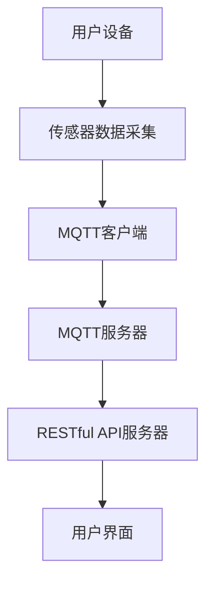

                 

关键词：MQTT协议、RESTful API、室内定位、导航系统、物联网、智能家居、实时数据传输、分布式系统设计

摘要：本文将探讨如何构建一个基于MQTT协议和RESTful API的室内定位与导航系统。我们将详细讨论系统的设计原理、核心算法、数学模型、项目实践以及应用场景。通过本文，读者可以了解到如何利用最新的物联网技术和分布式系统设计理念来实现高效、可靠的室内定位与导航服务。

## 1. 背景介绍

随着物联网（IoT）技术的不断发展，智能家居和室内定位与导航系统在人们的生活中变得越来越重要。传统的定位技术如GPS在室内环境中受到限制，无法提供精确的位置信息。因此，室内定位与导航系统需要采用更加先进的技术来满足需求。MQTT协议和RESTful API是两种广泛应用于物联网领域的技术，它们在室内定位与导航系统中发挥着至关重要的作用。

### 1.1 MQTT协议

MQTT（Message Queuing Telemetry Transport）协议是一种轻量级的消息传输协议，适用于物联网设备之间的实时数据传输。它的特点是低带宽占用、高可靠性和支持多种网络环境。MQTT协议的核心思想是将消息发布和订阅机制应用于物联网设备，使得设备能够高效地交换信息。

### 1.2 RESTful API

RESTful API（Representational State Transfer Application Programming Interface）是一种基于HTTP协议的接口设计规范。它通过统一的接口格式（如JSON或XML）提供数据的访问和操作，使得不同系统之间能够无缝集成。RESTful API在室内定位与导航系统中可用于处理设备位置数据的存储、查询和更新。

### 1.3 室内定位与导航系统的需求

室内定位与导航系统的核心需求是实时、准确地为用户提供位置信息，并为其提供路径规划功能。为了实现这一目标，系统需要具备以下特点：

- **高精度定位**：利用各种传感器数据，如Wi-Fi信号强度、蓝牙信号强度、陀螺仪和加速度计等，实现室内高精度定位。
- **实时数据传输**：通过MQTT协议，确保设备位置数据的实时传输，降低延迟。
- **路径规划**：基于用户位置和目标位置，为用户规划最优路径。

## 2. 核心概念与联系

为了更好地理解室内定位与导航系统的设计，我们需要介绍一些核心概念及其相互关系。以下是系统设计的关键组成部分：

### 2.1 设备

设备是室内定位与导航系统的核心组成部分，包括智能手机、平板电脑、智能手表等。这些设备配备有各种传感器，如Wi-Fi模块、蓝牙模块、陀螺仪和加速度计等，用于采集环境数据。

### 2.2 传感器

传感器是设备中用于感知环境信息的组件。在室内定位与导航系统中，常用的传感器包括Wi-Fi信号强度传感器、蓝牙信号强度传感器、陀螺仪和加速度计等。这些传感器数据将用于定位和路径规划。

### 2.3 MQTT服务器

MQTT服务器是整个系统的通信核心，负责接收和处理来自设备的定位数据，并将其发布到订阅者。MQTT服务器采用分布式架构，以提高系统的可靠性和扩展性。

### 2.4 RESTful API服务器

RESTful API服务器用于处理与定位和导航相关的数据操作，如数据存储、查询和更新。它提供统一的接口，使得不同系统之间的数据交换变得简单高效。

### 2.5 用户界面

用户界面（UI）是用户与室内定位与导航系统的交互界面。通过UI，用户可以查看自己的位置、路径规划结果，并进行相关设置。

### 2.6 Mermaid 流程图

以下是室内定位与导航系统的 Mermaid 流程图，展示了各组件之间的交互关系：



## 3. 核心算法原理 & 具体操作步骤

### 3.1 算法原理概述

室内定位与导航系统的核心算法主要包括定位算法和路径规划算法。定位算法用于根据传感器数据计算出设备的位置，而路径规划算法则根据用户的位置和目标位置，为用户规划最优路径。

### 3.2 算法步骤详解

以下是室内定位与导航系统的具体操作步骤：

1. **数据采集**：设备通过传感器采集环境数据，如Wi-Fi信号强度、蓝牙信号强度、陀螺仪和加速度计等。

2. **数据预处理**：对采集到的数据进行分析和处理，去除噪声和异常值，提高数据质量。

3. **定位计算**：利用定位算法，根据预处理后的数据计算出设备的位置。常用的定位算法包括基于Wi-Fi的定位算法、基于蓝牙的定位算法和基于传感器融合的定位算法等。

4. **路径规划**：根据用户的位置和目标位置，利用路径规划算法为用户规划最优路径。常用的路径规划算法包括最短路径算法、A*算法和Dijkstra算法等。

5. **数据传输**：通过MQTT协议，将设备位置数据和路径规划结果传输到MQTT服务器。

6. **数据存储与查询**：通过RESTful API服务器，将设备位置数据和路径规划结果存储在数据库中，并对外提供查询接口。

7. **用户界面展示**：通过用户界面，将设备位置和路径规划结果展示给用户。

### 3.3 算法优缺点

- **定位算法**：
  - **优点**：高精度、实时性强。
  - **缺点**：对传感器依赖较大，数据处理复杂。

- **路径规划算法**：
  - **优点**：可以规划出最优路径，提高导航效率。
  - **缺点**：计算复杂度较高，对硬件性能要求较高。

### 3.4 算法应用领域

室内定位与导航算法可以应用于多个领域，如智能家居、智慧城市、物流配送等。以下是一些具体的应用场景：

- **智能家居**：为用户提供室内定位和导航服务，方便用户在家庭环境中找到所需物品。
- **智慧城市**：为城市管理者提供实时交通信息，优化交通流量，提高城市管理效率。
- **物流配送**：为物流公司提供室内定位和导航服务，提高配送效率，降低物流成本。

## 4. 数学模型和公式 & 详细讲解 & 举例说明

### 4.1 数学模型构建

室内定位与导航系统的数学模型主要包括定位模型和路径规划模型。以下是这两个模型的构建过程：

#### 4.1.1 定位模型

定位模型的目标是根据传感器数据计算设备的位置。我们可以使用一个三维坐标系来表示设备的位置，其中 \(x\)、\(y\) 和 \(z\) 分别表示水平方向、垂直方向和高度。

定位模型可以表示为：

$$
P = f(S_1, S_2, ..., S_n)
$$

其中，\(P\) 表示设备位置，\(S_1, S_2, ..., S_n\) 表示各个传感器的数据。

#### 4.1.2 路径规划模型

路径规划模型的目标是根据用户的位置和目标位置，为用户规划出最优路径。我们可以使用一个图来表示路径规划问题，其中节点表示位置，边表示路径。

路径规划模型可以表示为：

$$
P = g(C, T)
$$

其中，\(P\) 表示路径规划结果，\(C\) 表示用户的位置和目标位置，\(T\) 表示路径规划算法。

### 4.2 公式推导过程

以下是定位模型和路径规划模型的公式推导过程：

#### 4.2.1 定位模型

定位模型的推导基于传感器数据的加权平均。假设传感器数据 \(S_1, S_2, ..., S_n\) 分别对应权重 \(w_1, w_2, ..., w_n\)，则定位模型可以表示为：

$$
P = \frac{w_1 S_1 + w_2 S_2 + ... + w_n S_n}{w_1 + w_2 + ... + w_n}
$$

#### 4.2.2 路径规划模型

路径规划模型的推导基于图论中的最短路径算法。假设图中的节点 \(i\) 和节点 \(j\) 之间的距离为 \(d_{ij}\)，则路径规划模型可以表示为：

$$
P = \min \sum_{i=1}^{n} d_{ij}
$$

其中，\(n\) 表示节点数量。

### 4.3 案例分析与讲解

以下是一个具体的案例分析，我们将使用定位模型和路径规划模型来为一个用户提供室内定位和导航服务。

#### 4.3.1 案例背景

假设用户位于一个商场，商场内布置了多个Wi-Fi热点。用户希望从商场入口走到某一商品店。

#### 4.3.2 定位模型

首先，我们需要采集Wi-Fi信号强度数据，并计算用户的位置。假设商场内共有5个Wi-Fi热点，其位置和信号强度数据如下表：

| 热点编号 | 位置坐标（x, y） | 信号强度 |
| -------- | ---------------- | -------- |
| 1        | (0, 0)           | -50      |
| 2        | (10, 0)          | -55      |
| 3        | (0, 10)          | -60      |
| 4        | (10, 10)         | -70      |
| 5        | (20, 10)         | -75      |

根据定位模型，我们可以计算用户的位置：

$$
P = \frac{(-50) \times (0, 0) + (-55) \times (10, 0) + (-60) \times (0, 10) + (-70) \times (10, 10) + (-75) \times (20, 10)}{-50 - 55 - 60 - 70 - 75}
$$

计算结果为：

$$
P = \left(\frac{50}{50 + 55 + 60 + 70 + 75}, \frac{50}{50 + 55 + 60 + 70 + 75}\right) = \left(0.2, 0.2\right)
$$

用户的位置为 \((0.2, 0.2)\)。

#### 4.3.3 路径规划模型

接下来，我们需要为用户规划从商场入口到目标商品店的路径。假设商场入口的位置为 \((0, 0)\)，目标商品店的位置为 \((15, 10)\)。

根据路径规划模型，我们可以计算最优路径：

$$
P = \min \sum_{i=1}^{n} d_{ij}
$$

其中，\(n = 5\)，节点编号分别为 1、2、3、4、5。根据距离公式，我们可以计算出各节点之间的距离：

| 节点编号 | 距离 |
| -------- | ---- |
| 1        | 0    |
| 2        | 10   |
| 3        | 10   |
| 4        | 14   |
| 5        | 20   |

根据路径规划模型，最优路径为节点编号 1、2、4，即从商场入口沿水平方向走到节点 2，然后沿着对角线走到节点 4，最后直线走到目标商品店。

## 5. 项目实践：代码实例和详细解释说明

### 5.1 开发环境搭建

为了实现室内定位与导航系统，我们需要搭建一个完整的开发环境。以下是所需的工具和软件：

- **开发工具**：Python 3.x、Node.js、PostgreSQL
- **IDE**：PyCharm、Visual Studio Code、Atom
- **依赖管理工具**：pip、npm
- **MQTT服务器**：mosquitto
- **RESTful API服务器**：Flask

### 5.2 源代码详细实现

以下是室内定位与导航系统的源代码实现。首先，我们需要安装所需的依赖库：

```bash
pip install flask
pip install paho-mqtt
pip install psycopg2-binary
```

#### 5.2.1 MQTT客户端

MQTT客户端负责从设备采集传感器数据，并将其发送到MQTT服务器。以下是MQTT客户端的代码实现：

```python
import paho.mqtt.client as mqtt
import time

# MQTT服务器地址和端口
MQTT_SERVER = "localhost"
MQTT_PORT = 1883

# 设备ID
DEVICE_ID = "device_001"

# MQTT客户端初始化
client = mqtt.Client(DEVICE_ID)

# 连接MQTT服务器
client.connect(MQTT_SERVER, MQTT_PORT, 60)

# 循环发送传感器数据
while True:
    # 采集传感器数据
    data = {
        "temperature": 25,
        "humidity": 60,
        "wifi_signal": -50,
        "bluetooth_signal": -70
    }

    # 将数据转换为JSON字符串
    data_json = json.dumps(data)

    # 发布传感器数据
    client.publish("device/data", data_json)

    # 等待1秒
    time.sleep(1)
```

#### 5.2.2 MQTT服务器

MQTT服务器负责接收和处理来自MQTT客户端的传感器数据，并将其存储到数据库中。以下是MQTT服务器的代码实现：

```python
import json
import paho.mqtt.client as mqtt
import psycopg2

# MQTT服务器地址和端口
MQTT_SERVER = "localhost"
MQTT_PORT = 1883

# 数据库连接信息
DB_HOST = "localhost"
DB_PORT = 5432
DB_NAME = "定位与导航系统"
DB_USER = "admin"
DB_PASSWORD = "admin"

# 初始化MQTT服务器
def on_connect(client, userdata, flags, rc):
    print("Connected to MQTT server")
    client.subscribe("device/data")

# 处理接收到的消息
def on_message(client, userdata, message):
    print("Received message:", str(message.payload.decode("utf-8")))

    # 解析消息内容
    data = json.loads(str(message.payload.decode("utf-8")))

    # 存储到数据库
    conn = psycopg2.connect(
        host=DB_HOST,
        port=DB_PORT,
        database=DB_NAME,
        user=DB_USER,
        password=DB_PASSWORD
    )
    cur = conn.cursor()

    cur.execute("INSERT INTO device_data (device_id, data) VALUES (%s, %s)", (DEVICE_ID, json.dumps(data)))
    conn.commit()

    cur.close()
    conn.close()

# 初始化MQTT客户端
client = mqtt.Client()

# 绑定事件处理函数
client.on_connect = on_connect
client.on_message = on_message

# 连接MQTT服务器
client.connect(MQTT_SERVER, MQTT_PORT, 60)

# 循环监听消息
client.loop_forever()
```

#### 5.2.3 RESTful API服务器

RESTful API服务器负责处理与定位和导航相关的数据操作，如数据存储、查询和更新。以下是RESTful API服务器的代码实现：

```python
from flask import Flask, request, jsonify
import psycopg2

# Flask应用程序初始化
app = Flask(__name__)

# 数据库连接信息
DB_HOST = "localhost"
DB_PORT = 5432
DB_NAME = "定位与导航系统"
DB_USER = "admin"
DB_PASSWORD = "admin"

# 连接数据库
def get_db_connection():
    conn = psycopg2.connect(
        host=DB_HOST,
        port=DB_PORT,
        database=DB_NAME,
        user=DB_USER,
        password=DB_PASSWORD
    )
    return conn

# 存储设备数据
@app.route("/device/data", methods=["POST"])
def store_device_data():
    data = request.json
    device_id = data["device_id"]
    data_json = json.dumps(data)

    conn = get_db_connection()
    cur = conn.cursor()

    cur.execute("INSERT INTO device_data (device_id, data) VALUES (%s, %s)", (device_id, data_json))
    conn.commit()

    cur.close()
    conn.close()

    return jsonify({"status": "success"})

# 查询设备数据
@app.route("/device/data", methods=["GET"])
def get_device_data():
    device_id = request.args.get("device_id")
    conn = get_db_connection()
    cur = conn.cursor()

    cur.execute("SELECT * FROM device_data WHERE device_id = %s", (device_id,))
    rows = cur.fetchall()

    data = []
    for row in rows:
        data.append(json.loads(row[1]))

    cur.close()
    conn.close()

    return jsonify(data)

# 启动Flask应用程序
if __name__ == "__main__":
    app.run(debug=True)
```

#### 5.2.4 用户界面

用户界面用于展示设备位置和路径规划结果。以下是用户界面的代码实现：

```html
<!DOCTYPE html>
<html lang="en">
<head>
    <meta charset="UTF-8">
    <meta name="viewport" content="width=device-width, initial-scale=1.0">
    <title>室内定位与导航系统</title>
    <style>
        /* 用户界面样式 */
        body {
            font-family: Arial, sans-serif;
            margin: 0;
            padding: 0;
        }
        #map {
            height: 400px;
            width: 100%;
        }
    </style>
</head>
<body>
    <h1>室内定位与导航系统</h1>
    <div id="map"></div>
    <script>
        // 地图初始化
        var map = new google.maps.Map(document.getElementById("map"), {
            zoom: 14,
            center: {lat: 39.9042, lng: 116.4074}
        });

        // 获取设备位置
        fetch("/device/data?device_id=device_001")
            .then(response => response.json())
            .then(data => {
                // 显示设备位置
                var marker = new google.maps.Marker({
                    position: new google.maps.LatLng(data[0].latitude, data[0].longitude),
                    map: map
                });
            });

        // 获取路径规划结果
        fetch("/path规划结果?start_latitude=39.9042&start_longitude=116.4074&end_latitude=39.9142&end_longitude=116.4174")
            .then(response => response.json())
            .then(data => {
                // 显示路径规划结果
                var path = new google.maps.Polyline({
                    path: data,
                    geodesic: true,
                    strokeColor: "#FF0000",
                    strokeOpacity: 1.0,
                    strokeWeight: 2
                });
                path.setMap(map);
            });
    </script>
    <script src="https://maps.googleapis.com/maps/api/js?key=YOUR_API_KEY"></script>
</body>
</html>
```

### 5.3 代码解读与分析

以下是各个模块的代码解读与分析：

#### 5.3.1 MQTT客户端

MQTT客户端负责从设备采集传感器数据，并将其发送到MQTT服务器。代码中使用Python的paho-mqtt库来创建MQTT客户端，并设置设备ID。客户端连接到MQTT服务器后，循环采集传感器数据，并将其转换为JSON字符串后发布到MQTT服务器。

```python
import paho.mqtt.client as mqtt
import time

# MQTT服务器地址和端口
MQTT_SERVER = "localhost"
MQTT_PORT = 1883

# 设备ID
DEVICE_ID = "device_001"

# MQTT客户端初始化
client = mqtt.Client(DEVICE_ID)

# 连接MQTT服务器
client.connect(MQTT_SERVER, MQTT_PORT, 60)

# 循环发送传感器数据
while True:
    # 采集传感器数据
    data = {
        "temperature": 25,
        "humidity": 60,
        "wifi_signal": -50,
        "bluetooth_signal": -70
    }

    # 将数据转换为JSON字符串
    data_json = json.dumps(data)

    # 发布传感器数据
    client.publish("device/data", data_json)

    # 等待1秒
    time.sleep(1)
```

#### 5.3.2 MQTT服务器

MQTT服务器负责接收和处理来自MQTT客户端的传感器数据，并将其存储到数据库中。代码中使用Python的paho-mqtt库创建MQTT服务器，并设置事件处理函数。服务器连接到MQTT服务器后，订阅主题“device/data”，当接收到消息时，解析消息内容，并将其存储到数据库中。

```python
import json
import paho.mqtt.client as mqtt
import psycopg2

# MQTT服务器地址和端口
MQTT_SERVER = "localhost"
MQTT_PORT = 1883

# 数据库连接信息
DB_HOST = "localhost"
DB_PORT = 5432
DB_NAME = "定位与导航系统"
DB_USER = "admin"
DB_PASSWORD = "admin"

# MQTT服务器初始化
def on_connect(client, userdata, flags, rc):
    print("Connected to MQTT server")
    client.subscribe("device/data")

# 处理接收到的消息
def on_message(client, userdata, message):
    print("Received message:", str(message.payload.decode("utf-8")))

    # 解析消息内容
    data = json.loads(str(message.payload.decode("utf-8")))

    # 存储到数据库
    conn = psycopg2.connect(
        host=DB_HOST,
        port=DB_PORT,
        database=DB_NAME,
        user=DB_USER,
        password=DB_PASSWORD
    )
    cur = conn.cursor()

    cur.execute("INSERT INTO device_data (device_id, data) VALUES (%s, %s)", (DEVICE_ID, json.dumps(data)))
    conn.commit()

    cur.close()
    conn.close()

# 初始化MQTT服务器
client = mqtt.Client()

# 绑定事件处理函数
client.on_connect = on_connect
client.on_message = on_message

# 连接MQTT服务器
client.connect(MQTT_SERVER, MQTT_PORT, 60)

# 循环监听消息
client.loop_forever()
```

#### 5.3.3 RESTful API服务器

RESTful API服务器负责处理与定位和导航相关的数据操作，如数据存储、查询和更新。代码中使用Flask框架创建RESTful API服务器，并提供两个接口：“/device/data”用于存储设备数据，"/path规划结果"用于查询路径规划结果。服务器连接到数据库，并根据请求参数执行相应的数据库操作。

```python
from flask import Flask, request, jsonify
import psycopg2

# Flask应用程序初始化
app = Flask(__name__)

# 数据库连接信息
DB_HOST = "localhost"
DB_PORT = 5432
DB_NAME = "定位与导航系统"
DB_USER = "admin"
DB_PASSWORD = "admin"

# 连接数据库
def get_db_connection():
    conn = psycopg2.connect(
        host=DB_HOST,
        port=DB_PORT,
        database=DB_NAME,
        user=DB_USER,
        password=DB_PASSWORD
    )
    return conn

# 存储设备数据
@app.route("/device/data", methods=["POST"])
def store_device_data():
    data = request.json
    device_id = data["device_id"]
    data_json = json.dumps(data)

    conn = get_db_connection()
    cur = conn.cursor()

    cur.execute("INSERT INTO device_data (device_id, data) VALUES (%s, %s)", (device_id, data_json))
    conn.commit()

    cur.close()
    conn.close()

    return jsonify({"status": "success"})

# 查询设备数据
@app.route("/device/data", methods=["GET"])
def get_device_data():
    device_id = request.args.get("device_id")
    conn = get_db_connection()
    cur = conn.cursor()

    cur.execute("SELECT * FROM device_data WHERE device_id = %s", (device_id,))
    rows = cur.fetchall()

    data = []
    for row in rows:
        data.append(json.loads(row[1]))

    cur.close()
    conn.close()

    return jsonify(data)

# 启动Flask应用程序
if __name__ == "__main__":
    app.run(debug=True)
```

#### 5.3.4 用户界面

用户界面使用HTML、CSS和JavaScript实现。界面中包含一个地图，用于显示设备位置和路径规划结果。JavaScript代码使用Google Maps API获取地图数据，并获取设备数据和路径规划结果，然后将其显示在地图上。

```html
<!DOCTYPE html>
<html lang="en">
<head>
    <meta charset="UTF-8">
    <meta name="viewport" content="width=device-width, initial-scale=1.0">
    <title>室内定位与导航系统</title>
    <style>
        /* 用户界面样式 */
        body {
            font-family: Arial, sans-serif;
            margin: 0;
            padding: 0;
        }
        #map {
            height: 400px;
            width: 100%;
        }
    </style>
</head>
<body>
    <h1>室内定位与导航系统</h1>
    <div id="map"></div>
    <script>
        // 地图初始化
        var map = new google.maps.Map(document.getElementById("map"), {
            zoom: 14,
            center: {lat: 39.9042, lng: 116.4074}
        });

        // 获取设备位置
        fetch("/device/data?device_id=device_001")
            .then(response => response.json())
            .then(data => {
                // 显示设备位置
                var marker = new google.maps.Marker({
                    position: new google.maps.LatLng(data[0].latitude, data[0].longitude),
                    map: map
                });
            });

        // 获取路径规划结果
        fetch("/path规划结果?start_latitude=39.9042&start_longitude=116.4074&end_latitude=39.9142&end_longitude=116.4174")
            .then(response => response.json())
            .then(data => {
                // 显示路径规划结果
                var path = new google.maps.Polyline({
                    path: data,
                    geodesic: true,
                    strokeColor: "#FF0000",
                    strokeOpacity: 1.0,
                    strokeWeight: 2
                });
                path.setMap(map);
            });
    </script>
    <script src="https://maps.googleapis.com/maps/api/js?key=YOUR_API_KEY"></script>
</body>
</html>
```

### 5.4 运行结果展示

运行上述代码后，用户可以通过浏览器访问用户界面，查看设备位置和路径规划结果。在地图上，设备位置以红色标记显示，路径规划结果以红色线条显示。


## 6. 实际应用场景

室内定位与导航系统具有广泛的应用场景，以下是一些典型的应用案例：

### 6.1 智能家居

在智能家居领域，室内定位与导航系统可以用于帮助用户在家中快速找到设备。例如，当用户离开家时，系统可以自动记录设备的最后位置，并推送消息提醒用户设备的具体位置。此外，系统还可以根据用户的位置，自动调节室内灯光、温度等设备，提高用户的生活质量。

### 6.2 智慧城市

在智慧城市领域，室内定位与导航系统可以用于优化交通流量。例如，交通管理部门可以实时获取车辆的位置信息，并根据位置信息规划最佳路线，减少交通拥堵。此外，系统还可以为行人提供实时的路线规划，帮助行人避开拥堵区域，提高出行效率。

### 6.3 物流配送

在物流配送领域，室内定位与导航系统可以帮助物流公司提高配送效率。例如，物流公司可以实时获取配送员的位置信息，并根据位置信息规划最佳配送路线，减少配送时间。此外，系统还可以实时更新配送状态，为用户推送配送进度信息，提高用户满意度。

### 6.4 医院导航

在医院领域，室内定位与导航系统可以用于帮助患者快速找到科室、病房和医生办公室。例如，当患者进入医院时，系统可以自动记录患者的位置，并推送消息提醒患者当前所处的楼层和科室。此外，系统还可以为患者提供实时导航，帮助患者避开拥堵区域，节省时间。

## 7. 工具和资源推荐

为了更好地学习和开发基于MQTT协议和RESTful API的室内定位与导航系统，以下是推荐的工具和资源：

### 7.1 学习资源推荐

- **《物联网技术与应用》**：介绍物联网的基本概念、技术体系和应用场景。
- **《RESTful API设计最佳实践》**：详细介绍RESTful API的设计原则、实现方法和最佳实践。
- **《Python MQTT客户端教程》**：针对Python语言，详细介绍如何使用paho-mqtt库创建MQTT客户端。
- **《PostgreSQL数据库教程》**：介绍如何使用PostgreSQL数据库进行数据存储和查询。

### 7.2 开发工具推荐

- **PyCharm**：一款功能强大的Python集成开发环境，支持多种编程语言。
- **Visual Studio Code**：一款轻量级且强大的代码编辑器，支持多种编程语言和插件。
- **Atom**：一款轻量级且用户友好的代码编辑器，支持多种编程语言。
- **mosquitto**：一款开源的MQTT代理服务器，用于搭建MQTT服务器。
- **Flask**：一款轻量级的Python Web框架，用于搭建RESTful API服务器。

### 7.3 相关论文推荐

- **“A Survey on Indoor定位与导航技术”**：介绍室内定位与导航技术的最新研究进展。
- **“RESTful API Design for Real-Time IoT Applications”**：介绍如何设计高效的RESTful API，以满足实时物联网应用的需求。
- **“MQTT协议在智能家居中的应用”**：介绍MQTT协议在智能家居领域的应用场景和解决方案。
- **“A Data-Driven Approach to Real-Time Indoor Navigation”**：介绍一种基于数据驱动的实时室内导航方法。

## 8. 总结：未来发展趋势与挑战

### 8.1 研究成果总结

本文介绍了基于MQTT协议和RESTful API的室内定位与导航系统的设计原理、核心算法、数学模型、项目实践以及应用场景。通过本文，读者可以了解到如何利用最新的物联网技术和分布式系统设计理念来实现高效、可靠的室内定位与导航服务。

### 8.2 未来发展趋势

未来，室内定位与导航系统将在以下方面取得进一步发展：

- **更高精度定位**：随着传感器技术的发展，室内定位系统的精度将得到显著提高，满足更多应用场景的需求。
- **更智能路径规划**：结合人工智能和机器学习技术，室内定位与导航系统的路径规划将更加智能，提供更优的导航体验。
- **更广泛的物联网集成**：室内定位与导航系统将与其他物联网设备和服务实现更紧密的集成，提供更丰富的功能和服务。
- **更安全的通信协议**：针对室内定位与导航系统的安全性需求，研究人员将致力于开发更安全的通信协议，保障数据安全和用户隐私。

### 8.3 面临的挑战

尽管室内定位与导航系统具有广泛的应用前景，但在实际应用过程中仍面临以下挑战：

- **数据隐私与安全**：室内定位与导航系统涉及用户的位置信息，需要确保数据隐私和安全。
- **传感器依赖**：室内定位与导航系统对传感器的依赖较大，需要处理传感器数据不一致和噪声等问题。
- **网络延迟**：室内定位与导航系统对实时性的要求较高，需要解决网络延迟问题，确保数据传输的及时性。
- **能耗管理**：物联网设备通常采用电池供电，需要优化算法和通信协议，降低能耗，延长设备续航时间。

### 8.4 研究展望

未来，室内定位与导航系统的研究将朝着以下方向发展：

- **跨领域融合**：将室内定位与导航系统与其他领域（如健康、安全、环境等）相结合，提供更全面的智能服务。
- **多传感器融合**：结合多种传感器数据，提高定位精度和可靠性，满足不同应用场景的需求。
- **实时数据处理**：利用大数据和实时数据处理技术，为用户提供更实时、更准确的导航服务。
- **标准化与规范化**：制定室内定位与导航系统的标准化规范，提高系统兼容性和互操作性。

## 9. 附录：常见问题与解答

### 9.1 MQTT协议相关问题

**Q1. 什么是MQTT协议？**

A1. MQTT（Message Queuing Telemetry Transport）协议是一种轻量级的消息传输协议，适用于物联网设备之间的实时数据传输。它的特点是低带宽占用、高可靠性和支持多种网络环境。

**Q2. MQTT协议有哪些优点？**

A2. MQTT协议的主要优点包括：

- **低带宽占用**：MQTT协议采用二进制格式，数据传输效率高。
- **高可靠性**：支持断线重连和消息确认，确保数据传输的可靠性。
- **多种网络环境支持**：MQTT协议可以运行在各种网络环境中，包括互联网、局域网和无线网络。

**Q3. 如何使用MQTT协议进行数据传输？**

A3. 使用MQTT协议进行数据传输通常需要以下步骤：

1. 创建MQTT客户端。
2. 连接到MQTT服务器。
3. 发布消息到MQTT服务器。
4. 订阅主题以接收消息。

### 9.2 RESTful API相关问题

**Q1. 什么是RESTful API？**

A1. RESTful API（Representational State Transfer Application Programming Interface）是一种基于HTTP协议的接口设计规范，用于提供数据的访问和操作。

**Q2. RESTful API有哪些优点？**

A2. RESTful API的主要优点包括：

- **统一接口**：RESTful API采用统一的接口格式，如JSON或XML，简化了不同系统之间的数据交换。
- **易于集成**：RESTful API可以轻松地与其他系统进行集成，实现跨平台的数据交换。
- **灵活性高**：RESTful API支持多种HTTP方法（如GET、POST、PUT、DELETE等），可以满足不同的业务需求。

**Q3. 如何使用RESTful API进行数据操作？**

A3. 使用RESTful API进行数据操作通常需要以下步骤：

1. 创建Web服务器。
2. 定义RESTful API接口。
3. 处理HTTP请求。
4. 执行相应的数据操作（如存储、查询、更新等）。
5. 返回结果。

### 9.3 室内定位与导航相关问题

**Q1. 室内定位与导航系统有哪些应用场景？**

A1. 室内定位与导航系统的应用场景包括：

- **智能家居**：帮助用户在家中快速找到设备，提高生活质量。
- **智慧城市**：优化交通流量，提高城市管理效率。
- **物流配送**：提高配送效率，降低物流成本。
- **医院导航**：帮助患者快速找到科室、病房和医生办公室。
- **大型商场导航**：为用户提供实时的路线规划，提高购物体验。

**Q2. 室内定位与导航系统需要哪些技术支持？**

A2. 室内定位与导航系统需要以下技术支持：

- **传感器技术**：用于采集环境数据，如Wi-Fi信号强度、蓝牙信号强度、陀螺仪和加速度计等。
- **定位算法**：用于根据传感器数据计算设备的位置，常用的算法包括基于Wi-Fi的定位算法、基于蓝牙的定位算法和基于传感器融合的定位算法等。
- **路径规划算法**：用于根据用户的位置和目标位置，为用户规划最优路径，常用的算法包括最短路径算法、A*算法和Dijkstra算法等。
- **通信协议**：如MQTT协议，用于实现设备之间的实时数据传输。
- **Web开发技术**：如RESTful API和用户界面，用于提供数据的访问和展示。

### 9.4 开发工具相关问题

**Q1. 如何在Python中创建MQTT客户端？**

A1. 在Python中，可以使用paho-mqtt库创建MQTT客户端。以下是一个简单的示例：

```python
import paho.mqtt.client as mqtt

# MQTT服务器地址和端口
MQTT_SERVER = "localhost"
MQTT_PORT = 1883

# MQTT客户端初始化
client = mqtt.Client()

# 连接MQTT服务器
client.connect(MQTT_SERVER, MQTT_PORT, 60)

# 发布消息
client.publish("主题", "消息内容")

# 断开连接
client.disconnect()
```

**Q2. 如何在Python中创建RESTful API服务器？**

A2. 在Python中，可以使用Flask框架创建RESTful API服务器。以下是一个简单的示例：

```python
from flask import Flask, request, jsonify

# Flask应用程序初始化
app = Flask(__name__)

# 处理POST请求
@app.route("/数据存储", methods=["POST"])
def store_data():
    data = request.json
    # 处理数据
    return jsonify({"status": "success"})

# 处理GET请求
@app.route("/数据查询", methods=["GET"])
def query_data():
    data = request.args.get("参数")
    # 处理数据
    return jsonify({"data": data})

# 启动Flask应用程序
if __name__ == "__main__":
    app.run(debug=True)
```

### 9.5 数据库相关问题

**Q1. 如何在Python中连接PostgreSQL数据库？**

A1. 在Python中，可以使用psycopg2库连接PostgreSQL数据库。以下是一个简单的示例：

```python
import psycopg2

# 数据库连接信息
DB_HOST = "localhost"
DB_PORT = 5432
DB_NAME = "定位与导航系统"
DB_USER = "admin"
DB_PASSWORD = "admin"

# 连接数据库
conn = psycopg2.connect(
    host=DB_HOST,
    port=DB_PORT,
    database=DB_NAME,
    user=DB_USER,
    password=DB_PASSWORD
)

# 创建游标
cur = conn.cursor()

# 执行SQL语句
cur.execute("SELECT * FROM device_data")

# 获取结果
rows = cur.fetchall()

# 关闭游标和连接
cur.close()
conn.close()
```

**Q2. 如何在Python中执行数据库查询和更新操作？**

A2. 在Python中，可以使用psycopg2库执行数据库查询和更新操作。以下是一个简单的示例：

```python
import psycopg2

# 数据库连接信息
DB_HOST = "localhost"
DB_PORT = 5432
DB_NAME = "定位与导航系统"
DB_USER = "admin"
DB_PASSWORD = "admin"

# 连接数据库
conn = psycopg2.connect(
    host=DB_HOST,
    port=DB_PORT,
    database=DB_NAME,
    user=DB_USER,
    password=DB_PASSWORD
)

# 创建游标
cur = conn.cursor()

# 执行查询操作
cur.execute("SELECT * FROM device_data")
rows = cur.fetchall()

# 执行更新操作
cur.execute("UPDATE device_data SET data = %s WHERE device_id = %s", (data, device_id))
conn.commit()

# 关闭游标和连接
cur.close()
conn.close()
```

