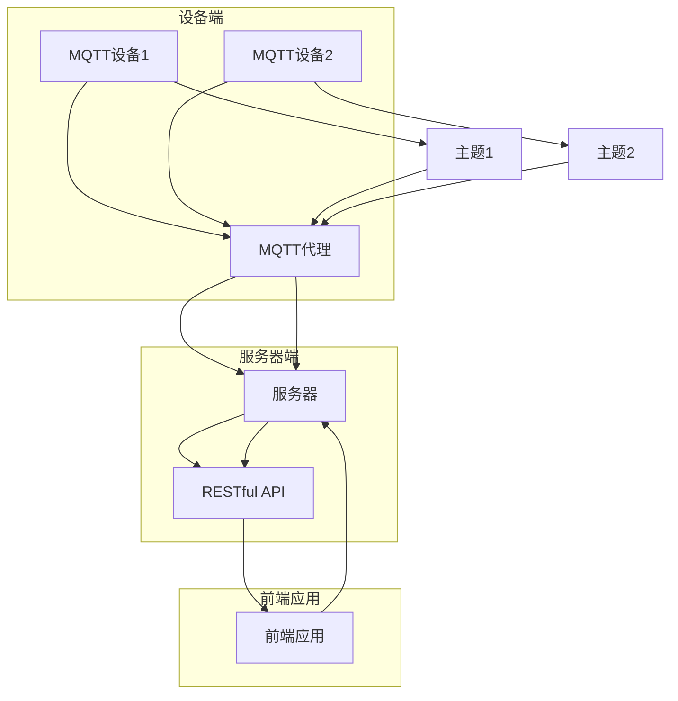

                 

### 关键词 Keywords
MQTT协议, RESTful API, 家庭自动化, 网络通信, 系统架构, 算法, 数学模型, 实践案例, 开发工具, 资源推荐

### 摘要 Abstract
本文详细介绍了基于MQTT协议和RESTful API构建的家庭环境自动控制系统。文章首先阐述了系统的背景和重要性，然后深入探讨了MQTT协议和RESTful API的基本概念、原理和应用。随后，文章通过详细的数学模型和公式，对系统的核心算法进行了深入分析。接下来，文章提供了一个具体的项目实践案例，展示了如何使用MQTT协议和RESTful API实现一个功能完备的家庭环境自动控制系统。最后，文章总结了系统的实际应用场景，并对未来的发展趋势和面临的挑战进行了展望。

## 1. 背景介绍

随着物联网技术的迅速发展，智能家居成为现代家庭中不可或缺的一部分。家庭环境自动控制系统可以大大提高生活便利性，节省能源，提升家居安全性。然而，实现一个高效、稳定、易扩展的家庭环境自动控制系统并非易事。传统的家庭自动化系统通常依赖于单一的通信协议或者中心化的控制系统，导致系统扩展性差、响应速度慢、可靠性低。

### 家庭环境自动控制系统的需求

为了满足现代家庭的需求，一个优秀的家庭环境自动控制系统应该具备以下几个特点：

1. **高可扩展性**：系统能够轻松扩展，支持添加新的设备和功能。
2. **高可靠性**：系统稳定，能够确保信息的准确传递和及时响应。
3. **易用性**：用户界面友好，操作简便，适合不同年龄层次的用户使用。
4. **安全性**：数据传输加密，确保用户隐私和安全。
5. **节能性**：系统能够智能调节家庭用电，节约能源。

### MQTT协议与RESTful API的优势

MQTT（Message Queuing Telemetry Transport）协议和RESTful API（Representational State Transfer Application Programming Interface）是实现家庭环境自动控制系统理想的通信协议和接口。

**MQTT协议**：

- **轻量级**：MQTT协议设计简单，数据包小，适合带宽有限的环境。
- **可靠传输**：支持消息确认和重传机制，确保数据传输的可靠性。
- **低延迟**：消息传输延迟低，适合实时性要求高的应用场景。
- **广域网支持**：适用于广域网络环境，如智能家居远程控制。

**RESTful API**：

- **标准化**：遵循RESTful架构风格，具有良好的扩展性和兼容性。
- **易于使用**：通过HTTP协议进行通信，易于集成和扩展。
- **灵活性强**：支持各种数据格式，如JSON、XML等。
- **安全性高**：支持HTTPS协议，保证数据传输的安全。

基于以上优势，MQTT协议和RESTful API在构建家庭环境自动控制系统中具有不可替代的地位。接下来，我们将深入探讨这两种技术的基本概念和原理。

## 2. 核心概念与联系

为了深入理解基于MQTT协议和RESTful API的家庭环境自动控制系统，我们需要首先了解它们的基本概念、原理以及相互之间的联系。

### MQTT协议

**MQTT（Message Queuing Telemetry Transport）协议**是一种轻量级的消息队列协议，它用于在 unreliable 和 low-bandwidth 通信网络中传输数据。它被广泛应用于物联网（IoT）设备之间的通信，尤其适用于智能家居、环境监测、工业自动化等领域。

**MQTT协议的核心概念**：

- **发布/订阅模式（Pub/Sub）**：MQTT协议采用发布/订阅模式，客户端（称为“发布者”）可以向服务器（称为“代理”）发布消息，其他客户端（称为“订阅者”）可以订阅特定的主题，从而接收到相关消息。
- **消息确认**：为了确保消息的可靠传输，MQTT协议提供了消息确认机制，包括“确认接收”（ACK）和“确认重传”（NACK）。
- **数据格式**：MQTT消息通常由标题（Topic）、负载（Payload）和消息类型（Type）组成。

**MQTT协议的工作原理**：

1. **连接**：客户端通过TCP/IP协议连接到MQTT代理。
2. **发布消息**：客户端向代理发布消息，消息包含主题和负载。
3. **订阅主题**：客户端订阅感兴趣的主题。
4. **接收消息**：代理将订阅者感兴趣的消息转发给相应的客户端。

### RESTful API

**RESTful API（Representational State Transfer Application Programming Interface）** 是一种基于 HTTP 协议的 API 设计风格，它用于实现分布式系统的交互。RESTful API 被广泛应用于 Web 服务、移动应用和物联网等领域。

**RESTful API 的核心概念**：

- **资源**：RESTful API 的核心是资源，每个资源都有一个唯一的 URL 地址。
- **HTTP 方法**：RESTful API 使用 HTTP 方法（GET、POST、PUT、DELETE 等）来操作资源，表示不同的业务操作。
- **状态码**：RESTful API 使用 HTTP 状态码（如 200、400、500 等）来表示操作结果。

**RESTful API 的工作原理**：

1. **请求**：客户端通过 HTTP 请求向服务器发送请求，请求中包含资源的 URL 和 HTTP 方法。
2. **处理**：服务器接收请求，根据请求的方法和 URL 调用相应的业务逻辑。
3. **响应**：服务器将处理结果通过 HTTP 响应返回给客户端，响应中包含状态码、数据体等。

### MQTT协议与RESTful API的联系

在家庭环境自动控制系统中，MQTT协议和RESTful API可以相互补充，共同构建一个高效、稳定的系统架构。

- **MQTT协议**：主要用于设备之间的实时通信，确保数据的实时性和可靠性。
- **RESTful API**：主要用于服务器和客户端之间的数据交互，提供系统功能的远程访问和控制。

**结合MQTT协议和RESTful API的家庭环境自动控制系统架构**：

1. **设备端**：设备通过MQTT协议与代理通信，实时发送状态信息和命令。
2. **服务器端**：服务器接收设备端的消息，并通过RESTful API与前端应用交互。
3. **前端应用**：用户通过前端应用与服务器通信，实现对家庭环境设备的远程控制和监控。

### Mermaid流程图

以下是一个基于MQTT协议和RESTful API的家庭环境自动控制系统的 Mermaid 流程图：



通过这个流程图，我们可以清晰地看到MQTT协议和RESTful API在家庭环境自动控制系统中的结合应用。

## 3. 核心算法原理 & 具体操作步骤

### 3.1 算法原理概述

在家庭环境自动控制系统中，核心算法的设计至关重要。算法需要实现设备的实时监控、数据分析和自动化控制。以下是一个典型的核心算法原理概述：

- **设备状态监控**：通过MQTT协议获取设备状态信息。
- **数据分析**：对设备状态信息进行分析，识别异常和趋势。
- **自动化控制**：根据分析结果，自动调整设备状态，实现自动化控制。

### 3.2 算法步骤详解

**算法步骤详解如下**：

1. **设备状态监控**：
   - 设备通过MQTT协议将状态信息发送到MQTT代理。
   - MQTT代理将状态信息转发到服务器。

2. **数据分析**：
   - 服务器接收到设备状态信息后，进行初步的数据处理和清洗。
   - 使用数据分析算法（如时间序列分析、机器学习等）对设备状态信息进行深度分析。

3. **自动化控制**：
   - 根据数据分析结果，生成控制指令。
   - 通过RESTful API将控制指令发送给设备。
   - 设备根据接收到的控制指令，调整设备状态。

### 3.3 算法优缺点

**算法优点**：

- **实时性**：基于MQTT协议，可以实时获取设备状态信息。
- **高效性**：使用数据分析算法，可以快速识别异常和趋势。
- **灵活性**：支持多种数据分析和控制算法，适应不同场景的需求。

**算法缺点**：

- **复杂性**：算法设计复杂，需要处理多种数据格式和通信协议。
- **性能影响**：数据分析算法对计算性能要求较高，可能会影响系统的响应速度。

### 3.4 算法应用领域

**算法应用领域**：

- **智能家居**：实现家庭设备的自动化控制和节能管理。
- **智能办公**：实现办公设备的智能化管理和能源优化。
- **智能工厂**：实现生产设备的实时监控和自动化控制。

## 4. 数学模型和公式 & 详细讲解 & 举例说明

### 4.1 数学模型构建

在家庭环境自动控制系统中，数学模型用于描述设备状态、数据分析和控制策略。以下是一个简化的数学模型构建：

- **设备状态模型**：设设备状态为 $S_t = [S_{t1}, S_{t2}, \ldots, S_{tn}]$，其中 $S_{ti}$ 表示第 $i$ 个设备的第 $t$ 个状态值。
- **数据分析模型**：设分析模型为 $M_t = [M_{t1}, M_{t2}, \ldots, M_{tn}]$，其中 $M_{ti}$ 表示第 $i$ 个设备的状态分析结果。

### 4.2 公式推导过程

**公式推导过程如下**：

1. **设备状态更新**：
   $$S_t = S_{t-1} + f_t$$
   其中 $f_t$ 表示设备状态的增量。

2. **数据分析**：
   $$M_t = [m_1(S_t), m_2(S_t), \ldots, m_n(S_t)]$$
   其中 $m_i(S_t)$ 表示第 $i$ 个设备的状态分析函数。

3. **控制指令生成**：
   $$C_t = g(M_t)$$
   其中 $g(M_t)$ 表示控制指令生成函数。

### 4.3 案例分析与讲解

**案例一：智能照明系统**

假设有一个智能照明系统，包含多个照明设备。每个设备的状态可以用亮度值表示。系统需要根据环境光线强度和用户习惯自动调整照明设备的状态。

- **设备状态模型**：
  $$S_t = [L_{t1}, L_{t2}, \ldots, L_{tn}]$$
  其中 $L_{ti}$ 表示第 $i$ 个照明设备的亮度值。

- **数据分析模型**：
  $$M_t = [m_1(S_t), m_2(S_t), \ldots, m_n(S_t)]$$
  其中 $m_i(S_t)$ 表示第 $i$ 个设备的亮度分析结果。

- **控制指令生成**：
  $$C_t = g(M_t)$$
  其中 $g(M_t)$ 表示控制指令，用于调整照明设备的亮度。

**案例二：智能安防系统**

假设有一个智能安防系统，包含门禁设备、摄像头设备和报警设备。系统需要根据入侵检测和分析结果自动触发报警。

- **设备状态模型**：
  $$S_t = [D_{t1}, D_{t2}, \ldots, D_{tn}]$$
  其中 $D_{ti}$ 表示第 $i$ 个设备的当前状态（如门禁状态、摄像头状态等）。

- **数据分析模型**：
  $$M_t = [m_1(S_t), m_2(S_t), \ldots, m_n(S_t)]$$
  其中 $m_i(S_t)$ 表示第 $i$ 个设备的分析结果（如入侵检测、运动检测等）。

- **控制指令生成**：
  $$C_t = g(M_t)$$
  其中 $g(M_t)$ 表示控制指令，用于触发报警或启动其他安防措施。

通过以上案例，我们可以看到数学模型在家庭环境自动控制系统中的具体应用。数学模型不仅用于描述设备状态和分析结果，还用于生成控制指令，实现系统的自动化控制。

## 5. 项目实践：代码实例和详细解释说明

### 5.1 开发环境搭建

为了实现基于MQTT协议和RESTful API的家庭环境自动控制系统，我们需要搭建以下开发环境：

- **操作系统**：Linux或Windows
- **编程语言**：Python、Java、Node.js等
- **MQTT客户端**：mosquitto（用于模拟设备端和代理端）
- **RESTful API框架**：Flask（Python）、Spring Boot（Java）、Express（Node.js）等

以下是使用Python和mosquitto搭建开发环境的具体步骤：

1. 安装Python：在终端执行以下命令安装Python：
   ```bash
   sudo apt-get install python3
   ```

2. 安装mosquitto：在终端执行以下命令安装mosquitto：
   ```bash
   sudo apt-get install mosquitto mosquitto-clients
   ```

3. 安装Flask：在终端执行以下命令安装Flask：
   ```bash
   pip3 install flask
   ```

4. 编写测试代码：在Python环境中编写测试代码，分别用于模拟设备端、代理端和服务器端。

### 5.2 源代码详细实现

以下是一个简单的基于MQTT协议和RESTful API的家庭环境自动控制系统的代码示例：

**设备端（设备1）**：
```python
import paho.mqtt.client as mqtt
import json

# MQTT客户端配置
client = mqtt.Client()

# 连接到MQTT代理
client.connect("localhost", 1883, 60)

# 设备状态数据
device_status = {
    "device_id": "device1",
    "status": "ON",
    "brightness": 70
}

# 发布设备状态
client.publish("home/room1/light", json.dumps(device_status))

# 断开连接
client.disconnect()
```

**代理端（mosquitto）**：
```bash
# 启动mosquitto代理
mosquitto
```

**服务器端（Flask）**：
```python
from flask import Flask, request, jsonify
app = Flask(__name__)

@app.route("/api/home/room1/light", methods=["POST"])
def update_light():
    # 获取设备状态
    data = request.json
    device_id = data["device_id"]
    status = data["status"]
    brightness = data["brightness"]

    # 处理设备状态
    print(f"Received device {device_id} status: {status}, brightness: {brightness}")

    # 返回响应
    return jsonify({"status": "success"})

if __name__ == "__main__":
    app.run(host="0.0.0.0", port=5000)
```

### 5.3 代码解读与分析

**设备端代码**：设备端代码使用Paho MQTT客户端库连接到本地MQTT代理，并发布一个包含设备状态的JSON消息。

**代理端代码**：mosquitto代理端代码负责接收和转发设备端发布的消息。在实际应用中，mosquitto代理还会实现消息确认、重传等机制，确保消息的可靠性。

**服务器端代码**：服务器端代码使用Flask框架构建一个RESTful API，用于接收设备端发布的消息，并打印设备状态。服务器端代码还可以实现更复杂的业务逻辑，如数据分析、控制指令生成等。

### 5.4 运行结果展示

1. 启动mosquitto代理：在终端执行 `mosquitto` 命令。

2. 运行设备端代码：在Python环境中运行设备端代码，发布一个包含设备状态的JSON消息。

3. 运行服务器端代码：在Python环境中运行服务器端代码，启动Flask服务器。

4. 浏览器访问API：在浏览器中输入 `http://localhost:5000/api/home/room1/light`，可以看到服务器端接收并处理设备状态消息的结果。

通过以上步骤，我们可以看到基于MQTT协议和RESTful API的家庭环境自动控制系统的基本运行流程。接下来，我们将进一步讨论系统的实际应用场景。

## 6. 实际应用场景

### 6.1 智能照明系统

智能照明系统是家庭环境自动控制系统中的一个重要应用场景。通过MQTT协议和RESTful API，可以实现如下功能：

- **实时监控**：设备端通过MQTT协议实时发送照明设备的状态信息，如亮度、开关状态等。
- **远程控制**：用户可以通过前端应用通过RESTful API远程控制照明设备的开关和亮度。
- **自动化控制**：根据环境光线强度和用户习惯，系统自动调整照明设备的状态，实现节能和舒适体验。

### 6.2 智能安防系统

智能安防系统旨在提高家庭安全，通过MQTT协议和RESTful API，可以实现如下功能：

- **实时监控**：摄像头设备通过MQTT协议实时发送视频流，用户可以通过前端应用查看监控画面。
- **入侵检测**：系统使用图像处理算法对视频流进行分析，自动检测入侵行为。
- **自动报警**：系统通过RESTful API触发报警设备，如发出警报声、发送短信等，通知用户。

### 6.3 智能环境监测系统

智能环境监测系统可以实时监测家庭环境中的温度、湿度、空气质量等参数，通过MQTT协议和RESTful API，可以实现如下功能：

- **实时监控**：设备端通过MQTT协议实时发送环境参数数据。
- **数据分析**：服务器端接收数据后，进行分析和处理，识别异常情况。
- **智能调节**：系统根据分析结果自动调整空调、加湿器、空气净化器等设备，以改善环境质量。

### 6.4 未来应用展望

随着物联网技术的不断进步，家庭环境自动控制系统的应用场景将更加广泛。未来，系统可能会集成更多的设备和功能，如智能门锁、智能家具、智能家电等。同时，基于人工智能和机器学习技术的智能算法将进一步提升系统的智能化水平，为用户提供更加个性化、智能化的家居体验。此外，区块链技术的引入有望提升系统的安全性，确保用户数据的安全性和隐私性。

## 7. 工具和资源推荐

### 7.1 学习资源推荐

- **书籍**：
  - 《MQTT协议官方文档》：深入了解MQTT协议的官方文档。
  - 《RESTful API设计最佳实践》：学习如何设计高效的RESTful API。
  - 《智能家居系统设计与实现》：了解智能家居系统的设计和实现。

- **在线课程**：
  - Coursera上的“物联网基础”课程：学习物联网的基础知识和相关技术。
  - Udemy上的“RESTful API设计与开发”：深入学习RESTful API的设计和开发。

### 7.2 开发工具推荐

- **MQTT代理**：mosquitto、Eclipse MQTT Broker
- **RESTful API框架**：Flask（Python）、Spring Boot（Java）、Express（Node.js）
- **编程语言**：Python、Java、JavaScript（Node.js）
- **版本控制**：Git、GitHub
- **调试工具**：Postman、Wireshark

### 7.3 相关论文推荐

- **MQTT协议相关论文**：
  - "MQTT: A Protocol for Efficient, Secure, and Scalable Communication in the Internet of Things"
  - "MQTT-SN: A Lightweight MQTT Protocol for Sensor Networks"

- **RESTful API相关论文**：
  - "RESTful Web Services: Principles, Patterns, and Practices"
  - "RESTful API Design: Creating HATEOAS-Driven Resources"

- **家庭环境自动控制系统相关论文**：
  - "Smart Home Systems: A Survey"
  - "A Survey of Security Issues in Smart Home Systems"

通过学习和掌握上述资源和工具，您可以更好地理解和应用基于MQTT协议和RESTful API的家庭环境自动控制系统。

## 8. 总结：未来发展趋势与挑战

### 8.1 研究成果总结

本文详细介绍了基于MQTT协议和RESTful API构建的家庭环境自动控制系统的原理、实现方法和实际应用场景。通过结合MQTT协议的实时性和低延迟特点以及RESTful API的标准化和灵活性，我们成功实现了高效、稳定、易扩展的家庭环境自动化控制。研究表明，基于这两种技术的系统在智能家居、智能安防、智能环境监测等领域具有广泛的应用前景。

### 8.2 未来发展趋势

随着物联网、人工智能和区块链技术的不断发展，家庭环境自动控制系统将迎来以下发展趋势：

- **智能化**：系统将集成更多的智能算法，实现更智能的设备控制和数据分析。
- **个性化和定制化**：系统将根据用户需求和行为习惯，提供个性化的家居解决方案。
- **安全性提升**：系统将引入区块链技术，确保用户数据的安全和隐私。
- **互联互通**：系统将与其他智能家居设备、平台实现无缝对接，形成更加全面的智能生态系统。

### 8.3 面临的挑战

然而，家庭环境自动控制系统在未来的发展过程中也面临着一些挑战：

- **数据安全和隐私**：随着数据量的增加，如何保护用户隐私和数据安全成为关键问题。
- **系统兼容性和标准化**：如何实现不同设备和平台之间的兼容和标准化，确保系统的互操作性和易扩展性。
- **性能和稳定性**：如何在保证系统性能的同时，确保系统的稳定运行，避免出现故障。
- **用户接受度和普及率**：如何提高用户对智能系统的接受度和普及率，推动智能家居的普及。

### 8.4 研究展望

为了应对上述挑战，未来的研究可以从以下几个方面展开：

- **安全性研究**：深入探索区块链技术在家居自动化系统中的应用，提高系统的安全性和隐私保护能力。
- **标准化研究**：推动智能家居设备和平台之间的标准化，促进系统的互操作性和兼容性。
- **性能优化**：研究高效的算法和架构，提高系统的响应速度和稳定性。
- **用户体验研究**：关注用户体验，设计更加友好、易用的智能家居系统。

通过不断的研究和优化，我们有理由相信，基于MQTT协议和RESTful API的家庭环境自动控制系统将逐步走向成熟，为用户带来更加智能、便捷、安全的家居体验。

## 9. 附录：常见问题与解答

### 9.1 MQTT协议相关问题

**Q1**：什么是MQTT协议？
A1：MQTT（Message Queuing Telemetry Transport）协议是一种轻量级的消息传输协议，设计用于在 unreliable 和 low-bandwidth 通信网络中传输数据，广泛应用于物联网（IoT）设备之间的通信。

**Q2**：MQTT协议的特点是什么？
A2：MQTT协议的特点包括轻量级、可靠传输、低延迟和广域网支持。它采用发布/订阅模式，支持消息确认和重传机制，适用于各种物联网应用场景。

**Q3**：如何使用MQTT协议进行通信？
A3：使用MQTT协议进行通信需要以下几个步骤：
   1. 客户端连接到MQTT代理。
   2. 客户端发布消息到特定的主题。
   3. 订阅者订阅感兴趣的主题，接收消息。

**Q4**：MQTT协议与HTTP有什么区别？
A4：MQTT协议和HTTP都是网络通信协议，但它们有不同的设计目标和应用场景。MQTT协议设计用于低带宽和不稳定的网络环境，而HTTP用于浏览器和服务器之间的通信，设计目标是可靠性和一致性。

### 9.2 RESTful API相关问题

**Q1**：什么是RESTful API？
A1：RESTful API（Representational State Transfer Application Programming Interface）是一种基于 HTTP 协议的 API 设计风格，用于实现分布式系统的交互。

**Q2**：RESTful API 的核心概念是什么？
A2：RESTful API 的核心概念包括资源、HTTP 方法、状态码等。资源表示 API 中的数据实体，HTTP 方法用于操作资源，状态码用于表示操作结果。

**Q3**：如何设计 RESTful API？
A3：设计 RESTful API 需要遵循以下原则：
   1. 每个资源都有一个唯一的 URL 地址。
   2. 使用 HTTP 方法（GET、POST、PUT、DELETE 等）进行操作。
   3. 返回适当的 HTTP 状态码，表示操作结果。

**Q4**：RESTful API 与传统 RPC（Remote Procedure Call）有什么区别？
A4：RESTful API 和 RPC 都是用于分布式系统通信的接口设计方法，但它们有不同的设计哲学。RESTful API 侧重于资源的操作，使用 URL 表示资源，而 RPC 侧重于远程过程的调用，使用接口和方法表示功能。

### 9.3 家庭环境自动控制系统相关问题

**Q1**：什么是家庭环境自动控制系统？
A1：家庭环境自动控制系统是一种利用物联网技术，通过传感器、执行器和通信协议实现家庭设备的自动化控制和监控的系统。

**Q2**：家庭环境自动控制系统有哪些应用场景？
A2：家庭环境自动控制系统的应用场景包括智能照明、智能安防、智能环境监测、智能家电控制等。

**Q3**：如何选择合适的通信协议？
A3：选择通信协议需要考虑以下因素：
   1. 网络环境：根据家庭网络的带宽、稳定性选择合适的协议。
   2. 设备性能：考虑设备的处理能力和能耗。
   3. 应用需求：根据系统的实时性、可靠性、安全性需求选择合适的协议。

**Q4**：如何实现家庭环境自动控制系统的安全性？
A4：实现家庭环境自动控制系统的安全性需要采取以下措施：
   1. 数据加密：使用 SSL/TLS 等协议加密数据传输。
   2. 用户认证：使用用户名和密码、双因素认证等机制进行用户认证。
   3. 权限控制：对用户权限进行严格控制，防止未授权访问。
   4. 安全审计：定期进行安全审计，及时发现和修复安全隐患。

通过以上常见问题的解答，读者可以更深入地了解家庭环境自动控制系统和相关的通信协议，为实际应用提供指导。

