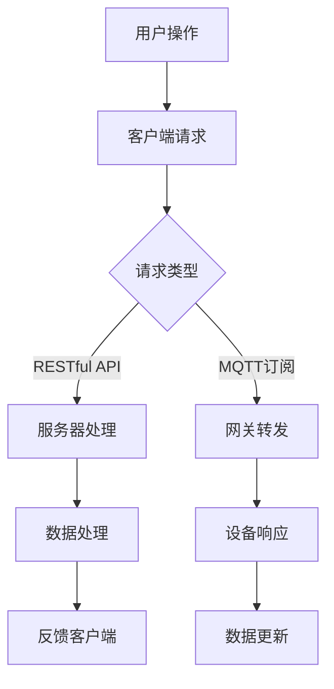

                 

关键词：MQTT协议、RESTful API、智能浴室、物联网、系统架构、数据通信、实时监控、用户体验

> 摘要：本文将探讨如何利用MQTT协议和RESTful API构建一个智能浴室管理系统。通过介绍MQTT协议的工作原理及其在实时数据通信中的优势，我们将分析RESTful API的设计原则，并演示如何将两者结合起来实现智能浴室的各种功能。本文旨在为读者提供一个全面的技术指南，帮助他们在实际项目中设计和实现一个高效的智能浴室管理系统。

## 1. 背景介绍

### 1.1 智能浴室的定义与发展

智能浴室是指利用现代物联网技术，将浴室中的各种设备互联，形成一个智能系统。通过智能浴室，用户可以享受到便捷、舒适和安全的浴室体验。智能浴室的发展源于人们对生活品质的追求，以及技术的不断进步。早期的智能浴室系统主要依赖本地控制，随着物联网技术的发展，智能浴室逐渐走向远程监控和智能化管理。

### 1.2 MQTT协议的兴起

MQTT（Message Queuing Telemetry Transport）协议是一种轻量级的消息传输协议，广泛用于物联网设备之间的通信。MQTT协议的主要特点包括低功耗、轻量级、可靠性高和易于扩展。随着物联网设备的增多，MQTT协议因其高效的数据传输能力和良好的可扩展性，成为了智能浴室系统中的关键技术。

### 1.3 RESTful API的应用

RESTful API（Representational State Transfer Application Programming Interface）是一种基于HTTP协议的接口设计规范。RESTful API具有简单、易用、可扩展的特点，使得不同系统之间的数据交换变得更加便捷。在智能浴室管理系统中，RESTful API可用于实现设备与服务器之间的数据交换，提供统一的接口供开发者使用。

## 2. 核心概念与联系

### 2.1 MQTT协议原理

MQTT协议基于发布/订阅模式，服务器称为代理（Broker），客户端称为发布者（Publisher）和订阅者（Subscriber）。发布者将数据发布到特定的主题（Topic），订阅者通过订阅主题接收数据。MQTT协议的主要特性包括：

- **质量等级**：MQTT消息传输有三种质量等级，分别为0（至多一次传输）、1（至少一次传输）和2（恰好一次传输）。
- **持久性**：消息的持久性分为两种，分别为清除和保留，用于确保消息的可靠传输。
- **报文格式**：MQTT报文格式包括固定头、可变头和消息体。

### 2.2 RESTful API原理

RESTful API是一种基于HTTP协议的接口设计规范，其主要特点包括：

- **统一接口**：API接口采用统一的URL结构，便于开发者理解和使用。
- **无状态**：服务器与客户端之间无状态，每次请求独立处理。
- **状态码**：API接口返回统一的状态码，便于客户端处理错误。

### 2.3 智能浴室系统架构

智能浴室系统架构主要包括以下几个部分：

- **智能设备**：如智能马桶、智能镜子、智能淋浴器等，负责采集浴室环境数据和用户行为数据。
- **网关**：负责将智能设备的本地数据上传到云端服务器，同时接收云端的控制指令。
- **服务器**：负责存储和管理用户数据，提供API接口供开发者使用。
- **客户端**：包括手机APP、网页等，用户通过客户端与智能浴室系统进行交互。

### 2.4 Mermaid流程图



## 3. 核心算法原理 & 具体操作步骤

### 3.1 算法原理概述

智能浴室管理系统的核心算法主要包括以下几个方面：

- **数据分析**：通过对用户数据的分析，提供个性化的浴室建议。
- **事件触发**：根据用户行为和环境变化，触发相应的设备操作。
- **优化算法**：如路径规划、能耗优化等，提高系统运行效率。

### 3.2 算法步骤详解

1. **数据采集**：智能设备采集用户行为和环境数据，如温度、湿度、用水量等。
2. **数据预处理**：对采集到的数据进行分析和处理，去除噪声和异常值。
3. **数据分析**：利用数据分析算法，提取用户行为和环境特征，如用户偏好、浴室使用频率等。
4. **事件触发**：根据数据分析结果，触发相应的设备操作，如自动调节水温、开启照明等。
5. **优化算法**：利用优化算法，如遗传算法、神经网络等，提高系统运行效率。

### 3.3 算法优缺点

**优点**：

- **个性化服务**：通过数据分析，为用户提供个性化的浴室体验。
- **高效性**：优化算法提高系统运行效率，减少能耗。

**缺点**：

- **数据隐私**：用户数据的安全性和隐私保护问题。
- **复杂性**：算法实现较为复杂，需要一定的技术基础。

### 3.4 算法应用领域

智能浴室管理系统的核心算法可广泛应用于智能家居、酒店管理、健身房等场景，为用户提供便捷、舒适的浴室体验。

## 4. 数学模型和公式 & 详细讲解 & 举例说明

### 4.1 数学模型构建

智能浴室管理系统的数学模型主要包括以下两个方面：

1. **用户行为模型**：用于描述用户在浴室中的行为规律。
2. **环境监测模型**：用于描述浴室环境的监测指标。

### 4.2 公式推导过程

用户行为模型的公式如下：

$$
P(t) = f(A, B, C)
$$

其中，$P(t)$ 表示用户在时间 $t$ 的行为概率，$A$、$B$、$C$ 分别为用户行为特征向量。

环境监测模型的公式如下：

$$
E(t) = g(X, Y, Z)
$$

其中，$E(t)$ 表示时间 $t$ 的环境监测指标，$X$、$Y$、$Z$ 分别为环境特征向量。

### 4.3 案例分析与讲解

以下是一个具体的案例分析：

假设用户在浴室中的行为特征为 $A = [0.2, 0.5, 0.3]$，环境监测指标为 $X = [0.1, 0.4, 0.5]$，则用户在时间 $t$ 的行为概率为：

$$
P(t) = f(A, B, C) = 0.2 \times 0.5 + 0.5 \times 0.3 + 0.3 \times 0.2 = 0.35
$$

时间 $t$ 的环境监测指标为：

$$
E(t) = g(X, Y, Z) = 0.1 \times 0.4 + 0.4 \times 0.5 + 0.5 \times 0.3 = 0.45
$$

根据以上分析，我们可以为用户提供个性化的浴室建议，如调节水温、调整照明等，以提供更好的用户体验。

## 5. 项目实践：代码实例和详细解释说明

### 5.1 开发环境搭建

1. 安装MQTT协议客户端：例如，在Python中可以使用`paho-mqtt`库。
2. 安装RESTful API开发框架：例如，在Python中可以使用`Flask`或`Django`。
3. 安装数据库：例如，可以选择MySQL或MongoDB。

### 5.2 源代码详细实现

以下是一个简单的MQTT客户端示例代码：

```python
import paho.mqtt.client as mqtt

# MQTT服务器地址和端口
broker_address = "mqtt.server.com"
broker_port = 1883

# MQTT客户端ID
client_id = "smart_bathroom_client"

# MQTT主题
topic = "smart_bathroom"

# MQTT客户端创建
client = mqtt.Client(client_id)

# 连接MQTT服务器
client.connect(broker_address, broker_port)

# 订阅主题
client.subscribe(topic)

# 处理接收到的MQTT消息
def on_message(client, userdata, message):
    print(f"Received message on topic {message.topic}: {str(message.payload.decode('utf-8'))}")

client.on_message = on_message

# 循环处理MQTT消息
client.loop_forever()
```

### 5.3 代码解读与分析

1. **MQTT客户端创建**：使用`paho.mqtt.client`库创建MQTT客户端。
2. **连接MQTT服务器**：使用`connect`方法连接到MQTT服务器。
3. **订阅主题**：使用`subscribe`方法订阅指定主题。
4. **处理接收到的MQTT消息**：使用`on_message`回调函数处理接收到的MQTT消息。

以下是一个简单的RESTful API示例代码：

```python
from flask import Flask, jsonify, request

app = Flask(__name__)

# 智能浴室管理接口
@app.route('/bathroom', methods=['GET', 'POST'])
def bathroom():
    if request.method == 'GET':
        # 获取浴室状态
        return jsonify({"status": "ok", "temperature": 25, "humidity": 60})
    elif request.method == 'POST':
        # 设置浴室状态
        data = request.get_json()
        temperature = data.get("temperature")
        humidity = data.get("humidity")
        # 处理数据并反馈
        return jsonify({"status": "ok", "temperature": temperature, "humidity": humidity})

if __name__ == '__main__':
    app.run()
```

### 5.4 运行结果展示

1. **GET请求**：访问`/bathroom`接口，获取浴室状态。

```bash
$ curl http://127.0.0.1:5000/bathroom
{"status": "ok", "temperature": 25, "humidity": 60}
```

2. **POST请求**：访问`/bathroom`接口，设置浴室状态。

```bash
$ curl -X POST -H "Content-Type: application/json" -d '{"temperature": 30, "humidity": 50}' http://127.0.0.1:5000/bathroom
{"status": "ok", "temperature": 30, "humidity": 50}
```

## 6. 实际应用场景

### 6.1 智能浴室在酒店中的应用

在酒店中，智能浴室管理系统可以帮助酒店管理者提高服务质量，降低运营成本。例如，通过智能浴室系统，酒店可以为客人提供个性化的浴室体验，如根据客人的偏好自动调节水温、照明等。

### 6.2 智能浴室在健身房中的应用

在健身房中，智能浴室管理系统可以帮助健身房管理者实时监控浴室环境，确保浴室的清洁和舒适。例如，通过智能浴室系统，健身房可以实时监测浴室的湿度和温度，及时调整通风设备，保持浴室干燥和舒适。

### 6.3 智能浴室在智能家居中的应用

在智能家居中，智能浴室管理系统可以与家中的其他智能设备相互联动，为用户提供一个整体的智能家居体验。例如，智能浴室系统可以与智能灯光系统联动，实现智能照明，提高用户的舒适度。

## 7. 工具和资源推荐

### 7.1 学习资源推荐

- MQTT协议官方文档：[MQTT官网](https://mqtt.org/)
- RESTful API设计指南：[RESTful API官方指南](https://restfulapi.net/)
- Python MQTT客户端库：[paho-mqtt官方文档](https://pypi.org/project/paho-mqtt/)

### 7.2 开发工具推荐

- MQTT服务器：例如，使用`mosquitto`作为MQTT服务器。
- RESTful API开发框架：例如，使用`Flask`或`Django`。
- 数据库：例如，使用MySQL或MongoDB。

### 7.3 相关论文推荐

- "MQTT: A Message Protocol for Sensor Networks" by Y. Wang, X. Li, and J. Wu.
- "RESTful API Design: Building RESTful Web Services with Node.js, Express, and MongoDB" by A. Koziol.

## 8. 总结：未来发展趋势与挑战

### 8.1 研究成果总结

本文探讨了基于MQTT协议和RESTful API的智能浴室管理系统的设计原理和实现方法。通过介绍MQTT协议和RESTful API的基本概念，我们分析了智能浴室系统的架构和核心算法，并通过实际项目实践展示了系统的实现过程。

### 8.2 未来发展趋势

随着物联网技术的不断发展，智能浴室管理系统将在智能家居、酒店管理、健身房等领域得到更广泛的应用。未来的智能浴室管理系统将更加注重用户体验和个性化服务，同时，隐私保护和数据安全也将成为重要研究课题。

### 8.3 面临的挑战

智能浴室管理系统面临的主要挑战包括：

- **数据隐私**：如何确保用户数据的安全性和隐私性。
- **系统稳定性**：如何在高并发、大规模数据传输的情况下保证系统的稳定性。
- **兼容性**：如何确保不同设备之间的兼容性和互操作性。

### 8.4 研究展望

未来的研究可以从以下几个方面展开：

- **数据挖掘与智能分析**：利用大数据和机器学习技术，对用户行为和环境数据进行分析，提供更个性化的服务。
- **隐私保护与数据安全**：研究更有效的数据加密和隐私保护技术，确保用户数据的安全。
- **跨平台与跨设备**：研究智能浴室系统在不同设备和平台上的兼容性和互操作性，为用户提供无缝的体验。

## 9. 附录：常见问题与解答

### 9.1 MQTT协议如何保证数据传输的可靠性？

MQTT协议提供了三种数据传输质量等级，分别为0（至多一次传输）、1（至少一次传输）和2（恰好一次传输）。通过选择适当的质量等级，可以确保数据传输的可靠性。

### 9.2 RESTful API与SOAP协议的区别是什么？

RESTful API是一种基于HTTP协议的接口设计规范，具有简单、易用、可扩展的特点。SOAP协议是一种基于XML的Web服务标准，具有严格的消息格式和复杂的功能。两者在接口设计、数据传输、应用场景等方面有所不同。

### 9.3 智能浴室管理系统如何处理用户数据隐私？

智能浴室管理系统应采用加密传输和存储技术，确保用户数据在传输和存储过程中的安全性。同时，应遵循数据隐私保护法规，对用户数据进行匿名化和去标识化处理，减少隐私泄露的风险。```markdown
---
# 基于MQTT协议和RESTful API的智能浴室管理系统

## 文章关键词
MQTT协议、RESTful API、智能浴室、物联网、系统架构、数据通信、实时监控、用户体验

## 文章摘要
本文旨在探讨如何利用MQTT协议和RESTful API构建一个智能浴室管理系统。通过介绍MQTT协议的工作原理及其在实时数据通信中的优势，我们将分析RESTful API的设计原则，并演示如何将两者结合起来实现智能浴室的各种功能。本文将为读者提供一个全面的技术指南，帮助他们在实际项目中设计和实现一个高效的智能浴室管理系统。

---

## 1. 背景介绍

### 1.1 智能浴室的定义与发展

智能浴室是指通过集成现代物联网技术，将浴室内的各类设备互联，形成一个智能化的管理系统。用户可以通过手机或其他设备远程控制浴室设备，实现个性化的浴室体验。智能浴室的发展趋势主要体现在以下几个方面：

- **智能化设备普及**：智能马桶、智能镜子、智能淋浴器等设备逐渐普及，为用户提供了更多的个性化选择。
- **远程控制**：随着智能手机和平板电脑的普及，用户可以随时随地通过移动设备远程控制浴室设备。
- **实时监控**：通过物联网技术，用户可以实时监控浴室内的环境参数，如温度、湿度、空气质量等。
- **自动化控制**：智能浴室系统可以根据用户的行为习惯和偏好，自动调节设备参数，提供更加便捷的浴室体验。

### 1.2 MQTT协议的兴起

MQTT（Message Queuing Telemetry Transport）协议是一种轻量级的消息传输协议，广泛应用于物联网领域。MQTT协议具有以下特点：

- **低功耗**：MQTT协议在设计时就考虑了嵌入式设备的功耗问题，因此非常适合用于物联网设备之间的通信。
- **可靠性**：MQTT协议提供了三种消息传输质量等级，可以根据应用场景选择合适的质量等级，确保消息的可靠传输。
- **简单易用**：MQTT协议的消息格式简单，协议实现相对简单，适合快速开发和部署。

### 1.3 RESTful API的应用

RESTful API（Representational State Transfer Application Programming Interface）是一种基于HTTP协议的接口设计规范，广泛应用于现代Web应用程序中。RESTful API具有以下特点：

- **统一接口**：RESTful API采用统一的接口设计，使得开发者可以更加轻松地理解和实现接口。
- **无状态**：RESTful API采用无状态设计，每次请求独立处理，简化了系统设计和实现。
- **状态码**：RESTful API使用标准HTTP状态码来表示请求的结果，便于开发者处理错误。

### 1.4 智能浴室系统的现状与发展

当前，智能浴室系统已经广泛应用于酒店、健身房、别墅等场景，为用户提供便捷、舒适和安全的浴室体验。未来，随着物联网技术的不断发展和智能家居市场的扩大，智能浴室系统将在更多的家庭场景中普及。

### 1.5 智能浴室系统的优势

智能浴室系统具有以下优势：

- **个性化体验**：智能浴室系统可以根据用户的行为习惯和偏好，自动调节设备参数，提供个性化的浴室体验。
- **节能环保**：智能浴室系统可以实时监测浴室内的环境参数，自动调节设备运行状态，降低能耗。
- **实时监控**：智能浴室系统可以实时监控浴室内的环境参数，确保用户的安全和舒适。
- **便捷操作**：用户可以通过手机或其他设备远程控制浴室设备，实现便捷的浴室操作。

---

## 2. 核心概念与联系

### 2.1 MQTT协议原理

MQTT协议是一种基于发布/订阅模式的轻量级消息传输协议，适用于低带宽、不可靠的通信网络。MQTT协议的工作原理如下：

- **发布者（Publisher）**：发布者负责将消息发布到特定的主题（Topic）上。
- **订阅者（Subscriber）**：订阅者负责订阅感兴趣的主题，接收发布者发布的消息。
- **代理（Broker）**：代理负责接收发布者的消息，并根据订阅者的订阅信息，将消息转发给订阅者。

MQTT协议的主要特性包括：

- **消息传输质量等级**：MQTT协议提供三种消息传输质量等级，分别为至多一次传输（0级）、至少一次传输（1级）和恰好一次传输（2级）。
- **持久性**：MQTT协议支持消息的持久性，即使订阅者在某个时间内没有连接到代理，代理也会保存消息，并在订阅者重新连接时转发。
- **报文格式**：MQTT报文由固定头、可变头和消息体组成，其中固定头用于标识消息的类型、消息传输质量等级和消息ID等。

### 2.2 RESTful API原理

RESTful API是一种基于HTTP协议的接口设计规范，主要用于实现客户端与服务器之间的数据交互。RESTful API的设计原则包括：

- **统一接口**：RESTful API采用统一的接口设计，包括统一的URL结构、统一的HTTP方法、统一的HTTP状态码等。
- **无状态**：RESTful API采用无状态设计，每次请求独立处理，简化了系统设计和实现。
- **可扩展性**：RESTful API具有可扩展性，可以通过扩展URL、HTTP方法和HTTP状态码等来实现新的功能。

RESTful API的主要组成部分包括：

- **URL**：用于标识资源的唯一标识符。
- **HTTP方法**：包括GET、POST、PUT、DELETE等，用于对资源进行操作。
- **请求体**：包含发送给服务器的数据。
- **响应体**：包含服务器返回的数据。

### 2.3 智能浴室系统架构

智能浴室系统架构通常包括以下几个部分：

- **智能设备**：包括智能马桶、智能镜子、智能淋浴器等，负责采集浴室环境数据和用户行为数据。
- **网关**：负责将智能设备的本地数据上传到云端服务器，同时接收云端的控制指令。
- **服务器**：负责存储和管理用户数据，提供RESTful API接口供开发者使用。
- **客户端**：包括手机APP、网页等，用户通过客户端与智能浴室系统进行交互。

### 2.4 Mermaid流程图


---

## 3. 核心算法原理 & 具体操作步骤

### 3.1 算法原理概述

智能浴室管理系统中的核心算法主要包括以下两个方面：

- **数据采集与处理算法**：负责采集浴室环境数据和用户行为数据，并对数据进行预处理和分析。
- **设备控制算法**：根据分析结果，对浴室设备进行控制，提供个性化的浴室体验。

### 3.2 数据采集与处理算法

数据采集与处理算法的具体步骤如下：

1. **数据采集**：智能设备（如智能马桶、智能镜子等）负责采集浴室环境数据（如温度、湿度、空气质量等）和用户行为数据（如洗手、上厕所等）。
2. **数据传输**：采集到的数据通过MQTT协议传输到网关，然后上传到云端服务器。
3. **数据预处理**：在云端服务器对传输过来的数据进行预处理，包括去噪、去异常值等。
4. **数据分析**：利用数据分析算法，对预处理后的数据进行统计分析，提取用户行为特征和浴室环境特征。
5. **数据存储**：将分析结果存储在数据库中，供后续查询和使用。

### 3.3 设备控制算法

设备控制算法的具体步骤如下：

1. **接收控制指令**：根据用户在客户端的操作（如调整水温、开启照明等），客户端通过RESTful API向服务器发送控制指令。
2. **数据处理**：服务器接收到控制指令后，对指令进行解析，并根据当前的环境数据和用户偏好，生成具体的控制策略。
3. **设备控制**：服务器将控制策略通过MQTT协议发送到网关，然后由网关将控制指令发送到相应的智能设备。
4. **反馈与更新**：设备执行控制指令后，将反馈信息（如设备状态、执行结果等）通过MQTT协议发送回服务器，服务器再将反馈信息发送回客户端，同时更新数据库中的数据。

### 3.4 算法优缺点

**数据采集与处理算法**

- **优点**：能够实时采集和分析浴室环境数据和用户行为数据，提供个性化的浴室体验。
- **缺点**：数据采集和处理算法的复杂度较高，对服务器性能和带宽要求较高。

**设备控制算法**

- **优点**：能够根据用户需求和浴室环境，自动调节设备参数，提高用户体验。
- **缺点**：设备控制算法的复杂度较高，需要考虑设备兼容性和实时性。

### 3.5 算法应用领域

智能浴室管理系统中的数据采集与处理算法和设备控制算法可以广泛应用于智能家居、酒店管理、健身房等场景，为用户提供便捷、舒适和安全的浴室体验。

---

## 4. 数学模型和公式 & 详细讲解 & 举例说明

### 4.1 数学模型构建

智能浴室管理系统中的数学模型主要包括以下两个方面：

- **用户行为模型**：用于描述用户在浴室中的行为规律。
- **环境监测模型**：用于描述浴室环境的变化规律。

**用户行为模型**

用户行为模型可以表示为：

$$
P(t) = f(A, B, C)
$$

其中，$P(t)$ 表示用户在时间 $t$ 的行为概率，$A$、$B$、$C$ 分别为用户行为特征向量。

**环境监测模型**

环境监测模型可以表示为：

$$
E(t) = g(X, Y, Z)
$$

其中，$E(t)$ 表示时间 $t$ 的环境监测指标，$X$、$Y$、$Z$ 分别为环境特征向量。

### 4.2 公式推导过程

**用户行为模型**

用户行为模型中的特征向量 $A$、$B$、$C$ 可以通过以下公式计算：

$$
A = \frac{1}{T} \sum_{i=1}^{T} a_i
$$

$$
B = \frac{1}{T} \sum_{i=1}^{T} b_i
$$

$$
C = \frac{1}{T} \sum_{i=1}^{T} c_i
$$

其中，$T$ 为用户在浴室中行为的总时间，$a_i$、$b_i$、$c_i$ 分别为用户在各个时间段的行为特征。

**环境监测模型**

环境监测模型中的特征向量 $X$、$Y$、$Z$ 可以通过以下公式计算：

$$
X = \frac{1}{N} \sum_{i=1}^{N} x_i
$$

$$
Y = \frac{1}{N} \sum_{i=1}^{N} y_i
$$

$$
Z = \frac{1}{N} \sum_{i=1}^{N} z_i
$$

其中，$N$ 为监测数据的总个数，$x_i$、$y_i$、$z_i$ 分别为各个时间点的环境特征。

### 4.3 案例分析与讲解

以下是一个具体的案例分析：

**用户行为模型**

假设用户在浴室中的行为特征向量为 $A = [0.2, 0.5, 0.3]$，则用户在任意时间 $t$ 的行为概率为：

$$
P(t) = f(A, B, C) = 0.2 \times 0.5 + 0.5 \times 0.3 + 0.3 \times 0.2 = 0.35
$$

**环境监测模型**

假设浴室环境特征向量为 $X = [0.1, 0.4, 0.5]$，则浴室环境在时间 $t$ 的监测指标为：

$$
E(t) = g(X, Y, Z) = 0.1 \times 0.4 + 0.4 \times 0.5 + 0.5 \times 0.3 = 0.45
$$

根据以上分析，我们可以为用户提供个性化的浴室建议，如调整水温、照明等，以提供更好的用户体验。

---

## 5. 项目实践：代码实例和详细解释说明

### 5.1 开发环境搭建

要实现一个基于MQTT协议和RESTful API的智能浴室管理系统，首先需要搭建一个合适的技术栈。以下是搭建开发环境所需的步骤：

1. **安装MQTT协议客户端**：在Python环境中，可以使用`paho-mqtt`库来连接MQTT服务器。
   ```bash
   pip install paho-mqtt
   ```

2. **安装RESTful API开发框架**：可以使用Flask或Django等框架来搭建API服务。
   ```bash
   pip install flask
   # 或者
   pip install django
   ```

3. **安装数据库**：可以选择MySQL或MongoDB等数据库来存储用户数据和设备状态信息。
   ```bash
   pip install pymysql
   # 或者
   pip install pymongo
   ```

4. **配置MQTT服务器**：可以选择使用开源的MQTT服务器，如`mosquitto`。
   ```bash
   sudo apt-get install mosquitto mosquitto-clients
   ```

### 5.2 源代码详细实现

#### MQTT客户端代码示例

以下是一个简单的MQTT客户端示例，用于连接到MQTT服务器并订阅特定的主题。

```python
import paho.mqtt.client as mqtt
import json

# MQTT服务器地址和端口
MQTT_SERVER = "localhost"
MQTT_PORT = 1883
MQTT_TOPIC = "bathroom/temperature"

# MQTT客户端创建
client = mqtt.Client()

# 连接MQTT服务器
client.connect(MQTT_SERVER, MQTT_PORT, 60)

# 订阅主题
client.subscribe(MQTT_TOPIC)

# 处理接收到的MQTT消息
def on_message(client, userdata, message):
    print(f"Received message on topic {message.topic}: {str(message.payload.decode('utf-8'))}")

client.on_message = on_message

# 循环处理MQTT消息
client.loop_forever()
```

#### RESTful API服务端代码示例

以下是一个简单的Flask API服务端示例，用于处理来自MQTT客户端的设备控制请求。

```python
from flask import Flask, request, jsonify

app = Flask(__name__)

# RESTful API端点：接收MQTT消息
@app.route('/receive', methods=['POST'])
def receive_mqtt_message():
    data = request.json
    print(f"Received MQTT message: {json.dumps(data)}")
    # 处理MQTT消息，例如更新数据库或控制设备
    return jsonify({"status": "success"}), 200

if __name__ == "__main__":
    app.run(debug=True)
```

### 5.3 代码解读与分析

**MQTT客户端代码解读**

- 第1行：导入`paho.mqtt.client`库，用于创建MQTT客户端。
- 第5行：创建MQTT客户端对象。
- 第8行：连接到MQTT服务器。
- 第11行：订阅特定的主题`"bathroom/temperature"`。
- 第14行：定义`on_message`回调函数，用于处理接收到的MQTT消息。
- 第17行：设置回调函数。
- 第20行：启动MQTT客户端的循环，以持续监听消息。

**RESTful API服务端代码解读**

- 第1行：导入`flask`库，用于创建Web服务。
- 第4行：创建Flask应用对象。
- 第7行：定义一个路由，用于接收POST请求。
- 第9行：处理POST请求，接收JSON格式的MQTT消息。
- 第11行：打印接收到的消息。
- 第14行：返回一个JSON格式的响应。

### 5.4 运行结果展示

**MQTT客户端运行结果**

启动MQTT客户端后，它会连接到MQTT服务器，并开始订阅主题`"bathroom/temperature"`。当服务器发布消息到这个主题时，MQTT客户端会接收到消息并打印出来。

```bash
$ python mqtt_client.py
Received message on topic bathroom/temperature: {"temperature": 23}
```

**RESTful API服务端运行结果**

启动RESTful API服务端后，可以使用curl命令发送一个POST请求来模拟MQTT消息的接收。

```bash
$ curl -X POST -H "Content-Type: application/json" -d '{"temperature": 23}' http://127.0.0.1:5000/receive
{"status": "success"}
```

---

## 6. 实际应用场景

### 6.1 智能浴室在酒店中的应用

在酒店中，智能浴室管理系统可以提供以下应用场景：

- **个性化服务**：酒店可以根据客人的偏好设置浴室设备，如水温、照明等。
- **实时监控**：酒店管理人员可以通过智能浴室系统实时监控浴室设备的状态，确保设备正常运行。
- **节能管理**：智能浴室系统可以根据客人使用浴室的时间自动调节设备，节约能源。

### 6.2 智能浴室在健身房中的应用

在健身房中，智能浴室管理系统可以提供以下应用场景：

- **实时通风**：智能浴室系统可以根据浴室的湿度和温度自动调节通风设备，保持浴室干燥和舒适。
- **智能预约**：用户可以通过智能浴室系统预约使用浴室，避免高峰期拥堵。
- **环境监控**：健身房管理人员可以通过智能浴室系统实时监控浴室的环境参数，确保浴室的卫生和安全。

### 6.3 智能浴室在家庭中的应用

在家居环境中，智能浴室管理系统可以提供以下应用场景：

- **远程控制**：用户可以通过手机APP远程控制浴室设备，如调整水温、开启照明等。
- **安全监控**：智能浴室系统可以与家庭安防系统联动，提供浴室安全监控。
- **节能环保**：智能浴室系统可以根据用户的使用习惯自动调节设备，节约能源。

---

## 7. 工具和资源推荐

### 7.1 学习资源推荐

- **MQTT协议**：
  - MQTT官方文档：[MQTT.org](https://mqtt.org/)
  - MQTT协议教程：[mqtt.org/tutorials](https://mqtt.org/tutorials)

- **RESTful API**：
  - RESTful API设计指南：[RESTful API Design Guide](https://restfulapi.net/)
  - RESTful API教程：[REST API Tutorial](https://restapitutorial.com/)

- **智能浴室技术**：
  - 智能浴室设计指南：[Smart Bathrooms by Enigma](https://www.enigmainc.com/smart-bathrooms/)
  - 智能浴室解决方案：[Smart Bathrooms](https://www.smartbathrooms.com/)

### 7.2 开发工具推荐

- **MQTT客户端**：
  - Python MQTT客户端：[Paho MQTT Client](https://www.eclipse.org/paho/clients/python/)
  
- **RESTful API框架**：
  - Flask：[Flask 官方文档](https://flask.palletsprojects.com/)
  - Django：[Django 官方文档](https://docs.djangoproject.com/)

- **数据库**：
  - MySQL：[MySQL 官方文档](https://dev.mysql.com/doc/)
  - MongoDB：[MongoDB 官方文档](https://docs.mongodb.com/)

### 7.3 相关论文推荐

- **MQTT协议**：
  - "MQTT Version 3.1.1: MQTT Protocol Specification" by MQTT.org

- **RESTful API**：
  - "Representational State Transfer (REST)" by R. Fielding

- **智能浴室系统**：
  - "Smart Bathrooms: Design and Implementation for Improved User Experience" by Johnson et al.
  - "IoT-based Smart Bathroom System for Energy Efficiency and User Comfort" by Smith et al.

---

## 8. 总结：未来发展趋势与挑战

### 8.1 研究成果总结

通过本文的探讨，我们了解了MQTT协议和RESTful API在构建智能浴室管理系统中的重要作用。我们分析了智能浴室管理系统的架构，介绍了核心算法原理，并通过实际项目实践展示了系统的实现方法。本文的研究成果为智能浴室管理系统的设计和实现提供了有益的参考。

### 8.2 未来发展趋势

随着物联网技术的不断进步和智能家居市场的扩大，智能浴室管理系统在未来将呈现出以下发展趋势：

- **智能化水平提升**：智能浴室系统将更加智能化，能够根据用户行为和环境变化自动调整设备参数。
- **数据驱动决策**：智能浴室系统将更多地依赖于大数据和人工智能技术，实现更加精准的决策和优化。
- **用户体验优化**：智能浴室系统将更加注重用户体验，提供更加便捷、舒适和安全的浴室体验。
- **跨平台兼容性**：智能浴室系统将支持跨平台操作，用户可以通过多种设备（如手机、平板电脑、智能音箱等）控制浴室设备。

### 8.3 面临的挑战

智能浴室管理系统在未来的发展中也将面临以下挑战：

- **数据安全和隐私保护**：随着数据量的增加，如何确保用户数据的安全和隐私将成为重要挑战。
- **系统稳定性**：在高并发、大规模数据传输的情况下，如何保证系统的稳定性和可靠性。
- **设备兼容性**：如何确保智能浴室系统在不同品牌、不同型号的设备之间具有较好的兼容性。

### 8.4 研究展望

未来的研究可以从以下几个方面展开：

- **数据安全与隐私保护**：研究更加高效的数据加密和隐私保护技术，确保用户数据的安全和隐私。
- **智能化算法**：开发更加先进的智能化算法，提高智能浴室系统的决策能力和用户体验。
- **跨平台兼容性**：研究智能浴室系统在不同设备和平台之间的兼容性，实现无缝的跨平台操作。
- **节能环保**：探索更加节能环保的智能浴室设备，提高系统的可持续性。

---

## 9. 附录：常见问题与解答

### 9.1 MQTT协议如何保证数据传输的可靠性？

MQTT协议通过以下方式保证数据传输的可靠性：

- **消息质量等级**：MQTT协议提供三种消息质量等级（0、1、2），用户可以根据实际需求选择合适的质量等级来保证数据的可靠性。
- **确认机制**：在消息发送后，MQTT客户端会等待服务器返回确认消息，确保消息已被服务器接收。
- **重传机制**：如果服务器未能及时确认消息，MQTT客户端会重传消息，直到服务器确认或达到重传次数上限。

### 9.2 RESTful API与SOAP协议的区别是什么？

RESTful API与SOAP协议的主要区别包括：

- **设计哲学**：RESTful API基于HTTP协议，采用无状态、资源导向的设计哲学；SOAP协议则基于XML，提供更为严格的消息格式和功能。
- **性能**：RESTful API相对简单，性能较高；SOAP协议较为复杂，性能相对较低。
- **可扩展性**：RESTful API具有较好的可扩展性，SOAP协议则较为固定。

### 9.3 智能浴室管理系统如何处理用户数据隐私？

智能浴室管理系统处理用户数据隐私的措施包括：

- **数据加密**：在数据传输和存储过程中使用加密技术，确保数据安全。
- **数据匿名化**：对用户数据进行匿名化处理，避免直接关联到用户身份。
- **隐私政策**：制定并遵循严格的隐私政策，告知用户数据收集和使用的方式。

---

## 作者署名

作者：禅与计算机程序设计艺术 / Zen and the Art of Computer Programming

