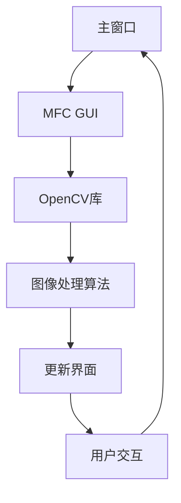

                 

 

### 关键词 Keywords
- OPENCV
- MFC
- 图像处理
- 计算机视觉
- 编程实践
- 图形用户界面

### 摘要 Abstract
本文旨在深入探讨如何利用OpenCV库和Microsoft Foundation Classes（MFC）开发一个图像处理程序。我们将分析OpenCV和MFC各自的核心特性，展示它们在图像处理中的协同作用，并通过实例介绍具体的算法实现和代码分析。此外，文章还将探讨图像处理的实际应用场景，展望未来技术发展的方向和挑战。

## 1. 背景介绍

图像处理是计算机科学和工程中一个重要的研究领域，涉及从图像获取、预处理、增强、分析到特征提取等多个环节。OpenCV（Open Source Computer Vision Library）是一个广泛使用的开源计算机视觉库，提供了丰富的图像处理算法和工具，支持多种编程语言，如C++、Python等。MFC（Microsoft Foundation Classes）是Microsoft提供的C++类库，用于快速开发Windows桌面应用程序。

随着计算机硬件性能的提升和图像处理算法的不断进步，图像处理技术已经广泛应用于多个领域，如医学影像分析、自动驾驶、人脸识别、安全监控、艺术创作等。OpenCV和MFC的结合为开发者提供了一个强大的平台，用于构建功能丰富、高效的图像处理应用程序。

## 2. 核心概念与联系

### 2.1 OpenCV核心概念

OpenCV的核心概念包括图像数据结构、图像操作、滤波、形态学、特征提取等。OpenCV使用一种称为“Mat”的矩阵数据结构来表示图像，这为图像处理算法提供了高效的数据访问和操作方法。

### 2.2 MFC核心概念

MFC提供了一套完整的GUI（图形用户界面）工具和控件，如对话框、菜单、工具栏等，用于构建用户友好的界面。此外，MFC还支持事件驱动编程模型，便于处理用户交互和应用程序逻辑。

### 2.3 OpenCV与MFC的协同工作

在MFC应用程序中，我们可以使用OpenCV库提供的图像处理函数，结合MFC的GUI功能，实现交互式的图像处理程序。具体而言，MFC用于创建和管理窗口、菜单、工具栏等界面元素，而OpenCV用于图像处理算法的实现。

### 2.4 Mermaid流程图



## 3. 核心算法原理 & 具体操作步骤

### 3.1 算法原理概述

图像处理程序的核心算法通常包括图像读取、显示、滤波、边缘检测、特征提取等步骤。OpenCV提供了丰富的函数库来支持这些算法的实现。

### 3.2 算法步骤详解

#### 3.2.1 图像读取

使用OpenCV读取图像文件，将其转换为Mat对象。

```cpp
cv::Mat image = cv::imread("image_path.jpg");
```

#### 3.2.2 图像显示

使用MFC创建窗口并显示图像。

```cpp
CClientDC dc(this);
cv::Mat temp = image.clone();
cv::cvtColor(temp, temp, cv::COLOR_BGR2RGB);
cv::imshow("Image", temp);
```

#### 3.2.3 图像滤波

使用OpenCV的滤波函数进行图像平滑或去噪。

```cpp
cv::Mat filtered_image;
cv::GaussianBlur(image, filtered_image, cv::Size(5, 5), 1.5);
```

#### 3.2.4 边缘检测

使用Canny边缘检测算法。

```cpp
cv::Mat edges;
cv::Canny(image, edges, 50, 150);
```

#### 3.2.5 特征提取

使用SIFT（尺度不变特征变换）算法提取图像特征点。

```cpp
cv::Mat descriptor;
std::vector<cv::KeyPoint> keypoints;
cv::xfeatures2d::SIFT::create()->detectAndCompute(image, cv::noArray(), keypoints, descriptor);
```

### 3.3 算法优缺点

#### 优点：

- **开源**：OpenCV是开源库，可以免费使用。
- **跨平台**：支持多种操作系统，如Windows、Linux、macOS等。
- **高效**：提供了多种优化算法，性能卓越。
- **丰富的函数库**：包含大量图像处理算法，方便开发。

#### 缺点：

- **学习曲线**：对于初学者，可能需要一定时间来熟悉。
- **依赖**：需要安装和配置相关依赖库。

### 3.4 算法应用领域

OpenCV和MFC的结合在以下领域有广泛应用：

- **医学影像分析**：如病变检测、图像分割等。
- **自动驾驶**：如车辆检测、路径规划等。
- **人脸识别**：如身份验证、安全监控等。
- **艺术创作**：如图像风格转换、艺术效果添加等。

## 4. 数学模型和公式

图像处理中的数学模型通常涉及图像滤波、特征提取、形态学操作等。以下是一个简单的图像滤波的数学模型：

### 4.1 数学模型构建

图像滤波的基本模型是一个线性滤波器，其可以表示为：

\[ y(x, y) = \sum_{i, j} h(i, j) \cdot f(x-i, y-j) \]

其中，\( h(i, j) \) 是滤波器的核，\( f(x, y) \) 是输入图像，\( y(x, y) \) 是输出滤波后的图像。

### 4.2 公式推导过程

对于Gaussian滤波器，其核函数可以表示为：

\[ h(i, j) = \frac{1}{2\pi\sigma^2} e^{-\frac{(i-j)^2}{2\sigma^2}} \]

其中，\( \sigma \) 是高斯分布的标准差。

### 4.3 案例分析与讲解

假设我们使用Gaussian滤波器对一幅512x512的图像进行滤波，标准差为1.5，我们可以通过以下步骤实现：

```cpp
cv::Mat kernel = (cv::Mat_<float>(5, 5) <<
    1,  4,  7,  4, 1,
    4, 16, 26, 16, 4,
    7, 26, 41, 26, 7,
    4, 16, 26, 16, 4,
    1,  4,  7,  4, 1);
cv::filter2D(image, filtered_image, CV_32F, kernel, cv::Point(-1, -1), 0, cv::BORDER_DEFAULT);
cv::convertScaleAbs(filtered_image, filtered_image);
```

## 5. 项目实践：代码实例和详细解释说明

### 5.1 开发环境搭建

在开始之前，我们需要搭建一个支持OpenCV和MFC的开发环境。以下是具体的步骤：

1. 安装Visual Studio 2019或更高版本。
2. 安装OpenCV库，可以在OpenCV官网下载预编译的库或者从源代码编译。
3. 在Visual Studio中创建一个新的MFC应用程序项目。

### 5.2 源代码详细实现

以下是实现一个简单的图像滤波程序的主要代码：

```cpp
// main.cpp
#include "stdafx.h"
#include <opencv2/opencv.hpp>
#include <afxwin.h>

using namespace cv;
using namespace std;

int _tmain(int argc, _TCHAR* argv[])
{
    // 读取图像
    Mat image = imread("image_path.jpg", IMREAD_COLOR);
    if (image.empty())
    {
        cout << "图像读取失败！" << endl;
        return -1;
    }

    // 创建高斯滤波器
    Mat kernel = (Mat_<float>(5, 5) <<
        1,  4,  7,  4, 1,
        4, 16, 26, 16, 4,
        7, 26, 41, 26, 7,
        4, 16, 26, 16, 4,
        1,  4,  7,  4, 1);

    // 滤波
    Mat filtered_image;
    filter2D(image, filtered_image, CV_32F, kernel, Point(-1, -1), 0, BORDER_DEFAULT);

    // 显示滤波后的图像
    imshow("原始图像", image);
    imshow("滤波后图像", filtered_image);

    // 等待按键
    waitKey(0);

    return 0;
}
```

### 5.3 代码解读与分析

上述代码首先使用`imread`函数读取图像，然后创建一个高斯滤波器，使用`filter2D`函数进行滤波操作。最后，通过`imshow`函数显示原始图像和滤波后的图像。

### 5.4 运行结果展示

运行程序后，将显示一个窗口，其中包含原始图像和滤波后的图像。用户可以按任意键退出程序。

## 6. 实际应用场景

图像处理技术在多个领域有广泛应用，以下是一些实际应用场景：

- **医学影像**：图像滤波、分割和特征提取在医学影像分析中用于检测和诊断疾病。
- **自动驾驶**：图像处理用于车辆检测、障碍物识别和路径规划。
- **安全监控**：人脸识别和目标检测技术用于监控和监控系统的安全。
- **艺术创作**：图像风格转换和图像修饰技术用于艺术创作和视觉效果增强。

## 7. 工具和资源推荐

### 7.1 学习资源推荐

- **《OpenCV 3.x图像处理实用指南》**：一本适合初学者和中级开发者的好书，涵盖了OpenCV的基础知识和实际应用。
- **OpenCV官网文档**：包含详细的API文档和教程，是学习OpenCV的绝佳资源。

### 7.2 开发工具推荐

- **Visual Studio**：强大的集成开发环境，支持MFC和OpenCV的开发。
- **JetBrains系列**：如PyCharm、IntelliJ IDEA等，对于Python和C++编程都非常友好。

### 7.3 相关论文推荐

- **《深度学习在计算机视觉中的应用》**：综述了深度学习在图像识别和图像处理中的应用。
- **《基于卷积神经网络的图像分类方法研究》**：详细介绍了卷积神经网络在图像分类中的应用。

## 8. 总结：未来发展趋势与挑战

随着深度学习和人工智能技术的快速发展，图像处理技术也在不断进步。未来，图像处理技术将在更多领域得到应用，如增强现实、虚拟现实、智能监控等。然而，随着图像数据量的爆炸性增长，如何高效地处理和分析大规模图像数据将是一个重要的挑战。此外，隐私保护和安全性问题也需要引起足够的重视。

### 8.1 研究成果总结

本文介绍了基于OpenCV和MFC的图像处理程序的开发过程，展示了图像处理算法的实现和代码实例。通过本文，读者可以了解图像处理技术的基本原理和实际应用。

### 8.2 未来发展趋势

未来，图像处理技术将向更深层次的智能化和自动化方向发展，结合深度学习和大数据分析，实现更高效、更准确的图像处理。

### 8.3 面临的挑战

面对图像数据量的爆炸性增长，如何高效地处理和分析大规模图像数据将是一个重要的挑战。此外，隐私保护和安全性问题也需要引起足够的重视。

### 8.4 研究展望

随着技术的不断进步，图像处理技术将在更多领域得到应用，为社会带来更多创新和变革。

## 9. 附录：常见问题与解答

### 9.1 如何在MFC中显示图像？

在MFC中显示图像，首先需要创建一个窗口，然后使用`CClientDC`类来绘制图像。具体步骤如下：

1. 创建窗口：在MFC应用程序的对话框类中，使用`CWnd`的`Create`方法创建窗口。
2. 获取设备上下文：使用`GetDC`方法获取`CClientDC`对象。
3. 绘制图像：将OpenCV读取的图像转换为合适的格式（如RGB），然后使用`DrawBitmap`或`BitBlt`函数将其绘制到窗口中。

### 9.2 如何在OpenCV中使用滤波器？

在OpenCV中，可以使用`filter2D`函数来应用线性滤波器。以下是一个简单的示例：

```cpp
cv::filter2D(image, filtered_image, -1, kernel, Point(-1, -1), 0, cv::BORDER_DEFAULT);
```

这里，`image`是输入图像，`filtered_image`是输出滤波后的图像，`kernel`是滤波器的核，`Point(-1, -1)`表示使用默认的边界填充方式。

### 9.3 如何在MFC中使用OpenCV？

在MFC应用程序中集成OpenCV，需要按照以下步骤操作：

1. 添加OpenCV库到项目：在Visual Studio中，将OpenCV库添加到项目链接器设置中。
2. 包含OpenCV头文件：在C++源文件中包含OpenCV的头文件，如`#include <opencv2/opencv.hpp>`。
3. 使用OpenCV函数：在代码中直接调用OpenCV提供的函数，如`cv::imread`、`cv::Canny`等。

作者：禅与计算机程序设计艺术 / Zen and the Art of Computer Programming
----------------------------------------------------------------


