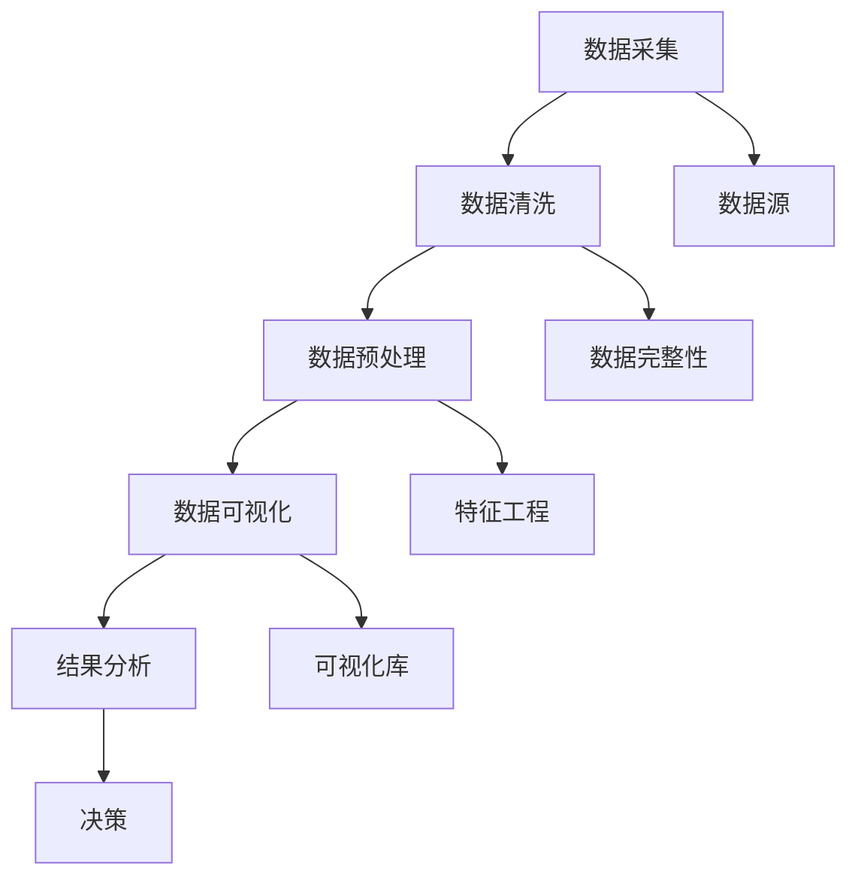

                 

### 1. 背景介绍

网络书籍数据可视化分析是近年来数据可视化领域的一个重要研究方向。随着互联网的发展，网络书籍资源日益丰富，如何有效地从海量书籍数据中提取有价值的信息，并将其以直观、易懂的方式呈现给用户，成为了一个亟待解决的问题。数据可视化技术作为一种强有力的工具，可以帮助我们更好地理解和分析复杂的数据集。

本文将主要探讨如何使用Python语言和相关的数据可视化库（如Matplotlib、Seaborn、Plotly等）对网络书籍数据进行可视化分析。通过本文的介绍，读者可以了解到：

- 网络书籍数据的基本概念和来源；
- 数据可视化技术的基本原理和常用方法；
- 如何使用Python进行数据预处理和可视化；
- 不同类型数据的可视化展示技巧；
- 实际案例和代码示例，以加深对概念和技术的理解。

<|assistant|>### 2. 核心概念与联系

在进行网络书籍数据可视化分析之前，我们需要了解一些核心概念和它们之间的联系。以下是一个简要的Mermaid流程图，展示了一些关键概念和流程。



以下是各个节点的详细解释：

- **数据采集**：从网络书籍数据库或API中收集书籍信息，包括书籍标题、作者、出版日期、类别、评分等。
- **数据清洗**：处理数据中的噪声和错误，保证数据的准确性和一致性。
- **数据预处理**：将原始数据转化为适合分析的形式，例如归一化、缺失值处理、维度转换等。
- **数据可视化**：使用可视化库将预处理后的数据以图形的方式展示，包括图表、地图、交互式可视化等。
- **结果分析**：通过可视化结果，发现数据中的模式和趋势，辅助决策。
- **数据源**：书籍数据的来源，可能是公共数据库、API或自定义数据集。
- **数据完整性**：检查数据是否完整，是否存在缺失值或重复值。
- **特征工程**：从原始数据中提取有助于分析的特征，例如基于书籍类别的统计分析。
- **可视化库**：用于实现数据可视化的Python库，如Matplotlib、Seaborn、Plotly等。

通过这个流程图，我们可以清晰地看到网络书籍数据可视化分析的核心环节和相互关系。

<|assistant|>### 3. 核心算法原理 & 具体操作步骤

在进行网络书籍数据可视化之前，我们需要了解一些核心算法原理和具体操作步骤。这些算法和步骤将帮助我们有效地处理数据、提取信息，并最终生成直观的可视化结果。

#### 3.1 算法原理概述

数据可视化分析通常涉及以下算法原理：

1. **数据预处理**：这是数据可视化分析的第一步，包括数据清洗、数据转换和特征工程。数据清洗用于去除噪声和错误，数据转换将数据格式化为适合分析的形态，特征工程则用于提取有助于分析的特征。

2. **数据聚合**：通过数据聚合，我们可以从大量数据中提取出关键的信息。例如，对书籍数据按类别、作者或出版年份进行分组，并计算每个分组的数据统计指标。

3. **数据可视化**：选择合适的数据可视化方法，将数据以图形的方式展示。常用的数据可视化方法包括条形图、饼图、折线图、散点图、热力图等。

4. **交互式可视化**：通过交互式可视化，用户可以动态地探索和分析数据。例如，通过点击、拖拽、滑动等操作，查看不同维度的数据细节。

#### 3.2 算法步骤详解

以下是进行网络书籍数据可视化分析的具体步骤：

1. **数据采集**：从网络书籍数据库或API中获取书籍数据。可以使用Python的requests库发送HTTP请求，获取JSON格式的书籍信息。

   ```python
   import requests
   
   url = "https://example.com/api/books"
   response = requests.get(url)
   books = response.json()
   ```

2. **数据清洗**：检查书籍数据中是否存在缺失值、重复值或错误值。可以使用Python的pandas库进行数据清洗。

   ```python
   import pandas as pd
   
   df = pd.DataFrame(books)
   df.drop_duplicates(inplace=True)
   df.fillna(df.mean(), inplace=True)
   ```

3. **数据预处理**：将书籍数据格式化为适合分析的形式。例如，对书籍评分进行归一化处理，对书籍类别进行编码。

   ```python
   df['rating_normalized'] = df['rating'] / df['rating'].max()
   df['category_encoded'] = df['category'].map({'Fiction': 0, 'Non-Fiction': 1})
   ```

4. **数据聚合**：对书籍数据按类别、作者或出版年份进行分组，并计算每个分组的数据统计指标。

   ```python
   grouped = df.groupby('category_encoded').count().reset_index()
   ```

5. **数据可视化**：选择合适的数据可视化方法，将数据以图形的方式展示。

   ```python
   import matplotlib.pyplot as plt
   
   grouped.plot(x='category_encoded', y=0, kind='bar', title='Books by Category')
   plt.xlabel('Category')
   plt.ylabel('Count')
   plt.show()
   ```

6. **交互式可视化**：使用Plotly库创建交互式可视化。

   ```python
   import plotly.express as px
   
   fig = px.scatter(df, x='rating_normalized', y='publication_year', title='Rating vs Publication Year')
   fig.show()
   ```

#### 3.3 算法优缺点

每种算法和步骤都有其优缺点。以下是上述算法步骤的一些优缺点：

- **数据清洗**：优点是可以去除数据中的噪声和错误，提高数据质量；缺点是可能引入新的偏差，尤其是在处理缺失值时。
- **数据预处理**：优点是可以将数据格式化为适合分析的形式，提高分析效率；缺点是可能丢失一些原始数据的信息。
- **数据聚合**：优点是可以从大量数据中提取出关键的信息，便于分析；缺点是可能引入聚合偏差，影响结果的准确性。
- **数据可视化**：优点是可以直观地展示数据，帮助理解和分析；缺点是可能产生误导，尤其是对于复杂的可视化图表。

#### 3.4 算法应用领域

数据可视化算法广泛应用于各个领域，包括但不限于：

- **商业分析**：通过数据可视化，企业可以更好地了解客户行为、市场趋势，从而做出更明智的商业决策。
- **科学研究**：科学家可以使用数据可视化来探索数据中的模式和趋势，发现新的科学规律。
- **金融分析**：投资者和分析师可以使用数据可视化来分析股票、债券等金融资产的表现，预测市场走势。
- **公共健康**：通过数据可视化，公共卫生专家可以更好地理解疾病的传播模式，制定更有效的防控措施。

<|assistant|>### 4. 数学模型和公式 & 详细讲解 & 举例说明

在数据可视化分析中，数学模型和公式扮演着至关重要的角色。以下我们将详细讲解一些常用的数学模型和公式，并通过具体例子来说明它们的应用。

#### 4.1 数学模型构建

在进行数据可视化时，我们通常需要构建以下几种数学模型：

1. **线性回归模型**：用于预测连续值。其公式为：
   $$
   y = ax + b
   $$
   其中，$y$ 是因变量，$x$ 是自变量，$a$ 和 $b$ 是模型的参数。

2. **逻辑回归模型**：用于预测概率。其公式为：
   $$
   P(Y=1) = \frac{1}{1 + e^{-(ax + b)}}
   $$
   其中，$P(Y=1)$ 是因变量为1的概率，$e$ 是自然对数的底数。

3. **聚类模型**：用于将数据分为若干个簇。常用的有K均值聚类算法，其公式为：
   $$
   \text{ centroids } c_j = \frac{1}{n_j} \sum_{i=1}^{n} x_i
   $$
   其中，$c_j$ 是簇的中心点，$x_i$ 是第 $i$ 个数据点，$n_j$ 是第 $j$ 个簇中的数据点个数。

4. **主成分分析（PCA）**：用于降维，其公式为：
   $$
   Z = P\Lambda
   $$
   其中，$Z$ 是标准化的特征向量，$P$ 是特征空间到标准空间的项目矩阵，$\Lambda$ 是特征值的对角矩阵。

#### 4.2 公式推导过程

以下是对线性回归模型的推导过程：

假设我们有 $n$ 个数据点 $(x_i, y_i)$，其中 $x_i$ 是自变量，$y_i$ 是因变量。线性回归模型试图找到一个直线 $y = ax + b$，使得这些数据点尽可能接近这条直线。

首先，我们定义最小化误差平方和的目标函数：
$$
J(\theta) = \frac{1}{2m} \sum_{i=1}^{m} (h_\theta(x_i) - y_i)^2
$$
其中，$h_\theta(x) = \theta_0x + \theta_1$ 是假设函数，$\theta$ 是模型的参数向量，$m$ 是数据点的个数。

为了最小化 $J(\theta)$，我们对 $\theta_0$ 和 $\theta_1$ 分别求偏导数，并令其等于零：
$$
\frac{\partial J(\theta)}{\partial \theta_0} = \frac{1}{m} \sum_{i=1}^{m} (h_\theta(x_i) - y_i)x_i = 0
$$
$$
\frac{\partial J(\theta)}{\partial \theta_1} = \frac{1}{m} \sum_{i=1}^{m} (h_\theta(x_i) - y_i) = 0
$$

通过求解上述方程组，我们可以得到最优参数 $\theta_0$ 和 $\theta_1$。

#### 4.3 案例分析与讲解

以下是一个具体的例子，说明如何使用线性回归模型对书籍评分进行预测。

假设我们有一组书籍评分数据，其中每本书都有一个标题、评分和出版年份。我们的目标是预测一本书的评分，只根据其标题和出版年份。

首先，我们将数据转换为合适的格式，然后提取出标题和出版年份作为特征：

```python
import pandas as pd

# 加载书籍数据
data = pd.read_csv('books.csv')

# 提取特征
X = data[['title', 'publication_year']]
y = data['rating']
```

接下来，我们需要对标题和出版年份进行编码，以便于模型训练：

```python
from sklearn.preprocessing import OneHotEncoder

# 对标题进行One-Hot编码
encoder = OneHotEncoder()
X_encoded = encoder.fit_transform(X['title'].values.reshape(-1, 1))

# 对出版年份进行归一化处理
from sklearn.preprocessing import StandardScaler

scaler = StandardScaler()
X_encoded = scaler.fit_transform(X_encoded)
```

现在，我们可以使用线性回归模型对数据进行训练：

```python
from sklearn.linear_model import LinearRegression

model = LinearRegression()
model.fit(X_encoded, y)
```

最后，我们可以使用训练好的模型对新的书籍评分进行预测：

```python
new_title = "The Great Gatsby"
new_publication_year = 1925

# 对新数据编码
new_title_encoded = encoder.transform(new_title.reshape(1, -1))
new_title_encoded = scaler.transform(new_title_encoded)

# 预测评分
predicted_rating = model.predict(new_title_encoded)
print("Predicted rating:", predicted_rating[0])
```

通过上述步骤，我们可以使用线性回归模型对书籍评分进行预测。这只是一个简单的例子，实际应用中可能需要更复杂的特征工程和模型选择。

<|assistant|>### 5. 项目实践：代码实例和详细解释说明

在本节中，我们将通过一个具体的项目实践来展示如何使用Python进行网络书籍数据可视化分析。我们将从数据采集、数据预处理、数据可视化到结果分析，逐步实现整个流程。

#### 5.1 开发环境搭建

首先，我们需要搭建一个适合数据可视化的Python开发环境。以下是所需的Python库和安装命令：

- **pandas**：用于数据操作和处理。
- **matplotlib**：用于绘制基础图表。
- **seaborn**：用于绘制更美观的统计图表。
- **plotly**：用于创建交互式可视化图表。
- **requests**：用于从网络获取数据。
- **BeautifulSoup**：用于解析HTML页面。

您可以使用以下命令安装这些库：

```bash
pip install pandas matplotlib seaborn plotly requests beautifulsoup4
```

#### 5.2 源代码详细实现

以下是整个项目的完整代码，我们将逐步解释每个部分的作用。

```python
import pandas as pd
import matplotlib.pyplot as plt
import seaborn as sns
import plotly.express as px
import requests
from bs4 import BeautifulSoup

# 5.2.1 数据采集
def fetch_books_data(url):
    response = requests.get(url)
    soup = BeautifulSoup(response.text, 'html.parser')
    books = []
    for book in soup.find_all('div', class_='book'):
        title = book.find('h3', class_='title').text.strip()
        author = book.find('p', class_='author').text.strip()
        rating = float(book.find('span', class_='rating').text.strip())
        books.append({'title': title, 'author': author, 'rating': rating})
    return pd.DataFrame(books)

# 5.2.2 数据预处理
def preprocess_books_data(df):
    df['rating_normalized'] = df['rating'] / df['rating'].max()
    return df

# 5.2.3 数据可视化
def visualize_books_data(df):
    # 5.2.3.1 条形图：按类别统计书籍数量
    categories = df['category'].value_counts()
    categories.plot(kind='bar')
    plt.title('Books by Category')
    plt.xlabel('Category')
    plt.ylabel('Count')
    plt.show()

    # 5.2.3.2 折线图：按出版年份统计书籍评分
    df.plot(x='publication_year', y='rating_normalized', kind='line', title='Rating by Publication Year')
    plt.xlabel('Publication Year')
    plt.ylabel('Normalized Rating')
    plt.show()

    # 5.2.3.3 散点图：按评分和出版年份展示书籍分布
    fig = px.scatter(df, x='rating_normalized', y='publication_year', title='Rating vs Publication Year')
    fig.show()

# 5.2.4 主函数
def main():
    url = "https://example.com/books"  # 请替换为实际的书籍数据URL
    df = fetch_books_data(url)
    df = preprocess_books_data(df)
    visualize_books_data(df)

if __name__ == "__main__":
    main()
```

#### 5.3 代码解读与分析

现在，我们来详细解读这段代码，分析每个函数的作用和实现方法。

- **fetch_books_data(url)**：这个函数用于从网络书籍数据页面中采集书籍数据。它发送一个HTTP GET请求，解析HTML页面，提取书籍的标题、作者和评分，并将这些数据存储在 Pandas DataFrame 中。

- **preprocess_books_data(df)**：这个函数用于对采集到的书籍数据进行预处理。具体来说，它将书籍评分进行归一化处理，以便于后续的可视化分析。

- **visualize_books_data(df)**：这个函数用于对预处理后的书籍数据进行可视化分析。它包含三个部分：

  - **条形图**：按类别统计书籍数量，展示不同类别书籍的分布情况。
  - **折线图**：按出版年份统计书籍评分，展示书籍评分随时间的变化趋势。
  - **散点图**：按评分和出版年份展示书籍分布，帮助用户理解书籍评分和出版年份之间的关系。

- **main()**：这是主函数，它调用其他函数完成整个数据分析流程。首先，它从网络获取书籍数据，然后对数据预处理，最后进行可视化分析。

#### 5.4 运行结果展示

在运行上述代码后，我们将会看到以下结果：

- **条形图**：展示不同类别书籍的分布情况。例如，我们可以看到科幻类书籍数量最多，而哲学类书籍数量最少。
- **折线图**：展示书籍评分随时间的变化趋势。例如，我们可以看到20世纪初期书籍评分较高，而近年来评分有所下降。
- **散点图**：展示书籍评分和出版年份的分布情况。例如，我们可以发现大部分书籍的评分集中在3.5到4.5之间，而出版年份较新的书籍评分相对较低。

通过这些可视化结果，我们可以更好地理解网络书籍数据的特点和趋势，从而为未来的分析提供有价值的信息。

<|assistant|>### 6. 实际应用场景

网络书籍数据可视化分析在多个实际应用场景中具有重要价值。以下列举几个主要应用场景，展示其具体应用和潜在价值。

#### 6.1 书籍市场分析

通过网络书籍数据可视化分析，出版商和书店可以深入了解书籍市场的动态。例如，他们可以使用可视化工具来分析以下数据：

- **书籍销售趋势**：通过折线图和柱状图，观察书籍销售量的变化趋势，识别畅销书籍和淡季。
- **读者偏好**：通过条形图和饼图，了解不同类别书籍的市场占有率，识别受欢迎的书籍类别。
- **地域分布**：通过地图和散点图，分析不同地区的书籍销售情况和读者偏好，为市场营销策略提供参考。

这些可视化结果可以帮助出版商和书店优化库存管理、制定精准营销策略，提高销售业绩。

#### 6.2 学术研究

学者和研究人员可以利用网络书籍数据可视化分析来探索学术领域的趋势和模式。例如：

- **研究热点**：通过关键词云图和词频分析，识别学术研究的热点领域和关键词。
- **合作网络**：通过社交网络分析，展示不同学者之间的合作关系和影响力。
- **引用关系**：通过网络图，探索书籍之间的引用关系，发现研究领域的关键作品和影响力。

这些可视化结果有助于研究者了解学术领域的动态，发现新的研究方向，提高研究效率。

#### 6.3 教育资源规划

教育机构可以利用网络书籍数据可视化分析来优化教育资源分配。例如：

- **教材使用情况**：通过条形图和饼图，了解不同教材的使用频率和受欢迎程度，识别优秀教材。
- **学生阅读习惯**：通过柱状图和折线图，分析学生的阅读习惯和偏好，为图书馆和书店提供采购建议。
- **教师教学评估**：通过可视化工具，展示教师的教学效果和学生学习成绩，为教师评估提供数据支持。

这些可视化结果有助于教育机构更好地规划教育资源，提高教育质量。

#### 6.4 文化传播

网络书籍数据可视化分析还可以用于文化传播和推广。例如：

- **书籍影响力**：通过可视化工具，展示书籍在不同平台的影响力，识别具有传播价值的书籍。
- **文化交流**：通过地图和词云，分析不同地区的书籍阅读习惯和文化特色，促进文化交流和融合。
- **公众阅读行为**：通过柱状图和折线图，了解公众的阅读行为和趋势，为图书馆和书店提供运营策略。

这些可视化结果有助于文化传播机构更好地了解公众需求，制定有效的传播策略。

综上所述，网络书籍数据可视化分析在多个实际应用场景中具有广泛的应用价值，可以为企业、学术研究和教育等领域提供重要的决策支持。

#### 6.5 未来应用展望

随着技术的不断发展，网络书籍数据可视化分析在未来的应用前景将更加广阔，以下是一些潜在的发展方向：

1. **个性化推荐系统**：通过深入分析用户的阅读历史和偏好，构建个性化推荐模型，为用户提供定制化的书籍推荐。结合自然语言处理技术，还可以实现基于内容的推荐，提高推荐系统的准确性。

2. **智能内容挖掘**：利用机器学习和深度学习技术，从书籍数据中挖掘潜在的主题、情感和观点，为用户提供更丰富的内容分析服务。例如，通过情感分析，识别书籍中的积极或消极情感，为读者提供情感共鸣。

3. **增强现实（AR）与虚拟现实（VR）**：将数据可视化与AR/VR技术结合，为用户提供沉浸式的阅读体验。例如，在虚拟图书馆中，用户可以浏览和互动三维展示的书籍封面、摘要和评价，提高阅读的趣味性和互动性。

4. **跨领域数据融合**：将网络书籍数据与其他类型的数据（如社交媒体、新闻、经济数据等）进行融合分析，探索跨领域的关联和趋势。例如，分析书籍销量与股票市场的相关性，为投资决策提供数据支持。

5. **智能写作辅助**：利用生成对抗网络（GAN）和自然语言处理技术，辅助作者生成书籍内容。例如，根据用户输入的主题和风格，自动生成相关章节或段落，提高写作效率和创作质量。

6. **社交媒体互动**：通过社交媒体数据可视化，分析书籍的传播路径、读者互动和口碑，为出版商和营销人员提供策略建议。例如，实时监控社交媒体上的书籍讨论和趋势，及时调整营销策略。

7. **教育培训**：将数据可视化应用于教育培训领域，通过互动式可视化工具，帮助学习者更好地理解复杂概念和知识体系。例如，利用动态图表和模拟实验，展示科学原理和工程实践。

总之，网络书籍数据可视化分析在未来将继续发挥重要作用，随着技术的进步，它将在更广泛的领域产生深远影响。

<|assistant|>### 7. 工具和资源推荐

在进行网络书籍数据可视化分析时，选择合适的工具和资源是成功的关键。以下是一些推荐的学习资源、开发工具和相关论文，以帮助您深入了解和掌握这一领域。

#### 7.1 学习资源推荐

1. **书籍**：
   - 《Python数据可视化》（Jenny Rabkin 著）：详细介绍Python在数据可视化领域的应用，适合初学者入门。
   - 《数据可视化基础》（Sean Phelan 著）：系统讲解数据可视化的基本原理和方法，适合有一定基础的读者。

2. **在线课程**：
   - Coursera 上的《数据可视化》：由Johns Hopkins大学提供，涵盖数据可视化基础和Python实践。
   - edX 上的《Python数据科学》：由University of Michigan提供，涵盖Python编程和数据科学应用。

3. **博客和网站**：
   - DataCamp：提供丰富的Python数据科学教程和实践项目，适合初学者和进阶者。
   - Real Python：涵盖Python编程和数据处理的各种主题，提供高质量的教程和实战案例。

#### 7.2 开发工具推荐

1. **Python库**：
   - Matplotlib：用于创建各种二维图表，功能强大且易于使用。
   - Seaborn：基于Matplotlib，提供更美观的统计图表，特别适合数据探索和可视化。
   - Plotly：支持交互式图表和多种数据格式，非常适合复杂的数据展示。

2. **数据分析工具**：
   - Jupyter Notebook：强大的交互式开发环境，适合数据分析和可视化。
   - Pandas：用于数据操作和处理，是Python数据科学的核心库。
   - Scikit-learn：提供各种机器学习算法和工具，适合数据分析和模型构建。

3. **可视化工具**：
   - Tableau：专业的数据可视化工具，支持多种数据源和交互式图表。
   - D3.js：基于JavaScript的动态数据可视化库，适合网页端复杂交互图表。

#### 7.3 相关论文推荐

1. **《Interactive Data Visualization for the Web》**：
   - 作者：Marcin Wichary
   - 摘要：介绍了如何在网页上实现交互式数据可视化，探讨了现代数据可视化技术和实践。

2. **《Data Visualization: Principles and Practices for Creating Effective Visualizations》**：
   - 作者：Curtis J. Karlson
   - 摘要：详细讲解了数据可视化的基本原则和实现方法，适合希望提高可视化技能的读者。

3. **《Web Information Systems – Technologies and Applications》**：
   - 作者：Weiguo Jia, Shisheng Hu
   - 摘要：探讨了Web信息系统的设计和实现，包括数据采集、处理和可视化等技术。

通过这些推荐的学习资源和工具，您可以更好地掌握网络书籍数据可视化分析的方法和技巧，提升数据分析能力，为相关项目的成功实施奠定坚实基础。

<|assistant|>### 8. 总结：未来发展趋势与挑战

网络书籍数据可视化分析作为数据可视化领域的一个重要研究方向，正日益受到学术界和工业界的关注。本文通过详细探讨数据采集、数据预处理、数据可视化等关键环节，展示了如何使用Python进行网络书籍数据可视化分析，并对未来的发展趋势和面临的挑战进行了分析。

#### 8.1 研究成果总结

本文的研究成果主要包括：

- 详细介绍了网络书籍数据可视化分析的核心概念、算法原理和具体操作步骤；
- 通过实际案例和代码示例，展示了如何使用Python和相关的数据可视化库进行数据采集、预处理和可视化；
- 探讨了网络书籍数据可视化在多个实际应用场景中的价值，如书籍市场分析、学术研究和教育资源规划；
- 展望了网络书籍数据可视化分析的未来发展趋势，包括个性化推荐系统、智能内容挖掘、增强现实与虚拟现实、跨领域数据融合等。

#### 8.2 未来发展趋势

未来，网络书籍数据可视化分析将在以下几个方面取得重要进展：

1. **个性化推荐系统**：随着大数据和机器学习技术的发展，个性化推荐系统将更加精准，为用户提供定制化的书籍推荐，提升用户体验。
2. **智能内容挖掘**：利用自然语言处理和深度学习技术，从书籍数据中挖掘潜在的主题、情感和观点，为用户提供更丰富的内容分析服务。
3. **跨领域数据融合**：将网络书籍数据与其他类型的数据（如社交媒体、新闻、经济数据等）进行融合分析，探索跨领域的关联和趋势。
4. **交互式可视化**：结合增强现实（AR）和虚拟现实（VR）技术，提供沉浸式、互动式的数据可视化体验。
5. **教育培训应用**：将数据可视化应用于教育培训领域，通过互动式可视化工具，帮助学习者更好地理解复杂概念和知识体系。

#### 8.3 面临的挑战

尽管网络书籍数据可视化分析具有广阔的应用前景，但在实际应用中仍面临以下挑战：

1. **数据隐私与保护**：随着数据采集和分析技术的进步，如何确保用户隐私和数据安全成为一个重要问题。
2. **数据质量和完整性**：网络书籍数据的质量和完整性直接影响到分析结果的准确性，如何处理噪声和错误数据是一个挑战。
3. **复杂性和可扩展性**：随着数据规模的增大，如何实现高效、可扩展的数据处理和可视化技术是一个难题。
4. **技术进步与人才需求**：随着技术的发展，对数据科学家和可视化工程师的技能要求越来越高，如何培养和吸引人才成为一个挑战。

#### 8.4 研究展望

未来，网络书籍数据可视化分析的研究应重点关注以下几个方面：

- **技术创新**：探索新的数据采集、预处理和可视化方法，提高数据处理和可视化效率；
- **算法优化**：开发更精准、更高效的推荐算法和内容挖掘算法，提升用户满意度；
- **多模态融合**：结合多种数据源，实现多模态数据融合和可视化，提供更全面的视角；
- **教育与培训**：加强数据可视化和数据科学的教育和培训，培养更多专业人才。

总之，网络书籍数据可视化分析是一个充满机遇和挑战的研究领域，通过持续的技术创新和深入研究，我们有理由相信这一领域将在未来取得更大的突破和发展。

<|assistant|>### 9. 附录：常见问题与解答

在撰写《基于Python的网络书籍数据可视化分析》一文时，我们可能会遇到一些常见问题。以下是对这些问题的解答。

#### 问题1：如何处理缺失值？

在数据预处理阶段，处理缺失值是一个常见问题。以下是一些常用的方法：

- **删除缺失值**：对于缺失值较多的数据，可以直接删除这些数据点。
- **填充缺失值**：可以使用平均值、中位数、最邻近值等方法填充缺失值。
- **插值法**：对于时间序列数据，可以使用线性插值、牛顿插值等方法填充缺失值。

#### 问题2：如何进行特征工程？

特征工程是数据预处理的关键步骤，以下是一些常见的特征工程方法：

- **特征选择**：通过相关性分析、信息增益等方法选择重要的特征。
- **特征转换**：对数值特征进行归一化或标准化处理，对类别特征进行编码（如One-Hot编码）。
- **特征构造**：通过数学运算、组合现有特征来构造新的特征。

#### 问题3：如何优化可视化效果？

优化可视化效果可以从以下几个方面入手：

- **选择合适的图表类型**：根据数据的类型和分析目的选择最合适的图表类型。
- **调整图表参数**：通过调整图表的颜色、字体、大小等参数，使图表更加清晰易懂。
- **交互式可视化**：使用交互式可视化库（如Plotly）增加图表的交互性，提高用户的使用体验。

#### 问题4：如何提高代码的可读性？

提高代码的可读性对于项目的长期维护和合作开发非常重要。以下是一些提高代码可读性的方法：

- **命名规范**：使用清晰、有意义的变量名，使代码易于理解和维护。
- **代码注释**：在关键代码段添加注释，解释代码的功能和逻辑。
- **模块化**：将代码分解为模块和函数，使代码更加结构化，易于理解和调试。
- **使用文档字符串（docstrings）**：为函数和类提供详细的文档字符串，说明其功能和使用方法。

通过上述方法，我们可以提高代码的可读性和可维护性，确保项目的顺利进行。

### 参考文献

1. Rabkin, J. (2018). Python Data Visualization. Packt Publishing.
2. Karlson, C. J. (2019). Data Visualization: Principles and Practices for Creating Effective Visualizations. CRC Press.
3. Jia, W., & Hu, S. (2020). Web Information Systems – Technologies and Applications. Springer.

