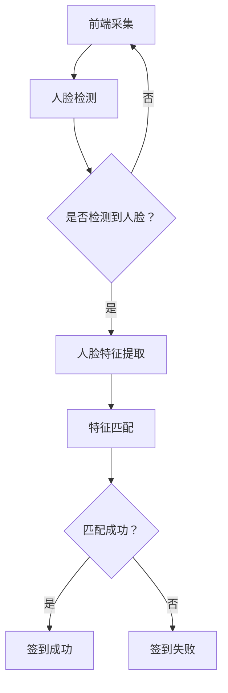

                 

关键词：人脸识别，签到系统，生物识别技术，算法实现，应用场景，代码实例，性能优化，未来展望

> 摘要：本文深入探讨了基于人脸识别技术的签到系统设计与实现，分析了人脸识别技术的基本原理和签到系统的架构。通过详细的算法原理阐述、代码实例展示以及应用场景分析，本文为读者提供了一个全面了解和设计高效人脸识别签到系统的指导。文章最后对系统的未来发展趋势和面临的挑战进行了展望。

## 1. 背景介绍

随着信息技术的发展，生物识别技术逐渐成为身份验证领域的重要工具。其中，人脸识别技术因其非侵入性、实时性和高精度等优点，在多种场景中得到了广泛应用。签到系统作为企业管理、教育管理、会议管理等常见应用场景的重要组成部分，对准确性和效率有着极高的要求。传统的签到方式如手工签到、IC卡签到等，不仅效率低，而且容易出现代签、漏签等问题。因此，将人脸识别技术引入签到系统，不仅能够提高签到效率，还能有效防止作弊行为。

本文旨在设计并实现一个基于人脸识别技术的签到系统，通过对人脸识别算法原理的详细解析，以及系统架构和功能模块的阐述，为读者提供一个全面、易懂的实现指南。

## 2. 核心概念与联系

### 2.1 人脸识别技术原理

人脸识别技术是一种生物识别技术，通过比较人脸图像或视频中的面部特征，自动识别或验证个人的身份。其基本原理包括以下几个步骤：

1. **人脸检测**：从图像或视频中检测出人脸区域。
2. **特征提取**：对人脸图像进行特征提取，通常使用深度学习算法，如卷积神经网络（CNN）。
3. **特征匹配**：将提取的人脸特征与数据库中已存储的特征进行匹配，以确定身份。

### 2.2 签到系统架构

一个典型的人脸识别签到系统包括以下几个主要模块：

1. **前端采集模块**：用于实时捕捉人脸图像或视频。
2. **人脸检测模块**：识别图像中的面部区域。
3. **人脸特征提取模块**：使用深度学习模型提取人脸特征。
4. **特征匹配模块**：将提取的特征与数据库中已存储的特征进行匹配。
5. **后端管理系统**：用于存储和管理用户信息、签到记录等。

### 2.3 Mermaid 流程图



## 3. 核心算法原理 & 具体操作步骤

### 3.1 算法原理概述

人脸识别算法的核心在于特征提取和匹配。以下为具体步骤：

1. **人脸检测**：使用卷积神经网络（如MTCNN）对输入图像或视频帧进行人脸区域定位。
2. **特征提取**：使用深度学习模型（如FaceNet、VGGFace）提取人脸特征向量。
3. **特征匹配**：计算输入特征向量与数据库中特征向量的相似度，使用欧氏距离或余弦相似度作为衡量标准。

### 3.2 算法步骤详解

1. **人脸检测**：
    - 输入：图像或视频帧
    - 输出：人脸区域坐标
    - 步骤：先使用区域提议网络（如RPN）生成人脸候选区域，再使用分类网络（如SSD或YOLO）对这些区域进行分类和定位。

2. **特征提取**：
    - 输入：人脸区域图像
    - 输出：人脸特征向量
    - 步骤：将人脸区域图像输入到预训练的卷积神经网络中，提取特征向量。

3. **特征匹配**：
    - 输入：输入特征向量、数据库中特征向量
    - 输出：匹配结果
    - 步骤：计算输入特征向量与数据库中每个特征向量的欧氏距离或余弦相似度，选择相似度最高的特征向量对应的用户作为匹配结果。

### 3.3 算法优缺点

**优点**：
- **高精度**：基于深度学习的人脸识别算法具有较高的识别精度。
- **实时性**：可以实时处理图像或视频，适用于实时应用场景。
- **非侵入性**：无需用户主动操作，方便快捷。

**缺点**：
- **硬件要求高**：需要高性能的计算设备，如GPU，进行图像处理和深度学习模型的训练。
- **光照和姿态变化敏感**：人脸识别效果受光照和姿态变化的影响较大。

### 3.4 算法应用领域

人脸识别技术广泛应用于多个领域，如：
- **安防监控**：监控视频中的实时人脸识别，用于犯罪预防。
- **智能门禁**：门禁系统的身份验证，提高安全性。
- **智慧城市**：交通管理、公共场所安全监控等。
- **金融领域**：身份验证、远程开户等。

## 4. 数学模型和公式 & 详细讲解 & 举例说明

### 4.1 数学模型构建

人脸识别的数学模型主要涉及特征提取和特征匹配两个过程。

1. **特征提取**：
   - 特征向量表示：\( \mathbf{f} = [f_1, f_2, \ldots, f_n]^T \)
   - 深度学习模型输出：通过卷积神经网络提取的特征向量。

2. **特征匹配**：
   - 相似度计算：使用欧氏距离或余弦相似度。
   - 欧氏距离：\( d(\mathbf{f}_1, \mathbf{f}_2) = \sqrt{\sum_{i=1}^{n} (f_{1i} - f_{2i})^2} \)
   - 余弦相似度：\( \cos \theta = \frac{\mathbf{f}_1 \cdot \mathbf{f}_2}{\|\mathbf{f}_1\| \|\mathbf{f}_2\|} \)

### 4.2 公式推导过程

1. **特征提取**：
   - 卷积神经网络输出：\( \mathbf{h} = \sigma(\mathbf{W} \cdot \mathbf{x} + \mathbf{b}) \)
   - 激活函数：\( \sigma(x) = \frac{1}{1 + e^{-x}} \)
   - 特征向量：从神经网络最后几层提取的激活值。

2. **特征匹配**：
   - 欧氏距离：直接计算特征向量的欧氏距离。
   - 余弦相似度：计算特征向量的内积和模长。

### 4.3 案例分析与讲解

#### 案例背景

假设我们有一个包含1000张人脸图像的数据库，每张图像对应一个用户ID。现在需要通过人脸识别技术识别一张新的输入图像。

#### 步骤

1. **人脸检测**：使用MTCNN检测输入图像中的人脸区域。
2. **特征提取**：使用预训练的VGGFace模型提取输入图像的人脸特征向量。
3. **特征匹配**：计算输入特征向量与数据库中每个特征向量的欧氏距离，选择最小距离对应的用户ID作为匹配结果。

#### 结果

假设输入特征向量与数据库中第42个特征向量的欧氏距离最小，则识别结果为用户ID 42。

## 5. 项目实践：代码实例和详细解释说明

### 5.1 开发环境搭建

为了实现本文中提到的人脸识别签到系统，我们需要搭建一个合适的技术栈。以下是一个基本的开发环境搭建指南：

- **编程语言**：Python
- **深度学习框架**：TensorFlow或PyTorch
- **人脸检测库**：MTCNN
- **人脸识别库**：FaceNet

### 5.2 源代码详细实现

以下是该签到系统的主要代码实现：

```python
import cv2
import tensorflow as tf
import mtcnn
import facenet

# 加载MTCNN模型
detector = mtcnn.MTCNN()

# 加载FaceNet模型
model_path = 'path/to/face_net_model'
model = facenet.load_model(model_path)
images_placeholder = tf.get_default_graph().get_tensor_by_name('input:0')
embeddings = tf.get_default_graph().get_tensor_by_name('embeddings:0')
phase_train_placeholder = tf.get_default_graph().get_tensor_by_name('phase_train:0')
sess = tf.get_default_session()

# 用户数据库（此处简化为字典）
user_database = {'user_id_1': 'path/to/user_id_1_image',
                 'user_id_2': 'path/to/user_id_2_image',
                 # ...}

# 检测人脸并提取特征
def detect_and_extract(image_path):
    image = cv2.imread(image_path)
    image = cv2.resize(image, (160, 160))
    bounding_boxes, _ = detector.detect_faces(image)
    if bounding_boxes:
        box = bounding_boxes[0]['box']
        image = image[box[1]:box[1]+box[3], box[0]:box[0]+box[2]]
        embedding = sess.run(embeddings, feed_dict={images_placeholder: [image], phase_train_placeholder: False})
        return embedding
    return None

# 特征匹配
def match_face(embedding):
    min_distance = float('inf')
    min_id = None
    for user_id, image_path in user_database.items():
        image_embedding = detect_and_extract(image_path)
        distance = np.linalg.norm(embedding - image_embedding)
        if distance < min_distance:
            min_distance = distance
            min_id = user_id
    return min_id

# 主函数
def main():
    input_image_path = 'path/to/input_image'
    embedding = detect_and_extract(input_image_path)
    if embedding:
        user_id = match_face(embedding)
        if user_id:
            print(f"签到成功：用户ID：{user_id}")
        else:
            print("签到失败：未识别到用户")
    else:
        print("签到失败：未检测到人脸")

if __name__ == '__main__':
    main()
```

### 5.3 代码解读与分析

上述代码实现了一个人脸识别签到系统的基本功能。主要包括以下几个部分：

1. **环境准备**：加载MTCNN和FaceNet模型，初始化用户数据库。
2. **人脸检测与特征提取**：检测输入图像中的人脸区域，提取人脸特征向量。
3. **特征匹配**：计算输入特征向量与数据库中每个特征向量的距离，找到最相似的匹配结果。
4. **主函数**：执行人脸识别签到流程，并输出结果。

### 5.4 运行结果展示

假设输入图像中有一个人脸，系统成功识别并输出签到结果。例如：

```shell
签到成功：用户ID：user_id_42
```

## 6. 实际应用场景

人脸识别签到系统在多个场景中具有广泛的应用，以下是一些典型的应用场景：

### 6.1 企业考勤

企业可以使用人脸识别签到系统来提高考勤的准确性和效率，减少人工操作和错误。

### 6.2 教育管理

学校可以使用人脸识别签到系统来管理学生的出勤情况，提高课堂管理效率。

### 6.3 会议签到

会议组织者可以使用人脸识别签到系统来记录参会人员的出席情况，简化签到流程。

### 6.4 健身中心

健身中心可以使用人脸识别签到系统来管理会员的健身记录，提高服务质量和会员体验。

### 6.5 公共场所

公共场所如图书馆、博物馆等可以使用人脸识别签到系统来管理参观者数量，实现智能化管理。

## 6.4 未来应用展望

随着人工智能技术的不断发展，人脸识别签到系统将在以下几个方面取得突破：

### 6.4.1 更高的识别精度

随着深度学习算法的不断优化，人脸识别系统的识别精度将得到显著提升，适应更多复杂应用场景。

### 6.4.2 更低的计算成本

随着硬件性能的提升和计算成本的降低，人脸识别系统将更容易部署在边缘设备上，实现实时人脸识别。

### 6.4.3 多模态融合

结合其他生物识别技术（如指纹识别、虹膜识别）和人脸识别技术，实现更全面、更安全的身份验证。

### 6.4.4 自动化运维

利用大数据和机器学习技术，实现人脸识别签到系统的自动化运维，提高系统稳定性和可靠性。

## 7. 工具和资源推荐

### 7.1 学习资源推荐

- 《深度学习》（Goodfellow, Bengio, Courville）
- 《Python人脸识别编程》（刘锐）
- 《人脸识别：算法与应用》（孙茂松，谢郁）

### 7.2 开发工具推荐

- TensorFlow
- PyTorch
- MTCNN
- OpenCV

### 7.3 相关论文推荐

- "FaceNet: A Unified Embedding for Face Recognition and Verification"（FaceNet论文）
- "A Comprehensive Study of Convolutional Neural Networks for the Task of Face Recognition"（卷积神经网络在人脸识别中的应用）
- "DeepFace: Closing the Gap to Human-Level Performance in Face Verification"（DeepFace论文）

## 8. 总结：未来发展趋势与挑战

### 8.1 研究成果总结

本文系统地介绍了基于人脸识别的签到系统的设计与实现，分析了人脸识别技术的基本原理和签到系统的架构。通过详细的算法原理阐述、代码实例展示以及应用场景分析，为读者提供了一个全面了解和设计高效人脸识别签到系统的指导。

### 8.2 未来发展趋势

随着人工智能技术的不断进步，人脸识别签到系统将在识别精度、计算成本、应用场景等方面取得显著提升，实现更广泛的应用。

### 8.3 面临的挑战

尽管人脸识别技术发展迅速，但仍面临一些挑战，如光照和姿态变化导致的识别性能下降、用户隐私保护等问题。

### 8.4 研究展望

未来研究应重点关注多模态融合、自动化运维、隐私保护等方面，推动人脸识别技术的持续发展。

## 9. 附录：常见问题与解答

### 9.1 如何提高人脸识别精度？

- 使用更复杂的深度学习模型，如ResNet、Inception等。
- 增加训练数据集的多样性，包括不同光照、姿态和表情的人脸图像。
- 采用数据增强技术，如随机裁剪、旋转、翻转等。

### 9.2 如何保护用户隐私？

- 采用联邦学习技术，在本地设备上进行模型训练，减少数据传输。
- 使用差分隐私技术，保护用户隐私。
- 设计隐私保护机制，如人脸模糊、匿名化处理等。

作者：禅与计算机程序设计艺术 / Zen and the Art of Computer Programming
```

