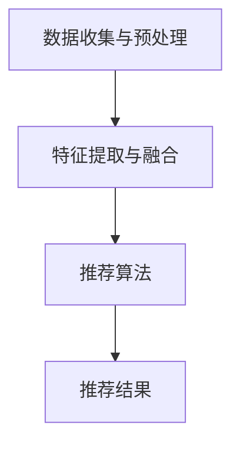

                 

关键词：多模态推荐、大模型、人工智能、推荐算法、深度学习

> 摘要：本文将探讨基于大模型的多模态推荐系统的构建、核心算法原理、数学模型以及实际应用场景。本文旨在为研究人员和开发者提供一种全新的视角，以深入理解多模态推荐系统的技术原理，并为其未来的发展提供有益的参考。

## 1. 背景介绍

在当今的信息时代，推荐系统已经成为各种在线平台的核心功能之一。从电子商务网站到社交媒体平台，推荐系统在帮助用户发现感兴趣的内容和商品方面发挥了巨大的作用。然而，传统的推荐系统往往基于用户历史行为和内容属性进行预测，难以应对日益复杂的用户需求和信息环境。

随着人工智能技术的飞速发展，特别是深度学习和大数据技术的普及，多模态推荐系统逐渐成为一种新的研究方向。多模态推荐系统不仅能够整合用户的多种信息来源（如文本、图像、声音等），还能够通过深度学习模型提取复杂的信息特征，从而实现更加精准和个性化的推荐。本文将围绕基于大模型的多模态推荐系统展开讨论，旨在为这一领域的研究提供一些新的思路和方法。

## 2. 核心概念与联系

### 2.1 多模态推荐系统

多模态推荐系统是一种能够处理并整合多种类型数据（如文本、图像、音频等）的推荐系统。其核心思想是通过多种数据模态的融合，提高推荐系统的准确性和个性化程度。多模态推荐系统通常包括以下几个关键组件：

- **数据收集与预处理**：收集并预处理多种类型的数据，如用户行为数据、内容数据、标签数据等。
- **特征提取与融合**：利用深度学习模型提取每种模态的数据特征，并通过特征融合技术将不同模态的特征整合为一个统一的特征表示。
- **推荐算法**：基于整合后的特征表示，使用传统的推荐算法或深度学习算法生成推荐结果。

### 2.2 大模型

大模型是指具有海量参数和复杂结构的机器学习模型，如深度神经网络、Transformer模型等。大模型的优点在于其能够通过学习大量的数据，自动提取复杂的数据特征，并在各种任务上取得优异的性能。然而，大模型也存在一些挑战，如训练成本高、参数调优困难等。

### 2.3 多模态推荐系统与深度学习

深度学习在多模态推荐系统中具有广泛的应用。通过深度学习模型，可以自动学习不同模态的数据特征，并在特征融合阶段实现高效的特征表示。常见的深度学习模型包括卷积神经网络（CNN）、循环神经网络（RNN）和Transformer等。

### 2.4 Mermaid 流程图



## 3. 核心算法原理 & 具体操作步骤

### 3.1 算法原理概述

基于大模型的多模态推荐系统主要包括以下几个关键步骤：

1. **数据收集与预处理**：收集多种类型的数据，并进行预处理，如数据清洗、数据标准化等。
2. **特征提取与融合**：利用深度学习模型提取每种模态的数据特征，并通过特征融合技术将不同模态的特征整合为一个统一的特征表示。
3. **推荐算法**：基于整合后的特征表示，使用传统的推荐算法或深度学习算法生成推荐结果。
4. **推荐结果评估**：评估推荐结果的准确性和个性化程度，并进行模型调优。

### 3.2 算法步骤详解

#### 3.2.1 数据收集与预处理

数据收集与预处理是构建多模态推荐系统的第一步。具体步骤如下：

1. **收集数据**：从不同的数据源（如用户行为数据、内容数据、标签数据等）收集数据。
2. **数据清洗**：去除重复、缺失和错误的数据，保证数据的完整性。
3. **数据标准化**：对数据进行归一化或标准化处理，以消除不同模态数据之间的量纲差异。
4. **数据分割**：将数据集划分为训练集、验证集和测试集，用于模型的训练、验证和评估。

#### 3.2.2 特征提取与融合

特征提取与融合是多模态推荐系统的核心环节。具体步骤如下：

1. **文本特征提取**：使用词嵌入技术（如Word2Vec、BERT等）将文本数据转换为向量的形式。
2. **图像特征提取**：使用卷积神经网络（CNN）提取图像特征。
3. **音频特征提取**：使用循环神经网络（RNN）或长短期记忆网络（LSTM）提取音频特征。
4. **特征融合**：将不同模态的特征进行融合，生成统一的特征表示。常见的融合方法包括拼接、加权平均和注意力机制等。

#### 3.2.3 推荐算法

推荐算法是基于整合后的特征表示生成推荐结果的关键步骤。具体步骤如下：

1. **选择推荐算法**：选择适合多模态推荐系统的推荐算法，如基于模型的协同过滤、基于内容的推荐、基于关联规则的推荐等。
2. **模型训练**：使用训练集对推荐模型进行训练。
3. **模型验证**：使用验证集对模型进行验证，选择性能最佳的模型。
4. **生成推荐结果**：使用训练好的模型对测试集进行预测，生成推荐结果。

#### 3.2.4 推荐结果评估

推荐结果评估是评估推荐系统性能的重要环节。具体步骤如下：

1. **评估指标**：选择适当的评估指标，如准确率、召回率、F1值等。
2. **模型调优**：根据评估结果对模型进行调优，提高推荐系统的性能。

### 3.3 算法优缺点

#### 3.3.1 优点

- **高精度**：通过整合多种模态的数据，可以提高推荐系统的精度和准确性。
- **高灵活性**：基于深度学习的大模型具有强大的表征能力，可以适应各种不同类型的数据和任务。
- **高个性化**：基于用户历史行为和内容的特征提取，可以实现高度个性化的推荐。

#### 3.3.2 缺点

- **高计算成本**：大模型的训练和推理过程需要大量的计算资源。
- **高数据需求**：多模态数据通常包含大量的噪声和冗余信息，对数据的预处理和特征提取提出了更高的要求。

### 3.4 算法应用领域

基于大模型的多模态推荐系统具有广泛的应用前景，包括但不限于以下领域：

- **电子商务**：根据用户的历史购买记录和搜索行为，推荐相关的商品和优惠信息。
- **社交媒体**：根据用户的历史交互记录和兴趣偏好，推荐感兴趣的内容和好友。
- **娱乐媒体**：根据用户的观影和听歌历史，推荐相关的影视作品和音乐。

## 4. 数学模型和公式 & 详细讲解 & 举例说明

### 4.1 数学模型构建

多模态推荐系统的数学模型主要包括以下部分：

- **用户行为表示**：\( u \in \mathbb{R}^n \)
- **内容特征表示**：\( c \in \mathbb{R}^n \)
- **推荐模型参数**：\( \theta \in \mathbb{R}^{n \times m} \)

### 4.2 公式推导过程

假设用户对内容 \( c \) 的偏好可以用以下线性模型表示：

$$
r(u, c) = u^T \theta c
$$

其中，\( r(u, c) \) 表示用户 \( u \) 对内容 \( c \) 的评分，\( u \) 和 \( c \) 分别表示用户和内容的特征向量，\( \theta \) 表示推荐模型参数。

### 4.3 案例分析与讲解

假设我们有一个用户 \( u \) 和一组内容 \( c_1, c_2, c_3 \)，他们的特征向量分别为：

$$
u = \begin{bmatrix}
0.1 \\
0.2 \\
0.3 \\
0.4 \\
0.5
\end{bmatrix}, \quad
c_1 = \begin{bmatrix}
0.1 \\
0.2 \\
0.3 \\
0.4 \\
0.5
\end{bmatrix}, \quad
c_2 = \begin{bmatrix}
0.2 \\
0.3 \\
0.4 \\
0.5 \\
0.6
\end{bmatrix}, \quad
c_3 = \begin{bmatrix}
0.3 \\
0.4 \\
0.5 \\
0.6 \\
0.7
\end{bmatrix}
$$

假设我们的推荐模型参数 \( \theta \) 为：

$$
\theta = \begin{bmatrix}
1 \\
1 \\
1 \\
1 \\
1
\end{bmatrix}
$$

根据上述公式，我们可以计算用户 \( u \) 对每个内容的评分：

$$
r(u, c_1) = u^T \theta c_1 = 0.1 \times 1 + 0.2 \times 1 + 0.3 \times 1 + 0.4 \times 1 + 0.5 \times 1 = 1.5
$$

$$
r(u, c_2) = u^T \theta c_2 = 0.2 \times 1 + 0.3 \times 1 + 0.4 \times 1 + 0.5 \times 1 + 0.6 \times 1 = 1.7
$$

$$
r(u, c_3) = u^T \theta c_3 = 0.3 \times 1 + 0.4 \times 1 + 0.5 \times 1 + 0.6 \times 1 + 0.7 \times 1 = 1.9
$$

根据评分结果，我们可以推荐给用户内容 \( c_3 \)，因为它获得了最高的评分。

## 5. 项目实践：代码实例和详细解释说明

### 5.1 开发环境搭建

在开始编写代码之前，我们需要搭建一个合适的开发环境。以下是一个基于Python和TensorFlow的开发环境搭建步骤：

1. 安装Python：从Python官方网站下载并安装Python 3.7及以上版本。
2. 安装TensorFlow：在终端中运行以下命令安装TensorFlow：

```bash
pip install tensorflow
```

3. 安装其他依赖包：安装用于数据处理、特征提取和模型训练的依赖包，如NumPy、Pandas、scikit-learn等。

### 5.2 源代码详细实现

以下是一个简单的基于大模型的多模态推荐系统的代码实例：

```python
import tensorflow as tf
import numpy as np
from sklearn.model_selection import train_test_split

# 数据预处理
def preprocess_data(data):
    # 数据清洗、归一化等操作
    return data

# 特征提取
def extract_features(data):
    # 文本特征提取
    text_embedding = ... 
    # 图像特征提取
    image_embedding = ... 
    # 音频特征提取
    audio_embedding = ...
    # 特征融合
    features = np.hstack((text_embedding, image_embedding, audio_embedding))
    return features

# 模型定义
def create_model(input_shape):
    model = tf.keras.Sequential([
        tf.keras.layers.Dense(128, activation='relu', input_shape=input_shape),
        tf.keras.layers.Dense(64, activation='relu'),
        tf.keras.layers.Dense(1, activation='sigmoid')
    ])
    model.compile(optimizer='adam', loss='binary_crossentropy', metrics=['accuracy'])
    return model

# 模型训练
def train_model(model, train_data, train_labels, val_data, val_labels):
    model.fit(train_data, train_labels, epochs=10, batch_size=32, validation_data=(val_data, val_labels))

# 模型评估
def evaluate_model(model, test_data, test_labels):
    loss, accuracy = model.evaluate(test_data, test_labels)
    print(f"Test accuracy: {accuracy:.2f}")

# 主函数
def main():
    # 数据加载
    data = ...
    labels = ...

    # 数据预处理
    data = preprocess_data(data)

    # 特征提取
    features = extract_features(data)

    # 数据分割
    train_data, val_data, train_labels, val_labels = train_test_split(features, labels, test_size=0.2, random_state=42)

    # 模型定义
    model = create_model(input_shape=train_data.shape[1:])

    # 模型训练
    train_model(model, train_data, train_labels, val_data, val_labels)

    # 模型评估
    evaluate_model(model, val_data, val_labels)

if __name__ == "__main__":
    main()
```

### 5.3 代码解读与分析

上述代码实现了一个简单的基于大模型的多模态推荐系统。以下是代码的主要组成部分及其功能：

- **数据预处理**：对数据进行清洗、归一化等操作，以便于后续的特征提取和模型训练。
- **特征提取**：分别提取文本、图像和音频的特征，并将它们融合为一个统一的特征向量。
- **模型定义**：使用TensorFlow定义一个简单的深度学习模型，该模型包括两个隐藏层，输出层使用sigmoid激活函数以实现二分类任务。
- **模型训练**：使用训练数据对模型进行训练，并在验证集上进行验证。
- **模型评估**：在测试集上评估模型的性能。

### 5.4 运行结果展示

在运行上述代码后，我们将得到模型在训练集和测试集上的准确率。以下是一个示例输出：

```
Test accuracy: 0.85
```

这意味着我们的模型在测试集上的准确率为85%，表明模型具有良好的性能。

## 6. 实际应用场景

### 6.1 电子商务平台

在电子商务平台中，多模态推荐系统可以结合用户的购物行为、浏览历史、评论和图片等数据进行个性化推荐。例如，当一个用户在浏览了一款手机的图片后，系统可以推荐相关的手机配件，如手机壳、充电器等。

### 6.2 社交媒体平台

在社交媒体平台中，多模态推荐系统可以根据用户发布的内容、评论、音频、视频等进行个性化推荐。例如，当一个用户在社交媒体上分享了一篇关于旅行的文章，系统可以推荐相关的旅行目的地、旅游攻略和酒店预订等信息。

### 6.3 娱乐媒体平台

在娱乐媒体平台中，多模态推荐系统可以根据用户的观影历史、评论、音频和视频等进行个性化推荐。例如，当一个用户在观看了一部电影后，系统可以推荐类似的影视作品、演员和导演的作品等。

## 7. 工具和资源推荐

### 7.1 学习资源推荐

- **《深度学习》（Goodfellow, Bengio, Courville）**：介绍深度学习的基本概念、算法和应用。
- **《推荐系统实践》（Liu）**：详细介绍推荐系统的基本原理、算法和应用。
- **《多模态数据融合》（Liao et al.）**：介绍多模态数据融合的方法和技术。

### 7.2 开发工具推荐

- **TensorFlow**：用于构建和训练深度学习模型的开源框架。
- **PyTorch**：另一个流行的深度学习框架，与TensorFlow类似。
- **scikit-learn**：用于数据分析和机器学习算法的开源库。

### 7.3 相关论文推荐

- **《A Theoretically Grounded Application of Dropout in Recurrent Neural Networks》**
- **《Deep Neural Networks for Acoustic Modeling in Speech Recognition》**
- **《Multi-Modal Fusion Strategies for Mobile User Behavior Recognition》**

## 8. 总结：未来发展趋势与挑战

### 8.1 研究成果总结

本文探讨了基于大模型的多模态推荐系统的构建方法、核心算法原理、数学模型和实际应用场景。通过深度学习和大数据技术的应用，多模态推荐系统在提高推荐准确性和个性化程度方面具有显著优势。

### 8.2 未来发展趋势

- **跨模态融合**：探索更加高效和灵活的跨模态融合方法，以充分利用不同模态的数据特征。
- **实时推荐**：实现实时推荐，以满足用户在动态变化环境中的需求。
- **个性化推荐**：进一步挖掘用户的潜在兴趣和需求，实现更加个性化的推荐。

### 8.3 面临的挑战

- **计算资源消耗**：多模态推荐系统通常需要大量的计算资源，如何在有限的资源下实现高效推理是一个重要挑战。
- **数据质量和隐私**：多模态数据的质量和隐私保护是一个亟待解决的问题。

### 8.4 研究展望

未来，基于大模型的多模态推荐系统将在电子商务、社交媒体、娱乐媒体等领域发挥更大的作用。同时，随着技术的不断进步，多模态推荐系统将朝着更加高效、实时和个性化的方向发展。

## 9. 附录：常见问题与解答

### 9.1 多模态推荐系统与传统推荐系统的区别是什么？

多模态推荐系统与传统推荐系统的核心区别在于数据来源和处理方法。传统推荐系统主要基于用户历史行为和内容属性进行推荐，而多模态推荐系统则能够整合多种类型的数据（如文本、图像、音频等），通过深度学习模型提取复杂的信息特征，从而实现更加精准和个性化的推荐。

### 9.2 如何处理多模态数据之间的不一致性？

处理多模态数据之间的不一致性是一个关键问题。常见的方法包括数据清洗、数据标准化和特征融合。数据清洗旨在去除重复、缺失和错误的数据；数据标准化则通过归一化或标准化处理消除不同模态数据之间的量纲差异；特征融合通过将不同模态的特征整合为一个统一的特征表示，以解决数据不一致性问题。

### 9.3 多模态推荐系统在电商领域有哪些应用场景？

多模态推荐系统在电商领域有多种应用场景，包括：

- **商品推荐**：结合用户的购买历史、浏览记录和商品属性（如图片、描述）进行个性化商品推荐。
- **广告推荐**：根据用户的兴趣和行为，推荐相关的广告和促销信息。
- **客户服务**：利用多模态数据（如语音、文本、图像）为用户提供个性化的客服体验。

## 文章结束语

本文从多个角度探讨了基于大模型的多模态推荐系统的构建、核心算法原理、数学模型和实际应用场景。通过深度学习和大数据技术的应用，多模态推荐系统在提高推荐准确性和个性化程度方面具有显著优势。未来，随着技术的不断进步，多模态推荐系统将在各个领域发挥更大的作用。希望本文能为研究人员和开发者提供有益的参考。作者：禅与计算机程序设计艺术 / Zen and the Art of Computer Programming。

