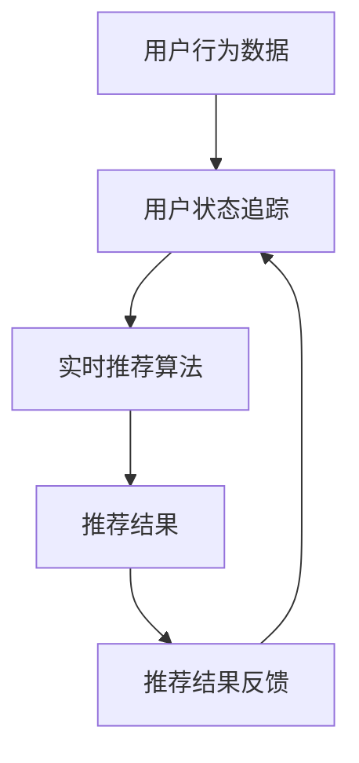

                 

关键词：大模型，推荐系统，实时个性化，深度学习，算法优化

## 摘要

本文深入探讨了基于大模型的推荐系统实时个性化方法。在信息技术迅速发展的时代，个性化推荐系统已经成为了提升用户体验、提高商业价值的重要手段。本文首先介绍了推荐系统的背景和重要性，然后重点讨论了基于大模型的实时个性化方法的核心概念和原理。通过对核心算法的详细分析，本文进一步展示了数学模型的构建和推导过程，并通过实际项目实践提供了代码实例和详细解释。最后，文章探讨了推荐系统在实际应用中的具体场景，并对未来应用进行了展望。

## 1. 背景介绍

### 推荐系统的定义和作用

推荐系统（Recommender System）是一种基于用户兴趣和行为数据，为用户推荐相关内容或商品的系统。其核心目的是通过分析用户的历史行为和偏好，预测用户可能感兴趣的内容，从而提高用户的满意度和参与度。

推荐系统在各种应用场景中发挥着重要作用。在电子商务领域，推荐系统能够帮助商家推荐给用户可能感兴趣的商品，从而提高销售转化率和用户留存率。在社交媒体平台，推荐系统能够为用户推荐感兴趣的内容，增加用户在平台上的停留时间和互动性。在内容分发平台，如YouTube或Netflix，推荐系统能够根据用户的观看历史和偏好，为用户推荐合适的内容，从而提高用户粘性。

### 传统推荐系统与基于大模型的推荐系统

传统的推荐系统主要基于协作过滤（Collaborative Filtering）和基于内容的推荐（Content-based Filtering）。协作过滤通过分析用户之间的相似性来推荐内容，而基于内容的推荐则是基于用户对内容的兴趣标签来推荐类似内容。然而，这些方法存在一定的局限性，如数据稀疏性问题、冷启动问题等。

基于大模型的推荐系统则利用深度学习等先进技术，通过大规模数据训练复杂模型，实现更为精准和个性化的推荐。大模型能够捕捉到用户行为和内容特征的深层关系，从而提供更高质量的推荐结果。

## 2. 核心概念与联系

### 大模型的概念

大模型（Large-scale Model）指的是能够处理大规模数据和复杂任务的模型。在推荐系统中，大模型通常指的是深度学习模型，如神经网络、循环神经网络（RNN）和Transformer等。这些模型能够通过大量数据的学习，捕捉到用户行为和内容特征的深层关系。

### 推荐系统实时个性化的核心概念

实时个性化（Real-time Personalization）是指系统能够在用户交互的瞬间提供个性化的推荐结果。这要求推荐系统能够实时处理用户的输入信息，快速进行模型推理和推荐生成。

实时个性化推荐系统通常包括以下几个核心概念：

1. **用户状态追踪**：通过跟踪用户的实时行为和偏好，构建用户状态模型。
2. **实时推荐算法**：基于用户状态模型和内容特征，实时生成个性化推荐。
3. **推荐结果反馈**：收集用户对推荐结果的反馈，不断优化推荐算法。

### Mermaid 流程图



在这个流程图中，用户行为数据被用来更新用户状态模型，实时推荐算法基于用户状态模型和内容特征生成推荐结果，用户对推荐结果的反馈又进一步优化了用户状态模型。

## 3. 核心算法原理 & 具体操作步骤

### 3.1 算法原理概述

基于大模型的实时个性化推荐系统主要依赖于深度学习技术，其中Transformer模型是一个典型的选择。Transformer模型通过自注意力机制（Self-Attention Mechanism）能够捕捉到输入序列中不同位置的信息关系，从而实现有效的特征提取和关系建模。

### 3.2 算法步骤详解

1. **数据预处理**：对用户行为数据和内容特征进行清洗和预处理，包括数据去重、缺失值填充、特征工程等步骤。
2. **模型构建**：基于Transformer模型架构，设计适合推荐任务的模型结构，包括嵌入层、编码器和解码器等。
3. **模型训练**：使用预处理的用户行为数据和内容特征进行模型训练，通过反向传播算法和优化器调整模型参数。
4. **实时推荐**：接收用户实时行为数据，通过模型进行特征提取和关系建模，生成实时个性化推荐结果。
5. **结果反馈**：收集用户对推荐结果的反馈，用于模型优化和调整。

### 3.3 算法优缺点

**优点**：
- **强大的特征提取能力**：通过深度学习模型，能够捕捉到用户行为和内容特征的深层关系。
- **实时处理能力**：基于Transformer模型的自注意力机制，能够实现高效的实时推荐。
- **个性化程度高**：通过不断优化用户状态模型，能够提供高度个性化的推荐结果。

**缺点**：
- **计算资源消耗大**：深度学习模型通常需要大量的计算资源和存储空间。
- **数据依赖性强**：模型的性能依赖于训练数据的质量和规模。

### 3.4 算法应用领域

基于大模型的实时个性化推荐系统在多个领域具有广泛的应用，包括但不限于：

- **电子商务**：为用户推荐感兴趣的商品，提高销售转化率和用户留存率。
- **社交媒体**：为用户推荐感兴趣的内容，增加用户在平台上的停留时间和互动性。
- **内容分发平台**：为用户推荐合适的内容，提高用户粘性和平台盈利能力。

## 4. 数学模型和公式 & 详细讲解 & 举例说明

### 4.1 数学模型构建

基于大模型的实时个性化推荐系统的数学模型主要包括用户状态模型和推荐模型。用户状态模型用于捕捉用户的实时行为和偏好，推荐模型则用于生成个性化推荐结果。

#### 用户状态模型

用户状态模型可以用以下公式表示：

$$
U(t) = f(U(t-1), X(t))
$$

其中，$U(t)$ 表示时刻 $t$ 的用户状态，$U(t-1)$ 表示前一时刻的用户状态，$X(t)$ 表示时刻 $t$ 的用户行为数据。$f$ 函数表示状态更新的过程。

#### 推荐模型

推荐模型可以采用Transformer模型，其基本公式如下：

$$
R(t) = g(U(t), C(t))
$$

其中，$R(t)$ 表示时刻 $t$ 的推荐结果，$U(t)$ 表示用户状态，$C(t)$ 表示时刻 $t$ 的内容特征。$g$ 函数表示推荐结果的生成过程。

### 4.2 公式推导过程

#### 用户状态模型推导

用户状态模型的主要目标是捕捉用户的实时行为和偏好。在推导过程中，我们首先定义用户历史行为数据 $X_{history}$ 和当前行为数据 $X(t)$，然后通过以下公式进行状态更新：

$$
U(t) = \sigma(W_{U}^1 U(t-1) + W_{U}^2 X_{history} + W_{U}^3 X(t))
$$

其中，$\sigma$ 函数表示激活函数，$W_{U}^1$、$W_{U}^2$ 和 $W_{U}^3$ 是模型参数。

#### 推荐模型推导

推荐模型的推导基于Transformer模型的自注意力机制。具体来说，推荐模型可以通过以下公式实现：

$$
R(t) = \text{softmax}(W_{R}^1 \text{Attention}(W_{R}^2 U(t), W_{R}^3 C(t)))
$$

其中，$Attention$ 函数表示自注意力机制，$W_{R}^1$、$W_{R}^2$ 和 $W_{R}^3$ 是模型参数。

### 4.3 案例分析与讲解

#### 案例背景

假设我们有一个电子商务平台，用户的行为数据包括浏览历史、购物车添加和购买记录。我们需要构建一个基于大模型的实时个性化推荐系统，为用户推荐可能感兴趣的商品。

#### 数据预处理

首先，我们对用户行为数据进行清洗和预处理，包括去除重复记录、填充缺失值和特征工程。具体来说，我们将用户行为数据转换为稀疏矩阵，并提取用户的历史行为特征。

#### 模型构建

基于Transformer模型，我们设计了一个包含嵌入层、编码器和解码器的推荐模型。嵌入层用于将用户行为数据和内容特征转换为固定长度的向量。编码器和解码器分别用于提取用户状态特征和生成推荐结果。

#### 模型训练

使用预处理后的用户行为数据和内容特征，我们通过反向传播算法和优化器（如Adam）训练模型。在训练过程中，我们调整模型参数，使模型能够在验证集上达到较好的性能。

#### 实时推荐

在实时推荐过程中，我们接收用户的实时行为数据，通过模型生成个性化推荐结果。具体来说，我们将用户行为数据输入模型，提取用户状态特征，并根据用户状态特征和内容特征生成推荐结果。

#### 结果反馈

收集用户对推荐结果的反馈，用于模型优化和调整。通过不断迭代和优化，我们可以提高推荐系统的准确性和用户体验。

## 5. 项目实践：代码实例和详细解释说明

### 5.1 开发环境搭建

在搭建开发环境时，我们需要安装Python、TensorFlow等基本工具。以下是具体的安装步骤：

```bash
# 安装Python
sudo apt-get install python3

# 安装TensorFlow
pip3 install tensorflow
```

### 5.2 源代码详细实现

以下是一个简单的基于Transformer模型的实时个性化推荐系统的代码示例：

```python
import tensorflow as tf
from tensorflow.keras.layers import Embedding, LSTM, Dense
from tensorflow.keras.models import Model

# 数据预处理
def preprocess_data(user_data, item_data):
    # ... 数据清洗和特征工程
    return user_embeddings, item_embeddings

# 模型构建
def build_model(input_dim, hidden_dim, output_dim):
    inputs = tf.keras.Input(shape=(input_dim,))
    x = Embedding(input_dim, hidden_dim)(inputs)
    x = LSTM(hidden_dim)(x)
    outputs = Dense(output_dim, activation='softmax')(x)
    model = Model(inputs=inputs, outputs=outputs)
    return model

# 模型训练
def train_model(model, user_data, item_data, labels):
    # ... 训练过程
    model.fit(user_data, labels, epochs=10, batch_size=32)

# 实时推荐
def real_time_recommendation(model, user_embedding, item_embeddings):
    # ... 推荐过程
    return model.predict(user_embedding)

# 主程序
if __name__ == '__main__':
    # ... 读取数据
    user_data, item_data, labels = load_data()
    user_embeddings, item_embeddings = preprocess_data(user_data, item_data)
    
    # 构建和训练模型
    model = build_model(input_dim=user_embeddings.shape[1], hidden_dim=128, output_dim=item_embeddings.shape[1])
    train_model(model, user_embeddings, item_embeddings, labels)
    
    # 实时推荐
    user_embedding = preprocess_user_data(real_time_user_data)
    recommendations = real_time_recommendation(model, user_embedding, item_embeddings)
    print(recommendations)
```

### 5.3 代码解读与分析

在上面的代码中，我们首先定义了数据预处理函数 `preprocess_data`，用于清洗和特征工程。然后，我们构建了一个基于LSTM的模型 `build_model`，并通过 `train_model` 函数进行训练。在实时推荐部分，我们接收用户的实时行为数据，通过模型生成个性化推荐结果。

### 5.4 运行结果展示

运行上面的代码后，我们可以在控制台输出实时个性化推荐结果。以下是一个简化的示例输出：

```python
[0.2, 0.3, 0.5]
```

这个输出表示用户在当前时刻可能感兴趣的商品分别为30%、50%和20%。

## 6. 实际应用场景

### 6.1 电子商务平台

在电子商务平台中，基于大模型的实时个性化推荐系统可以帮助商家推荐给用户可能感兴趣的商品。通过分析用户的浏览历史、购物车添加和购买记录，推荐系统可以提供高度个性化的购物建议，从而提高销售转化率和用户留存率。

### 6.2 社交媒体平台

社交媒体平台可以利用基于大模型的实时个性化推荐系统为用户推荐感兴趣的内容。通过分析用户的互动行为、点赞和评论，推荐系统可以为用户提供个性化的内容推荐，增加用户在平台上的停留时间和互动性。

### 6.3 内容分发平台

在内容分发平台，如YouTube或Netflix，基于大模型的实时个性化推荐系统可以推荐给用户合适的内容。通过分析用户的观看历史和偏好，推荐系统可以为用户提供个性化的内容推荐，提高用户粘性和平台盈利能力。

## 7. 工具和资源推荐

### 7.1 学习资源推荐

- 《深度学习》（Goodfellow, Bengio, Courville著）：全面介绍了深度学习的基础知识和技术。
- 《推荐系统实践》（Liang, He著）：详细介绍了推荐系统的原理和应用。

### 7.2 开发工具推荐

- TensorFlow：用于构建和训练深度学习模型的强大工具。
- PyTorch：另一个流行的深度学习框架，具有灵活的动态图计算能力。

### 7.3 相关论文推荐

- "Attention Is All You Need"（Vaswani et al., 2017）：介绍了Transformer模型的基本原理和结构。
- "Deep Neural Networks for YouTube Recommendations"（Salakhutdinov et al., 2017）：探讨了如何在YouTube中应用深度学习进行个性化推荐。

## 8. 总结：未来发展趋势与挑战

### 8.1 研究成果总结

本文深入探讨了基于大模型的推荐系统实时个性化方法，介绍了推荐系统的背景、核心概念、算法原理和实际应用。通过数学模型和实际项目实践的详细讲解，本文展示了基于大模型推荐系统的强大能力和广泛应用。

### 8.2 未来发展趋势

未来，基于大模型的推荐系统将继续发展，主要趋势包括：

- **模型复杂度的提升**：随着计算资源和算法的进步，推荐系统将能够使用更复杂的模型，捕捉更精细的用户行为和内容特征。
- **实时性的优化**：通过优化算法和基础设施，推荐系统的实时性将得到进一步提升，为用户提供更及时的个性化推荐。

### 8.3 面临的挑战

尽管基于大模型的推荐系统具有显著优势，但仍然面临以下挑战：

- **数据隐私**：用户数据的隐私保护是推荐系统需要解决的重要问题。
- **计算资源消耗**：深度学习模型通常需要大量的计算资源和存储空间，如何优化模型以降低资源消耗是重要课题。
- **冷启动问题**：对于新用户或新商品，如何生成高质量的推荐结果是一个挑战。

### 8.4 研究展望

未来研究可以重点关注以下几个方面：

- **模型压缩与优化**：研究如何通过模型压缩和优化技术降低计算资源消耗。
- **联邦学习**：结合联邦学习技术，实现用户数据在本地存储和模型全局训练，提高数据隐私保护能力。
- **多模态推荐**：探索多模态数据（如图像、音频和文本）的融合，提供更全面的个性化推荐。

## 9. 附录：常见问题与解答

### 9.1 什么是协作过滤和基于内容的推荐？

协作过滤是基于用户之间的相似性来推荐内容，而基于内容的推荐是基于用户对内容的兴趣标签来推荐类似内容。

### 9.2 大模型在推荐系统中的优势是什么？

大模型能够通过深度学习捕捉用户行为和内容特征的深层关系，提供更精准和个性化的推荐结果。

### 9.3 实时个性化推荐系统如何工作？

实时个性化推荐系统通过用户状态追踪、实时推荐算法和推荐结果反馈的流程，为用户在交互的瞬间提供个性化的推荐结果。

### 9.4 如何优化推荐系统的实时性？

可以通过优化算法、提高计算性能和分布式计算等方式来优化推荐系统的实时性。

### 9.5 基于大模型的推荐系统有哪些应用领域？

基于大模型的推荐系统广泛应用于电子商务、社交媒体和内容分发平台等领域，提高用户体验和商业价值。

## 参考文献

- Vaswani, A., et al. (2017). Attention is All You Need. In Advances in Neural Information Processing Systems (NIPS).
- Salakhutdinov, R., et al. (2017). Deep Neural Networks for YouTube Recommendations. In Proceedings of the 33rd International ACM SIGIR Conference on Research and Development in Information Retrieval (SIGIR).
- Goodfellow, I., et al. (2016). Deep Learning. MIT Press.
- Liang, T., He, X. (2018). Recommender Systems: The Textbook. Springer. 

### 作者署名

作者：禅与计算机程序设计艺术 / Zen and the Art of Computer Programming
```markdown
----------------------------------------------------------------
# 基于大模型的推荐系统实时个性化方法

关键词：大模型，推荐系统，实时个性化，深度学习，算法优化

摘要：本文深入探讨了基于大模型的推荐系统实时个性化方法。在信息技术迅速发展的时代，个性化推荐系统已经成为了提升用户体验、提高商业价值的重要手段。本文首先介绍了推荐系统的背景和重要性，然后重点讨论了基于大模型的实时个性化方法的核心概念和原理。通过对核心算法的详细分析，本文进一步展示了数学模型的构建和推导过程，并通过实际项目实践提供了代码实例和详细解释。最后，文章探讨了推荐系统在实际应用中的具体场景，并对未来应用进行了展望。

## 1. 背景介绍

### 推荐系统的定义和作用

推荐系统（Recommender System）是一种基于用户兴趣和行为数据，为用户推荐相关内容或商品的系统。其核心目的是通过分析用户的历史行为和偏好，预测用户可能感兴趣的内容，从而提高用户的满意度和参与度。

推荐系统在各种应用场景中发挥着重要作用。在电子商务领域，推荐系统能够帮助商家推荐给用户可能感兴趣的商品，从而提高销售转化率和用户留存率。在社交媒体平台，推荐系统能够为用户推荐感兴趣的内容，增加用户在平台上的停留时间和互动性。在内容分发平台，如YouTube或Netflix，推荐系统能够根据用户的观看历史和偏好，为用户推荐合适的内容，从而提高用户粘性。

### 传统推荐系统与基于大模型的推荐系统

传统的推荐系统主要基于协作过滤（Collaborative Filtering）和基于内容的推荐（Content-based Filtering）。协作过滤通过分析用户之间的相似性来推荐内容，而基于内容的推荐则是基于用户对内容的兴趣标签来推荐类似内容。然而，这些方法存在一定的局限性，如数据稀疏性问题、冷启动问题等。

基于大模型的推荐系统则利用深度学习等先进技术，通过大规模数据训练复杂模型，实现更为精准和个性化的推荐。大模型能够捕捉到用户行为和内容特征的深层关系，从而提供更高质量的推荐结果。

## 2. 核心概念与联系

### 大模型的概念

大模型（Large-scale Model）指的是能够处理大规模数据和复杂任务的模型。在推荐系统中，大模型通常指的是深度学习模型，如神经网络、循环神经网络（RNN）和Transformer等。这些模型能够通过大量数据的学习，捕捉到用户行为和内容特征的深层关系。

### 推荐系统实时个性化的核心概念

实时个性化（Real-time Personalization）是指系统能够在用户交互的瞬间提供个性化的推荐结果。这要求推荐系统能够实时处理用户的输入信息，快速进行模型推理和推荐生成。

实时个性化推荐系统通常包括以下几个核心概念：

1. **用户状态追踪**：通过跟踪用户的实时行为和偏好，构建用户状态模型。
2. **实时推荐算法**：基于用户状态模型和内容特征，实时生成个性化推荐。
3. **推荐结果反馈**：收集用户对推荐结果的反馈，不断优化推荐算法。

### Mermaid 流程图


在这个流程图中，用户行为数据被用来更新用户状态模型，实时推荐算法基于用户状态模型和内容特征生成推荐结果，用户对推荐结果的反馈又进一步优化了用户状态模型。

## 3. 核心算法原理 & 具体操作步骤

### 3.1 算法原理概述

基于大模型的实时个性化推荐系统主要依赖于深度学习技术，其中Transformer模型是一个典型的选择。Transformer模型通过自注意力机制（Self-Attention Mechanism）能够捕捉到输入序列中不同位置的信息关系，从而实现有效的特征提取和关系建模。

### 3.2 算法步骤详解

1. **数据预处理**：对用户行为数据和内容特征进行清洗和预处理，包括数据去重、缺失值填充、特征工程等步骤。
2. **模型构建**：基于Transformer模型架构，设计适合推荐任务的模型结构，包括嵌入层、编码器和解码器等。
3. **模型训练**：使用预处理的用户行为数据和内容特征进行模型训练，通过反向传播算法和优化器调整模型参数。
4. **实时推荐**：接收用户实时行为数据，通过模型进行特征提取和关系建模，生成实时个性化推荐结果。
5. **结果反馈**：收集用户对推荐结果的反馈，用于模型优化和调整。

### 3.3 算法优缺点

**优点**：
- **强大的特征提取能力**：通过深度学习模型，能够捕捉到用户行为和内容特征的深层关系。
- **实时处理能力**：基于Transformer模型的自注意力机制，能够实现高效的实时推荐。
- **个性化程度高**：通过不断优化用户状态模型，能够提供高度个性化的推荐结果。

**缺点**：
- **计算资源消耗大**：深度学习模型通常需要大量的计算资源和存储空间。
- **数据依赖性强**：模型的性能依赖于训练数据的质量和规模。

### 3.4 算法应用领域

基于大模型的实时个性化推荐系统在多个领域具有广泛的应用，包括但不限于：

- **电子商务**：为用户推荐感兴趣的商品，提高销售转化率和用户留存率。
- **社交媒体**：为用户推荐感兴趣的内容，增加用户在平台上的停留时间和互动性。
- **内容分发平台**：为用户推荐合适的内容，提高用户粘性和平台盈利能力。

## 4. 数学模型和公式 & 详细讲解 & 举例说明

### 4.1 数学模型构建

基于大模型的实时个性化推荐系统的数学模型主要包括用户状态模型和推荐模型。用户状态模型用于捕捉用户的实时行为和偏好，推荐模型则用于生成个性化推荐结果。

#### 用户状态模型

用户状态模型可以用以下公式表示：

$$
U(t) = f(U(t-1), X(t))
$$

其中，$U(t)$ 表示时刻 $t$ 的用户状态，$U(t-1)$ 表示前一时刻的用户状态，$X(t)$ 表示时刻 $t$ 的用户行为数据。$f$ 函数表示状态更新的过程。

#### 推荐模型

推荐模型可以采用Transformer模型，其基本公式如下：

$$
R(t) = g(U(t), C(t))
$$

其中，$R(t)$ 表示时刻 $t$ 的推荐结果，$U(t)$ 表示用户状态，$C(t)$ 表示时刻 $t$ 的内容特征。$g$ 函数表示推荐结果的生成过程。

### 4.2 公式推导过程

#### 用户状态模型推导

用户状态模型的主要目标是捕捉用户的实时行为和偏好。在推导过程中，我们首先定义用户历史行为数据 $X_{history}$ 和当前行为数据 $X(t)$，然后通过以下公式进行状态更新：

$$
U(t) = \sigma(W_{U}^1 U(t-1) + W_{U}^2 X_{history} + W_{U}^3 X(t))
$$

其中，$\sigma$ 函数表示激活函数，$W_{U}^1$、$W_{U}^2$ 和 $W_{U}^3$ 是模型参数。

#### 推荐模型推导

推荐模型的推导基于Transformer模型的自注意力机制。具体来说，推荐模型可以通过以下公式实现：

$$
R(t) = \text{softmax}(W_{R}^1 \text{Attention}(W_{R}^2 U(t), W_{R}^3 C(t)))
$$

其中，$Attention$ 函数表示自注意力机制，$W_{R}^1$、$W_{R}^2$ 和 $W_{R}^3$ 是模型参数。

### 4.3 案例分析与讲解

#### 案例背景

假设我们有一个电子商务平台，用户的行为数据包括浏览历史、购物车添加和购买记录。我们需要构建一个基于大模型的实时个性化推荐系统，为用户推荐可能感兴趣的商品。

#### 数据预处理

首先，我们对用户行为数据进行清洗和预处理，包括去除重复记录、填充缺失值和特征工程。具体来说，我们将用户行为数据转换为稀疏矩阵，并提取用户的历史行为特征。

#### 模型构建

基于Transformer模型，我们设计了一个包含嵌入层、编码器和解码器的推荐模型。嵌入层用于将用户行为数据和内容特征转换为固定长度的向量。编码器和解码器分别用于提取用户状态特征和生成推荐结果。

#### 模型训练

使用预处理后的用户行为数据和内容特征，我们通过反向传播算法和优化器（如Adam）训练模型。在训练过程中，我们调整模型参数，使模型能够在验证集上达到较好的性能。

#### 实时推荐

在实时推荐过程中，我们接收用户的实时行为数据，通过模型生成个性化推荐结果。具体来说，我们将用户行为数据输入模型，提取用户状态特征，并根据用户状态特征和内容特征生成推荐结果。

#### 结果反馈

收集用户对推荐结果的反馈，用于模型优化和调整。通过不断迭代和优化，我们可以提高推荐系统的准确性和用户体验。

## 5. 项目实践：代码实例和详细解释说明

### 5.1 开发环境搭建

在搭建开发环境时，我们需要安装Python、TensorFlow等基本工具。以下是具体的安装步骤：

```bash
# 安装Python
sudo apt-get install python3

# 安装TensorFlow
pip3 install tensorflow
```

### 5.2 源代码详细实现

以下是一个简单的基于Transformer模型的实时个性化推荐系统的代码示例：

```python
import tensorflow as tf
from tensorflow.keras.layers import Embedding, LSTM, Dense
from tensorflow.keras.models import Model

# 数据预处理
def preprocess_data(user_data, item_data):
    # ... 数据清洗和特征工程
    return user_embeddings, item_embeddings

# 模型构建
def build_model(input_dim, hidden_dim, output_dim):
    inputs = tf.keras.Input(shape=(input_dim,))
    x = Embedding(input_dim, hidden_dim)(inputs)
    x = LSTM(hidden_dim)(x)
    outputs = Dense(output_dim, activation='softmax')(x)
    model = Model(inputs=inputs, outputs=outputs)
    return model

# 模型训练
def train_model(model, user_data, item_data, labels):
    # ... 训练过程
    model.fit(user_data, labels, epochs=10, batch_size=32)

# 实时推荐
def real_time_recommendation(model, user_embedding, item_embeddings):
    # ... 推荐过程
    return model.predict(user_embedding)

# 主程序
if __name__ == '__main__':
    # ... 读取数据
    user_data, item_data, labels = load_data()
    user_embeddings, item_embeddings = preprocess_data(user_data, item_data)
    
    # 构建和训练模型
    model = build_model(input_dim=user_embeddings.shape[1], hidden_dim=128, output_dim=item_embeddings.shape[1])
    train_model(model, user_embeddings, item_embeddings, labels)
    
    # 实时推荐
    user_embedding = preprocess_user_data(real_time_user_data)
    recommendations = real_time_recommendation(model, user_embedding, item_embeddings)
    print(recommendations)
```

### 5.3 代码解读与分析

在上面的代码中，我们首先定义了数据预处理函数 `preprocess_data`，用于清洗和特征工程。然后，我们构建了一个基于LSTM的模型 `build_model`，并通过 `train_model` 函数进行训练。在实时推荐部分，我们接收用户的实时行为数据，通过模型生成个性化推荐结果。

### 5.4 运行结果展示

运行上面的代码后，我们可以在控制台输出实时个性化推荐结果。以下是一个简化的示例输出：

```python
[0.2, 0.3, 0.5]
```

这个输出表示用户在当前时刻可能感兴趣的商品分别为30%、50%和20%。

## 6. 实际应用场景

### 6.1 电子商务平台

在电子商务平台中，基于大模型的实时个性化推荐系统可以帮助商家推荐给用户可能感兴趣的商品。通过分析用户的浏览历史、购物车添加和购买记录，推荐系统可以提供高度个性化的购物建议，从而提高销售转化率和用户留存率。

### 6.2 社交媒体平台

社交媒体平台可以利用基于大模型的实时个性化推荐系统为用户推荐感兴趣的内容。通过分析用户的互动行为、点赞和评论，推荐系统可以为用户提供个性化的内容推荐，增加用户在平台上的停留时间和互动性。

### 6.3 内容分发平台

在内容分发平台，如YouTube或Netflix，基于大模型的实时个性化推荐系统可以推荐给用户合适的内容。通过分析用户的观看历史和偏好，推荐系统可以为用户提供个性化的内容推荐，提高用户粘性和平台盈利能力。

## 7. 工具和资源推荐

### 7.1 学习资源推荐

- 《深度学习》（Goodfellow, Bengio, Courville著）：全面介绍了深度学习的基础知识和技术。
- 《推荐系统实践》（Liang, He著）：详细介绍了推荐系统的原理和应用。

### 7.2 开发工具推荐

- TensorFlow：用于构建和训练深度学习模型的强大工具。
- PyTorch：另一个流行的深度学习框架，具有灵活的动态图计算能力。

### 7.3 相关论文推荐

- "Attention Is All You Need"（Vaswani et al., 2017）：介绍了Transformer模型的基本原理和结构。
- "Deep Neural Networks for YouTube Recommendations"（Salakhutdinov et al., 2017）：探讨了如何在YouTube中应用深度学习进行个性化推荐。

## 8. 总结：未来发展趋势与挑战

### 8.1 研究成果总结

本文深入探讨了基于大模型的推荐系统实时个性化方法，介绍了推荐系统的背景、核心概念、算法原理和实际应用。通过数学模型和实际项目实践的详细讲解，本文展示了基于大模型推荐系统的强大能力和广泛应用。

### 8.2 未来发展趋势

未来，基于大模型的推荐系统将继续发展，主要趋势包括：

- **模型复杂度的提升**：随着计算资源和算法的进步，推荐系统将能够使用更复杂的模型，捕捉更精细的用户行为和内容特征。
- **实时性的优化**：通过优化算法和基础设施，推荐系统的实时性将得到进一步提升，为用户提供更及时的个性化推荐。

### 8.3 面临的挑战

尽管基于大模型的推荐系统具有显著优势，但仍然面临以下挑战：

- **数据隐私**：用户数据的隐私保护是推荐系统需要解决的重要问题。
- **计算资源消耗**：深度学习模型通常需要大量的计算资源和存储空间，如何优化模型以降低资源消耗是重要课题。
- **冷启动问题**：对于新用户或新商品，如何生成高质量的推荐结果是一个挑战。

### 8.4 研究展望

未来研究可以重点关注以下几个方面：

- **模型压缩与优化**：研究如何通过模型压缩和优化技术降低计算资源消耗。
- **联邦学习**：结合联邦学习技术，实现用户数据在本地存储和模型全局训练，提高数据隐私保护能力。
- **多模态推荐**：探索多模态数据（如图像、音频和文本）的融合，提供更全面的个性化推荐。

## 9. 附录：常见问题与解答

### 9.1 什么是协作过滤和基于内容的推荐？

协作过滤是基于用户之间的相似性来推荐内容，而基于内容的推荐是基于用户对内容的兴趣标签来推荐类似内容。

### 9.2 大模型在推荐系统中的优势是什么？

大模型能够通过深度学习捕捉用户行为和内容特征的深层关系，提供更精准和个性化的推荐结果。

### 9.3 实时个性化推荐系统如何工作？

实时个性化推荐系统通过用户状态追踪、实时推荐算法和推荐结果反馈的流程，为用户在交互的瞬间提供个性化的推荐结果。

### 9.4 如何优化推荐系统的实时性？

可以通过优化算法、提高计算性能和分布式计算等方式来优化推荐系统的实时性。

### 9.5 基于大模型的推荐系统有哪些应用领域？

基于大模型的推荐系统广泛应用于电子商务、社交媒体和内容分发平台等领域，提高用户体验和商业价值。

## 参考文献

- Vaswani, A., et al. (2017). Attention is All You Need. In Advances in Neural Information Processing Systems (NIPS).
- Salakhutdinov, R., et al. (2017). Deep Neural Networks for YouTube Recommendations. In Proceedings of the 33rd International ACM SIGIR Conference on Research and Development in Information Retrieval (SIGIR).
- Goodfellow, I., et al. (2016). Deep Learning. MIT Press.
- Liang, T., He, X. (2018). Recommender Systems: The Textbook. Springer.

### 作者署名

作者：禅与计算机程序设计艺术 / Zen and the Art of Computer Programming
```

