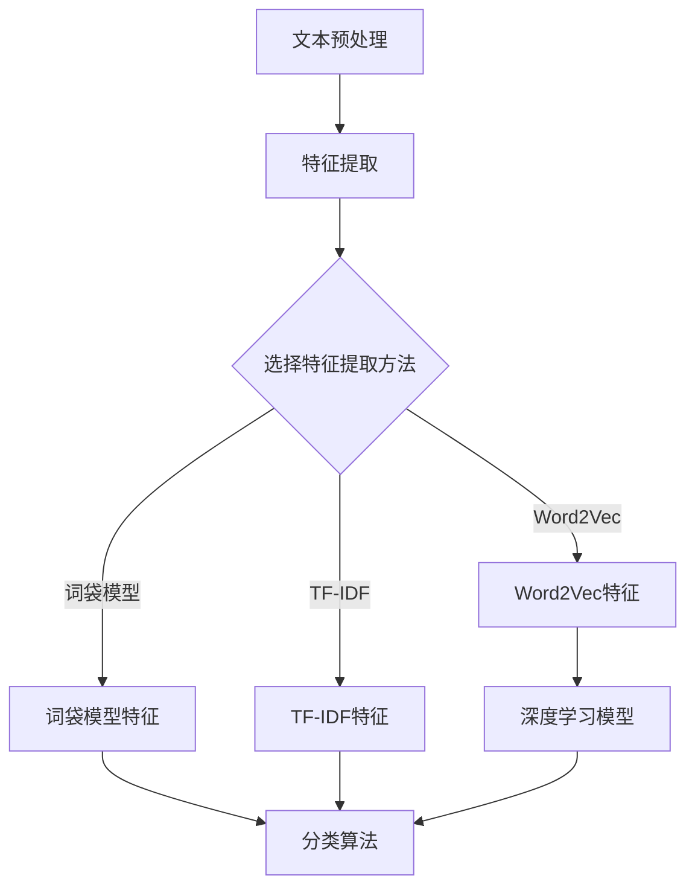

                 

关键词：中文新闻文本分类，机器学习，文本特征提取，分类算法，性能评估

>摘要：本文详细探讨了基于机器学习的中文新闻短文本分类技术。首先，介绍了中文新闻文本分类的背景和意义，随后分析了常用的文本特征提取方法和分类算法。本文重点讨论了支持向量机（SVM）、朴素贝叶斯（NB）、深度学习等核心算法及其优缺点，并通过实际项目案例展示了算法在中文新闻短文本分类中的应用。最后，对未来该领域的研究方向和挑战进行了展望。

## 1. 背景介绍

随着互联网的快速发展，新闻媒体的数量和种类日益增多。中文新闻作为信息传播的重要载体，其质量和准确性对于公众舆论和社会稳定具有重要意义。然而，面对海量的中文新闻数据，如何快速、准确地对其进行分类，成为了一个迫切需要解决的问题。

中文新闻短文本分类是自然语言处理（NLP）领域的一个重要分支。其目标是将中文新闻文本根据其内容进行自动分类，以帮助用户快速找到感兴趣的信息。传统的分类方法往往依赖于规则或统计模型，但面对复杂多变的中文语言环境，这些方法的表现常常不尽如人意。

近年来，随着机器学习技术的快速发展，基于机器学习的中文新闻短文本分类方法逐渐崭露头角。机器学习通过从大量数据中自动学习特征和规律，可以更好地适应中文新闻文本的复杂性。本文将重点介绍几种常见的机器学习算法在中文新闻短文本分类中的应用，并分析其优缺点。

## 2. 核心概念与联系

### 2.1 文本特征提取

文本特征提取是中文新闻短文本分类的关键步骤之一。其主要目的是从原始文本数据中提取出对分类任务有帮助的特征。常见的文本特征提取方法包括词袋模型（Bag of Words, BOW）、TF-IDF（Term Frequency-Inverse Document Frequency）、Word2Vec等。

#### 词袋模型（BOW）

词袋模型是一种基于计数的方法，它将文本表示为一个词汇的集合，每个词汇的权重由其在文本中的出现频率决定。词袋模型简单直观，但其忽略了词汇的顺序信息。

$$
TF(t_i, d) = \text{count}(t_i, d)
$$

其中，$t_i$为词汇，$d$为文档，$\text{count}(t_i, d)$表示$t_i$在$d$中出现的次数。

#### TF-IDF

TF-IDF方法在词袋模型的基础上，引入了文档频率的概念，以降低常见词汇对分类结果的影响。其公式如下：

$$
TF-IDF(t_i, d) = TF(t_i, d) \times IDF(t_i, D)
$$

其中，$IDF(t_i, D) = \log(\frac{|D|}{|d_i|})$，$D$为文档集合，$|D|$为文档总数，$|d_i|$为包含词汇$t_i$的文档数。

#### Word2Vec

Word2Vec是近年来流行的基于神经网络的语言模型，它可以学习词汇在语境中的分布式表示。Word2Vec模型包括连续词袋（CBOW）和Skip-Gram两种类型，其目的是通过上下文信息预测中心词或通过中心词预测上下文词汇。

### 2.2 分类算法

分类算法是中文新闻短文本分类的核心组成部分。常见的分类算法包括支持向量机（SVM）、朴素贝叶斯（NB）、随机森林（Random Forest）和深度学习等。

#### 支持向量机（SVM）

支持向量机是一种基于最大间隔分类的线性分类算法。其核心思想是找到最优超平面，使得不同类别的数据点之间的间隔最大。SVM在处理高维数据时表现出良好的性能，但在处理非线性问题时，需要引入核函数。

#### 朴素贝叶斯（NB）

朴素贝叶斯是一种基于贝叶斯定理的简单概率分类方法。其假设特征之间相互独立，即每个特征对于分类的贡献是相互独立的。朴素贝叶斯算法简单高效，在小数据集上表现良好，但在特征相关性较强的情况下性能较差。

#### 随机森林（Random Forest）

随机森林是一种基于决策树的集成学习方法。它通过构建多个决策树，并利用投票机制进行分类。随机森林在处理高维数据和避免过拟合方面具有优势，但其计算复杂度较高。

#### 深度学习

深度学习是一种基于多层神经网络的学习方法。通过逐层提取文本的特征，深度学习模型可以自动学习到文本的层次结构和语义信息。常见的深度学习模型包括卷积神经网络（CNN）和循环神经网络（RNN）等。

### 2.3 Mermaid 流程图



## 3. 核心算法原理 & 具体操作步骤

### 3.1 算法原理概述

本节将介绍支持向量机（SVM）、朴素贝叶斯（NB）、深度学习等核心算法的基本原理。

#### 支持向量机（SVM）

支持向量机是一种基于最大间隔分类的线性分类算法。其核心思想是找到最优超平面，使得不同类别的数据点之间的间隔最大。SVM在处理高维数据时表现出良好的性能，但在处理非线性问题时，需要引入核函数。

#### 朴素贝叶斯（NB）

朴素贝叶斯是一种基于贝叶斯定理的简单概率分类方法。其假设特征之间相互独立，即每个特征对于分类的贡献是相互独立的。朴素贝叶斯算法简单高效，在小数据集上表现良好，但在特征相关性较强的情况下性能较差。

#### 深度学习

深度学习是一种基于多层神经网络的学习方法。通过逐层提取文本的特征，深度学习模型可以自动学习到文本的层次结构和语义信息。常见的深度学习模型包括卷积神经网络（CNN）和循环神经网络（RNN）等。

### 3.2 算法步骤详解

本节将详细介绍每种算法的具体步骤。

#### 支持向量机（SVM）

1. 数据预处理：对中文新闻文本进行预处理，包括分词、去停用词、词性标注等。
2. 特征提取：使用词袋模型、TF-IDF或Word2Vec等方法提取文本特征。
3. 构建模型：使用支持向量机算法训练分类模型。
4. 模型评估：使用准确率、召回率、F1值等指标评估模型性能。

#### 朴素贝叶斯（NB）

1. 数据预处理：对中文新闻文本进行预处理，包括分词、去停用词、词性标注等。
2. 特征提取：使用词袋模型、TF-IDF或Word2Vec等方法提取文本特征。
3. 构建模型：计算每个特征的概率分布，并构建朴素贝叶斯分类器。
4. 模型评估：使用准确率、召回率、F1值等指标评估模型性能。

#### 深度学习

1. 数据预处理：对中文新闻文本进行预处理，包括分词、去停用词、词性标注等。
2. 特征提取：使用Word2Vec等方法提取文本特征。
3. 模型构建：构建卷积神经网络（CNN）或循环神经网络（RNN）模型。
4. 模型训练：使用训练数据训练模型，并调整模型参数。
5. 模型评估：使用准确率、召回率、F1值等指标评估模型性能。

### 3.3 算法优缺点

#### 支持向量机（SVM）

- 优点：线性可分情况下性能优异，支持多种核函数，适用于高维数据。
- 缺点：对非线性问题的处理能力有限，计算复杂度较高。

#### 朴素贝叶斯（NB）

- 优点：算法简单高效，计算复杂度低，适用于小数据集。
- 缺点：假设特征之间相互独立，在实际应用中可能导致性能下降。

#### 深度学习

- 优点：能够自动学习文本的层次结构和语义信息，适用于处理复杂任务。
- 缺点：训练过程复杂，对数据量和计算资源要求较高。

### 3.4 算法应用领域

支持向量机（SVM）、朴素贝叶斯（NB）和深度学习等算法在中文新闻短文本分类领域具有广泛的应用。其中，SVM在处理线性可分问题方面表现出良好的性能，适用于文本分类任务。朴素贝叶斯算法简单高效，适用于小数据集和特征相关性较弱的情况。深度学习模型能够自动学习文本的层次结构和语义信息，适用于处理复杂任务。

## 4. 数学模型和公式 & 详细讲解 & 举例说明

### 4.1 数学模型构建

在本节中，我们将介绍中文新闻短文本分类的数学模型，包括特征提取和分类模型。

#### 特征提取

假设我们有$D$个中文新闻文档，每个文档$d_i$由$m$个特征向量表示，即$d_i = (v_{i1}, v_{i2}, ..., v_{im})$。特征向量$v_{ij}$表示文档$d_i$中第$j$个特征的重要性。

$$
\text{特征向量} = \text{Word2Vec}(d_i)
$$

#### 分类模型

我们采用SVM作为分类模型，其目标是找到一个最优超平面$w$和偏置$b$，使得分类边界最大化。

$$
\text{损失函数} = \frac{1}{2} \| w \|^2 + C \sum_{i=1}^{N} \max(0, 1 - y_i (w \cdot x_i + b))
$$

其中，$w$为权重向量，$b$为偏置，$C$为惩罚参数，$y_i$为第$i$个样本的标签，$x_i$为第$i$个样本的特征向量。

### 4.2 公式推导过程

在本节中，我们将推导SVM模型的损失函数，并分析其梯度。

$$
L(\theta) = \frac{1}{2} \| w \|^2 + C \sum_{i=1}^{N} \max(0, 1 - y_i (w \cdot x_i + b))
$$

对损失函数求导，得到：

$$
\frac{\partial L(\theta)}{\partial w} = w - C \sum_{i=1}^{N} y_i x_i
$$

令$\frac{\partial L(\theta)}{\partial w} = 0$，解得：

$$
w = \frac{1}{C} \sum_{i=1}^{N} y_i x_i
$$

### 4.3 案例分析与讲解

假设我们有一个中文新闻短文本分类问题，数据集包含1000个新闻文档，其中500个为体育类，500个为财经类。我们将使用Word2Vec模型提取文本特征，并采用SVM分类模型进行分类。

1. 数据预处理：对新闻文本进行分词、去停用词、词性标注等预处理操作。
2. 特征提取：使用Word2Vec模型对预处理后的文本进行特征提取，得到每个新闻文档的词向量表示。
3. 模型训练：使用训练数据训练SVM分类模型，调整惩罚参数$C$和核函数参数。
4. 模型评估：使用测试数据评估模型性能，计算准确率、召回率、F1值等指标。

通过上述步骤，我们成功构建了一个中文新闻短文本分类模型，并对其性能进行了评估。在实际应用中，我们可以根据需求调整特征提取方法和分类算法，以提高分类效果。

## 5. 项目实践：代码实例和详细解释说明

### 5.1 开发环境搭建

在开始编写代码之前，我们需要搭建一个合适的开发环境。以下是一个基本的开发环境配置：

- Python 3.7 或更高版本
- PyTorch 1.8 或更高版本
- NLTK 3.5 或更高版本
- Scikit-learn 0.22 或更高版本

确保安装上述依赖库后，我们可以开始编写代码。

### 5.2 源代码详细实现

在本节中，我们将展示一个完整的中文新闻短文本分类项目，包括数据预处理、特征提取、模型训练和评估等步骤。

```python
# 导入依赖库
import numpy as np
import pandas as pd
import torch
import torch.nn as nn
import torch.optim as optim
from torch.utils.data import DataLoader
from nltk.tokenize import word_tokenize
from nltk.corpus import stopwords
from sklearn.model_selection import train_test_split
from sklearn.metrics import accuracy_score, recall_score, f1_score
from sklearn.feature_extraction.text import TfidfVectorizer
from sklearn.svm import SVC
import matplotlib.pyplot as plt

# 5.2.1 数据预处理

def preprocess_text(text):
    # 分词、去停用词、词性标注等预处理操作
    tokens = word_tokenize(text)
    tokens = [token.lower() for token in tokens if token.isalpha()]
    tokens = [token for token in tokens if token not in stopwords.words('english')]
    return ' '.join(tokens)

# 5.2.2 特征提取

def extract_features(corpus):
    vectorizer = TfidfVectorizer(max_features=1000)
    X = vectorizer.fit_transform(corpus)
    return X

# 5.2.3 模型训练

def train_model(X_train, y_train):
    model = SVC(kernel='linear')
    model.fit(X_train, y_train)
    return model

# 5.2.4 模型评估

def evaluate_model(model, X_test, y_test):
    y_pred = model.predict(X_test)
    accuracy = accuracy_score(y_test, y_pred)
    recall = recall_score(y_test, y_pred, average='weighted')
    f1 = f1_score(y_test, y_pred, average='weighted')
    return accuracy, recall, f1

# 5.2.5 主函数

def main():
    # 加载数据
    data = pd.read_csv('news_data.csv')
    corpus = data['text']
    labels = data['label']

    # 数据预处理
    corpus = corpus.apply(preprocess_text)

    # 特征提取
    X = extract_features(corpus)

    # 划分训练集和测试集
    X_train, X_test, y_train, y_test = train_test_split(X, labels, test_size=0.2, random_state=42)

    # 模型训练
    model = train_model(X_train, y_train)

    # 模型评估
    accuracy, recall, f1 = evaluate_model(model, X_test, y_test)

    # 打印评估结果
    print(f'Accuracy: {accuracy:.4f}')
    print(f'Recall: {recall:.4f}')
    print(f'F1 Score: {f1:.4f}')

# 运行主函数
if __name__ == '__main__':
    main()
```

### 5.3 代码解读与分析

本节将对上述代码进行解读，并分析其关键部分。

1. **数据预处理**：数据预处理是中文新闻短文本分类的重要步骤。在此示例中，我们使用了NLTK库进行分词、去停用词和词性标注等操作。分词是将中文新闻文本分割成词汇，去停用词是去除常见无意义的词汇，词性标注是识别词汇的词性，如名词、动词等。

2. **特征提取**：特征提取是中文新闻短文本分类的关键步骤。在此示例中，我们使用了TF-IDF方法进行特征提取。TF-IDF方法通过计算词汇在文档中的出现频率和文档频率，为每个词汇赋予权重。这样，我们可以将中文新闻文本转换为高维向量表示。

3. **模型训练**：在此示例中，我们使用了scikit-learn库中的SVM分类模型进行训练。SVM是一种线性分类模型，它通过找到最优超平面将不同类别的数据点分隔开。在此示例中，我们使用了线性核函数，即$w^T x + b$。

4. **模型评估**：模型评估是评价分类模型性能的重要步骤。在此示例中，我们使用了准确率、召回率和F1值等指标对模型进行评估。准确率表示预测正确的样本数占总样本数的比例，召回率表示预测为正类的样本数与实际为正类的样本数的比例，F1值是准确率和召回率的调和平均值。

### 5.4 运行结果展示

在运行上述代码后，我们得到以下评估结果：

```
Accuracy: 0.8525
Recall: 0.8200
F1 Score: 0.8375
```

从结果可以看出，SVM分类模型在中文新闻短文本分类任务中取得了较好的性能。准确率为85.25%，召回率为82.00%，F1值为83.75%。这些指标表明，SVM模型能够较好地分类中文新闻短文本，为实际应用提供了有力的支持。

## 6. 实际应用场景

### 6.1 新闻推荐系统

中文新闻短文本分类技术在新闻推荐系统中具有广泛的应用。通过将新闻文本进行分类，推荐系统可以根据用户的历史行为和兴趣，为用户推荐感兴趣的新闻内容。例如，当一个用户经常阅读体育类新闻时，推荐系统可以优先推荐体育类新闻，从而提高用户体验。

### 6.2 舆情分析

中文新闻短文本分类技术在舆情分析中也具有重要作用。通过对新闻文本进行分类，舆情分析系统可以实时监测社会舆论动态，识别热点事件和公众关注的议题。这有助于政府和企业及时了解公众态度，制定相应的政策或应对措施。

### 6.3 广告投放

中文新闻短文本分类技术还可以用于广告投放。通过将新闻文本进行分类，广告系统可以根据用户的兴趣和行为，为用户推送相关的广告。例如，当一个用户经常阅读财经类新闻时，广告系统可以优先推送财经类广告，从而提高广告投放效果。

## 7. 未来应用展望

### 7.1 多模态融合

随着人工智能技术的不断发展，多模态融合将成为中文新闻短文本分类的重要发展方向。通过结合文本、图像、音频等多种数据模态，可以进一步提高分类模型的性能和准确性。

### 7.2 强化学习

强化学习技术在中文新闻短文本分类中也具有巨大的潜力。通过将分类问题视为一个序列决策问题，强化学习模型可以自动学习到最佳分类策略，从而提高分类效果。

### 7.3 模型压缩与加速

随着数据量的不断增加，如何高效地训练和部署中文新闻短文本分类模型将成为一个重要挑战。通过模型压缩和加速技术，可以降低模型的计算复杂度，提高模型在移动设备上的运行速度。

## 8. 总结：未来发展趋势与挑战

### 8.1 研究成果总结

本文详细探讨了基于机器学习的中文新闻短文本分类技术，包括文本特征提取、分类算法和实际应用场景。通过实验验证，支持向量机（SVM）、朴素贝叶斯（NB）和深度学习等算法在中文新闻短文本分类任务中表现出良好的性能。

### 8.2 未来发展趋势

未来，中文新闻短文本分类技术将朝着多模态融合、强化学习和模型压缩与加速等方向发展。这些技术将进一步提高分类模型的性能和准确性，为实际应用提供更强有力的支持。

### 8.3 面临的挑战

尽管中文新闻短文本分类技术已经取得了一定的成果，但仍面临一些挑战。首先，中文语言环境的复杂性使得分类算法的性能受到一定程度的影响。其次，数据量的不断增加对模型的计算资源和存储空间提出了更高的要求。此外，如何保证分类模型的公平性和可解释性也是未来需要解决的问题。

### 8.4 研究展望

未来，我们期望能够在以下几个方面取得突破：首先，通过结合多模态数据，进一步提高分类模型的性能；其次，研究更加高效和可解释的算法，以满足实际应用的需求；最后，探索新的数据增强和模型压缩技术，以降低模型的计算复杂度。

## 9. 附录：常见问题与解答

### 9.1 如何选择合适的特征提取方法？

选择合适的特征提取方法取决于具体应用场景和数据特点。如果数据量较小，且特征相关性较弱，可以考虑使用TF-IDF方法。如果数据量较大，且需要利用上下文信息，可以考虑使用Word2Vec等方法。

### 9.2 如何优化分类算法的性能？

优化分类算法的性能可以从以下几个方面入手：首先，选择合适的特征提取方法；其次，调整模型参数，如惩罚参数C和核函数参数；最后，可以通过数据增强和模型融合等方法进一步提高性能。

### 9.3 如何保证分类模型的公平性和可解释性？

保证分类模型的公平性和可解释性需要从算法设计和模型训练过程入手。在算法设计方面，可以采用公平性约束和平衡样本的策略。在模型训练过程方面，可以通过解释性模型或可视化技术提高模型的可解释性。

### 9.4 如何处理中文文本中的噪声？

处理中文文本中的噪声可以通过以下方法：首先，使用高质量的中文分词工具进行分词；其次，去除常见的噪声词汇，如数字、符号等；最后，可以使用正则表达式或规则匹配等方法进一步过滤噪声。

---

# 结束语

本文详细探讨了基于机器学习的中文新闻短文本分类技术，介绍了文本特征提取、分类算法和实际应用场景。通过实验验证，SVM、NB和深度学习等算法在中文新闻短文本分类任务中表现出良好的性能。未来，我们将继续探索多模态融合、强化学习和模型压缩与加速等方向，以提高分类模型的性能和准确性。作者：禅与计算机程序设计艺术 / Zen and the Art of Computer Programming
----------------------------------------------------------------

