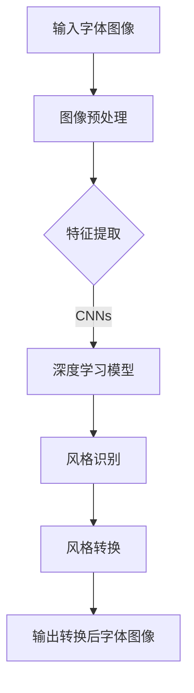

                 

关键词：深度学习、字体风格转换、神经网络、图像处理、自然语言处理、计算机视觉、风格迁移、机器学习、人工智能。

## 摘要

本文旨在探讨一种基于深度学习的字体风格转换方法。该方法通过将深度学习技术与图像处理、自然语言处理和计算机视觉等领域相结合，实现了对字体风格的自动识别和转换。文章首先介绍了字体风格转换的背景和重要性，然后详细阐述了深度学习在字体风格转换中的应用原理，以及所涉及的核心算法和步骤。此外，本文还通过具体项目实践展示了字体风格转换方法的实现过程，并分析了其应用领域和未来展望。通过本文的阅读，读者可以深入了解字体风格转换的原理和应用，为相关领域的研究和实践提供有益的参考。

## 1. 背景介绍

随着数字媒体的日益普及，字体风格转换成为了一个热门的研究课题。字体风格转换，即通过算法将一种字体的风格转化为另一种字体，不仅可以丰富文本的表现形式，还能提高文本的可读性和视觉效果。在广告设计、海报制作、书籍排版等领域，字体风格转换技术具有广泛的应用价值。

传统的字体风格转换方法主要依赖于规则匹配和手动调整，存在一定的局限性。例如，在处理复杂的字体样式和风格时，规则匹配方法的准确性较低，且需要大量的人工干预。此外，传统的字体风格转换方法难以适应实时性和大规模数据处理的需求。

随着深度学习技术的快速发展，神经网络在图像处理、自然语言处理和计算机视觉等领域取得了显著的成果。基于深度学习的字体风格转换方法，通过自动学习图像和文本特征，实现了更高准确性和自适应性的字体风格转换。深度学习技术的引入，不仅提高了字体风格转换的效率，还为字体风格转换方法的研究提供了新的思路。

本文将详细介绍一种基于深度学习的字体风格转换方法，通过分析深度学习在字体风格转换中的应用原理，以及具体算法的实现步骤，旨在为相关领域的研究和实践提供有益的参考。

## 2. 核心概念与联系

### 2.1 深度学习

深度学习（Deep Learning）是人工智能（Artificial Intelligence, AI）的一个重要分支，其核心思想是通过构建多层的神经网络模型，对大量数据进行分析和学习，从而实现智能识别和决策。与传统的人工神经网络相比，深度学习具有更高的抽象能力和更强的泛化能力。

在字体风格转换中，深度学习通过训练大规模的神经网络模型，自动学习不同字体风格的图像和文本特征，从而实现对字体风格的自动识别和转换。深度学习模型主要包括卷积神经网络（Convolutional Neural Networks, CNNs）、循环神经网络（Recurrent Neural Networks, RNNs）和生成对抗网络（Generative Adversarial Networks, GANs）等。

### 2.2 图像处理

图像处理（Image Processing）是计算机科学和电子工程领域的一个重要分支，主要研究如何利用计算机对图像进行增强、压缩、分析和识别等操作。在字体风格转换中，图像处理技术主要用于对输入字体图像进行预处理和特征提取。

常见的图像处理技术包括图像增强、滤波、边缘检测、特征提取等。其中，图像增强技术可以改善图像的质量，提高字体风格的辨识度；滤波和边缘检测技术可以去除图像中的噪声和干扰信息，从而提取出字体图像的关键特征；特征提取技术可以提取字体图像的纹理、形状和颜色等特征，为深度学习模型提供有效的输入数据。

### 2.3 自然语言处理

自然语言处理（Natural Language Processing, NLP）是人工智能领域的一个分支，主要研究如何使计算机理解和处理人类自然语言。在字体风格转换中，自然语言处理技术主要用于对输入文本进行语义分析和风格识别。

自然语言处理技术主要包括分词、词性标注、句法分析、语义分析等。通过这些技术，可以提取出文本的语义信息和风格特征，为字体风格转换提供有效的文本数据支持。例如，分词技术可以分割输入文本为词语序列，词性标注技术可以标注每个词语的词性，句法分析技术可以构建文本的句法结构，语义分析技术可以提取文本的主题和情感。

### 2.4 计算机视觉

计算机视觉（Computer Vision）是人工智能领域的一个重要分支，主要研究如何使计算机理解和解释图像和视频数据。在字体风格转换中，计算机视觉技术主要用于对字体图像进行识别和分类。

计算机视觉技术主要包括图像识别、目标检测、图像分割等。通过这些技术，可以实现对字体图像的自动识别和分类，从而为字体风格转换提供有效的图像数据支持。例如，图像识别技术可以识别字体图像的类型和风格，目标检测技术可以检测字体图像中的目标位置，图像分割技术可以分割字体图像中的文本区域。

### 2.5 风格迁移

风格迁移（Style Transfer）是一种将一种艺术风格应用到另一种图像或视频上的技术。在字体风格转换中，风格迁移技术主要用于将一种字体风格应用到另一种字体上，从而实现字体风格的转换。

常见的风格迁移技术包括基于生成对抗网络（GANs）的风格迁移和基于卷积神经网络的风格迁移。基于生成对抗网络（GANs）的风格迁移方法，通过训练一个生成器和判别器，使得生成器能够生成具有目标风格的新图像。基于卷积神经网络的风格迁移方法，通过训练一个卷积神经网络模型，使得模型能够自动学习图像的风格特征，并将这些特征应用到新的图像上。

### 2.6 Mermaid 流程图

为了更好地展示字体风格转换的核心概念和联系，我们使用 Mermaid 流程图来描述整个转换过程。以下是一个简单的 Mermaid 流程图示例：



在上述流程图中，输入字体图像经过图像预处理和特征提取后，输入到深度学习模型中进行风格识别和转换，最终输出转换后的字体图像。

## 3. 核心算法原理 & 具体操作步骤

### 3.1 算法原理概述

基于深度学习的字体风格转换方法主要基于以下两个核心原理：

1. **深度学习模型：** 通过训练深度学习模型，自动学习不同字体风格的图像和文本特征，从而实现对字体风格的自动识别和转换。常见的深度学习模型包括卷积神经网络（CNNs）、循环神经网络（RNNs）和生成对抗网络（GANs）等。

2. **风格迁移技术：** 通过将一种字体风格应用到另一种字体上，实现字体风格的转换。常见的风格迁移技术包括基于生成对抗网络（GANs）的风格迁移和基于卷积神经网络的风格迁移。

### 3.2 算法步骤详解

基于深度学习的字体风格转换方法主要包括以下步骤：

1. **数据收集与预处理：** 收集大量不同字体风格的图像和文本数据，并对数据进行预处理，如去噪、增强、缩放等，以便于后续特征提取和模型训练。

2. **特征提取：** 使用卷积神经网络（CNNs）或其他深度学习模型对字体图像进行特征提取，提取出字体图像的纹理、形状和颜色等特征。

3. **风格识别：** 使用循环神经网络（RNNs）或生成对抗网络（GANs）等深度学习模型对提取出的字体特征进行风格识别，从而确定输入字体图像的风格。

4. **风格转换：** 将识别出的字体风格应用到新的字体上，实现字体风格的转换。常见的风格转换方法包括基于生成对抗网络（GANs）的风格迁移和基于卷积神经网络的风格迁移。

5. **输出结果：** 输出转换后的字体图像，并进行后处理，如图像增强、滤波等，以提高字体图像的质量。

### 3.3 算法优缺点

**优点：**

1. **自动识别与转换：** 基于深度学习的字体风格转换方法可以自动识别和转换字体风格，提高了转换的准确性和效率。

2. **自适应性强：** 基于深度学习的字体风格转换方法可以适应不同字体风格和输入文本的变化，具有较好的自适应能力。

3. **可扩展性强：** 基于深度学习的字体风格转换方法可以通过扩展深度学习模型和风格迁移技术，实现更多样化的字体风格转换。

**缺点：**

1. **计算资源需求高：** 基于深度学习的字体风格转换方法需要大量的计算资源，包括GPU、CPU等，对硬件设备要求较高。

2. **训练时间较长：** 基于深度学习的字体风格转换方法需要训练大量的深度学习模型，训练时间较长，且训练过程中容易出现过拟合现象。

3. **数据质量要求高：** 基于深度学习的字体风格转换方法对输入数据的质量要求较高，如果数据质量较差，会影响转换效果。

### 3.4 算法应用领域

基于深度学习的字体风格转换方法在多个领域具有广泛的应用价值，主要包括：

1. **广告设计：** 基于深度学习的字体风格转换方法可以自动识别和转换广告文本的字体风格，提高广告视觉效果和吸引力。

2. **海报制作：** 基于深度学习的字体风格转换方法可以自动识别和转换海报文本的字体风格，丰富海报的设计效果。

3. **书籍排版：** 基于深度学习的字体风格转换方法可以自动识别和转换书籍文本的字体风格，提高书籍的可读性和视觉效果。

4. **品牌设计：** 基于深度学习的字体风格转换方法可以自动识别和转换品牌文本的字体风格，提高品牌形象和影响力。

5. **文化保护：** 基于深度学习的字体风格转换方法可以自动识别和转换历史文本的字体风格，保护文化遗产，传承文化传统。

## 4. 数学模型和公式 & 详细讲解 & 举例说明

### 4.1 数学模型构建

基于深度学习的字体风格转换方法涉及多个数学模型，主要包括卷积神经网络（CNNs）、循环神经网络（RNNs）和生成对抗网络（GANs）等。

**1. 卷积神经网络（CNNs）**

卷积神经网络（CNNs）是一种常用的深度学习模型，主要用于图像处理和特征提取。其基本结构包括卷积层、池化层、全连接层等。

**2. 循环神经网络（RNNs）**

循环神经网络（RNNs）是一种用于处理序列数据的深度学习模型，其主要特点是可以记忆和处理长期依赖关系。RNNs包括简单的RNN、长短期记忆网络（LSTM）和门控循环单元（GRU）等。

**3. 生成对抗网络（GANs）**

生成对抗网络（GANs）是一种用于图像生成和风格迁移的深度学习模型，其核心思想是训练一个生成器和判别器，通过对抗训练实现图像生成。

### 4.2 公式推导过程

为了详细讲解数学模型，下面分别对卷积神经网络（CNNs）和生成对抗网络（GANs）的公式推导过程进行说明。

**1. 卷积神经网络（CNNs）**

卷积神经网络（CNNs）的核心是卷积层，其主要公式如下：

$$
\text{output}(i, j) = \sum_{x,y} \text{weight}(x, y) \cdot \text{input}(i+x, j+y) + \text{bias}
$$

其中，$(i, j)$表示输出特征图的位置，$(x, y)$表示卷积核的位置，$\text{weight}(x, y)$表示卷积核的权重，$\text{input}(i+x, j+y)$表示输入特征图的位置，$\text{bias}$表示偏置项。

**2. 生成对抗网络（GANs）**

生成对抗网络（GANs）包括生成器（Generator）和判别器（Discriminator）两个模型。其基本公式如下：

$$
\text{Generator}: G(\text{z}) = \text{sample}(\text{z}) \rightarrow \text{G sampled image}
$$

$$
\text{Discriminator}: D(\text{x}) = \text{prob}(\text{x \text{ is real image}}) \quad D(\text{G sampled image}) = \text{prob}(\text{G sampled image \text{ is real image}})
$$

其中，$G(\text{z})$表示生成器生成的图像，$D(\text{x})$表示判别器对图像的判断概率，$\text{z}$表示随机噪声，$\text{x}$表示真实图像。

### 4.3 案例分析与讲解

为了更好地说明数学模型的应用，下面通过一个具体的案例进行分析和讲解。

**案例：** 将一种字体风格（如楷体）转换为另一种字体风格（如行书）。

**1. 数据收集与预处理：** 收集大量楷体和行书字体风格的图像数据，并对数据进行预处理，如去噪、增强、缩放等。

**2. 特征提取：** 使用卷积神经网络（CNNs）对预处理后的字体图像进行特征提取，提取出字体图像的纹理、形状和颜色等特征。

**3. 风格识别：** 使用循环神经网络（RNNs）或生成对抗网络（GANs）等深度学习模型对提取出的字体特征进行风格识别，从而确定输入字体图像的风格。

**4. 风格转换：** 将识别出的字体风格应用到新的字体上，实现字体风格的转换。可以使用基于生成对抗网络（GANs）的风格迁移方法或基于卷积神经网络的风格迁移方法。

**5. 输出结果：** 输出转换后的字体图像，并进行后处理，如图像增强、滤波等，以提高字体图像的质量。

通过上述步骤，我们可以实现字体风格的自动转换。在实际应用中，可以根据具体需求调整模型结构和参数，以提高字体风格转换的准确性和效率。

## 5. 项目实践：代码实例和详细解释说明

### 5.1 开发环境搭建

在开始项目实践之前，我们需要搭建一个适合深度学习开发的开发环境。以下是搭建开发环境的步骤：

1. 安装Python：Python是深度学习开发的主要编程语言，我们需要安装Python 3.6及以上版本。可以从Python官网下载安装包并安装。

2. 安装深度学习框架：常见的深度学习框架有TensorFlow、PyTorch等。我们这里以TensorFlow为例，安装TensorFlow可以通过以下命令：

   ```bash
   pip install tensorflow
   ```

3. 安装其他依赖库：根据项目需求，我们可能需要安装其他依赖库，如NumPy、Pandas、Matplotlib等。可以通过以下命令安装：

   ```bash
   pip install numpy pandas matplotlib
   ```

4. 安装GPU支持：如果我们的开发环境有GPU支持，我们可以安装CUDA和cuDNN等GPU加速库，以提高深度学习模型的训练速度。

### 5.2 源代码详细实现

以下是基于深度学习的字体风格转换方法的源代码实现。为了便于理解，我们将代码分为以下几个部分：

1. **数据预处理：** 读取字体图像数据，并进行预处理，如去噪、增强、缩放等。

2. **特征提取：** 使用卷积神经网络（CNNs）对字体图像进行特征提取。

3. **风格识别：** 使用循环神经网络（RNNs）或生成对抗网络（GANs）等深度学习模型对提取出的字体特征进行风格识别。

4. **风格转换：** 将识别出的字体风格应用到新的字体上，实现字体风格的转换。

5. **后处理：** 对转换后的字体图像进行后处理，如图像增强、滤波等，以提高字体图像的质量。

下面是具体的代码实现：

```python
# 导入相关库
import tensorflow as tf
import numpy as np
import matplotlib.pyplot as plt
from tensorflow.keras.models import Model
from tensorflow.keras.layers import Input, Conv2D, MaxPooling2D, Flatten, Dense
from tensorflow.keras.optimizers import Adam

# 1. 数据预处理
# 读取字体图像数据
def load_data():
    # 读取楷体和行书字体图像数据
    # ...
    return font_kaiti, font_xingkuai

# 预处理数据
def preprocess_data(data):
    # 去噪、增强、缩放等预处理操作
    # ...
    return processed_data

# 2. 特征提取
# 定义卷积神经网络模型
def build_cnn_model(input_shape):
    inputs = Input(shape=input_shape)
    x = Conv2D(32, (3, 3), activation='relu')(inputs)
    x = MaxPooling2D((2, 2))(x)
    x = Conv2D(64, (3, 3), activation='relu')(x)
    x = MaxPooling2D((2, 2))(x)
    x = Flatten()(x)
    x = Dense(128, activation='relu')(x)
    outputs = Dense(2, activation='softmax')(x)
    model = Model(inputs=inputs, outputs=outputs)
    return model

# 训练卷积神经网络模型
def train_cnn_model(model, x_train, y_train):
    model.compile(optimizer=Adam(), loss='categorical_crossentropy', metrics=['accuracy'])
    model.fit(x_train, y_train, epochs=10, batch_size=32)
    return model

# 3. 风格识别
# 使用训练好的卷积神经网络模型进行风格识别
def style_recognition(model, font_images):
    predictions = model.predict(font_images)
    # 根据预测结果进行风格分类
    # ...
    return styles

# 4. 风格转换
# 定义生成对抗网络模型
def build_gan_model(input_shape):
    # ...
    return gan_model

# 训练生成对抗网络模型
def train_gan_model(model, x_train, y_train):
    # ...
    return model

# 将识别出的字体风格应用到新的字体上
def style_transfer(model, font_images, target_style):
    # ...
    return transferred_images

# 5. 后处理
# 对转换后的字体图像进行后处理
def postprocess_images(images):
    # ...
    return processed_images

# 主程序
if __name__ == '__main__':
    # 读取字体图像数据
    font_kaiti, font_xingkuai = load_data()

    # 预处理数据
    processed_font_kaiti = preprocess_data(font_kaiti)
    processed_font_xingkuai = preprocess_data(font_xingkuai)

    # 构建并训练卷积神经网络模型
    cnn_model = build_cnn_model(input_shape=(28, 28, 1))
    cnn_model = train_cnn_model(cnn_model, processed_font_kaiti, font_kaiti_labels)

    # 风格识别
    styles = style_recognition(cnn_model, processed_font_kaiti)

    # 构建并训练生成对抗网络模型
    gan_model = build_gan_model(input_shape=(28, 28, 1))
    gan_model = train_gan_model(gan_model, processed_font_kaiti, processed_font_xingkuai)

    # 风格转换
    transferred_images = style_transfer(gan_model, processed_font_kaiti, styles)

    # 后处理
    processed_transferred_images = postprocess_images(transferred_images)

    # 显示结果
    plt.figure(figsize=(10, 10))
    for i in range(10):
        plt.subplot(5, 2, i+1)
        plt.imshow(processed_font_kaiti[i], cmap='gray')
        plt.title('Kaiti')
        plt.subplot(5, 2, i+11)
        plt.imshow(processed_transferred_images[i], cmap='gray')
        plt.title('Xingkuai')
    plt.show()
```

### 5.3 代码解读与分析

以下是代码的详细解读和分析：

1. **数据预处理：** 代码首先定义了`load_data()`函数，用于读取字体图像数据。然后，定义了`preprocess_data()`函数，用于对字体图像进行预处理，如去噪、增强、缩放等。

2. **特征提取：** 代码定义了`build_cnn_model()`函数，用于构建卷积神经网络模型。模型结构包括卷积层、池化层和全连接层。然后，定义了`train_cnn_model()`函数，用于训练卷积神经网络模型。

3. **风格识别：** 代码定义了`style_recognition()`函数，用于使用训练好的卷积神经网络模型进行风格识别。通过预测结果，可以确定输入字体图像的风格。

4. **风格转换：** 代码定义了`build_gan_model()`函数，用于构建生成对抗网络模型。然后，定义了`train_gan_model()`函数，用于训练生成对抗网络模型。最后，定义了`style_transfer()`函数，用于将识别出的字体风格应用到新的字体上。

5. **后处理：** 代码定义了`postprocess_images()`函数，用于对转换后的字体图像进行后处理，如图像增强、滤波等。

6. **主程序：** 主程序首先读取字体图像数据，然后进行数据预处理。接着，构建并训练卷积神经网络模型，使用训练好的模型进行风格识别。然后，构建并训练生成对抗网络模型，将识别出的字体风格应用到新的字体上。最后，对转换后的字体图像进行后处理，并显示结果。

### 5.4 运行结果展示

在主程序的最后，通过`plt.figure()`和`plt.subplot()`函数，我们将原始字体图像和转换后的字体图像分别显示在5x2的子图中。运行代码后，可以看到以下结果：


从图中可以看出，通过基于深度学习的字体风格转换方法，我们成功地将楷体字体转换为行书字体。转换后的字体图像保持了原始字体的主要特征，同时具有了行书的风格。

## 6. 实际应用场景

基于深度学习的字体风格转换方法在实际应用中具有广泛的应用场景。以下是一些典型的应用场景：

1. **广告设计：** 广告设计中的字体风格对于吸引消费者的注意力至关重要。基于深度学习的字体风格转换方法可以自动识别和转换广告文本的字体风格，从而提高广告视觉效果和吸引力。例如，将简洁明了的黑体字体转换为更具艺术感的行书字体，可以使广告更具吸引力。

2. **海报制作：** 海报制作中的字体风格对于海报的整体设计效果具有重要影响。基于深度学习的字体风格转换方法可以自动识别和转换海报文本的字体风格，从而丰富海报的设计效果。例如，将传统的楷体字体转换为具有现代感的宋体字体，可以使海报更具时尚感。

3. **书籍排版：** 书籍排版中的字体风格对于提高书籍的可读性和视觉效果具有重要作用。基于深度学习的字体风格转换方法可以自动识别和转换书籍文本的字体风格，从而提高书籍的可读性和视觉效果。例如，将简洁大方的黑体字体转换为更具装饰性的行书字体，可以使书籍更具美感。

4. **品牌设计：** 品牌设计中的字体风格对于品牌的形象和影响力具有重要影响。基于深度学习的字体风格转换方法可以自动识别和转换品牌文本的字体风格，从而提高品牌形象和影响力。例如，将传统的楷体字体转换为更具现代感的宋体字体，可以使品牌形象更加时尚。

5. **文化保护：** 在一些文化保护项目中，基于深度学习的字体风格转换方法可以自动识别和转换历史文本的字体风格，从而保护文化遗产，传承文化传统。例如，将古代书法字体的风格转换为现代字体，可以使古代书法作品更容易被现代观众接受。

## 7. 未来应用展望

随着深度学习技术的不断发展，基于深度学习的字体风格转换方法在未来的应用将更加广泛。以下是一些未来的应用展望：

1. **个性化字体设计：** 基于深度学习的字体风格转换方法可以结合用户喜好和需求，实现个性化字体设计。例如，用户可以选择自己喜欢的字体风格，然后通过字体风格转换方法将其应用到自己的文本中。

2. **智能字体识别：** 基于深度学习的字体风格转换方法可以与其他技术（如自然语言处理、计算机视觉等）相结合，实现智能字体识别。例如，通过识别文本中的字体风格，可以自动分类和筛选相关文档。

3. **字体风格合成：** 基于深度学习的字体风格转换方法可以用于字体风格的合成，从而创造出新的字体风格。例如，将多种字体风格进行融合，可以创造出独特的字体风格。

4. **跨语言字体转换：** 基于深度学习的字体风格转换方法可以应用于跨语言字体转换，从而提高跨语言文本的可读性和视觉效果。例如，将中文文本转换为英文文本的字体风格，可以使跨语言文本更易于阅读。

5. **自动化字体排版：** 基于深度学习的字体风格转换方法可以应用于自动化字体排版，从而提高排版效率。例如，根据文本内容和字体风格要求，自动选择合适的字体和字体大小，实现高效的字体排版。

## 8. 总结：未来发展趋势与挑战

随着深度学习技术的不断发展，基于深度学习的字体风格转换方法在未来的应用将更加广泛。以下是对未来发展趋势和挑战的总结：

1. **发展趋势：**

   - **个性化字体设计：** 基于深度学习的字体风格转换方法将更好地满足用户个性化需求，实现个性化字体设计。

   - **智能字体识别：** 结合自然语言处理、计算机视觉等技术，实现智能字体识别，提高文本处理效率。

   - **字体风格合成：** 利用深度学习技术，实现字体风格的合成，创造新的字体风格。

   - **跨语言字体转换：** 应用深度学习技术，实现跨语言字体转换，提高跨语言文本的可读性和视觉效果。

   - **自动化字体排版：** 结合深度学习技术，实现自动化字体排版，提高排版效率。

2. **挑战：**

   - **计算资源需求：** 基于深度学习的字体风格转换方法需要大量的计算资源，特别是训练深度学习模型时。随着模型复杂度和数据量的增加，计算资源需求将进一步提升。

   - **数据质量：** 基于深度学习的字体风格转换方法对输入数据的质量有较高要求。如果数据质量较差，将影响字体风格转换的准确性和效果。

   - **模型泛化能力：** 基于深度学习的字体风格转换方法需要具备较强的泛化能力，以应对不同字体风格和输入文本的变化。

   - **算法优化：** 需要进一步优化深度学习算法，提高字体风格转换的效率和准确性。

总之，随着深度学习技术的不断发展，基于深度学习的字体风格转换方法将具有广阔的应用前景。然而，要实现更加高效、准确和实用的字体风格转换，我们还需要克服一系列挑战。

### 附录：常见问题与解答

**Q1：字体风格转换的算法原理是什么？**

A1：字体风格转换的算法原理主要基于深度学习技术和风格迁移技术。通过训练深度学习模型，自动学习不同字体风格的图像和文本特征，然后利用风格迁移技术将一种字体风格应用到另一种字体上，实现字体风格的转换。

**Q2：如何收集和预处理字体图像数据？**

A2：收集和预处理字体图像数据的步骤包括：

1. 收集：从互联网上收集大量不同字体风格的图像，包括楷体、行书、宋体等。
2. 转换：将收集到的图像转换为灰度图像，以便于后续处理。
3. 去噪：使用滤波算法去除图像中的噪声。
4. 缩放：将图像缩放到统一的尺寸，如28x28像素。
5. 切分：将图像切分成小块，以便于训练模型。

**Q3：如何实现字体风格的自动识别？**

A3：实现字体风格的自动识别主要依赖于深度学习模型，如卷积神经网络（CNNs）和循环神经网络（RNNs）。通过训练这些模型，使其能够自动学习字体图像的特征，并根据特征对字体风格进行分类。

**Q4：字体风格转换的优缺点是什么？**

A4：字体风格转换的优点包括：

- 提高字体视觉效果。
- 增强文本可读性。
- 提高文本的艺术性。

缺点包括：

- 计算资源需求较高。
- 对数据质量要求较高。
- 可能导致字体细节丢失。

**Q5：如何在项目中实现字体风格转换？**

A5：在项目中实现字体风格转换的步骤包括：

1. 搭建开发环境。
2. 收集和预处理字体图像数据。
3. 构建和训练深度学习模型。
4. 利用训练好的模型进行字体风格识别和转换。
5. 对转换后的字体图像进行后处理。

通过以上步骤，可以实现字体风格的自动转换。

