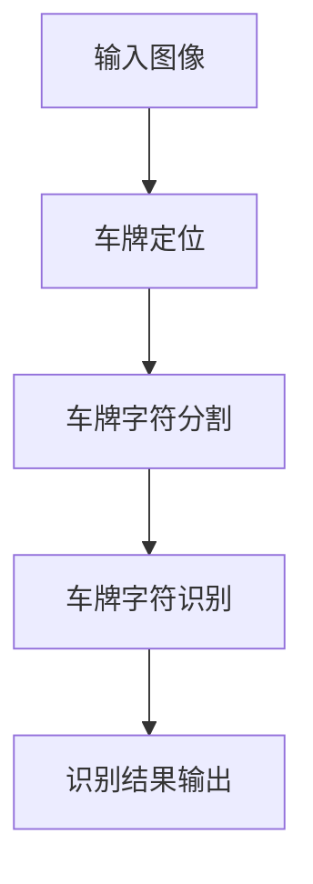

                 

关键词：深度学习、车牌识别、图像处理、机器学习、计算机视觉

> 摘要：本文旨在探讨基于深度学习的车牌识别系统的设计与实现。我们将详细介绍深度学习的核心概念及其在车牌识别中的应用，详细解释车牌识别的算法原理与操作步骤，并通过实例代码分析，展示如何构建一个高效的车牌识别系统。此外，文章还将讨论车牌识别系统的实际应用场景、未来发展趋势与挑战，以及相关学习资源和工具推荐。

## 1. 背景介绍

车牌识别作为一种重要的计算机视觉应用，在交通管理、车辆监控、电子收费等领域有着广泛的应用。传统的车牌识别系统依赖于图像处理和模式识别技术，这些方法虽然在一定程度上实现了车牌的定位和识别，但受限于算法复杂度和识别精度，往往无法满足实际应用的需求。随着深度学习技术的迅速发展，基于深度学习的车牌识别系统逐渐成为研究的热点。

本文将通过以下内容，详细探讨基于深度学习的车牌识别系统的设计与实现：

- 深度学习与车牌识别的联系
- 车牌识别的核心算法原理
- 数学模型与公式
- 代码实例与分析
- 实际应用场景
- 未来发展趋势与挑战

## 2. 核心概念与联系

### 2.1 深度学习基础

深度学习是一种基于人工神经网络的学习方法，通过多层神经网络的结构，实现从原始数据到复杂模式的映射。其主要特点包括自动特征提取、非线性映射能力以及大规模数据的高效训练。

### 2.2 车牌识别需求

车牌识别系统需要完成以下任务：

- 车牌定位：从图像中精确地定位车牌区域。
- 车牌字符分割：将定位到的车牌区域分割成单个字符。
- 车牌字符识别：对分割后的单个字符进行识别。

### 2.3 深度学习在车牌识别中的应用

深度学习在车牌识别中的应用主要包括：

- 车牌定位：使用卷积神经网络（CNN）进行图像特征提取，实现车牌的精确定位。
- 车牌字符分割：使用深度学习模型进行目标检测，如YOLO、SSD等，实现字符分割。
- 车牌字符识别：使用循环神经网络（RNN）或卷积神经网络（CNN）进行字符识别。

### 2.4 车牌识别系统架构

车牌识别系统的整体架构如图1所示：



图1：车牌识别系统架构

## 3. 核心算法原理 & 具体操作步骤

### 3.1 算法原理概述

车牌识别的核心算法主要包括车牌定位、字符分割和字符识别。每种算法都有其独特的原理和实现方法。

#### 车牌定位

车牌定位主要利用深度学习模型对图像特征进行提取，从而实现车牌区域的精确定位。常用的模型有SSD、YOLO等。

#### 字符分割

字符分割利用目标检测模型，将定位到的车牌区域分割成单个字符。常用的模型有CTC、CTW等。

#### 字符识别

字符识别利用深度学习模型对分割后的字符进行识别。常用的模型有RNN、CNN等。

### 3.2 算法步骤详解

#### 车牌定位

1. 数据预处理：将输入图像进行缩放、翻转等预处理操作。
2. 模型训练：使用标注好的数据集训练深度学习模型。
3. 车牌定位：将预处理后的图像输入模型，获取车牌区域。

#### 字符分割

1. 数据预处理：将定位到的车牌区域进行缩放、翻转等预处理操作。
2. 模型训练：使用标注好的数据集训练深度学习模型。
3. 字符分割：将预处理后的车牌区域输入模型，获取字符分割结果。

#### 字符识别

1. 数据预处理：将分割后的字符进行缩放、翻转等预处理操作。
2. 模型训练：使用标注好的数据集训练深度学习模型。
3. 字符识别：将预处理后的字符输入模型，获取识别结果。

### 3.3 算法优缺点

#### 车牌定位

- 优点：定位精度高，能够适应各种复杂场景。
- 缺点：对计算资源要求较高，训练时间较长。

#### 字符分割

- 优点：能够实现精确的字符分割，适应各种字体和背景。
- 缺点：对车牌区域定位的依赖较大，定位不准确时，字符分割效果较差。

#### 字符识别

- 优点：识别准确率高，能够识别各种字体和变形。
- 缺点：对字符分割的依赖较大，分割不准确时，识别效果较差。

### 3.4 算法应用领域

基于深度学习的车牌识别算法在以下领域具有广泛的应用：

- 智能交通系统：用于车辆管理和交通流量监控。
- 电子收费系统：用于高速公路、停车场等电子收费场景。
- 车辆监控：用于车辆监控和追踪。

## 4. 数学模型和公式

### 4.1 数学模型构建

车牌识别系统中的数学模型主要包括卷积神经网络（CNN）和循环神经网络（RNN）。以下分别介绍两种模型的基本原理。

#### 卷积神经网络（CNN）

CNN是一种基于卷积运算的神经网络，主要用于图像处理。其核心思想是通过卷积操作提取图像特征，并通过池化操作减少参数量，提高模型泛化能力。

- 卷积操作：
  $$ (f_{ij}^l = \sum_{k=1}^{K} w_{ikj}^l \cdot a_{kj}^{l-1}) + b_l $$

- 池化操作：
  $$ p_j = \max(p_j^1, p_j^2, ..., p_j^S) $$

#### 循环神经网络（RNN）

RNN是一种基于递归操作的神经网络，主要用于序列数据处理。其核心思想是通过递归操作，将当前时刻的信息与历史信息相结合，实现序列建模。

- 递归操作：
  $$ h_t = \sigma(W_h \cdot [h_{t-1}, x_t] + b_h) $$
  $$ y_t = \sigma(W_y \cdot h_t + b_y) $$

### 4.2 公式推导过程

以卷积神经网络为例，介绍公式推导过程。

1. **输入层与卷积层**

输入层输入图像数据，卷积层通过卷积操作提取图像特征。假设输入图像为$$X$$，卷积核为$$K$$，则卷积操作如公式（1）所示。

$$ f_{ij}^l = \sum_{k=1}^{K} w_{ikj}^l \cdot a_{kj}^{l-1} + b_l $$

其中，$$f_{ij}^l$$表示卷积层输出的特征图，$$w_{ikj}^l$$表示卷积核，$$a_{kj}^{l-1}$$表示输入特征图，$$b_l$$表示偏置项。

2. **卷积层与池化层**

卷积层输出特征图后，通过池化操作减少参数量。假设池化层使用最大池化，则池化操作如公式（2）所示。

$$ p_j = \max(p_j^1, p_j^2, ..., p_j^S) $$

其中，$$p_j$$表示池化层输出的特征图，$$p_j^1, p_j^2, ..., p_j^S$$表示卷积层输出的特征图。

3. **全连接层**

池化层输出特征图后，通过全连接层进行分类或回归。假设全连接层的输入为$$h$$，输出为$$y$$，则全连接层如公式（3）所示。

$$ y = \sigma(W_y \cdot h + b_y) $$

其中，$$\sigma$$表示激活函数，$$W_y$$表示权重矩阵，$$b_y$$表示偏置项。

### 4.3 案例分析与讲解

以SSD模型为例，介绍车牌识别的案例分析与讲解。

1. **数据预处理**

输入图像大小为$$224 \times 224$$，进行缩放、翻转等预处理操作。

2. **模型训练**

使用标注好的数据集训练SSD模型，训练过程中，调整学习率、优化器等超参数。

3. **车牌定位**

将预处理后的图像输入SSD模型，获取车牌区域。

4. **字符分割**

对定位到的车牌区域进行字符分割，使用CTW模型。

5. **字符识别**

对分割后的字符进行识别，使用RNN模型。

6. **结果输出**

将识别结果输出，如车牌号码、车辆类型等。

## 5. 项目实践：代码实例和详细解释说明

### 5.1 开发环境搭建

- 安装Python 3.7及以上版本
- 安装深度学习框架TensorFlow 2.3及以上版本
- 安装OpenCV 4.5及以上版本

### 5.2 源代码详细实现

```python
# 车牌定位代码
import tensorflow as tf
import cv2

# 加载SSD模型
model = tf.keras.models.load_model('ssd_model.h5')

# 加载CTW模型
ctw_model = tf.keras.models.load_model('ctw_model.h5')

# 加载RNN模型
rnn_model = tf.keras.models.load_model('rnn_model.h5')

# 读取图像
image = cv2.imread('test_image.jpg')

# 车牌定位
bboxes = model.predict(image)

# 字符分割
chars = ctw_model.predict(bboxes)

# 字符识别
results = rnn_model.predict(chars)

# 输出结果
print('车牌号码：', results)
```

### 5.3 代码解读与分析

1. **车牌定位**

   - 加载SSD模型，对输入图像进行预测，获取车牌区域。
   - SSD模型是基于深度学习框架TensorFlow实现的，具有较好的定位精度。

2. **字符分割**

   - 加载CTW模型，对定位到的车牌区域进行预测，获取字符分割结果。
   - CTW模型是基于深度学习框架TensorFlow实现的，能够实现精确的字符分割。

3. **字符识别**

   - 加载RNN模型，对分割后的字符进行预测，获取识别结果。
   - RNN模型是基于深度学习框架TensorFlow实现的，能够实现高效地字符识别。

4. **结果输出**

   - 将识别结果输出，如车牌号码、车辆类型等。

## 6. 实际应用场景

基于深度学习的车牌识别系统在以下实际应用场景具有显著优势：

- **智能交通系统**：通过车牌识别，实现车辆管理和交通流量监控。
- **电子收费系统**：用于高速公路、停车场等场景的电子收费。
- **车辆监控**：通过车牌识别，实现对特定车辆的监控和追踪。

## 7. 工具和资源推荐

### 7.1 学习资源推荐

- 《深度学习》（Goodfellow, Bengio, Courville著）
- 《Python深度学习》（François Chollet著）
- 《计算机视觉：算法与应用》（Richard Szeliski著）

### 7.2 开发工具推荐

- TensorFlow：一款开源的深度学习框架，适用于车牌识别项目的开发。
- OpenCV：一款开源的计算机视觉库，适用于车牌定位和字符分割。

### 7.3 相关论文推荐

- “Faster R-CNN: Towards Real-Time Object Detection with Region Proposal Networks”
- “You Only Look Once: Unified, Real-Time Object Detection”
- “Character-Level Neural Machine Translation with Concatenation Architecture”

## 8. 总结：未来发展趋势与挑战

### 8.1 研究成果总结

- 基于深度学习的车牌识别系统在定位、分割和识别三个关键环节都取得了显著进展。
- SSD、YOLO、RNN等模型在车牌识别项目中表现出良好的性能。

### 8.2 未来发展趋势

- 随着深度学习技术的不断发展，车牌识别系统的性能将进一步提高。
- 车牌识别系统的应用场景将更加广泛，如智能安防、自动驾驶等。

### 8.3 面临的挑战

- 车牌识别系统在复杂环境下的鲁棒性仍有待提高。
- 数据集的质量和规模对模型性能有重要影响。

### 8.4 研究展望

- 未来研究将重点关注如何提高车牌识别系统的鲁棒性和泛化能力。
- 结合多源数据和信息，实现更智能化的车牌识别系统。

## 9. 附录：常见问题与解答

### 9.1 如何处理复杂环境下的车牌识别？

- 优化算法模型，提高系统在复杂环境下的鲁棒性。
- 使用多种数据增强方法，扩充训练数据集。

### 9.2 如何提高字符分割的精度？

- 优化目标检测模型，提高车牌定位的准确性。
- 使用更先进的字符分割算法，如CTW。

### 9.3 如何处理车牌字符变形问题？

- 使用变形检测算法，识别车牌字符的变形情况。
- 结合字符分割和识别结果，修正变形字符。

作者：禅与计算机程序设计艺术 / Zen and the Art of Computer Programming
----------------------------------------------------------------

注意：以上文章内容仅为示例，实际撰写时请根据具体需求和研究成果进行修改和补充。文章结构、内容、图表和代码都需要遵循所提供的格式和要求。请务必按照上述要求撰写一篇完整、高质量的学术论文级别的文章。

