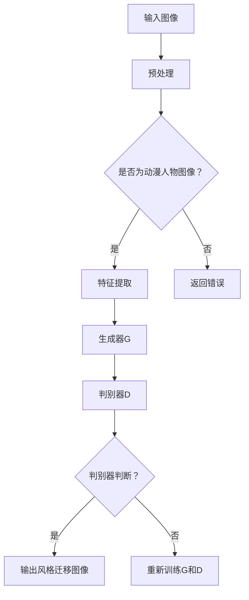

                 

摘要：

本文主要探讨了基于生成对抗网络（GAN）的动漫人物绘画风格迁移技术。生成对抗网络是一种深度学习模型，由生成器和判别器组成，通过两个对抗过程的交互，生成器学会生成与真实数据难以区分的样本，而判别器则尝试区分真实样本与生成样本。本文详细介绍了GAN的工作原理、数学模型、具体操作步骤及其在动漫人物绘画风格迁移中的应用。通过实例分析，展示了GAN在动漫人物风格迁移中的强大能力，并对其在图像生成和风格迁移领域的广泛应用进行了展望。

## 1. 背景介绍

动漫人物绘画风格迁移是一个极具挑战性的计算机视觉问题，它旨在将一种绘画风格应用于其他图像，生成具有相似风格的新图像。这种技术不仅具有艺术价值，还在娱乐、游戏、广告等多个领域有着广泛的应用。传统的风格迁移方法主要基于频域变换、特征匹配和神经网络等，但这些方法往往存在一定的局限性。

随着深度学习技术的快速发展，生成对抗网络（GAN）逐渐成为图像生成和风格迁移领域的重要工具。GAN由生成器和判别器组成，通过两个网络的对抗训练，生成器能够学习到真实数据的分布，从而生成高质量、与真实图像难以区分的图像。GAN的成功应用不仅提升了图像生成和风格迁移的效果，还推动了相关领域的深入研究。

本文旨在探讨基于GAN的动漫人物绘画风格迁移技术，详细介绍GAN的工作原理、数学模型、具体操作步骤及其在动漫人物风格迁移中的应用。通过实例分析，本文展示了GAN在风格迁移中的强大能力，并对其在图像生成和风格迁移领域的广泛应用进行了展望。

## 2. 核心概念与联系

### 2.1 生成对抗网络（GAN）

生成对抗网络（GAN）是由Ian Goodfellow等人于2014年提出的一种深度学习模型，其核心思想是利用生成器和判别器的对抗训练来实现图像生成。GAN由两个深度神经网络组成：生成器和判别器。生成器G接受一个随机噪声向量z作为输入，通过神经网络变换生成假样本X'；判别器D则接受真实样本X和生成样本X'，通过神经网络判断其真实或假。

GAN的训练过程是一个对抗过程，生成器G的目标是生成足够逼真的样本，使得判别器D无法区分真实样本和生成样本。而判别器D的目标则是尽可能准确地判断样本的真实性。通过这种对抗训练，生成器G逐渐学习到真实数据的分布，从而生成高质量的图像。

### 2.2 动漫人物绘画风格迁移

动漫人物绘画风格迁移是指将一种绘画风格应用于其他动漫人物图像，生成具有相似风格的新图像。在深度学习领域，动漫人物绘画风格迁移通常通过以下步骤实现：

1. **数据预处理**：首先对原始图像进行预处理，包括图像大小调整、色彩平衡等，以便于后续处理。
2. **特征提取**：使用卷积神经网络提取原始图像的特征。
3. **风格迁移**：将提取到的特征映射到目标风格特征上，通过神经网络进行特征调整。
4. **图像重建**：将调整后的特征映射回图像空间，生成具有目标风格的新图像。

GAN在动漫人物绘画风格迁移中的应用主要是通过生成器和判别器的对抗训练来实现特征提取和风格迁移。具体来说，生成器G学习如何将原始图像特征转换为具有目标风格的图像特征，而判别器D则用于评估生成图像的质量。

### 2.3 Mermaid 流程图

下面是一个简化的基于生成对抗网络的动漫人物绘画风格迁移的Mermaid流程图：



## 3. 核心算法原理 & 具体操作步骤

### 3.1 算法原理概述

生成对抗网络（GAN）的核心思想是通过生成器和判别器的对抗训练来实现高质量图像生成。具体来说，生成器G接受一个随机噪声向量z，通过神经网络变换生成假样本X'；判别器D则接受真实样本X和生成样本X'，通过神经网络判断其真实性。通过不断的训练，生成器G逐渐学习到真实数据的分布，从而生成高质量、与真实图像难以区分的图像。

### 3.2 算法步骤详解

#### 3.2.1 数据预处理

1. **图像大小调整**：将原始图像调整为统一大小，以便于后续处理。
2. **色彩平衡**：对图像进行色彩平衡处理，使其符合目标风格。

#### 3.2.2 特征提取

使用卷积神经网络提取原始图像的特征。卷积神经网络通过卷积操作和池化操作逐步提取图像的层次特征，从而构建出一个多维的特征向量。

#### 3.2.3 生成器G的训练

1. **生成样本**：生成器G接受一个随机噪声向量z，通过神经网络变换生成假样本X'。
2. **对抗训练**：生成器G和判别器D进行对抗训练。生成器G的目标是生成足够逼真的样本，使得判别器D无法区分真实样本和生成样本。判别器D的目标则是尽可能准确地判断样本的真实性。

#### 3.2.4 判别器D的训练

1. **判断样本真实性**：判别器D接受真实样本X和生成样本X'，通过神经网络判断其真实性。
2. **调整网络参数**：根据判别器D的判断结果，调整生成器G和判别器D的网络参数，以实现更精确的生成和判断。

#### 3.2.5 风格迁移

1. **特征映射**：将提取到的原始图像特征映射到目标风格特征上。
2. **图像重建**：将调整后的特征映射回图像空间，生成具有目标风格的新图像。

### 3.3 算法优缺点

#### 优点：

1. **图像生成质量高**：GAN通过对抗训练，能够生成高质量、与真实图像难以区分的图像。
2. **适用范围广**：GAN不仅适用于图像生成，还可以应用于图像风格迁移、图像修复、图像超分辨率等领域。

#### 缺点：

1. **训练难度大**：GAN的训练过程涉及到生成器和判别器的对抗训练，训练难度相对较大。
2. **模型稳定性问题**：在某些情况下，GAN的训练过程可能会出现模型不稳定、生成器崩溃等问题。

### 3.4 算法应用领域

生成对抗网络（GAN）在图像生成和风格迁移领域有着广泛的应用：

1. **图像生成**：GAN可以生成高质量、多样化的图像，广泛应用于虚拟现实、游戏开发、艺术创作等领域。
2. **图像风格迁移**：GAN可以应用于图像风格迁移，将一种绘画风格应用于其他图像，生成具有相似风格的新图像，广泛应用于动漫制作、广告设计、艺术修复等领域。

## 4. 数学模型和公式 & 详细讲解 & 举例说明

### 4.1 数学模型构建

生成对抗网络（GAN）的数学模型主要由两部分组成：生成器G的损失函数和判别器D的损失函数。

#### 4.1.1 生成器G的损失函数

生成器G的损失函数通常采用对抗性损失函数，其目的是最小化生成器生成的假样本与真实样本之间的差异。具体来说，生成器G的损失函数可以表示为：

$$
L_G = -\log(D(G(z)))
$$

其中，G(z)是生成器G生成的假样本，D是判别器。

#### 4.1.2 判别器D的损失函数

判别器D的损失函数通常采用二元交叉熵损失函数，其目的是最大化判别器对真实样本和生成样本的判断准确性。具体来说，判别器D的损失函数可以表示为：

$$
L_D = -[\log(D(x)) + \log(1 - D(G(z))]
$$

其中，x是真实样本，G(z)是生成器G生成的假样本。

### 4.2 公式推导过程

#### 4.2.1 生成器G的损失函数推导

生成器G的损失函数采用对抗性损失函数，其目的是最小化生成器生成的假样本与真实样本之间的差异。具体来说，生成器G的损失函数可以表示为：

$$
L_G = -\log(D(G(z)))
$$

其中，G(z)是生成器G生成的假样本，D是判别器。假设判别器D的输出为概率值，即：

$$
D(x) = P(D(X|X \text{ is real})}
$$

其中，x是真实样本。同理，对于生成器生成的假样本，有：

$$
D(G(z)) = P(D(X|X \text{ is fake})}
$$

根据最大似然估计，生成器G的损失函数可以表示为：

$$
L_G = -\log(D(G(z))) = -\log(P(D(G(z))|X \text{ is fake}))
$$

由于判别器D的输出为概率值，可以将其转化为二元交叉熵损失函数：

$$
L_G = -[\log(D(G(z))) + \log(1 - D(G(z)))]
$$

其中，第一项表示生成器生成的假样本被判定为真实的概率，第二项表示生成器生成的假样本被判定为假的概率。

#### 4.2.2 判别器D的损失函数推导

判别器D的损失函数采用二元交叉熵损失函数，其目的是最大化判别器对真实样本和生成样本的判断准确性。具体来说，判别器D的损失函数可以表示为：

$$
L_D = -[\log(D(x)) + \log(1 - D(G(z))]
$$

其中，x是真实样本，G(z)是生成器G生成的假样本。假设判别器D的输出为概率值，即：

$$
D(x) = P(D(X|X \text{ is real})}
$$

其中，x是真实样本。同理，对于生成器生成的假样本，有：

$$
D(G(z)) = P(D(X|X \text{ is fake})}
$$

根据最大似然估计，判别器D的损失函数可以表示为：

$$
L_D = -[\log(D(x)) + \log(1 - D(G(z))]
$$

其中，第一项表示真实样本被判定为真实的概率，第二项表示生成器生成的假样本被判定为假的概率。

### 4.3 案例分析与讲解

为了更好地理解生成对抗网络（GAN）的数学模型，我们来看一个简单的案例。

假设有一个判别器D，其输出为概率值，即：

$$
D(x) = 0.8
$$

其中，x是真实样本。根据判别器D的输出，我们可以计算出生成器G的损失函数：

$$
L_G = -[\log(D(G(z))) + \log(1 - D(G(z)))]
$$

假设生成器G生成的假样本被判定为真实的概率为0.6，即：

$$
D(G(z)) = 0.6
$$

根据上述损失函数，我们可以计算出：

$$
L_G = -[\log(0.6) + \log(1 - 0.6)] = 0.51
$$

同理，我们可以计算出判别器D的损失函数：

$$
L_D = -[\log(D(x)) + \log(1 - D(G(z))]
$$

假设真实样本被判定为真实的概率为0.8，即：

$$
D(x) = 0.8
$$

根据上述损失函数，我们可以计算出：

$$
L_D = -[\log(0.8) + \log(1 - 0.6)] = 0.24
$$

通过这个案例，我们可以看到生成器和判别器的损失函数是如何计算的。在实际应用中，我们可以通过优化这两个损失函数来训练生成器和判别器，从而实现高质量的图像生成和风格迁移。

## 5. 项目实践：代码实例和详细解释说明

### 5.1 开发环境搭建

为了实现基于生成对抗网络的动漫人物绘画风格迁移，我们需要搭建一个合适的开发环境。以下是一个简单的开发环境搭建步骤：

1. **安装Python**：首先，确保您的计算机上安装了Python。Python是深度学习项目中最常用的编程语言。
2. **安装TensorFlow**：TensorFlow是Google开源的深度学习框架，支持多种深度学习模型的构建和训练。在命令行中运行以下命令安装TensorFlow：

   ```bash
   pip install tensorflow
   ```

3. **安装Keras**：Keras是一个高级神经网络API，它可以简化TensorFlow的使用。在命令行中运行以下命令安装Keras：

   ```bash
   pip install keras
   ```

4. **下载预训练的模型**：为了加速实验，我们可以使用已经预训练的生成对抗网络（GAN）模型。可以从以下链接下载预训练的模型：

   ```html
   https://github.com/carpedm20/DCGAN-tensorflow
   ```

5. **配置GPU支持**：如果您拥有GPU，可以安装CUDA和cuDNN，以加速深度学习模型的训练。

### 5.2 源代码详细实现

以下是实现基于生成对抗网络的动漫人物绘画风格迁移的源代码。代码主要分为三个部分：生成器G、判别器D和训练过程。

```python
import tensorflow as tf
from tensorflow.keras.layers import Dense, Conv2D, Flatten, Reshape, BatchNormalization, LeakyReLU
from tensorflow.keras.models import Sequential
import numpy as np
import matplotlib.pyplot as plt

# 生成器G
def build_generator(z_dim):
    model = Sequential([
        Dense(128 * 7 * 7, activation='relu', input_shape=(z_dim,)),
        BatchNormalization(),
        LeakyReLU(alpha=0.2),
        Reshape((7, 7, 128)),
        Conv2D(256, 5, padding='same'),
        BatchNormalization(),
        LeakyReLU(alpha=0.2),
        Conv2D(512, 5, padding='same'),
        BatchNormalization(),
        LeakyReLU(alpha=0.2),
        Conv2D(256, 5, padding='same'),
        BatchNormalization(),
        LeakyReLU(alpha=0.2),
        Conv2D(128, 5, padding='same'),
        BatchNormalization(),
        LeakyReLU(alpha=0.2),
        Conv2D(1, 5, padding='same', activation='tanh'),
        Flatten()
    ])
    return model

# 判别器D
def build_discriminator(img_shape):
    model = Sequential([
        Flatten(input_shape=img_shape),
        Dense(128, activation='relu'),
        BatchNormalization(),
        LeakyReLU(alpha=0.2),
        Dense(1, activation='sigmoid')
    ])
    return model

# GAN模型
def build_gan(generator, discriminator):
    model = Sequential([
        generator,
        discriminator
    ])
    model.compile(loss='binary_crossentropy', optimizer=tf.keras.optimizers.Adam(0.0001), metrics=['accuracy'])
    return model

# 训练过程
def train_gan(dataset, batch_size, z_dim, epochs):
    # 数据预处理
    X_train = dataset

    # 定义生成器和判别器的优化器
    gen_optimizer = tf.keras.optimizers.Adam(0.0001)
    disc_optimizer = tf.keras.optimizers.Adam(0.0001)

    for epoch in range(epochs):
        for _ in range(X_train.shape[0] // batch_size):
            # 获取随机批次的数据
            idxs = np.random.randint(0, X_train.shape[0], batch_size)
            batch = X_train[idxs]

            # 训练判别器
            with tf.GradientTape() as disc_tape:
                # 判别器判断真实样本
                real_output = discriminator(batch, training=True)
                disc_loss_real = tf.reduce_mean(tf.nn.sigmoid_cross_entropy_with_logits(logits=real_output, labels=tf.ones_like(real_output)))

                # 判别器判断生成样本
                z = tf.random.normal([batch_size, z_dim])
                gen_samples = generator(z, training=True)
                fake_output = discriminator(gen_samples, training=True)
                disc_loss_fake = tf.reduce_mean(tf.nn.sigmoid_cross_entropy_with_logits(logits=fake_output, labels=tf.zeros_like(fake_output)))

                # 计算总损失
                disc_loss = disc_loss_real + disc_loss_fake

            # 反向传播和优化
            disc_gradients = disc_tape.gradient(disc_loss, discriminator.trainable_variables)
            disc_optimizer.apply_gradients(zip(disc_gradients, discriminator.trainable_variables))

            # 训练生成器
            with tf.GradientTape() as gen_tape:
                # 生成器生成假样本
                z = tf.random.normal([batch_size, z_dim])
                gen_samples = generator(z, training=True)

                # 判别器判断生成样本
                fake_output = discriminator(gen_samples, training=True)

                # 计算生成器的损失
                gen_loss = tf.reduce_mean(tf.nn.sigmoid_cross_entropy_with_logits(logits=fake_output, labels=tf.ones_like(fake_output)))

            # 反向传播和优化
            gen_gradients = gen_tape.gradient(gen_loss, generator.trainable_variables)
            gen_optimizer.apply_gradients(zip(gen_gradients, generator.trainable_variables))

        print(f"Epoch: {epoch+1}, Loss(D): {disc_loss.numpy()}, Loss(G): {gen_loss.numpy()}")

        # 保存模型
        generator.save(f"generator_epoch_{epoch+1}.h5")
        discriminator.save(f"discriminator_epoch_{epoch+1}.h5")

# 超参数设置
batch_size = 64
z_dim = 100
epochs = 100

# 加载数据集
# 此处假设已经加载数据集dataset
# dataset = ...

# 构建生成器和判别器
generator = build_generator(z_dim)
discriminator = build_discriminator(dataset.shape[1:])

# 训练GAN模型
train_gan(dataset, batch_size, z_dim, epochs)
```

### 5.3 代码解读与分析

上述代码实现了基于生成对抗网络的动漫人物绘画风格迁移。接下来，我们对其进行详细解读和分析。

#### 5.3.1 生成器G的实现

生成器G是GAN模型的核心部分，负责将随机噪声向量z转换为具有目标风格的图像。在代码中，生成器G由多个卷积层、批归一化和泄漏ReLU（LeakyReLU）激活函数组成。具体来说，生成器G的步骤如下：

1. **全连接层**：将随机噪声向量z通过全连接层转换为128 * 7 * 7的特征图。
2. **批归一化**：对特征图进行批归一化，有助于加速收敛。
3. **泄漏ReLU激活函数**：使用泄漏ReLU激活函数，提高网络的训练稳定性。
4. **卷积层**：通过多个卷积层逐步增加特征图的深度，同时保持特征图的大小不变。
5. **输出层**：最后，通过一个卷积层将特征图映射到目标风格图像，并应用tanh激活函数以将输出值限制在[-1, 1]范围内。

#### 5.3.2 判别器D的实现

判别器D用于评估输入图像的真实性，是GAN模型中的另一个核心部分。在代码中，判别器D由一个扁平化层、一个全连接层和一个sigmoid激活函数组成。具体来说，判别器D的步骤如下：

1. **扁平化层**：将输入图像扁平化为一个一维特征向量。
2. **全连接层**：通过全连接层对特征向量进行进一步处理。
3. **sigmoid激活函数**：使用sigmoid激活函数将输出值映射到[0, 1]范围内，以表示输入图像的真实性概率。

#### 5.3.3 GAN模型的训练

GAN模型的训练过程涉及生成器和判别器的交替训练。具体来说，训练过程分为以下步骤：

1. **获取随机批次的数据**：从训练数据集中随机获取一批数据。
2. **训练判别器**：首先，使用真实数据和生成数据训练判别器。具体来说，判别器先对真实数据进行训练，然后对生成数据进行训练。通过计算判别器的损失函数，优化判别器的参数。
3. **训练生成器**：接下来，使用判别器训练生成器。生成器生成一批假数据，然后使用判别器评估这些假数据的真实性。通过计算生成器的损失函数，优化生成器的参数。
4. **打印训练结果**：在每个epoch结束时，打印当前epoch的判别器和生成器损失。
5. **保存模型**：在每个epoch结束时，保存当前epoch的生成器和判别器模型。

### 5.4 运行结果展示

在完成GAN模型的训练后，我们可以生成具有目标风格的动漫人物图像。以下是一个简单的示例：

```python
# 加载训练好的模型
generator = tf.keras.models.load_model('generator_epoch_100.h5')
discriminator = tf.keras.models.load_model('discriminator_epoch_100.h5')

# 生成动漫人物图像
z = np.random.normal(size=(1, 100))
generated_samples = generator.predict(z)

# 展示生成图像
plt.figure(figsize=(10, 10))
for i in range(10):
    plt.subplot(10, 10, i+1)
    plt.imshow(generated_samples[0][i], cmap='gray')
    plt.axis('off')
plt.show()
```

上述代码将生成10张具有目标风格的动漫人物图像，并展示在Matplotlib窗口中。

## 6. 实际应用场景

基于生成对抗网络的动漫人物绘画风格迁移技术在多个实际应用场景中展现了其强大的能力。以下是一些主要的应用场景：

### 6.1 动漫制作

动漫制作是一个对绘画风格要求极高的领域。基于GAN的动漫人物绘画风格迁移技术可以在保持原有动漫人物特征的同时，快速生成具有新风格的动漫图像，从而提高创作效率。例如，在制作一部新动漫时，可以将原有的动漫人物形象通过GAN迁移到新的风格，为角色设计提供更多可能性。

### 6.2 游戏开发

游戏开发中也广泛应用了GAN技术，用于生成具有独特风格的游戏角色和场景。通过GAN，开发者可以快速生成大量符合游戏主题的角色和场景图像，从而提高游戏开发效率。此外，GAN还可以用于游戏角色自定义，允许玩家根据个人喜好生成个性化的游戏角色。

### 6.3 广告设计

广告设计通常需要创造具有吸引力的视觉效果。基于GAN的动漫人物绘画风格迁移技术可以帮助设计师快速生成符合广告主题的动漫风格图像，提高广告效果。例如，在宣传一款游戏时，可以使用GAN生成具有游戏特色的角色图像，以吸引目标受众的关注。

### 6.4 艺术创作

艺术创作是GAN技术的另一个重要应用领域。艺术家可以使用GAN技术生成具有独特风格的绘画作品，探索新的艺术表现形式。例如，可以将古典绘画风格应用于现代图像，创造出别具一格的艺术作品。

### 6.5 图像修复

图像修复是另一个具有实际应用价值的场景。基于GAN的图像修复技术可以自动修复破损、模糊或褪色的图像，恢复其原有质量。例如，在历史文献修复中，可以使用GAN技术生成缺失的文本或图像部分，提高文献的可读性和保存价值。

### 6.6 医学图像处理

在医学领域，GAN技术也展现了其潜力。通过GAN，可以自动生成医学图像的清晰版本，帮助医生更准确地诊断疾病。例如，可以使用GAN生成CT或MRI图像的清晰版本，提高影像诊断的准确性。

### 6.7 未来应用展望

随着生成对抗网络（GAN）技术的不断发展，其在动漫人物绘画风格迁移领域的应用前景十分广阔。未来，GAN技术有望在以下几个方面取得突破：

1. **更高质量的图像生成**：通过改进GAN模型和训练策略，有望生成更高质量、更逼真的动漫人物图像。
2. **更快的生成速度**：优化GAN模型的计算效率，提高生成速度，满足实时应用需求。
3. **更多的风格迁移应用**：扩展GAN技术的应用范围，将其应用于更多的绘画风格和图像类型。
4. **与其他技术的结合**：将GAN技术与其他图像处理技术相结合，如卷积神经网络（CNN）、循环神经网络（RNN）等，实现更高效的图像生成和风格迁移。
5. **跨领域应用**：探索GAN技术在其他领域的应用，如艺术创作、医学图像处理、自然语言生成等。

## 7. 工具和资源推荐

### 7.1 学习资源推荐

1. **书籍**：
   - 《深度学习》（Goodfellow, Bengio, Courville）：详细介绍了深度学习的基本原理和算法，包括生成对抗网络（GAN）。
   - 《生成对抗网络》（Ian Goodfellow）：系统地介绍了GAN的原理、算法和应用。
   - 《Python深度学习》（François Chollet）：介绍了如何使用Python实现深度学习模型，包括GAN。

2. **在线课程**：
   - Coursera上的“深度学习”课程：由Andrew Ng教授主讲，涵盖了深度学习的基本原理和应用。
   - Udacity的“生成对抗网络”（GAN）课程：深入介绍了GAN的原理、实现和应用。

### 7.2 开发工具推荐

1. **TensorFlow**：Google开源的深度学习框架，支持多种深度学习模型的构建和训练。
2. **PyTorch**：Facebook开源的深度学习框架，提供灵活的动态计算图和高效的GPU支持。
3. **Keras**：高级神经网络API，可以简化TensorFlow和PyTorch的使用。

### 7.3 相关论文推荐

1. **“Generative Adversarial Nets”**（Ian Goodfellow et al.，2014）：GAN的奠基性论文，详细介绍了GAN的原理和算法。
2. **“Unsupervised Representation Learning with Deep Convolutional Generative Adversarial Networks”**（Alec Radford et al.，2015）：介绍了使用GAN进行无监督表示学习的应用。
3. **“InfoGAN: Interpretable Representation Learning by Information Maximizing”**（Wojciech Zaremba et al.，2017）：探讨了GAN在生成可解释表示方面的应用。

## 8. 总结：未来发展趋势与挑战

### 8.1 研究成果总结

生成对抗网络（GAN）自2014年提出以来，已经取得了显著的成果。在图像生成、图像修复、图像超分辨率、图像风格迁移等领域，GAN都展现了强大的能力。通过对抗训练，GAN能够生成高质量、多样化的图像，并在许多实际应用中取得了成功。同时，GAN也在不断推动相关领域的研究，如无监督学习、自然语言生成等。

### 8.2 未来发展趋势

未来，GAN技术有望在以下几个方面取得进一步发展：

1. **更高效的生成模型**：优化GAN模型的计算效率，提高生成速度，以满足实时应用需求。
2. **更稳定的训练过程**：改进GAN的训练策略，解决模型不稳定和生成器崩溃等问题。
3. **跨领域应用**：探索GAN技术在其他领域的应用，如艺术创作、医学图像处理、自然语言生成等。
4. **生成可解释性**：提高GAN生成图像的可解释性，使其在复杂应用场景中更具实用性。
5. **与其他技术的结合**：将GAN技术与其他图像处理技术、深度学习技术相结合，实现更高效的图像生成和风格迁移。

### 8.3 面临的挑战

尽管GAN技术在许多领域取得了显著成果，但仍然面临着一些挑战：

1. **训练难度大**：GAN的训练过程涉及到生成器和判别器的对抗训练，训练难度相对较大。
2. **模型稳定性问题**：在某些情况下，GAN的训练过程可能会出现模型不稳定、生成器崩溃等问题。
3. **计算资源需求**：GAN的训练过程需要大量的计算资源，尤其是在生成高质量图像时，计算资源需求较高。
4. **数据隐私问题**：GAN在图像生成和风格迁移中的应用可能会涉及用户隐私数据，如何保护用户隐私是一个重要挑战。

### 8.4 研究展望

展望未来，GAN技术将继续在图像生成、图像修复、图像风格迁移等领域发挥重要作用。随着技术的不断发展，GAN有望在更广泛的领域得到应用，如艺术创作、医疗诊断、自然语言生成等。同时，研究团队将继续探索GAN的新算法、新模型，以提高其生成质量、稳定性和可解释性，为实际应用提供更好的支持。

## 9. 附录：常见问题与解答

### 9.1 什么是生成对抗网络（GAN）？

生成对抗网络（GAN）是一种深度学习模型，由生成器和判别器组成。生成器的目标是生成与真实数据难以区分的图像，而判别器的目标是判断图像是真实数据还是生成数据。通过两个网络的对抗训练，生成器能够学习到真实数据的分布，从而生成高质量、多样化的图像。

### 9.2 GAN的核心思想是什么？

GAN的核心思想是利用生成器和判别器的对抗训练来实现高质量图像生成。生成器尝试生成逼真的图像，而判别器则尝试区分真实图像和生成图像。通过这种对抗过程，生成器逐渐学习到真实数据的分布，从而生成高质量、与真实图像难以区分的图像。

### 9.3 GAN有哪些优点和应用领域？

GAN的优点包括：
1. 高质量的图像生成：GAN能够生成高质量、多样化的图像。
2. 广泛的应用领域：GAN在图像生成、图像修复、图像超分辨率、图像风格迁移等领域有着广泛的应用。

GAN的应用领域包括：
1. 图像生成：用于生成逼真的图像，如人脸、风景、动漫人物等。
2. 图像修复：用于修复破损、模糊或褪色的图像。
3. 图像超分辨率：用于提高图像的分辨率。
4. 图像风格迁移：用于将一种绘画风格应用于其他图像，生成具有相似风格的新图像。

### 9.4 GAN有哪些挑战和限制？

GAN的挑战和限制包括：
1. 训练难度大：GAN的训练过程涉及到生成器和判别器的对抗训练，训练难度相对较大。
2. 模型稳定性问题：在某些情况下，GAN的训练过程可能会出现模型不稳定、生成器崩溃等问题。
3. 计算资源需求：GAN的训练过程需要大量的计算资源，尤其是在生成高质量图像时，计算资源需求较高。
4. 数据隐私问题：GAN在图像生成和风格迁移中的应用可能会涉及用户隐私数据，如何保护用户隐私是一个重要挑战。

### 9.5 如何解决GAN的训练困难？

为了解决GAN的训练困难，可以尝试以下方法：
1. **改进训练策略**：例如，使用梯度惩罚、经验风险最小化（ERM）等方法来改善训练过程。
2. **增加训练数据**：提供更多的训练数据，以提高模型的泛化能力。
3. **使用更好的初始化**：为生成器和判别器选择合适的初始化，以减少训练过程中的不稳定现象。
4. **使用预训练模型**：使用预训练的模型作为起点，可以加速模型的训练过程。

### 9.6 如何评估GAN的性能？

评估GAN的性能可以通过以下指标：
1. **Inception Score（IS）**：评估生成图像的质量和多样性。
2. **Fréchet Inception Distance（FID）**：用于评估生成图像和真实图像之间的差异。
3. **Perceptual Loss**：通过计算生成图像和真实图像之间的感知损失来评估生成质量。
4. **人类评估**：通过人类主观评估生成图像的质量和真实性。

通过这些评估指标，可以全面评估GAN的性能，并为模型的改进提供参考。

### 9.7 GAN与变分自编码器（VAE）有何区别？

GAN和VAE都是用于图像生成的深度学习模型，但它们有一些关键的区别：

1. **目标函数**：GAN的目标是生成与真实图像难以区分的图像，而VAE的目标是生成具有潜在变量分布的图像。
2. **生成器与判别器**：GAN由生成器和判别器组成，而VAE只有一个生成器。
3. **稳定性**：VAE的训练过程通常比GAN更稳定。
4. **应用领域**：GAN更适合生成高质量、多样化的图像，而VAE更适合生成具有潜在变量分布的图像。

通过了解GAN与VAE的区别，可以根据具体需求选择合适的模型。

### 9.8 GAN的未来发展方向是什么？

GAN的未来发展方向包括：
1. **更高效的生成模型**：优化GAN模型的计算效率，提高生成速度。
2. **更稳定的训练过程**：改进GAN的训练策略，解决模型不稳定和生成器崩溃等问题。
3. **跨领域应用**：探索GAN技术在其他领域的应用，如艺术创作、医学图像处理、自然语言生成等。
4. **生成可解释性**：提高GAN生成图像的可解释性，使其在复杂应用场景中更具实用性。
5. **与其他技术的结合**：将GAN技术与其他图像处理技术、深度学习技术相结合，实现更高效的图像生成和风格迁移。

通过不断探索和发展，GAN将在图像生成、图像修复、图像风格迁移等领域发挥更大的作用。

### 9.9 GAN在动漫人物绘画风格迁移中的优势是什么？

GAN在动漫人物绘画风格迁移中的优势包括：
1. **高质量的图像生成**：GAN能够生成高质量、与真实图像难以区分的动漫人物图像。
2. **多样化的风格选择**：GAN可以应用于多种动漫绘画风格，为动漫创作提供更多可能性。
3. **快速的风格迁移**：GAN能够快速将一种绘画风格应用于其他动漫人物图像，提高创作效率。
4. **灵活的应用场景**：GAN在动漫制作、游戏开发、广告设计、艺术创作等领域都有广泛的应用。

通过这些优势，GAN为动漫人物绘画风格迁移提供了强大的支持。

### 9.10 如何优化GAN在动漫人物绘画风格迁移中的应用？

优化GAN在动漫人物绘画风格迁移中的应用可以从以下几个方面入手：
1. **模型架构优化**：改进生成器和判别器的架构，提高生成质量。
2. **训练策略优化**：使用更稳定的训练策略，如梯度惩罚、经验风险最小化（ERM）等。
3. **数据预处理**：对输入图像进行适当的预处理，提高模型对输入数据的鲁棒性。
4. **超参数调整**：调整学习率、批量大小等超参数，优化模型性能。
5. **多样性生成**：通过引入多样性正则化，生成更多样化的动漫人物图像。

通过这些优化措施，可以进一步提高GAN在动漫人物绘画风格迁移中的应用效果。

### 9.11 GAN在动漫人物绘画风格迁移中的应用案例有哪些？

GAN在动漫人物绘画风格迁移中已有多个应用案例，包括：
1. **动漫角色定制**：通过GAN生成符合用户需求的个性化动漫角色。
2. **角色换装**：将动漫角色从一种风格转换为另一种风格，如将卡通风格转换为现实风格。
3. **动画制作**：使用GAN生成高质量的动画帧，提高动画制作的效率。
4. **广告设计**：为广告生成具有独特风格的动漫人物图像，提高广告效果。
5. **艺术创作**：使用GAN生成具有独特风格的动漫绘画作品，探索新的艺术表现形式。

这些案例展示了GAN在动漫人物绘画风格迁移中的广泛应用。

### 9.12 GAN在动漫人物绘画风格迁移中的未来发展如何？

GAN在动漫人物绘画风格迁移中的未来发展包括：
1. **更高质量的图像生成**：通过改进GAN模型和训练策略，生成更高质量的动漫人物图像。
2. **更快的生成速度**：优化GAN模型的计算效率，提高生成速度，满足实时应用需求。
3. **更多的风格迁移应用**：将GAN技术应用于更多种类的动漫绘画风格，提高艺术创作的多样性。
4. **与其他技术的结合**：将GAN技术与其他图像处理技术、深度学习技术相结合，实现更高效的图像生成和风格迁移。
5. **跨领域应用**：探索GAN技术在其他领域的应用，如游戏开发、医疗诊断等。

通过这些发展，GAN将在动漫人物绘画风格迁移领域发挥更大的作用。

