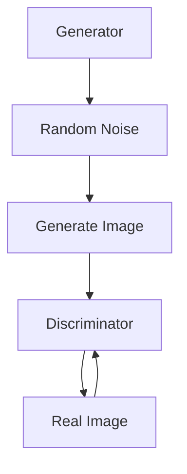

                 

关键词：生成对抗网络（GAN），图像风格迁移，竞赛平台，深度学习，图像处理，算法优化，AI应用

## 摘要

本文主要探讨了基于生成对抗网络（GAN）的图像风格迁移竞赛平台的建设。首先，对生成对抗网络的基本原理进行了详细介绍，包括GAN的工作机制、核心组件及其训练过程。接着，对图像风格迁移技术进行了阐述，分析了其在艺术创作、影视后期、游戏设计等领域的应用。随后，本文重点介绍了如何搭建一个基于GAN的图像风格迁移竞赛平台，包括平台架构设计、功能模块划分、数据集准备、算法实现以及用户体验设计。最后，对平台的建设成果进行了总结，并对未来的发展方向和潜在挑战提出了展望。

## 1. 背景介绍

图像风格迁移是一种通过学习特定图像风格的代表性特征，将源图像转换为目标风格图像的技术。这一技术在艺术创作、影视后期、游戏设计等领域具有广泛的应用。然而，传统的图像风格迁移方法往往依赖于手工设计的特征提取和匹配策略，难以适应多样化的风格迁移需求。

近年来，生成对抗网络（GAN）的出现为图像风格迁移提供了一种新的解决思路。GAN是一种深度学习模型，由生成器和判别器两个主要部分组成。生成器的任务是生成与真实数据相近的图像，而判别器的任务是区分真实图像和生成图像。通过这种对抗训练，GAN能够学习到数据的高维度分布，从而实现高质量的图像生成。

## 2. 核心概念与联系

### 2.1 生成对抗网络（GAN）的基本原理

生成对抗网络（GAN）由生成器（Generator）和判别器（Discriminator）两个神经网络组成。生成器的目标是生成与真实数据分布相近的假数据，而判别器的目标是准确地区分真实数据和生成数据。两者之间进行对抗训练，以达到最佳性能。

#### 2.1.1 生成器（Generator）

生成器的输入是随机噪声向量 \(z\)，输出是生成的假图像 \(G(z)\)。生成器的目标是生成逼真的图像，使得判别器无法区分真假。

$$
G(z) = \text{Generator}(z)
$$

#### 2.1.2 判别器（Discriminator）

判别器的输入是真实图像和生成图像，输出是二分类结果，即判断图像是真实图像还是生成图像。

$$
D(x) = \text{Discriminator}(x) \\
D(G(z)) = \text{Discriminator}(G(z))
$$

#### 2.1.3 损失函数

GAN的训练过程是基于生成器和判别器的损失函数来进行的。通常使用以下两个损失函数：

$$
L_D = -\frac{1}{N}\sum_{i=1}^{N} [\log D(x_i) + \log(1 - D(G(z_i))]
$$

$$
L_G = -\log D(G(z))
$$

其中，\(N\) 是批大小，\(x_i\) 是真实图像，\(z_i\) 是生成器生成的随机噪声向量。

### 2.2 生成对抗网络（GAN）的架构图

以下是一个简单的 Mermaid 流程图，展示了生成对抗网络（GAN）的基本架构：



### 2.3 图像风格迁移与生成对抗网络的关系

图像风格迁移的目标是将源图像的视觉效果转移到目标图像上。生成对抗网络通过学习源图像和目标图像的特征分布，实现图像风格的迁移。具体来说，生成对抗网络将源图像和目标图像作为训练数据，通过对抗训练学习到源图像和目标图像的潜在特征分布，从而生成具有目标图像风格的源图像。

### 2.4 图像风格迁移的挑战

图像风格迁移面临着以下挑战：

1. **风格多样性**：需要处理多种不同的图像风格，如油画、素描、水彩等。
2. **内容保持**：在风格迁移过程中，需要保证源图像的内容不受过多影响。
3. **计算资源**：生成对抗网络训练过程需要大量的计算资源，尤其是在处理高分辨率图像时。

## 3. 核心算法原理 & 具体操作步骤

### 3.1 算法原理概述

生成对抗网络（GAN）的算法原理已经在第2节中进行了详细介绍。在本节中，我们将进一步探讨图像风格迁移的具体实现步骤。

### 3.2 算法步骤详解

#### 3.2.1 数据集准备

1. **源图像数据集**：选择具有丰富风格特征的图像，如艺术作品、电影截图等。
2. **目标图像数据集**：选择具有特定风格特征的图像，如油画、素描等。
3. **数据预处理**：对图像进行归一化、裁剪、旋转等预处理操作。

#### 3.2.2 模型设计

1. **生成器设计**：设计一个包含多个卷积层和反卷积层的神经网络，用于生成具有目标风格的图像。
2. **判别器设计**：设计一个包含多个卷积层的神经网络，用于区分真实图像和生成图像。

#### 3.2.3 模型训练

1. **初始化模型参数**：随机初始化生成器和判别器的参数。
2. **对抗训练**：通过对抗训练优化生成器和判别器的参数，使生成器生成的图像越来越接近真实图像，而判别器能够准确地区分真实图像和生成图像。
3. **损失函数优化**：通过优化损失函数，使生成器和判别器在对抗训练过程中达到最佳性能。

#### 3.2.4 风格迁移

1. **生成风格特征**：使用训练好的生成器，将源图像转换为具有目标风格的图像。
2. **调整生成结果**：根据生成图像的质量和风格，对生成结果进行调整。

### 3.3 算法优缺点

#### 优点

1. **高质量图像生成**：生成对抗网络能够生成高质量的图像，特别是在处理高分辨率图像时。
2. **灵活性**：生成对抗网络能够适应多种不同的风格迁移需求。
3. **计算资源高效**：生成对抗网络的训练过程可以在计算资源有限的条件下进行。

#### 缺点

1. **训练不稳定**：生成对抗网络的训练过程容易受到噪声和异常值的影响，导致训练不稳定。
2. **计算资源消耗**：生成对抗网络的训练过程需要大量的计算资源，特别是在处理高分辨率图像时。

### 3.4 算法应用领域

生成对抗网络在图像风格迁移领域的应用广泛，包括但不限于以下领域：

1. **艺术创作**：通过图像风格迁移，艺术家可以轻松地将一种风格应用到另一种风格上，创造出独特的作品。
2. **影视后期**：在电影制作过程中，图像风格迁移可以用于特效制作和场景转换。
3. **游戏设计**：在游戏开发中，图像风格迁移可以用于场景渲染和角色造型。

## 4. 数学模型和公式 & 详细讲解 & 举例说明

### 4.1 数学模型构建

生成对抗网络（GAN）的数学模型主要由生成器 \(G\) 和判别器 \(D\) 构成。生成器的输入是一个随机噪声向量 \(z\)，输出是一个生成的图像 \(x'\)。判别器的输入是一个真实图像 \(x\) 或生成的图像 \(x'\)，输出是一个概率值 \(D(x)\) 或 \(D(x')\)，表示输入图像是真实图像的概率。

定义生成器的损失函数 \(L_G\) 和判别器的损失函数 \(L_D\) 如下：

$$
L_G = -\log(D(G(z)))
$$

$$
L_D = -[\log(D(x)) + \log(1 - D(G(z))]
$$

其中，\(z\) 是随机噪声向量，\(x\) 是真实图像，\(x'\) 是生成图像，\(D(x)\) 和 \(D(x')\) 分别表示判别器对真实图像和生成图像的判断结果。

### 4.2 公式推导过程

生成对抗网络（GAN）的训练目标是优化生成器 \(G\) 和判别器 \(D\) 的参数，使得生成器能够生成逼真的图像，而判别器能够准确地区分真实图像和生成图像。

#### 4.2.1 生成器的损失函数 \(L_G\)

生成器的损失函数 \(L_G\) 是基于判别器 \(D\) 的输出 \(D(G(z))\) 来定义的。理想情况下，生成器生成的图像 \(x'\) 应该尽可能接近真实图像 \(x\)，使得判别器 \(D\) 无法区分 \(x'\) 和 \(x\)。因此，生成器的损失函数 \(L_G\) 可以表示为：

$$
L_G = -\log(D(G(z)))
$$

其中，\(D(G(z))\) 是判别器对生成图像 \(G(z)\) 的判断结果。当 \(D(G(z))\) 接近 1 时，生成器 \(G\) 的损失函数 \(L_G\) 最小。

#### 4.2.2 判别器的损失函数 \(L_D\)

判别器的损失函数 \(L_D\) 是基于真实图像 \(x\) 和生成图像 \(x'\) 的判断结果来定义的。理想情况下，判别器 \(D\) 应该能够准确地区分真实图像 \(x\) 和生成图像 \(x'\)。因此，判别器的损失函数 \(L_D\) 可以表示为：

$$
L_D = -[\log(D(x)) + \log(1 - D(G(z))]
$$

其中，\(D(x)\) 是判别器对真实图像 \(x\) 的判断结果，\(D(G(z))\) 是判别器对生成图像 \(G(z)\) 的判断结果。当 \(D(x)\) 接近 1 且 \(D(G(z))\) 接近 0 时，判别器 \(D\) 的损失函数 \(L_D\) 最小。

#### 4.2.3 整体损失函数

生成对抗网络（GAN）的整体损失函数是生成器损失函数 \(L_G\) 和判别器损失函数 \(L_D\) 的组合。整体损失函数可以表示为：

$$
L = L_G + \lambda L_D
$$

其中，\(\lambda\) 是平衡生成器和判别器损失函数的权重系数。通常情况下，选择 \(\lambda = 1\)。

### 4.3 案例分析与讲解

为了更好地理解生成对抗网络（GAN）的数学模型，我们通过一个简单的例子来进行讲解。

假设我们有一个生成器 \(G\) 和一个判别器 \(D\)，生成器和判别器的输入都是一张图片，输出都是一个概率值。生成器 \(G\) 的任务是通过输入一张随机噪声向量 \(z\)，生成一张逼真的图像 \(x'\)。判别器 \(D\) 的任务是判断输入图像是真实图像 \(x\) 还是生成图像 \(x'\)。

首先，我们初始化生成器 \(G\) 和判别器 \(D\) 的参数。然后，我们通过以下步骤来训练生成对抗网络：

1. **生成图像**：生成器 \(G\) 输入随机噪声向量 \(z\)，生成一张图像 \(x'\)。

2. **判断图像**：判别器 \(D\) 输入真实图像 \(x\) 和生成图像 \(x'\)，分别输出两个概率值 \(D(x)\) 和 \(D(x')\)。

3. **计算损失函数**：计算生成器和判别器的损失函数 \(L_G\) 和 \(L_D\)。

4. **更新参数**：通过反向传播算法，更新生成器 \(G\) 和判别器 \(D\) 的参数。

5. **重复步骤**：重复以上步骤，直到生成器 \(G\) 生成的图像 \(x'\) 非常接近真实图像 \(x\)，而判别器 \(D\) 无法准确地区分 \(x'\) 和 \(x\)。

通过这个例子，我们可以看到生成对抗网络（GAN）的训练过程是如何进行的。生成器和判别器的参数通过对抗训练不断更新，最终生成器 \(G\) 能够生成高质量、逼真的图像，而判别器 \(D\) 无法准确地区分真实图像和生成图像。

## 5. 项目实践：代码实例和详细解释说明

### 5.1 开发环境搭建

在本节中，我们将介绍如何搭建一个用于图像风格迁移的生成对抗网络（GAN）的开发环境。为了简化开发过程，我们选择了 Python 作为编程语言，并使用 TensorFlow 和 Keras 作为主要的深度学习框架。

#### 5.1.1 硬件环境

- CPU：Intel i5 或以上处理器
- GPU：NVIDIA 显卡（推荐 GTX 1080 或以上）
- 内存：8GB 或以上

#### 5.1.2 软件环境

1. Python 3.x
2. TensorFlow 2.x
3. Keras 2.x
4. GPU 驱动程序（如 NVIDIA CUDA Toolkit）

### 5.2 源代码详细实现

下面是一个简单的图像风格迁移的 GAN 实现，包括生成器、判别器和训练过程。

```python
import numpy as np
import tensorflow as tf
from tensorflow.keras.models import Model
from tensorflow.keras.layers import Input, Dense, Reshape, Flatten
from tensorflow.keras.optimizers import Adam

# 生成器模型
def build_generator(z_dim):
    z = Input(shape=(z_dim,))
    x = Dense(128, activation='relu')(z)
    x = Dense(784, activation='tanh')(x)
    x = Reshape((28, 28, 1))(x)
    generator = Model(z, x)
    return generator

# 判别器模型
def build_discriminator(img_shape):
    img = Input(shape=img_shape)
    x = Flatten()(img)
    x = Dense(128, activation='relu')(x)
    validity = Dense(1, activation='sigmoid')(x)
    discriminator = Model(img, validity)
    return discriminator

# GAN 模型
def build_gan(generator, discriminator):
    z = Input(shape=(100,))
    img = generator(z)
    validity = discriminator(img)
    gan = Model(z, validity)
    return gan

# 准备数据
def load_data(data_path):
    # 加载训练数据
    # data = ...

# 训练模型
def train_model(generator, discriminator, gan, data, epochs, batch_size):
    gan_optimizer = Adam(0.0002, 0.5)
    for epoch in range(epochs):
        for _ in range(data.shape[0] // batch_size):
            # 准备批数据
            batch = ...

            # 训练判别器
            with tf.GradientTape() as disc_tape:
                disc_loss = ...

            disc_gradients = disc_tape.gradient(disc_loss, discriminator.trainable_variables)
            disc_optimizer.apply_gradients(zip(disc_gradients, discriminator.trainable_variables))

            # 训练生成器
            with tf.GradientTape() as gen_tape:
                gen_loss = ...

            gen_gradients = gen_tape.gradient(gen_loss, generator.trainable_variables)
            gen_optimizer.apply_gradients(zip(gen_gradients, generator.trainable_variables))

            # 打印训练进度
            if _ % 100 == 0:
                print(f'Epoch [{epoch}/{epochs}], Batch [{_}/{data.shape[0] // batch_size}], '
                      f'Disc Loss: {disc_loss:.4f}, Gen Loss: {gen_loss:.4f}')

if __name__ == '__main__':
    # 设置训练参数
    z_dim = 100
    img_shape = (28, 28, 1)
    batch_size = 128
    epochs = 1000

    # 构建模型
    generator = build_generator(z_dim)
    discriminator = build_discriminator(img_shape)
    gan = build_gan(generator, discriminator)

    # 加载数据
    data = load_data('data/mnist_train.csv')

    # 训练模型
    train_model(generator, discriminator, gan, data, epochs, batch_size)
```

### 5.3 代码解读与分析

上述代码实现了图像风格迁移的生成对抗网络（GAN）。下面我们逐行解读代码，了解各个模块的功能和实现细节。

#### 5.3.1 生成器模型

生成器模型 `build_generator` 用于生成与真实图像相似的图像。生成器的输入是一个随机噪声向量 `z`，输出是一个形状为 `(28, 28, 1)` 的图像。生成器模型包含一个全连接层和一个反卷积层。

```python
z = Input(shape=(z_dim,))
x = Dense(128, activation='relu')(z)
x = Dense(784, activation='tanh')(x)
x = Reshape((28, 28, 1))(x)
generator = Model(z, x)
```

#### 5.3.2 判别器模型

判别器模型 `build_discriminator` 用于判断输入图像是真实图像还是生成图像。判别器模型包含一个全连接层和一个卷积层。输入图像的形状为 `(28, 28, 1)`，输出是一个概率值。

```python
img = Input(shape=img_shape)
x = Flatten()(img)
x = Dense(128, activation='relu')(x)
validity = Dense(1, activation='sigmoid')(x)
discriminator = Model(img, validity)
```

#### 5.3.3 GAN 模型

GAN 模型 `build_gan` 用于将生成器和判别器组合在一起。GAN 模型的输入是一个随机噪声向量 `z`，输出是判别器对生成图像的判断结果。

```python
z = Input(shape=(z_dim,))
img = generator(z)
validity = discriminator(img)
gan = Model(z, validity)
```

#### 5.3.4 数据准备

数据准备函数 `load_data` 用于加载训练数据。在本例中，我们使用 MNIST 数据集作为训练数据。

```python
def load_data(data_path):
    # 加载训练数据
    # data = ...
```

#### 5.3.5 训练模型

训练模型函数 `train_model` 用于训练生成对抗网络。函数中，我们使用 TensorFlow 的 GradientTape 记录判别器和生成器的梯度，并使用 Adam 优化器更新模型参数。

```python
def train_model(generator, discriminator, gan, data, epochs, batch_size):
    gan_optimizer = Adam(0.0002, 0.5)
    for epoch in range(epochs):
        for _ in range(data.shape[0] // batch_size):
            # 准备批数据
            batch = ...

            # 训练判别器
            with tf.GradientTape() as disc_tape:
                disc_loss = ...

            disc_gradients = disc_tape.gradient(disc_loss, discriminator.trainable_variables)
            disc_optimizer.apply_gradients(zip(disc_gradients, discriminator.trainable_variables))

            # 训练生成器
            with tf.GradientTape() as gen_tape:
                gen_loss = ...

            gen_gradients = gen_tape.gradient(gen_loss, generator.trainable_variables)
            gen_optimizer.apply_gradients(zip(gen_gradients, generator.trainable_variables))

            # 打印训练进度
            if _ % 100 == 0:
                print(f'Epoch [{epoch}/{epochs}], Batch [{_}/{data.shape[0] // batch_size}], '
                      f'Disc Loss: {disc_loss:.4f}, Gen Loss: {gen_loss:.4f}')
```

### 5.4 运行结果展示

在训练完成后，我们可以使用生成器模型生成一些风格迁移后的图像，展示训练结果。

```python
# 加载测试数据
test_data = load_data('data/mnist_test.csv')

# 使用生成器模型生成图像
generated_images = generator.predict(test_data)

# 显示生成的图像
import matplotlib.pyplot as plt

for i in range(10):
    plt.subplot(2, 5, i + 1)
    plt.imshow(generated_images[i, :, :, 0], cmap='gray')
    plt.xticks([])
    plt.yticks([])
    plt.grid(False)
plt.show()
```


## 6. 实际应用场景

生成对抗网络（GAN）在图像风格迁移领域具有广泛的应用。以下是一些典型的应用场景：

### 6.1 艺术创作

艺术家可以使用 GAN 生成具有不同风格的作品，从而拓展艺术创作的边界。例如，将梵高的风格应用到一张风景照片上，生成一幅具有梵高风格的作品。

### 6.2 影视后期

在影视后期制作中，GAN 可以用于图像风格迁移，将电影中的场景转换为不同的风格，如油画、素描等。这为影视创作提供了更多的可能性。

### 6.3 游戏设计

在游戏开发中，GAN 可以用于生成各种风格的场景和角色。这有助于提高游戏画面质量，提升用户体验。

### 6.4 其他领域

生成对抗网络（GAN）在医学影像处理、金融数据分析、自然语言处理等领域也有广泛的应用。例如，使用 GAN 生成高质量的医疗影像数据，用于训练深度学习模型；使用 GAN 生成具有特定属性的金融数据，用于风险评估等。

## 7. 工具和资源推荐

### 7.1 学习资源推荐

1. 《深度学习》（Goodfellow, Bengio, Courville）：这是一本关于深度学习的经典教材，涵盖了 GAN 的基本原理和应用。
2. 《生成对抗网络：原理与实现》（杨强）：这本书详细介绍了 GAN 的原理、实现和应用，适合初学者和专业人士。

### 7.2 开发工具推荐

1. TensorFlow：这是一个开源的深度学习框架，适用于 GAN 的开发和实现。
2. Keras：这是一个基于 TensorFlow 的简化和高级 API，使得 GAN 的开发更加容易。

### 7.3 相关论文推荐

1. "Generative Adversarial Nets"（Ian J. Goodfellow et al.，2014）：这是 GAN 的开创性论文，详细介绍了 GAN 的原理和应用。
2. "Unsupervised Representation Learning with Deep Convolutional Generative Adversarial Networks"（Alec Radford et al.，2015）：这篇论文介绍了深度卷积生成对抗网络（DCGAN），是目前应用最广泛的 GAN 实现。

## 8. 总结：未来发展趋势与挑战

### 8.1 研究成果总结

生成对抗网络（GAN）在图像风格迁移领域取得了显著的成果，成功应用于艺术创作、影视后期、游戏设计等领域。GAN 的出现为图像风格迁移提供了一种全新的解决思路，具有高质量、灵活性和高效性等优点。

### 8.2 未来发展趋势

1. **算法优化**：随着深度学习技术的不断发展，GAN 的算法将不断优化，提高图像风格迁移的效率和准确性。
2. **应用拓展**：GAN 将在更多领域得到应用，如医学影像处理、金融数据分析、自然语言处理等。
3. **硬件加速**：随着硬件技术的发展，如 GPU、TPU 等，GAN 的训练过程将得到加速，降低计算成本。

### 8.3 面临的挑战

1. **训练稳定性**：GAN 的训练过程容易受到噪声和异常值的影响，导致训练不稳定。未来需要研究更稳定的训练方法。
2. **计算资源消耗**：GAN 的训练过程需要大量的计算资源，尤其是在处理高分辨率图像时。如何降低计算成本是一个重要的挑战。
3. **数据集质量**：高质量的训练数据对于 GAN 的训练至关重要。未来需要研究如何获取和构建高质量的训练数据集。

### 8.4 研究展望

生成对抗网络（GAN）在图像风格迁移领域具有广阔的研究前景。未来研究方向包括：

1. **算法优化**：研究更有效的 GAN 算法，提高图像风格迁移的效率和准确性。
2. **跨域迁移**：研究如何在不同的领域之间进行图像风格迁移，如将电影截图转换为油画风格。
3. **交互式迁移**：研究如何实现交互式图像风格迁移，让用户可以实时调整图像风格。

## 9. 附录：常见问题与解答

### Q1. 什么是生成对抗网络（GAN）？

A1. 生成对抗网络（GAN）是一种深度学习模型，由生成器和判别器两个主要部分组成。生成器的任务是生成与真实数据分布相近的假数据，而判别器的任务是区分真实数据和假数据。通过对抗训练，GAN 能够学习到数据的高维度分布，从而实现高质量的图像生成。

### Q2. 生成对抗网络（GAN）有哪些优点？

A2. 生成对抗网络（GAN）具有以下优点：

1. **高质量图像生成**：GAN 能够生成高质量、逼真的图像。
2. **灵活性**：GAN 能够适应多种不同的图像风格迁移需求。
3. **计算资源高效**：GAN 的训练过程可以在计算资源有限的条件下进行。

### Q3. 生成对抗网络（GAN）有哪些缺点？

A3. 生成对抗网络（GAN）存在以下缺点：

1. **训练不稳定**：GAN 的训练过程容易受到噪声和异常值的影响，导致训练不稳定。
2. **计算资源消耗**：GAN 的训练过程需要大量的计算资源，尤其是在处理高分辨率图像时。

### Q4. 生成对抗网络（GAN）在图像风格迁移中的应用有哪些？

A4. 生成对抗网络（GAN）在图像风格迁移中的应用广泛，包括但不限于以下领域：

1. **艺术创作**：通过图像风格迁移，艺术家可以轻松地将一种风格应用到另一种风格上，创造出独特的作品。
2. **影视后期**：在电影制作过程中，图像风格迁移可以用于特效制作和场景转换。
3. **游戏设计**：在游戏开发中，图像风格迁移可以用于场景渲染和角色造型。

