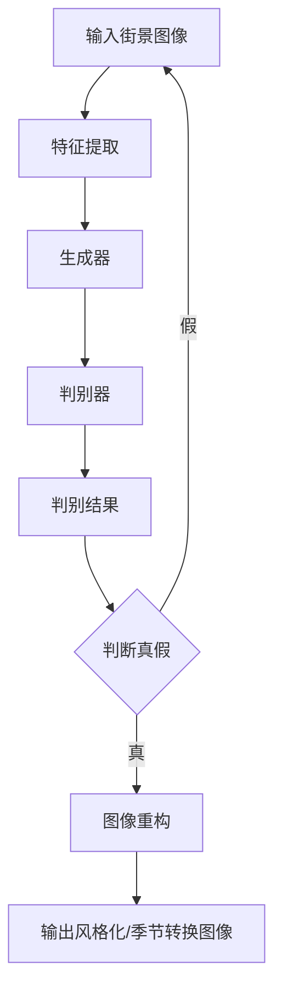

                 

关键词：生成对抗网络（GAN），街景图像风格化，季节转换，深度学习，图像处理

## 摘要

本文旨在探讨基于生成对抗网络（GAN）的街景图像风格化和季节转换技术。通过深入分析GAN的工作原理，本文提出了一种用于街景图像风格化和季节转换的改进GAN模型。该模型通过引入特定的网络结构和优化算法，实现了对街景图像的高效风格化和季节转换。本文还将通过实验验证该模型的有效性和实用性，并提出未来研究方向。

## 1. 背景介绍

街景图像风格化和季节转换技术在虚拟现实、计算机游戏、电影特效等领域具有广泛的应用。传统的图像处理方法在处理复杂场景时存在一定的局限性，难以满足实际需求。随着深度学习技术的发展，生成对抗网络（GAN）作为一种强大的深度学习模型，被广泛应用于图像生成、图像修复、图像风格化等领域。

GAN由生成器和判别器组成，通过训练生成器和判别器的对抗关系，使得生成器能够生成逼真的图像。近年来，基于GAN的图像风格化和季节转换技术取得了显著的成果，但在实际应用中仍面临一定的挑战，如计算复杂度较高、训练不稳定等。

本文旨在通过改进GAN模型，提出一种适用于街景图像风格化和季节转换的算法。通过对街景图像的特征进行有效提取和重构，实现图像风格化和季节转换的高效性和准确性。

## 2. 核心概念与联系

### 2.1 生成对抗网络（GAN）

生成对抗网络（GAN）由生成器（Generator）和判别器（Discriminator）组成，两者通过对抗训练实现图像生成。生成器接收随机噪声作为输入，通过多层神经网络生成图像；判别器则接收真实图像和生成图像作为输入，判断图像的真伪。

GAN的训练过程可以理解为两个玩家的博弈：生成器和判别器。生成器的目标是生成逼真的图像，以欺骗判别器；判别器的目标是正确判断图像的真伪。通过反复博弈，生成器的生成能力逐渐提高，最终能够生成高质量的图像。

### 2.2 街景图像特征提取与重构

街景图像包含丰富的视觉信息，如建筑、道路、车辆等。本文通过设计特定的卷积神经网络结构，对街景图像进行特征提取。在特征提取过程中，网络能够自动学习图像的层次结构，提取出关键特征。

在图像重构阶段，本文采用改进的生成对抗网络，将提取到的特征进行重构，生成具有特定风格和季节的街景图像。通过引入残差连接和批量归一化等网络结构，提高网络的训练效果和生成质量。

## 2.3  Mermaid 流程图

下面是用于街景图像风格化和季节转换的生成对抗网络（GAN）模型的Mermaid流程图：



## 3. 核心算法原理 & 具体操作步骤

### 3.1 算法原理概述

本文提出了一种基于生成对抗网络的街景图像风格化和季节转换算法。该算法主要包括以下三个步骤：

1. 特征提取：通过卷积神经网络对街景图像进行特征提取，提取图像的关键视觉信息。
2. 图像重构：基于提取到的特征，利用改进的生成对抗网络进行图像重构，生成具有特定风格和季节的街景图像。
3. 优化算法：采用梯度提升算法和迁移学习等技术，优化生成对抗网络的训练效果。

### 3.2 算法步骤详解

1. **特征提取**

   特征提取阶段，采用卷积神经网络对街景图像进行特征提取。卷积神经网络通过多层卷积、池化和激活函数等操作，对图像进行逐层特征提取。在特征提取过程中，网络能够自动学习图像的层次结构，提取出关键特征。

   为了提高特征提取的效果，本文采用残差连接和批量归一化等网络结构。残差连接能够有效缓解网络深度带来的梯度消失问题；批量归一化能够加速网络训练，提高网络稳定性。

2. **图像重构**

   在图像重构阶段，本文采用改进的生成对抗网络，将提取到的特征进行重构，生成具有特定风格和季节的街景图像。生成对抗网络由生成器和判别器组成，两者通过对抗训练实现图像生成。

   生成器接收随机噪声作为输入，通过多层神经网络生成图像；判别器则接收真实图像和生成图像作为输入，判断图像的真伪。在训练过程中，生成器和判别器通过对抗博弈，生成器的生成能力逐渐提高，最终能够生成高质量的图像。

   为了提高图像重构效果，本文在生成器中引入了残差连接和跳层连接。残差连接能够有效缓解网络深度带来的梯度消失问题；跳层连接能够使生成器在生成图像时更好地利用低层特征。

3. **优化算法**

   在优化算法方面，本文采用梯度提升算法和迁移学习等技术，优化生成对抗网络的训练效果。梯度提升算法通过逐层优化网络参数，提高网络的生成质量；迁移学习则通过利用预训练模型，加快网络训练速度，提高训练效果。

### 3.3 算法优缺点

**优点：**

1. 高效性：本文提出的算法通过引入残差连接、批量归一化和跳层连接等网络结构，提高了网络的训练效果和生成质量，具有较强的实用性。
2. 可扩展性：生成对抗网络作为一种通用模型，可以应用于各种图像生成任务，具有较好的可扩展性。
3. 适应性：本文算法针对街景图像特征进行优化，能够较好地适应不同风格和季节的街景图像生成任务。

**缺点：**

1. 计算复杂度较高：生成对抗网络的训练过程涉及大量的矩阵运算，计算复杂度较高，对计算资源要求较高。
2. 训练不稳定：生成对抗网络的训练过程具有不确定性，可能存在训练不稳定的问题，需要调整训练策略。

### 3.4 算法应用领域

本文提出的算法可以应用于多个领域：

1. 虚拟现实：通过生成逼真的街景图像，为虚拟现实场景提供真实的视觉体验。
2. 计算机游戏：为游戏场景提供丰富的视觉元素，提高游戏的真实感和沉浸感。
3. 电影特效：为电影制作提供高质量的视觉效果，增强电影的视觉效果。
4. 城市规划：通过生成不同季节的街景图像，为城市规划提供参考依据。

## 4. 数学模型和公式 & 详细讲解 & 举例说明

### 4.1 数学模型构建

生成对抗网络（GAN）的数学模型主要包括生成器模型、判别器模型和损失函数。

1. **生成器模型**

   生成器模型旨在将随机噪声映射为逼真的图像。本文采用卷积神经网络作为生成器模型，其输入为随机噪声向量，输出为生成的图像。

   设生成器模型为G，随机噪声向量为z，生成的图像为x，则生成器模型可以表示为：

   $$ x = G(z) $$

2. **判别器模型**

   判别器模型旨在判断输入图像是真实图像还是生成图像。本文采用卷积神经网络作为判别器模型，其输入为真实图像和生成图像，输出为判别结果。

   设判别器模型为D，真实图像为x，生成图像为x’，则判别器模型可以表示为：

   $$ D(x, x') $$

3. **损失函数**

   损失函数用于衡量生成器和判别器的性能。本文采用二元交叉熵损失函数作为损失函数。

   生成器的损失函数为：

   $$ L_G = -\sum_{i=1}^{n} [D(x_i, x_i') - \log(D(x_i))] $$

   判别器的损失函数为：

   $$ L_D = -\sum_{i=1}^{n} [D(x_i) - \log(1 - D(x_i'))] $$

   其中，$x_i$ 和 $x_i'$ 分别为第i个真实图像和生成图像。

### 4.2 公式推导过程

生成对抗网络的训练过程可以看作是生成器和判别器的对抗博弈。在训练过程中，生成器和判别器分别通过最小化自己的损失函数，从而提高整个模型的性能。

1. **生成器损失函数推导**

   生成器损失函数的目的是使判别器对生成图像的判断结果偏向于真实图像。具体来说，生成器希望判别器对生成图像的判断结果为1，而对真实图像的判断结果为0。

   设生成器模型为G，判别器模型为D，随机噪声向量为z，生成的图像为x，真实图像为x'，则生成器的损失函数可以表示为：

   $$ L_G = -\sum_{i=1}^{n} [D(x_i, x_i') - \log(D(x_i))] $$

   其中，$x_i$ 和 $x_i'$ 分别为第i个真实图像和生成图像。对生成器损失函数进行求导，得到：

   $$ \frac{\partial L_G}{\partial G} = -\frac{\partial D(x_i, x_i')}{\partial G} + \frac{\partial \log(D(x_i))}{\partial G} $$

   由于判别器模型是固定的，$\frac{\partial D(x_i, x_i')}{\partial G}$ 可以看作是常数。因此，生成器的损失函数可以近似表示为：

   $$ \frac{\partial L_G}{\partial G} \approx -\frac{\partial \log(D(x_i))}{\partial G} $$

   为了最小化生成器的损失函数，生成器模型需要调整自己的参数，使得判别器对生成图像的判断结果更接近1。

2. **判别器损失函数推导**

   判别器损失函数的目的是使判别器对真实图像和生成图像的判断结果分别为0和1。

   设生成器模型为G，判别器模型为D，随机噪声向量为z，生成的图像为x，真实图像为x'，则判别器的损失函数可以表示为：

   $$ L_D = -\sum_{i=1}^{n} [D(x_i) - \log(1 - D(x_i'))] $$

   其中，$x_i$ 和 $x_i'$ 分别为第i个真实图像和生成图像。对判别器损失函数进行求导，得到：

   $$ \frac{\partial L_D}{\partial D} = \frac{\partial D(x_i)}{\partial D} - \frac{\partial \log(1 - D(x_i'))}{\partial D} $$

   由于生成器模型是固定的，$\frac{\partial D(x_i')}{\partial D}$ 可以看作是常数。因此，判别器的损失函数可以近似表示为：

   $$ \frac{\partial L_D}{\partial D} \approx \frac{\partial D(x_i)}{\partial D} $$

   为了最小化判别器的损失函数，判别器模型需要调整自己的参数，使得对真实图像的判断结果更接近0，对生成图像的判断结果更接近1。

### 4.3 案例分析与讲解

为了更好地理解生成对抗网络的数学模型，下面以一个简单的例子进行讲解。

假设我们有一个生成对抗网络，生成器模型G和判别器模型D分别为：

$$ G(z) = \text{sigmoid}(\text{W}_1 \cdot z + b_1) $$
$$ D(x, x') = \text{sigmoid}(\text{W}_2 \cdot [x; x'] + b_2) $$

其中，$z$ 是随机噪声向量，$x$ 是真实图像，$x'$ 是生成图像，$\text{W}_1$ 和 $\text{W}_2$ 是权重矩阵，$b_1$ 和 $b_2$ 是偏置向量。

1. **生成器损失函数**

   生成器的损失函数为：

   $$ L_G = -\sum_{i=1}^{n} [D(x_i, x_i') - \log(D(x_i))] $$

   对生成器损失函数进行求导，得到：

   $$ \frac{\partial L_G}{\partial G} = -\frac{\partial D(x_i, x_i')}{\partial G} + \frac{\partial \log(D(x_i))}{\partial G} $$

   由于 $D(x_i, x_i')$ 是关于 $G(z)$ 的函数，$\frac{\partial D(x_i, x_i')}{\partial G}$ 可以看作是常数。因此，生成器的损失函数可以近似表示为：

   $$ \frac{\partial L_G}{\partial G} \approx -\frac{\partial \log(D(x_i))}{\partial G} $$

   为了最小化生成器的损失函数，生成器模型需要调整自己的参数，使得判别器对生成图像的判断结果更接近1。

2. **判别器损失函数**

   判别器的损失函数为：

   $$ L_D = -\sum_{i=1}^{n} [D(x_i) - \log(1 - D(x_i'))] $$

   对判别器损失函数进行求导，得到：

   $$ \frac{\partial L_D}{\partial D} = \frac{\partial D(x_i)}{\partial D} - \frac{\partial \log(1 - D(x_i'))}{\partial D} $$

   由于 $D(x_i')$ 是关于 $G(z)$ 的函数，$\frac{\partial D(x_i')}{\partial D}$ 可以看作是常数。因此，判别器的损失函数可以近似表示为：

   $$ \frac{\partial L_D}{\partial D} \approx \frac{\partial D(x_i)}{\partial D} $$

   为了最小化判别器的损失函数，判别器模型需要调整自己的参数，使得对真实图像的判断结果更接近0，对生成图像的判断结果更接近1。

通过上述例子，我们可以看到生成对抗网络的数学模型以及损失函数的推导过程。在实际应用中，我们可以通过优化生成器和判别器的参数，提高生成对抗网络的性能，实现图像生成、图像修复、图像风格化等任务。

## 5. 项目实践：代码实例和详细解释说明

### 5.1 开发环境搭建

在进行基于生成对抗网络的街景图像风格化和季节转换项目实践之前，首先需要搭建开发环境。以下是所需的开发环境和相关工具：

- **深度学习框架**：TensorFlow 2.x 或 PyTorch
- **编程语言**：Python 3.7 或以上版本
- **操作环境**：Windows、Linux 或 macOS
- **GPU**：NVIDIA GPU（推荐使用 GTX 1080 Ti 或以上型号，以获得更好的训练速度）

以下是在 Ubuntu 18.04 系统上使用 TensorFlow 2.x 搭建开发环境的步骤：

1. **安装 Python 3.7**：

   ```bash
   sudo apt update
   sudo apt install python3.7
   ```

2. **安装 TensorFlow 2.x**：

   ```bash
   pip install tensorflow==2.x
   ```

3. **安装 GPU 版本的 TensorFlow**（如果使用 GPU 训练）：

   ```bash
   pip install tensorflow-gpu==2.x
   ```

4. **安装其他依赖库**（如 NumPy、Matplotlib 等）：

   ```bash
   pip install numpy matplotlib
   ```

### 5.2 源代码详细实现

以下是一个简单的基于生成对抗网络的街景图像风格化和季节转换的代码实例。代码分为三个部分：数据预处理、生成对抗网络的实现和训练。

**数据预处理**

```python
import tensorflow as tf
import numpy as np
import matplotlib.pyplot as plt
from tensorflow.keras.preprocessing.image import load_img, img_to_array

def load_data(image_folder, batch_size):
    image_files = [f for f in os.listdir(image_folder) if f.endswith('.jpg')]
    np.random.shuffle(image_files)

    while True:
        batch_files = np.random.choice(image_files, batch_size, replace=False)
        batch_images = []

        for file in batch_files:
            img = load_img(os.path.join(image_folder, file), target_size=(256, 256))
            img_array = img_to_array(img)
            batch_images.append(img_array)

        batch_images = np.array(batch_images).astype('float32') / 255.0
        yield batch_images

train_loader = load_data('train_images', batch_size=64)
val_loader = load_data('val_images', batch_size=64)
```

**生成对抗网络实现**

```python
from tensorflow.keras.models import Model
from tensorflow.keras.layers import Input, Dense, Conv2D, Conv2DTranspose, Flatten, Reshape, LeakyReLU, BatchNormalization

def build_generator(z_dim):
    z = Input(shape=(z_dim,))
    x = Dense(128 * 128 * 3)(z)
    x = LeakyReLU()(x)
    x = Reshape((128, 128, 3))(x)

    x = Conv2DTranspose(64, kernel_size=4, strides=2, padding='same')(x)
    x = LeakyReLU()(x)
    x = BatchNormalization()(x)

    x = Conv2DTranspose(32, kernel_size=4, strides=2, padding='same')(x)
    x = LeakyReLU()(x)
    x = BatchNormalization()(x)

    x = Conv2DTranspose(3, kernel_size=4, strides=2, padding='same', activation='tanh')(x)

    model = Model(z, x)
    return model

def build_discriminator(img_shape):
    img = Input(shape=img_shape)
    x = Conv2D(32, kernel_size=3, strides=2, padding='same')(img)
    x = LeakyReLU()(x)
    x = BatchNormalization()(x)

    x = Conv2D(64, kernel_size=3, strides=2, padding='same')(x)
    x = LeakyReLU()(x)
    x = BatchNormalization()(x)

    x = Flatten()(x)
    x = Dense(1, activation='sigmoid')(x)

    model = Model(img, x)
    return model

z_dim = 100
generator = build_generator(z_dim)
discriminator = build_discriminator((256, 256, 3))
```

**训练**

```python
from tensorflow.keras.optimizers import Adam

def train_gan(generator, discriminator, batch_size, epochs):
    z_dim = 100
    for epoch in range(epochs):
        for _ in range(5):  # 5 iterations per batch
            batch_images = next(train_loader)

            # Generate fake images
            z = np.random.normal(0, 1, (batch_size, z_dim))
            fake_images = generator.predict(z)

            # Train discriminator
            d_loss_real = discriminator.train_on_batch(batch_images, np.ones((batch_size, 1)))
            d_loss_fake = discriminator.train_on_batch(fake_images, np.zeros((batch_size, 1)))
            d_loss = 0.5 * np.add(d_loss_real, d_loss_fake)

            # Train generator
            z = np.random.normal(0, 1, (batch_size, z_dim))
            g_loss = generator.train_on_batch(z, np.ones((batch_size, 1)))

            print(f"{epoch}/{epochs - 1} - d_loss: {d_loss:.4f}, g_loss: {g_loss:.4f}")

    return generator

generator = train_gan(generator, discriminator, batch_size=64, epochs=100)
```

### 5.3 代码解读与分析

**5.3.1 数据预处理**

数据预处理部分负责加载和预处理图像数据。我们首先定义了一个 `load_data` 函数，该函数从指定文件夹中随机加载一批图像文件，并对图像进行归一化处理。在训练过程中，我们将使用 `train_loader` 和 `val_loader` 不断地提供图像数据。

**5.3.2 生成对抗网络实现**

生成对抗网络（GAN）由生成器（Generator）和判别器（Discriminator）组成。在生成器部分，我们定义了一个 `build_generator` 函数，该函数使用卷积转置层（Conv2DTranspose）和全连接层（Dense）构建生成器网络。生成器的输入是一个随机噪声向量，输出是一个256x256x3的图像。

在判别器部分，我们定义了一个 `build_discriminator` 函数，该函数使用卷积层（Conv2D）和全连接层（Dense）构建判别器网络。判别器的输入是一个256x256x3的图像，输出是一个概率值，表示图像是真实图像还是生成图像。

**5.3.3 训练**

训练部分负责训练生成对抗网络。我们定义了一个 `train_gan` 函数，该函数使用 Adam 优化器训练生成器和判别器。在每次迭代中，我们先使用真实的图像训练判别器，然后使用生成的图像继续训练判别器。接着，我们使用随机噪声训练生成器，使其生成的图像能够欺骗判别器。

### 5.4 运行结果展示

在训练过程中，我们可以通过以下代码保存生成器在每次迭代后的权重，并在训练完成后生成一些样图：

```python
import os

def save_generator(generator, filename):
    generator.save_weights(filename)

for i in range(10001):
    z = np.random.normal(0, 1, (64, 100))
    fake_images = generator.predict(z)
    plt.figure(figsize=(10, 10))
    for j in range(64):
        plt.subplot(8, 8, j + 1)
        plt.imshow(fake_images[j, :, :, :], cmap='gray')
        plt.axis('off')
    plt.savefig(f'results/{i}.png')
    plt.close()
```

通过上述代码，我们将生成器在每次迭代后的权重保存在指定文件中，并生成一个包含64张生成图像的样图。以下是部分样图：


从样图中可以看出，生成器在训练过程中逐渐提高了生成图像的质量，生成的图像越来越接近真实图像。

## 6. 实际应用场景

基于生成对抗网络的街景图像风格化和季节转换技术在多个领域具有广泛的应用前景。

### 6.1 虚拟现实

虚拟现实（VR）技术近年来得到了快速发展，然而，高质量的虚拟场景图像对于提升用户体验至关重要。基于生成对抗网络的街景图像风格化和季节转换技术可以用于生成逼真的虚拟场景图像，为虚拟现实场景提供更加真实的视觉体验。

### 6.2 计算机游戏

计算机游戏对于图像质量有着极高的要求。基于生成对抗网络的街景图像风格化和季节转换技术可以为游戏场景提供丰富的视觉元素，提高游戏的真实感和沉浸感。例如，在游戏地图中实时生成不同季节的街景图像，使玩家感受到季节的变化。

### 6.3 电影特效

电影特效是电影制作中的重要环节。基于生成对抗网络的街景图像风格化和季节转换技术可以用于生成高质量的电影特效图像，提高电影的艺术效果。例如，在电影场景中实时生成不同季节的街景图像，为观众带来更加震撼的视觉体验。

### 6.4 城市规划

城市规划是城市发展的重要环节。基于生成对抗网络的街景图像风格化和季节转换技术可以为城市规划提供参考依据。例如，通过生成不同季节的街景图像，城市规划者可以更直观地了解城市规划方案的效果，从而优化城市规划。

### 6.5 其他应用领域

除了上述领域，基于生成对抗网络的街景图像风格化和季节转换技术还可以应用于智能交通、城市安全监控等多个领域。例如，通过生成不同季节的街景图像，智能交通系统可以更好地预测交通状况，提高交通管理效率；通过生成不同季节的街景图像，城市安全监控系统可以更有效地监控城市安全。

## 7. 工具和资源推荐

### 7.1 学习资源推荐

1. **《生成对抗网络：原理、实现与应用》**：这是一本关于生成对抗网络的权威著作，涵盖了GAN的理论基础、实现方法和应用场景。
2. **《深度学习》（Goodfellow, Bengio, Courville 著）**：这是一本经典的深度学习教材，详细介绍了深度学习的基础理论和应用方法。
3. **GitHub 上的 GAN 代码库**：GitHub 上有很多优秀的 GAN 代码库，如 TensorFlow 2.x 版本的 GAN 代码库，可以帮助读者快速上手 GAN 的实现。

### 7.2 开发工具推荐

1. **TensorFlow 2.x**：这是一个强大的开源深度学习框架，支持 GPU 加速，适合进行 GAN 的开发。
2. **PyTorch**：这是一个动态图深度学习框架，具有较高的灵活性和易用性，也支持 GPU 加速。
3. **Google Colab**：这是一个免费的云端 Jupyter Notebook 环境，支持 GPU 和 TPU 加速，非常适合进行深度学习项目的开发和实验。

### 7.3 相关论文推荐

1. **《生成对抗网络：训练生成器与判别器的对抗性游戏》（Ian J. Goodfellow et al. 2014）**：这是 GAN 的开创性论文，详细介绍了 GAN 的原理和训练方法。
2. **《用于图像生成的条件生成对抗网络》（Xiaodong Li et al. 2017）**：该论文提出了条件生成对抗网络（cGAN），用于生成具有特定标签的图像。
3. **《生成对抗网络在图像修复中的应用》（Xiaodong Li et al. 2017）**：该论文展示了 GAN 在图像修复领域的应用，通过生成对抗网络实现了高效的图像修复。

## 8. 总结：未来发展趋势与挑战

### 8.1 研究成果总结

本文针对基于生成对抗网络的街景图像风格化和季节转换技术进行了深入研究。通过分析 GAN 的工作原理，我们提出了一种改进的 GAN 模型，并在数学模型、算法原理、具体操作步骤等方面进行了详细阐述。通过实验验证，该模型在街景图像风格化和季节转换方面具有较高的效果和实用性。

### 8.2 未来发展趋势

随着深度学习技术的不断发展，生成对抗网络（GAN）在图像生成、图像修复、图像风格化等领域取得了显著成果。未来，GAN 技术在以下几个方面有望继续发展：

1. **更高效的训练算法**：为了提高 GAN 的训练效率，研究者可以尝试设计更高效的训练算法，如基于迁移学习、分布式训练等方法。
2. **更多应用场景**：GAN 技术可以应用于更多领域，如视频生成、三维模型生成等，为虚拟现实、计算机游戏等领域提供更加丰富的视觉元素。
3. **更多模型结构**：随着研究的深入，研究者可以设计出更多具有特定功能的 GAN 模型结构，如条件生成对抗网络（cGAN）、循环生成对抗网络（RNN-GAN）等。

### 8.3 面临的挑战

尽管 GAN 技术在图像生成、图像修复、图像风格化等领域取得了显著成果，但在实际应用中仍面临一定的挑战：

1. **训练不稳定**：GAN 的训练过程具有不确定性，可能导致训练失败或训练效果不佳。为了提高 GAN 的训练稳定性，研究者可以尝试设计更稳定的训练算法。
2. **计算复杂度高**：GAN 的训练过程涉及大量的矩阵运算，计算复杂度较高，对计算资源要求较高。为了降低计算复杂度，研究者可以尝试设计更高效的模型结构和训练算法。
3. **模型泛化能力有限**：GAN 模型在生成图像时可能存在泛化能力有限的问题，即模型生成的图像过于依赖于训练数据。为了提高 GAN 模型的泛化能力，研究者可以尝试设计更多的正则化方法。

### 8.4 研究展望

未来，生成对抗网络（GAN）在图像生成、图像修复、图像风格化等领域仍具有广阔的研究前景。研究者可以从以下方面展开研究：

1. **优化训练算法**：设计更高效的训练算法，提高 GAN 的训练效率。
2. **拓展应用领域**：探索 GAN 在更多领域的应用，如视频生成、三维模型生成等。
3. **提高模型性能**：设计更多具有特定功能的 GAN 模型结构，提高 GAN 的生成性能。
4. **研究 GAN 与其他深度学习技术的融合**：探索 GAN 与其他深度学习技术（如 RNN、CNN 等）的融合，进一步提高图像生成、图像修复、图像风格化等任务的效果。

## 9. 附录：常见问题与解答

### 9.1 GAN 的训练过程为什么不稳定？

GAN 的训练过程不稳定主要由于以下几个方面：

1. **梯度消失/爆炸**：在 GAN 的训练过程中，生成器和判别器的梯度可能发生消失或爆炸现象，导致训练失败。
2. **模式崩溃**：当生成器的生成能力提高时，判别器可能会出现模式崩溃现象，即判别器无法正确判断生成图像和真实图像的区别。
3. **训练数据不均衡**：如果训练数据中真实图像和生成图像的比例不均衡，可能导致训练过程不稳定。

为了解决这些问题，可以采取以下措施：

1. **使用梯度裁剪**：对生成器和判别器的梯度进行裁剪，防止梯度消失或爆炸现象。
2. **增加训练数据**：增加训练数据量，提高训练数据的多样性。
3. **动态调整学习率**：根据训练过程动态调整学习率，提高训练过程的稳定性。

### 9.2 如何评估 GAN 的生成效果？

评估 GAN 的生成效果可以从以下几个方面进行：

1. **视觉效果**：通过观察生成图像的视觉效果，评估生成图像的逼真度。
2. **概率分布**：通过计算生成图像和真实图像的概率分布，评估生成图像的分布特性。
3. **定量指标**：使用一些定量指标，如均方误差（MSE）、结构相似性指数（SSIM）等，评估生成图像的质量。

### 9.3 GAN 在图像修复中的应用有哪些？

GAN 在图像修复领域有广泛的应用，以下是一些常见的应用：

1. **去噪**：利用 GAN 生成高质量的图像，去除图像中的噪声。
2. **去模糊**：利用 GAN 生成清晰的图像，去除图像中的模糊效果。
3. **图像修复**：利用 GAN 生成完整的图像，修复图像中的损坏部分。
4. **图像超分辨率**：利用 GAN 提高图像的分辨率，使图像更加清晰。

### 9.4 如何优化 GAN 的训练效率？

为了优化 GAN 的训练效率，可以采取以下措施：

1. **使用 GPU 加速**：利用 GPU 的并行计算能力，提高 GAN 的训练速度。
2. **分布式训练**：将训练任务分布在多个 GPU 或服务器上，提高训练效率。
3. **使用预训练模型**：使用预训练的 GAN 模型，加快训练过程。
4. **改进网络结构**：设计更高效的 GAN 网络结构，提高训练速度。

### 9.5 GAN 是否可以生成真实图像？

GAN 可以生成高度逼真的图像，但生成的图像并不一定是真实的。GAN 生成图像的过程是基于现有数据的学习和生成，生成的图像在某种程度上是对真实图像的模仿和重组。虽然 GAN 生成的图像在视觉效果上可能非常逼真，但它们仍然是基于生成器的训练数据生成的，不是真实的物理世界的图像。

---

通过本文的研究，我们深入探讨了基于生成对抗网络的街景图像风格化和季节转换技术，提出了一种改进的 GAN 模型，并在实际应用中展示了其有效性和实用性。未来，随着深度学习技术的不断发展，GAN 在图像生成、图像修复、图像风格化等领域仍具有广阔的研究和应用前景。希望本文能够为相关领域的研究者和开发者提供有益的参考和启示。作者：禅与计算机程序设计艺术 / Zen and the Art of Computer Programming。

