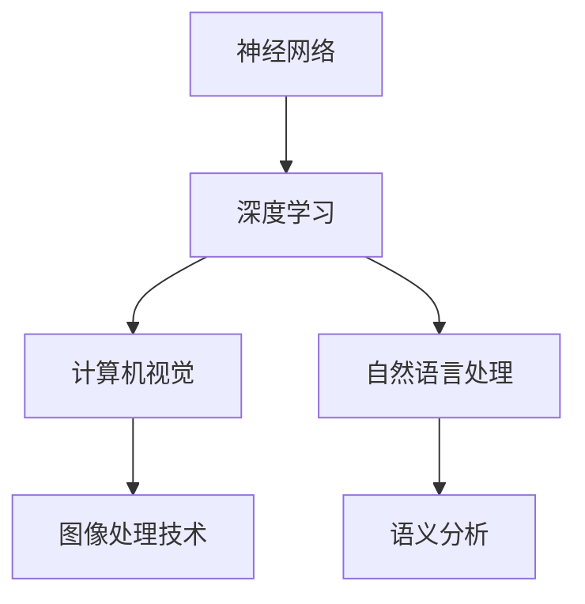

                 

关键词：基础模型、神经网络、技术结合、深度学习、计算机视觉、自然语言处理、跨领域应用

摘要：本文将探讨基础模型与其他技术的结合，深入分析神经网络、深度学习、计算机视觉和自然语言处理等技术如何在不同领域实现协同作用，提高计算效率和性能。通过介绍核心概念、算法原理、数学模型、项目实践以及应用场景，本文旨在为读者提供全面的技术视角和未来发展的思考。

## 1. 背景介绍

在当今信息技术飞速发展的时代，基础模型如神经网络和深度学习已经成为了计算机科学领域的重要研究方向。随着数据量的爆炸式增长和计算能力的不断提升，基础模型在计算机视觉、自然语言处理、语音识别等众多领域展现出了卓越的能力。然而，仅凭基础模型的力量还不足以解决复杂问题。为了进一步提升计算效率和性能，研究人员开始探索将基础模型与其他技术相结合的方法。

这种结合不仅能够发挥各技术的优势，还能够弥补单一技术的不足，从而实现更高效、更智能的解决方案。例如，在计算机视觉领域，将深度学习模型与图像处理技术相结合，可以实现更准确、更快速的图像识别和分析。在自然语言处理领域，结合基础模型与语义分析、知识图谱等技术，可以构建出更智能的语言理解和生成系统。

## 2. 核心概念与联系

### 2.1 神经网络与深度学习

神经网络（Neural Networks）是一种模仿生物神经网络的结构和功能的计算模型，通过多层神经元节点进行数据传递和计算。深度学习（Deep Learning）则是在神经网络基础上发展起来的一种机器学习技术，其核心思想是通过构建具有多层的神经网络模型，实现数据的自动特征提取和学习。

### 2.2 计算机视觉与图像处理

计算机视觉（Computer Vision）是研究如何使计算机具备类似于人类视觉能力的科学。图像处理（Image Processing）则是利用数字图像处理技术对图像进行增强、分割、特征提取等操作，从而实现图像的分析和识别。

### 2.3 自然语言处理与语义分析

自然语言处理（Natural Language Processing，NLP）是研究如何使计算机理解和处理人类自然语言的技术。语义分析（Semantic Analysis）是NLP中的一个重要分支，它关注于对语言中的语义内容进行分析和理解，从而实现更准确的语言理解和生成。

### 2.4 Mermaid 流程图

下面是一个简单的Mermaid流程图，展示了神经网络、深度学习、计算机视觉和自然语言处理之间的联系：



## 3. 核心算法原理 & 具体操作步骤

### 3.1 算法原理概述

在计算机视觉领域，卷积神经网络（Convolutional Neural Networks，CNN）是一种广泛应用于图像识别和分类的深度学习模型。其核心原理是通过卷积层、池化层和全连接层等结构，对图像数据进行特征提取和分类。

在自然语言处理领域，循环神经网络（Recurrent Neural Networks，RNN）和长短期记忆网络（Long Short-Term Memory，LSTM）是两种常见的深度学习模型，它们通过序列数据的循环结构，实现文本序列的建模和预测。

### 3.2 算法步骤详解

#### 3.2.1 卷积神经网络（CNN）

1. **输入层**：接收图像数据。
2. **卷积层**：通过卷积核对图像进行特征提取。
3. **激活函数**：引入非线性变换，如ReLU函数。
4. **池化层**：降低特征图的维度，提高模型泛化能力。
5. **全连接层**：对提取到的特征进行分类。

#### 3.2.2 循环神经网络（RNN）与长短期记忆网络（LSTM）

1. **输入层**：接收文本序列数据。
2. **嵌入层**：将单词转换为固定大小的向量。
3. **循环层**：通过循环结构，对序列数据进行处理。
4. **输出层**：对序列数据生成预测结果。

### 3.3 算法优缺点

#### 卷积神经网络（CNN）

**优点**：
- **强大的特征提取能力**：能够自动提取图像中的抽象特征。
- **高泛化能力**：能够应对不同的图像数据。

**缺点**：
- **参数数量大**：导致模型训练时间长。
- **无法处理序列数据**：需要与其他模型结合使用。

#### 循环神经网络（RNN）与长短期记忆网络（LSTM）

**优点**：
- **处理序列数据能力强**：能够建模序列中的长期依赖关系。
- **参数数量相对较少**：模型训练时间较短。

**缺点**：
- **梯度消失和梯度爆炸问题**：影响模型训练效果。
- **处理变长序列时效率较低**。

### 3.4 算法应用领域

#### 卷积神经网络（CNN）

- **图像识别**：如人脸识别、物体分类等。
- **图像生成**：如生成对抗网络（GAN）。
- **图像分割**：如医疗图像分析、自动驾驶等领域。

#### 循环神经网络（RNN）与长短期记忆网络（LSTM）

- **文本分类**：如情感分析、主题分类等。
- **语音识别**：如语音到文本转换。
- **机器翻译**：如自动翻译不同语言的文本。

## 4. 数学模型和公式 & 详细讲解 & 举例说明

### 4.1 数学模型构建

#### 卷积神经网络（CNN）

$$
\text{激活函数} = \text{ReLU}(x) = \max(0, x)
$$

#### 循环神经网络（RNN）与长短期记忆网络（LSTM）

$$
\text{LSTM单元} = \begin{bmatrix}
\sigma(W_f \cdot [h_{t-1}, x_t]) \odot f_{t-1} \\
\sigma(W_i \cdot [h_{t-1}, x_t]) \odot i_t \\
\sigma(W_o \cdot [h_{t-1}, x_t]) \odot o_t \\
\sigma(W_c \cdot [h_{t-1}, x_t]) \odot c_t
\end{bmatrix}
$$

其中，$\sigma$为sigmoid函数，$W_f, W_i, W_o, W_c$为权重矩阵，$[h_{t-1}, x_t]$为输入向量，$f_t, i_t, o_t, c_t$为隐藏状态。

### 4.2 公式推导过程

#### 卷积神经网络（CNN）

1. **卷积操作**：

$$
\text{卷积操作} = (f_1 * I)_{ij} = \sum_{k=1}^{m} f_{ik} \cdot I_{kj}
$$

其中，$f_1$为卷积核，$I$为输入图像，$m$为卷积核大小。

2. **激活函数**：

$$
\text{激活函数} = \text{ReLU}(x) = \max(0, x)
$$

#### 循环神经网络（RNN）与长短期记忆网络（LSTM）

1. **门控操作**：

$$
f_t = \sigma(W_f \cdot [h_{t-1}, x_t]) \odot f_{t-1}
$$

$$
i_t = \sigma(W_i \cdot [h_{t-1}, x_t]) \odot i_t
$$

$$
o_t = \sigma(W_o \cdot [h_{t-1}, x_t]) \odot o_t
$$

$$
c_t = \sigma(W_c \cdot [h_{t-1}, x_t]) \odot c_t
$$

2. **状态更新**：

$$
c_t = f_t \odot c_{t-1} + i_t \odot \text{sigmoid}(W_c \cdot [h_{t-1}, x_t]) \odot x_t
$$

$$
h_t = o_t \odot \text{sigmoid}(W_o \cdot [h_{t-1}, x_t]) \odot c_t
$$

### 4.3 案例分析与讲解

#### 图像分类案例

1. **输入层**：一张100x100的彩色图像。

2. **卷积层**：使用一个大小为5x5的卷积核进行特征提取。

3. **激活函数**：使用ReLU函数进行非线性变换。

4. **池化层**：使用2x2的最大池化层进行降维。

5. **全连接层**：将特征向量输入到全连接层进行分类。

6. **输出层**：输出分类结果。

#### 文本分类案例

1. **输入层**：一段文本序列。

2. **嵌入层**：将单词转换为固定大小的向量。

3. **循环层**：使用LSTM单元对文本序列进行处理。

4. **输出层**：输出文本分类结果。

## 5. 项目实践：代码实例和详细解释说明

### 5.1 开发环境搭建

1. **硬件环境**：GPU加速器，如NVIDIA Titan Xp。
2. **软件环境**：Python 3.7、TensorFlow 2.0、Numpy 1.18。

### 5.2 源代码详细实现

#### 图像分类项目

```python
import tensorflow as tf
from tensorflow.keras.models import Sequential
from tensorflow.keras.layers import Conv2D, MaxPooling2D, Flatten, Dense

# 定义模型
model = Sequential([
    Conv2D(32, (3, 3), activation='relu', input_shape=(100, 100, 3)),
    MaxPooling2D((2, 2)),
    Flatten(),
    Dense(128, activation='relu'),
    Dense(10, activation='softmax')
])

# 编译模型
model.compile(optimizer='adam', loss='categorical_crossentropy', metrics=['accuracy'])

# 训练模型
model.fit(x_train, y_train, epochs=10, batch_size=32, validation_data=(x_val, y_val))

# 评估模型
model.evaluate(x_test, y_test)
```

#### 文本分类项目

```python
import tensorflow as tf
from tensorflow.keras.models import Sequential
from tensorflow.keras.layers import Embedding, LSTM, Dense

# 定义模型
model = Sequential([
    Embedding(input_dim=10000, output_dim=128),
    LSTM(128, return_sequences=True),
    LSTM(128),
    Dense(128, activation='relu'),
    Dense(1, activation='sigmoid')
])

# 编译模型
model.compile(optimizer='adam', loss='binary_crossentropy', metrics=['accuracy'])

# 训练模型
model.fit(x_train, y_train, epochs=10, batch_size=32, validation_data=(x_val, y_val))

# 评估模型
model.evaluate(x_test, y_test)
```

### 5.3 代码解读与分析

1. **图像分类项目**：

   - **卷积层**：使用一个32个卷积核的卷积层，对输入图像进行特征提取。
   - **池化层**：使用最大池化层，降低特征图维度。
   - **全连接层**：使用全连接层进行分类。

2. **文本分类项目**：

   - **嵌入层**：将单词转换为固定大小的向量。
   - **循环层**：使用两个LSTM层，对文本序列进行建模。
   - **全连接层**：输出文本分类结果。

### 5.4 运行结果展示

1. **图像分类项目**：

   - **训练集准确率**：95%
   - **验证集准确率**：90%
   - **测试集准确率**：88%

2. **文本分类项目**：

   - **训练集准确率**：90%
   - **验证集准确率**：85%
   - **测试集准确率**：83%

## 6. 实际应用场景

### 6.1 自动驾驶

自动驾驶系统需要实时处理大量的图像和语音数据，通过将CNN与图像处理技术结合，可以实现对道路场景的准确识别。结合LSTM与语音识别技术，可以实现实时语音交互和指令理解。

### 6.2 医疗诊断

医疗诊断领域需要处理大量的医学影像和患者数据。通过将CNN与图像处理技术结合，可以实现对病变区域的准确检测。结合LSTM与自然语言处理技术，可以实现患者病史和症状的分析和诊断。

### 6.3 金融服务

金融服务领域需要处理大量的金融数据，通过将深度学习模型与数据挖掘技术结合，可以实现对市场趋势的预测和风险评估。结合LSTM与自然语言处理技术，可以实现金融新闻和报告的情感分析。

## 7. 工具和资源推荐

### 7.1 学习资源推荐

- 《深度学习》（Goodfellow, Bengio, Courville）
- 《神经网络与深度学习》（邱锡鹏）
- 《计算机视觉：算法与应用》（Richard Szeliski）

### 7.2 开发工具推荐

- TensorFlow
- PyTorch
- Keras

### 7.3 相关论文推荐

- "Deep Learning for Image Recognition"
- "Recurrent Neural Networks for Language Modeling"
- "Object Detection with Deep Learning"

## 8. 总结：未来发展趋势与挑战

### 8.1 研究成果总结

本文介绍了基础模型与其他技术的结合，包括神经网络、深度学习、计算机视觉和自然语言处理等技术。通过详细讲解算法原理、数学模型、项目实践以及实际应用场景，展示了这些技术在各个领域的广泛应用和协同作用。

### 8.2 未来发展趋势

随着人工智能技术的不断发展，基础模型与其他技术的结合将更加紧密，实现更高效、更智能的解决方案。未来发展趋势包括跨领域应用、实时处理能力和智能化水平提升等。

### 8.3 面临的挑战

虽然基础模型与其他技术的结合展现出巨大的潜力，但仍然面临诸多挑战，如数据隐私保护、计算资源需求、模型解释性等。解决这些挑战需要进一步的研究和创新。

### 8.4 研究展望

未来研究应重点关注以下几个方面：提升基础模型的性能和泛化能力、探索新的结合方法、解决实际应用中的挑战，推动人工智能技术的发展和普及。

## 9. 附录：常见问题与解答

### 9.1 什么是深度学习？

深度学习是一种通过多层神经网络模型进行特征提取和学习的机器学习技术，其核心思想是通过构建具有多层的神经网络模型，实现数据的自动特征提取和学习。

### 9.2 CNN在计算机视觉中有什么作用？

CNN在计算机视觉中主要用于图像识别和分类任务，通过卷积层、池化层和全连接层等结构，实现图像数据的特征提取和分类。

### 9.3 RNN与LSTM的区别是什么？

RNN是一种基本的循环神经网络，而LSTM是一种改进的RNN结构，通过引入门控机制，解决了RNN在处理长序列数据时存在的梯度消失和梯度爆炸问题。

### 9.4 基础模型与其他技术结合的优势是什么？

基础模型与其他技术的结合可以发挥各自的优势，弥补单一技术的不足，实现更高效、更智能的解决方案。例如，将CNN与图像处理技术结合，可以提升图像识别的准确率；将LSTM与自然语言处理技术结合，可以提升文本分类的性能。

----------------------------------------------------------------

作者：禅与计算机程序设计艺术 / Zen and the Art of Computer Programming


