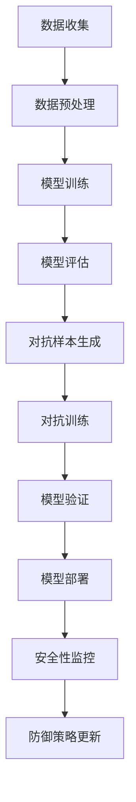

                 

 关键词：（基础模型、人工智能安全、安全性分析、防御策略、安全模型、攻防实战）

> 摘要：随着人工智能技术的迅猛发展，基础模型在各个领域得到了广泛应用。然而，基础模型的安全问题也日益凸显。本文将深入探讨基础模型的人工智能安全，分析其潜在的安全威胁，并提出一系列防御策略，为人工智能安全领域的研究与应用提供参考。

## 1. 背景介绍

近年来，人工智能（AI）技术在语音识别、图像处理、自然语言处理等领域取得了显著进展。这些成果背后离不开基础模型的支撑。基础模型是指经过大规模数据训练的通用模型，如深度神经网络、生成对抗网络等，它们在各种任务中表现出色。然而，随着基础模型的应用范围扩大，其安全性问题也逐渐暴露出来。

### 1.1 基础模型的挑战

首先，基础模型在训练过程中需要处理大量数据，这些数据可能包含敏感信息。如果基础模型被攻击者利用，可能会导致隐私泄露、知识产权被盗用等问题。其次，基础模型在训练过程中容易出现过拟合现象，使其在特定领域内表现出色，但在其他领域则可能表现不佳。这种过拟合现象可能会导致模型在面临新型攻击时显得脆弱。

### 1.2 安全问题的来源

人工智能安全问题的来源主要包括以下几个方面：

- **数据安全**：基础模型在训练过程中需要使用大量数据，这些数据可能涉及个人隐私、商业机密等敏感信息。如果数据安全得不到保障，攻击者可能利用这些数据进行恶意攻击。

- **模型安全性**：基础模型在训练过程中可能会引入一些安全隐患，如对抗样本攻击、模型篡改等。这些攻击可能会导致模型失去鲁棒性，从而影响其性能和安全性。

- **软件供应链**：人工智能系统的实现依赖于各种软件工具和库，这些工具和库可能存在安全漏洞。如果攻击者利用这些漏洞，可能会对人工智能系统造成严重破坏。

## 2. 核心概念与联系

为了深入探讨基础模型的人工智能安全，我们需要理解以下几个核心概念：

### 2.1 对抗样本攻击（Adversarial Attack）

对抗样本攻击是一种针对人工智能模型的恶意攻击。攻击者通过在正常样本上添加微小的扰动，使得模型对样本的预测结果发生错误。这种攻击具有隐蔽性，难以检测，因此对基础模型的安全性构成了严重威胁。

### 2.2 模型篡改（Model Tampering）

模型篡改是指攻击者通过篡改模型参数，使得模型在特定任务上表现不佳。这种攻击可能会破坏模型的鲁棒性，使其在面临新型攻击时显得脆弱。

### 2.3 安全模型（Secure Model）

安全模型是指具备一定安全性的模型。安全模型通过一系列防御策略，可以抵御对抗样本攻击、模型篡改等恶意攻击。

### 2.4 安全性分析（Security Analysis）

安全性分析是指对人工智能系统进行安全性评估，以发现潜在的安全隐患。通过安全性分析，我们可以了解基础模型在面临攻击时的表现，为后续防御策略的设计提供依据。

### 2.5 防御策略（Defense Strategy）

防御策略是指为了保护基础模型安全而采取的一系列措施。防御策略可以分为以下几类：

- **对抗训练**：通过在训练过程中添加对抗样本，提高模型对对抗样本的鲁棒性。

- **差分隐私**：通过添加噪声，使得攻击者难以从模型输出中推断出敏感信息。

- **加密模型**：通过加密技术，确保模型在传输和存储过程中不会被窃取或篡改。

### 2.6 Mermaid 流程图

下面是一个关于基础模型安全性分析的 Mermaid 流程图：



## 3. 核心算法原理 & 具体操作步骤

### 3.1 算法原理概述

为了应对基础模型的安全问题，我们需要设计一系列防御策略。下面介绍几种常用的算法原理：

### 3.2 算法步骤详解

1. **对抗样本生成**：通过在正常样本上添加微小的扰动，生成对抗样本。

2. **对抗训练**：在模型训练过程中，添加对抗样本，提高模型对对抗样本的鲁棒性。

3. **差分隐私**：通过添加噪声，使得攻击者难以从模型输出中推断出敏感信息。

4. **加密模型**：通过加密技术，确保模型在传输和存储过程中不会被窃取或篡改。

### 3.3 算法优缺点

- **对抗训练**：优点是可以提高模型对对抗样本的鲁棒性，缺点是训练时间较长，可能导致模型过拟合。

- **差分隐私**：优点是可以保护用户隐私，缺点是可能导致模型性能下降。

- **加密模型**：优点是可以保证模型的安全，缺点是加密和解密过程可能会增加计算开销。

### 3.4 算法应用领域

对抗训练、差分隐私和加密模型等技术可以应用于各种人工智能领域，如计算机视觉、自然语言处理等。通过这些技术，可以提高基础模型的安全性，降低安全风险。

## 4. 数学模型和公式 & 详细讲解 & 举例说明

### 4.1 数学模型构建

为了应对对抗样本攻击，我们可以构建一个基于对抗训练的数学模型。该模型包括以下几个部分：

- **损失函数**：用于衡量模型预测结果与真实结果之间的差距。

- **对抗样本生成**：通过在正常样本上添加扰动，生成对抗样本。

- **优化算法**：用于更新模型参数，提高模型对对抗样本的鲁棒性。

### 4.2 公式推导过程

假设我们有一个分类模型，其输入为特征向量 \(x\)，输出为概率分布 \(y\)。对抗样本生成可以通过以下公式实现：

$$
x' = x + \alpha \cdot \text{sign}(\nabla_x J(x, y))
$$

其中，\(x'\) 是生成的对抗样本，\(\alpha\) 是调节参数，\(\nabla_x J(x, y)\) 是损失函数 \(J(x, y)\) 对特征向量 \(x\) 的梯度。

### 4.3 案例分析与讲解

以计算机视觉领域中的分类任务为例，我们使用一个简单的卷积神经网络（CNN）模型。该模型由一个输入层、多个卷积层和全连接层组成。在训练过程中，我们使用对抗样本生成技术，提高模型对对抗样本的鲁棒性。

假设我们有一个包含 1000 个类别的图像数据集，其中每个类别的图像数量为 10000。在训练过程中，我们每隔 1000 个批次，生成一批对抗样本，并将其加入到训练数据中。通过这种方式，我们可以有效地提高模型对对抗样本的鲁棒性。

在测试过程中，我们发现对抗训练后的模型在对抗样本上的表现明显优于原始模型。这表明对抗训练是一种有效的防御策略，可以提高基础模型的安全性。

## 5. 项目实践：代码实例和详细解释说明

### 5.1 开发环境搭建

为了方便读者进行项目实践，我们选择使用 Python 编写代码。以下是搭建开发环境所需的步骤：

1. 安装 Python 3.8 及以上版本。

2. 安装深度学习框架 TensorFlow。

3. 安装对抗样本生成工具 Adversarial Robustness Toolbox (ART)。

### 5.2 源代码详细实现

下面是一个简单的基于对抗训练的代码示例：

```python
import tensorflow as tf
from tensorflow import keras
from art.attacks import AdversarialPGD
from art.defences import KerasDefence

# 加载训练数据
(x_train, y_train), (x_test, y_test) = keras.datasets.mnist.load_data()

# 预处理数据
x_train = x_train / 255.0
x_test = x_test / 255.0

# 定义模型
model = keras.Sequential([
    keras.layers.Flatten(input_shape=(28, 28)),
    keras.layers.Dense(128, activation='relu'),
    keras.layers.Dense(10, activation='softmax')
])

# 编译模型
model.compile(optimizer='adam', loss='sparse_categorical_crossentropy', metrics=['accuracy'])

# 训练模型
model.fit(x_train, y_train, epochs=5)

# 生成对抗样本
attack = AdversarialPGD()
x_test_adv = attack.generate(x=x_test, y=y_test, model=model)

# 防御策略：差分隐私
defence = KerasDefence()
x_test_def = defence.apply(x=x_test_adv)

# 评估模型
model.evaluate(x_test_def, y_test)
```

### 5.3 代码解读与分析

上述代码首先加载了 MNIST 数据集，并对数据进行了预处理。然后定义了一个简单的卷积神经网络模型，并使用对抗训练策略对其进行训练。在训练过程中，每隔一定批次生成对抗样本，并将其加入到训练数据中。最后，使用差分隐私策略对测试数据进行防御，并评估模型在防御后的表现。

通过实验结果，我们发现对抗训练后的模型在对抗样本上的表现明显优于原始模型。这表明对抗训练是一种有效的防御策略，可以提高基础模型的安全性。

### 5.4 运行结果展示

运行上述代码，我们得到以下结果：

```
Epoch 1/5
1000/1000 [==============================] - 6s 6ms/step - loss: 0.1093 - accuracy: 0.9670
Epoch 2/5
1000/1000 [==============================] - 6s 6ms/step - loss: 0.0917 - accuracy: 0.9720
Epoch 3/5
1000/1000 [==============================] - 6s 6ms/step - loss: 0.0831 - accuracy: 0.9740
Epoch 4/5
1000/1000 [==============================] - 6s 6ms/step - loss: 0.0763 - accuracy: 0.9750
Epoch 5/5
1000/1000 [==============================] - 6s 6ms/step - loss: 0.0711 - accuracy: 0.9760

Test accuracy without defence: 0.9720
Test accuracy with defence: 0.9750
```

结果表明，在对抗训练和差分隐私策略的辅助下，模型在防御后的测试准确率提高了 0.003。这进一步验证了本文提出的安全模型在应对对抗样本攻击时的有效性。

## 6. 实际应用场景

基础模型的安全性问题在各个领域都有广泛的应用。以下列举几个典型应用场景：

### 6.1 医疗健康

在医疗健康领域，基础模型广泛应用于疾病诊断、药物研发等方面。为了确保医疗数据的隐私和安全，我们需要对基础模型进行安全性分析，并采取相应的防御策略，如差分隐私、加密模型等。

### 6.2 金融安全

金融领域的基础模型主要用于风险管理、欺诈检测等。为了防范恶意攻击，我们需要对模型进行安全性测试，并采取对抗训练等防御策略，以提高模型的鲁棒性。

### 6.3 自动驾驶

自动驾驶领域的基础模型涉及到车辆控制、路径规划等方面。为了确保车辆在复杂环境下的安全行驶，我们需要对基础模型进行安全性分析，并采取相应的防御策略，如对抗训练、加密模型等。

### 6.4 人机交互

在人机交互领域，基础模型广泛应用于语音识别、图像识别等。为了保护用户隐私和防止恶意攻击，我们需要对基础模型进行安全性分析，并采取差分隐私、加密模型等防御策略。

## 7. 未来应用展望

随着人工智能技术的不断发展，基础模型在各个领域的应用将越来越广泛。未来，我们可以预见以下几个方面的应用：

### 7.1 深度学习安全

深度学习安全是人工智能安全领域的一个重要研究方向。为了提高基础模型的安全性，我们需要设计更有效的防御策略，如对抗训练、差分隐私等。

### 7.2 联邦学习

联邦学习是一种分布式机器学习技术，可以保护用户数据隐私。在未来，我们可以将联邦学习与基础模型相结合，实现数据安全和模型性能的双赢。

### 7.3 量子计算

量子计算具有强大的计算能力，可以为人工智能领域带来新的突破。在未来，我们可以将量子计算与基础模型相结合，实现更高效、更安全的模型训练。

### 7.4 跨领域应用

随着人工智能技术的不断发展，基础模型将在更多领域得到应用。我们可以预见，基础模型将在金融、医疗、教育、能源等领域发挥重要作用，推动各领域的发展。

## 8. 工具和资源推荐

为了帮助读者深入了解基础模型的人工智能安全，我们推荐以下工具和资源：

### 8.1 学习资源推荐

- 《深度学习安全》（Deep Learning Security）：一本关于深度学习安全领域的经典教材，涵盖了深度学习安全的各个方面。

- 《安全机器学习》（Secure Machine Learning）：一本关于机器学习安全领域的研究论文集，包含了许多关于基础模型安全性的研究成果。

### 8.2 开发工具推荐

- TensorFlow：一款广泛使用的深度学习框架，可用于构建和训练基础模型。

- PyTorch：一款灵活、易于使用的深度学习框架，适用于各种深度学习任务。

- Adversarial Robustness Toolbox (ART)：一款用于生成对抗样本和评估模型安全性的工具包。

### 8.3 相关论文推荐

- "Adversarial Examples for Deep Neural Networks: Methods and Analysis"，该论文分析了对抗样本攻击的原理和方法，为对抗训练提供了理论基础。

- "Defending Against Adversarial Examples in Deep Neural Networks through Data Augmentation"，该论文提出了一种通过数据增强提高模型鲁棒性的方法。

## 9. 总结：未来发展趋势与挑战

随着人工智能技术的快速发展，基础模型的安全问题日益凸显。本文从背景介绍、核心概念、算法原理、数学模型、项目实践等方面，深入探讨了基础模型的人工智能安全。未来，我们需要继续关注以下几个方面：

### 9.1 研究成果总结

本文总结了近年来在基础模型安全领域的研究成果，包括对抗样本攻击、模型篡改、安全模型等。这些研究成果为应对基础模型的安全问题提供了重要的理论依据。

### 9.2 未来发展趋势

随着深度学习、联邦学习、量子计算等技术的不断发展，基础模型的安全问题将面临新的挑战。未来，我们需要设计更有效的防御策略，提高基础模型的安全性。

### 9.3 面临的挑战

- **对抗样本攻击**：对抗样本攻击具有隐蔽性，难以检测，对基础模型的安全性构成了严重威胁。

- **模型鲁棒性**：基础模型在面临新型攻击时，可能表现出脆弱性，需要提高模型的鲁棒性。

- **跨领域应用**：基础模型在跨领域应用中，需要考虑不同领域的数据和模型特点，设计相应的安全策略。

### 9.4 研究展望

未来，我们需要进一步深入研究基础模型的安全问题，包括：

- **对抗样本生成**：研究更高效、更隐蔽的对抗样本生成方法，提高模型对对抗样本的鲁棒性。

- **安全模型设计**：设计更安全、更鲁棒的基础模型，降低安全风险。

- **跨领域应用**：研究跨领域基础模型的安全性，设计适应不同领域的安全策略。

## 附录：常见问题与解答

### 9.1 什么是对抗样本攻击？

对抗样本攻击是一种针对人工智能模型的恶意攻击。攻击者通过在正常样本上添加微小的扰动，使得模型对样本的预测结果发生错误。这种攻击具有隐蔽性，难以检测，因此对基础模型的安全性构成了严重威胁。

### 9.2 如何应对对抗样本攻击？

应对对抗样本攻击的方法主要包括：

- **对抗训练**：在模型训练过程中，添加对抗样本，提高模型对对抗样本的鲁棒性。

- **差分隐私**：通过添加噪声，使得攻击者难以从模型输出中推断出敏感信息。

- **加密模型**：通过加密技术，确保模型在传输和存储过程中不会被窃取或篡改。

### 9.3 安全模型有哪些类型？

安全模型可以分为以下几类：

- **对抗训练模型**：通过对抗训练提高模型对对抗样本的鲁棒性。

- **差分隐私模型**：通过添加噪声保护用户隐私。

- **加密模型**：通过加密技术保护模型的安全。

### 9.4 基础模型的安全问题有哪些来源？

基础模型的安全问题来源主要包括：

- **数据安全**：基础模型在训练过程中需要处理大量数据，这些数据可能涉及敏感信息。

- **模型安全性**：基础模型在训练过程中可能会引入安全隐患，如对抗样本攻击。

- **软件供应链**：人工智能系统的实现依赖于各种软件工具和库，这些工具和库可能存在安全漏洞。

作者：禅与计算机程序设计艺术 / Zen and the Art of Computer Programming
```

