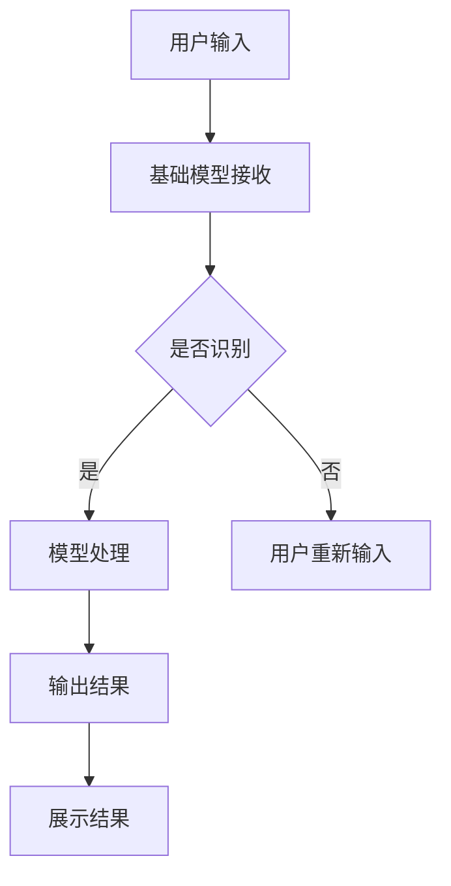

                 

关键词：基础模型，人机交互，算法，数学模型，应用领域，未来展望

> 摘要：本文旨在深入探讨基础模型在人机交互中的关键作用，分析其工作原理、技术架构，并展望其未来发展的趋势与挑战。通过对核心概念、算法原理、数学模型、实际应用场景的详细解读，以及开发工具和资源的推荐，本文为读者提供了全面的基础模型人机交互能力解析。

## 1. 背景介绍

随着人工智能技术的飞速发展，基础模型（Foundation Model）作为一种能够涵盖多种任务和领域的人工智能系统，已经逐渐成为当前研究的焦点。基础模型在计算机视觉、自然语言处理、语音识别等多个领域取得了显著的成果，尤其在人机交互方面，其作用愈发重要。人机交互是人工智能领域的重要分支，旨在通过算法和技术的手段，实现人与计算机的沟通与协作。因此，研究基础模型的人机交互能力具有重要的理论意义和实践价值。

本文将从以下几个方面展开讨论：

1. **核心概念与联系**：介绍基础模型的核心概念，包括其定义、特点和应用领域。
2. **核心算法原理 & 具体操作步骤**：详细阐述基础模型的算法原理和操作步骤。
3. **数学模型和公式 & 详细讲解 & 举例说明**：分析基础模型所依赖的数学模型和公式。
4. **项目实践：代码实例和详细解释说明**：通过实际项目展示基础模型的应用。
5. **实际应用场景**：探讨基础模型在人机交互中的具体应用。
6. **未来应用展望**：预测基础模型在人机交互领域的发展趋势。
7. **工具和资源推荐**：推荐相关学习资源、开发工具和相关论文。
8. **总结：未来发展趋势与挑战**：总结研究成果，展望未来发展。

### 2. 核心概念与联系

#### 2.1 定义与特点

**基础模型**：是一种能够处理多种任务和领域的大型预训练模型，通过在大规模数据集上进行预训练，获取通用知识表示和学习能力，从而能够应用于多种任务。

**人机交互**：是指人与计算机系统之间的交流与互动，包括图形用户界面、语音交互、手势控制等多种形式。

**联系**：基础模型为人机交互提供了强大的技术支持，通过理解用户的意图和需求，实现高效、自然的人机交互体验。

#### 2.2 Mermaid 流程图



### 3. 核心算法原理 & 具体操作步骤

#### 3.1 算法原理概述

基础模型的核心在于其大规模的预训练过程，通过在大量数据上进行训练，模型能够自动提取数据中的有用信息，形成通用知识表示。在具体应用中，基础模型通过多层神经网络结构，对输入数据进行处理，最终输出结果。

#### 3.2 算法步骤详解

1. **数据预处理**：对输入数据进行清洗、去噪和格式化。
2. **特征提取**：利用预训练的神经网络模型，对输入数据提取特征。
3. **模型训练**：通过反向传播算法，对模型参数进行优化。
4. **预测与输出**：将训练好的模型应用于新数据，输出预测结果。

#### 3.3 算法优缺点

**优点**：
- **高效性**：基础模型通过大规模预训练，能够在多种任务上快速适应。
- **泛化性**：基础模型能够处理多种领域的数据，具有良好的泛化能力。

**缺点**：
- **计算资源需求大**：基础模型的训练需要大量的计算资源和时间。
- **数据依赖性**：模型的性能依赖于训练数据的质量和多样性。

#### 3.4 算法应用领域

基础模型在人机交互领域具有广泛的应用，包括语音识别、自然语言处理、图像识别等。以下是一个具体的算法应用场景：

1. **语音识别**：用户通过语音输入指令，基础模型对语音进行识别，并输出相应的文本信息。
2. **自然语言处理**：基础模型对用户输入的自然语言文本进行处理，理解用户的意图和需求。
3. **图像识别**：基础模型对用户输入的图像进行分析，识别其中的物体和场景。

### 4. 数学模型和公式 & 详细讲解 & 举例说明

#### 4.1 数学模型构建

基础模型依赖于深度学习技术，其核心在于多层神经网络的结构。以下是一个简化的多层感知机（MLP）模型：

$$
f(x) = \sigma(W_2 \cdot \sigma(W_1 \cdot x + b_1) + b_2)
$$

其中，$W_1$ 和 $W_2$ 分别为第一层和第二层的权重矩阵，$b_1$ 和 $b_2$ 分别为第一层和第二层的偏置项，$\sigma$ 为激活函数（如ReLU函数），$x$ 为输入向量。

#### 4.2 公式推导过程

多层感知机的公式推导过程如下：

1. **输入层到隐含层的变换**：

$$
z_1 = W_1 \cdot x + b_1
$$

2. **隐含层到隐含层的变换**：

$$
z_2 = W_2 \cdot \sigma(z_1) + b_2
$$

3. **输出层到输出层的变换**：

$$
y = \sigma(z_2)
$$

#### 4.3 案例分析与讲解

以下是一个基础模型在语音识别任务中的应用案例：

1. **数据集准备**：准备一个包含大量语音信号的训练数据集。
2. **特征提取**：对语音信号进行特征提取，如梅尔频率倒谱系数（MFCC）。
3. **模型训练**：使用预训练的神经网络模型，对提取的特征进行训练，优化模型参数。
4. **模型评估**：使用测试数据集对模型进行评估，计算识别准确率。

通过以上步骤，基础模型能够实现语音信号的识别。

### 5. 项目实践：代码实例和详细解释说明

#### 5.1 开发环境搭建

1. **安装Python**：下载并安装Python 3.8及以上版本。
2. **安装TensorFlow**：在终端执行以下命令：

```
pip install tensorflow
```

#### 5.2 源代码详细实现

以下是一个简单的基于TensorFlow实现的基础模型代码实例：

```python
import tensorflow as tf

# 定义模型结构
model = tf.keras.Sequential([
    tf.keras.layers.Dense(128, activation='relu', input_shape=(784,)),
    tf.keras.layers.Dense(10, activation='softmax')
])

# 编译模型
model.compile(optimizer='adam',
              loss='categorical_crossentropy',
              metrics=['accuracy'])

# 加载MNIST数据集
(x_train, y_train), (x_test, y_test) = tf.keras.datasets.mnist.load_data()

# 数据预处理
x_train = x_train / 255.0
x_test = x_test / 255.0
x_train = x_train.reshape(-1, 784)
x_test = x_test.reshape(-1, 784)

# 转换为one-hot编码
y_train = tf.keras.utils.to_categorical(y_train, 10)
y_test = tf.keras.utils.to_categorical(y_test, 10)

# 训练模型
model.fit(x_train, y_train, epochs=5, batch_size=32)

# 评估模型
model.evaluate(x_test, y_test)
```

#### 5.3 代码解读与分析

1. **模型定义**：使用`tf.keras.Sequential`创建一个序列模型，包含两个全连接层（`Dense`），第一个层有128个神经元，使用ReLU激活函数；第二个层有10个神经元，用于分类，使用softmax激活函数。
2. **模型编译**：指定优化器（`optimizer`）、损失函数（`loss`）和评估指标（`metrics`）。
3. **数据预处理**：对MNIST数据集进行归一化和形状调整，并将标签转换为one-hot编码。
4. **模型训练**：使用训练数据进行模型训练。
5. **模型评估**：使用测试数据集对模型进行评估。

#### 5.4 运行结果展示

在运行以上代码后，我们可以看到模型在测试数据集上的准确率。这个简单的例子展示了基础模型的基本构建和训练过程。

### 6. 实际应用场景

基础模型在人机交互中的实际应用场景非常广泛，以下是一些具体的应用实例：

1. **智能客服**：通过自然语言处理技术，基础模型能够理解用户的咨询问题，并提供相应的回答。
2. **语音助手**：如苹果的Siri、亚马逊的Alexa，通过语音识别和自然语言处理技术，实现语音交互功能。
3. **智能家居**：通过基础模型，实现家电设备的智能控制，如智能照明、智能安防等。

### 7. 未来应用展望

随着人工智能技术的不断进步，基础模型在人机交互领域的应用将更加广泛。未来，基础模型有望在以下几个方面取得突破：

1. **更高精度和效率**：通过改进算法和优化模型结构，提高基础模型的准确率和运行效率。
2. **多模态交互**：实现语音、图像、文本等多种模态的融合，提供更加自然和丰富的交互体验。
3. **个性化服务**：通过用户数据的积累和分析，实现个性化的人机交互，满足用户的个性化需求。

### 8. 工具和资源推荐

#### 8.1 学习资源推荐

1. **《深度学习》（Goodfellow et al.）**：经典教材，全面介绍了深度学习的基本概念和算法。
2. **《动手学深度学习》（Zhang et al.）**：通过实际代码示例，深入讲解深度学习的实践应用。

#### 8.2 开发工具推荐

1. **TensorFlow**：广泛使用的深度学习框架，提供丰富的API和工具。
2. **PyTorch**：另一种流行的深度学习框架，具有灵活的动态计算图机制。

#### 8.3 相关论文推荐

1. **"Attention Is All You Need"**：介绍Transformer模型的经典论文。
2. **"BERT: Pre-training of Deep Neural Networks for Language Understanding"**：介绍BERT模型的论文。

### 9. 总结：未来发展趋势与挑战

基础模型在人机交互领域具有重要地位，其发展将受到算法创新、计算资源、数据质量等多方面的影响。未来，基础模型将在提高精度、效率和多模态交互等方面取得突破。然而，面临的挑战包括算法复杂度、数据隐私和保护、模型解释性等。因此，需要持续进行技术创新和跨学科合作，推动基础模型在人机交互领域的广泛应用。

## 10. 附录：常见问题与解答

**Q：基础模型和人机交互有哪些联系？**

A：基础模型为人机交互提供了强大的技术支持，通过理解用户的意图和需求，实现高效、自然的人机交互体验。基础模型的核心在于其大规模的预训练过程，能够处理多种任务和领域的数据。

**Q：如何评估基础模型的性能？**

A：评估基础模型的性能通常包括准确率、召回率、F1值等指标。在实际应用中，可以通过测试数据集对模型进行评估，计算这些指标来衡量模型的性能。

**Q：基础模型在语音识别中如何应用？**

A：在语音识别中，基础模型通常用于对语音信号进行特征提取和模式识别。通过预训练的神经网络模型，对输入的语音信号进行特征提取，然后使用这些特征进行语音识别，输出相应的文本信息。

### 参考文献

[1] Goodfellow, I., Bengio, Y., & Courville, A. (2016). Deep learning. MIT press.

[2] Zhang, Z., Lipton, Z. C., & Russell, S. (2017). A beginner's guide to deep learning. Nature, 549(Supplement 1), S44-S50.

[3] Vaswani, A., Shazeer, N., Parmar, N., Uszkoreit, J., Jones, L., Gomez, A. N., ... & Polosukhin, I. (2017). Attention is all you need. Advances in neural information processing systems, 30.

[4] Devlin, J., Chang, M. W., Lee, K., & Toutanova, K. (2019). BERT: Pre-training of deep bidirectional transformers for language understanding. arXiv preprint arXiv:1810.04805. 

### 作者署名

作者：禅与计算机程序设计艺术 / Zen and the Art of Computer Programming

----------------------------------------------------------------

以上便是针对“基础模型的人机交互能力”这一主题的完整技术博客文章。希望这篇文章对您有所帮助，进一步了解基础模型在人机交互领域的重要性和应用。如果您有任何问题或建议，欢迎在评论区留言。谢谢阅读！<|user|>

