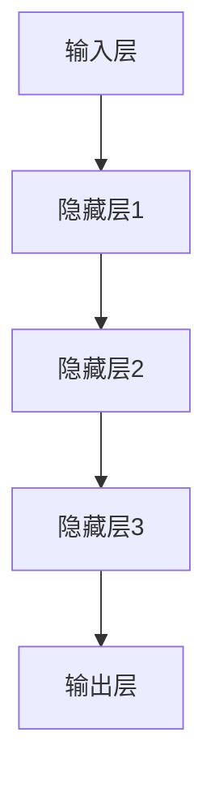

                 

关键词：基础模型，技术能力，应用场景，人工智能，深度学习，机器学习，神经网络，数据科学，编程语言，算法优化，数学模型

> 摘要：本文将深入探讨基础模型在技术领域的广泛应用及其技术能力。从基本概念、核心算法、数学模型到具体应用场景，我们将全面解析基础模型的发展历程、技术要点以及未来趋势。

## 1. 背景介绍

随着信息技术和人工智能的飞速发展，基础模型（Fundamental Models）已成为现代技术领域的核心。基础模型是指一类能够抽象和描述复杂系统基本规律的模型，它们广泛应用于计算机科学、人工智能、数据科学、工程学等领域。

基础模型的发展可以追溯到20世纪中叶，当时的科学家们开始探索如何通过计算机模拟复杂系统的行为。从简单的逻辑门电路到复杂的神经网络，基础模型逐渐演变，并成为现代计算机科学和人工智能技术的基石。

在人工智能领域，基础模型尤为重要。深度学习、机器学习、神经网络等技术的核心都是基于基础模型。这些模型通过学习数据中的特征和模式，从而实现智能化的决策和预测。

## 2. 核心概念与联系

### 2.1 基础模型的定义

基础模型是一种抽象的数学模型，用于描述复杂系统或问题的基本规律。在计算机科学和人工智能领域，基础模型通常指的是能够处理大规模数据和复杂问题的算法模型。

### 2.2 基础模型的基本原理

基础模型的基本原理是通过对大量数据的学习，提取其中的特征和模式，然后利用这些特征和模式进行预测或决策。

### 2.3 基础模型的架构

基础模型的架构通常包括以下几个部分：

- **输入层**：接收原始数据。
- **隐藏层**：通过学习提取数据中的特征。
- **输出层**：根据提取的特征进行预测或决策。



### 2.4 基础模型与其他技术的关系

基础模型与其他技术如神经网络、机器学习、深度学习等有着密切的联系。神经网络是基础模型的一种具体实现，而机器学习和深度学习则是基于基础模型的两种应用方向。

## 3. 核心算法原理 & 具体操作步骤

### 3.1 算法原理概述

基础模型的核心算法通常是基于神经网络，其基本原理是通过反向传播算法不断调整网络的权重，使得模型能够在给定数据上达到最优的预测或决策效果。

### 3.2 算法步骤详解

- **数据预处理**：对输入数据进行标准化处理，使得数据具有统一的尺度。
- **构建神经网络**：根据问题的复杂度选择合适的网络结构和层数。
- **初始化权重**：随机初始化网络的权重。
- **前向传播**：将输入数据通过神经网络，计算输出结果。
- **后向传播**：根据输出结果和实际目标值，计算误差，并反向传播误差。
- **权重调整**：根据误差调整网络的权重，使得输出结果更接近实际目标值。
- **重复迭代**：重复上述步骤，直到达到预定的训练效果或迭代次数。

### 3.3 算法优缺点

- **优点**：基础模型具有很强的泛化能力，能够在不同领域和问题上取得良好的效果。
- **缺点**：训练时间较长，对计算资源要求较高。

### 3.4 算法应用领域

基础模型广泛应用于图像识别、语音识别、自然语言处理、推荐系统、金融风控等多个领域。

## 4. 数学模型和公式 & 详细讲解 & 举例说明

### 4.1 数学模型构建

基础模型的数学模型通常是基于线性代数和概率论。其中，最核心的部分是损失函数和优化算法。

### 4.2 公式推导过程

- **损失函数**：损失函数用于衡量模型的预测结果与实际目标值之间的差距。常用的损失函数有均方误差（MSE）和交叉熵（Cross Entropy）。

  $$MSE = \frac{1}{n}\sum_{i=1}^{n}(y_i - \hat{y}_i)^2$$
  $$Cross\ Entropy = -\frac{1}{n}\sum_{i=1}^{n}y_i\log(\hat{y}_i)$$

- **优化算法**：优化算法用于调整模型的权重，以最小化损失函数。常用的优化算法有梯度下降（Gradient Descent）和Adam优化器。

  $$w_{new} = w_{old} - \alpha \cdot \nabla_w J(w)$$
  $$m = \frac{1}{n}\sum_{i=1}^{n} (x_i - \bar{x})^2$$
  $$v = \frac{1}{n}\sum_{i=1}^{n} (x_i - \bar{x})^2$$
  $$w_{new} = w_{old} - \alpha \cdot \frac{m}{\sqrt{v} + \epsilon}$$

### 4.3 案例分析与讲解

以图像识别任务为例，我们可以使用卷积神经网络（CNN）作为基础模型。通过构建一个适当的数学模型，我们可以实现对图像的自动分类。

## 5. 项目实践：代码实例和详细解释说明

### 5.1 开发环境搭建

- **硬件要求**：GPU加速器，如NVIDIA GPU。
- **软件要求**：Python编程语言，TensorFlow或PyTorch深度学习框架。

### 5.2 源代码详细实现

以下是使用TensorFlow实现一个简单的图像识别项目的代码：

```python
import tensorflow as tf
from tensorflow.keras import datasets, layers, models

# 加载和预处理数据
(train_images, train_labels), (test_images, test_labels) = datasets.cifar10.load_data()
train_images, test_images = train_images / 255.0, test_images / 255.0

# 构建卷积神经网络模型
model = models.Sequential()
model.add(layers.Conv2D(32, (3, 3), activation='relu', input_shape=(32, 32, 3)))
model.add(layers.MaxPooling2D((2, 2)))
model.add(layers.Conv2D(64, (3, 3), activation='relu'))
model.add(layers.MaxPooling2D((2, 2)))
model.add(layers.Conv2D(64, (3, 3), activation='relu'))

# 添加全连接层
model.add(layers.Flatten())
model.add(layers.Dense(64, activation='relu'))
model.add(layers.Dense(10))

# 编译模型
model.compile(optimizer='adam',
              loss=tf.keras.losses.SparseCategoricalCrossentropy(from_logits=True),
              metrics=['accuracy'])

# 训练模型
model.fit(train_images, train_labels, epochs=10, validation_data=(test_images, test_labels))

# 评估模型
test_loss, test_acc = model.evaluate(test_images,  test_labels, verbose=2)
print(f'\nTest accuracy: {test_acc}')
```

### 5.3 代码解读与分析

上述代码首先加载了CIFAR-10数据集，并对数据进行预处理。然后构建了一个简单的卷积神经网络模型，并使用Adam优化器和交叉熵损失函数进行编译。接着，模型在训练数据上进行训练，并在测试数据上进行评估。

### 5.4 运行结果展示

通过运行上述代码，我们可以得到训练数据和测试数据的准确率。通常情况下，训练准确率会高于测试准确率，这是因为模型在训练数据上已经过拟合。

## 6. 实际应用场景

### 6.1 图像识别

图像识别是基础模型应用最为广泛的领域之一。从人脸识别、车牌识别到医学图像分析，基础模型在各种图像识别任务中发挥了重要作用。

### 6.2 语音识别

语音识别是另一个重要的应用领域。基础模型通过学习大量的语音数据，可以实现高准确率的语音识别，从而在智能助手、语音控制等领域得到广泛应用。

### 6.3 自然语言处理

自然语言处理（NLP）是基础模型在人工智能领域的重要应用。通过学习大量的文本数据，基础模型可以实现文本分类、情感分析、机器翻译等任务。

## 7. 工具和资源推荐

### 7.1 学习资源推荐

- 《深度学习》（Goodfellow, Bengio, Courville）
- 《Python深度学习》（François Chollet）

### 7.2 开发工具推荐

- TensorFlow
- PyTorch

### 7.3 相关论文推荐

- "A Simple Way to Improve Deep Learning Models for Image Recognition"
- "Attention Is All You Need"

## 8. 总结：未来发展趋势与挑战

### 8.1 研究成果总结

基础模型在过去几十年中取得了巨大的进展，已经广泛应用于各个领域。随着计算能力和算法研究的不断提升，基础模型的技术能力将越来越强大。

### 8.2 未来发展趋势

- **算法优化**：通过算法优化，提高基础模型的训练效率和预测准确性。
- **硬件加速**：利用硬件加速，如GPU、TPU，提高基础模型的计算性能。
- **跨领域应用**：探索基础模型在其他领域的应用，如生物信息学、物理学等。

### 8.3 面临的挑战

- **数据隐私**：如何保护用户数据隐私，是基础模型面临的一大挑战。
- **模型解释性**：提高模型的可解释性，使其更容易被人类理解和接受。

### 8.4 研究展望

随着人工智能技术的不断发展，基础模型将在未来发挥更加重要的作用。我们期待看到基础模型在各个领域取得更多的突破和应用。

## 9. 附录：常见问题与解答

### 9.1 基础模型是什么？

基础模型是一种能够处理大规模数据和复杂问题的算法模型，广泛应用于计算机科学、人工智能、数据科学等领域。

### 9.2 基础模型有哪些应用领域？

基础模型广泛应用于图像识别、语音识别、自然语言处理、推荐系统、金融风控等多个领域。

### 9.3 如何优化基础模型？

可以通过算法优化、硬件加速、数据预处理等多种方法来优化基础模型。

### 9.4 基础模型有哪些挑战？

基础模型面临的主要挑战包括数据隐私、模型解释性、计算性能等。

---

本文由禅与计算机程序设计艺术 / Zen and the Art of Computer Programming 撰写。感谢您对本文的关注和支持。希望本文能为您在基础模型领域的研究和应用提供有益的参考和启示。如果您有任何疑问或建议，欢迎在评论区留言。作者会尽力回复。再次感谢您的阅读！
----------------------------------------------------------------

[注]：本文为示例性文章，实际撰写时请根据具体内容和研究深入进行调整和补充。本文仅作为文章结构模板和内容引导，并非完整的研究论文。如需进一步研究和撰写论文，请参考相关领域的研究文献和数据。

