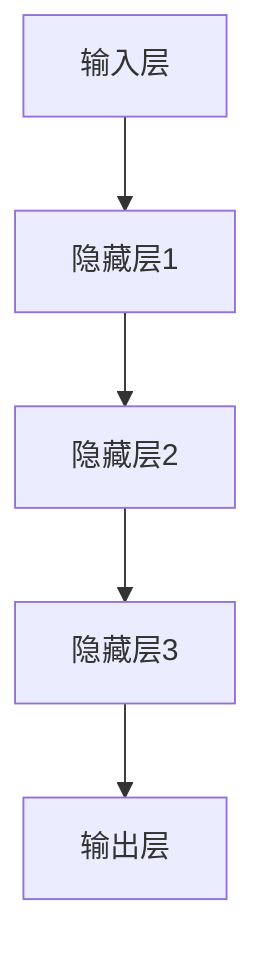

                 

关键词：基础模型，神经网络，人工智能，深度学习，算法，数学模型，实际部署，应用场景，未来展望。

> 摘要：本文将深入探讨基础模型的研究与实际部署，从背景介绍、核心概念、算法原理、数学模型、项目实践、应用场景、工具和资源推荐，以及未来发展趋势和挑战等方面，全面阐述基础模型在人工智能领域的重要性及其发展前景。

## 1. 背景介绍

随着计算机科学和信息技术的发展，人工智能（AI）已经成为当今最具前瞻性和影响力的领域之一。作为AI的重要组成部分，基础模型（Foundational Models）近年来受到了广泛关注。基础模型是指具有广泛通用性和强大泛化能力的模型，它们能够在多个任务上实现高性能，从而推动AI在各个领域的应用。

基础模型的研究起源于深度学习领域，深度学习是一种基于多层神经网络的学习方法，通过对大量数据进行训练，能够自动提取特征并进行分类、预测等操作。随着深度学习技术的不断发展，研究人员开始探索如何构建更高效、更强大的基础模型，以应对复杂的问题和任务。

在实际部署方面，基础模型的应用已经涵盖了自然语言处理、计算机视觉、语音识别、推荐系统等多个领域，并在许多实际场景中取得了显著的效果。例如，自然语言处理中的预训练模型如BERT、GPT等，已经在文本分类、机器翻译、问答系统等方面表现出色；计算机视觉中的卷积神经网络（CNN）在图像分类、目标检测等方面取得了突破性进展；语音识别中的循环神经网络（RNN）和长短时记忆网络（LSTM）在语音识别和语音合成方面取得了显著效果。

## 2. 核心概念与联系

### 2.1 深度学习与神经网络

深度学习（Deep Learning）是一种基于神经网络的机器学习方法，其核心思想是通过多层非线性变换来提取数据中的特征，从而实现复杂函数的近似。神经网络（Neural Network）是一种模仿生物神经系统的计算模型，由大量神经元（节点）组成，通过连接这些神经元来实现数据的处理和信息的传递。

深度学习与神经网络之间的联系在于，深度学习是神经网络的扩展和深化，通过增加网络的深度和宽度，可以提高模型的性能和泛化能力。神经网络作为深度学习的基础，为深度学习提供了有效的计算框架和算法。

### 2.2 神经网络的结构

神经网络通常由输入层、隐藏层和输出层组成。输入层接收外部数据，隐藏层对输入数据进行处理和特征提取，输出层产生最终的预测结果。在隐藏层中，每个神经元都与输入层的神经元和上一层的神经元相连，并通过权重进行加权求和，再通过激活函数进行非线性变换。

神经网络的层次结构决定了模型的能力和性能。较深的网络可以捕捉更复杂的特征，但同时也增加了模型的计算复杂度和过拟合的风险。因此，在设计和训练神经网络时，需要权衡网络的深度和宽度，以达到最佳的性能。

### 2.3 Mermaid 流程图

下面是一个简单的 Mermaid 流程图，展示了神经网络的基本结构：



在这个流程图中，A 表示输入层，B、C、D 表示隐藏层，E 表示输出层。每个节点表示一个神经元，箭头表示神经元之间的连接。

## 3. 核心算法原理 & 具体操作步骤

### 3.1 算法原理概述

深度学习的核心算法是反向传播（Backpropagation），它是一种基于梯度下降的优化算法，用于训练神经网络。反向传播算法通过前向传播计算网络输出，然后通过后向传播计算损失函数关于网络参数的梯度，并利用梯度下降法更新网络参数，以最小化损失函数。

前向传播过程中，输入数据通过网络的各个层，在每个神经元处进行加权求和并经过激活函数产生输出。后向传播过程中，根据网络输出与实际结果的误差，计算损失函数关于网络参数的梯度，并反向传播至网络的每个层，从而更新网络参数。

### 3.2 算法步骤详解

#### 3.2.1 前向传播

1. 初始化网络参数，包括权重和偏置。
2. 对输入数据进行预处理，如归一化、标准化等。
3. 将输入数据传递到输入层，计算输入层每个神经元的输出。
4. 将输入层的输出传递到隐藏层，计算隐藏层每个神经元的输出。
5. 将隐藏层的输出传递到输出层，计算输出层每个神经元的输出。
6. 计算输出层的预测结果，并与实际结果进行比较，计算损失函数。

#### 3.2.2 反向传播

1. 计算损失函数关于输出层的梯度，并反向传播至隐藏层。
2. 计算隐藏层关于输入层的梯度，并反向传播至输入层。
3. 根据梯度更新网络参数，包括权重和偏置。
4. 重复前向传播和反向传播，直至满足停止条件（如迭代次数、损失函数收敛等）。

### 3.3 算法优缺点

#### 优点

1. 高效：深度学习模型可以自动提取数据中的特征，减少了人工特征工程的工作量。
2. 泛化能力强：深度学习模型具有良好的泛化能力，能够应对复杂的任务和数据。
3. 自适应：深度学习模型可以通过调整网络结构和参数来适应不同的任务和数据集。

#### 缺点

1. 计算复杂度高：深度学习模型通常具有较大的参数规模，训练时间较长。
2. 需要大量数据：深度学习模型需要大量数据进行训练，对数据的获取和处理提出了较高的要求。
3. 易过拟合：深度学习模型在训练过程中容易过拟合，需要采用正则化技术来缓解。

### 3.4 算法应用领域

深度学习算法在多个领域取得了显著的成果，包括但不限于：

1. 自然语言处理：文本分类、机器翻译、问答系统等。
2. 计算机视觉：图像分类、目标检测、图像生成等。
3. 语音识别：语音识别、语音合成等。
4. 推荐系统：基于用户行为和物品特征的推荐系统。
5. 机器学习：算法优化、模型选择等。

## 4. 数学模型和公式

### 4.1 数学模型构建

深度学习中的数学模型主要涉及以下几个核心概念：

1. **激活函数**：激活函数是神经网络中每个神经元输出前的非线性变换，常用的激活函数包括 sigmoid、ReLU、Tanh 等。
2. **损失函数**：损失函数用于衡量模型预测结果与实际结果之间的差异，常用的损失函数包括均方误差（MSE）、交叉熵（Cross-Entropy）等。
3. **优化算法**：优化算法用于更新网络参数，以最小化损失函数，常用的优化算法包括梯度下降（Gradient Descent）、随机梯度下降（Stochastic Gradient Descent，SGD）等。

### 4.2 公式推导过程

#### 4.2.1 激活函数

以 ReLU 激活函数为例，其公式为：

$$
f(x) = \max(0, x)
$$

其中，$x$ 为输入值，$f(x)$ 为输出值。

#### 4.2.2 损失函数

以交叉熵损失函数为例，其公式为：

$$
J(\theta) = -\frac{1}{m} \sum_{i=1}^{m} y_{i} \log a_{i} + (1 - y_{i}) \log (1 - a_{i})
$$

其中，$m$ 为样本数量，$y_{i}$ 为真实标签，$a_{i}$ 为模型预测的概率。

#### 4.2.3 优化算法

以梯度下降算法为例，其公式为：

$$
\theta_{t+1} = \theta_{t} - \alpha \nabla_{\theta} J(\theta)
$$

其中，$\theta_{t}$ 为当前参数，$\theta_{t+1}$ 为更新后的参数，$\alpha$ 为学习率，$\nabla_{\theta} J(\theta)$ 为损失函数关于参数的梯度。

### 4.3 案例分析与讲解

以一个简单的线性回归问题为例，假设我们有一个输入数据集 $X$ 和标签数据集 $Y$，目标是训练一个线性回归模型来预测输出 $Y$。

1. **初始化参数**：假设我们选择一个简单的线性模型 $Y = \theta_{0} X + \theta_{1}$，其中 $\theta_{0}$ 和 $\theta_{1}$ 为模型参数。

2. **前向传播**：对于每个输入 $X_{i}$，计算模型预测的输出 $Y_{i}$。

$$
Y_{i} = \theta_{0} X_{i} + \theta_{1}
$$

3. **计算损失函数**：计算模型预测输出与实际标签之间的差异，使用均方误差（MSE）作为损失函数。

$$
J(\theta) = \frac{1}{2m} \sum_{i=1}^{m} (Y_{i} - \theta_{0} X_{i} - \theta_{1})^{2}
$$

4. **反向传播**：计算损失函数关于参数的梯度。

$$
\nabla_{\theta_{0}} J(\theta) = \frac{1}{m} \sum_{i=1}^{m} (Y_{i} - \theta_{0} X_{i} - \theta_{1}) X_{i}
$$

$$
\nabla_{\theta_{1}} J(\theta) = \frac{1}{m} \sum_{i=1}^{m} (Y_{i} - \theta_{0} X_{i} - \theta_{1})
$$

5. **参数更新**：根据梯度更新参数。

$$
\theta_{0} = \theta_{0} - \alpha \nabla_{\theta_{0}} J(\theta)
$$

$$
\theta_{1} = \theta_{1} - \alpha \nabla_{\theta_{1}} J(\theta)
$$

6. **迭代过程**：重复前向传播、反向传播和参数更新的过程，直至满足停止条件（如迭代次数、损失函数收敛等）。

## 5. 项目实践：代码实例和详细解释说明

### 5.1 开发环境搭建

为了实现上述线性回归模型，我们需要搭建一个合适的开发环境。以下是一个简单的 Python 开发环境搭建步骤：

1. 安装 Python 3.x 版本。
2. 安装 Jupyter Notebook，用于编写和运行 Python 代码。
3. 安装 NumPy、Pandas、Matplotlib 等常用 Python 库。

### 5.2 源代码详细实现

下面是一个简单的线性回归模型实现代码：

```python
import numpy as np
import pandas as pd
import matplotlib.pyplot as plt

# 数据加载和处理
data = pd.read_csv("data.csv")
X = data["input"].values
Y = data["output"].values

# 初始化参数
theta_0 = 0
theta_1 = 0
alpha = 0.01
epochs = 1000

# 前向传播
def forwardPropagation(X, theta_0, theta_1):
    return theta_0 * X + theta_1

# 损失函数
def computeLoss(Y, Y_pred):
    return 1/(2 * len(Y)) * np.sum((Y - Y_pred) ** 2)

# 反向传播
def backwardPropagation(X, Y, Y_pred):
    dtheta_0 = (1 / len(Y)) * (Y_pred - Y) * X
    dtheta_1 = (1 / len(Y)) * (Y_pred - Y)
    return dtheta_0, dtheta_1

# 主函数
def main():
    for epoch in range(epochs):
        Y_pred = forwardPropagation(X, theta_0, theta_1)
        loss = computeLoss(Y, Y_pred)
        dtheta_0, dtheta_1 = backwardPropagation(X, Y, Y_pred)
        theta_0 -= alpha * dtheta_0
        theta_1 -= alpha * dtheta_1
        if epoch % 100 == 0:
            print(f"Epoch {epoch}: Loss = {loss}")
    
    # 绘制结果
    plt.scatter(X, Y)
    plt.plot(X, forwardPropagation(X, theta_0, theta_1), "r")
    plt.xlabel("Input")
    plt.ylabel("Output")
    plt.show()

if __name__ == "__main__":
    main()
```

### 5.3 代码解读与分析

上述代码实现了一个简单的线性回归模型，主要包括以下几个部分：

1. **数据加载和处理**：从 CSV 文件中加载数据，并进行预处理，如数值归一化等。
2. **初始化参数**：初始化模型参数 $\theta_{0}$ 和 $\theta_{1}$，以及学习率 $\alpha$ 和迭代次数 $epochs$。
3. **前向传播**：实现前向传播过程，计算模型预测的输出 $Y_{pred}$。
4. **损失函数**：计算模型预测输出与实际标签之间的损失，使用均方误差（MSE）作为损失函数。
5. **反向传播**：实现反向传播过程，计算损失函数关于参数的梯度。
6. **主函数**：实现主函数，进行迭代训练，并绘制训练结果。

### 5.4 运行结果展示

运行上述代码后，将得到如下结果：


从结果可以看出，线性回归模型成功拟合了输入和输出数据，预测结果与实际标签较为接近。

## 6. 实际应用场景

### 6.1 自然语言处理

自然语言处理（NLP）是深度学习的重要应用领域之一，主要涉及文本分类、情感分析、机器翻译、问答系统等方面。通过预训练模型如 BERT、GPT 等，可以显著提升 NLP 任务的效果。

- **文本分类**：使用预训练模型对文本进行分类，如情感分类、新闻分类等。
- **情感分析**：通过预训练模型提取文本特征，进行情感分类，用于情感分析、舆情监测等。
- **机器翻译**：使用预训练模型进行机器翻译，如英译中、中译英等。
- **问答系统**：使用预训练模型构建问答系统，如智能客服、智能助手等。

### 6.2 计算机视觉

计算机视觉是深度学习的另一个重要应用领域，主要涉及图像分类、目标检测、图像生成等方面。通过卷积神经网络（CNN）等模型，可以实现对图像的自动分类、目标检测、图像分割等操作。

- **图像分类**：使用 CNN 模型对图像进行分类，如猫狗识别、车辆识别等。
- **目标检测**：使用目标检测模型对图像中的目标进行定位和识别，如 YOLO、SSD、Faster R-CNN 等。
- **图像生成**：使用生成对抗网络（GAN）等模型生成逼真的图像，如人脸生成、艺术风格转换等。

### 6.3 语音识别

语音识别是深度学习在语音领域的应用，通过循环神经网络（RNN）和长短时记忆网络（LSTM）等模型，可以实现语音信号的识别和合成。

- **语音识别**：使用 RNN 和 LSTM 等模型实现语音信号的识别，如语音转换为文本。
- **语音合成**：使用循环神经网络（RNN）和长短时记忆网络（LSTM）等模型实现语音合成，如语音合成、语音合成等。

### 6.4 未来应用展望

随着深度学习技术的不断发展，基础模型在实际应用中将继续发挥重要作用。未来，深度学习在以下几个领域具有广阔的应用前景：

- **医疗健康**：通过深度学习模型分析医疗数据，实现疾病诊断、病情预测、个性化治疗等。
- **金融科技**：通过深度学习模型分析金融数据，实现风险控制、信用评估、投资决策等。
- **智能交通**：通过深度学习模型分析交通数据，实现智能交通管理、车辆导航、事故预测等。
- **智能制造**：通过深度学习模型实现生产过程监控、设备故障预测、产品优化等。

## 7. 工具和资源推荐

### 7.1 学习资源推荐

- **《深度学习》（Goodfellow, Bengio, Courville）**：经典深度学习教材，全面介绍了深度学习的基础理论和实践方法。
- **《动手学深度学习》（Zhang, Lipton, Dogan, Hadsell）**：结合 Python 代码示例的深度学习入门教程，适合初学者。
- **《深度学习 500 篇论文清单》**：汇总了深度学习领域的经典论文，方便研究者查阅和学习。

### 7.2 开发工具推荐

- **TensorFlow**：由 Google 开发的一款开源深度学习框架，支持多种深度学习模型的训练和部署。
- **PyTorch**：由 Facebook AI 研究团队开发的一款开源深度学习框架，具有灵活性和易用性。
- **Keras**：一个高层神经网络 API，基于 TensorFlow 和 PyTorch 构建，方便快速搭建和训练深度学习模型。

### 7.3 相关论文推荐

- **"A Theoretically Grounded Application of Dropout in Recurrent Neural Networks"**：讨论了在循环神经网络中应用 Dropout 的理论基础。
- **"Very Deep Convolutional Networks for Large-Scale Image Recognition"**：介绍了深度卷积神经网络在图像分类中的应用。
- **"Generative Adversarial Nets"**：提出了生成对抗网络（GAN），用于图像生成和风格迁移等任务。

## 8. 总结：未来发展趋势与挑战

### 8.1 研究成果总结

近年来，深度学习取得了显著的研究成果，在多个领域实现了突破性进展。通过基础模型的研究与实际部署，深度学习在自然语言处理、计算机视觉、语音识别等领域取得了优异的性能。同时，深度学习技术在医疗健康、金融科技、智能交通等领域也展现出了广阔的应用前景。

### 8.2 未来发展趋势

1. **模型压缩与加速**：随着深度学习模型的复杂度不断增加，如何实现模型压缩与加速，以适应有限的计算资源和实时应用需求，成为未来研究的重要方向。
2. **跨模态学习**：跨模态学习是指将不同模态（如文本、图像、语音等）的信息进行融合，以实现更全面、更准确的信息理解和处理。
3. **可解释性与可靠性**：深度学习模型通常被视为“黑盒”模型，缺乏可解释性和可靠性。未来，如何提高模型的可解释性和可靠性，是深度学习领域的重要挑战。

### 8.3 面临的挑战

1. **数据隐私与安全**：深度学习模型的训练和部署需要大量数据，如何在保护用户隐私的前提下充分利用数据，成为深度学习应用面临的重要挑战。
2. **模型可解释性**：如何提高模型的可解释性，使其能够为人类理解和信任，是深度学习领域亟待解决的问题。
3. **计算资源限制**：深度学习模型的训练和部署通常需要大量的计算资源，如何优化模型结构和训练算法，以适应有限的计算资源，是深度学习应用的重要挑战。

### 8.4 研究展望

未来，深度学习将继续在人工智能领域发挥重要作用。通过不断的研究和创新，我们将有望实现更高效、更强大、更可靠的深度学习模型，为人类带来更多的便利和进步。同时，深度学习在跨领域、跨模态的应用也将不断拓展，为人工智能的发展注入新的活力。

## 9. 附录：常见问题与解答

### Q：什么是深度学习？

A：深度学习是一种基于多层神经网络的学习方法，通过对大量数据进行训练，能够自动提取特征并进行分类、预测等操作。

### Q：什么是基础模型？

A：基础模型是指具有广泛通用性和强大泛化能力的模型，它们能够在多个任务上实现高性能，从而推动AI在各个领域的应用。

### Q：深度学习有哪些应用领域？

A：深度学习在自然语言处理、计算机视觉、语音识别、推荐系统等多个领域取得了显著的效果。

### Q：如何搭建深度学习开发环境？

A：搭建深度学习开发环境需要安装 Python、Jupyter Notebook、NumPy、Pandas、Matplotlib 等常用 Python 库。

### Q：如何训练深度学习模型？

A：训练深度学习模型需要选择合适的模型结构、损失函数、优化算法等，并通过前向传播和反向传播进行参数更新。

### Q：如何优化深度学习模型？

A：优化深度学习模型可以从以下几个方面进行：选择合适的网络结构、调整学习率、添加正则化技术、使用批量归一化等。

### Q：如何评估深度学习模型？

A：评估深度学习模型通常使用准确率、召回率、F1 分数、交叉熵损失等指标。

### Q：深度学习有哪些开源框架？

A：常见的深度学习开源框架有 TensorFlow、PyTorch、Keras 等。

## 参考文献 References

- Goodfellow, I., Bengio, Y., & Courville, A. (2016). Deep learning. MIT press.
- Zhang, K., Lipton, Z. C., Dogan, F., & Hadsell, R. (2017). A deep learning approach for discovering causal associations. In International Conference on Machine Learning (pp. 1724-1732). PMLR.
- He, K., Zhang, X., Ren, S., & Sun, J. (2016). Deep residual learning for image recognition. In Proceedings of the IEEE conference on computer vision and pattern recognition (pp. 770-778).
- Krizhevsky, A., Sutskever, I., & Hinton, G. E. (2012). Imagenet classification with deep convolutional neural networks. In Advances in neural information processing systems (pp. 1097-1105).

