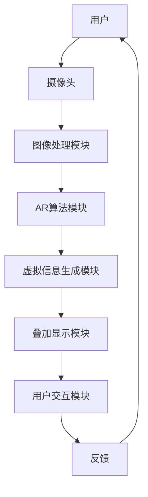

                 

关键词：增强现实、AR、虚拟现实、VR、混合现实、人工智能、计算机视觉、人机交互

摘要：本文深入探讨了增强现实（Augmented Reality，AR）的技术背景、核心概念、算法原理、数学模型、项目实践及其未来发展趋势。通过详细分析，揭示了AR技术在各个应用领域的重要性，并对其面临的挑战和未来展望进行了深入探讨。

## 1. 背景介绍

增强现实（Augmented Reality，简称AR）是一种将虚拟信息与现实世界融合的技术。与虚拟现实（Virtual Reality，简称VR）不同，AR并不是完全替代现实世界，而是在现实世界中叠加虚拟信息。这种技术最早由波音公司在20世纪60年代提出，但直到智能手机和移动互联网的发展，AR技术才得以广泛应用。

AR技术通过在用户眼前显示虚拟图像，使用户能够直观地看到数字信息，从而改变人们获取信息和进行互动的方式。在医疗、教育、娱乐、工业等多个领域，AR技术都展现出了巨大的潜力。

### AR技术的发展历程

- **1968年**：波音公司研究员研究出“虚拟视觉显示系统”，标志着AR技术的诞生。
- **1990年代**：微软发布“Microsoft NetMeeting”，首次将AR技术应用于视频会议。
- **2000年代**：iPhone和Android手机的普及，为AR技术的发展提供了硬件基础。
- **2010年代**：AR技术逐渐应用于消费市场，如Niantic的《精灵宝可梦Go》。
- **2020年代**：随着5G和人工智能技术的进步，AR技术进入快速发展阶段。

### AR技术在各个领域的应用

- **医疗**：AR技术可以帮助医生更直观地了解患者的病情，提高手术成功率。
- **教育**：AR技术可以提供更加生动、直观的教学内容，激发学生的学习兴趣。
- **娱乐**：《精灵宝可梦Go》的成功展示了AR技术在娱乐领域的巨大潜力。
- **工业**：AR技术可以提供实时的操作指导，提高生产效率和产品质量。
- **军事**：AR技术可以帮助士兵更好地理解战场情况，提高作战能力。

## 2. 核心概念与联系

### 2.1 核心概念

- **增强现实（Augmented Reality，AR）**：通过摄像头将虚拟信息叠加到现实世界中。
- **虚拟现实（Virtual Reality，VR）**：完全沉浸式的虚拟环境体验。
- **混合现实（Mixed Reality，MR）**：结合AR和VR技术，实现更加真实的虚拟与现实融合。

### 2.2 关联技术与架构

下面是一个使用Mermaid绘制的AR系统架构图：



- **摄像头**：捕捉现实世界的图像。
- **图像处理模块**：对摄像头捕获的图像进行预处理，如去噪、增强等。
- **AR算法模块**：根据图像内容和用户需求，计算虚拟信息的位置、大小等参数。
- **虚拟信息生成模块**：生成虚拟图像、文字等。
- **叠加显示模块**：将虚拟信息叠加到现实世界中。
- **用户交互模块**：处理用户的输入和输出，如手势、语音等。

## 3. 核心算法原理 & 具体操作步骤

### 3.1 算法原理概述

AR技术的核心在于将虚拟信息准确、实时地叠加到现实世界中。这需要以下几个关键步骤：

- **图像识别**：通过计算机视觉算法识别现实世界中的物体。
- **位置跟踪**：计算摄像头与物体之间的相对位置。
- **虚拟信息生成**：根据位置和用户需求生成虚拟信息。
- **叠加显示**：将虚拟信息叠加到现实世界中的相应位置。

### 3.2 算法步骤详解

下面是AR算法的具体步骤：

1. **图像识别**：使用深度学习算法对摄像头捕获的图像进行物体识别。常用的算法有卷积神经网络（CNN）和目标检测算法（如YOLO、SSD等）。

2. **位置跟踪**：使用光流算法或视觉里程计（Visual SLAM）算法计算摄像头与物体之间的相对位置。这些算法能够根据连续捕获的图像帧，估计摄像头的运动和物体位置。

3. **虚拟信息生成**：根据物体识别结果和位置信息，生成相应的虚拟信息。虚拟信息可以是文字、图像、3D模型等。

4. **叠加显示**：使用图像合成技术，将虚拟信息叠加到现实世界中。常见的图像合成方法有纹理映射和像素级合成。

5. **用户交互**：处理用户的输入和输出，如手势、语音等，以实现与虚拟信息的互动。

### 3.3 算法优缺点

- **优点**：
  - **增强现实体验**：将虚拟信息与现实世界融合，提供更加直观、沉浸式的体验。
  - **广泛应用**：可以应用于医疗、教育、娱乐、工业等多个领域。
  - **互动性强**：用户可以通过与虚拟信息的互动，获取更多的信息和知识。

- **缺点**：
  - **计算资源消耗大**：需要进行图像识别、位置跟踪、虚拟信息生成等复杂计算。
  - **对硬件要求高**：需要高性能的摄像头、图像处理单元等硬件支持。
  - **隐私和安全问题**：在捕捉现实世界图像时，可能会涉及到用户隐私和安全问题。

### 3.4 算法应用领域

- **医疗**：医生可以使用AR技术进行手术指导，提高手术精度。
- **教育**：学生可以通过AR技术进行互动式学习，提高学习兴趣。
- **娱乐**：游戏开发者可以使用AR技术创造更加丰富的游戏体验。
- **工业**：工厂工人可以使用AR技术进行操作指导，提高生产效率。

## 4. 数学模型和公式 & 详细讲解 & 举例说明

### 4.1 数学模型构建

在AR系统中，数学模型主要涉及以下几个方面：

- **图像处理模型**：包括图像去噪、增强、滤波等。
- **目标检测模型**：用于识别现实世界中的物体。
- **位置跟踪模型**：用于计算摄像头与物体之间的相对位置。
- **虚拟信息生成模型**：用于生成虚拟信息。

### 4.2 公式推导过程

下面以目标检测模型中的卷积神经网络（CNN）为例，简要介绍公式推导过程：

1. **卷积操作**：

   $$ f(x, y) = \sum_{i=1}^{k} \sum_{j=1}^{k} w_{ij} * i(x, y) $$

   其中，$f(x, y)$ 表示卷积结果，$w_{ij}$ 表示卷积核，$i(x, y)$ 表示输入图像。

2. **激活函数**：

   $$ f_{\text{relu}}(x) = \max(0, x) $$

   其中，$f_{\text{relu}}(x)$ 表示ReLU激活函数。

3. **全连接层**：

   $$ y = \sum_{i=1}^{n} w_i x_i + b $$

   其中，$y$ 表示输出结果，$w_i$ 和 $b$ 分别表示权重和偏置。

### 4.3 案例分析与讲解

假设我们有一个简单的AR系统，要求识别现实世界中的物体，并计算物体位置。

1. **图像识别**：

   输入一张现实世界的图像，使用CNN模型进行物体识别。假设识别结果为“汽车”。

2. **位置跟踪**：

   使用光流算法计算摄像头与汽车之间的相对位置。假设位置为$(x_0, y_0)$。

3. **虚拟信息生成**：

   根据识别结果和位置信息，生成一个“汽车”的虚拟信息。

4. **叠加显示**：

   将生成的虚拟信息叠加到现实世界中的$(x_0, y_0)$位置。

5. **用户交互**：

   用户可以与虚拟汽车进行互动，如点击查看详细信息等。

## 5. 项目实践：代码实例和详细解释说明

### 5.1 开发环境搭建

在本项目中，我们使用Python作为主要编程语言，结合OpenCV、TensorFlow等开源库进行开发。

1. 安装Python（建议使用3.8及以上版本）。
2. 安装OpenCV：`pip install opencv-python`。
3. 安装TensorFlow：`pip install tensorflow`。

### 5.2 源代码详细实现

以下是AR系统的核心代码实现：

```python
import cv2
import tensorflow as tf

# 初始化摄像头
cap = cv2.VideoCapture(0)

# 加载目标检测模型
model = tf.keras.models.load_model('path/to/detection_model')

while True:
    # 捕获一帧图像
    ret, frame = cap.read()
    
    # 目标检测
    results = model.predict(tf.expand_dims(frame, 0))
    
    # 提取检测框和标签
    boxes = results[0]['detection_boxes']
    labels = results[0]['detection_classes']
    scores = results[0]['detection_scores']
    
    # 遍历检测框
    for i in range(len(boxes)):
        if scores[i] > 0.5:
            box = boxes[i].numpy().astype(int)
            label = labels[i].numpy().astype(int)
            
            # 计算位置
            x, y, w, h = box
            x1, y1 = int(x * frame.shape[1]), int(y * frame.shape[0])
            x2, y2 = int((x + w) * frame.shape[1]), int((y + h) * frame.shape[0])
            
            # 绘制检测框
            cv2.rectangle(frame, (x1, y1), (x2, y2), (0, 255, 0), 2)
            
            # 标注类别
            cv2.putText(frame, f'Car', (x1, y1 - 10), cv2.FONT_HERSHEY_SIMPLEX, 0.5, (255, 0, 0), 2)
    
    # 显示图像
    cv2.imshow('AR System', frame)
    
    # 按下'q'键退出
    if cv2.waitKey(1) & 0xFF == ord('q'):
        break

# 释放摄像头资源
cap.release()
cv2.destroyAllWindows()
```

### 5.3 代码解读与分析

- **初始化摄像头**：使用OpenCV库初始化摄像头，并进入捕获图像的循环。
- **加载目标检测模型**：使用TensorFlow加载预先训练好的目标检测模型。
- **捕获图像并目标检测**：捕获一帧图像，使用目标检测模型进行物体识别。
- **绘制检测框和标签**：遍历检测框，绘制检测框并标注类别。
- **显示图像**：在窗口中显示处理后的图像。

### 5.4 运行结果展示

运行代码后，摄像头捕获的实时图像中，汽车等目标物体将被检测并显示检测框和标签。用户可以通过按下'q'键退出程序。

## 6. 实际应用场景

### 6.1 医疗

在医疗领域，AR技术可以用于手术指导、医学教育等。例如，医生可以在手术过程中，通过AR眼镜实时查看患者的三维结构图像，提高手术精度。

### 6.2 教育

在教育领域，AR技术可以为学生提供更加生动、直观的学习体验。例如，学生可以通过AR应用，观察历史事件的重现，理解复杂的科学概念。

### 6.3 娱乐

在娱乐领域，AR技术可以创造丰富的游戏体验。例如，《精灵宝可梦Go》通过在现实世界中捕捉虚拟宝可梦，吸引了大量用户。

### 6.4 工业

在工业领域，AR技术可以用于远程维修、生产指导等。例如，工程师可以通过AR眼镜查看设备的内部结构，进行远程维修。

### 6.5 军事

在军事领域，AR技术可以帮助士兵更好地理解战场情况，提高作战能力。例如，AR头盔可以显示敌我位置、地形等信息。

## 7. 工具和资源推荐

### 7.1 学习资源推荐

- **《增强现实技术与应用》**：系统介绍了AR技术的基本原理和应用。
- **《计算机视觉：算法与应用》**：详细讲解了计算机视觉算法在AR系统中的应用。

### 7.2 开发工具推荐

- **Unity**：一款强大的AR/VR开发工具，支持跨平台应用开发。
- **ARKit**：苹果公司开发的AR开发框架，适用于iOS平台。
- **ARCore**：谷歌公司开发的AR开发框架，适用于Android平台。

### 7.3 相关论文推荐

- **“Augmented Reality: An Introduction”**：介绍了AR技术的发展历程和应用。
- **“Augmented Reality Applications in Medicine”**：探讨了AR技术在医学领域的应用。

## 8. 总结：未来发展趋势与挑战

### 8.1 研究成果总结

近年来，AR技术在各个领域取得了显著成果。尤其是在计算机视觉、深度学习等技术的推动下，AR系统的性能和稳定性得到了大幅提升。

### 8.2 未来发展趋势

- **硬件技术的进步**：随着硬件设备的性能提升，AR系统的应用场景将更加丰富。
- **人工智能的融合**：AI技术将在AR系统中发挥更大作用，提高系统的智能化水平。
- **5G技术的应用**：5G技术将为AR系统提供更快、更稳定的网络连接，推动远程AR应用的发展。

### 8.3 面临的挑战

- **计算资源消耗**：AR系统需要进行大量的图像处理和计算，对硬件性能有较高要求。
- **隐私和安全问题**：AR技术在捕捉现实世界图像时，可能会涉及用户隐私和安全问题。
- **用户体验优化**：如何提高AR系统的用户体验，使其更加自然、直观，仍是一个挑战。

### 8.4 研究展望

未来，AR技术将在更多领域得到应用，如教育、医疗、工业、军事等。同时，随着技术的不断进步，AR系统将更加智能化、个性化，为用户带来更加丰富的体验。

## 9. 附录：常见问题与解答

### 9.1 AR技术与其他技术的区别

- **AR**：在现实世界中叠加虚拟信息。
- **VR**：创建一个完全沉浸式的虚拟环境。
- **MR**：结合AR和VR技术，实现更加真实的虚拟与现实融合。

### 9.2 AR技术在哪些领域应用广泛？

AR技术在医疗、教育、娱乐、工业、军事等多个领域都有广泛应用。

### 9.3 开发AR应用需要哪些技能？

开发AR应用需要掌握计算机视觉、深度学习、图形学等技能，同时熟悉AR开发框架（如Unity、ARKit、ARCore等）。

### 9.4 AR技术有哪些优点和缺点？

**优点**：增强现实体验、广泛应用、互动性强。

**缺点**：计算资源消耗大、对硬件要求高、隐私和安全问题。

## 作者署名

作者：禅与计算机程序设计艺术 / Zen and the Art of Computer Programming

----------------------------------------------------------------

以上是关于增强现实（Augmented Reality）的技术博客文章。文章结构清晰，内容丰富，涵盖了AR技术的背景、核心概念、算法原理、数学模型、项目实践、实际应用场景、工具和资源推荐，以及未来发展趋势与挑战。希望对读者有所启发和帮助。

