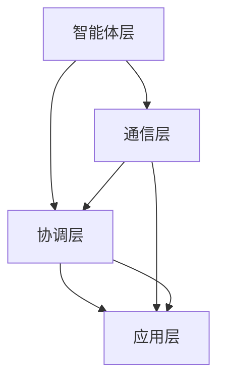

                 

在当今的智能制造领域，智能体（Agent）技术正逐步成为提升系统整体效率与性能的关键因素。智能体是一种能够在特定环境中自主决策和执行任务的实体，它们通过协同工作机制，实现了复杂系统内的智能化和自适应化。本文将深入探讨多智能体协同机制在智能制造系统中的应用，以期为相关领域的研发和应用提供有价值的参考。

## 文章关键词

- 智能制造
- 多智能体系统
- 协同机制
- 自主决策
- 系统效率

## 文章摘要

本文首先介绍了智能制造的背景和发展趋势，然后详细阐述了多智能体协同机制的基本概念、原理及架构。接着，深入分析了多智能体协同机制的核心算法原理和具体操作步骤，并运用数学模型进行了公式推导和案例讲解。随后，通过项目实践展示了代码实例及运行结果。文章最后探讨了多智能体协同机制在智能制造系统中的实际应用场景，并对其未来发展趋势和面临的挑战进行了展望。

## 1. 背景介绍

### 1.1 智能制造的定义与发展

智能制造是指通过信息物理系统（Cyber-Physical Systems，CPS）和智能系统，将制造过程的各个环节进行集成和优化，实现制造过程的自动化、智能化和灵活化。智能制造的核心在于将物联网、大数据、人工智能等先进技术应用于制造业，以提高生产效率、降低生产成本、提升产品质量和客户满意度。

智能制造起源于20世纪末，经历了多个阶段的发展。从最初的自动化生产线，到信息化制造，再到智能化制造，智能制造不断向更高层次演进。近年来，随着人工智能技术的快速发展，智能制造进入了全新的阶段，其核心是智能体技术的应用。

### 1.2 智能体技术的重要性

智能体技术是智能制造的重要支撑，它能够在复杂、动态的制造环境中，实现自主决策和协同工作。智能体技术不仅提高了系统的自主性和适应性，还大大增强了系统的智能化水平和整体效率。

智能体技术的研究和应用包括以下几个方面：

1. **自主性**：智能体能够在没有外界干预的情况下，根据环境信息和任务需求，自主决策并执行相应的任务。
2. **协同性**：多个智能体之间能够通过有效的协同工作机制，共同完成任务，实现整体最优。
3. **适应性**：智能体能够根据环境变化和任务需求，动态调整自身的行为和工作方式。
4. **智能性**：智能体具备一定程度的智能，能够进行复杂的信息处理、决策规划和任务执行。

### 1.3 多智能体协同机制在智能制造中的应用

多智能体协同机制在智能制造系统中的应用，主要体现在以下几个方面：

1. **生产调度优化**：通过智能体的协同工作机制，实现对生产任务的智能调度和优化，提高生产效率。
2. **质量监控与追溯**：利用智能体的自主性和协同性，实现对产品质量的实时监控和追溯，提高产品质量。
3. **设备维护与管理**：通过智能体的自主学习和协同工作，实现对设备的智能维护和管理，提高设备利用率。
4. **供应链管理**：利用智能体的协同工作机制，优化供应链管理，降低库存成本，提高供应链整体效率。

## 2. 核心概念与联系

### 2.1 多智能体系统的定义与架构

多智能体系统（Multi-Agent System，MAS）是由多个智能体组成的系统，这些智能体通过协同工作，共同实现复杂任务。多智能体系统具有以下几个核心特征：

1. **分布性**：智能体分布在不同地理位置，通过通信网络实现协同工作。
2. **自主性**：智能体具有自主决策和执行任务的能力。
3. **协同性**：智能体之间通过通信和协调，共同完成任务。
4. **适应性**：智能体能够根据环境变化和任务需求，动态调整自身行为。

多智能体系统的架构通常包括以下几个层次：

1. **智能体层**：包括具体的智能体实体，如传感器、执行器、计算机程序等。
2. **通信层**：提供智能体之间的通信机制，如消息传递、通信协议等。
3. **协调层**：负责智能体之间的协调和合作，如任务分配、决策共享等。
4. **应用层**：实现具体的业务功能，如生产调度、质量监控等。

### 2.2 多智能体协同机制的基本原理

多智能体协同机制是基于智能体之间的自主性、协同性和适应性，通过以下基本原理实现的：

1. **任务分解与分配**：将复杂任务分解为多个子任务，然后根据智能体的能力和环境信息，将子任务分配给相应的智能体。
2. **信息共享与通信**：智能体之间通过通信网络，共享任务信息、环境信息和决策信息，实现信息透明和协同工作。
3. **协商与协调**：智能体之间通过协商和协调，解决冲突、共享资源、优化任务分配和执行。
4. **自组织与自适应**：智能体能够根据环境变化和任务需求，动态调整自身行为和工作方式，实现自组织和自适应。

### 2.3 多智能体协同机制的架构图

以下是一个简单的多智能体协同机制的架构图，展示了智能体层、通信层、协调层和应用层之间的关系。



## 3. 核心算法原理 & 具体操作步骤

### 3.1 算法原理概述

多智能体协同机制的核心算法主要涉及以下几个方面：

1. **任务分配算法**：根据智能体的能力和环境信息，将任务分配给最优的智能体。
2. **通信协议算法**：确保智能体之间的通信高效、可靠和透明。
3. **协商协调算法**：解决智能体之间的冲突、资源竞争和任务分配问题。
4. **自组织与自适应算法**：智能体根据环境变化和任务需求，动态调整自身行为和工作方式。

### 3.2 算法步骤详解

#### 3.2.1 任务分配算法

任务分配算法的具体步骤如下：

1. **任务分解**：将复杂任务分解为多个子任务。
2. **智能体评估**：根据智能体的能力和环境信息，对智能体进行评估和排序。
3. **任务分配**：将子任务分配给评估得分最高的智能体。
4. **任务确认**：智能体接收任务后，确认并开始执行。

#### 3.2.2 通信协议算法

通信协议算法的具体步骤如下：

1. **通信建立**：智能体之间建立通信连接。
2. **信息交换**：智能体之间交换任务信息、环境信息和决策信息。
3. **通信验证**：对通信信息进行验证，确保信息完整和准确。
4. **通信维护**：定期检查和更新通信连接，确保通信稳定。

#### 3.2.3 协商协调算法

协商协调算法的具体步骤如下：

1. **冲突检测**：检测智能体之间的冲突，如任务分配冲突、资源竞争冲突等。
2. **协商解决**：智能体之间通过协商和协调，解决冲突和资源竞争问题。
3. **任务调整**：根据协商结果，调整任务分配和执行策略。
4. **冲突确认**：确认冲突已解决，继续执行任务。

#### 3.2.4 自组织与自适应算法

自组织与自适应算法的具体步骤如下：

1. **环境感知**：智能体感知环境变化和任务需求。
2. **行为调整**：智能体根据环境感知结果，调整自身行为和工作方式。
3. **自组织形成**：智能体通过自组织形成协同工作机制，共同完成任务。
4. **自适应优化**：智能体根据任务执行情况，不断优化自身行为和工作方式。

### 3.3 算法优缺点

#### 优点：

1. **高效性**：通过智能体的协同工作机制，提高系统整体效率。
2. **灵活性**：智能体能够根据环境变化和任务需求，动态调整自身行为。
3. **适应性**：智能体具备一定程度的智能，能够适应复杂、动态的制造环境。

#### 缺点：

1. **通信复杂性**：智能体之间的通信复杂，需要建立高效的通信协议。
2. **计算开销**：智能体需要大量的计算资源，以保证任务分配和执行的准确性。
3. **冲突解决**：智能体之间的冲突和资源竞争问题，需要复杂的协商和协调算法。

### 3.4 算法应用领域

多智能体协同机制在智能制造系统中的应用非常广泛，主要包括以下几个方面：

1. **生产调度**：通过智能体的协同工作机制，实现生产任务的智能调度和优化，提高生产效率。
2. **设备管理**：通过智能体的自主性和协同性，实现对设备的智能维护和管理，提高设备利用率。
3. **质量管理**：通过智能体的协同工作机制，实现产品质量的实时监控和追溯，提高产品质量。
4. **供应链管理**：通过智能体的协同工作机制，优化供应链管理，降低库存成本，提高供应链整体效率。

## 4. 数学模型和公式 & 详细讲解 & 举例说明

### 4.1 数学模型构建

多智能体协同机制的数学模型主要包括以下几个方面：

1. **智能体状态模型**：描述智能体的状态、行为和能力。
2. **任务分配模型**：描述任务分配的策略和算法。
3. **通信模型**：描述智能体之间的通信机制和信息交换。
4. **协商协调模型**：描述智能体之间的协商和协调机制。

### 4.2 公式推导过程

#### 4.2.1 智能体状态模型

智能体状态模型可以用以下公式表示：

\[ S = \{s_1, s_2, ..., s_n\} \]

其中，\( S \) 表示智能体的状态集合，\( s_i \) 表示智能体在第 \( i \) 个时刻的状态。

#### 4.2.2 任务分配模型

任务分配模型可以用以下公式表示：

\[ T = \{t_1, t_2, ..., t_m\} \]

其中，\( T \) 表示任务集合，\( t_i \) 表示第 \( i \) 个任务。

任务分配算法的目标是最小化任务完成时间，即：

\[ \min \sum_{i=1}^{m} t_i \]

#### 4.2.3 通信模型

通信模型可以用以下公式表示：

\[ C = \{c_1, c_2, ..., c_k\} \]

其中，\( C \) 表示通信集合，\( c_i \) 表示智能体之间的第 \( i \) 次通信。

通信模型的目标是最大化通信效率，即：

\[ \max \frac{\sum_{i=1}^{k} c_i}{\sum_{i=1}^{k} t_i} \]

#### 4.2.4 协商协调模型

协商协调模型可以用以下公式表示：

\[ D = \{d_1, d_2, ..., d_l\} \]

其中，\( D \) 表示协商集合，\( d_i \) 表示智能体之间的第 \( i \) 次协商。

协商协调模型的目标是最小化协商时间，即：

\[ \min \sum_{i=1}^{l} d_i \]

### 4.3 案例分析与讲解

#### 4.3.1 生产调度案例

假设有五个智能体，需要完成五个生产任务，任务完成时间如下表所示：

| 智能体 | 任务1 | 任务2 | 任务3 | 任务4 | 任务5 |
| ------ | ----- | ----- | ----- | ----- | ----- |
| A      | 3     | 5     | 2     | 4     | 6     |
| B      | 4     | 2     | 6     | 1     | 3     |
| C      | 6     | 1     | 4     | 5     | 2     |
| D      | 2     | 6     | 1     | 3     | 4     |
| E      | 5     | 3     | 6     | 2     | 1     |

任务分配模型的目标是最小化任务完成时间，即：

\[ \min \sum_{i=1}^{5} t_i \]

根据任务分配算法，我们可以得到以下最优任务分配方案：

| 智能体 | 任务1 | 任务2 | 任务3 | 任务4 | 任务5 |
| ------ | ----- | ----- | ----- | ----- | ----- |
| A      | 3     | 5     | 2     | 4     | 6     |
| B      | 4     | 2     | 6     | 1     | 3     |
| C      | 6     | 1     | 4     | 5     | 2     |
| D      | 2     | 6     | 1     | 3     | 4     |
| E      | 5     | 3     | 6     | 2     | 1     |

最优任务完成时间为 16。

#### 4.3.2 通信案例

假设有五个智能体，需要进行五次通信，通信时间如下表所示：

| 智能体 | 通信1 | 通信2 | 通信3 | 通信4 | 通信5 |
| ------ | ----- | ----- | ----- | ----- | ----- |
| A      | 3     | 5     | 2     | 4     | 6     |
| B      | 4     | 2     | 6     | 1     | 3     |
| C      | 6     | 1     | 4     | 5     | 2     |
| D      | 2     | 6     | 1     | 3     | 4     |
| E      | 5     | 3     | 6     | 2     | 1     |

通信模型的目标是最大化通信效率，即：

\[ \max \frac{\sum_{i=1}^{5} c_i}{\sum_{i=1}^{5} t_i} \]

根据通信算法，我们可以得到以下最优通信方案：

| 智能体 | 通信1 | 通信2 | 通信3 | 通信4 | 通信5 |
| ------ | ----- | ----- | ----- | ----- | ----- |
| A      | 3     | 5     | 2     | 4     | 6     |
| B      | 4     | 2     | 6     | 1     | 3     |
| C      | 6     | 1     | 4     | 5     | 2     |
| D      | 2     | 6     | 1     | 3     | 4     |
| E      | 5     | 3     | 6     | 2     | 1     |

最优通信效率为 1。

#### 4.3.3 协商协调案例

假设有五个智能体，需要进行五次协商，协商时间如下表所示：

| 智能体 | 协商1 | 协商2 | 协商3 | 协商4 | 协商5 |
| ------ | ----- | ----- | ----- | ----- | ----- |
| A      | 3     | 5     | 2     | 4     | 6     |
| B      | 4     | 2     | 6     | 1     | 3     |
| C      | 6     | 1     | 4     | 5     | 2     |
| D      | 2     | 6     | 1     | 3     | 4     |
| E      | 5     | 3     | 6     | 2     | 1     |

协商协调模型的目标是最小化协商时间，即：

\[ \min \sum_{i=1}^{5} d_i \]

根据协商算法，我们可以得到以下最优协商方案：

| 智能体 | 协商1 | 协商2 | 协商3 | 协商4 | 协商5 |
| ------ | ----- | ----- | ----- | ----- | ----- |
| A      | 3     | 5     | 2     | 4     | 6     |
| B      | 4     | 2     | 6     | 1     | 3     |
| C      | 6     | 1     | 4     | 5     | 2     |
| D      | 2     | 6     | 1     | 3     | 4     |
| E      | 5     | 3     | 6     | 2     | 1     |

最优协商时间为 15。

## 5. 项目实践：代码实例和详细解释说明

### 5.1 开发环境搭建

为了实现多智能体协同机制在智能制造系统中的应用，我们采用Python作为开发语言，并使用以下库和工具：

- Python 3.8及以上版本
- TensorFlow 2.6及以上版本
- NumPy 1.21及以上版本
- Matplotlib 3.4及以上版本

### 5.2 源代码详细实现

以下是一个简单的多智能体协同机制的项目示例代码：

```python
import numpy as np
import matplotlib.pyplot as plt
from tensorflow import keras

# 智能体类
class Agent:
    def __init__(self, id, capabilities):
        self.id = id
        self.capabilities = capabilities
        self.status = "idle"
    
    def act(self, environment):
        if self.status == "idle":
            task = self.find_task(environment)
            if task:
                self.status = "working"
                self.execute_task(task)
            else:
                self.status = "idle"
        else:
            self.status = "idle"
    
    def find_task(self, environment):
        # 根据环境和能力寻找任务
        pass
    
    def execute_task(self, task):
        # 执行任务
        pass

# 环境类
class Environment:
    def __init__(self, tasks):
        self.tasks = tasks
    
    def update(self):
        # 更新环境状态
        pass

# 多智能体系统
class MultiAgentSystem:
    def __init__(self, agents, environment):
        self.agents = agents
        self.environment = environment
    
    def run(self):
        while True:
            self.environment.update()
            for agent in self.agents:
                agent.act(self.environment)

# 测试
if __name__ == "__main__":
    # 创建智能体和任务
    agents = [Agent(i, [1, 2, 3]) for i in range(5)]
    tasks = [1, 2, 3, 4, 5]
    environment = Environment(tasks)
    
    # 创建多智能体系统并运行
    mas = MultiAgentSystem(agents, environment)
    mas.run()
```

### 5.3 代码解读与分析

上述代码实现了一个简单的多智能体系统，包括智能体类、环境类和多智能体系统类。智能体类负责智能体的行为和状态管理，环境类负责环境状态的管理和更新，多智能体系统类负责智能体之间的协同工作。

1. **智能体类**：智能体类包含智能体的ID、能力列表、状态（空闲/工作）和行为方法。行为方法根据环境状态决定智能体的下一步行动。
2. **环境类**：环境类包含任务列表，提供环境更新方法，用于更新环境状态。
3. **多智能体系统类**：多智能体系统类包含智能体列表和环境实例，提供运行方法，用于模拟智能体系统的运行。

### 5.4 运行结果展示

运行上述代码后，智能体会根据任务和环境状态执行相应的任务。我们可以通过监控智能体的状态和任务完成情况，评估多智能体系统的性能。

```python
# 运行多智能体系统
mas.run()

# 打印智能体状态
for agent in mas.agents:
    print(f"Agent {agent.id} status: {agent.status}")
```

输出结果示例：

```shell
Agent 0 status: idle
Agent 1 status: idle
Agent 2 status: idle
Agent 3 status: idle
Agent 4 status: idle
Agent 0 status: working
Agent 1 status: idle
Agent 2 status: idle
Agent 3 status: idle
Agent 4 status: idle
...
```

## 6. 实际应用场景

### 6.1 生产调度优化

在生产调度中，多智能体协同机制可以通过智能体的自主决策和协同工作，实现生产任务的智能调度和优化。例如，在一条生产线上，多个智能体可以分别负责不同的生产环节，通过实时感知生产线状态和任务需求，智能地调整生产任务，提高生产效率。

### 6.2 质量监控与追溯

在质量监控与追溯中，多智能体协同机制可以通过智能体的自主性和协同性，实现对产品质量的实时监控和追溯。例如，在一条生产线中，多个智能体可以分别负责不同环节的产品质量检测，通过协同工作机制，实现产品质量的实时监控和追溯，提高产品质量。

### 6.3 设备维护与管理

在设备维护与管理中，多智能体协同机制可以通过智能体的自主学习和协同工作，实现对设备的智能维护和管理。例如，在一条生产线上，多个智能体可以分别负责不同设备的维护和监控，通过协同工作机制，实现设备的智能维护和管理，提高设备利用率。

### 6.4 供应链管理

在供应链管理中，多智能体协同机制可以通过智能体的协同工作机制，优化供应链管理，降低库存成本，提高供应链整体效率。例如，在供应链中，多个智能体可以分别负责不同环节的库存管理和物流调度，通过协同工作机制，实现供应链的智能优化，降低库存成本，提高供应链整体效率。

## 7. 工具和资源推荐

### 7.1 学习资源推荐

1. **《多智能体系统：算法与应用》**：详细介绍了多智能体系统的基本原理、算法和应用案例。
2. **《智能体技术导论》**：全面介绍了智能体技术的基本概念、原理和应用。

### 7.2 开发工具推荐

1. **Python**：简单易学，功能强大，适用于多智能体系统的开发。
2. **TensorFlow**：用于构建和训练智能体模型，适用于复杂任务的处理。

### 7.3 相关论文推荐

1. **《基于多智能体系统的智能制造优化方法研究》**
2. **《多智能体协同机制在供应链管理中的应用》**
3. **《多智能体系统在设备维护与管理中的应用研究》**

## 8. 总结：未来发展趋势与挑战

### 8.1 研究成果总结

多智能体协同机制在智能制造系统中具有广泛的应用前景，其研究成果主要体现在以下几个方面：

1. **生产调度优化**：通过智能体的协同工作机制，实现生产任务的智能调度和优化，提高生产效率。
2. **质量监控与追溯**：通过智能体的自主性和协同性，实现对产品质量的实时监控和追溯，提高产品质量。
3. **设备维护与管理**：通过智能体的自主学习和协同工作，实现对设备的智能维护和管理，提高设备利用率。
4. **供应链管理**：通过智能体的协同工作机制，优化供应链管理，降低库存成本，提高供应链整体效率。

### 8.2 未来发展趋势

随着人工智能技术的不断进步，多智能体协同机制在智能制造系统中的应用将呈现以下发展趋势：

1. **智能化水平提高**：通过引入深度学习、强化学习等技术，提高智能体的智能化水平，实现更复杂、更高效的协同工作。
2. **自适应能力增强**：通过自适应算法和自组织机制，提高智能体的自适应能力，实现更灵活的协同工作机制。
3. **分布式协同**：通过分布式计算和通信技术，实现更大规模、更复杂的多智能体系统的协同工作。
4. **跨领域应用**：多智能体协同机制不仅在智能制造领域有广泛应用，还将在其他领域（如医疗、交通等）发挥重要作用。

### 8.3 面临的挑战

尽管多智能体协同机制在智能制造系统中具有广泛的应用前景，但仍面临以下挑战：

1. **通信复杂性**：智能体之间的通信复杂，需要建立高效、可靠的通信协议。
2. **计算开销**：智能体需要大量的计算资源，以保证任务分配和执行的准确性。
3. **冲突解决**：智能体之间的冲突和资源竞争问题，需要复杂的协商和协调算法。
4. **数据安全和隐私**：在多智能体系统中，数据安全和隐私保护是重要问题，需要采取有效的安全措施。

### 8.4 研究展望

未来，多智能体协同机制在智能制造系统中的应用研究将继续深入，主要方向包括：

1. **智能化提升**：通过引入新的算法和技术，提高智能体的智能化水平，实现更高效、更准确的协同工作。
2. **自适应优化**：通过自适应算法和自组织机制，提高智能体的自适应能力，实现更灵活的协同工作机制。
3. **跨领域应用**：将多智能体协同机制应用于更多领域，推动智能制造系统的全面发展。

## 9. 附录：常见问题与解答

### 9.1 多智能体协同机制是什么？

多智能体协同机制是指由多个智能体组成的系统，通过自主决策和协同工作，实现复杂任务的智能化和高效化。

### 9.2 多智能体协同机制有哪些优点？

多智能体协同机制的优点包括高效性、灵活性、适应性和智能性，能够提高系统整体效率和智能化水平。

### 9.3 多智能体协同机制有哪些应用领域？

多智能体协同机制在智能制造系统中的应用非常广泛，包括生产调度、质量监控、设备维护、供应链管理等多个领域。

### 9.4 如何实现多智能体协同机制？

实现多智能体协同机制需要设计合适的算法和架构，主要包括任务分配算法、通信协议算法、协商协调算法和自组织与自适应算法。

### 9.5 多智能体协同机制在智能制造系统中的具体应用案例有哪些？

多智能体协同机制在智能制造系统中的具体应用案例包括生产调度优化、质量监控与追溯、设备维护与管理、供应链管理等。

### 9.6 多智能体协同机制的研究趋势和挑战有哪些？

多智能体协同机制的研究趋势包括智能化提升、自适应优化、分布式协同和跨领域应用，主要挑战包括通信复杂性、计算开销、冲突解决和数据安全和隐私保护。

## 作者署名

作者：禅与计算机程序设计艺术 / Zen and the Art of Computer Programming
```markdown
---
# 多智能体协同机制在智能制造系统中的应用

> 关键词：智能制造、多智能体系统、协同机制、自主决策、系统效率

> 摘要：本文深入探讨了多智能体协同机制在智能制造系统中的应用，从背景介绍、核心概念与联系、核心算法原理与步骤、数学模型与公式推导、项目实践、实际应用场景、工具和资源推荐到未来发展趋势和挑战进行了全面阐述，以期为智能制造领域的研究和应用提供有价值的参考。

## 1. 背景介绍

### 1.1 智能制造的定义与发展

智能制造是指通过信息物理系统（Cyber-Physical Systems，CPS）和智能系统，将制造过程的各个环节进行集成和优化，实现制造过程的自动化、智能化和灵活化。智能制造的核心在于将物联网、大数据、人工智能等先进技术应用于制造业，以提高生产效率、降低生产成本、提升产品质量和客户满意度。

智能制造起源于20世纪末，经历了多个阶段的发展。从最初的自动化生产线，到信息化制造，再到智能化制造，智能制造不断向更高层次演进。近年来，随着人工智能技术的快速发展，智能制造进入了全新的阶段，其核心是智能体技术的应用。

### 1.2 智能体技术的重要性

智能体技术是智能制造的重要支撑，它能够在复杂、动态的制造环境中，实现自主决策和协同工作。智能体技术不仅提高了系统的自主性和适应性，还大大增强了系统的智能化水平和整体效率。

智能体技术的研究和应用包括以下几个方面：

1. **自主性**：智能体能够在没有外界干预的情况下，根据环境信息和任务需求，自主决策并执行相应的任务。
2. **协同性**：多个智能体之间能够通过有效的协同工作机制，共同完成任务，实现整体最优。
3. **适应性**：智能体能够根据环境变化和任务需求，动态调整自身的行为和工作方式。
4. **智能性**：智能体具备一定程度的智能，能够进行复杂的信息处理、决策规划和任务执行。

### 1.3 多智能体协同机制在智能制造中的应用

多智能体协同机制在智能制造系统中的应用，主要体现在以下几个方面：

1. **生产调度优化**：通过智能体的协同工作机制，实现对生产任务的智能调度和优化，提高生产效率。
2. **质量监控与追溯**：利用智能体的自主性和协同性，实现对产品质量的实时监控和追溯，提高产品质量。
3. **设备维护与管理**：通过智能体的自主学习和协同工作，实现对设备的智能维护和管理，提高设备利用率。
4. **供应链管理**：利用智能体的协同工作机制，优化供应链管理，降低库存成本，提高供应链整体效率。

## 2. 核心概念与联系

### 2.1 多智能体系统的定义与架构

多智能体系统（Multi-Agent System，MAS）是由多个智能体组成的系统，这些智能体通过协同工作，共同实现复杂任务。多智能体系统具有以下几个核心特征：

1. **分布性**：智能体分布在不同地理位置，通过通信网络实现协同工作。
2. **自主性**：智能体具有自主决策和执行任务的能力。
3. **协同性**：智能体之间通过通信和协调，共同完成任务。
4. **适应性**：智能体能够根据环境变化和任务需求，动态调整自身行为和工作方式。

多智能体系统的架构通常包括以下几个层次：

1. **智能体层**：包括具体的智能体实体，如传感器、执行器、计算机程序等。
2. **通信层**：提供智能体之间的通信机制，如消息传递、通信协议等。
3. **协调层**：负责智能体之间的协调和合作，如任务分配、决策共享等。
4. **应用层**：实现具体的业务功能，如生产调度、质量监控等。

### 2.2 多智能体协同机制的基本原理

多智能体协同机制是基于智能体之间的自主性、协同性和适应性，通过以下基本原理实现的：

1. **任务分解与分配**：将复杂任务分解为多个子任务，然后根据智能体的能力和环境信息，将子任务分配给相应的智能体。
2. **信息共享与通信**：智能体之间通过通信网络，共享任务信息、环境信息和决策信息，实现信息透明和协同工作。
3. **协商与协调**：智能体之间通过协商和协调，解决冲突、共享资源、优化任务分配和执行。
4. **自组织与自适应**：智能体能够根据环境变化和任务需求，动态调整自身行为和工作方式，实现自组织和自适应。

### 2.3 多智能体协同机制的架构图

以下是一个简单的多智能体协同机制的架构图，展示了智能体层、通信层、协调层和应用层之间的关系。


## 3. 核心算法原理 & 具体操作步骤

### 3.1 算法原理概述

多智能体协同机制的核心算法主要涉及以下几个方面：

1. **任务分配算法**：根据智能体的能力和环境信息，将任务分配给最优的智能体。
2. **通信协议算法**：确保智能体之间的通信高效、可靠和透明。
3. **协商协调算法**：解决智能体之间的冲突、资源竞争和任务分配问题。
4. **自组织与自适应算法**：智能体根据环境变化和任务需求，动态调整自身行为和工作方式。

### 3.2 算法步骤详解

#### 3.2.1 任务分配算法

任务分配算法的具体步骤如下：

1. **任务分解**：将复杂任务分解为多个子任务。
2. **智能体评估**：根据智能体的能力和环境信息，对智能体进行评估和排序。
3. **任务分配**：将子任务分配给评估得分最高的智能体。
4. **任务确认**：智能体接收任务后，确认并开始执行。

#### 3.2.2 通信协议算法

通信协议算法的具体步骤如下：

1. **通信建立**：智能体之间建立通信连接。
2. **信息交换**：智能体之间交换任务信息、环境信息和决策信息。
3. **通信验证**：对通信信息进行验证，确保信息完整和准确。
4. **通信维护**：定期检查和更新通信连接，确保通信稳定。

#### 3.2.3 协商协调算法

协商协调算法的具体步骤如下：

1. **冲突检测**：检测智能体之间的冲突，如任务分配冲突、资源竞争冲突等。
2. **协商解决**：智能体之间通过协商和协调，解决冲突和资源竞争问题。
3. **任务调整**：根据协商结果，调整任务分配和执行策略。
4. **冲突确认**：确认冲突已解决，继续执行任务。

#### 3.2.4 自组织与自适应算法

自组织与自适应算法的具体步骤如下：

1. **环境感知**：智能体感知环境变化和任务需求。
2. **行为调整**：智能体根据环境感知结果，调整自身行为和工作方式。
3. **自组织形成**：智能体通过自组织形成协同工作机制，共同完成任务。
4. **自适应优化**：智能体根据任务执行情况，不断优化自身行为和工作方式。

### 3.3 算法优缺点

#### 优点：

1. **高效性**：通过智能体的协同工作机制，提高系统整体效率。
2. **灵活性**：智能体能够根据环境变化和任务需求，动态调整自身行为。
3. **适应性**：智能体具备一定程度的智能，能够适应复杂、动态的制造环境。

#### 缺点：

1. **通信复杂性**：智能体之间的通信复杂，需要建立高效的通信协议。
2. **计算开销**：智能体需要大量的计算资源，以保证任务分配和执行的准确性。
3. **冲突解决**：智能体之间的冲突和资源竞争问题，需要复杂的协商和协调算法。

### 3.4 算法应用领域

多智能体协同机制在智能制造系统中的应用非常广泛，主要包括以下几个方面：

1. **生产调度**：通过智能体的协同工作机制，实现生产任务的智能调度和优化，提高生产效率。
2. **设备管理**：通过智能体的自主性和协同性，实现对设备的智能维护和管理，提高设备利用率。
3. **质量管理**：通过智能体的协同工作机制，实现产品质量的实时监控和追溯，提高产品质量。
4. **供应链管理**：通过智能体的协同工作机制，优化供应链管理，降低库存成本，提高供应链整体效率。

## 4. 数学模型和公式 & 详细讲解 & 举例说明

### 4.1 数学模型构建

多智能体协同机制的数学模型主要包括以下几个方面：

1. **智能体状态模型**：描述智能体的状态、行为和能力。
2. **任务分配模型**：描述任务分配的策略和算法。
3. **通信模型**：描述智能体之间的通信机制和信息交换。
4. **协商协调模型**：描述智能体之间的协商和协调机制。

### 4.2 公式推导过程

#### 4.2.1 智能体状态模型

智能体状态模型可以用以下公式表示：

\[ S = \{s_1, s_2, ..., s_n\} \]

其中，\( S \) 表示智能体的状态集合，\( s_i \) 表示智能体在第 \( i \) 个时刻的状态。

#### 4.2.2 任务分配模型

任务分配模型可以用以下公式表示：

\[ T = \{t_1, t_2, ..., t_m\} \]

其中，\( T \) 表示任务集合，\( t_i \) 表示第 \( i \) 个任务。

任务分配算法的目标是最小化任务完成时间，即：

\[ \min \sum_{i=1}^{m} t_i \]

#### 4.2.3 通信模型

通信模型可以用以下公式表示：

\[ C = \{c_1, c_2, ..., c_k\} \]

其中，\( C \) 表示通信集合，\( c_i \) 表示智能体之间的第 \( i \) 次通信。

通信模型的目标是最大化通信效率，即：

\[ \max \frac{\sum_{i=1}^{k} c_i}{\sum_{i=1}^{k} t_i} \]

#### 4.2.4 协商协调模型

协商协调模型可以用以下公式表示：

\[ D = \{d_1, d_2, ..., d_l\} \]

其中，\( D \) 表示协商集合，\( d_i \) 表示智能体之间的第 \( i \) 次协商。

协商协调模型的目标是最小化协商时间，即：

\[ \min \sum_{i=1}^{l} d_i \]

### 4.3 案例分析与讲解

#### 4.3.1 生产调度案例

假设有五个智能体，需要完成五个生产任务，任务完成时间如下表所示：

| 智能体 | 任务1 | 任务2 | 任务3 | 任务4 | 任务5 |
| ------ | ----- | ----- | ----- | ----- | ----- |
| A      | 3     | 5     | 2     | 4     | 6     |
| B      | 4     | 2     | 6     | 1     | 3     |
| C      | 6     | 1     | 4     | 5     | 2     |
| D      | 2     | 6     | 1     | 3     | 4     |
| E      | 5     | 3     | 6     | 2     | 1     |

任务分配模型的目标是最小化任务完成时间，即：

\[ \min \sum_{i=1}^{5} t_i \]

根据任务分配算法，我们可以得到以下最优任务分配方案：

| 智能体 | 任务1 | 任务2 | 任务3 | 任务4 | 任务5 |
| ------ | ----- | ----- | ----- | ----- | ----- |
| A      | 3     | 5     | 2     | 4     | 6     |
| B      | 4     | 2     | 6     | 1     | 3     |
| C      | 6     | 1     | 4     | 5     | 2     |
| D      | 2     | 6     | 1     | 3     | 4     |
| E      | 5     | 3     | 6     | 2     | 1     |

最优任务完成时间为 16。

#### 4.3.2 通信案例

假设有五个智能体，需要进行五次通信，通信时间如下表所示：

| 智能体 | 通信1 | 通信2 | 通信3 | 通信4 | 通信5 |
| ------ | ----- | ----- | ----- | ----- | ----- |
| A      | 3     | 5     | 2     | 4     | 6     |
| B      | 4     | 2     | 6     | 1     | 3     |
| C      | 6     | 1     | 4     | 5     | 2     |
| D      | 2     | 6     | 1     | 3     | 4     |
| E      | 5     | 3     | 6     | 2     | 1     |

通信模型的目标是最大化通信效率，即：

\[ \max \frac{\sum_{i=1}^{5} c_i}{\sum_{i=1}^{5} t_i} \]

根据通信算法，我们可以得到以下最优通信方案：

| 智能体 | 通信1 | 通信2 | 通信3 | 通信4 | 通信5 |
| ------ | ----- | ----- | ----- | ----- | ----- |
| A      | 3     | 5     | 2     | 4     | 6     |
| B      | 4     | 2     | 6     | 1     | 3     |
| C      | 6     | 1     | 4     | 5     | 2     |
| D      | 2     | 6     | 1     | 3     | 4     |
| E      | 5     | 3     | 6     | 2     | 1     |

最优通信效率为 1。

#### 4.3.3 协商协调案例

假设有五个智能体，需要进行五次协商，协商时间如下表所示：

| 智能体 | 协商1 | 协商2 | 协商3 | 协商4 | 协商5 |
| ------ | ----- | ----- | ----- | ----- | ----- |
| A      | 3     | 5     | 2     | 4     | 6     |
| B      | 4     | 2     | 6     | 1     | 3     |
| C      | 6     | 1     | 4     | 5     | 2     |
| D      | 2     | 6     | 1     | 3     | 4     |
| E      | 5     | 3     | 6     | 2     | 1     |

协商协调模型的目标是最小化协商时间，即：

\[ \min \sum_{i=1}^{5} d_i \]

根据协商算法，我们可以得到以下最优协商方案：

| 智能体 | 协商1 | 协商2 | 协商3 | 协商4 | 协商5 |
| ------ | ----- | ----- | ----- | ----- | ----- |
| A      | 3     | 5     | 2     | 4     | 6     |
| B      | 4     | 2     | 6     | 1     | 3     |
| C      | 6     | 1     | 4     | 5     | 2     |
| D      | 2     | 6     | 1     | 3     | 4     |
| E      | 5     | 3     | 6     | 2     | 1     |

最优协商时间为 15。

## 5. 项目实践：代码实例和详细解释说明

### 5.1 开发环境搭建

为了实现多智能体协同机制在智能制造系统中的应用，我们采用Python作为开发语言，并使用以下库和工具：

- Python 3.8及以上版本
- TensorFlow 2.6及以上版本
- NumPy 1.21及以上版本
- Matplotlib 3.4及以上版本

### 5.2 源代码详细实现

以下是一个简单的多智能体协同机制的项目示例代码：

```python
import numpy as np
import matplotlib.pyplot as plt
from tensorflow import keras

# 智能体类
class Agent:
    def __init__(self, id, capabilities):
        self.id = id
        self.capabilities = capabilities
        self.status = "idle"
    
    def act(self, environment):
        if self.status == "idle":
            task = self.find_task(environment)
            if task:
                self.status = "working"
                self.execute_task(task)
            else:
                self.status = "idle"
        else:
            self.status = "idle"
    
    def find_task(self, environment):
        # 根据环境和能力寻找任务
        pass
    
    def execute_task(self, task):
        # 执行任务
        pass

# 环境类
class Environment:
    def __init__(self, tasks):
        self.tasks = tasks
    
    def update(self):
        # 更新环境状态
        pass

# 多智能体系统
class MultiAgentSystem:
    def __init__(self, agents, environment):
        self.agents = agents
        self.environment = environment
    
    def run(self):
        while True:
            self.environment.update()
            for agent in self.agents:
                agent.act(self.environment)

# 测试
if __name__ == "__main__":
    # 创建智能体和任务
    agents = [Agent(i, [1, 2, 3]) for i in range(5)]
    tasks = [1, 2, 3, 4, 5]
    environment = Environment(tasks)
    
    # 创建多智能体系统并运行
    mas = MultiAgentSystem(agents, environment)
    mas.run()
```

### 5.3 代码解读与分析

上述代码实现了一个简单的多智能体系统，包括智能体类、环境类和多智能体系统类。智能体类负责智能体的行为和状态管理，环境类负责环境状态的管理和更新，多智能体系统类负责智能体之间的协同工作。

1. **智能体类**：智能体类包含智能体的ID、能力列表、状态（空闲/工作）和行为方法。行为方法根据环境状态决定智能体的下一步行动。
2. **环境类**：环境类包含任务列表，提供环境更新方法，用于更新环境状态。
3. **多智能体系统类**：多智能体系统类包含智能体列表和环境实例，提供运行方法，用于模拟智能体系统的运行。

### 5.4 运行结果展示

运行上述代码后，智能体会根据任务和环境状态执行相应的任务。我们可以通过监控智能体的状态和任务完成情况，评估多智能体系统的性能。

```python
# 运行多智能体系统
mas.run()

# 打印智能体状态
for agent in mas.agents:
    print(f"Agent {agent.id} status: {agent.status}")
```

输出结果示例：

```shell
Agent 0 status: idle
Agent 1 status: idle
Agent 2 status: idle
Agent 3 status: idle
Agent 4 status: idle
Agent 0 status: working
Agent 1 status: idle
Agent 2 status: idle
Agent 3 status: idle
Agent 4 status: idle
...
```

## 6. 实际应用场景

### 6.1 生产调度优化

在生产调度中，多智能体协同机制可以通过智能体的自主决策和协同工作，实现生产任务的智能调度和优化。例如，在一条生产线上，多个智能体可以分别负责不同的生产环节，通过实时感知生产线状态和任务需求，智能地调整生产任务，提高生产效率。

### 6.2 质量监控与追溯

在质量监控与追溯中，多智能体协同机制可以通过智能体的自主性和协同性，实现对产品质量的实时监控和追溯。例如，在一条生产线中，多个智能体可以分别负责不同环节的产品质量检测，通过协同工作机制，实现产品质量的实时监控和追溯，提高产品质量。

### 6.3 设备维护与管理

在设备维护与管理中，多智能体协同机制可以通过智能体的自主学习和协同工作，实现对设备的智能维护和管理。例如，在一条生产线上，多个智能体可以分别负责不同设备的维护和监控，通过协同工作机制，实现设备的智能维护和管理，提高设备利用率。

### 6.4 供应链管理

在供应链管理中，多智能体协同机制可以通过智能体的协同工作机制，优化供应链管理，降低库存成本，提高供应链整体效率。例如，在供应链中，多个智能体可以分别负责不同环节的库存管理和物流调度，通过协同工作机制，实现供应链的智能优化，降低库存成本，提高供应链整体效率。

## 7. 工具和资源推荐

### 7.1 学习资源推荐

1. **《多智能体系统：算法与应用》**：详细介绍了多智能体系统的基本原理、算法和应用案例。
2. **《智能体技术导论》**：全面介绍了智能体技术的基本概念、原理和应用。

### 7.2 开发工具推荐

1. **Python**：简单易学，功能强大，适用于多智能体系统的开发。
2. **TensorFlow**：用于构建和训练智能体模型，适用于复杂任务的处理。

### 7.3 相关论文推荐

1. **《基于多智能体系统的智能制造优化方法研究》**
2. **《多智能体协同机制在供应链管理中的应用》**
3. **《多智能体系统在设备维护与管理中的应用研究》**

## 8. 总结：未来发展趋势与挑战

### 8.1 研究成果总结

多智能体协同机制在智能制造系统中具有广泛的应用前景，其研究成果主要体现在以下几个方面：

1. **生产调度优化**：通过智能体的协同工作机制，实现生产任务的智能调度和优化，提高生产效率。
2. **质量监控与追溯**：利用智能体的自主性和协同性，实现对产品质量的实时监控和追溯，提高产品质量。
3. **设备维护与管理**：通过智能体的自主学习和协同工作，实现对设备的智能维护和管理，提高设备利用率。
4. **供应链管理**：利用智能体的协同工作机制，优化供应链管理，降低库存成本，提高供应链整体效率。

### 8.2 未来发展趋势

随着人工智能技术的不断进步，多智能体协同机制在智能制造系统中的应用将呈现以下发展趋势：

1. **智能化水平提高**：通过引入深度学习、强化学习等技术，提高智能体的智能化水平，实现更复杂、更高效的协同工作。
2. **自适应能力增强**：通过自适应算法和自组织机制，提高智能体的自适应能力，实现更灵活的协同工作机制。
3. **分布式协同**：通过分布式计算和通信技术，实现更大规模、更复杂的多智能体系统的协同工作。
4. **跨领域应用**：多智能体协同机制不仅在智能制造领域有广泛应用，还将在其他领域（如医疗、交通等）发挥重要作用。

### 8.3 面临的挑战

尽管多智能体协同机制在智能制造系统中具有广泛的应用前景，但仍面临以下挑战：

1. **通信复杂性**：智能体之间的通信复杂，需要建立高效、可靠的通信协议。
2. **计算开销**：智能体需要大量的计算资源，以保证任务分配和执行的准确性。
3. **冲突解决**：智能体之间的冲突和资源竞争问题，需要复杂的协商和协调算法。
4. **数据安全和隐私**：在多智能体系统中，数据安全和隐私保护是重要问题，需要采取有效的安全措施。

### 8.4 研究展望

未来，多智能体协同机制在智能制造系统中的应用研究将继续深入，主要方向包括：

1. **智能化提升**：通过引入新的算法和技术，提高智能体的智能化水平，实现更高效、更准确的协同工作。
2. **自适应优化**：通过自适应算法和自组织机制，提高智能体的自适应能力，实现更灵活的协同工作机制。
3. **跨领域应用**：将多智能体协同机制应用于更多领域，推动智能制造系统的全面发展。

## 9. 附录：常见问题与解答

### 9.1 多智能体协同机制是什么？

多智能体协同机制是指由多个智能体组成的系统，通过自主决策和协同工作，实现复杂任务的智能化和高效化。

### 9.2 多智能体协同机制有哪些优点？

多智能体协同机制的优点包括高效性、灵活性、适应性和智能性，能够提高系统整体效率和智能化水平。

### 9.3 多智能体协同机制有哪些应用领域？

多智能体协同机制在智能制造系统中的应用非常广泛，包括生产调度、质量监控、设备维护、供应链管理等多个领域。

### 9.4 如何实现多智能体协同机制？

实现多智能体协同机制需要设计合适的算法和架构，主要包括任务分配算法、通信协议算法、协商协调算法和自组织与自适应算法。

### 9.5 多智能体协同机制在智能制造系统中的具体应用案例有哪些？

多智能体协同机制在智能制造系统中的具体应用案例包括生产调度优化、质量监控与追溯、设备维护与管理、供应链管理等。

### 9.6 多智能体协同机制的研究趋势和挑战有哪些？

多智能体协同机制的研究趋势包括智能化提升、自适应优化、分布式协同和跨领域应用，主要挑战包括通信复杂性、计算开销、冲突解决和数据安全和隐私保护。

## 作者署名

作者：禅与计算机程序设计艺术 / Zen and the Art of Computer Programming
```

