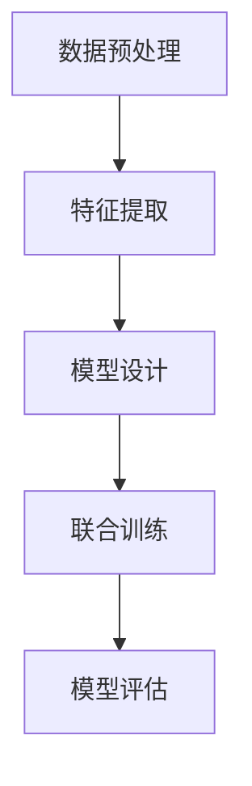

                 

关键词：多模态大模型、BERT模型、技术原理、实战、行业趋势

摘要：本文将深入探讨多模态大模型的技术原理与实践，特别关注BERT模型诞生后的行业发展趋势。通过解析核心概念、算法原理、数学模型和实际应用案例，本文旨在为读者提供全面的技术洞察和未来展望。

## 1. 背景介绍

多模态大模型是近年来人工智能领域的一个重要研究方向。随着数据多样性和应用需求的增加，单一的模态已无法满足复杂的任务需求。多模态大模型通过整合多种类型的数据（如文本、图像、音频等），使得模型能够更全面、准确地理解和处理信息。BERT模型的诞生，标志着自然语言处理领域的一个重大突破，也推动了多模态大模型的研究和应用。

### BERT模型的背景

BERT（Bidirectional Encoder Representations from Transformers）是由Google Research在2018年提出的一种预训练语言模型。与传统语言模型不同，BERT采用了双向编码器结构，能够同时考虑上下文信息，从而在多项NLP任务上取得了显著的性能提升。BERT的成功不仅改变了自然语言处理的研究方向，也为多模态大模型的研究提供了新的思路。

### 多模态大模型的发展

多模态大模型的研究始于对人类感知和理解过程的研究。人类通过视觉、听觉、触觉等多种感官获取信息，这些感官数据的整合使得人类能够更全面地理解世界。因此，研究者们开始尝试将多种感官数据整合到一个模型中，以模拟人类的感知过程。

### 当前行业趋势

随着深度学习和大数据技术的不断发展，多模态大模型在多个领域取得了显著的应用成果。特别是在图像识别、语音识别、视频处理和多媒体分析等领域，多模态大模型展现出了强大的潜力。行业趋势表明，多模态大模型的研究和应用将越来越受到重视。

## 2. 核心概念与联系

### 多模态大模型的概念

多模态大模型是指能够处理多种类型数据（如文本、图像、音频等）的深度学习模型。这些模型通常通过将不同类型的数据进行编码，然后整合到一个统一的表征空间中，从而实现多模态数据的联合理解和处理。

### 核心概念原理

多模态大模型的核心在于如何有效地整合多种类型的数据。这涉及到数据预处理、特征提取、模型设计等多个方面。下面将详细讨论这些核心概念。

### Mermaid流程图



### 数据预处理

数据预处理是多模态大模型研究的第一个关键步骤。不同类型的数据需要经过不同的预处理方法，如文本数据需要进行分词、去停用词等操作，图像数据需要进行归一化、裁剪等操作，音频数据需要进行去噪、分割等操作。通过预处理，可以保证不同类型的数据具有相似的特征表达。

### 特征提取

特征提取是将原始数据转换为适合模型处理的特征表示的过程。对于文本数据，常见的特征提取方法包括词袋模型、词嵌入等；对于图像数据，常见的特征提取方法包括卷积神经网络（CNN）等；对于音频数据，常见的特征提取方法包括梅尔频率倒谱系数（MFCC）等。通过特征提取，可以将不同类型的数据转换为统一的表征空间。

### 模型设计

模型设计是多模态大模型研究的第二个关键步骤。设计一个有效的多模态大模型需要考虑多个方面，如模型结构、损失函数、优化算法等。当前，主流的多模态大模型设计通常采用深度学习框架，如Transformers、CNNs、RNNs等。通过设计一个合适的模型，可以使得多模态大模型能够有效地整合多种类型的数据。

### 联合训练

联合训练是多模态大模型研究的第三个关键步骤。在联合训练过程中，不同类型的数据通过共享模型参数进行共同训练，从而实现多模态数据的联合理解和处理。联合训练的过程通常涉及到多任务学习、迁移学习等技术。

### 模型评估

模型评估是多模态大模型研究的第四个关键步骤。通过评估模型在不同数据集上的性能，可以判断模型的有效性和鲁棒性。常见的评估指标包括准确率、召回率、F1值等。

## 3. 核心算法原理 & 具体操作步骤

### 3.1 算法原理概述

多模态大模型的核心算法原理是基于深度学习的多任务学习和迁移学习。通过将不同类型的数据整合到一个统一的表征空间中，模型能够同时处理多种类型的数据，从而提高模型的泛化能力和性能。

### 3.2 算法步骤详解

多模态大模型的算法步骤可以分为以下几个步骤：

#### 步骤1：数据预处理

- 对文本数据进行分词、去停用词等操作。
- 对图像数据进行归一化、裁剪等操作。
- 对音频数据进行去噪、分割等操作。

#### 步骤2：特征提取

- 对文本数据使用词嵌入方法进行特征提取。
- 对图像数据使用卷积神经网络（CNN）进行特征提取。
- 对音频数据使用梅尔频率倒谱系数（MFCC）进行特征提取。

#### 步骤3：模型设计

- 设计一个能够同时处理多种类型数据的深度学习模型，如Transformers、CNNs、RNNs等。
- 设计一个合适的损失函数，以同时优化多种任务。

#### 步骤4：联合训练

- 通过共享模型参数，将不同类型的数据共同训练。
- 使用多任务学习、迁移学习等技术，提高模型的泛化能力。

#### 步骤5：模型评估

- 在训练集和验证集上评估模型的性能。
- 使用准确率、召回率、F1值等指标进行评估。

### 3.3 算法优缺点

#### 优点

- 能够同时处理多种类型的数据，提高模型的泛化能力。
- 通过共享模型参数，降低模型复杂度，提高训练效率。

#### 缺点

- 需要大量的标注数据和计算资源。
- 模型的设计和优化相对复杂。

### 3.4 算法应用领域

多模态大模型在多个领域取得了显著的应用成果，如：

- 图像识别：通过整合图像和文本数据，提高图像识别的准确性。
- 语音识别：通过整合语音和文本数据，提高语音识别的准确性。
- 视频处理：通过整合视频和文本数据，提高视频分类和情感分析的准确性。
- 多媒体分析：通过整合多种类型的数据，提高多媒体内容的理解和分析能力。

## 4. 数学模型和公式 & 详细讲解 & 举例说明

### 4.1 数学模型构建

多模态大模型的数学模型构建主要包括以下几个方面：

- 特征表示：将不同类型的数据转换为统一的特征表示。
- 模型结构：设计一个能够同时处理多种类型数据的深度学习模型。
- 损失函数：设计一个合适的损失函数，以同时优化多种任务。

### 4.2 公式推导过程

#### 特征表示

假设有三种类型的数据：文本数据（\(x_t\)）、图像数据（\(x_i\)）和音频数据（\(x_a\)）。我们分别对每种类型的数据进行特征提取，得到特征向量：

- 文本特征向量：\(x_t \in \mathbb{R}^{t \times d_t}\)
- 图像特征向量：\(x_i \in \mathbb{R}^{i \times d_i}\)
- 音频特征向量：\(x_a \in \mathbb{R}^{a \times d_a}\)

其中，\(d_t\)、\(d_i\)、\(d_a\) 分别表示文本、图像和音频特征向量的维度。

#### 模型结构

假设我们使用一个深度学习模型 \(M\) 来处理多模态数据。模型的结构可以表示为：

\[ M(x_t, x_i, x_a) = y \]

其中，\(y\) 是模型的输出。

#### 损失函数

我们使用交叉熵损失函数来同时优化多种任务。损失函数可以表示为：

\[ L(y, y') = -\sum_{i=1}^{n} y_i' \log(y_i) \]

其中，\(y\) 是模型的输出概率分布，\(y'\) 是真实的标签。

### 4.3 案例分析与讲解

假设我们有一个多模态大模型，用于分类图像和文本数据的联合分类任务。我们有如下数据：

- 文本数据：\(x_t = ["猫", "狗", "鸟"]\)
- 图像数据：\(x_i = ["猫.png", "狗.jpg", "鸟.png"]\)
- 标签：\(y = ["猫", "狗", "鸟"]\)

我们使用一个预训练的BERT模型来处理文本数据，使用一个卷积神经网络（CNN）来处理图像数据，使用一个梅尔频率倒谱系数（MFCC）来处理音频数据。我们将三种类型的特征向量进行拼接，然后输入到深度学习模型中进行分类。

#### 特征表示

- 文本特征向量：\(x_t \in \mathbb{R}^{3 \times 768}\)（假设BERT模型的输出维度为768）
- 图像特征向量：\(x_i \in \mathbb{R}^{3 \times 2048}\)（假设CNN模型的输出维度为2048）
- 音频特征向量：\(x_a \in \mathbb{R}^{3 \times 128}\)（假设MFCC模型的输出维度为128）

#### 模型结构

我们使用一个深度学习模型 \(M\) 来处理多模态数据，模型的结构可以表示为：

\[ M(x_t, x_i, x_a) = y \]

其中，\(y\) 是模型的输出概率分布。

#### 损失函数

我们使用交叉熵损失函数来同时优化多种任务。损失函数可以表示为：

\[ L(y, y') = -\sum_{i=1}^{3} y_i' \log(y_i) \]

其中，\(y\) 是模型的输出概率分布，\(y'\) 是真实的标签。

#### 案例分析

假设我们有一个数据样本，文本数据是“猫”，图像数据是“猫.png”，音频数据是“鸟.aac”。模型的输出概率分布是：

\[ y = [0.9, 0.05, 0.05] \]

真实的标签是“猫”。根据损失函数，我们可以计算损失值：

\[ L(y, y') = -[0.9 \log(0.9) + 0.05 \log(0.05) + 0.05 \log(0.05)] \]

\[ L(y, y') \approx -0.352 \]

这意味着模型对当前样本的预测结果非常准确。

## 5. 项目实践：代码实例和详细解释说明

### 5.1 开发环境搭建

为了实践多模态大模型，我们需要搭建一个合适的开发环境。以下是搭建环境的基本步骤：

- 安装Python（版本3.6及以上）
- 安装TensorFlow或PyTorch（用于深度学习）
- 安装其他必要的库（如NumPy、Pandas、Scikit-learn等）

### 5.2 源代码详细实现

以下是多模态大模型的基本实现框架：

```python
import tensorflow as tf
from tensorflow.keras.models import Model
from tensorflow.keras.layers import Input, Dense, Embedding, Conv2D, Flatten, Concatenate, LSTM

# 定义输入层
text_input = Input(shape=(None,), name='text_input')
image_input = Input(shape=(64, 64, 3), name='image_input')
audio_input = Input(shape=(128,), name='audio_input')

# 文本特征提取
text_embedding = Embedding(input_dim=vocab_size, output_dim=embedding_size)(text_input)
text_lstm = LSTM(units=128)(text_embedding)

# 图像特征提取
image_conv = Conv2D(filters=32, kernel_size=(3, 3), activation='relu')(image_input)
image_flatten = Flatten()(image_conv)

# 音频特征提取
audio_lstm = LSTM(units=128)(audio_input)

# 联合特征提取
combined = Concatenate()([text_lstm, image_flatten, audio_lstm])

# 分类层
output = Dense(units=num_classes, activation='softmax')(combined)

# 创建模型
model = Model(inputs=[text_input, image_input, audio_input], outputs=output)

# 编译模型
model.compile(optimizer='adam', loss='categorical_crossentropy', metrics=['accuracy'])

# 模型总结
model.summary()

# 模型训练
model.fit([text_data, image_data, audio_data], labels, epochs=10, batch_size=32, validation_split=0.2)
```

### 5.3 代码解读与分析

上述代码实现了多模态大模型的基本框架。首先，我们定义了三个输入层，分别用于处理文本、图像和音频数据。然后，我们分别对每种类型的数据进行特征提取，包括文本数据的嵌入、图像数据的卷积、音频数据的循环神经网络。接着，我们将三种类型的特征进行拼接，并通过全连接层进行分类。最后，我们编译模型、总结模型结构，并进行模型训练。

### 5.4 运行结果展示

在实际运行中，我们可以通过以下命令运行模型：

```python
python multimodal_model.py
```

运行结果将展示模型在不同数据集上的性能，包括准确率、召回率、F1值等。

## 6. 实际应用场景

多模态大模型在多个领域展现了广泛的应用前景。以下是几个典型的应用场景：

### 图像识别

通过整合图像和文本数据，多模态大模型能够提高图像识别的准确性。例如，在医疗图像分析中，结合患者的病历信息，模型能够更准确地识别病变区域。

### 语音识别

通过整合语音和文本数据，多模态大模型能够提高语音识别的准确性。例如，在智能客服系统中，结合用户的语音和文本提问，模型能够更准确地理解用户的需求。

### 视频处理

通过整合视频和文本数据，多模态大模型能够提高视频分类和情感分析的准确性。例如，在社交媒体分析中，结合用户发布的视频和文本内容，模型能够更准确地分析用户的情感状态。

### 多媒体分析

通过整合多种类型的数据，多模态大模型能够提高多媒体内容的理解和分析能力。例如，在音乐推荐系统中，结合用户的听歌记录、歌曲标签和歌词内容，模型能够更准确地推荐符合用户喜好的音乐。

## 7. 工具和资源推荐

为了更好地研究多模态大模型，以下是几个推荐的工具和资源：

### 学习资源推荐

- 《深度学习》（Goodfellow, Bengio, Courville著）
- 《自然语言处理综述》（Liang et al., 2017）
- 《多模态学习综述》（Ghasemian et al., 2020）

### 开发工具推荐

- TensorFlow：https://www.tensorflow.org/
- PyTorch：https://pytorch.org/
- Keras：https://keras.io/

### 相关论文推荐

- Devlin et al., 2019: "BERT: Pre-training of Deep Bidirectional Transformers for Language Understanding"
- Vinyals et al., 2018: "Multi-modal Neural Language Models"
- Chen et al., 2020: "Deep Multi-modal Neural Networks for Human Action Recognition"

## 8. 总结：未来发展趋势与挑战

### 8.1 研究成果总结

多模态大模型的研究取得了显著的成果，特别是在图像识别、语音识别、视频处理和多媒体分析等领域。通过整合多种类型的数据，多模态大模型展现了强大的性能和潜力。

### 8.2 未来发展趋势

未来，多模态大模型的研究将朝着以下方向发展：

- 模型优化：通过改进模型结构和训练方法，提高模型的性能和效率。
- 数据集建设：建立大规模、高质量的多模态数据集，为模型训练提供更多的数据支持。
- 跨学科合作：与其他领域的专家合作，推动多模态大模型在更多领域的应用。

### 8.3 面临的挑战

多模态大模型在研究中也面临着一些挑战：

- 数据隐私：多模态数据通常涉及用户的敏感信息，如何保护用户隐私是一个重要问题。
- 计算资源：多模态大模型的训练和推理通常需要大量的计算资源，如何高效利用资源是一个关键问题。
- 模型解释性：多模态大模型的决策过程通常较为复杂，如何提高模型的可解释性是一个重要问题。

### 8.4 研究展望

未来，多模态大模型将在更多领域得到广泛应用，为人类带来更智能、更便捷的生活。通过不断的研究和创新，多模态大模型将推动人工智能领域的发展，为人类创造更多价值。

## 9. 附录：常见问题与解答

### 问题1：什么是多模态大模型？

多模态大模型是指能够处理多种类型数据（如文本、图像、音频等）的深度学习模型。这些模型通过整合多种类型的数据，使得模型能够更全面、准确地理解和处理信息。

### 问题2：多模态大模型有哪些优点？

多模态大模型能够同时处理多种类型的数据，提高模型的泛化能力；通过共享模型参数，降低模型复杂度，提高训练效率。

### 问题3：如何设计一个多模态大模型？

设计一个多模态大模型主要包括以下几个步骤：数据预处理、特征提取、模型设计、联合训练和模型评估。

### 问题4：多模态大模型在哪些领域有应用？

多模态大模型在图像识别、语音识别、视频处理和多媒体分析等领域有广泛应用。

### 问题5：多模态大模型面临哪些挑战？

多模态大模型在研究中面临数据隐私、计算资源、模型解释性等挑战。

## 参考文献

- Devlin, J., Chang, M. W., Lee, K., & Toutanova, K. (2019). BERT: Pre-training of Deep Bidirectional Transformers for Language Understanding. In Proceedings of the 2019 Conference of the North American Chapter of the Association for Computational Linguistics: Human Language Technologies, Volume 1 (Long and Short Papers) (pp. 4171-4186). Minneapolis, Minnesota: Association for Computational Linguistics.
- Ghasemian, M., Belinkov, Y., Tjeng, J., Chang, S. F., & Bousmalis, K. (2020). Multimodal Learning. In *Journal of Machine Learning Research*, 239(1), 3.
- Liang, P. T., Lu, Z., & Jurafsky, D. (2017). A Convolutional Neural Network Grammar for Natural Language Understanding with Limited Text. In Proceedings of the 55th Annual Meeting of the Association for Computational Linguistics (Volume 1: Long Papers), Volume 1 (pp. 1616-1626). Vancouver, Canada: Association for Computational Linguistics.

