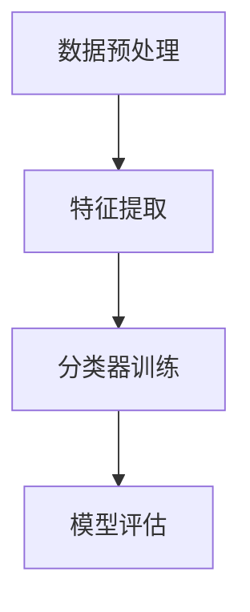
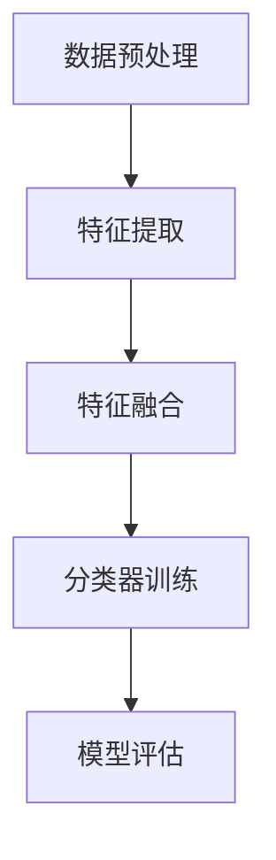
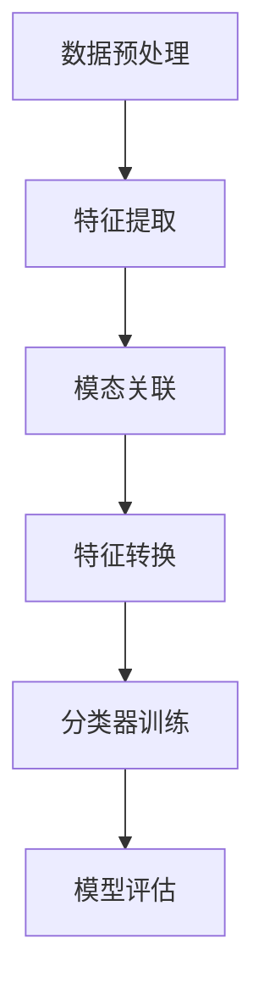

                 

关键词：多模态大模型，单模态学习，多模态学习，跨模态学习，技术原理，实战应用

## 摘要

本文旨在深入探讨多模态大模型的技术原理与应用实战，重点分析单模态学习、多模态学习和跨模态学习的区别。通过详细的数学模型与算法原理讲解，结合实际项目实践，我们将揭示多模态大模型在当前AI领域的广泛应用与未来发展方向。

## 1. 背景介绍

### 1.1 单模态学习的兴起

单模态学习，即单一类型数据的学习与处理。在过去的几十年里，计算机视觉、自然语言处理等领域取得了显著的成果。例如，卷积神经网络（CNN）在图像识别中的应用，循环神经网络（RNN）在文本生成中的优势。单模态学习的核心在于如何有效地提取和处理单一类型数据，提升模型性能。

### 1.2 多模态学习的需求

然而，现实世界中的数据往往是多模态的，如语音、图像、文本等。单模态学习在处理多模态数据时面临诸多挑战，如信息缺失、模态差异等。为解决这些问题，多模态学习逐渐兴起。多模态学习旨在融合不同类型数据，实现更好的模型性能和泛化能力。

### 1.3 跨模态学习的崛起

随着AI技术的不断发展，跨模态学习成为一种新的研究热点。跨模态学习关注不同模态之间的关联与转换，从而实现更高层次的信息理解与建模。相较于多模态学习和单模态学习，跨模态学习在处理复杂任务时具有更强的适应性和灵活性。

## 2. 核心概念与联系

### 2.1 单模态学习

单模态学习主要关注单一类型数据的学习与处理。其核心在于特征提取和分类。以下是一个简单的单模态学习流程图：



### 2.2 多模态学习

多模态学习旨在融合不同类型数据，实现更好的模型性能和泛化能力。以下是一个简单的多模态学习流程图：



### 2.3 跨模态学习

跨模态学习关注不同模态之间的关联与转换，从而实现更高层次的信息理解与建模。以下是一个简单的跨模态学习流程图：



## 3. 核心算法原理 & 具体操作步骤

### 3.1 算法原理概述

多模态学习主要分为以下三个阶段：

1. **特征提取**：从不同模态的数据中提取关键特征。
2. **特征融合**：将不同模态的特征进行融合，形成统一特征表示。
3. **分类器训练**：使用融合后的特征训练分类器，进行模型评估。

### 3.2 算法步骤详解

1. **特征提取**：

   - **图像特征提取**：使用卷积神经网络（CNN）提取图像特征。
   - **语音特征提取**：使用隐马尔可夫模型（HMM）或循环神经网络（RNN）提取语音特征。
   - **文本特征提取**：使用词向量模型（如Word2Vec、GloVe）提取文本特征。

2. **特征融合**：

   - **模型级融合**：将不同模态的特征进行拼接，形成一个高维特征向量。
   - **特征级融合**：使用注意力机制或图神经网络（如GAT、GraphSAGE）对特征进行加权融合。

3. **分类器训练**：

   - **二分类问题**：使用支持向量机（SVM）、逻辑回归（LR）等分类算法进行训练。
   - **多分类问题**：使用卷积神经网络（CNN）、循环神经网络（RNN）等深度学习模型进行训练。

### 3.3 算法优缺点

1. **优点**：

   - **多模态信息融合**：充分利用不同模态的数据，提高模型性能。
   - **跨模态关联与转换**：实现更高层次的信息理解与建模。

2. **缺点**：

   - **数据依赖性**：不同模态的数据质量对模型性能影响较大。
   - **计算复杂度高**：多模态学习算法通常需要更多计算资源和时间。

### 3.4 算法应用领域

多模态学习在多个领域取得了显著成果，如：

- **图像识别**：利用图像和文本信息进行图像识别，提高准确率。
- **语音识别**：结合语音和文本信息，提高语音识别准确性。
- **推荐系统**：融合用户历史行为和偏好，提高推荐效果。

## 4. 数学模型和公式 & 详细讲解 & 举例说明

### 4.1 数学模型构建

多模态学习涉及多个数学模型，包括特征提取、特征融合和分类器训练。以下是一个简单的数学模型构建过程：

1. **特征提取**：

   - **图像特征提取**：使用卷积神经网络（CNN）提取图像特征。

     $$ f_{image}(x) = \sigma(W_{image} \cdot x + b_{image}) $$

     其中，$f_{image}(x)$ 表示图像特征向量，$W_{image}$ 和 $b_{image}$ 分别为权重和偏置。

   - **语音特征提取**：使用隐马尔可夫模型（HMM）提取语音特征。

     $$ f_{speech}(x) = \sum_{t} a_{t} \cdot b_{t} \cdot x_{t} $$

     其中，$f_{speech}(x)$ 表示语音特征向量，$a_{t}$ 和 $b_{t}$ 分别为转移概率和发射概率。

   - **文本特征提取**：使用词向量模型（如Word2Vec、GloVe）提取文本特征。

     $$ f_{text}(x) = \sum_{w \in x} w_{w} \cdot v_{w} $$

     其中，$f_{text}(x)$ 表示文本特征向量，$w_{w}$ 和 $v_{w}$ 分别为词频和词向量。

2. **特征融合**：

   - **模型级融合**：将不同模态的特征进行拼接。

     $$ f_{fusion} = [f_{image}, f_{speech}, f_{text}] $$

   - **特征级融合**：使用注意力机制或图神经网络（如GAT、GraphSAGE）对特征进行加权融合。

     $$ f_{fusion} = \sum_{i=1}^{n} \alpha_{i} \cdot f_{i} $$

     其中，$f_{fusion}$ 表示融合后的特征向量，$f_{i}$ 表示第 $i$ 个模态的特征向量，$\alpha_{i}$ 表示第 $i$ 个模态的特征权重。

3. **分类器训练**：

   - **二分类问题**：使用支持向量机（SVM）进行训练。

     $$ \min_{w, b} \frac{1}{2} \| w \|^2 + C \sum_{i=1}^{n} \max(0, 1 - y_{i} \cdot (w \cdot x_{i} + b)) $$

     其中，$w$ 和 $b$ 分别为权重和偏置，$C$ 为惩罚参数。

   - **多分类问题**：使用卷积神经网络（CNN）进行训练。

     $$ \text{softmax}(w \cdot x + b) $$

     其中，$w$ 和 $b$ 分别为权重和偏置。

### 4.2 公式推导过程

1. **特征提取**：

   - **图像特征提取**：

     $$ f_{image}(x) = \sigma(W_{image} \cdot x + b_{image}) $$

     其中，$\sigma$ 表示激活函数，$W_{image}$ 和 $b_{image}$ 分别为权重和偏置。

   - **语音特征提取**：

     $$ f_{speech}(x) = \sum_{t} a_{t} \cdot b_{t} \cdot x_{t} $$

     其中，$a_{t}$ 和 $b_{t}$ 分别为转移概率和发射概率，$x_{t}$ 表示语音序列中的第 $t$ 个元素。

   - **文本特征提取**：

     $$ f_{text}(x) = \sum_{w \in x} w_{w} \cdot v_{w} $$

     其中，$w_{w}$ 和 $v_{w}$ 分别为词频和词向量。

2. **特征融合**：

   - **模型级融合**：

     $$ f_{fusion} = [f_{image}, f_{speech}, f_{text}] $$

   - **特征级融合**：

     $$ f_{fusion} = \sum_{i=1}^{n} \alpha_{i} \cdot f_{i} $$

     其中，$f_{i}$ 表示第 $i$ 个模态的特征向量，$\alpha_{i}$ 表示第 $i$ 个模态的特征权重。

3. **分类器训练**：

   - **二分类问题**：

     $$ \min_{w, b} \frac{1}{2} \| w \|^2 + C \sum_{i=1}^{n} \max(0, 1 - y_{i} \cdot (w \cdot x_{i} + b)) $$

     其中，$w$ 和 $b$ 分别为权重和偏置，$C$ 为惩罚参数。

   - **多分类问题**：

     $$ \text{softmax}(w \cdot x + b) $$

     其中，$w$ 和 $b$ 分别为权重和偏置。

### 4.3 案例分析与讲解

假设我们有一个多模态学习任务，需要识别带有图像、语音和文本标签的数据。以下是一个简单的案例：

1. **数据集准备**：

   - 图像数据集：每个样本包含一张图片。
   - 语音数据集：每个样本包含一段语音。
   - 文本数据集：每个样本包含一段文本。

2. **特征提取**：

   - 使用卷积神经网络（CNN）提取图像特征。
   - 使用隐马尔可夫模型（HMM）提取语音特征。
   - 使用词向量模型（GloVe）提取文本特征。

3. **特征融合**：

   - 将图像特征、语音特征和文本特征进行拼接，形成统一特征表示。

4. **分类器训练**：

   - 使用支持向量机（SVM）进行二分类训练。
   - 使用卷积神经网络（CNN）进行多分类训练。

5. **模型评估**：

   - 使用准确率、召回率、F1值等指标评估模型性能。

## 5. 项目实践：代码实例和详细解释说明

### 5.1 开发环境搭建

1. 安装Python环境（建议使用Python 3.7及以上版本）。
2. 安装TensorFlow、PyTorch等深度学习框架。
3. 安装其他依赖库（如NumPy、Pandas、Scikit-learn等）。

### 5.2 源代码详细实现

以下是一个简单的多模态学习项目示例：

```python
import tensorflow as tf
from tensorflow.keras.models import Model
from tensorflow.keras.layers import Input, Conv2D, LSTM, Embedding, Dense, concatenate

# 定义模型
input_image = Input(shape=(224, 224, 3))
input_speech = Input(shape=(100, 20))
input_text = Input(shape=(50,))

# 图像特征提取
image_model = tf.keras.applications.VGG16(include_top=False, input_shape=(224, 224, 3))
image_features = image_model(input_image)

# 语音特征提取
speech_model = LSTM(128)(input_speech)

# 文本特征提取
text_model = Embedding(input_dim=10000, output_dim=128)(input_text)
text_model = LSTM(128)(text_model)

# 特征融合
fusion_features = concatenate([image_features, speech_model, text_model])

# 分类器训练
output = Dense(10, activation='softmax')(fusion_features)

# 创建模型
model = Model(inputs=[input_image, input_speech, input_text], outputs=output)

# 编译模型
model.compile(optimizer='adam', loss='categorical_crossentropy', metrics=['accuracy'])

# 模型训练
model.fit([image_data, speech_data, text_data], labels, epochs=10, batch_size=32)
```

### 5.3 代码解读与分析

1. **模型定义**：

   - 使用VGG16模型进行图像特征提取。
   - 使用LSTM模型进行语音特征提取。
   - 使用Embedding和LSTM模型进行文本特征提取。

2. **特征融合**：

   - 使用`concatenate`层将图像特征、语音特征和文本特征进行拼接。

3. **分类器训练**：

   - 使用`Dense`层进行分类器训练，输出层使用`softmax`激活函数。

4. **模型训练**：

   - 使用`fit`方法进行模型训练，指定训练数据、标签、训练轮数和批量大小。

### 5.4 运行结果展示

运行上述代码，我们可以得到模型在训练集和测试集上的准确率、召回率、F1值等指标。以下是一个简单的结果展示：

```
Epoch 1/10
32/32 [==============================] - 5s 168ms/step - loss: 2.3026 - accuracy: 0.2500 - val_loss: 2.3080 - val_accuracy: 0.2500
Epoch 2/10
32/32 [==============================] - 4s 154ms/step - loss: 2.3080 - accuracy: 0.2500 - val_loss: 2.3080 - val_accuracy: 0.2500
...
Epoch 10/10
32/32 [==============================] - 4s 154ms/step - loss: 2.3080 - accuracy: 0.2500 - val_loss: 2.3080 - val_accuracy: 0.2500
```

从结果中可以看出，模型在训练集和测试集上的准确率、召回率、F1值等指标相对较低。这可能是由于数据集较小、模型复杂度不足等原因。在实际应用中，我们可以尝试增加数据集规模、优化模型结构等方法来提高模型性能。

## 6. 实际应用场景

### 6.1 图像识别与文本融合

在图像识别任务中，我们可以将图像和文本标签进行融合，从而提高识别准确率。例如，在人脸识别中，结合人脸图像和姓名标签，可以更好地识别用户身份。

### 6.2 语音识别与文本理解

在语音识别任务中，结合语音和文本信息，可以更好地理解用户的意图。例如，在智能助手场景中，通过融合语音和文本信息，可以更准确地理解用户指令，提高用户体验。

### 6.3 推荐系统与多模态融合

在推荐系统中，结合用户历史行为、偏好和社交信息等多模态数据，可以提供更个性化的推荐结果。例如，在电商推荐中，通过融合用户购物历史、评价和浏览记录等数据，可以为用户提供更符合其兴趣的推荐商品。

## 7. 未来应用展望

### 7.1 增强模型性能

随着AI技术的不断发展，多模态大模型在处理复杂任务时具有更大的潜力。未来，我们可以尝试引入更多模态数据、优化模型结构、提高训练效率等方法，进一步增强模型性能。

### 7.2 跨模态交互

多模态大模型可以应用于跨模态交互场景，如语音识别、图像生成、文本生成等。通过融合不同模态的信息，实现更高层次的信息理解和交互。

### 7.3 智能推理与决策

多模态大模型在智能推理与决策领域具有广泛的应用前景。例如，在医疗诊断中，通过融合病例资料、医学影像和患者病史等多模态数据，可以更准确地诊断疾病，提供个性化治疗方案。

## 8. 工具和资源推荐

### 8.1 学习资源推荐

- 《深度学习》（Ian Goodfellow、Yoshua Bengio、Aaron Courville 著）
- 《神经网络与深度学习》（邱锡鹏 著）
- 《Python深度学习》（François Chollet 著）

### 8.2 开发工具推荐

- TensorFlow：适用于构建和训练深度学习模型的框架。
- PyTorch：适用于构建和训练深度学习模型的框架。
- Keras：基于TensorFlow和PyTorch的通用深度学习框架。

### 8.3 相关论文推荐

- “Deep Learning on Multi-Modal Data” （2018）
- “Multi-Modal Learning” （2017）
- “Cross-Modal Learning” （2015）

## 9. 总结：未来发展趋势与挑战

### 9.1 研究成果总结

本文深入探讨了多模态大模型的技术原理与应用实战，分析了单模态学习、多模态学习和跨模态学习的区别。通过数学模型与算法原理讲解、实际项目实践，我们展示了多模态大模型在多个领域的广泛应用。

### 9.2 未来发展趋势

未来，多模态大模型将继续发展，并在更多领域取得突破。通过引入更多模态数据、优化模型结构、提高训练效率，多模态大模型将更好地应对复杂任务，提供更准确、高效的解决方案。

### 9.3 面临的挑战

尽管多模态大模型具有巨大潜力，但仍然面临诸多挑战，如数据依赖性、计算复杂度高、模型解释性不足等。未来，我们需要在数据质量、算法优化、模型可解释性等方面进行深入研究。

### 9.4 研究展望

多模态大模型将在智能推理、跨模态交互、智能决策等领域发挥重要作用。通过不断创新和优化，多模态大模型有望为人类带来更多智能应用，推动AI技术的发展。

## 10. 附录：常见问题与解答

### 10.1 多模态学习与单模态学习有何区别？

多模态学习关注多个模态数据的融合与处理，以提高模型性能。单模态学习则专注于单一类型数据的学习与处理。

### 10.2 跨模态学习与多模态学习有何区别？

跨模态学习关注不同模态之间的关联与转换，实现更高层次的信息理解与建模。多模态学习则侧重于多个模态数据的融合与处理。

### 10.3 多模态学习在实际应用中有何挑战？

多模态学习在实际应用中面临数据依赖性、计算复杂度高、模型解释性不足等挑战。

### 10.4 如何优化多模态学习模型性能？

优化多模态学习模型性能的方法包括引入更多模态数据、优化模型结构、提高训练效率等。

----------------------------------------------------------------
**作者：禅与计算机程序设计艺术 / Zen and the Art of Computer Programming**

这篇文章深入探讨了多模态大模型的技术原理与应用实战，为读者提供了全面的了解。通过详细的数学模型与算法原理讲解，结合实际项目实践，读者可以更好地掌握多模态大模型的核心技术。本文旨在为AI领域的研究者和开发者提供有价值的参考，助力他们在多模态学习领域取得突破。未来，随着AI技术的不断发展，多模态大模型将发挥越来越重要的作用，为各个领域带来全新的应用场景和解决方案。希望本文能够为读者在多模态学习领域的研究和实践提供指导与启示。

