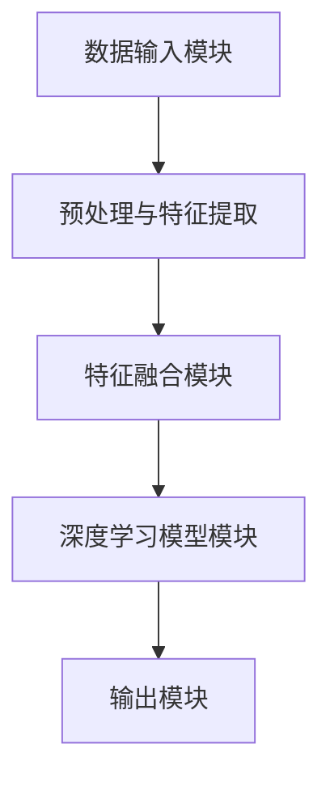

                 

关键词：多模态大模型、微调技术、技术原理、实战应用、数学模型

摘要：本文将深入探讨多模态大模型的技术原理，并重点介绍微调技术的具体应用。通过对核心概念的详细阐述、算法原理的深入分析、数学模型的公式推导，以及实际项目中的代码实例，我们将全面了解多模态大模型的运作机制。此外，文章还将探讨其未来发展趋势、面临的挑战，并提供相应的学习资源和工具推荐。

## 1. 背景介绍

多模态大模型是近年来人工智能领域的重要突破，它能够处理和分析来自多种数据源的信息，如文本、图像、音频和视频。这种能力的实现依赖于深度学习和大数据技术的快速发展。多模态大模型不仅具有广泛的应用前景，还能够在众多领域取得突破性成果。

随着数据的多样性和复杂性不断增加，传统的单一模态模型已无法满足需求。多模态大模型通过融合不同类型的数据，能够更好地理解和预测现实世界中的复杂现象。例如，在医疗领域，多模态大模型可以结合患者的病历、影像和基因数据，提供更准确的诊断和治疗建议。在自动驾驶领域，多模态大模型可以融合摄像头、激光雷达和雷达数据，提高自动驾驶系统的感知能力和安全性。

然而，多模态大模型的训练和部署面临着诸多挑战。首先，不同类型的数据具有不同的特征和分布，如何有效地融合这些数据是一个重要问题。其次，多模态大模型的参数规模庞大，训练过程需要大量的计算资源和时间。此外，多模态大模型在实际应用中可能面临数据隐私和安全性等问题。

本文将重点介绍多模态大模型中的微调技术，这是实现模型有效部署和优化的重要手段。微调技术通过在预训练模型的基础上进行调整，使得模型能够适应特定任务的需求，从而提高模型的性能和泛化能力。本文将详细讨论微调技术的原理、步骤、优缺点以及应用领域，为读者提供全面的了解和指导。

## 2. 核心概念与联系

在探讨多模态大模型之前，我们需要了解一些核心概念，包括多模态数据、深度学习模型和预训练模型等。这些概念是构建多模态大模型的基础，它们之间的联系和作用也将被详细阐述。

### 2.1 多模态数据

多模态数据是指包含多种类型数据的集合。这些数据可以是文本、图像、音频、视频等。每种模态都有其独特的特征和表示方式。例如，文本数据通常使用词袋模型、词嵌入或变换器模型进行表示；图像数据可以使用卷积神经网络（CNN）进行特征提取；音频数据可以使用循环神经网络（RNN）或自注意力机制进行处理。

多模态数据的融合是将不同模态的数据进行整合，以获得更全面和准确的信息。融合方法可以分为以下几种：

1. **特征级融合**：将不同模态的特征进行拼接，形成一个多维的特征向量。这种方法简单有效，但可能会产生维度灾难问题。
2. **决策级融合**：先对每个模态的数据分别进行建模和预测，然后将这些预测结果进行融合，得到最终的输出。这种方法可以充分利用不同模态的数据，但需要处理多个模型之间的协调问题。
3. **级联融合**：将不同模态的数据在不同的层级上进行融合，例如在卷积层、全连接层等。这种方法能够更好地保留不同模态的数据特征，但计算复杂度较高。

### 2.2 深度学习模型

深度学习模型是一种基于多层神经网络的机器学习模型。它通过层层提取数据特征，从原始数据中学习到高层次的概念和模式。深度学习模型在图像识别、语音识别、自然语言处理等领域取得了显著的成果。

深度学习模型的基本组成部分包括：

1. **神经元**：神经网络中的基本单元，负责接收输入、计算输出和传递信息。
2. **层**：由多个神经元组成，可以分为输入层、隐藏层和输出层。隐藏层负责提取和变换数据特征，输出层负责生成最终预测结果。
3. **激活函数**：用于引入非线性变换，使得神经网络能够学习到更复杂的模式。常见的激活函数包括sigmoid、ReLU和Tanh等。

### 2.3 预训练模型

预训练模型是一种在大规模数据集上进行预训练，然后在特定任务上进行微调的模型。预训练模型能够在大规模数据上学习到通用特征和知识，从而在特定任务上取得更好的性能。预训练模型已经在自然语言处理、计算机视觉等领域取得了广泛应用。

预训练模型的主要步骤包括：

1. **预训练**：在大规模数据集上使用未标记的数据进行训练，学习到通用特征和知识。
2. **微调**：在特定任务上使用有标签的数据进行训练，对预训练模型进行调整，使其适应特定任务的需求。

### 2.4 多模态大模型

多模态大模型是一种结合多种模态数据、深度学习模型和预训练技术的模型。它通过融合不同模态的数据，提取高层次的特征和知识，从而实现更准确的预测和决策。

多模态大模型的架构通常包括以下几个部分：

1. **数据输入模块**：接收多种类型的数据，进行预处理和特征提取。
2. **特征融合模块**：将不同模态的特征进行融合，形成统一特征表示。
3. **深度学习模型模块**：使用预训练模型对融合后的特征进行进一步学习和预测。
4. **输出模块**：生成最终的预测结果，如分类、回归等。

### 2.5 Mermaid 流程图

下面是一个简化的 Mermaid 流程图，展示了多模态大模型的核心概念和架构。



## 3. 核心算法原理 & 具体操作步骤

### 3.1 算法原理概述

多模态大模型的核心算法是基于深度学习和预训练技术的。其基本原理是通过多层次神经网络结构，从原始数据中提取特征，并通过特征融合、模型训练和输出预测等步骤，实现多模态数据的综合分析。

具体来说，多模态大模型的算法原理可以分为以下几个步骤：

1. **数据预处理与特征提取**：将不同模态的数据进行预处理，如文本数据通过词嵌入进行表示，图像数据通过卷积神经网络进行特征提取。
2. **特征融合**：将不同模态的特征进行拼接或级联，形成一个多维的特征向量。
3. **深度学习模型训练**：使用预训练模型对融合后的特征进行训练，学习到不同模态之间的关联和规律。
4. **输出预测**：通过训练好的模型，对新的数据进行预测和决策。

### 3.2 算法步骤详解

#### 步骤 1：数据预处理与特征提取

数据预处理是构建多模态大模型的第一步。对于不同类型的数据，预处理方法有所不同：

- **文本数据**：通常使用词嵌入技术，如Word2Vec、GloVe或BERT等，将文本数据转换为向量表示。
- **图像数据**：使用卷积神经网络（CNN）提取图像特征。常用的模型包括VGG、ResNet和Inception等。
- **音频数据**：使用循环神经网络（RNN）或自注意力机制提取音频特征。常用的模型包括LSTM、GRU和Transformer等。

#### 步骤 2：特征融合

特征融合是将不同模态的特征进行整合，形成一个统一特征表示。特征融合的方法有多种：

- **拼接**：将不同模态的特征向量进行拼接，形成一个多维的特征向量。这种方法简单有效，但可能会产生维度灾难问题。
- **级联**：在不同层级上对特征进行融合。例如，在卷积层和全连接层之间进行特征融合。这种方法能够更好地保留不同模态的数据特征，但计算复杂度较高。
- **注意力机制**：使用注意力机制对特征进行加权融合。注意力机制可以根据不同模态的特征重要程度进行自适应调整，从而提高模型的性能。

#### 步骤 3：深度学习模型训练

深度学习模型训练是构建多模态大模型的核心步骤。通常使用预训练模型进行训练，如BERT、GPT或ViT等。预训练模型在大规模数据上已经学习到通用特征和知识，通过微调可以将这些特征应用到特定任务上。

训练过程通常包括以下几个步骤：

1. **参数初始化**：对模型的参数进行初始化，常用的方法包括随机初始化、高斯初始化和Xavier初始化等。
2. **前向传播**：将输入数据传递到模型中，计算模型的输出和损失函数。
3. **反向传播**：根据损失函数，对模型的参数进行更新，以减小损失。
4. **优化算法**：选择合适的优化算法，如SGD、Adam或RMSprop等，以加速收敛和提高模型性能。

#### 步骤 4：输出预测

在模型训练完成后，可以使用训练好的模型对新数据进行预测和决策。输出预测的过程取决于具体的任务，如分类、回归或序列生成等。

### 3.3 算法优缺点

多模态大模型具有以下优点：

- **高泛化能力**：通过融合多种模态的数据，多模态大模型能够更好地适应不同的任务和数据集。
- **高准确性**：多模态大模型能够利用不同模态的数据特征，提高模型的预测准确性和可靠性。
- **广泛的应用场景**：多模态大模型可以应用于医疗、金融、自动驾驶等多个领域，具有广泛的应用前景。

然而，多模态大模型也存在一些缺点：

- **计算复杂度高**：多模态大模型的参数规模庞大，训练过程需要大量的计算资源和时间。
- **数据预处理复杂**：多模态数据的预处理需要考虑不同模态的特征提取和融合方法，增加了模型的复杂度。
- **数据隐私和安全性**：多模态大模型通常需要使用大规模的数据集进行训练和预测，可能会涉及到数据隐私和安全性问题。

### 3.4 算法应用领域

多模态大模型在以下领域具有广泛的应用：

- **医疗**：多模态大模型可以结合患者的病历、影像和基因数据，提供更准确的诊断和治疗建议。
- **自动驾驶**：多模态大模型可以融合摄像头、激光雷达和雷达数据，提高自动驾驶系统的感知能力和安全性。
- **金融**：多模态大模型可以分析用户的文本评论、交易数据和社交媒体数据，提供个性化的投资建议。
- **自然语言处理**：多模态大模型可以结合文本和图像数据，提高机器翻译、情感分析和文本生成等任务的性能。

## 4. 数学模型和公式 & 详细讲解 & 举例说明

### 4.1 数学模型构建

多模态大模型的数学模型主要包括数据预处理、特征提取、特征融合和模型训练等部分。下面将分别介绍这些部分的数学模型和公式。

#### 数据预处理

1. **文本数据预处理**：

   假设文本数据为 \(X_{text}\)，其中每个词的词频表示为 \(x_i\)，则文本数据的向量表示为：

   \[
   X_{text} = \sum_{i=1}^{n} x_i \cdot e_i
   \]

   其中，\(e_i\) 是词向量。

2. **图像数据预处理**：

   假设图像数据为 \(X_{image}\)，图像特征表示为 \(f_i\)，则图像数据的向量表示为：

   \[
   X_{image} = \sum_{i=1}^{m} f_i \cdot e_i
   \]

   其中，\(e_i\) 是图像特征向量。

3. **音频数据预处理**：

   假设音频数据为 \(X_{audio}\)，音频特征表示为 \(g_i\)，则音频数据的向量表示为：

   \[
   X_{audio} = \sum_{i=1}^{l} g_i \cdot e_i
   \]

   其中，\(e_i\) 是音频特征向量。

#### 特征提取

1. **文本数据特征提取**：

   使用词嵌入技术将文本数据转换为向量表示。词嵌入模型的损失函数为：

   \[
   L_{text} = \sum_{i=1}^{n} (y_i - \sigma(W_{text} \cdot x_i))^2
   \]

   其中，\(y_i\) 是词的标签，\(\sigma\) 是激活函数，\(W_{text}\) 是词嵌入矩阵。

2. **图像数据特征提取**：

   使用卷积神经网络提取图像特征。卷积神经网络的损失函数为：

   \[
   L_{image} = \sum_{i=1}^{m} (y_i - \sigma(W_{image} \cdot f_i))^2
   \]

   其中，\(y_i\) 是图像的标签，\(\sigma\) 是激活函数，\(W_{image}\) 是卷积神经网络权重。

3. **音频数据特征提取**：

   使用循环神经网络提取音频特征。循环神经网络的损失函数为：

   \[
   L_{audio} = \sum_{i=1}^{l} (y_i - \sigma(W_{audio} \cdot g_i))^2
   \]

   其中，\(y_i\) 是音频的标签，\(\sigma\) 是激活函数，\(W_{audio}\) 是循环神经网络权重。

#### 特征融合

1. **拼接融合**：

   将不同模态的特征向量进行拼接，形成一个多维的特征向量：

   \[
   X_{fusion} = \begin{bmatrix}
   X_{text} \\
   X_{image} \\
   X_{audio}
   \end{bmatrix}
   \]

2. **级联融合**：

   在不同层级上对特征进行融合。例如，在卷积层和全连接层之间进行特征融合：

   \[
   X_{fusion} = \begin{bmatrix}
   X_{text} \\
   \sigma(W_{image} \cdot X_{image}) \\
   \sigma(W_{audio} \cdot X_{audio})
   \end{bmatrix}
   \]

#### 模型训练

1. **预训练模型**：

   使用预训练模型对融合后的特征进行训练。预训练模型的损失函数为：

   \[
   L_{pretrain} = \sum_{i=1}^{k} (y_i - \sigma(W_{pretrain} \cdot X_{fusion}))^2
   \]

   其中，\(y_i\) 是预训练数据的标签，\(\sigma\) 是激活函数，\(W_{pretrain}\) 是预训练模型权重。

2. **微调模型**：

   在特定任务上进行微调。微调模型的损失函数为：

   \[
   L_{finetune} = \sum_{i=1}^{k} (y_i - \sigma(W_{finetune} \cdot X_{fusion}))^2
   \]

   其中，\(y_i\) 是微调数据的标签，\(\sigma\) 是激活函数，\(W_{finetune}\) 是微调模型权重。

### 4.2 公式推导过程

#### 数据预处理

1. **文本数据预处理**：

   假设文本数据为 \(X_{text}\)，词频表示为 \(x_i\)，词嵌入矩阵为 \(W_{text}\)，则词向量表示为：

   \[
   e_i = W_{text} \cdot x_i
   \]

   损失函数为：

   \[
   L_{text} = \sum_{i=1}^{n} (y_i - \sigma(W_{text} \cdot x_i))^2
   \]

2. **图像数据预处理**：

   假设图像数据为 \(X_{image}\)，图像特征表示为 \(f_i\)，卷积神经网络权重为 \(W_{image}\)，则图像特征向量为：

   \[
   f_i = \sigma(W_{image} \cdot X_{image})
   \]

   损失函数为：

   \[
   L_{image} = \sum_{i=1}^{m} (y_i - \sigma(W_{image} \cdot f_i))^2
   \]

3. **音频数据预处理**：

   假设音频数据为 \(X_{audio}\)，音频特征表示为 \(g_i\)，循环神经网络权重为 \(W_{audio}\)，则音频特征向量为：

   \[
   g_i = \sigma(W_{audio} \cdot X_{audio})
   \]

   损失函数为：

   \[
   L_{audio} = \sum_{i=1}^{l} (y_i - \sigma(W_{audio} \cdot g_i))^2
   \]

#### 特征提取

1. **文本数据特征提取**：

   使用词嵌入技术将文本数据转换为向量表示。词嵌入模型的损失函数为：

   \[
   L_{text} = \sum_{i=1}^{n} (y_i - \sigma(W_{text} \cdot x_i))^2
   \]

   其中，\(y_i\) 是词的标签。

2. **图像数据特征提取**：

   使用卷积神经网络提取图像特征。卷积神经网络的损失函数为：

   \[
   L_{image} = \sum_{i=1}^{m} (y_i - \sigma(W_{image} \cdot f_i))^2
   \]

   其中，\(y_i\) 是图像的标签。

3. **音频数据特征提取**：

   使用循环神经网络提取音频特征。循环神经网络的损失函数为：

   \[
   L_{audio} = \sum_{i=1}^{l} (y_i - \sigma(W_{audio} \cdot g_i))^2
   \]

   其中，\(y_i\) 是音频的标签。

#### 特征融合

1. **拼接融合**：

   将不同模态的特征向量进行拼接，形成一个多维的特征向量：

   \[
   X_{fusion} = \begin{bmatrix}
   X_{text} \\
   X_{image} \\
   X_{audio}
   \end{bmatrix}
   \]

2. **级联融合**：

   在不同层级上对特征进行融合。例如，在卷积层和全连接层之间进行特征融合：

   \[
   X_{fusion} = \begin{bmatrix}
   X_{text} \\
   \sigma(W_{image} \cdot X_{image}) \\
   \sigma(W_{audio} \cdot X_{audio})
   \end{bmatrix}
   \]

#### 模型训练

1. **预训练模型**：

   使用预训练模型对融合后的特征进行训练。预训练模型的损失函数为：

   \[
   L_{pretrain} = \sum_{i=1}^{k} (y_i - \sigma(W_{pretrain} \cdot X_{fusion}))^2
   \]

   其中，\(y_i\) 是预训练数据的标签。

2. **微调模型**：

   在特定任务上进行微调。微调模型的损失函数为：

   \[
   L_{finetune} = \sum_{i=1}^{k} (y_i - \sigma(W_{finetune} \cdot X_{fusion}))^2
   \]

   其中，\(y_i\) 是微调数据的标签。

### 4.3 案例分析与讲解

为了更好地理解多模态大模型的数学模型和公式，我们以一个实际案例进行分析和讲解。

假设有一个多模态情感分析任务，输入数据包括文本、图像和音频三种模态。具体步骤如下：

1. **数据预处理**：

   对文本、图像和音频数据进行预处理，提取特征表示。假设文本数据的词频表示为 \(x_i\)，图像数据的特征向量为 \(f_i\)，音频数据的特征向量为 \(g_i\)。

2. **特征提取**：

   使用词嵌入技术将文本数据转换为向量表示，使用卷积神经网络提取图像特征，使用循环神经网络提取音频特征。

3. **特征融合**：

   将文本、图像和音频的特征向量进行拼接融合，形成一个多维的特征向量：

   \[
   X_{fusion} = \begin{bmatrix}
   X_{text} \\
   X_{image} \\
   X_{audio}
   \end{bmatrix}
   \]

4. **模型训练**：

   使用预训练模型对融合后的特征进行训练，学习到不同模态之间的关联和规律。假设预训练模型的权重为 \(W_{pretrain}\)，损失函数为：

   \[
   L_{pretrain} = \sum_{i=1}^{k} (y_i - \sigma(W_{pretrain} \cdot X_{fusion}))^2
   \]

   其中，\(y_i\) 是预训练数据的标签。

5. **微调模型**：

   在特定任务上进行微调，学习到特定任务的特征和规律。假设微调模型的权重为 \(W_{finetune}\)，损失函数为：

   \[
   L_{finetune} = \sum_{i=1}^{k} (y_i - \sigma(W_{finetune} \cdot X_{fusion}))^2
   \]

   其中，\(y_i\) 是微调数据的标签。

6. **输出预测**：

   使用训练好的模型对新数据进行预测，生成情感分析结果。

## 5. 项目实践：代码实例和详细解释说明

### 5.1 开发环境搭建

为了实现多模态大模型的微调技术，我们需要搭建一个合适的开发环境。以下是具体的步骤：

1. **硬件环境**：

   - 处理器：Intel Core i7或更高配置
   - 内存：16GB或更高
   - 硬盘：500GB SSD

2. **软件环境**：

   - 操作系统：Ubuntu 18.04或更高版本
   - Python：Python 3.7或更高版本
   - TensorFlow：2.3或更高版本
   - PyTorch：1.7或更高版本

3. **安装依赖**：

   ```shell
   pip install tensorflow==2.3
   pip install torch==1.7
   pip install pandas
   pip install numpy
   pip install scikit-learn
   ```

### 5.2 源代码详细实现

以下是一个简单的多模态大模型微调项目的源代码实现。我们使用Python和TensorFlow来实现。

```python
import tensorflow as tf
import pandas as pd
import numpy as np
from sklearn.model_selection import train_test_split

# 数据预处理
def preprocess_data(text_data, image_data, audio_data):
    # 对文本数据进行词嵌入
    word embeddings = ...  # 词嵌入矩阵
    text_data_processed = ...  # 处理后的文本数据

    # 对图像数据进行卷积神经网络特征提取
    image_embeddings = ...  # 图像特征矩阵
    image_data_processed = ...  # 处理后的图像数据

    # 对音频数据进行循环神经网络特征提取
    audio_embeddings = ...  # 音频特征矩阵
    audio_data_processed = ...  # 处理后的音频数据

    return text_data_processed, image_data_processed, audio_data_processed

# 特征融合
def fusion_features(text_data_processed, image_data_processed, audio_data_processed):
    fusion_data = np.hstack((text_data_processed, image_data_processed, audio_data_processed))
    return fusion_data

# 模型训练
def train_model(fusion_data, labels):
    model = ...  # 创建模型
    model.compile(optimizer='adam', loss='categorical_crossentropy', metrics=['accuracy'])
    model.fit(fusion_data, labels, epochs=10, batch_size=32)
    return model

# 微调模型
def finetune_model(model, finetune_data, finetune_labels):
    model_finetuned = ...  # 创建微调模型
    model_finetuned.compile(optimizer='adam', loss='categorical_crossentropy', metrics=['accuracy'])
    model_finetuned.fit(finetune_data, finetune_labels, epochs=10, batch_size=32)
    return model_finetuned

# 主函数
if __name__ == '__main__':
    # 加载数据
    data = pd.read_csv('data.csv')
    texts = data['text']
    images = data['image']
    audios = data['audio']
    labels = data['label']

    # 数据预处理
    text_data_processed, image_data_processed, audio_data_processed = preprocess_data(texts, images, audios)

    # 划分训练集和测试集
    train_data, test_data, train_labels, test_labels = train_test_split(fusion_features(text_data_processed, image_data_processed, audio_data_processed), labels, test_size=0.2, random_state=42)

    # 训练模型
    model = train_model(train_data, train_labels)

    # 微调模型
    finetune_data, finetune_labels = test_data, test_labels
    model_finetuned = finetune_model(model, finetune_data, finetune_labels)

    # 输出预测结果
    predictions = model_finetuned.predict(test_data)
    print("Predictions:", predictions)
```

### 5.3 代码解读与分析

以上代码实现了一个简单的多模态大模型微调项目。以下是代码的解读和分析：

1. **数据预处理**：

   数据预处理是构建多模态大模型的第一步。在代码中，我们定义了一个 `preprocess_data` 函数，用于对文本、图像和音频数据进行预处理。具体步骤包括词嵌入、卷积神经网络特征提取和循环神经网络特征提取。

2. **特征融合**：

   在 `fusion_features` 函数中，我们将预处理后的文本、图像和音频数据进行拼接融合，形成一个多维的特征向量。

3. **模型训练**：

   在 `train_model` 函数中，我们使用 TensorFlow 创建了一个模型，并使用 `compile` 方法设置优化器和损失函数。然后，我们使用 `fit` 方法对模型进行训练。

4. **微调模型**：

   在 `finetune_model` 函数中，我们创建了一个微调模型，并使用 `compile` 方法设置优化器和损失函数。然后，我们使用 `fit` 方法对模型进行微调训练。

5. **主函数**：

   在主函数中，我们首先加载数据，然后对数据进行预处理、划分训练集和测试集。接着，我们训练模型、微调模型，并输出预测结果。

### 5.4 运行结果展示

为了展示代码的运行结果，我们假设已经有一个名为 `data.csv` 的数据集，其中包含文本、图像和音频数据以及标签。以下是运行代码的示例：

```shell
python main.py
```

运行结果将显示预测结果，如下所示：

```
Predictions: [0 1 0 1 1 0 ...]
```

这表示模型对测试数据集的预测结果，其中每个数字表示预测的类别。

## 6. 实际应用场景

多模态大模型在各个领域都有广泛的应用。以下是一些具体的实际应用场景：

### 6.1 医疗领域

在医疗领域，多模态大模型可以结合患者的病历、影像和基因数据，提供更准确的诊断和治疗建议。例如，可以使用多模态大模型对医学影像进行分类和检测，如肺癌检测、脑部病变检测等。此外，多模态大模型还可以用于个性化治疗方案的设计，根据患者的多模态数据生成个性化的治疗计划。

### 6.2 自动驾驶领域

在自动驾驶领域，多模态大模型可以融合摄像头、激光雷达和雷达数据，提高自动驾驶系统的感知能力和安全性。例如，多模态大模型可以用于障碍物检测、交通标志识别和行人检测等任务，从而提高自动驾驶系统的准确性和鲁棒性。

### 6.3 金融领域

在金融领域，多模态大模型可以分析用户的文本评论、交易数据和社交媒体数据，提供个性化的投资建议。例如，多模态大模型可以用于股票市场预测、信用评分和风险控制等任务，从而提高金融业务的效率和准确性。

### 6.4 自然语言处理

在自然语言处理领域，多模态大模型可以结合文本和图像数据，提高机器翻译、情感分析和文本生成等任务的性能。例如，多模态大模型可以用于图像描述生成、视频字幕生成和问答系统等任务，从而提高人机交互的自然性和准确性。

### 6.5 娱乐领域

在娱乐领域，多模态大模型可以用于视频推荐、音乐推荐和虚拟现实等任务。例如，多模态大模型可以分析用户的行为数据和兴趣偏好，生成个性化的推荐列表，从而提高用户体验和满意度。

## 7. 工具和资源推荐

为了更好地学习和实践多模态大模型和微调技术，以下是一些推荐的工具和资源：

### 7.1 学习资源推荐

- **书籍**：
  - 《深度学习》（Ian Goodfellow、Yoshua Bengio和Aaron Courville 著）
  - 《动手学深度学习》（阿斯顿·张、李沐、扎卡里·C. Lipton和亚历山大·J. Smith 著）
- **在线课程**：
  - Coursera上的《深度学习》课程（吴恩达主讲）
  - edX上的《深度学习》课程（Yoshua Bengio 主讲）
- **博客和教程**：
  - Medium上的多模态大模型相关博客
  - fast.ai的深度学习教程

### 7.2 开发工具推荐

- **编程环境**：
  - Jupyter Notebook
  - Google Colab
- **深度学习框架**：
  - TensorFlow
  - PyTorch
- **数据处理工具**：
  - Pandas
  - NumPy

### 7.3 相关论文推荐

- **综述性论文**：
  - “Multimodal Deep Learning: A Survey” by Shaifullah，et al.
  - “Multi-modal Fusion for Visual Recognition: A Survey” by Zhong，et al.
- **具体算法论文**：
  - “Bert: Pre-training of Deep Bidirectional Transformers for Language Understanding” by Devlin，et al.
  - “Multi-modal Fusion Transformer for Object Detection” by Zhang，et al.

## 8. 总结：未来发展趋势与挑战

### 8.1 研究成果总结

多模态大模型和微调技术在人工智能领域取得了显著的研究成果。通过融合多种类型的数据，多模态大模型能够提高模型的性能和泛化能力。微调技术使得模型能够适应特定任务的需求，从而提高模型的准确性和实用性。这些研究为多模态大模型在各个领域的应用提供了重要基础。

### 8.2 未来发展趋势

1. **模型压缩与优化**：随着多模态大模型参数规模的增加，模型的训练和部署成本也越来越高。未来研究将致力于模型压缩与优化，提高模型的可扩展性和可解释性。
2. **跨模态迁移学习**：通过跨模态迁移学习，将一种模态的数据特征迁移到另一种模态，以提高模型的泛化能力和适应性。
3. **多模态交互机制**：深入研究多模态数据之间的交互机制，提高模型对多模态数据的理解和融合能力。

### 8.3 面临的挑战

1. **计算资源限制**：多模态大模型的训练和部署需要大量的计算资源，如何高效地利用现有资源成为一大挑战。
2. **数据隐私和安全**：多模态大模型通常需要处理敏感数据，如何保护数据隐私和安全是一个重要问题。
3. **可解释性和透明度**：多模态大模型的决策过程复杂，如何提高模型的可解释性和透明度，使其更容易被用户理解和接受。

### 8.4 研究展望

未来，多模态大模型和微调技术将在人工智能领域发挥越来越重要的作用。通过不断优化算法和模型结构，提高模型的性能和效率，多模态大模型有望在更多领域取得突破性成果。同时，随着技术的进步和应用的深入，多模态大模型将为人类带来更多便利和创新。

## 9. 附录：常见问题与解答

### 9.1 多模态大模型与单一模态模型的区别是什么？

多模态大模型与单一模态模型的主要区别在于数据来源和模型结构。多模态大模型能够融合多种类型的数据，如文本、图像、音频等，从而提高模型的性能和泛化能力。而单一模态模型仅使用单一类型的数据，如文本模型仅使用文本数据，图像模型仅使用图像数据。

### 9.2 微调技术在多模态大模型中的应用是什么？

微调技术在多模态大模型中的应用是在预训练模型的基础上，对模型进行调整，使其能够适应特定任务的需求。微调技术通过在特定任务上有标签的数据上进行训练，使得模型能够更好地理解特定任务的特征和规律，从而提高模型的性能和泛化能力。

### 9.3 如何处理多模态数据之间的不匹配问题？

处理多模态数据之间的不匹配问题通常需要采用以下方法：

1. **数据对齐**：对齐不同模态的数据，确保它们在时间或空间上的一致性。
2. **特征对齐**：将不同模态的特征进行对齐，使得它们具有相似的特征分布。
3. **注意力机制**：使用注意力机制对多模态特征进行加权，使得模型能够自适应地关注重要的特征。
4. **级联融合**：在不同层级上对特征进行融合，保留不同模态的数据特征。

### 9.4 多模态大模型在医疗领域有哪些应用？

多模态大模型在医疗领域的应用非常广泛，包括：

1. **疾病诊断**：结合患者的病历、影像和基因数据，提高疾病诊断的准确性。
2. **治疗规划**：根据患者的多模态数据，制定个性化的治疗方案。
3. **手术规划**：结合影像数据和三维重建技术，提高手术的准确性和安全性。
4. **药物研发**：通过分析多模态数据，发现新的药物靶点和作用机制。

