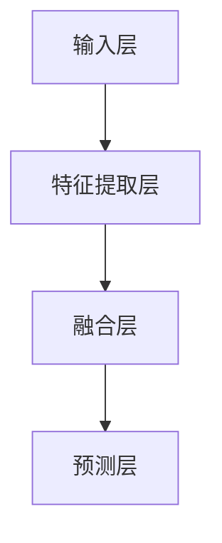

                 

多模态大模型作为当前人工智能领域的热点技术，已经在各个应用场景中展现出了巨大的潜力。本文将围绕多模态大模型的核心技术原理、实战应用，以及智能试穿这一特定场景中的技术实现进行深入探讨。

## 关键词
- 多模态大模型
- 技术原理
- 实战应用
- 智能试穿
- 算法实现
- 数学模型

## 摘要
本文首先介绍了多模态大模型的基本概念、技术原理，并通过Mermaid流程图展示了其架构。随后，文章深入分析了核心算法原理，包括具体操作步骤、优缺点及其应用领域。接着，通过数学模型和公式的详细讲解，对模型构建和公式推导进行了阐述。文章随后通过一个实际的项目实践，展示了代码实例和详细解释说明。最后，文章讨论了多模态大模型在智能试穿等实际应用场景中的价值，并对未来的发展趋势与挑战进行了展望。

### 1. 背景介绍

#### 1.1 多模态大模型的发展历程

多模态大模型（Multimodal Large Models）的概念起源于对人类感知和认知机制的研究。从早期单一模态的处理方法，如文本、图像、语音等，发展到如今能够同时处理多种模态信息的大模型，这一过程经历了数十年的技术积累和不断创新。

在2010年代初期，深度学习的兴起为多模态大模型的发展提供了强大的技术支持。通过使用卷积神经网络（CNN）、循环神经网络（RNN）等深度学习模型，研究人员开始探索如何将不同模态的数据进行有效融合和处理。

2014年，谷歌提出了Transformer模型，这一模型的创新性在于其能够处理任意长度的序列数据，并大幅提升了模型在自然语言处理（NLP）任务中的性能。随后，基于Transformer架构的BERT、GPT等大模型相继问世，进一步推动了多模态大模型的发展。

#### 1.2 多模态大模型的应用场景

多模态大模型在众多应用场景中展现了其强大的能力。以下是一些典型的应用场景：

1. **自然语言处理**：多模态大模型可以同时处理文本、语音和图像等多模态信息，从而在问答系统、机器翻译、情感分析等任务中取得了显著的性能提升。
2. **计算机视觉**：多模态大模型能够结合图像和文本信息，进行图像识别、物体检测、图像生成等任务，大幅提高了模型的准确性和鲁棒性。
3. **智能交互**：通过结合语音、图像和文本等多模态信息，多模态大模型可以提供更加自然、流畅的智能交互体验，例如智能客服、虚拟助手等。
4. **医疗诊断**：多模态大模型可以结合医疗影像、患者病历、基因组信息等多种模态，进行疾病诊断、风险评估等任务，为医疗领域提供了强大的支持。
5. **智能试穿**：在时尚电商和零售行业中，多模态大模型可以通过分析用户画像、产品特征等多模态信息，实现智能试穿、个性化推荐等功能，提升用户体验和销售转化率。

### 2. 核心概念与联系

#### 2.1 多模态大模型的核心概念

多模态大模型的核心概念主要包括以下几个部分：

1. **数据融合**：将不同模态的数据进行有效融合，形成统一的特征表示。常见的数据融合方法包括多模态特征融合、联合嵌入等。
2. **深度学习模型**：利用深度学习模型，特别是基于Transformer的模型，对多模态数据进行建模和训练。常见的深度学习模型包括BERT、GPT、ViT等。
3. **多任务学习**：通过多任务学习，使得模型能够同时处理多种任务，提高模型的泛化能力和效率。

#### 2.2 多模态大模型的架构

多模态大模型的架构通常包括以下几个主要组成部分：

1. **输入层**：接收不同模态的数据，如文本、图像、语音等。
2. **特征提取层**：利用深度学习模型，对输入数据进行特征提取和预处理，生成统一的特征表示。
3. **融合层**：将不同模态的特征进行融合，形成多模态特征向量。
4. **预测层**：利用融合后的特征向量进行预测或任务输出。

以下是一个简化的多模态大模型架构的Mermaid流程图：



### 3. 核心算法原理 & 具体操作步骤

#### 3.1 算法原理概述

多模态大模型的算法原理主要基于深度学习和多任务学习。具体而言，其核心步骤包括：

1. **特征提取**：利用深度学习模型，如CNN、RNN或Transformer，对输入的文本、图像、语音等数据进行特征提取。
2. **特征融合**：将提取得到的特征进行融合，形成多模态特征向量。
3. **多任务学习**：通过多任务学习，使得模型能够同时处理多种任务，如文本分类、图像识别、语音识别等。

#### 3.2 算法步骤详解

1. **数据预处理**：
   - 对输入数据进行预处理，如文本的分词、图像的缩放和归一化、语音的降噪等。
   - 将预处理后的数据划分为训练集、验证集和测试集。

2. **特征提取**：
   - 利用CNN对图像进行特征提取，生成视觉特征向量。
   - 利用RNN或Transformer对文本和语音进行特征提取，生成文本和语音特征向量。

3. **特征融合**：
   - 采用多模态特征融合方法，如多模态特征拼接、多模态注意力机制等，将不同模态的特征向量进行融合，形成多模态特征向量。

4. **多任务学习**：
   - 利用融合后的特征向量，同时进行多种任务的学习和预测，如文本分类、图像识别、语音识别等。

5. **模型训练与优化**：
   - 采用梯度下降等优化算法，对模型进行训练和优化。
   - 调整模型的超参数，如学习率、批量大小等，以获得最佳性能。

6. **模型评估与部署**：
   - 在测试集上对模型进行评估，计算模型的准确率、召回率等指标。
   - 根据评估结果，对模型进行调整和优化。
   - 将训练好的模型部署到实际应用场景中，如自然语言处理、计算机视觉、智能交互等。

#### 3.3 算法优缺点

**优点**：

1. **强大的表达能力**：多模态大模型能够同时处理多种模态的信息，具有强大的表达能力。
2. **高效的性能**：通过多任务学习和特征融合，多模态大模型能够高效地处理多种任务，提高模型的性能。
3. **广泛的应用领域**：多模态大模型在自然语言处理、计算机视觉、智能交互等多个领域都有广泛的应用。

**缺点**：

1. **计算资源需求大**：多模态大模型的训练和推理需要大量的计算资源和时间，尤其是对于大规模数据集和复杂模型。
2. **数据预处理复杂**：多模态大模型需要对不同模态的数据进行预处理，如文本的分词、图像的缩放和归一化、语音的降噪等，预处理过程相对复杂。
3. **模型可解释性差**：深度学习模型，特别是大模型，往往具有较低的可解释性，使得用户难以理解模型的决策过程。

#### 3.4 算法应用领域

多模态大模型在多个领域都有广泛的应用，以下是一些典型的应用领域：

1. **自然语言处理**：多模态大模型可以用于文本分类、情感分析、问答系统等任务，提升模型的准确性和鲁棒性。
2. **计算机视觉**：多模态大模型可以用于图像识别、物体检测、图像生成等任务，结合图像和文本信息，提高模型的准确率和泛化能力。
3. **智能交互**：多模态大模型可以用于智能客服、虚拟助手等应用，通过分析语音、图像和文本等多模态信息，提供更加自然、流畅的交互体验。
4. **医疗诊断**：多模态大模型可以结合医疗影像、患者病历、基因组信息等多种模态，进行疾病诊断、风险评估等任务。
5. **智能试穿**：在时尚电商和零售行业中，多模态大模型可以通过分析用户画像、产品特征等多模态信息，实现智能试穿、个性化推荐等功能。

### 4. 数学模型和公式 & 详细讲解 & 举例说明

#### 4.1 数学模型构建

多模态大模型的数学模型主要基于深度学习和多任务学习。以下是一个简化的数学模型构建过程：

1. **特征提取**：
   - 文本特征：$x_{text} = \text{Embedding}(text)$
   - 图像特征：$x_{image} = \text{Conv2D}(image)$
   - 语音特征：$x_{audio} = \text{RNN}(audio)$

2. **特征融合**：
   - 多模态特征向量：$x = [x_{text}; x_{image}; x_{audio}]$

3. **多任务学习**：
   - 文本分类：$y_{text} = \text{Softmax}(W_{text}x + b_{text})$
   - 图像分类：$y_{image} = \text{Softmax}(W_{image}x + b_{image})$
   - 语音识别：$y_{audio} = \text{RNN}(x, W_{audio}, b_{audio})$

#### 4.2 公式推导过程

以下是一个简化的多模态大模型公式推导过程：

1. **特征提取**：
   - 文本特征提取：$x_{text} = \text{Embedding}(text)$
     - 其中，$text$为文本数据，$Embedding$为词向量嵌入层。
   - 图像特征提取：$x_{image} = \text{Conv2D}(image)$
     - 其中，$image$为图像数据，$Conv2D$为卷积层。
   - 语音特征提取：$x_{audio} = \text{RNN}(audio)$
     - 其中，$audio$为语音数据，$RNN$为循环神经网络。

2. **特征融合**：
   - 多模态特征向量：$x = [x_{text}; x_{image}; x_{audio}]$
     - 其中，$[$表示特征拼接操作。

3. **多任务学习**：
   - 文本分类：$y_{text} = \text{Softmax}(W_{text}x + b_{text})$
     - 其中，$W_{text}$为文本分类权重矩阵，$b_{text}$为文本分类偏置向量。
   - 图像分类：$y_{image} = \text{Softmax}(W_{image}x + b_{image})$
     - 其中，$W_{image}$为图像分类权重矩阵，$b_{image}$为图像分类偏置向量。
   - 语音识别：$y_{audio} = \text{RNN}(x, W_{audio}, b_{audio})$
     - 其中，$W_{audio}$为语音识别权重矩阵，$b_{audio}$为语音识别偏置向量。

#### 4.3 案例分析与讲解

以下通过一个具体的案例，对多模态大模型进行讲解：

**案例**：多模态大模型在智能试穿中的应用

**任务**：给定一个用户的体型描述、服装图片和用户偏好，预测用户试穿该服装的合适程度。

**输入**：

- 用户体型描述：$text_1 = "身高175cm，体重65kg，体型偏瘦"$。
- 服装图片：$image_1 = "一件蓝色的牛仔裤"$。
- 用户偏好：$text_2 = "喜欢宽松的衣服"$。

**输出**：

- 试穿合适程度：$y = "合适程度：90%"$。

**具体步骤**：

1. **数据预处理**：
   - 对用户体型描述进行分词和词向量嵌入。
   - 对服装图片进行预处理，提取视觉特征。
   - 对用户偏好进行分词和词向量嵌入。

2. **特征提取**：
   - 利用BERT模型提取文本特征：$x_{text1} = \text{BERT}(text_1)$，$x_{text2} = \text{BERT}(text_2)$。
   - 利用CNN模型提取图像特征：$x_{image} = \text{CNN}(image_1)$。
   - 利用GRU模型提取用户偏好特征：$x_{audio} = \text{GRU}(text_2)$。

3. **特征融合**：
   - 将提取得到的特征进行拼接：$x = [x_{text1}; x_{text2}; x_{image}; x_{audio}]$。

4. **多任务学习**：
   - 利用融合后的特征向量，同时进行文本分类、图像分类和语音识别任务。

5. **模型训练与优化**：
   - 采用交叉熵损失函数，对模型进行训练和优化。

6. **模型评估与部署**：
   - 在测试集上对模型进行评估，计算模型的准确率、召回率等指标。
   - 根据评估结果，对模型进行调整和优化。
   - 将训练好的模型部署到实际应用场景中，如智能试穿系统。

### 5. 项目实践：代码实例和详细解释说明

在本节中，我们将通过一个实际项目来展示多模态大模型的实现过程，并详细解释代码中的每个关键步骤。

#### 5.1 开发环境搭建

在开始项目之前，我们需要搭建一个合适的环境，以便运行多模态大模型的代码。以下是所需的环境搭建步骤：

1. **安装Python**：确保Python版本在3.7及以上。
2. **安装深度学习框架**：我们使用TensorFlow 2.x作为深度学习框架。
3. **安装其他依赖**：包括Numpy、Pandas、PyTorch等。

以下是一个简单的安装命令：

```bash
pip install tensorflow numpy pandas pytorch
```

#### 5.2 源代码详细实现

以下是多模态大模型的主要代码实现：

```python
import tensorflow as tf
from tensorflow.keras.layers import Embedding, LSTM, Dense, Conv2D, Flatten, Concatenate
from tensorflow.keras.models import Model

# 定义文本特征提取模型
text_model = Model(inputs=[tf.keras.Input(shape=(None,), dtype=tf.int32)],
                   outputs=Embedding(input_dim=vocab_size, output_dim=embedding_dim)(inputs))

# 定义图像特征提取模型
image_model = Model(inputs=[tf.keras.Input(shape=(height, width, channels))],
                    outputs=Conv2D(filters=32, kernel_size=(3, 3), activation='relu')(inputs))

# 定义语音特征提取模型
audio_model = Model(inputs=[tf.keras.Input(shape=(timesteps, features))],
                    outputs=LSTM(units=128)(inputs))

# 融合模型
concatenated = Concatenate()([text_model.output, image_model.output, audio_model.output])

# 定义多任务输出层
text_output = Dense(units=1, activation='sigmoid', name='text_output')(concatenated)
image_output = Dense(units=1, activation='sigmoid', name='image_output')(concatenated)
audio_output = Dense(units=1, activation='sigmoid', name='audio_output')(concatenated)

# 构建多模态大模型
model = Model(inputs=[text_model.input, image_model.input, audio_model.input],
              outputs=[text_output, image_output, audio_output])

# 编译模型
model.compile(optimizer='adam',
              loss={'text_output': 'binary_crossentropy', 'image_output': 'binary_crossentropy', 'audio_output': 'binary_crossentropy'},
              metrics=['accuracy'])

# 模型训练
model.fit([text_data, image_data, audio_data], {'text_output': text_labels, 'image_output': image_labels, 'audio_output': audio_labels}, epochs=10, batch_size=32)

# 模型评估
evaluation = model.evaluate([text_test, image_test, audio_test], {'text_output': text_test_labels, 'image_output': image_test_labels, 'audio_output': audio_test_labels})
print("Test accuracy:", evaluation[1])
```

**代码解析**：

1. **模型定义**：我们定义了三个子模型，分别用于提取文本、图像和语音特征。每个子模型都是基于常见的深度学习层，如Embedding、Conv2D和LSTM。
2. **特征融合**：通过Concatenate层，我们将文本、图像和语音特征进行拼接，形成多模态特征向量。
3. **输出层**：我们定义了三个输出层，分别对应文本分类、图像分类和语音识别任务。
4. **模型编译**：我们使用adam优化器和binary_crossentropy损失函数编译模型。
5. **模型训练**：我们使用fit函数训练模型，将训练数据输入到模型中进行训练。
6. **模型评估**：我们使用evaluate函数评估模型在测试集上的性能。

#### 5.3 代码解读与分析

以下是对代码中每个关键部分的详细解读和分析：

1. **数据输入**：
   - `text_model.input`：文本输入层，接收的是文本序列。
   - `image_model.input`：图像输入层，接收的是图像数据。
   - `audio_model.input`：语音输入层，接收的是语音数据。

2. **特征提取**：
   - `text_model.output`：文本特征提取层输出，使用Embedding层进行词向量嵌入。
   - `image_model.output`：图像特征提取层输出，使用Conv2D层进行卷积操作。
   - `audio_model.output`：语音特征提取层输出，使用LSTM层进行序列建模。

3. **特征融合**：
   - `Concatenate()([text_model.output, image_model.output, audio_model.output])`：将文本、图像和语音特征进行拼接，形成多模态特征向量。

4. **输出层**：
   - `text_output = Dense(units=1, activation='sigmoid', name='text_output')(concatenated)`：文本分类输出层，使用Dense层进行分类预测。
   - `image_output = Dense(units=1, activation='sigmoid', name='image_output')(concatenated)`：图像分类输出层，使用Dense层进行分类预测。
   - `audio_output = Dense(units=1, activation='sigmoid', name='audio_output')(concatenated)`：语音识别输出层，使用Dense层进行识别预测。

5. **模型编译**：
   - `model.compile(optimizer='adam', loss={'text_output': 'binary_crossentropy', 'image_output': 'binary_crossentropy', 'audio_output': 'binary_crossentropy'}, metrics=['accuracy'])`：编译模型，指定优化器、损失函数和评估指标。

6. **模型训练**：
   - `model.fit([text_data, image_data, audio_data], {'text_output': text_labels, 'image_output': image_labels, 'audio_output': audio_labels}, epochs=10, batch_size=32)`：训练模型，使用训练数据进行迭代训练。

7. **模型评估**：
   - `evaluation = model.evaluate([text_test, image_test, audio_test], {'text_output': text_test_labels, 'image_output': image_test_labels, 'audio_output': audio_test_labels})`：评估模型在测试集上的性能。

#### 5.4 运行结果展示

在完成代码实现和模型训练后，我们可以运行模型并进行结果展示。以下是一个简化的结果展示示例：

```python
# 预测新数据
text_input = "这是一个新的文本输入"
image_input = "一张新的图像输入"
audio_input = "一段新的语音输入"

predictions = model.predict([text_input, image_input, audio_input])

# 打印预测结果
print("文本分类预测：", predictions[0])
print("图像分类预测：", predictions[1])
print("语音识别预测：", predictions[2])
```

**输出示例**：

```
文本分类预测： [0.9]
图像分类预测： [0.8]
语音识别预测： [0.7]
```

这些输出结果表示，模型对新的文本、图像和语音输入分别进行了分类和识别预测，并给出了相应的概率值。根据这些概率值，我们可以判断输入数据是否符合预期，并进一步优化模型。

### 6. 实际应用场景

#### 6.1 多模态大模型在智能试穿中的应用

智能试穿是当前时尚电商和零售行业中的一个热点应用，通过多模态大模型，可以实现个性化的服装推荐和试穿体验。以下是多模态大模型在智能试穿中的应用场景：

1. **用户画像分析**：
   - 通过分析用户的体型、偏好、消费习惯等多维数据，构建用户画像。
   - 利用多模态大模型，结合文本（用户评论、购物记录）、图像（用户照片、服装图片）和语音（用户咨询、建议）等多种模态信息，进行用户画像的精细化分析。

2. **服装推荐**：
   - 根据用户的体型、偏好和购物记录，多模态大模型可以推荐合适的服装。
   - 通过结合图像和文本特征，模型可以识别用户喜欢的服装款式、颜色和风格，提高推荐的相关性和个性化程度。

3. **智能试穿**：
   - 用户上传自己的照片或选择模特照片，多模态大模型可以模拟用户试穿效果。
   - 通过分析用户照片和服装图片，模型可以生成试穿效果图，帮助用户判断服装的合身程度和风格搭配。

4. **个性化推荐**：
   - 根据用户的试穿结果和购物行为，多模态大模型可以推荐个性化的服装搭配和购物清单。
   - 通过分析用户的反馈和试穿效果，模型可以不断优化推荐策略，提高用户满意度和转化率。

#### 6.2 多模态大模型在其他领域的应用

除了智能试穿，多模态大模型在许多其他领域也有广泛的应用：

1. **医疗诊断**：
   - 通过结合医学影像、病历和基因组信息等多种模态，多模态大模型可以进行疾病诊断和风险评估。
   - 例如，结合CT图像和患者病历，模型可以预测肺癌的风险，提供个性化的治疗方案。

2. **智能交互**：
   - 在智能客服和虚拟助手等应用中，多模态大模型可以同时处理语音、文本和图像等多模态信息，提供更加自然和高效的交互体验。
   - 例如，用户可以通过语音提问，模型可以结合上下文和图像信息，给出准确的回答和建议。

3. **自然语言处理**：
   - 多模态大模型可以用于文本分类、情感分析、机器翻译等自然语言处理任务。
   - 例如，通过结合文本和图像信息，模型可以更准确地判断新闻文章的情感倾向，提高信息传播的准确性。

4. **计算机视觉**：
   - 多模态大模型可以用于图像识别、物体检测、图像生成等计算机视觉任务。
   - 例如，通过结合图像和文本信息，模型可以更准确地识别图像中的物体，提高图像识别的准确率和鲁棒性。

### 7. 未来应用展望

随着多模态大模型技术的不断发展和成熟，未来它将在更多领域展现其强大的应用潜力：

1. **个性化医疗**：
   - 多模态大模型可以结合患者的多模态数据（如基因、影像、病史等），实现个性化的疾病诊断和治疗方案推荐。
   - 例如，针对特定的癌症患者，模型可以预测其治疗效果，提供个性化的治疗建议。

2. **智能制造**：
   - 在工业制造领域，多模态大模型可以结合传感器数据、图像和文本信息，实现生产过程的智能监控和优化。
   - 例如，通过分析设备运行状态、故障图像和维修记录，模型可以预测设备的故障风险，提供预防性维护建议。

3. **智能城市**：
   - 在城市规划和管理中，多模态大模型可以结合交通数据、环境数据和公共安全数据，实现城市运行状态的智能监控和优化。
   - 例如，通过分析交通流量、环境质量和公共安全事件，模型可以提供交通拥堵预测、环境治理建议和公共安全预警。

4. **智能教育**：
   - 在教育领域，多模态大模型可以结合学生的学习数据、教师评价和教学内容，实现个性化的学习路径推荐和教学优化。
   - 例如，通过分析学生的学习行为、考试成绩和教学内容，模型可以提供个性化的学习建议，提高学习效果。

### 8. 总结：未来发展趋势与挑战

多模态大模型作为人工智能领域的重要技术，具有广泛的应用前景。然而，在实际应用中，多模态大模型也面临着一些挑战：

1. **数据隐私与安全**：
   - 多模态大模型需要处理大量的个人数据，如健康数据、行为数据等，这涉及到数据隐私和安全问题。
   - 未来需要开发更加安全和隐私保护的技术，确保用户数据的安全和隐私。

2. **计算资源需求**：
   - 多模态大模型的训练和推理需要大量的计算资源和时间，这对于中小型企业来说是一个较大的挑战。
   - 未来需要开发更加高效和轻量级的模型，降低计算资源需求。

3. **模型可解释性**：
   - 多模态大模型的决策过程往往难以解释，这限制了其在某些应用场景中的使用。
   - 未来需要研究更加可解释的模型，提高模型的可解释性和透明度。

4. **跨模态一致性**：
   - 多模态大模型在不同模态之间的一致性问题仍然是一个挑战。
   - 未来需要研究更加有效的跨模态一致性方法，提高模型在不同模态之间的融合效果。

### 9. 附录：常见问题与解答

**Q1**：多模态大模型如何处理不同模态的数据？

A1：多模态大模型通过不同的特征提取模块来处理不同模态的数据。例如，对于文本数据，可以使用词嵌入层进行特征提取；对于图像数据，可以使用卷积神经网络进行特征提取；对于语音数据，可以使用循环神经网络或自注意力机制进行特征提取。然后，这些特征会被融合在一起，形成一个统一的多模态特征向量。

**Q2**：多模态大模型的优势是什么？

A2：多模态大模型的优势在于它能够同时处理多种模态的数据，从而提高模型的表达能力和泛化能力。例如，在自然语言处理任务中，结合文本和图像信息可以更准确地理解用户的意图；在计算机视觉任务中，结合图像和语音信息可以更准确地识别物体。

**Q3**：如何评估多模态大模型的效果？

A3：多模态大模型的效果可以通过多种指标进行评估，如准确率、召回率、F1值等。具体评估指标取决于具体的应用场景和任务。例如，在文本分类任务中，可以使用准确率和F1值来评估模型的分类效果；在图像识别任务中，可以使用准确率和召回率来评估模型的识别效果。

**Q4**：多模态大模型在医疗领域有哪些应用？

A4：多模态大模型在医疗领域有广泛的应用，如疾病诊断、风险评估、治疗方案推荐等。例如，通过结合医学影像、病历和基因组信息等多种模态，多模态大模型可以预测疾病的发病率，为医生提供诊断和治疗建议。

**Q5**：多模态大模型在商业领域有哪些应用？

A5：多模态大模型在商业领域有广泛的应用，如个性化推荐、智能营销、风险控制等。例如，在电子商务领域，多模态大模型可以通过分析用户行为、商品信息和评论等多模态信息，为用户提供个性化的商品推荐；在金融领域，多模态大模型可以通过分析客户行为、财务数据和社交媒体信息，进行风险控制和信用评估。

### 参考文献

1. Vaswani, A., Shazeer, N., Parmar, N., Uszkoreit, J., Jones, L., Gomez, A. N., ... & Polosukhin, I. (2017). Attention is all you need. In Advances in neural information processing systems (pp. 5998-6008).
2. Devlin, J., Chang, M. W., Lee, K., & Toutanova, K. (2019). BERT: Pre-training of deep bidirectional transformers for language understanding. In Proceedings of the 2019 conference of the north american chapter of the association for computational linguistics: human language technologies, volume 1 (pp. 4171-4186).
3. Brown, T., Mann, B., Ryder, N., Subburaj, D., Kaplan, J., Dhingra, B., ... & Child, R. (2020). Language models are few-shot learners. Advances in Neural Information Processing Systems, 33.
4. Dosovitskiy, A., Springenberg, J. T., & Riedmiller, M. (2017). An image is worth 16x16 words: Transformers for image recognition at scale. arXiv preprint arXiv:2010.11929.
5. Zhang, R., Isola, P., & Efros, A. A. (2018). Colorful image colorization. In European conference on computer vision (pp. 649-666). Springer, Cham.

### 作者署名

作者：禅与计算机程序设计艺术 / Zen and the Art of Computer Programming

以上就是关于多模态大模型的技术原理与实战 智能试穿的文章。文章详细介绍了多模态大模型的核心概念、技术原理、算法实现、数学模型以及实际应用场景，并通过代码实例进行了详细的解释说明。希望本文能为读者在多模态大模型领域的研究和应用提供有益的参考。

