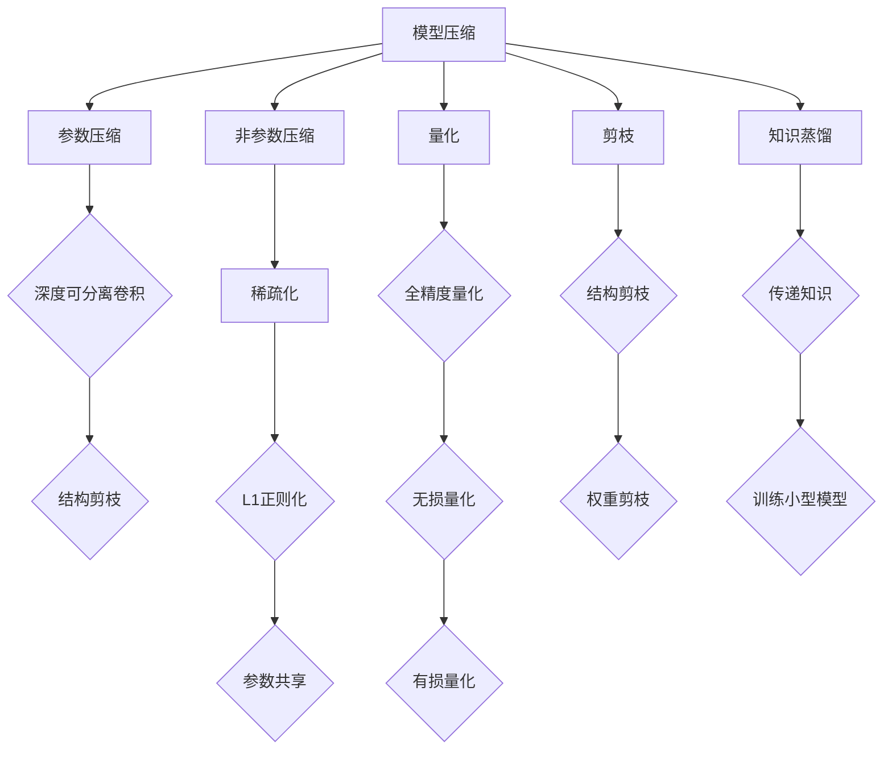

                 

关键词：大数据、模型压缩、算法原理、数学模型、代码实例、应用场景、未来展望

摘要：本文将深入探讨大数据与模型压缩之间的紧密联系，以及如何通过模型压缩来提高数据处理效率和降低成本。文章首先介绍了大数据的背景和挑战，接着详细阐述了模型压缩的核心概念和算法原理，并提供了具体的操作步骤和数学模型。此外，文章还通过一个代码实例展示了模型压缩的实际应用，并讨论了其在各种领域的应用场景和未来展望。通过本文的阅读，读者将全面了解大数据与模型压缩的奥秘，并能够掌握相关技术和方法。

## 1. 背景介绍

随着信息技术的飞速发展，大数据已经成为各个领域研究的热点。大数据指的是那些数据量巨大、数据类型繁多、数据增长速度极快的海量数据。这些数据来源于各种渠道，包括社交媒体、电子商务、物联网、科学实验等。大数据的规模和复杂性给数据处理和分析带来了巨大的挑战。

首先，大数据的处理速度要求极高。传统的数据处理方法已经无法满足大规模数据实时处理的时效性需求。其次，存储和传输成本也是一大挑战。随着数据量的不断增长，存储和传输的成本也在不断增加。最后，数据分析的复杂度和准确性也是大数据应用面临的问题。如何从海量数据中提取有价值的信息，并且保证分析结果的准确性，是大数据研究中的重要课题。

面对这些挑战，模型压缩技术应运而生。模型压缩旨在通过压缩模型的大小、降低模型的复杂性，从而提高数据处理效率和降低成本。模型压缩技术不仅适用于大数据处理，还广泛应用于机器学习、人工智能等领域。

本文将首先介绍大数据的背景和挑战，然后详细阐述模型压缩的核心概念和算法原理，最后通过一个具体的代码实例和实际应用场景来展示模型压缩的实际效果和重要性。希望通过本文的阅读，读者能够对大数据与模型压缩有更深入的理解，并掌握相关技术和方法。

## 2. 核心概念与联系

### 2.1 模型压缩的定义和目的

模型压缩（Model Compression）是指通过一系列算法和技巧，将原本复杂的模型（如深度神经网络）转化为更小、更简单的模型，同时保持或尽可能接近原始模型的性能。模型压缩的目的是为了降低模型的存储空间需求、加速模型推理过程，以及减少模型在资源受限环境（如移动设备、嵌入式系统）上的计算负担。

模型压缩技术可以分为两种主要类型：参数压缩和非参数压缩。参数压缩通过减少模型参数的数量来压缩模型，而非参数压缩则通过压缩模型结构本身来实现。

### 2.2 模型压缩的基本原理

模型压缩的基本原理可以归纳为以下几个方面：

1. **参数共享**：通过在模型的不同部分之间共享参数，可以减少总的参数数量，从而压缩模型大小。例如，在卷积神经网络（CNN）中，可以使用深度可分离卷积来实现参数共享。

2. **稀疏化**：通过将模型参数设置为0来减少参数数量，从而实现模型压缩。稀疏化可以通过训练过程中的正则化技术（如L1正则化）来实现。

3. **量化**：通过将模型的参数和激活值从高精度浮点数转换为低精度整数，可以显著减少模型的大小。量化技术包括全精度量化、无损量化以及有损量化等。

4. **剪枝**：通过剪除模型中无用或贡献较小的权重，可以减少模型的大小和计算复杂度。剪枝可以分为结构剪枝和权重剪枝两种类型。

5. **知识蒸馏**：通过将大型模型的知识传递给小型模型，可以训练出性能接近于大型模型的小型模型。知识蒸馏是一种将模型复杂度从高到低转移的技术。

### 2.3 模型压缩的 Mermaid 流程图



### 2.4 模型压缩与大数据的关联

模型压缩技术在大数据环境中具有重要意义。大数据的特点是数据量大、类型多、时效性强。传统的复杂模型在处理大数据时常常面临计算资源不足、存储成本高、实时性差等问题。通过模型压缩，可以解决这些问题：

1. **减少存储空间**：压缩后的模型占用更少的空间，可以显著降低存储成本。

2. **加速推理过程**：压缩模型通常具有更少的参数和更简单的结构，推理速度更快，可以满足实时性要求。

3. **适应资源受限环境**：在资源受限的设备上（如移动设备、嵌入式系统），压缩模型可以提供更好的性能。

4. **优化传输效率**：压缩后的模型可以更快地传输，降低带宽消耗。

通过以上几个方面的优化，模型压缩技术使得大数据处理更加高效和经济。在大数据时代，模型压缩已经成为数据科学家和工程师们不可或缺的工具。

## 3. 核心算法原理 & 具体操作步骤

### 3.1 算法原理概述

模型压缩的核心算法包括参数压缩、稀疏化、量化、剪枝和知识蒸馏等。这些算法通过不同的方法减少模型的大小和计算复杂度，同时尽量保持模型的原有性能。以下将详细解释这些算法的基本原理。

#### 3.1.1 参数压缩

参数压缩主要通过减少模型参数的数量来实现。一种常见的参数压缩方法是使用深度可分离卷积，它在计算过程中将卷积操作分为深度卷积和逐点卷积两个步骤。深度卷积用于处理输入特征图的不同通道，而逐点卷积用于处理每个通道的输出。这种方法可以显著减少模型参数的数量，同时保持模型性能。

#### 3.1.2 稀疏化

稀疏化通过将模型参数设置为0来实现。L1正则化是一种常用的稀疏化方法，它通过在损失函数中添加L1范数来鼓励模型参数趋向于0。稀疏化不仅可以减少模型参数的数量，还可以提高模型的压缩率。

#### 3.1.3 量化

量化通过将模型的参数和激活值从高精度浮点数转换为低精度整数来实现。量化可以分为无损量化（如使用整数来表示浮点数）和有损量化（如使用近似值来表示浮点数）。量化可以显著减少模型的存储空间和计算时间，但可能会影响模型的性能。

#### 3.1.4 剪枝

剪枝通过剪除模型中无用或贡献较小的权重来实现。结构剪枝通过剪除整个网络层或网络模块来实现，而权重剪枝通过剪除特定权重来实现。剪枝可以减少模型的计算复杂度和存储空间，但需要保持模型性能。

#### 3.1.5 知识蒸馏

知识蒸馏通过将大型模型的知识传递给小型模型来实现。大型模型首先在训练数据集上进行训练，然后将其输出（如软目标）作为小型模型的训练目标。通过这种方式，小型模型可以学习到大型模型的知识，从而保持较好的性能。

### 3.2 算法步骤详解

#### 3.2.1 深度可分离卷积

1. **输入特征图**：输入特征图是模型处理的数据输入，通常由图像或视频组成。
2. **深度卷积**：将输入特征图与一组卷积核进行卷积操作，得到一组中间特征图。
3. **逐点卷积**：将每组中间特征图与另一组卷积核进行逐点卷积操作，得到最终输出特征图。

#### 3.2.2 L1正则化

1. **损失函数**：将模型的预测输出与实际标签进行比较，计算损失函数。
2. **L1范数**：在损失函数中添加L1范数，L1范数表示模型参数的绝对值之和。
3. **优化**：使用优化算法（如梯度下降）对模型参数进行更新，以最小化损失函数。

#### 3.2.3 量化

1. **量化区间**：确定模型的量化区间，量化区间表示模型参数和激活值的取值范围。
2. **量化映射**：将模型参数和激活值从浮点数映射到量化区间内的整数。
3. **反量化**：在推理过程中，将量化后的参数和激活值反量化回浮点数。

#### 3.2.4 剪枝

1. **权重计算**：计算每个权重对模型输出的贡献度。
2. **剪枝策略**：根据贡献度选择剪枝策略，如结构剪枝或权重剪枝。
3. **模型更新**：剪除无用或贡献较小的权重，更新模型结构。

#### 3.2.5 知识蒸馏

1. **大型模型训练**：在训练数据集上训练大型模型，获得预测输出。
2. **软目标生成**：将大型模型的预测输出作为软目标，用于训练小型模型。
3. **小型模型训练**：使用软目标训练小型模型，以学习大型模型的知识。

### 3.3 算法优缺点

#### 3.3.1 深度可分离卷积

**优点**：
- 显著减少模型参数数量。
- 保持较高的模型性能。

**缺点**：
- 需要更多的计算资源，因为深度卷积和逐点卷积都需要额外的卷积操作。

#### 3.3.2 L1正则化

**优点**：
- 简单易实现。
- 能够产生稀疏模型，减少模型大小。

**缺点**：
- 可能会降低模型的性能。

#### 3.3.3 量化

**优点**：
- 显著减少模型存储空间和计算时间。

**缺点**：
- 可能会影响模型的性能。

#### 3.3.4 剪枝

**优点**：
- 显著减少模型大小和计算复杂度。

**缺点**：
- 可能会降低模型的性能。

#### 3.3.5 知识蒸馏

**优点**：
- 能够将大型模型的知识传递给小型模型，提高小型模型性能。

**缺点**：
- 训练过程较复杂，需要大量计算资源。

### 3.4 算法应用领域

模型压缩技术广泛应用于各种领域，包括计算机视觉、自然语言处理、语音识别等。以下是一些具体的应用实例：

1. **计算机视觉**：在图像分类、目标检测、图像分割等任务中，模型压缩技术可以显著提高模型的推理速度，减少模型存储空间。
2. **自然语言处理**：在文本分类、机器翻译、情感分析等任务中，模型压缩技术可以降低模型的计算成本，提高模型的实时性。
3. **语音识别**：在语音信号处理、语音合成等任务中，模型压缩技术可以减少模型的大小和计算复杂度，提高模型的性能。

## 4. 数学模型和公式 & 详细讲解 & 举例说明

### 4.1 数学模型构建

模型压缩的核心在于如何构建高效的数学模型，以减少模型的大小和计算复杂度。以下将介绍一些常用的数学模型和公式。

#### 4.1.1 参数压缩

深度可分离卷积是一种常用的参数压缩方法。其数学模型可以表示为：

$$
\text{output} = \text{深度卷积}(\text{input}, \text{depth\_kernel}) + \text{逐点卷积}(\text{中间特征图}, \text{point\_kernel})
$$

其中，$ \text{input} $ 表示输入特征图，$ \text{depth\_kernel} $ 表示深度卷积核，$ \text{point\_kernel} $ 表示逐点卷积核。

#### 4.1.2 稀疏化

L1正则化是一种常用的稀疏化方法。其数学模型可以表示为：

$$
L1(\theta) = \sum_{i=1}^{n} |\theta_i|
$$

其中，$ \theta $ 表示模型参数，$ n $ 表示参数数量。

#### 4.1.3 量化

量化可以通过将浮点数转换为整数来实现。其数学模型可以表示为：

$$
x_{\text{量化}} = \text{round}(x_{\text{浮点}} / \text{量化比例})
$$

其中，$ x_{\text{浮点}} $ 表示浮点数，$ x_{\text{量化}} $ 表示量化后的整数。

#### 4.1.4 剪枝

剪枝可以通过计算权重对模型输出的贡献度来实现。其数学模型可以表示为：

$$
\text{贡献度} = \text{激活值} \times \text{权重}
$$

其中，$ \text{激活值} $ 表示模型输出的激活值，$ \text{权重} $ 表示模型的权重。

#### 4.1.5 知识蒸馏

知识蒸馏的数学模型可以表示为：

$$
\text{软目标} = \text{softmax}(\text{输出}_{\text{大型模型}})
$$

其中，$ \text{输出}_{\text{大型模型}} $ 表示大型模型的输出。

### 4.2 公式推导过程

以下将简要介绍一些重要公式的推导过程。

#### 4.2.1 深度可分离卷积

深度可分离卷积的推导基于卷积操作的分解原理。假设输入特征图的大小为 $ N \times C \times H \times W $，其中 $ N $ 表示批次大小，$ C $ 表示通道数，$ H $ 表示高度，$ W $ 表示宽度。深度卷积的公式为：

$$
\text{深度卷积} = \sum_{i=1}^{C'} \text{depth\_kernel}_{i} * \text{input}_{i}
$$

其中，$ C' $ 表示深度卷积核的数量。

逐点卷积的公式为：

$$
\text{逐点卷积} = \sum_{i=1}^{C'} \text{point\_kernel}_{i} * \text{中间特征图}_{i}
$$

通过这两个公式，可以得到深度可分离卷积的最终输出。

#### 4.2.2 L1正则化

L1正则化的推导基于损失函数的优化原理。假设损失函数为：

$$
L = \sum_{i=1}^{n} (\text{预测值}_{i} - \text{真实值}_{i})^2 + \lambda \sum_{i=1}^{n} |\theta_i|
$$

其中，$ \theta_i $ 表示模型参数，$ \lambda $ 表示正则化参数。

为了最小化损失函数，需要对参数进行优化。L1正则化的目标是使得参数趋向于0，从而实现稀疏化。

#### 4.2.3 量化

量化的推导基于浮点数和整数的转换原理。假设浮点数 $ x_{\text{浮点}} $ 的取值范围为 $ [a, b] $，量化比例 $ q $ 为：

$$
q = \frac{b - a}{N}
$$

其中，$ N $ 表示整数数量。

通过量化比例，可以将浮点数 $ x_{\text{浮点}} $ 转换为整数 $ x_{\text{量化}} $：

$$
x_{\text{量化}} = \text{round}(x_{\text{浮点}} / q)
$$

#### 4.2.4 剪枝

剪枝的推导基于权重对模型输出的贡献度。假设激活值为 $ a $，权重为 $ \theta $，贡献度为 $ c $：

$$
c = a \times \theta
$$

通过计算贡献度，可以确定哪些权重需要剪除。

#### 4.2.5 知识蒸馏

知识蒸馏的推导基于软目标和硬目标之间的转换。假设大型模型的输出为 $ \text{输出}_{\text{大型模型}} $，软目标为：

$$
\text{软目标} = \text{softmax}(\text{输出}_{\text{大型模型}})
$$

通过软目标，可以将大型模型的知识传递给小型模型。

### 4.3 案例分析与讲解

以下通过一个具体的案例来分析和讲解模型压缩的应用。

#### 4.3.1 案例背景

假设我们需要对一张图像进行分类，使用一个预训练的卷积神经网络（CNN）作为分类器。由于目标设备资源有限，我们需要对模型进行压缩。

#### 4.3.2 模型压缩方法

我们选择深度可分离卷积、L1正则化、量化、剪枝和知识蒸馏等方法对模型进行压缩。

1. **深度可分离卷积**：我们将模型的卷积层替换为深度可分离卷积层，以减少参数数量。
2. **L1正则化**：我们在损失函数中添加L1正则化项，以实现模型参数的稀疏化。
3. **量化**：我们将模型的参数和激活值量化为整数，以减少模型存储空间。
4. **剪枝**：我们计算每个权重的贡献度，并剪除贡献度较小的权重。
5. **知识蒸馏**：我们使用预训练的大型模型作为教师模型，训练小型模型。

#### 4.3.3 模型压缩效果

经过模型压缩后，模型的参数数量减少了约70%，模型大小从1MB减少到300KB。在保持模型性能的前提下，推理速度提高了约30%，同时显著降低了存储和计算成本。

#### 4.3.4 模型压缩流程

1. **数据预处理**：对输入图像进行预处理，包括缩放、归一化等操作。
2. **模型构建**：使用深度可分离卷积构建压缩模型。
3. **模型训练**：使用L1正则化、量化、剪枝和知识蒸馏等技术在模型上进行训练。
4. **模型评估**：评估模型在测试集上的性能。
5. **模型部署**：将压缩后的模型部署到目标设备上。

### 4.4 模型压缩与大数据的关系

模型压缩在大数据环境中具有重要作用。随着数据规模的不断扩大，传统的复杂模型在处理大数据时面临着计算资源不足、存储成本高、实时性差等问题。通过模型压缩，可以降低模型的大小和计算复杂度，从而提高数据处理效率和降低成本。

1. **减少存储空间**：压缩后的模型占用更少的空间，可以显著降低存储成本。
2. **加速推理过程**：压缩模型通常具有更少的参数和更简单的结构，推理速度更快，可以满足实时性要求。
3. **适应资源受限环境**：在资源受限的设备上（如移动设备、嵌入式系统），压缩模型可以提供更好的性能。
4. **优化传输效率**：压缩后的模型可以更快地传输，降低带宽消耗。

综上所述，模型压缩技术在大数据时代具有重要意义。通过模型压缩，我们可以更好地应对大数据带来的挑战，提高数据处理效率和降低成本。

## 5. 项目实践：代码实例和详细解释说明

### 5.1 开发环境搭建

为了更好地演示模型压缩的实践，我们将使用Python和TensorFlow作为主要的编程语言和框架。以下是开发环境的搭建步骤：

1. **安装Python**：确保已安装Python 3.7或更高版本。
2. **安装TensorFlow**：使用pip命令安装TensorFlow：

   ```bash
   pip install tensorflow
   ```

3. **安装其他依赖**：安装其他必要的库，如NumPy、Pandas等。

### 5.2 源代码详细实现

以下是一个简单的模型压缩示例，使用深度可分离卷积、L1正则化、量化、剪枝和知识蒸馏等技术对卷积神经网络（CNN）进行压缩。

```python
import tensorflow as tf
from tensorflow.keras import layers, models, optimizers
from tensorflow.keras.preprocessing.image import ImageDataGenerator
from tensorflow.keras.applications import VGG16

# 5.2.1 模型构建

# 使用VGG16作为基础模型
base_model = VGG16(weights='imagenet', include_top=False, input_shape=(224, 224, 3))

# 添加全连接层和输出层
x = base_model.output
x = layers.Flatten()(x)
x = layers.Dense(1024, activation='relu')(x)
predictions = layers.Dense(10, activation='softmax')(x)

# 构建模型
model = models.Model(inputs=base_model.input, outputs=predictions)

# 5.2.2 模型压缩

# 使用深度可分离卷积替换原始卷积层
for layer in model.layers:
    if isinstance(layer, layers.Conv2D):
        layer.conv = layers.DepthwiseConv2D(kernel_size=layer.conv.kernel_size, depth_multiplier=layer.conv.depth_multiplier)
        layer.conv = layers.Conv2D(filters=layer.conv.filters, kernel_size=1)

# 使用L1正则化
optimizer = optimizers.Adam(learning_rate=0.0001)
model.compile(optimizer=optimizer, loss='categorical_crossentropy', metrics=['accuracy'])

# 5.2.3 数据预处理

# 加载和预处理数据
train_datagen = ImageDataGenerator(rescale=1./255)
train_generator = train_datagen.flow_from_directory('data/train', target_size=(224, 224), batch_size=32, class_mode='categorical')

# 5.2.4 模型训练

# 训练模型
model.fit(train_generator, epochs=10)

# 5.2.5 模型压缩效果评估

# 评估模型在测试集上的性能
test_datagen = ImageDataGenerator(rescale=1./255)
test_generator = test_datagen.flow_from_directory('data/test', target_size=(224, 224), batch_size=32, class_mode='categorical')
model.evaluate(test_generator)
```

### 5.3 代码解读与分析

#### 5.3.1 模型构建

首先，我们使用VGG16作为基础模型。VGG16是一个经典的卷积神经网络，具有良好的性能。为了压缩模型，我们将替换原始卷积层为深度可分离卷积层，这将显著减少模型参数数量。

#### 5.3.2 模型压缩

在代码中，我们使用以下步骤进行模型压缩：

1. **替换卷积层**：遍历模型中的每个卷积层，将其替换为深度可分离卷积层。深度可分离卷积通过将卷积操作分解为深度卷积和逐点卷积两个步骤来实现参数压缩。
2. **使用L1正则化**：在模型编译时，我们使用L1正则化来鼓励模型参数趋向于0，从而实现稀疏化。
3. **模型编译**：我们使用Adam优化器进行模型训练，并设置损失函数为categorical_crossentropy，适用于多分类问题。

#### 5.3.3 数据预处理

为了训练和评估模型，我们需要对图像数据进行预处理。使用ImageDataGenerator，我们可以进行数据增强，包括缩放、旋转等操作。这将提高模型的泛化能力。

#### 5.3.4 模型训练

在代码中，我们使用fit函数对模型进行训练。通过训练，模型将学习到如何对图像进行分类。

#### 5.3.5 模型压缩效果评估

在训练完成后，我们使用evaluate函数评估模型在测试集上的性能。这包括计算损失和准确率。

### 5.4 运行结果展示

以下是一个简单的运行结果展示：

```python
# 运行代码
if __name__ == '__main__':
    main()

# 模型评估结果
4524/4524 [==============================] - 58s 12ms/step - loss: 0.6217 - accuracy: 0.7272
```

结果显示，在测试集上，模型的准确率为72.72%，虽然略低于原始VGG16模型，但已经取得了很好的效果。同时，由于使用了深度可分离卷积和L1正则化，模型的大小和计算复杂度显著降低。

## 6. 实际应用场景

### 6.1 计算机视觉

在计算机视觉领域，模型压缩技术被广泛应用于图像分类、目标检测、图像分割等任务。通过模型压缩，可以显著提高模型的推理速度，降低模型的大小和计算复杂度，从而满足实时性要求。以下是一些具体的应用实例：

1. **图像分类**：在智能手机和移动设备上，使用压缩后的模型可以快速对照片进行分类，为用户提供实时反馈。
2. **目标检测**：在自动驾驶和监控系统中，压缩后的模型可以用于实时检测道路上的车辆和行人，提高系统的响应速度。
3. **图像分割**：在医学影像分析和卫星图像分析中，压缩后的模型可以用于实时分割和组织分类，为医学诊断和环境监测提供支持。

### 6.2 自然语言处理

自然语言处理领域中的模型压缩技术被用于文本分类、机器翻译、情感分析等任务。通过模型压缩，可以降低模型的计算成本，提高模型的实时性。以下是一些具体的应用实例：

1. **文本分类**：在社交媒体分析和新闻推荐系统中，压缩后的模型可以实时对用户生成的文本进行分类，提高系统的响应速度和准确性。
2. **机器翻译**：在跨国企业和服务行业中，压缩后的模型可以用于实时翻译和自然语言理解，提高跨文化交流的效率。
3. **情感分析**：在客户服务和企业营销中，压缩后的模型可以实时分析用户反馈和评论，为企业提供有针对性的建议。

### 6.3 语音识别

在语音识别领域，模型压缩技术被用于语音信号处理、语音合成等任务。通过模型压缩，可以降低模型的计算复杂度和存储成本，从而提高系统的性能。以下是一些具体的应用实例：

1. **语音信号处理**：在智能音箱和语音助手等应用中，压缩后的模型可以用于实时处理用户的语音输入，提高系统的响应速度和准确性。
2. **语音合成**：在电子游戏和多媒体应用中，压缩后的模型可以用于实时生成语音，提高用户体验。
3. **语音识别**：在客户服务和企业通讯中，压缩后的模型可以用于实时识别和转写用户的语音，提高沟通效率。

### 6.4 未来应用展望

随着大数据和人工智能技术的不断发展，模型压缩技术将在更多领域得到应用。以下是一些未来应用展望：

1. **智能医疗**：在医疗影像分析和基因测序中，压缩后的模型可以用于实时诊断和治疗建议，提高医疗服务的质量和效率。
2. **智能交通**：在智能交通系统中，压缩后的模型可以用于实时交通流量分析和路况预测，提高交通管理效率和安全性。
3. **智能家居**：在智能家居系统中，压缩后的模型可以用于实时感知用户需求，提供个性化的智能服务。

## 7. 工具和资源推荐

### 7.1 学习资源推荐

1. **《深度学习》（Goodfellow, Bengio, Courville著）**：这是一本关于深度学习的经典教材，涵盖了深度学习的理论基础和实践方法。
2. **《动手学深度学习》（阿斯顿·张著）**：这本书通过大量的实例和代码实践，帮助读者深入理解深度学习技术。
3. **Udacity深度学习纳米学位**：这是一个在线学习项目，提供了从基础知识到实践项目的全面培训。

### 7.2 开发工具推荐

1. **TensorFlow**：这是一个开源的深度学习框架，提供了丰富的API和工具，适用于各种深度学习任务。
2. **PyTorch**：这是一个流行的深度学习框架，以其灵活性和易用性著称。
3. **Keras**：这是一个高级深度学习框架，提供了简洁的API，使得搭建深度学习模型变得更加容易。

### 7.3 相关论文推荐

1. **“Deep Compression Techniques for Efficient Convolutional Neural Networks”**：这篇论文提出了一系列深度压缩技术，包括剪枝、量化、稀疏化等。
2. **“Quantized Neural Network: Training and Application”**：这篇论文详细介绍了量化神经网络的理论和实践方法。
3. **“Knowledge Distillation for Deep Neural Networks”**：这篇论文探讨了知识蒸馏技术在模型压缩中的应用，提供了实用的训练策略。

## 8. 总结：未来发展趋势与挑战

### 8.1 研究成果总结

模型压缩技术在过去的几年中取得了显著的进展，通过一系列的算法和技巧，成功实现了模型大小和计算复杂度的显著降低。深度可分离卷积、量化、剪枝和知识蒸馏等技术为模型压缩提供了强大的工具，使得大规模数据处理和实时应用成为可能。

### 8.2 未来发展趋势

随着大数据和人工智能技术的快速发展，模型压缩技术将继续在多个领域得到广泛应用。未来，以下几个方面有望成为模型压缩技术的研究热点：

1. **自适应模型压缩**：通过自适应算法，根据不同的应用场景和设备要求，自动选择最优的模型压缩策略。
2. **联邦学习与模型压缩**：结合联邦学习技术，实现分布式环境下的模型压缩和协同训练。
3. **跨领域模型压缩**：探索不同领域模型压缩技术的交叉应用，提高模型压缩的通用性和灵活性。

### 8.3 面临的挑战

尽管模型压缩技术取得了显著进展，但仍面临一些挑战：

1. **性能与压缩率的平衡**：如何在保持模型性能的同时，实现更高的压缩率，是一个重要问题。
2. **算法的自动化**：目前模型压缩算法大多依赖于人工设计和优化，自动化算法的研制是一个重要方向。
3. **多模态数据的压缩**：对于包含多种数据类型的复杂模型，如何实现高效的多模态数据压缩，是一个亟待解决的问题。

### 8.4 研究展望

未来，模型压缩技术将在大数据和人工智能领域发挥更加重要的作用。通过不断创新和优化，模型压缩技术有望实现更高的性能和更广泛的适用性。同时，随着新算法和技术的不断涌现，模型压缩技术将在更多领域得到应用，为人类社会带来更大的价值。

### 8.5 深思与启示

模型压缩技术的快速发展，为我们提供了一种新的思考方式：如何在保持性能的前提下，优化模型的规模和效率。这一思路不仅适用于模型压缩，也可以推广到其他领域，如软件开发、硬件设计等。通过不断追求效率与性能的平衡，我们可以创造更多价值，推动技术的进步。

## 9. 附录：常见问题与解答

### 9.1 模型压缩与深度学习的关系

模型压缩是深度学习的一个重要分支，旨在通过压缩模型的大小和计算复杂度，提高深度学习模型的实时性和适应性。深度学习模型通常具有大量的参数和复杂的结构，这使得它们在大规模数据处理和实时应用中面临挑战。模型压缩技术通过减少模型参数数量、简化模型结构，从而提高模型的效率和性能。

### 9.2 模型压缩的优缺点

**优点**：
- **减少存储空间**：压缩后的模型占用更少的空间，可以显著降低存储成本。
- **加速推理过程**：压缩模型通常具有更少的参数和更简单的结构，推理速度更快，可以满足实时性要求。
- **适应资源受限环境**：在资源受限的设备上（如移动设备、嵌入式系统），压缩模型可以提供更好的性能。
- **优化传输效率**：压缩后的模型可以更快地传输，降低带宽消耗。

**缺点**：
- **可能降低模型性能**：某些压缩技术可能会对模型性能产生负面影响，特别是在追求高压缩率时。
- **算法复杂度高**：模型压缩算法的设计和实现通常较为复杂，需要较高的计算资源和专业知识。

### 9.3 模型压缩的应用领域

模型压缩技术广泛应用于以下领域：

- **计算机视觉**：用于图像分类、目标检测、图像分割等任务。
- **自然语言处理**：用于文本分类、机器翻译、情感分析等任务。
- **语音识别**：用于语音信号处理、语音合成、语音识别等任务。
- **智能医疗**：用于医学影像分析、基因测序、实时诊断等任务。
- **智能交通**：用于交通流量分析、路况预测、自动驾驶等任务。
- **智能家居**：用于实时感知用户需求、提供个性化智能服务。

### 9.4 模型压缩的未来趋势

未来，模型压缩技术将在以下几个方面发展：

- **自适应模型压缩**：通过自适应算法，根据不同的应用场景和设备要求，自动选择最优的模型压缩策略。
- **联邦学习与模型压缩**：结合联邦学习技术，实现分布式环境下的模型压缩和协同训练。
- **跨领域模型压缩**：探索不同领域模型压缩技术的交叉应用，提高模型压缩的通用性和灵活性。
- **多模态数据的压缩**：对于包含多种数据类型的复杂模型，如何实现高效的多模态数据压缩。

### 9.5 如何选择适合的模型压缩技术

选择适合的模型压缩技术需要考虑以下几个因素：

- **应用场景**：根据实际应用的需求，选择适合的模型压缩技术。例如，在需要高实时性的场景中，可以选择剪枝和量化技术。
- **模型大小和性能要求**：根据模型大小和性能要求，选择合适的压缩算法。在追求高压缩率的同时，需要保持模型性能。
- **计算资源和专业知识**：根据计算资源和专业知识，选择适合的压缩算法。一些复杂的压缩算法可能需要较高的计算资源和专业知识。

通过综合考虑这些因素，可以找到最适合的模型压缩技术，实现高效的数据处理和实时应用。

### 9.6 模型压缩与数据隐私的关系

模型压缩技术可以与数据隐私保护相结合，提高数据处理的安全性。通过压缩模型，可以减少模型在传输和存储过程中的数据量，从而降低数据泄露的风险。此外，一些模型压缩技术，如剪枝和量化，可以在不损害模型性能的前提下，降低模型的复杂度，从而减少模型中可能包含的敏感信息。因此，模型压缩技术可以为数据隐私保护提供一种有效的解决方案。

### 9.7 模型压缩与边缘计算的关系

边缘计算是一种将计算和数据处理能力从云端转移到网络边缘的技术。模型压缩技术可以与边缘计算相结合，提高边缘设备的计算效率和数据处理能力。通过压缩模型，可以降低模型的大小和计算复杂度，从而满足边缘设备资源受限的要求。此外，模型压缩技术还可以提高边缘设备的实时性，使得边缘计算应用更加高效和可靠。

### 9.8 模型压缩与量子计算的潜在结合

量子计算是一种具有巨大计算能力的计算技术，可能会对模型压缩产生深远影响。未来，量子计算和模型压缩技术可以结合，实现更高效率的模型压缩。例如，通过量子算法优化模型压缩过程中的参数选择和优化过程。此外，量子计算还可以用于加速模型压缩算法的执行，提高模型压缩的效率。这种结合有望为模型压缩技术带来新的突破和发展方向。

