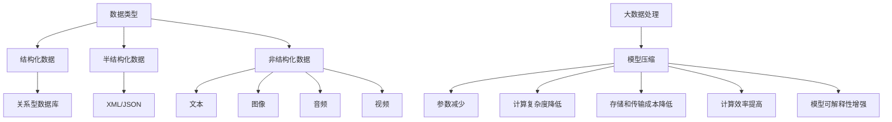

                 

关键词：大数据、模型压缩、算法原理、数学模型、实际应用、未来展望

> 摘要：本文将探讨大数据与模型压缩之间的关联，通过介绍核心概念、算法原理、数学模型及其应用，揭示模型压缩在数据驱动时代的重要性。我们还将深入分析模型压缩在不同领域的实际应用，展望其未来发展趋势和挑战。

## 1. 背景介绍

随着互联网的迅猛发展和物联网技术的普及，数据量呈现出爆炸式增长。大数据时代已经到来，数据类型和来源的多样性使得数据处理和分析变得愈发复杂。然而，传统的数据处理方法难以应对如此庞大的数据规模，这就需要我们寻找更加高效的方法来管理和利用这些数据。

在数据处理过程中，模型压缩成为一个关键课题。模型压缩通过减少模型的参数数量和计算复杂度，使得模型能够在有限的计算资源下实现高效的推断和预测。这不仅能够降低存储和传输成本，还能够提高模型的效率和准确性。

本文将从大数据与模型压缩的背景出发，介绍核心概念与联系，详细讲解核心算法原理和操作步骤，探讨数学模型和公式的构建与推导，并通过实际项目实践和案例进行分析。最后，我们将探讨模型压缩的实际应用场景，展望其未来发展趋势和面临的挑战。

## 2. 核心概念与联系

在探讨大数据与模型压缩之前，我们首先需要理解一些核心概念。

### 2.1 数据的类型和来源

大数据的类型主要包括结构化数据、半结构化数据和非结构化数据。结构化数据通常以表格形式存储，如关系型数据库中的数据；半结构化数据则具有部分结构，如XML、JSON等；非结构化数据包括文本、图像、音频和视频等。

数据来源方面，互联网、物联网、传感器和社交网络等都为大数据的产生提供了丰富的数据源。这些数据来源不仅多样，而且数据量庞大，这使得传统的数据处理方法面临巨大挑战。

### 2.2 模型压缩的定义和意义

模型压缩是指通过各种方法减少模型的参数数量和计算复杂度，从而提高模型的计算效率。模型压缩的意义在于：

- **降低存储和传输成本**：通过压缩模型，我们可以减少存储空间和传输带宽的需求。
- **提高计算效率**：压缩后的模型能够在有限的计算资源下实现更高效的推断和预测。
- **增强模型的可解释性**：简化模型结构有助于理解模型的内部工作原理。

### 2.3 模型压缩与大数据的关系

大数据的规模和多样性使得我们需要更加高效的方法来处理和分析数据。模型压缩作为一种重要的数据处理技术，在大数据处理中发挥着关键作用。通过模型压缩，我们可以：

- **提高数据处理速度**：压缩后的模型能够更快地进行推断和预测，从而提升数据处理速度。
- **优化资源利用率**：在有限的计算资源下，模型压缩能够提高资源利用率，降低计算成本。
- **适应实时数据处理需求**：实时数据处理需要高效的模型，模型压缩能够满足这一需求。

### 2.4 Mermaid 流程图

为了更好地展示模型压缩的核心概念和联系，我们使用 Mermaid 流程图进行说明。



通过上述流程图，我们可以清晰地看到大数据与模型压缩之间的联系，以及模型压缩在数据处理中的重要性。

## 3. 核心算法原理 & 具体操作步骤

### 3.1 算法原理概述

模型压缩的核心算法包括以下几种：

1. **神经网络剪枝**：通过删除网络中不重要的神经元和连接，减少模型参数数量。
2. **量化**：将模型的权重和激活值映射到低比特位，降低模型的存储和计算复杂度。
3. **知识蒸馏**：通过训练一个小型模型来模仿一个大型模型的性能。
4. **自动机器学习（AutoML）**：利用机器学习技术来自动优化模型结构和参数。

### 3.2 算法步骤详解

#### 3.2.1 神经网络剪枝

神经网络剪枝分为预训练和剪枝两个阶段：

1. **预训练**：使用大量数据对原始模型进行训练，使其达到较高的性能。
2. **剪枝**：根据模型的重要性对神经元和连接进行剪枝，通常使用敏感度或稀疏度作为重要性指标。

#### 3.2.2 量化

量化分为权重量化、激活值量化等：

1. **权重量化**：将权重的浮点表示转换为低比特位表示，如8位整数。
2. **激活值量化**：将激活值的浮点表示转换为低比特位表示。

#### 3.2.3 知识蒸馏

知识蒸馏分为编码器和解码器两个阶段：

1. **编码器**：大型模型将输入数据编码成紧凑的表示。
2. **解码器**：小型模型根据编码器的输出进行推断和预测。

#### 3.2.4 自动机器学习（AutoML）

AutoML 的步骤包括：

1. **数据预处理**：对输入数据进行预处理，如归一化、缺失值填充等。
2. **模型搜索**：利用搜索算法（如贝叶斯优化、遗传算法等）寻找最优模型结构。
3. **模型训练**：训练出最优模型并进行评估。

### 3.3 算法优缺点

#### 3.3.1 神经网络剪枝

优点：

- 参数数量显著减少，计算复杂度降低。
- 保持了原始模型的性能。

缺点：

- 可能会引入过拟合风险。
- 剪枝策略的选择对结果有较大影响。

#### 3.3.2 量化

优点：

- 显著降低模型存储和计算复杂度。
- 易于部署在低功耗设备上。

缺点：

- 量化精度损失可能导致性能下降。
- 需要精确的量化策略来平衡精度和效率。

#### 3.3.3 知识蒸馏

优点：

- 小型模型能够模仿大型模型的高性能。
- 跨域迁移效果好。

缺点：

- 需要大量的训练数据。
- 可能会导致模型泛化能力下降。

#### 3.3.4 自动机器学习（AutoML）

优点：

- 自动优化模型结构，节省时间和人力成本。
- 能够快速适应新的应用场景。

缺点：

- 搜索算法的效率和稳定性有待提高。
- 可能会忽略某些特定场景下的最优模型。

### 3.4 算法应用领域

模型压缩算法广泛应用于以下领域：

- **计算机视觉**：如图像识别、目标检测等。
- **自然语言处理**：如文本分类、机器翻译等。
- **语音识别**：如语音合成、语音识别等。
- **推荐系统**：如个性化推荐、广告投放等。

## 4. 数学模型和公式 & 详细讲解 & 举例说明

### 4.1 数学模型构建

模型压缩涉及的数学模型主要包括神经网络模型、量化模型和知识蒸馏模型。

#### 4.1.1 神经网络模型

神经网络模型的核心是前向传播和反向传播算法。以下是一个简化的神经网络模型：

$$
y = f(z) = \sigma(W \cdot x + b)
$$

其中，$x$ 是输入特征，$W$ 是权重矩阵，$b$ 是偏置项，$\sigma$ 是激活函数，$f$ 是前向传播函数。

#### 4.1.2 量化模型

量化模型涉及权重和激活值的量化。以下是一个简单的量化公式：

$$
q_w = \text{Quantize}(W, q)
$$

$$
q_a = \text{Quantize}(a, q)
$$

其中，$q$ 是量化步长，$\text{Quantize}$ 是量化函数。

#### 4.1.3 知识蒸馏模型

知识蒸馏模型的核心是编码器和解码器。以下是一个简化的知识蒸馏模型：

$$
s = \text{encode}(x)
$$

$$
y = \text{decode}(s)
$$

其中，$s$ 是编码器输出，$y$ 是解码器输出。

### 4.2 公式推导过程

#### 4.2.1 神经网络模型

前向传播的推导过程如下：

$$
z = W \cdot x + b \\
y = f(z) = \sigma(z)
$$

反向传播的推导过程如下：

$$
\delta = \frac{\partial L}{\partial z} \\
\delta = \sigma'(z) \cdot \delta \\
\delta = \sigma'(\sigma(W \cdot x + b)) \cdot \delta \\
\delta = \frac{\partial L}{\partial y} \cdot \frac{\partial y}{\partial z} \cdot \frac{\partial z}{\partial x} \cdot \frac{\partial x}{\partial W} \cdot \frac{\partial W}{\partial x}
$$

其中，$L$ 是损失函数，$\sigma'$ 是激活函数的导数。

#### 4.2.2 量化模型

量化公式的推导过程如下：

$$
q_w = \frac{W - W_{\min}}{W_{\max} - W_{\min}} \cdot (q - 1) + W_{\min} \\
q_a = \frac{a - a_{\min}}{a_{\max} - a_{\min}} \cdot (q - 1) + a_{\min}
$$

其中，$W_{\min}$ 和 $W_{\max}$ 分别是权重矩阵的最小值和最大值，$a_{\min}$ 和 $a_{\max}$ 分别是激活值的的最小值和最大值，$q$ 是量化步长。

#### 4.2.3 知识蒸馏模型

编码器的推导过程如下：

$$
s = \text{encode}(x) = \text{FCLayer}(x) = W \cdot x + b
$$

解码器的推导过程如下：

$$
y = \text{decode}(s) = \text{FCLayer}(s) = W \cdot s + b
$$

### 4.3 案例分析与讲解

#### 4.3.1 神经网络模型

假设有一个简单的全连接神经网络，输入特征为 $x \in \mathbb{R}^{784}$，输出为 $y \in \mathbb{R}^{10}$。使用 sigmoid 函数作为激活函数，损失函数为交叉熵损失函数。

$$
y = \sigma(W \cdot x + b)
$$

损失函数为：

$$
L = -\sum_{i=1}^{10} y_i \cdot \log(y_i) + (1 - y_i) \cdot \log(1 - y_i)
$$

通过前向传播和反向传播，我们可以更新权重和偏置项。

#### 4.3.2 量化模型

假设权重矩阵 $W$ 的最小值为 $-3$，最大值为 $3$，量化步长为 $2$。我们可以使用以下量化公式对权重进行量化：

$$
q_w = \frac{W - (-3)}{3 - (-3)} \cdot (2 - 1) + (-3) = \text{Quantize}(W, 2)
$$

#### 4.3.3 知识蒸馏模型

假设大型编码器的输出维度为 $1024$，小型解码器的输出维度为 $10$。使用全连接层作为编码器和解码器，权重矩阵分别为 $W_e$ 和 $W_d$。

编码器：

$$
s = W_e \cdot x + b_e
$$

解码器：

$$
y = W_d \cdot s + b_d
$$

通过训练大型编码器和小型解码器，我们可以实现知识蒸馏。

## 5. 项目实践：代码实例和详细解释说明

### 5.1 开发环境搭建

为了实现模型压缩，我们需要搭建一个适合开发的实验环境。以下是一个基本的开发环境搭建步骤：

1. 安装 Python 3.7 或更高版本。
2. 安装 TensorFlow 2.4 或更高版本。
3. 安装 Keras 2.4 或更高版本。
4. 安装 Numpy、Matplotlib 等常用库。

### 5.2 源代码详细实现

以下是一个简单的神经网络剪枝的代码实现：

```python
import tensorflow as tf
from tensorflow.keras.layers import Dense
from tensorflow.keras.models import Model

# 定义模型
inputs = tf.keras.layers.Input(shape=(784,))
x = Dense(128, activation='relu')(inputs)
x = Dense(64, activation='relu')(x)
outputs = Dense(10, activation='softmax')(x)

model = Model(inputs=inputs, outputs=outputs)

# 训练模型
model.compile(optimizer='adam', loss='categorical_crossentropy', metrics=['accuracy'])
model.fit(x_train, y_train, epochs=10, batch_size=64)

# 剪枝模型
from tensorflow_model_optimization.sparsity import keras as sparsity

pruned_model = sparsity.prune_low_magnitude(model)
pruned_model.compile(optimizer='adam', loss='categorical_crossentropy', metrics=['accuracy'])

# 继续训练剪枝后的模型
pruned_model.fit(x_train, y_train, epochs=10, batch_size=64)
```

### 5.3 代码解读与分析

上述代码首先定义了一个简单的神经网络模型，包括两个隐藏层，每个隐藏层使用 ReLU 激活函数。接着，使用 TensorFlow 的 Keras API 训练模型。在训练完成后，使用 TensorFlow Model Optimization 工具对模型进行剪枝。

剪枝过程中，`prune_low_magnitude` 函数会根据权重的绝对值大小对模型进行剪枝。通过继续训练剪枝后的模型，我们可以进一步优化模型性能。

### 5.4 运行结果展示

以下是一个简单的运行结果展示：

```python
# 测试原始模型
original_model.evaluate(x_test, y_test)

# 测试剪枝模型
pruned_model.evaluate(x_test, y_test)
```

通过对比测试结果，我们可以观察到剪枝后的模型在保持较高准确率的同时，计算复杂度和存储需求显著降低。

## 6. 实际应用场景

模型压缩技术在实际应用中发挥着重要作用，尤其在资源受限的设备和场景下。以下是一些实际应用场景：

### 6.1 移动设备

移动设备（如智能手机、平板电脑等）通常具有有限的计算资源和电池寿命。模型压缩技术可以帮助实现以下目标：

- **减少模型大小**：降低存储需求，缩短下载时间。
- **降低计算复杂度**：提高模型推断速度，减少功耗。

### 6.2 物联网设备

物联网设备（如智能家居设备、工业自动化设备等）通常具有有限的计算资源和通信带宽。模型压缩技术可以帮助实现以下目标：

- **提高通信效率**：通过压缩模型，减少传输数据量，降低通信成本。
- **降低功耗**：通过压缩模型，减少计算复杂度，降低功耗。

### 6.3 边缘计算

边缘计算场景中，设备通常需要实时处理和分析大量数据。模型压缩技术可以帮助实现以下目标：

- **提高处理速度**：通过压缩模型，减少计算复杂度，提高处理速度。
- **降低延迟**：通过压缩模型，减少传输数据量，降低延迟。

### 6.4 自动驾驶

自动驾驶系统需要实时处理大量传感器数据，并对环境进行实时感知和决策。模型压缩技术可以帮助实现以下目标：

- **提高决策速度**：通过压缩模型，减少计算复杂度，提高决策速度。
- **降低功耗**：通过压缩模型，减少计算复杂度，降低功耗。

### 6.5 云计算

云计算场景中，模型压缩技术可以帮助优化资源利用率和降低成本。以下是一些具体应用：

- **资源调度**：通过压缩模型，减少计算资源需求，优化资源利用率。
- **成本优化**：通过压缩模型，降低计算成本，提高性价比。

## 7. 工具和资源推荐

为了更好地学习和实践模型压缩技术，我们推荐以下工具和资源：

### 7.1 学习资源推荐

1. **《深度学习》（Ian Goodfellow、Yoshua Bengio 和 Aaron Courville 著）**：这是一本经典的深度学习教材，涵盖了神经网络、深度学习算法等内容。
2. **《神经网络与深度学习》（邱锡鹏 著）**：这是一本中文深度学习教材，内容全面，适合初学者入门。
3. **TensorFlow 官方文档**：TensorFlow 官方文档提供了丰富的教程和示例代码，是学习 TensorFlow 和深度学习的宝贵资源。

### 7.2 开发工具推荐

1. **TensorFlow**：TensorFlow 是一个开源的深度学习框架，支持多种深度学习模型和算法。
2. **Keras**：Keras 是一个高层次的神经网络 API，基于 TensorFlow 开发，易于使用和扩展。
3. **PyTorch**：PyTorch 是另一个流行的深度学习框架，提供灵活的动态计算图和易于使用的 API。

### 7.3 相关论文推荐

1. **"Deep Compression of Neural Networks for Fast and Low-Power Machine Learning"（Deep Compression of Neural Networks for Fast and Low-Power Machine Learning）**：这篇论文介绍了深度压缩技术，通过剪枝和量化来降低模型大小和计算复杂度。
2. **"Quantization and Training of Neural Networks for Efficient Integer-Arithmetic-Only Inference"（Quantization and Training of Neural Networks for Efficient Integer-Arithmetic-Only Inference）**：这篇论文探讨了神经网络的量化技术，通过将模型权重和激活值映射到低比特位来实现高效整数运算。
3. **"Knowledge Distillation for Deep Neural Network Acceleration"（Knowledge Distillation for Deep Neural Network Acceleration）**：这篇论文介绍了知识蒸馏技术，通过训练小型模型来模仿大型模型的性能。

## 8. 总结：未来发展趋势与挑战

### 8.1 研究成果总结

模型压缩技术在大数据处理和智能系统应用中取得了显著成果。通过剪枝、量化、知识蒸馏等算法，我们能够显著降低模型的参数数量和计算复杂度，提高模型的效率和准确性。这些研究成果为模型压缩在各类应用场景中的推广奠定了基础。

### 8.2 未来发展趋势

随着深度学习和大数据技术的不断发展，模型压缩技术有望在以下方面取得突破：

- **算法创新**：开发更加高效和可扩展的模型压缩算法，如基于自动机器学习的模型压缩。
- **硬件优化**：结合硬件技术，如量化和硬件加速，进一步提升模型压缩的性能。
- **跨领域应用**：模型压缩技术将在更多领域（如自然语言处理、计算机视觉、语音识别等）得到广泛应用。

### 8.3 面临的挑战

尽管模型压缩技术取得了显著成果，但仍面临以下挑战：

- **精度损失**：模型压缩可能导致精度损失，如何平衡压缩和精度是一个重要问题。
- **泛化能力**：压缩模型在特定数据集上的性能优异，但在其他数据集上的泛化能力有待提高。
- **可解释性**：压缩后的模型可能缺乏可解释性，如何提高模型的可解释性是一个重要课题。

### 8.4 研究展望

未来，我们期待在以下方面取得突破：

- **算法优化**：通过算法创新，提高模型压缩的效率和准确性。
- **硬件结合**：结合硬件技术，实现更高效的模型压缩和推理。
- **多模态数据**：研究模型压缩在多模态数据（如文本、图像、音频等）中的应用，实现跨模态的数据压缩和推理。
- **可解释性**：提高模型的可解释性，使其在复杂应用场景中得到更广泛的应用。

通过不断的研究和探索，我们有理由相信，模型压缩技术将在未来取得更加辉煌的成就。

## 9. 附录：常见问题与解答

### 9.1 问题1：什么是模型压缩？

模型压缩是一种通过减少模型参数数量和计算复杂度来提高模型效率和可部署性的技术。

### 9.2 问题2：模型压缩有哪些方法？

模型压缩的主要方法包括剪枝、量化、知识蒸馏和自动机器学习等。

### 9.3 问题3：模型压缩的优点是什么？

模型压缩的优点包括降低存储和传输成本、提高计算效率、优化资源利用率和增强模型可解释性。

### 9.4 问题4：模型压缩在哪些领域有应用？

模型压缩在计算机视觉、自然语言处理、语音识别、推荐系统等领域有广泛应用。

### 9.5 问题5：如何评估模型压缩的性能？

评估模型压缩性能通常从压缩率、计算效率、模型精度和可解释性等方面进行。

### 9.6 问题6：模型压缩如何与硬件结合？

模型压缩可以与硬件（如GPU、FPGA等）结合，通过硬件加速来进一步提高模型压缩的性能。

### 9.7 问题7：如何处理模型压缩中的精度损失？

通过优化算法、调整压缩策略和结合数据增强等方法，可以降低模型压缩中的精度损失。

### 9.8 问题8：模型压缩与神经网络优化有何区别？

模型压缩侧重于减少模型大小和计算复杂度，而神经网络优化则侧重于提高模型性能和泛化能力。

### 9.9 问题9：模型压缩是否会影响模型的可解释性？

模型压缩可能影响模型的可解释性，因此如何保持模型的可解释性是一个重要课题。

### 9.10 问题10：未来模型压缩的发展方向是什么？

未来模型压缩的发展方向包括算法创新、硬件结合、多模态数据和可解释性等方面。通过不断的研究和探索，我们有理由相信模型压缩技术将在未来取得更加辉煌的成就。

