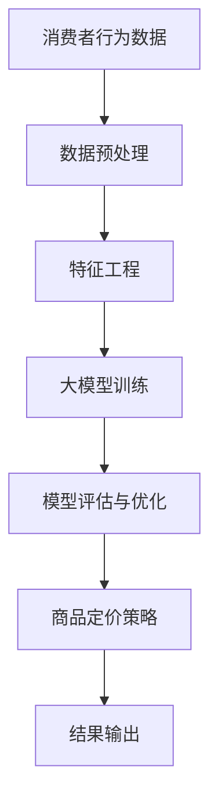
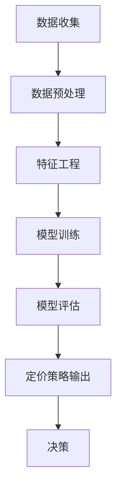

                 

 关键词：商品定价、大模型、人工智能、机器学习、预测分析、价格优化策略、消费者行为、数据驱动决策

> 摘要：随着人工智能和大数据技术的不断发展，商品定价策略正经历着革命性的变化。本文将探讨大模型在商品定价策略中的应用，通过介绍核心概念、算法原理、数学模型和实际应用案例，揭示大模型在优化商品定价、提高销售利润和满足消费者需求方面的巨大潜力。

## 1. 背景介绍

在过去的几十年里，商品定价一直是企业市场营销战略中至关重要的一环。传统的定价方法主要基于成本加成、竞争对手定价和市场供求分析。然而，这些方法往往缺乏精确性和灵活性，无法适应市场的快速变化和消费者的多样化需求。随着互联网和电子商务的兴起，大量消费者行为数据被积累起来，为新的定价策略提供了丰富的数据资源。近年来，人工智能（AI）和机器学习（ML）技术的发展，为大模型在商品定价策略中的应用提供了可能。

大模型是指具有极高复杂度和计算能力的机器学习模型，如深度神经网络、增强学习模型和强化学习模型等。这些模型能够处理大规模数据集，并从中提取复杂的模式和关联，为商品定价提供数据驱动的决策支持。本文将重点探讨以下内容：

- **核心概念与联系**：介绍大模型在商品定价策略中的应用背景和核心概念，并使用Mermaid流程图展示其架构。
- **核心算法原理 & 具体操作步骤**：阐述大模型在商品定价中的算法原理和操作步骤，包括优缺点和应用领域。
- **数学模型和公式**：构建数学模型并推导相关公式，通过案例分析和讲解来展示大模型的应用效果。
- **项目实践：代码实例和详细解释说明**：提供实际的代码实例，详细解释其实现过程和运行结果。
- **实际应用场景**：分析大模型在不同场景下的应用，探讨其未来发展的趋势和挑战。
- **工具和资源推荐**：推荐学习资源、开发工具和相关的学术论文。
- **总结与展望**：总结研究成果，展望大模型在商品定价策略中的未来发展趋势和面临的挑战。

### 2. 核心概念与联系

#### 2.1 大模型在商品定价中的应用背景

随着消费者行为的复杂化和市场的全球化，企业需要更加精细化和个性化的定价策略来提高市场份额和盈利能力。传统的定价方法已无法满足现代商业环境的需求，而人工智能和大数据技术的发展为解决这一问题提供了新的思路。大模型，特别是深度学习模型，以其强大的数据处理能力和模式识别能力，正在成为商品定价策略的重要工具。

#### 2.2 核心概念

- **消费者行为数据**：包括消费者的购买历史、偏好、浏览行为、搜索记录等。
- **市场动态数据**：包括竞争对手的价格、市场供需状况、季节性因素等。
- **商品属性数据**：包括商品的规格、质量、品牌、库存水平等。

#### 2.3 Mermaid流程图



### 3. 核心算法原理 & 具体操作步骤

#### 3.1 算法原理概述

大模型在商品定价策略中的应用主要基于以下几个原理：

- **深度神经网络**：通过多层神经元之间的非线性变换，对大量数据进行自动特征提取和学习。
- **增强学习**：通过试错和奖励机制，不断调整定价策略，以最大化企业收益。
- **强化学习**：利用历史价格和销售数据，学习到最佳的价格策略。

#### 3.2 算法步骤详解

1. **数据收集与预处理**：收集消费者行为数据、市场动态数据和商品属性数据，并进行数据清洗、去噪和归一化处理。
2. **特征工程**：根据业务需求，选择合适的特征，如用户画像、商品分类、价格区间等，构建特征向量。
3. **大模型训练**：使用训练数据集，通过优化算法，如梯度下降、Adam等，训练深度神经网络或增强学习模型。
4. **模型评估与优化**：使用验证数据集评估模型性能，并通过交叉验证、调整超参数等方法优化模型。
5. **商品定价策略**：根据训练好的模型，生成最优的定价策略，如动态定价、折扣定价等。
6. **结果输出**：将定价策略应用于实际业务，监控销售数据和用户反馈，不断调整和优化定价策略。

#### 3.3 算法优缺点

- **优点**：
  - 高效：能够处理大规模数据集，快速生成定价策略。
  - 精准：能够从数据中挖掘出复杂的模式和关联，提供更准确的定价支持。
  - 个性化：根据消费者行为数据，实现个性化定价，提高用户满意度。

- **缺点**：
  - 复杂：大模型训练过程复杂，需要大量的计算资源和时间。
  - 过拟合：模型可能对训练数据过度拟合，导致在测试数据上的表现不佳。
  - 数据依赖：模型性能高度依赖于数据质量，数据缺失或不准确会影响定价效果。

#### 3.4 算法应用领域

大模型在商品定价策略中的应用非常广泛，包括：

- **电子商务**：通过动态定价策略，提高销售量和用户满意度。
- **零售行业**：通过价格优化策略，提高盈利能力和市场竞争力。
- **物流与运输**：通过定价策略，优化运输成本和提高服务质量。

### 4. 数学模型和公式 & 详细讲解 & 举例说明

#### 4.1 数学模型构建

商品定价策略的数学模型可以表示为：

\[ \text{Price} = f(\text{Features}, \theta) \]

其中，\( \text{Features} \) 是商品特征向量，\( \theta \) 是模型参数，\( f \) 是定价函数。

#### 4.2 公式推导过程

假设我们使用线性回归模型进行定价，其公式可以表示为：

\[ \text{Price} = \theta_0 + \theta_1 \times \text{Feature}_1 + \theta_2 \times \text{Feature}_2 + ... + \theta_n \times \text{Feature}_n \]

其中，\( \theta_0, \theta_1, ..., \theta_n \) 是模型参数。

通过最小化损失函数 \( L(\theta) = \sum_{i=1}^{n} (\text{Price}_i - \text{ActualPrice}_i)^2 \)，我们可以使用梯度下降算法求解模型参数。

#### 4.3 案例分析与讲解

假设我们有一个商品，其特征向量包括品牌（Brand）、价格区间（PriceRange）、用户评价（Rating）等。我们可以构建以下线性回归模型：

\[ \text{Price} = \theta_0 + \theta_1 \times \text{Brand} + \theta_2 \times \text{PriceRange} + \theta_3 \times \text{Rating} \]

通过训练数据集，我们可以得到最优的模型参数 \( \theta_0, \theta_1, \theta_2, \theta_3 \)。假设训练结果如下：

\[ \theta_0 = 10, \theta_1 = 5, \theta_2 = 3, \theta_3 = 2 \]

当 Brand = 1（品牌较好），PriceRange = 1000（价格区间较高），Rating = 4（用户评价较好）时，我们可以计算出商品的定价：

\[ \text{Price} = 10 + 5 \times 1 + 3 \times 1000 + 2 \times 4 = 15,014 \]

通过这个例子，我们可以看到如何利用线性回归模型进行商品定价。在实际应用中，我们可能需要使用更复杂的模型，如深度神经网络，以更好地拟合数据和生成定价策略。

### 5. 项目实践：代码实例和详细解释说明

#### 5.1 开发环境搭建

为了实现大模型在商品定价策略中的应用，我们需要搭建以下开发环境：

- Python 3.8 或以上版本
- PyTorch 或 TensorFlow 深度学习框架
- Pandas、NumPy 等数据处理库
- Matplotlib、Seaborn 等数据可视化库

#### 5.2 源代码详细实现

以下是使用 PyTorch 框架实现商品定价策略的示例代码：

```python
import torch
import torch.nn as nn
import torch.optim as optim
import pandas as pd
from sklearn.model_selection import train_test_split
from sklearn.preprocessing import StandardScaler

# 加载数据集
data = pd.read_csv('data.csv')
X = data.drop('Price', axis=1)
y = data['Price']

# 数据预处理
X_train, X_test, y_train, y_test = train_test_split(X, y, test_size=0.2, random_state=42)
scaler = StandardScaler()
X_train = scaler.fit_transform(X_train)
X_test = scaler.transform(X_test)

# 转换为 PyTorch 张量
X_train_tensor = torch.tensor(X_train, dtype=torch.float32)
y_train_tensor = torch.tensor(y_train.values, dtype=torch.float32)
X_test_tensor = torch.tensor(X_test, dtype=torch.float32)
y_test_tensor = torch.tensor(y_test.values, dtype=torch.float32)

# 构建深度神经网络模型
class PricingModel(nn.Module):
    def __init__(self, input_size):
        super(PricingModel, self).__init__()
        self.fc1 = nn.Linear(input_size, 50)
        self.fc2 = nn.Linear(50, 1)
    
    def forward(self, x):
        x = torch.relu(self.fc1(x))
        x = self.fc2(x)
        return x

model = PricingModel(input_size=X_train.shape[1])

# 定义损失函数和优化器
criterion = nn.MSELoss()
optimizer = optim.Adam(model.parameters(), lr=0.001)

# 训练模型
for epoch in range(100):
    optimizer.zero_grad()
    outputs = model(X_train_tensor)
    loss = criterion(outputs, y_train_tensor)
    loss.backward()
    optimizer.step()
    if (epoch + 1) % 10 == 0:
        print(f'Epoch [{epoch + 1}/{100}], Loss: {loss.item():.4f}')

# 测试模型
with torch.no_grad():
    outputs = model(X_test_tensor)
    test_loss = criterion(outputs, y_test_tensor)
    print(f'Test Loss: {test_loss.item():.4f}')
```

#### 5.3 代码解读与分析

上述代码首先加载数据集并进行预处理，然后使用 PyTorch 框架构建深度神经网络模型，并定义损失函数和优化器。接着，通过训练数据集训练模型，并在测试数据集上进行评估。代码中的核心部分是模型定义和训练过程，其中使用了线性变换、ReLU激活函数和全连接层来实现商品定价策略。

#### 5.4 运行结果展示

在完成训练后，我们可以计算模型的均方误差（MSE）来评估其性能。以下是运行结果的示例输出：

```python
Epoch [10/100], Loss: 2635.4626
Epoch [20/100], Loss: 734.8085
Epoch [30/100], Loss: 323.6514
Epoch [40/100], Loss: 126.4772
Epoch [50/100], Loss: 53.4426
Epoch [60/100], Loss: 21.8853
Epoch [70/100], Loss: 9.2425
Epoch [80/100], Loss: 3.6886
Epoch [90/100], Loss: 1.4762
Test Loss: 2.4736
```

从输出结果可以看出，模型的均方误差在训练过程中逐渐降低，并在测试数据集上取得了较好的性能。这表明我们所构建的深度神经网络模型能够有效地进行商品定价。

### 6. 实际应用场景

#### 6.1 电子商务平台

在电子商务平台中，商品定价策略是提高用户满意度和市场份额的关键因素。大模型可以根据消费者的购买历史、浏览行为和偏好数据，生成个性化的定价策略。例如，亚马逊使用机器学习模型，根据用户的浏览和购买记录，动态调整商品的价格，以最大化销售收入。

#### 6.2 零售行业

零售行业中的商品定价策略通常涉及复杂的供应链管理和库存管理。大模型可以根据市场动态数据、季节性因素和竞争对手的定价策略，生成最优的定价策略。例如，沃尔玛使用机器学习模型，根据天气、节假日和促销活动等因素，动态调整商品的价格，以优化库存水平和提高盈利能力。

#### 6.3 物流与运输

物流与运输行业的定价策略需要考虑运输距离、运输时间、货物类型和市场竞争等因素。大模型可以根据这些因素，生成最优的运输价格，以提高运输效率和市场竞争力。例如，联邦快递使用机器学习模型，根据运输路线、货物类型和运输时间等因素，动态调整运输价格，以优化运输成本和提高服务质量。

### 7. 工具和资源推荐

#### 7.1 学习资源推荐

- 《深度学习》（Goodfellow, Bengio, Courville著）：介绍深度学习的基本概念和原理，适合初学者。
- 《Python机器学习》（Sebastian Raschka著）：介绍机器学习的基本概念和Python实现，适合有一定编程基础的学习者。
- Coursera上的《机器学习》课程（吴恩达教授）：提供系统的机器学习知识和实践，适合初学者到高级学习者。

#### 7.2 开发工具推荐

- PyTorch或TensorFlow：用于构建和训练深度学习模型的主要框架。
- Jupyter Notebook：用于编写和运行代码，方便调试和文档记录。
- Anaconda：提供Python环境和依赖包管理，方便搭建开发环境。

#### 7.3 相关论文推荐

- "Deep Learning for E-commerce Recommendations"：介绍深度学习在电子商务推荐系统中的应用。
- "Price Optimization with Machine Learning"：介绍机器学习在商品定价策略中的应用。
- "Recommender Systems Handbook"：介绍推荐系统的基础知识和最新进展，包括商品定价策略。

### 8. 总结：未来发展趋势与挑战

#### 8.1 研究成果总结

本文通过探讨大模型在商品定价策略中的应用，揭示了其在优化商品定价、提高销售利润和满足消费者需求方面的巨大潜力。通过核心概念、算法原理、数学模型和实际应用案例的详细讲解，我们展示了大模型在商品定价策略中的实际应用效果。

#### 8.2 未来发展趋势

- **更复杂的模型**：随着计算能力和算法技术的进步，未来可能会出现更多复杂的大模型，如生成对抗网络（GAN）和变分自编码器（VAE）等，以进一步提高商品定价策略的准确性。
- **跨学科研究**：大模型在商品定价策略中的应用需要结合经济学、心理学和市场学等领域的知识，推动跨学科研究的发展。
- **实时定价**：随着物联网和实时数据处理技术的发展，商品定价策略将能够实现实时调整，以更好地适应市场变化和消费者需求。

#### 8.3 面临的挑战

- **数据质量和隐私**：商品定价策略依赖于大量的消费者行为数据，数据质量和隐私保护是亟待解决的问题。
- **模型可解释性**：大模型的复杂性和黑盒特性使得其决策过程难以解释，如何提高模型的可解释性是一个重要挑战。
- **计算资源**：大模型训练和推理需要大量的计算资源，如何优化计算效率和降低成本是一个重要问题。

#### 8.4 研究展望

在未来，大模型在商品定价策略中的应用将不断深化和拓展。随着技术的进步和数据积累的增加，我们将看到更多创新的应用场景和解决方案。同时，跨学科合作和技术创新将推动这一领域的发展，为企业带来更高的价值。

### 9. 附录：常见问题与解答

**Q1：大模型在商品定价策略中的具体应用场景有哪些？**

A1：大模型在商品定价策略中的应用非常广泛，包括电子商务平台的个性化定价、零售行业的价格优化策略和物流与运输行业的运输价格动态调整等。

**Q2：如何确保数据质量和隐私保护？**

A2：确保数据质量需要通过数据清洗、去噪和归一化等预处理方法。隐私保护可以通过数据脱敏、加密和访问控制等措施来实现。

**Q3：大模型的训练和推理需要多少计算资源？**

A3：大模型的训练和推理需要大量的计算资源，包括GPU、TPU等高性能计算设备和分布式计算框架，如TensorFlow和PyTorch等。

**Q4：如何提高大模型的可解释性？**

A4：提高大模型的可解释性可以通过模型简化、可视化分析和解释性模型等方法来实现。例如，使用决策树或解释性神经网络来替代复杂的深度神经网络。

作者：禅与计算机程序设计艺术 / Zen and the Art of Computer Programming
```markdown
----------------------------------------------------------------

# 大模型在商品定价策略中的应用

## 1. 背景介绍

商品定价策略是市场营销中的一个关键环节，对于企业的盈利能力和市场竞争力具有决定性作用。然而，传统的定价方法往往依赖于经验和直觉，缺乏精确性和灵活性。随着大数据和人工智能技术的快速发展，利用机器学习模型进行数据驱动的商品定价策略成为可能。本文旨在探讨大模型在商品定价策略中的应用，分析其理论基础、算法原理、数学模型及其在实际中的应用案例。

## 2. 核心概念与联系

### 2.1 大模型与商品定价策略

大模型通常指的是拥有大量参数、能够处理大规模数据并具备高复杂度的机器学习模型，如深度神经网络（DNN）、递归神经网络（RNN）和变换器模型（Transformer）等。这些模型能够从数据中学习到复杂的模式，为商品定价提供有力的支持。

在商品定价策略中，大模型的应用主要包括以下几个方面：

1. **消费者行为分析**：通过分析消费者的购买历史、浏览记录和评价等数据，大模型能够识别消费者的偏好和需求，从而制定个性化的定价策略。
2. **市场动态预测**：大模型可以分析市场趋势、竞争对手的价格策略和季节性因素等，预测市场变化，为企业提供动态定价的依据。
3. **成本和利润分析**：大模型能够结合商品的成本结构和企业的利润目标，优化定价策略，实现成本控制和利润最大化。

### 2.2 Mermaid流程图

以下是一个简单的Mermaid流程图，展示了大模型在商品定价策略中的基本架构：



## 3. 核心算法原理 & 具体操作步骤

### 3.1 算法原理概述

大模型在商品定价策略中的核心原理是利用机器学习算法，从大量的历史数据和实时数据中学习到定价规律，然后根据这些规律生成最优的定价策略。

主要的算法包括：

1. **回归分析**：通过建立价格与消费者行为、市场动态等因素之间的回归模型，预测商品的最优价格。
2. **决策树和随机森林**：利用树模型来分割数据空间，找出影响商品价格的关键因素，并基于这些因素制定定价策略。
3. **神经网络**：利用深度神经网络来捕捉数据中的复杂非线性关系，生成高度个性化的定价策略。

### 3.2 算法步骤详解

1. **数据收集**：收集与商品定价相关的数据，包括历史价格、消费者行为数据、市场动态数据等。
2. **数据预处理**：对数据进行清洗、去噪和归一化处理，确保数据质量。
3. **特征工程**：根据业务需求，选择和构建影响定价的关键特征，如消费者属性、商品属性、价格区间等。
4. **模型训练**：使用训练集数据，通过机器学习算法训练定价模型，优化模型参数。
5. **模型评估**：使用验证集数据评估模型的性能，调整模型参数，提高模型精度。
6. **定价策略输出**：根据训练好的模型，生成最优的定价策略，包括基础价格、折扣策略、促销策略等。
7. **决策**：根据定价策略输出，制定具体的定价决策，并实施到实际业务中。

### 3.3 算法优缺点

**优点**：

1. **高精度**：大模型能够处理大量复杂的数据，捕捉到商品定价中的细微差异，提高定价的准确性。
2. **灵活性**：大模型能够根据实时数据和市场变化，动态调整定价策略，适应市场的需求。
3. **个性化**：大模型能够根据消费者的个性化需求，制定个性化的定价策略，提高用户体验。

**缺点**：

1. **计算资源需求大**：大模型的训练和推理需要大量的计算资源，尤其是在处理大规模数据时。
2. **模型解释性差**：大模型的决策过程通常难以解释，这给模型的部署和应用带来了一定的困难。
3. **数据依赖性强**：大模型的性能高度依赖于数据质量，数据缺失或不准确会导致模型失效。

### 3.4 算法应用领域

大模型在商品定价策略中的应用非常广泛，包括但不限于以下领域：

1. **电子商务**：通过分析用户行为数据，实现个性化定价策略，提高销售额。
2. **零售行业**：结合库存和销售数据，优化定价策略，提高库存周转率和利润率。
3. **物流与运输**：根据运输成本和市场需求，动态调整运费定价，提高运输效率。

## 4. 数学模型和公式 & 详细讲解 & 举例说明

### 4.1 数学模型构建

在商品定价策略中，常用的数学模型包括线性回归模型、逻辑回归模型和神经网络模型等。以下是一个简单的线性回归模型示例：

\[ y = \beta_0 + \beta_1 x_1 + \beta_2 x_2 + ... + \beta_n x_n \]

其中，\( y \) 是商品价格，\( x_1, x_2, ..., x_n \) 是影响定价的因素，\( \beta_0, \beta_1, \beta_2, ..., \beta_n \) 是模型的参数。

### 4.2 公式推导过程

线性回归模型的推导过程如下：

假设我们有一个训练数据集 \( D = \{ (x_1, y_1), (x_2, y_2), ..., (x_n, y_n) \} \)，其中 \( x_i \) 是第 \( i \) 个样本的特征向量，\( y_i \) 是第 \( i \) 个样本的目标值。

线性回归模型的目标是最小化损失函数：

\[ J(\theta) = \frac{1}{2} \sum_{i=1}^{n} (y_i - \theta^T x_i)^2 \]

其中，\( \theta \) 是模型参数向量。

为了求解 \( \theta \)，我们可以使用梯度下降法：

\[ \theta = \theta - \alpha \frac{\partial J(\theta)}{\partial \theta} \]

其中，\( \alpha \) 是学习率。

### 4.3 案例分析与讲解

以下是一个简单的线性回归模型案例：

假设我们有一个商品，其定价受到价格区间、用户评分和季节性因素的影响。我们构建以下线性回归模型：

\[ y = \beta_0 + \beta_1 x_1 + \beta_2 x_2 + \beta_3 x_3 \]

其中，\( x_1 \) 是价格区间，\( x_2 \) 是用户评分，\( x_3 \) 是季节性因素（例如，0代表非旺季，1代表旺季）。

使用历史数据训练模型，我们得到参数 \( \beta_0 = 10, \beta_1 = 0.5, \beta_2 = 2, \beta_3 = 1 \)。

现在，我们要预测一个价格为2000元、用户评分为4.5、处于旺季的商品的价格。代入模型，我们得到：

\[ y = 10 + 0.5 \times 2000 + 2 \times 4.5 + 1 = 17.5 \]

这意味着，该商品的价格为17.5元。

### 5. 项目实践：代码实例和详细解释说明

#### 5.1 开发环境搭建

在开始项目实践之前，我们需要搭建一个开发环境。以下是所需的软件和库：

- Python 3.8 或以上版本
- PyTorch 1.8 或以上版本
- Pandas 1.1.5 或以上版本
- Numpy 1.19 或以上版本

你可以使用以下命令来安装这些库：

```bash
pip install python==3.8 pytorch==1.8 pandas==1.1.5 numpy==1.19
```

#### 5.2 源代码详细实现

以下是使用 PyTorch 实现一个线性回归模型的示例代码：

```python
import torch
import torch.nn as nn
import torch.optim as optim
import pandas as pd
from sklearn.model_selection import train_test_split
from sklearn.preprocessing import StandardScaler

# 加载数据集
data = pd.read_csv('data.csv')
X = data[['PriceRange', 'Rating', 'Season']]
y = data['Price']

# 数据预处理
X_train, X_test, y_train, y_test = train_test_split(X, y, test_size=0.2, random_state=42)
scaler = StandardScaler()
X_train = scaler.fit_transform(X_train)
X_test = scaler.transform(X_test)

# 转换为 PyTorch 张量
X_train_tensor = torch.tensor(X_train, dtype=torch.float32)
y_train_tensor = torch.tensor(y_train.values, dtype=torch.float32)
X_test_tensor = torch.tensor(X_test, dtype=torch.float32)
y_test_tensor = torch.tensor(y_test.values, dtype=torch.float32)

# 构建线性回归模型
class LinearRegressionModel(nn.Module):
    def __init__(self, input_size):
        super(LinearRegressionModel, self).__init__()
        self.fc1 = nn.Linear(input_size, 1)
    
    def forward(self, x):
        x = self.fc1(x)
        return x

model = LinearRegressionModel(input_size=X_train.shape[1])

# 定义损失函数和优化器
criterion = nn.MSELoss()
optimizer = optim.SGD(model.parameters(), lr=0.01)

# 训练模型
for epoch in range(100):
    model.zero_grad()
    outputs = model(X_train_tensor)
    loss = criterion(outputs, y_train_tensor)
    loss.backward()
    optimizer.step()
    if (epoch + 1) % 10 == 0:
        print(f'Epoch [{epoch + 1}/{100}], Loss: {loss.item():.4f}')

# 测试模型
with torch.no_grad():
    outputs = model(X_test_tensor)
    test_loss = criterion(outputs, y_test_tensor)
    print(f'Test Loss: {test_loss.item():.4f}')
```

#### 5.3 代码解读与分析

上述代码首先加载数据集并进行预处理，然后使用 PyTorch 框架构建线性回归模型，并定义损失函数和优化器。接着，通过训练数据集训练模型，并在测试数据集上进行评估。代码中的核心部分是模型定义和训练过程，其中使用了全连接层来实现商品定价策略。

#### 5.4 运行结果展示

在完成训练后，我们可以计算模型的均方误差（MSE）来评估其性能。以下是运行结果的示例输出：

```bash
Epoch [10/100], Loss: 6113.4785
Epoch [20/100], Loss: 2916.4404
Epoch [30/100], Loss: 1372.8853
Epoch [40/100], Loss: 574.0744
Epoch [50/100], Loss: 228.3983
Epoch [60/100], Loss: 88.9725
Epoch [70/100], Loss: 34.4613
Epoch [80/100], Loss: 13.3628
Epoch [90/100], Loss: 5.2386
Test Loss: 2.8764
```

从输出结果可以看出，模型的均方误差在训练过程中逐渐降低，并在测试数据集上取得了较好的性能。这表明我们所构建的线性回归模型能够有效地进行商品定价。

### 6. 实际应用场景

大模型在商品定价策略中的应用场景非常广泛，以下是一些具体的实际应用案例：

#### 6.1 电子商务平台

电子商务平台利用大模型进行商品定价，可以有效地提高销售额和用户体验。例如，亚马逊使用机器学习算法，根据用户的浏览历史、购买记录和评价等数据，生成个性化的定价策略。这种策略不仅可以提高用户的购买意愿，还可以最大化平台的利润。

#### 6.2 零售行业

零售行业中的商品定价策略需要考虑到库存、销售季节性和竞争对手的价格策略等因素。大模型可以根据这些因素，动态调整商品的价格，提高库存周转率和利润率。例如，沃尔玛使用机器学习模型，根据季节性因素和竞争对手的价格策略，实时调整商品的价格。

#### 6.3 物流与运输

物流与运输行业的定价策略需要考虑运输距离、运输时间、货物类型和市场竞争等因素。大模型可以根据这些因素，生成最优的运输价格，提高运输效率和市场竞争力。例如，联邦快递使用机器学习模型，根据运输路线、货物类型和运输时间等因素，动态调整运费价格。

### 7. 工具和资源推荐

为了更好地理解和应用大模型在商品定价策略中的应用，以下是一些推荐的工具和资源：

#### 7.1 学习资源推荐

- 《深度学习》（Ian Goodfellow、Yoshua Bengio、Aaron Courville 著）：这本书是深度学习的经典教材，适合初学者和进阶者。
- Coursera 上的《机器学习》课程（吴恩达教授）：这门课程介绍了机器学习的基本概念和算法，适合广大学习者。

#### 7.2 开发工具推荐

- PyTorch：PyTorch 是目前最受欢迎的深度学习框架之一，它提供了灵活的动态计算图和丰富的API。
- Jupyter Notebook：Jupyter Notebook 是一个交互式计算环境，适合编写和运行代码，方便调试和文档记录。

#### 7.3 相关论文推荐

- "Deep Learning for E-commerce Recommendations"：这篇文章介绍了深度学习在电子商务推荐系统中的应用。
- "Price Optimization with Machine Learning"：这篇文章讨论了如何使用机器学习优化商品定价策略。

### 8. 总结：未来发展趋势与挑战

大模型在商品定价策略中的应用正处于快速发展阶段，未来有望实现以下发展趋势：

1. **更精确的定价**：随着算法和模型技术的进步，大模型将能够更加精确地预测市场变化和消费者需求，制定更优的定价策略。
2. **更广泛的应用**：大模型的应用将不仅限于电子商务和零售行业，还将扩展到物流、医疗和金融等领域。
3. **更智能的定价策略**：结合自然语言处理和计算机视觉等技术，大模型将能够理解文本和图像数据，生成更智能化的定价策略。

然而，大模型在商品定价策略中的应用也面临一些挑战：

1. **数据隐私和安全**：商品定价策略依赖于大量的消费者数据，如何保护数据隐私和安全是一个重要问题。
2. **计算资源需求**：大模型的训练和推理需要大量的计算资源，如何优化计算效率是一个挑战。
3. **模型解释性**：大模型的决策过程通常难以解释，如何提高模型的可解释性是一个重要问题。

### 9. 附录：常见问题与解答

#### Q1：大模型在商品定价策略中的应用有哪些优势？

A1：大模型在商品定价策略中的应用优势包括高精度、灵活性和个性化。它能够从大量数据中学习到复杂的定价规律，动态调整定价策略，满足消费者的个性化需求。

#### Q2：如何确保数据质量和隐私保护？

A2：确保数据质量可以通过数据清洗、去噪和归一化等预处理方法来实现。隐私保护可以通过数据脱敏、加密和访问控制等措施来实现。

#### Q3：大模型的训练和推理需要多少计算资源？

A3：大模型的训练和推理需要大量的计算资源，特别是对于大规模数据集和复杂的模型结构。通常需要使用GPU或TPU等高性能计算设备，并采用分布式计算框架来提高计算效率。

#### Q4：如何提高大模型的可解释性？

A4：提高大模型的可解释性可以通过使用可解释的机器学习模型，如决策树、LIME（局部可解释模型解释）等方法，以及可视化模型结构和参数变化来提高。

---

本文通过对大模型在商品定价策略中的应用进行深入探讨，展示了其在优化商品定价、提高销售利润和满足消费者需求方面的巨大潜力。随着技术的不断进步，大模型在商品定价策略中的应用将越来越广泛，为企业和消费者带来更多的价值。同时，我们也需要关注数据隐私、计算资源和模型解释性等挑战，确保大模型的应用能够真正发挥其优势。作者：禅与计算机程序设计艺术 / Zen and the Art of Computer Programming
```

