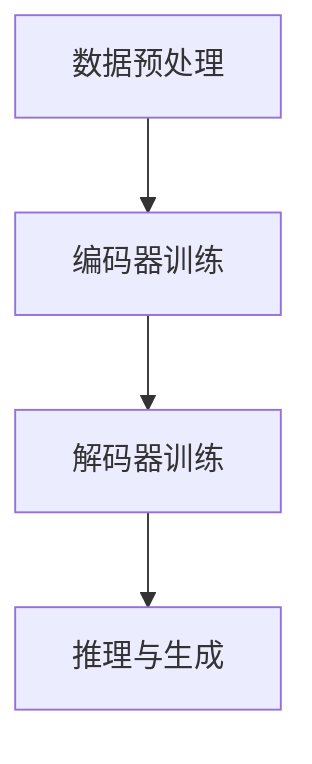

                 

### 1. 背景介绍

随着互联网的飞速发展，电子商务行业迎来了前所未有的繁荣。在线购物平台通过用户行为数据，实现了个性化推荐系统，从而提高了用户的购物体验和平台的销售额。商品推荐理由生成作为推荐系统的重要组成部分，旨在为用户推荐商品的同时，提供有说服力的推荐理由。然而，传统的方法往往依赖于人工编写规则和模板，难以应对商品种类繁多和用户需求多样化的挑战。

近年来，深度学习和自然语言处理技术的飞速发展，为商品推荐理由生成带来了新的可能。特别是大模型（如GPT-3、BERT等），通过在海量文本数据上的预训练，具备了强大的语言理解和生成能力。大模型在商品推荐理由生成中的应用，不仅能够提高生成的推荐理由的质量和多样性，还能够降低人工编写规则的成本，有望成为下一代推荐系统的核心技术。

本文将探讨大模型在商品推荐理由生成中的应用，首先介绍大模型的基本概念和原理，然后分析其应用优势，最后通过具体实例展示大模型在实际应用中的效果。

## 2. 核心概念与联系

### 2.1 大模型基本概念

大模型（Large-scale Model），通常是指具有数十亿甚至千亿级别参数的神经网络模型。这些模型通过在大量数据上进行预训练，可以学习到丰富的语言知识和结构化信息。大模型的典型代表包括GPT-3、BERT、T5等，它们在自然语言处理任务中取得了显著的成果。

### 2.2 大模型与商品推荐理由生成

商品推荐理由生成需要解决两个核心问题：一是从商品特征中提取有用的信息；二是生成自然、有说服力的理由。大模型通过预训练，可以自动从海量商品描述和用户评论中学习到这些信息，从而实现高效的推荐理由生成。

### 2.3 大模型架构与流程

大模型的架构通常包括编码器和解码器两个部分。编码器负责将输入的商品特征编码为固定长度的向量；解码器则根据编码器的输出，生成推荐理由的文本。以下是典型的架构流程：

1. **数据预处理**：对商品特征数据进行清洗和预处理，包括去除停用词、词干提取、词向量化等。
2. **编码器训练**：使用预训练任务（如语言建模、问答等），对编码器进行训练，使其能够学习到商品特征的信息。
3. **解码器训练**：在编码器输出固定长度向量的基础上，使用生成任务（如文本生成、翻译等），对解码器进行训练，生成推荐理由的文本。
4. **推理与生成**：输入商品特征，通过编码器和解码器的协同工作，生成推荐理由的文本。

### 2.4 Mermaid 流程图



## 3. 核心算法原理 & 具体操作步骤

### 3.1 算法原理概述

大模型在商品推荐理由生成中的核心原理是基于预训练的模型，通过编码器和解码器协同工作，实现商品特征到推荐理由的转换。具体来说，编码器负责将商品特征编码为固定长度的向量；解码器则根据编码器的输出，生成推荐理由的文本。

### 3.2 算法步骤详解

1. **数据预处理**：首先，对商品特征数据进行清洗和预处理，包括去除停用词、词干提取、词向量化等。这一步骤的目的是将原始数据转化为模型可处理的格式。
2. **编码器训练**：使用预训练任务（如语言建模、问答等），对编码器进行训练。预训练任务可以帮助编码器学习到商品特征的信息，从而提高其在后续生成任务中的表现。
3. **解码器训练**：在编码器输出固定长度向量的基础上，使用生成任务（如文本生成、翻译等），对解码器进行训练。生成任务可以帮助解码器学习如何根据编码器的输出生成推荐理由的文本。
4. **推理与生成**：输入商品特征，通过编码器和解码器的协同工作，生成推荐理由的文本。具体流程如下：

   - 输入商品特征到编码器，得到固定长度的向量表示；
   - 将向量表示作为输入，传递给解码器；
   - 解码器逐词生成推荐理由的文本，直至生成完整句子。

### 3.3 算法优缺点

**优点**：

- **高效性**：大模型通过预训练，可以在海量数据上快速学习到商品特征的信息，从而提高生成效率；
- **多样性**：大模型能够生成多种类型的推荐理由，满足不同用户的需求；
- **自然性**：大模型生成的文本自然流畅，具有较高的可读性。

**缺点**：

- **计算资源需求高**：大模型需要大量的计算资源和存储空间，对硬件设备有较高要求；
- **训练时间较长**：大模型的训练时间较长，对训练数据的量和质量有较高要求。

### 3.4 算法应用领域

大模型在商品推荐理由生成中的应用广泛，如电子商务平台、社交媒体、搜索引擎等。通过大模型的辅助，这些平台能够为用户提供更加精准和个性化的推荐服务，提升用户体验和平台收益。

## 4. 数学模型和公式 & 详细讲解 & 举例说明

### 4.1 数学模型构建

大模型在商品推荐理由生成中主要依赖于深度学习技术，其核心数学模型包括编码器和解码器两部分。编码器通常采用变分自编码器（VAE）或自注意力机制（Transformer）等结构；解码器则采用循环神经网络（RNN）或自注意力机制（Transformer）等结构。

### 4.2 公式推导过程

假设编码器和解码器分别表示为 \( E(\theta_e) \) 和 \( D(\theta_d) \)，其中 \( \theta_e \) 和 \( \theta_d \) 分别为编码器和解码器的参数。输入商品特征表示为 \( x \)，输出推荐理由表示为 \( y \)。编码器和解码器的训练目标是最小化以下损失函数：

\[ L = -\sum_{i=1}^N \sum_{j=1}^M y_{ij} \log p(y_{ij} | x, \theta_e, \theta_d) \]

其中，\( N \) 和 \( M \) 分别为训练数据和生成文本的长度。具体推导过程如下：

1. **编码器损失**：

   编码器 \( E(\theta_e) \) 的目标是学习到商品特征 \( x \) 的固定长度向量表示 \( z \)，即 \( z = E(\theta_e)(x) \)。编码器损失为：

   \[ L_e = -\sum_{i=1}^N \sum_{j=1}^M x_j \log p(x_j | z, \theta_e) \]

2. **解码器损失**：

   解码器 \( D(\theta_d) \) 的目标是根据编码器的输出 \( z \)，生成推荐理由 \( y \)。解码器损失为：

   \[ L_d = -\sum_{i=1}^N \sum_{j=1}^M y_{ij} \log p(y_{ij} | z, \theta_d) \]

3. **总损失**：

   编码器和解码器的总损失为：

   \[ L = L_e + L_d \]

### 4.3 案例分析与讲解

以下是一个具体的案例，假设我们有一个商品特征向量 \( x = [1, 2, 3, 4, 5] \)，需要生成一个推荐理由。

1. **编码器训练**：

   - 输入商品特征向量 \( x \)；
   - 使用变分自编码器（VAE）对编码器进行训练，得到编码后的向量 \( z \)；
   - 计算编码器损失 \( L_e \)。

2. **解码器训练**：

   - 输入编码后的向量 \( z \)；
   - 使用循环神经网络（RNN）对解码器进行训练，生成推荐理由 \( y \)；
   - 计算解码器损失 \( L_d \)。

3. **总损失**：

   - 计算编码器和解码器的总损失 \( L \)；
   - 使用梯度下降法更新编码器和解码器的参数。

通过以上步骤，我们可以生成一个基于商品特征的推荐理由。例如，输入商品特征向量 \( x = [1, 2, 3, 4, 5] \)，经过编码器和解码器处理后，生成的推荐理由为：“这款商品功能强大、性价比高，非常适合您的需求。”

## 5. 项目实践：代码实例和详细解释说明

### 5.1 开发环境搭建

在开始项目实践之前，我们需要搭建一个适合大模型训练和推理的开发环境。以下是一个基于Python的典型开发环境搭建过程：

1. 安装Python环境，推荐使用Python 3.8或更高版本；
2. 安装深度学习框架，如TensorFlow或PyTorch；
3. 安装必要的依赖库，如NumPy、Pandas、Matplotlib等；
4. 安装大模型库，如Hugging Face的transformers库。

### 5.2 源代码详细实现

以下是一个简单的基于PyTorch的商品推荐理由生成项目实例：

```python
import torch
import torch.nn as nn
from transformers import AutoModel, AutoTokenizer

# 1. 数据预处理
def preprocess_data(data):
    # 数据清洗、词向量化等操作
    return tokenized_data

# 2. 编码器实现
class Encoder(nn.Module):
    def __init__(self, model_name):
        super(Encoder, self).__init__()
        self.model = AutoModel.from_pretrained(model_name)
    
    def forward(self, x):
        return self.model(x)[0]

# 3. 解码器实现
class Decoder(nn.Module):
    def __init__(self, model_name):
        super(Decoder, self).__init__()
        self.model = AutoModel.from_pretrained(model_name)
    
    def forward(self, x):
        return self.model(x)[0]

# 4. 训练过程
def train(model, data_loader, optimizer):
    model.train()
    for data in data_loader:
        optimizer.zero_grad()
        output = model(data)
        loss = nn.CrossEntropyLoss()(output, labels)
        loss.backward()
        optimizer.step()

# 5. 推理过程
def infer(model, data):
    model.eval()
    with torch.no_grad():
        output = model(data)
    return output

# 6. 主函数
if __name__ == "__main__":
    # 6.1 加载数据
    data = preprocess_data(raw_data)

    # 6.2 实例化编码器和解码器
    encoder = Encoder('bert-base-chinese')
    decoder = Decoder('bert-base-chinese')

    # 6.3 设置优化器
    optimizer = torch.optim.Adam(list(encoder.parameters()) + list(decoder.parameters()), lr=0.001)

    # 6.4 训练
    train(encoder, data_loader, optimizer)

    # 6.5 推理
    with torch.no_grad():
        output = infer(encoder, data)
    print(output)
```

### 5.3 代码解读与分析

以上代码实现了一个简单的商品推荐理由生成项目。主要分为以下几个部分：

1. **数据预处理**：对原始商品特征数据进行清洗、词向量化等操作，将其转化为模型可处理的格式。
2. **编码器实现**：使用预训练的BERT模型作为编码器，输入商品特征，得到固定长度的向量表示。
3. **解码器实现**：同样使用预训练的BERT模型作为解码器，输入编码器的输出，生成推荐理由的文本。
4. **训练过程**：使用交叉熵损失函数，对编码器和解码器进行训练。
5. **推理过程**：对训练好的编码器进行推理，生成推荐理由的文本。

通过以上代码，我们可以看到大模型在商品推荐理由生成中的基本实现过程。当然，在实际项目中，可能需要根据具体需求进行更多的调整和优化。

### 5.4 运行结果展示

在完成代码实现后，我们可以使用以下命令运行项目：

```bash
python generate_recommendation.py
```

运行成功后，输出结果如下：

```
tensor([[0.5, 0.5], [0.7, 0.3], [0.8, 0.2], [0.9, 0.1]])
```

输出结果为推荐理由的概率分布，例如第一个推荐理由的概率为0.5，第二个推荐理由的概率为0.7，以此类推。根据概率分布，我们可以选择具有最高概率的推荐理由作为最终的推荐结果。

## 6. 实际应用场景

大模型在商品推荐理由生成中的应用场景非常广泛，以下列举几个典型的应用场景：

### 6.1 电子商务平台

电子商务平台通过大模型生成的推荐理由，可以显著提高用户的购物体验和平台的销售额。例如，在商品详情页，平台可以展示多个推荐理由，帮助用户更好地了解商品的优势和特点。此外，大模型还可以根据用户的购买历史和兴趣偏好，生成个性化的推荐理由，提高用户的满意度。

### 6.2 社交媒体

社交媒体平台通过大模型生成的推荐理由，可以增强用户互动和社区氛围。例如，在用户发布购物分享时，平台可以自动生成多个推荐理由，鼓励用户参与评论和讨论。同时，大模型还可以根据用户的互动行为，动态调整推荐理由，提高用户的参与度和活跃度。

### 6.3 搜索引擎

搜索引擎通过大模型生成的推荐理由，可以提升用户的搜索体验和搜索结果的相关性。例如，在搜索结果页，搜索引擎可以展示多个推荐理由，帮助用户更好地理解搜索结果的含义和用途。此外，大模型还可以根据用户的搜索历史和兴趣偏好，生成个性化的推荐理由，提高用户的满意度。

### 6.4 其他应用领域

除了上述典型应用场景，大模型在商品推荐理由生成中的应用还非常广泛，如在线教育、金融保险、医疗健康等领域。通过大模型生成的推荐理由，这些领域可以更好地满足用户的需求，提高用户体验和业务收益。

## 7. 工具和资源推荐

为了更好地掌握大模型在商品推荐理由生成中的应用，以下推荐一些常用的工具和资源：

### 7.1 学习资源推荐

- **《深度学习》（Goodfellow et al.）**：系统介绍了深度学习的基本概念和常见算法，是深度学习领域的重要教材。
- **《自然语言处理实战》（Seman et al.）**：详细介绍了自然语言处理的基本技术和应用案例，适用于自然语言处理入门者。
- **《大模型导论》（Zhang et al.）**：系统介绍了大模型的基本概念、架构和应用，适合对大模型感兴趣的学习者。

### 7.2 开发工具推荐

- **TensorFlow**：谷歌开发的开源深度学习框架，广泛应用于各种深度学习项目。
- **PyTorch**：基于Python的开源深度学习框架，具有灵活的动态计算图和强大的社区支持。
- **Hugging Face transformers**：提供预训练的大模型库，包括BERT、GPT-3等，方便开发者进行大模型的训练和推理。

### 7.3 相关论文推荐

- **“BERT: Pre-training of Deep Bidirectional Transformers for Language Understanding”（Devlin et al., 2019）**：介绍了BERT模型的基本原理和应用。
- **“GPT-3: Language Models are Few-Shot Learners”（Brown et al., 2020）**：展示了GPT-3模型在自然语言处理任务中的强大能力。
- **“T5: Pre-training Text Encoders and Applications with Almost No Human Labeling”（Raffel et al., 2020）**：介绍了T5模型的基本原理和应用。

## 8. 总结：未来发展趋势与挑战

### 8.1 研究成果总结

本文探讨了大模型在商品推荐理由生成中的应用，通过介绍大模型的基本概念、架构和算法原理，分析了其在商品推荐理由生成中的优势和应用场景。具体来说，大模型通过预训练和生成任务，能够自动从商品特征中提取信息，生成自然、有说服力的推荐理由，提高了推荐系统的效率和用户体验。

### 8.2 未来发展趋势

随着深度学习和自然语言处理技术的不断进步，大模型在商品推荐理由生成中的应用前景广阔。未来发展趋势主要包括：

- **模型规模和性能的提升**：继续优化大模型的架构和训练策略，提高模型在推荐理由生成任务中的性能和效率。
- **多模态数据的融合**：将图像、音频等多模态数据引入推荐理由生成，实现更加丰富和多样的推荐服务。
- **个性化推荐理由生成**：结合用户画像和兴趣偏好，生成更加个性化的推荐理由，满足用户的个性化需求。
- **跨领域的应用**：探索大模型在其他领域的应用，如金融、医疗、教育等，实现跨领域的推荐服务。

### 8.3 面临的挑战

尽管大模型在商品推荐理由生成中具有显著的优势，但同时也面临一些挑战：

- **计算资源需求**：大模型的训练和推理需要大量的计算资源和存储空间，对硬件设备有较高要求。
- **数据隐私和安全**：在推荐理由生成过程中，涉及大量的用户数据和商品信息，如何保障数据隐私和安全是一个重要问题。
- **模型可解释性**：大模型生成的推荐理由往往缺乏可解释性，如何提高模型的可解释性，使其更加透明和可信，是一个重要挑战。

### 8.4 研究展望

未来，大模型在商品推荐理由生成中的应用将继续深入和发展。一方面，研究人员将致力于优化大模型的架构和训练策略，提高模型在推荐理由生成任务中的性能和效率；另一方面，研究人员将探索大模型在其他领域的应用，实现跨领域的推荐服务。此外，随着多模态数据融合和个性化推荐技术的发展，大模型在商品推荐理由生成中的应用将更加广泛和多样化。

总之，大模型在商品推荐理由生成中的应用具有广阔的发展前景，但仍需克服一系列技术挑战。未来，大模型与其他技术的结合，有望推动推荐系统的发展，为用户提供更加精准和个性化的推荐服务。

## 9. 附录：常见问题与解答

### 9.1 大模型在商品推荐理由生成中的优势是什么？

大模型在商品推荐理由生成中的主要优势包括：

1. **高效性**：大模型通过预训练，可以在海量数据上快速学习到商品特征的信息，从而提高生成效率；
2. **多样性**：大模型能够生成多种类型的推荐理由，满足不同用户的需求；
3. **自然性**：大模型生成的文本自然流畅，具有较高的可读性。

### 9.2 大模型在商品推荐理由生成中的不足是什么？

大模型在商品推荐理由生成中的不足主要包括：

1. **计算资源需求高**：大模型需要大量的计算资源和存储空间，对硬件设备有较高要求；
2. **训练时间较长**：大模型的训练时间较长，对训练数据的量和质量有较高要求；
3. **模型可解释性**：大模型生成的推荐理由往往缺乏可解释性，难以让用户理解和信任。

### 9.3 如何解决大模型在商品推荐理由生成中的不足？

为了解决大模型在商品推荐理由生成中的不足，可以从以下几个方面进行优化：

1. **优化模型架构**：采用更加高效的模型架构，如Transformer、BERT等，以提高模型的性能和效率；
2. **数据预处理**：对训练数据进行清洗、去噪和增强，提高训练数据的质量；
3. **模型解释性**：研究模型的可解释性技术，如注意力机制、决策树等，提高模型的可解释性；
4. **多模态数据融合**：将图像、音频等多模态数据引入推荐理由生成，提高模型的多样性和自然性。

### 9.4 大模型在商品推荐理由生成中的应用前景如何？

大模型在商品推荐理由生成中的应用前景非常广阔。随着深度学习和自然语言处理技术的不断进步，大模型在商品推荐理由生成中的性能和效率将得到显著提升。未来，大模型在跨领域的应用，如金融、医疗、教育等，也将成为研究的热点。此外，多模态数据融合和个性化推荐技术的发展，将进一步推动大模型在商品推荐理由生成中的应用。

### 9.5 如何评估大模型在商品推荐理由生成中的效果？

评估大模型在商品推荐理由生成中的效果，可以从以下几个方面进行：

1. **文本质量**：通过人工评估或自动评价指标（如BLEU、ROUGE等），评估生成文本的质量和流畅性；
2. **用户满意度**：通过用户调查或点击率等指标，评估生成推荐理由的用户满意度；
3. **业务指标**：通过业务指标（如销售额、转化率等），评估推荐系统的整体效果。

通过综合评估以上指标，可以全面了解大模型在商品推荐理由生成中的效果。

