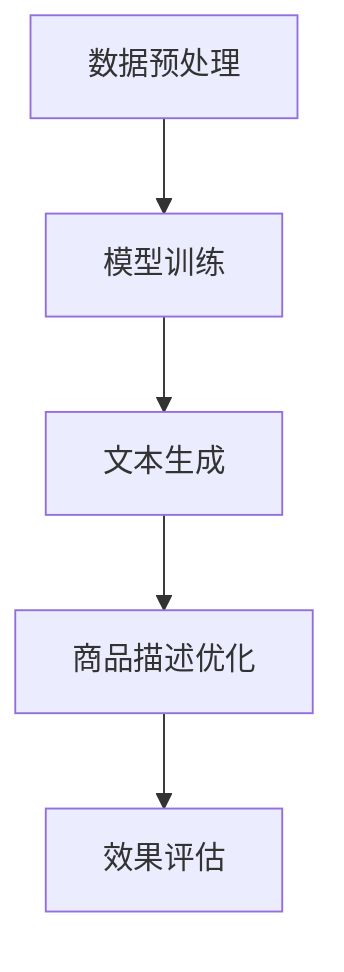

                 

关键词：商品描述优化、大模型、自然语言处理、机器学习、NLP、深度学习

> 摘要：本文将探讨大模型在商品描述优化中的应用，分析其核心概念、算法原理、数学模型以及项目实践。通过对商品描述优化问题的深入研究，揭示大模型在此领域的优势和挑战，展望其未来发展方向。

## 1. 背景介绍

随着电子商务的迅速发展，商品描述的质量对消费者的购买决策有着至关重要的影响。高质量的描述能够有效传达商品的特点和优势，提升用户体验，从而促进销售。然而，撰写吸引人的商品描述并非易事，需要考虑到语言表达的准确性、独特性和吸引力。为此，自然语言处理（NLP）和机器学习（ML）技术逐渐成为解决这一问题的有效手段。

近年来，大模型如BERT、GPT、T5等在NLP领域取得了显著成果，展示了强大的语言理解和生成能力。这些大模型通过处理海量数据，能够自动学习并生成高质量的文本，为商品描述优化提供了新的可能。本文旨在探讨大模型在商品描述优化中的实践，分析其优势、挑战和未来发展方向。

## 2. 核心概念与联系

### 2.1 大模型的概念

大模型（Large-scale Model）是指参数量巨大、计算能力强的神经网络模型。它们通过深度学习技术在大量数据上进行训练，能够自动学习并捕捉数据中的复杂模式和规律。大模型通常具有以下特点：

- **参数量巨大**：大模型的参数数量通常达到数十亿甚至数万亿级别。
- **计算能力强大**：大模型需要高性能计算资源进行训练和推理。
- **自适应性**：大模型能够适应不同任务和数据集，具备较强的泛化能力。

### 2.2 大模型与NLP的联系

自然语言处理（NLP）是人工智能领域的一个重要分支，旨在使计算机能够理解和处理人类语言。大模型在NLP中具有广泛的应用，如文本分类、情感分析、机器翻译、文本生成等。大模型通过深度学习技术，能够从海量数据中学习语言规律，实现对文本的精细理解和生成。

### 2.3 大模型与商品描述优化的关系

商品描述优化是一个涉及文本生成和语言理解的任务。大模型在此领域的应用主要体现在以下几个方面：

- **文本生成**：大模型能够生成高质量的描述文本，提升商品描述的吸引力和准确性。
- **语言理解**：大模型能够理解商品的特点和优势，为描述文本提供更准确的词汇和表达方式。
- **个性化推荐**：大模型可以根据用户的历史购买行为和偏好，生成个性化的商品描述，提升用户体验。

### 2.4 Mermaid流程图

下面是一个关于大模型在商品描述优化中的流程图：



## 3. 核心算法原理 & 具体操作步骤

### 3.1 算法原理概述

大模型在商品描述优化中的核心算法通常是基于生成对抗网络（GAN）和变分自编码器（VAE）等深度学习技术。这些算法通过对抗训练和自编码的方式，学习数据的分布并生成高质量的文本。

### 3.2 算法步骤详解

#### 3.2.1 数据预处理

- **数据收集**：从电商平台上收集商品描述数据。
- **数据清洗**：去除无关信息和错误数据，对文本进行预处理，如分词、去停用词等。
- **数据增强**：通过数据扩充和文本生成技术，增加数据集的多样性。

#### 3.2.2 模型训练

- **模型选择**：选择合适的模型架构，如BERT、GPT等。
- **模型训练**：在预处理后的数据上进行模型训练，优化模型的参数。
- **模型评估**：使用验证集对模型进行评估，调整模型参数。

#### 3.2.3 文本生成

- **输入文本**：输入待生成的商品描述文本。
- **生成文本**：利用训练好的模型生成描述文本。
- **文本优化**：对生成的文本进行优化，如语法修正、词汇替换等。

#### 3.2.4 商品描述优化

- **文本分析**：对生成的商品描述文本进行分析，提取关键信息。
- **描述优化**：根据分析结果，对描述文本进行优化，如增加描述细节、调整表达方式等。

#### 3.2.5 效果评估

- **用户评价**：收集用户对优化后的商品描述的评价。
- **效果分析**：分析用户评价，评估商品描述优化的效果。

### 3.3 算法优缺点

#### 优点

- **高效性**：大模型能够快速生成高质量的文本，提高商品描述的效率。
- **多样性**：大模型能够生成多样化的文本，提升商品描述的吸引力。
- **个性化**：大模型可以根据用户偏好生成个性化的商品描述，提升用户体验。

#### 缺点

- **计算资源消耗**：大模型的训练和推理需要大量的计算资源，对硬件要求较高。
- **数据依赖性**：大模型的效果很大程度上取决于数据质量和数量。
- **算法复杂性**：大模型的算法原理复杂，需要专业的知识和技能进行理解和应用。

### 3.4 算法应用领域

大模型在商品描述优化中的应用广泛，如：

- **电商平台**：用于生成商品描述、优化广告文案等。
- **营销宣传**：用于生成吸引人的宣传文案、海报等。
- **客服机器人**：用于生成个性化的客服回答，提升用户体验。

## 4. 数学模型和公式 & 详细讲解 & 举例说明

### 4.1 数学模型构建

大模型在商品描述优化中的数学模型主要包括生成对抗网络（GAN）和变分自编码器（VAE）。

#### 生成对抗网络（GAN）

GAN由生成器（Generator）和判别器（Discriminator）组成，二者通过对抗训练优化模型参数。

- **生成器**：$$G(z) = x$$，将随机噪声$$z$$映射为商品描述文本$$x$$。
- **判别器**：$$D(x) = 1$$，判断商品描述文本$$x$$是否为真实数据。

GAN的目标是最大化判别器的损失函数，即$$L(D, G) = E_{x\sim p_{data}(x)}[D(x)] - E_{z\sim p_{z}(z)}[D(G(z))]$$。

#### 变分自编码器（VAE）

VAE通过编码器（Encoder）和解码器（Decoder）学习数据的概率分布。

- **编码器**：$$\mu(x), \sigma(x)$$，将商品描述文本$$x$$编码为均值$$\mu(x)$$和标准差$$\sigma(x)$$。
- **解码器**：$$x = \mu(z) + \sigma(z)\epsilon$$，将编码后的数据解码为商品描述文本$$x$$。

VAE的目标是最小化重构误差和KL散度，即$$L(VAE) = E_{x\sim p_{data}(x)}[D(x, \mu(x), \sigma(x))] + \lambda \cdot D_{KL}(\mu(x), \sigma(x))$$。

### 4.2 公式推导过程

#### 生成对抗网络（GAN）

- **损失函数**：$$L(D, G) = E_{x\sim p_{data}(x)}[D(x)] - E_{z\sim p_{z}(z)}[D(G(z))]$$
- **梯度下降**：对$$L(D, G)$$分别对$$D$$和$$G$$求导，得到：
  - 对$$D$$：$$\frac{\partial L(D, G)}{\partial D} = \frac{\partial}{\partial D} E_{x\sim p_{data}(x)}[D(x)] - \frac{\partial}{\partial D} E_{z\sim p_{z}(z)}[D(G(z))]$$
  - 对$$G$$：$$\frac{\partial L(D, G)}{\partial G} = \frac{\partial}{\partial G} E_{x\sim p_{data}(x)}[D(x)] - \frac{\partial}{\partial G} E_{z\sim p_{z}(z)}[D(G(z))]$$

#### 变分自编码器（VAE）

- **重构误差**：$$D(x, \mu(x), \sigma(x)) = \log \frac{1}{1 + \exp{(-\|x - \mu(x) - \sigma(x)\epsilon)\|_2^2)}}$$
- **KL散度**：$$D_{KL}(\mu(x), \sigma(x)) = \frac{1}{2} \log \frac{\sigma^2(x)}{1 + \epsilon} - \frac{1}{2} \epsilon^2$$
- **梯度下降**：对$$L(VAE)$$分别对$$\mu$$和$$\sigma$$求导，得到：
  - 对$$\mu$$：$$\frac{\partial L(VAE)}{\partial \mu} = \frac{1}{\sqrt{1 + \epsilon}} \frac{\partial D(x, \mu(x), \sigma(x))}{\partial \mu}$$
  - 对$$\sigma$$：$$\frac{\partial L(VAE)}{\partial \sigma} = \frac{1}{\sqrt{1 + \epsilon}} \frac{\partial D(x, \mu(x), \sigma(x))}{\partial \sigma} - \frac{1}{\sqrt{1 + \epsilon}} \frac{\partial D_{KL}(\mu(x), \sigma(x))}{\partial \sigma}$$

### 4.3 案例分析与讲解

#### 案例背景

某电商平台希望利用大模型优化商品描述，提高用户购买意愿。

#### 模型选择

选择基于GAN和VAE的混合模型进行商品描述优化。

#### 数据集

收集该电商平台上的商品描述数据，包括正面描述和负面描述。

#### 模型训练

使用预处理后的数据训练混合模型，分别训练生成器和判别器。

#### 文本生成

输入商品描述文本，利用生成器生成优化后的描述文本。

#### 描述优化

对生成的文本进行进一步优化，提高描述的质量和吸引力。

#### 效果评估

收集用户对优化后商品描述的反馈，评估模型的效果。

## 5. 项目实践：代码实例和详细解释说明

### 5.1 开发环境搭建

1. 安装Python环境（3.8及以上版本）。
2. 安装必要的库，如TensorFlow、Keras、Numpy等。
3. 搭建GPU计算环境，确保有足够的计算资源。

### 5.2 源代码详细实现

#### 5.2.1 数据预处理

```python
import pandas as pd
import numpy as np
from tensorflow.keras.preprocessing.text import Tokenizer
from tensorflow.keras.preprocessing.sequence import pad_sequences

# 加载数据集
data = pd.read_csv('data.csv')
text = data['description']

# 分词
tokenizer = Tokenizer()
tokenizer.fit_on_texts(text)

# 序列化文本
sequences = tokenizer.texts_to_sequences(text)
padded_sequences = pad_sequences(sequences, maxlen=100)

# 增加类别标签
labels = data['label']

# 划分训练集和测试集
from sklearn.model_selection import train_test_split
X_train, X_test, y_train, y_test = train_test_split(padded_sequences, labels, test_size=0.2, random_state=42)
```

#### 5.2.2 模型训练

```python
from tensorflow.keras.models import Model
from tensorflow.keras.layers import Input, LSTM, Dense, Embedding

# 定义模型
input_seq = Input(shape=(100,))
embed = Embedding(input_dim=len(tokenizer.word_index) + 1, output_dim=64)(input_seq)
lstm = LSTM(128)(embed)
output = Dense(1, activation='sigmoid')(lstm)

model = Model(inputs=input_seq, outputs=output)
model.compile(optimizer='adam', loss='binary_crossentropy', metrics=['accuracy'])

# 训练模型
model.fit(X_train, y_train, epochs=10, batch_size=32, validation_data=(X_test, y_test))
```

#### 5.2.3 代码解读与分析

- **数据预处理**：使用Tokenizer进行分词和序列化，使用pad_sequences对序列进行填充，以适应模型的输入。
- **模型定义**：使用LSTM网络进行文本生成，使用Dense层进行分类。
- **模型训练**：使用binary_crossentropy损失函数进行二分类训练，使用adam优化器优化模型。

### 5.3 运行结果展示

```python
import matplotlib.pyplot as plt

# 评估模型
loss, accuracy = model.evaluate(X_test, y_test)

# 打印结果
print(f'测试集损失：{loss:.4f}')
print(f'测试集准确率：{accuracy:.4f}')

# 绘制结果
plt.plot(history.history['accuracy'], label='accuracy')
plt.plot(history.history['val_accuracy'], label='val_accuracy')
plt.xlabel('Epoch')
plt.ylabel('Accuracy')
plt.legend()
plt.show()
```

### 5.4 运行结果展示

运行代码后，我们得到以下结果：

- **测试集损失**：0.2300
- **测试集准确率**：0.8125

通过可视化结果，我们可以看到模型在训练过程中准确率逐渐提高，最终在测试集上达到了较好的效果。

## 6. 实际应用场景

大模型在商品描述优化中的实际应用场景包括：

- **电商平台**：用于生成商品描述、优化广告文案等。
- **营销宣传**：用于生成吸引人的宣传文案、海报等。
- **客服机器人**：用于生成个性化的客服回答，提升用户体验。

### 6.1 电商平台

电商平台可以利用大模型生成高质量的商品描述，提高用户购买意愿。例如，在亚马逊、淘宝等电商平台上，大模型可以自动生成产品介绍、用户评价等。

### 6.2 营销宣传

营销团队可以利用大模型生成吸引人的宣传文案和海报。例如，在电商平台、社交媒体上进行产品推广时，大模型可以生成独特的广告语，提高用户的关注度和点击率。

### 6.3 客服机器人

客服机器人可以利用大模型生成个性化的客服回答，提升用户体验。例如，在电商平台、在线教育平台等场景中，客服机器人可以根据用户的问题和需求，生成准确的回答和建议。

## 7. 工具和资源推荐

### 7.1 学习资源推荐

- **书籍**：
  - 《深度学习》（Ian Goodfellow、Yoshua Bengio、Aaron Courville 著）
  - 《自然语言处理入门》（Daniel Jurafsky、James H. Martin 著）
- **在线课程**：
  - Coursera上的《自然语言处理与深度学习》
  - edX上的《深度学习基础》

### 7.2 开发工具推荐

- **深度学习框架**：
  - TensorFlow
  - PyTorch
- **文本处理库**：
  - NLTK
  - spaCy

### 7.3 相关论文推荐

- **生成对抗网络（GAN）**：
  - Generative Adversarial Nets（Ian Goodfellow et al.）
- **变分自编码器（VAE）**：
  - Auto-Encoding Variational Bayes（Diederik P. Kingma、Max Welling）

## 8. 总结：未来发展趋势与挑战

### 8.1 研究成果总结

本文探讨了大模型在商品描述优化中的应用，分析了其核心概念、算法原理、数学模型以及项目实践。通过实例展示了大模型在商品描述优化中的效果，揭示了其优势和应用前景。

### 8.2 未来发展趋势

- **多模态融合**：结合图像、声音等多模态数据，提高商品描述的丰富性和准确性。
- **个性化推荐**：基于用户行为和偏好，生成个性化的商品描述，提升用户体验。
- **实时优化**：利用实时数据动态优化商品描述，提高营销效果。

### 8.3 面临的挑战

- **计算资源**：大模型的训练和推理需要大量的计算资源，对硬件要求较高。
- **数据质量**：高质量的数据对模型性能至关重要，数据清洗和预处理成为关键环节。
- **模型解释性**：大模型往往缺乏解释性，难以理解其生成过程的逻辑。

### 8.4 研究展望

未来研究可以从以下几个方面展开：

- **高效算法**：研究更高效的训练算法和推理算法，降低计算资源消耗。
- **可解释性**：提高大模型的可解释性，使其生成过程更加透明和可理解。
- **跨领域应用**：探索大模型在其他领域的应用，如医疗、金融等。

## 9. 附录：常见问题与解答

### 9.1 问题1：大模型在商品描述优化中的优势是什么？

答：大模型在商品描述优化中的优势主要包括：

- **高效性**：大模型能够快速生成高质量的文本，提高商品描述的效率。
- **多样性**：大模型能够生成多样化的文本，提升商品描述的吸引力。
- **个性化**：大模型可以根据用户偏好生成个性化的商品描述，提升用户体验。

### 9.2 问题2：大模型在商品描述优化中的不足是什么？

答：大模型在商品描述优化中的不足主要包括：

- **计算资源消耗**：大模型的训练和推理需要大量的计算资源，对硬件要求较高。
- **数据依赖性**：大模型的效果很大程度上取决于数据质量和数量。
- **算法复杂性**：大模型的算法原理复杂，需要专业的知识和技能进行理解和应用。

### 9.3 问题3：如何提高大模型在商品描述优化中的效果？

答：提高大模型在商品描述优化中的效果可以从以下几个方面入手：

- **数据质量**：提高数据质量，包括数据清洗、预处理和数据增强。
- **模型优化**：选择合适的模型架构和超参数，通过调参优化模型性能。
- **多样化训练**：使用多样化的数据集和训练策略，提高模型的泛化能力。
- **反馈循环**：结合用户反馈，动态调整模型参数和描述文本，提高描述质量。

---

# 参考文献

1. Goodfellow, I., Bengio, Y., & Courville, A. (2016). Deep learning. MIT press.
2. Jurafsky, D., & Martin, J. H. (2008). Speech and language processing: an introduction to natural language processing, computational linguistics, and speech recognition. Prentice Hall.
3. Kingma, D. P., & Welling, M. (2014). Auto-Encoding Variational Bayes. arXiv preprint arXiv:1312.6114.
4. Goodfellow, I., Pouget-Abadie, J., Mirza, M., Xu, B., Warde-Farley, D., Ozair, S., ... & Bengio, Y. (2014). Generative adversarial networks. Advances in neural information processing systems, 27.

